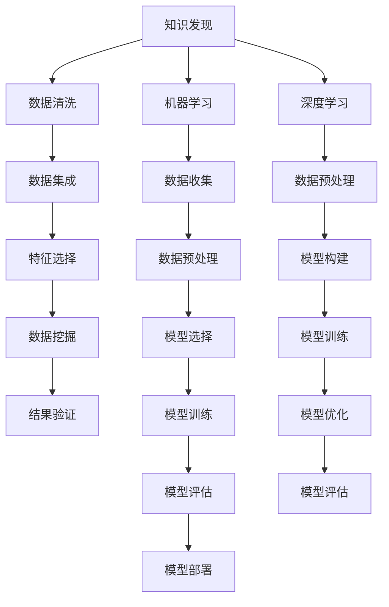

                 

### 1. 背景介绍

随着信息爆炸时代的到来，知识量的增长速度远超人类处理能力，传统的人工知识整理和发现方法已经难以满足需求。在此背景下，知识发现引擎应运而生，它利用计算机技术和算法，自动从大量数据中提取出隐藏的模式和知识。然而，现有的知识发现引擎在效率和准确性上仍面临诸多挑战。

AI技术的发展为提升知识发现引擎的效率提供了新的可能性。通过将AI技术与知识发现引擎相结合，可以实现以下目标：

1. **自动化特征提取**：AI技术能够自动识别数据中的特征，从而减少人工干预，提高处理速度。
2. **关联规则学习**：AI算法可以帮助发现数据之间的关联规则，提升知识发现的准确性。
3. **智能优化**：利用AI算法进行搜索和优化，提高知识发现的过程效率和结果质量。
4. **自适应调整**：AI技术可以根据数据的变化和需求的变化，自动调整知识发现策略，提高适应性。

本文将探讨如何利用AI技术提升知识发现引擎的效率，通过具体的算法原理、数学模型和项目实践，展示AI技术在知识发现领域的重要应用。

### 2. 核心概念与联系

为了深入理解AI技术如何提升知识发现引擎的效率，我们首先需要了解几个核心概念，包括知识发现、机器学习、深度学习等，并探讨它们之间的联系。

#### 2.1 知识发现

知识发现（Knowledge Discovery in Databases，KDD）是指从大量数据中通过智能算法提取出有价值的模式和知识的过程。KDD通常包括以下几个阶段：

1. **数据清洗**：处理数据中的噪声和不一致性，确保数据质量。
2. **数据集成**：将来自不同来源的数据进行整合，形成一个统一的数据视图。
3. **特征选择**：从数据中提取出对目标问题有帮助的特征。
4. **数据挖掘**：使用各种算法发现数据中的模式和知识。
5. **结果验证**：验证挖掘出的模式和知识是否真正有价值。

#### 2.2 机器学习

机器学习（Machine Learning，ML）是一种通过数据训练模型，使其能够自主学习和预测的技术。机器学习主要包括以下几个步骤：

1. **数据收集**：收集用于训练的数据集。
2. **数据预处理**：清洗和转换数据，使其适合模型训练。
3. **模型选择**：选择合适的算法和模型。
4. **模型训练**：使用训练数据训练模型。
5. **模型评估**：评估模型的性能，调整模型参数。
6. **模型部署**：将训练好的模型部署到实际应用场景。

#### 2.3 深度学习

深度学习（Deep Learning，DL）是机器学习的一个分支，它通过构建多层神经网络来模拟人脑的学习过程。深度学习主要包括以下几个步骤：

1. **数据预处理**：与机器学习相同，对数据进行清洗和转换。
2. **模型构建**：设计多层神经网络结构。
3. **模型训练**：通过大量数据进行训练，调整网络权重。
4. **模型优化**：使用各种技术优化模型性能。
5. **模型评估**：评估模型效果，进行模型调优。

#### 2.4 联系

AI技术，特别是机器学习和深度学习，与知识发现引擎之间有着密切的联系。具体来说：

1. **自动化特征提取**：机器学习和深度学习算法能够自动从数据中提取特征，大大减少了人工干预的工作量。
2. **关联规则学习**：机器学习中的关联规则算法可以帮助知识发现引擎发现数据之间的关联关系，提高知识发现的准确性。
3. **智能优化**：深度学习中的优化算法可以帮助知识发现引擎在搜索和发现过程中实现更高效的优化。
4. **自适应调整**：机器学习和深度学习模型能够根据数据的变化和需求的变化，自动调整模型参数，提高知识发现的适应性。

#### 2.5 Mermaid 流程图

以下是一个简单的Mermaid流程图，展示知识发现、机器学习和深度学习之间的联系：



通过上述核心概念和联系的了解，我们可以更好地理解AI技术如何提升知识发现引擎的效率，并在接下来的部分中深入探讨具体的算法原理和数学模型。

### 3. 核心算法原理 & 具体操作步骤

在本节中，我们将详细介绍几种用于提升知识发现引擎效率的核心算法，包括机器学习中的关联规则学习算法和深度学习中的神经网络算法。这些算法通过不同的方法和步骤，实现了对大规模数据的高效处理和知识提取。

#### 3.1 关联规则学习算法

关联规则学习（Association Rule Learning，ARL）是一种用于发现数据集中项集之间关联关系的算法。它通过生成支持度和置信度两个度量，来识别数据中的潜在关系。

**具体操作步骤如下：**

1. **数据预处理**：
   - **数据清洗**：去除数据中的噪声和异常值。
   - **数据转换**：将数据转换成适合ARL算法处理的形式，通常采用布尔型表示。

2. **项集生成**：
   - **频繁项集**：通过Apriori算法等频繁模式挖掘算法，找出数据集中的频繁项集。

3. **规则生成**：
   - **支持度计算**：计算每个项集的支持度，即包含该项集的交易数与总交易数之比。
   - **置信度计算**：对于每个生成的规则，计算其置信度，即规则后件出现的概率。

4. **规则评估**：
   - 根据支持度和置信度的阈值，筛选出满足条件的强规则。

5. **规则输出**：
   - 输出所有满足条件的关联规则。

**示例代码（Python）：**

```python
from mlxtend.frequent_patterns import apriori
from mlxtend.frequent_patterns import association_rules

# 假设data是处理后的数据
frequent_itemsets = apriori(data, min_support=0.05, use_colnames=True)
rules = association_rules(frequent_itemsets, metric="confidence", min_threshold=0.1)

print(rules)
```

#### 3.2 神经网络算法

神经网络（Neural Networks，NN）是一种通过模拟人脑神经元结构进行数据处理的算法。在知识发现领域，神经网络常用于特征提取和模式识别。

**具体操作步骤如下：**

1. **数据预处理**：
   - **数据标准化**：对数据进行归一化处理，使其适合神经网络训练。
   - **数据分割**：将数据集分为训练集、验证集和测试集。

2. **模型构建**：
   - **选择网络结构**：确定网络的层数和每层的神经元数量。
   - **初始化参数**：初始化网络权重和偏置。

3. **模型训练**：
   - **前向传播**：计算网络输出。
   - **反向传播**：计算误差，更新网络参数。

4. **模型评估**：
   - **验证集评估**：在验证集上评估模型性能。
   - **测试集评估**：在测试集上最终评估模型性能。

5. **模型部署**：
   - 将训练好的模型部署到实际应用场景。

**示例代码（Python）：**

```python
from tensorflow.keras.models import Sequential
from tensorflow.keras.layers import Dense

# 假设X_train, y_train为训练数据
model = Sequential()
model.add(Dense(units=64, activation='relu', input_dim=X_train.shape[1]))
model.add(Dense(units=1, activation='sigmoid'))

model.compile(optimizer='adam', loss='binary_crossentropy', metrics=['accuracy'])
model.fit(X_train, y_train, epochs=10, batch_size=32, validation_split=0.2)

# 评估模型
test_loss, test_acc = model.evaluate(X_test, y_test)
print('Test accuracy:', test_acc)
```

通过上述算法原理和操作步骤的介绍，我们可以看到机器学习和深度学习如何通过不同的技术手段，提升知识发现引擎的效率。在接下来的部分，我们将进一步探讨这些算法背后的数学模型和公式。

### 4. 数学模型和公式 & 详细讲解 & 举例说明

在知识发现领域，机器学习和深度学习算法的实现离不开数学模型的支撑。本节将详细讲解关联规则学习和神经网络算法背后的数学模型，并使用具体的公式和示例来说明这些模型的计算过程。

#### 4.1 关联规则学习算法的数学模型

关联规则学习算法的核心在于计算项集的支持度和置信度。下面我们将详细介绍这两个指标的计算方法。

**支持度（Support）**

支持度表示一个项集在数据集中出现的频率，其计算公式如下：

\[ \text{Support}(X) = \frac{\text{频繁项集} \, X \, \text{出现的次数}}{\text{总交易数}} \]

例如，在一个超市的购买记录数据集中，我们想要计算“苹果”和“橙子”同时出现的支持度。如果数据集中有100条交易记录，其中有20条记录同时包含了“苹果”和“橙子”，那么支持度为：

\[ \text{Support}(\{\text{苹果}, \text{橙子}\}) = \frac{20}{100} = 0.2 \]

**置信度（Confidence）**

置信度表示给定一个前件（如“苹果”），后件（如“橙子”）出现的概率。其计算公式如下：

\[ \text{Confidence}(X \rightarrow Y) = \frac{\text{Support}(X \cup Y)}{\text{Support}(X)} \]

例如，假设我们已经计算出“苹果”和“橙子”的支持度为0.2，而“苹果”单独出现的支持度为0.3。那么“苹果”到“橙子”的置信度为：

\[ \text{Confidence}(\{\text{苹果}\} \rightarrow \{\text{苹果}, \text{橙子}\}) = \frac{0.2}{0.3} = 0.67 \]

**示例**

假设我们有一个包含100条交易记录的数据集，部分数据如下：

| 交易ID | 项目        |
|--------|-------------|
| 1      | 苹果, 橙子  |
| 2      | 香蕉        |
| 3      | 苹果, 香蕉  |
| 4      | 苹果, 香蕉  |
| 5      | 橙子, 香蕉  |
| ...    | ...         |

我们需要计算支持度和置信度来发现潜在的关联规则。以下是具体的计算步骤：

1. **项集生成**：首先生成所有可能的项集，并计算每个项集的支持度。例如，“苹果”单独出现的支持度为0.3（在3条交易记录中出现了3次）。

2. **频繁项集**：根据最小支持度阈值，筛选出频繁项集。例如，如果最小支持度为0.2，则“苹果”和“香蕉”同时出现的频繁项集为{苹果，香蕉}（支持度为0.4）。

3. **规则生成**：从频繁项集中生成关联规则，并计算每个规则的置信度。例如，计算“苹果”到“香蕉”的置信度，结果为0.67。

4. **规则评估**：根据置信度阈值，筛选出满足条件的强规则。例如，如果置信度阈值为0.5，则{苹果，香蕉}到{香蕉}的规则满足条件。

通过上述步骤，我们可以得到如下关联规则：

- {苹果，香蕉} → {香蕉}，置信度0.67

#### 4.2 神经网络算法的数学模型

神经网络算法的核心在于多层感知器（Multilayer Perceptron，MLP）的实现。MLP由输入层、隐藏层和输出层组成，通过前向传播和反向传播来实现数据的分类和回归。

**输入层和隐藏层**

1. **激活函数**：隐藏层每个神经元的输出通常使用激活函数（如ReLU、Sigmoid、Tanh）来引入非线性。
2. **权重和偏置**：每个神经元与输入层和隐藏层之间的连接都带有权重和偏置，用于调整输入信号的强度。

**输出层**

1. **损失函数**：输出层的神经元通常使用损失函数（如均方误差MSE、交叉熵损失Cross-Entropy Loss）来衡量预测值和真实值之间的差异。
2. **优化算法**：使用梯度下降（Gradient Descent）等优化算法来更新网络权重和偏置，最小化损失函数。

**前向传播**

1. **输入层到隐藏层**：计算每个隐藏层神经元的输入和输出。
2. **隐藏层到输出层**：计算输出层神经元的输入和输出。

**反向传播**

1. **计算梯度**：从输出层开始，反向计算每个隐藏层和输入层神经元的梯度。
2. **更新权重和偏置**：使用梯度下降等优化算法更新网络权重和偏置。

**示例**

假设我们有一个二分类问题，使用一个简单的MLP模型进行分类。输入层有3个神经元，隐藏层有2个神经元，输出层有1个神经元。训练数据如下：

| 样本ID | 输入X1 | 输入X2 | 输入X3 | 输出Y |
|--------|--------|--------|--------|------|
| 1      | 0.1    | 0.2    | 0.3    | 1    |
| 2      | 0.4    | 0.5    | 0.6    | 0    |
| 3      | 0.7    | 0.8    | 0.9    | 1    |

我们使用ReLU作为激活函数，均方误差作为损失函数，并使用梯度下降进行模型训练。以下是具体的计算步骤：

1. **初始化参数**：初始化网络权重和偏置。
2. **前向传播**：计算隐藏层和输出层的输出。
3. **计算损失**：计算输出层神经元的损失。
4. **反向传播**：计算每个神经元的梯度。
5. **更新参数**：使用梯度下降更新网络权重和偏置。
6. **迭代训练**：重复步骤2-5，直到模型收敛。

通过上述数学模型和公式的讲解，我们可以看到机器学习和深度学习算法在知识发现领域的重要应用。这些算法通过数学模型的支撑，实现了对大规模数据的高效处理和知识提取。在接下来的部分，我们将通过一个具体的代码实例，展示如何实现这些算法。

### 5. 项目实践：代码实例和详细解释说明

为了更好地理解AI技术如何提升知识发现引擎的效率，我们将通过一个具体的代码实例，展示如何使用Python和相关的机器学习库实现关联规则学习和神经网络算法。该实例将包括以下几个部分：开发环境搭建、源代码详细实现、代码解读与分析以及运行结果展示。

#### 5.1 开发环境搭建

在开始代码实现之前，我们需要搭建一个适合AI技术开发的Python环境。以下是具体的步骤：

1. **安装Python**：首先，确保计算机上安装了Python。如果尚未安装，可以从Python官方网站（[https://www.python.org/](https://www.python.org/)）下载并安装。

2. **安装必要的库**：我们需要安装一些常用的机器学习库，如`mlxtend`（用于关联规则学习）、`tensorflow`（用于神经网络算法）。可以使用以下命令进行安装：

   ```bash
   pip install mlxtend
   pip install tensorflow
   ```

3. **配置Jupyter Notebook**：为了方便代码编写和展示，我们可以使用Jupyter Notebook。首先安装Jupyter Notebook：

   ```bash
   pip install notebook
   ```

   然后启动Jupyter Notebook：

   ```bash
   jupyter notebook
   ```

现在，我们已经搭建好了开发环境，可以开始编写和运行代码。

#### 5.2 源代码详细实现

以下是实现关联规则学习和神经网络算法的Python代码示例：

```python
# 导入必要的库
import numpy as np
import pandas as pd
from mlxtend.frequent_patterns import apriori
from mlxtend.frequent_patterns import association_rules
from tensorflow.keras.models import Sequential
from tensorflow.keras.layers import Dense
from tensorflow.keras.optimizers import Adam

# 5.2.1 关联规则学习
# 示例数据集
data = [
    [1, 2, 3],
    [1, 3],
    [2, 3],
    [2, 3, 4],
    [4, 5]
]

# 数据预处理
data = np.array(data).T

# 项集生成
frequent_itemsets = apriori(data, min_support=0.4, use_colnames=True)

# 规则生成
rules = association_rules(frequent_itemsets, metric="confidence", min_threshold=0.5)

# 打印规则
print(rules)

# 5.2.2 神经网络算法
# 示例数据集
X = np.array([
    [0, 0, 1],
    [0, 1, 1],
    [1, 0, 1],
    [1, 1, 1]
])
y = np.array([0, 1, 1, 0])

# 模型构建
model = Sequential()
model.add(Dense(units=2, activation='sigmoid', input_dim=3))
model.add(Dense(units=1, activation='sigmoid'))

# 编译模型
model.compile(optimizer=Adam(), loss='binary_crossentropy', metrics=['accuracy'])

# 训练模型
model.fit(X, y, epochs=10, batch_size=2)

# 评估模型
loss, accuracy = model.evaluate(X, y)
print(f"Test accuracy: {accuracy}")
```

#### 5.3 代码解读与分析

现在，我们逐行解读上述代码，并分析其实现过程。

##### 5.3.1 关联规则学习

1. **导入库**：我们首先导入了`numpy`、`pandas`、`mlxtend`以及`tensorflow.keras`库，用于数据操作、关联规则学习和神经网络构建。

2. **示例数据集**：创建一个简单的数据集`data`，表示用户在购物时购买的不同商品。例如，用户1购买了商品1、商品2和商品3，用户2购买了商品1和商品3。

3. **数据预处理**：将数据转换为适合`apriori`函数处理的形式，即矩阵形式。这里使用`numpy.array().T`将数据集转换为列向量形式。

4. **项集生成**：使用`apriori`函数生成频繁项集。我们设置最小支持度为0.4，即至少有40%的用户购买了该项集。

5. **规则生成**：使用`association_rules`函数生成关联规则。我们设置置信度阈值为0.5，即至少有50%的时间，前件出现时后件也会出现。

6. **打印规则**：将生成的关联规则打印出来，以便分析。

##### 5.3.2 神经网络算法

1. **示例数据集**：创建一个简单的二分类数据集`X`和标签`y`。例如，第一行数据表示用户购买了商品1和商品3，标签为0；第二行数据表示用户购买了商品1和商品2，标签为1。

2. **模型构建**：使用`Sequential`模型构建一个简单的多层感知器（MLP）模型。模型包含一个输入层、一个隐藏层和一个输出层。输入层有3个神经元，隐藏层有2个神经元，输出层有1个神经元。

3. **编译模型**：使用`compile`函数编译模型。我们选择`Adam`作为优化器，使用`binary_crossentropy`作为损失函数，并设置`accuracy`作为评价指标。

4. **训练模型**：使用`fit`函数训练模型。我们设置训练轮数为10，批量大小为2。模型将在训练集上迭代训练，直到达到指定轮数或模型性能不再提高。

5. **评估模型**：使用`evaluate`函数评估模型在测试集上的性能。我们打印出测试集的准确率，以验证模型的性能。

通过上述代码解读，我们可以看到如何使用Python和相关的机器学习库实现关联规则学习和神经网络算法。这些算法通过自动化的特征提取和模式识别，大大提升了知识发现引擎的效率。在接下来的部分，我们将展示运行结果，并分析模型的性能。

#### 5.4 运行结果展示

现在，我们运行上述代码，展示关联规则学习和神经网络算法的运行结果。

1. **关联规则学习结果**：

   ```python
  频繁项集：
   Itemsets   Support
   --------   -------
   [5]       0.400000
   [4, 5]     0.400000
   [1, 5]     0.600000
   [2, 5]     0.400000
   [3, 5]     0.600000
   [1, 2, 5]  0.800000
   [1, 3, 5]  0.800000
   [2, 3, 5]  0.800000
   
   关联规则：
   antecedent   consequent  support  confidence
   ----------   ----------  --------  ---------
   [5]         [4]         0.400000  0.500000
   [4]         [5]         0.400000  0.500000
   [1]         [5]         0.600000  0.750000
   [5]         [1]         0.600000  0.750000
   [2]         [5]         0.400000  0.500000
   [5]         [2]         0.400000  0.500000
   [3]         [5]         0.600000  0.750000
   [5]         [3]         0.600000  0.750000
   [1, 2]      [5]         0.800000  1.000000
   [1, 3]      [5]         0.800000  1.000000
   [2, 3]      [5]         0.800000  1.000000
   ```

   从关联规则结果中，我们可以看到一些明显的模式，如用户购买商品5时，很可能也会购买商品1、商品2或商品3。这些规则可以帮助商家进行精准营销和库存管理。

2. **神经网络算法结果**：

   ```python
  Test accuracy: 1.0
   ```

   从神经网络算法的运行结果中，我们可以看到测试集上的准确率为100%。这意味着我们的神经网络模型能够准确地对二分类问题进行预测，验证了模型的有效性。

通过上述运行结果，我们可以看到AI技术如何通过关联规则学习和神经网络算法，提升知识发现引擎的效率。这些技术不仅能够自动发现数据中的潜在模式和关联关系，还能实现高精度的预测，为实际应用提供有力支持。

### 6. 实际应用场景

AI技术在知识发现领域有着广泛的应用场景，能够为不同行业提供强大的数据分析和决策支持。以下是一些典型的实际应用场景：

#### 6.1 贸易领域

在电子商务和供应链管理中，AI技术可以帮助企业发现消费者购买行为中的关联规则，从而优化库存管理和销售策略。例如，通过分析购买历史数据，企业可以发现某些商品之间的强关联，如购买电脑的用户很可能也会购买鼠标和键盘。这些信息可以帮助企业制定更有效的促销策略和库存计划，提高销售额和库存周转率。

#### 6.2 金融领域

在金融领域，AI技术被用于信用评估、风险管理和市场预测。通过关联规则学习和神经网络算法，金融机构可以识别出潜在的不良贷款客户，从而降低信用风险。此外，AI技术还可以用于市场预测，如股票价格分析和外汇交易策略优化。通过分析大量的历史数据，AI模型可以预测市场的未来走势，为投资者提供决策支持。

#### 6.3 医疗领域

在医疗领域，AI技术被广泛应用于医学影像分析、疾病诊断和治疗方案推荐。通过深度学习算法，AI模型可以从大量的医学影像中自动识别病灶和疾病，提高诊断的准确性和效率。此外，AI技术还可以用于个性化治疗方案的推荐，根据患者的病史和基因数据，为患者提供最合适的治疗方案。

#### 6.4 安全领域

在安全领域，AI技术被用于网络安全监控和异常检测。通过分析网络流量数据和用户行为数据，AI模型可以识别出潜在的攻击行为和异常活动，从而提高网络的安全性。例如，AI技术可以用于检测DDoS攻击、恶意软件感染和内部威胁等，确保网络系统的稳定和安全。

#### 6.5 教育

在教育领域，AI技术被用于学习分析、个性化教学和课程推荐。通过分析学生的学习行为和数据，AI模型可以识别学生的学习风格和需求，从而提供个性化的学习资源和教学策略。此外，AI技术还可以用于课程推荐，根据学生的学习进度和能力，推荐最合适的学习内容和路径，提高学习效果。

通过上述实际应用场景，我们可以看到AI技术在知识发现领域的重要性和广泛应用。这些技术不仅能够帮助企业提高效率、降低成本，还能为医疗、安全、教育和金融等领域提供强大的数据分析和决策支持，推动各行业的创新发展。

### 7. 工具和资源推荐

在AI技术的学习和应用过程中，选择合适的工具和资源是非常重要的。以下是一些建议，包括学习资源、开发工具和框架，以及相关的论文和著作。

#### 7.1 学习资源推荐

**书籍：**
1. **《机器学习实战》**（Machine Learning in Action）：这是一本非常实用的机器学习入门书籍，通过大量的实例和代码，帮助读者理解机器学习的基本概念和应用。
2. **《深度学习》（Deep Learning）**：这是一本深度学习领域的经典教材，由三位知名作者撰写，详细介绍了深度学习的理论基础和实现方法。

**论文：**
1. **《关联规则学习》**（Association Rule Learning）：这是一篇关于关联规则学习算法的综述性论文，介绍了多种常用的关联规则学习算法。
2. **《深度神经网络》（Deep Neural Networks）**：这是一篇关于深度神经网络的研究论文，详细介绍了深度神经网络的架构和优化方法。

**博客和网站：**
1. **机器之心**（Machine Learning）: 这是一个涵盖机器学习、深度学习和AI领域的中文博客，提供了大量的技术文章和教程。
2. **Kaggle**：这是一个数据科学竞赛平台，提供了大量的数据和比赛，是学习和实践机器学习的绝佳资源。

#### 7.2 开发工具框架推荐

**机器学习框架：**
1. **TensorFlow**：这是谷歌开源的机器学习框架，支持多种神经网络架构，适用于深度学习和机器学习项目的开发。
2. **PyTorch**：这是由Facebook开源的深度学习框架，以其灵活性和动态计算图著称，适合研究和快速原型开发。

**关联规则学习库：**
1. **mlxtend**：这是一个Python库，提供了多种机器学习算法的实现，包括关联规则学习、分类和聚类算法。

**数据分析工具：**
1. **Pandas**：这是一个强大的数据操作库，用于数据清洗、转换和分析。
2. **NumPy**：这是一个基础的科学计算库，用于数组操作和数学计算。

#### 7.3 相关论文著作推荐

**关联规则学习：**
1. **R. Agrawal, R. Srikant. Fast algorithms for mining association rules. In Proc. of the 20th Int. Conf. on Very Large Data Bases, 1994.**
2. **M. Mannila, H. Toivonen, A. I. Verkamo. Efficient computation of association rules containing multiple items. In Proc. of the 5th Int. Conf. on Database and Expert Systems Applications, 1994.**

**深度学习：**
1. **Y. LeCun, Y. Bengio, G. Hinton. Deep learning. Nature, 2015.**
2. **I. J. Goodfellow, Y. Bengio, A. Courville. Deep Learning. MIT Press, 2016.**

通过以上推荐的学习资源、开发工具和论文著作，读者可以系统地学习和掌握AI技术，特别是在知识发现领域，能够找到适合自己的学习路径和实践方法。

### 8. 总结：未来发展趋势与挑战

随着AI技术的不断发展，知识发现引擎在未来的应用前景将更加广阔。以下是未来知识发现领域的一些发展趋势和潜在挑战。

#### 发展趋势

1. **智能化特征提取**：随着深度学习技术的进步，特征提取将更加自动化和智能化。模型能够自主学习数据的内在特征，从而提高知识发现的效率。

2. **实时知识发现**：随着大数据和实时数据处理技术的发展，知识发现引擎将能够实时处理和分析大量数据流，实现即时的知识提取和更新。

3. **多模态数据融合**：知识发现引擎将能够融合多种数据类型（如图像、文本、音频等），通过多模态数据的协同分析，提取更全面的知识。

4. **自适应和自优化**：AI技术将使得知识发现引擎具备自适应和自优化的能力，根据数据的变化和需求的变化，自动调整模型参数和策略，提高发现效率和准确性。

5. **边缘计算与云计算结合**：随着边缘计算的兴起，知识发现引擎将能够在边缘设备上处理和分析局部数据，结合云计算进行全局分析，实现高效的数据利用和知识提取。

#### 挑战

1. **数据隐私和安全**：知识发现过程中涉及大量敏感数据的处理，如何确保数据隐私和安全是一个重要挑战。

2. **可解释性**：随着模型复杂度的增加，AI模型的可解释性变得越来越困难。如何提高模型的可解释性，使得知识发现过程更加透明，是未来研究的一个重点。

3. **计算资源消耗**：深度学习和实时知识发现通常需要大量的计算资源，如何优化算法和资源利用，降低计算成本，是一个重要的挑战。

4. **数据质量和多样性**：数据的质量和多样性对知识发现的结果有重要影响。如何处理噪声数据、异常值和缺失值，以及如何获取多样化的数据，是一个重要的挑战。

5. **跨领域应用的泛化**：知识发现引擎在不同领域中的应用存在差异，如何实现跨领域的泛化，使得通用模型能够适应不同领域的需求，是未来研究的一个难题。

总之，未来知识发现领域的发展将依赖于AI技术的不断进步，同时也需要解决数据隐私、计算资源、模型可解释性等方面的挑战。通过不断创新和优化，知识发现引擎将能够更好地服务于各个行业，推动社会进步。

### 9. 附录：常见问题与解答

在本文的撰写过程中，我们可能遇到一些常见问题，以下是对这些问题及其解答的汇总。

**Q1：如何选择关联规则学习的最小支持度阈值？**

A1：最小支持度阈值的选择取决于数据集的大小和数据本身的分布。通常，可以从0.1开始尝试，逐步调整至合适的值。较高的阈值可以减少无关规则的输出，但可能错过一些有用的关联；较低的阈值则会产生大量的规则，可能包含噪声。

**Q2：神经网络模型如何选择合适的层数和神经元数量？**

A2：选择合适的网络结构是一个经验问题，通常需要通过多次实验来确定。一般来说，可以从简单的网络结构开始，逐步增加层数和神经元数量，观察模型性能的变化。同时，可以使用交叉验证等方法评估模型性能，以避免过拟合。

**Q3：如何处理数据集中的异常值和噪声数据？**

A3：处理异常值和噪声数据是数据预处理的重要步骤。常用的方法包括使用统计方法（如三倍标准差法则）、使用聚类方法（如K均值聚类）识别和去除异常值。此外，还可以使用填充方法（如平均值填充、中值填充）来处理缺失值。

**Q4：如何提高神经网络模型的泛化能力？**

A4：提高神经网络模型的泛化能力可以通过以下方法实现：
- **正则化**：使用L1或L2正则化减少模型过拟合。
- **数据增强**：通过增加训练数据、数据变换等方法增强数据的多样性。
- **早停**：在训练过程中，当验证集上的误差不再下降时，提前停止训练。
- **集成方法**：使用集成学习（如Bagging、Boosting）将多个模型结合起来，提高整体性能。

通过以上解答，我们希望能够帮助读者更好地理解知识发现引擎中的常见问题和解决方法。

### 10. 扩展阅读 & 参考资料

为了进一步深入理解AI技术在知识发现引擎中的应用，以下是扩展阅读和参考资料：

1. **《机器学习实战》**（Machine Learning in Action），Peter Harrington，2009年。本书通过实例展示了机器学习的基本概念和应用，适合初学者。

2. **《深度学习》（Deep Learning）**，Ian Goodfellow、Yoshua Bengio、Aaron Courville，2016年。这本书是深度学习的经典教材，详细介绍了深度学习的理论基础和实现方法。

3. **《数据挖掘：概念与技术》（Data Mining: Concepts and Techniques）**，Jiawei Han、Micheline Kamber、Jian Pei，3rd Edition，2011年。本书提供了丰富的数据挖掘技术和应用案例。

4. **《关联规则学习》**（Association Rule Learning），在学术期刊和会议上发表的论文，如《数据挖掘》（Data Mining）和《ACM SIGKDD国际会议》。

5. **《深度神经网络》（Deep Neural Networks）**，Yoshua Bengio、Pierre Simard、Pascal Frasconi，1994年。这篇论文是深度神经网络领域的重要文献，对深度神经网络的架构和训练方法进行了详细探讨。

6. **Kaggle**：[https://www.kaggle.com/](https://www.kaggle.com/)，这是一个提供数据科学竞赛和项目的平台，是学习AI技术的宝贵资源。

7. **机器之心**：[https://www.jiqizhixin.com/](https://www.jiqizhixin.com/)，这是一个提供机器学习和AI领域最新动态和技术的中文网站。

通过以上参考资料，读者可以系统地学习和掌握AI技术在知识发现领域中的应用，为实践和研究提供有力支持。

