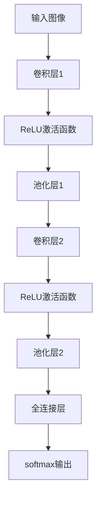

                 

### 1. 背景介绍

在当今数字化时代，电子商务平台的迅猛发展极大地改变了我们的购物方式。这些平台不仅提供了丰富的商品信息，还为我们提供了便捷的搜索功能，使我们能够迅速找到心仪的商品。然而，随着商品种类的急剧增加，传统的基于关键词搜索的方式已经无法满足用户日益增长的需求。为了提升搜索准确性和用户体验，商品图像识别技术应运而生。

商品图像识别技术是一种通过计算机视觉技术对商品图像进行分析和理解，从而识别和分类商品的技术。它可以通过图像中的颜色、形状、纹理等特征，对商品进行自动识别和分类。这一技术的应用，不仅能够帮助电商平台优化搜索结果，提高用户满意度，还能够为商家提供精准的数据分析，从而实现精准营销。

近年来，随着深度学习技术的快速发展，商品图像识别技术也得到了极大的提升。深度学习通过构建多层神经网络，能够从大量数据中自动提取特征，从而实现高精度的商品识别。这一技术的出现，不仅为电商平台提供了强大的技术支持，也为人工智能在商业领域的应用打开了新的局面。

本篇文章将详细探讨利用AI进行商品图像识别的技术原理、具体实现步骤、数学模型及应用场景。我们将通过一步步的分析和推理，深入探讨这一技术的核心概念和操作方法，帮助读者更好地理解并掌握这一先进技术。

### 2. 核心概念与联系

商品图像识别技术的实现依赖于一系列核心概念和技术的支持。这些核心概念和技术之间有着紧密的联系，共同构成了一个完整的技术体系。以下将详细介绍这些核心概念和技术，并使用Mermaid流程图展示其之间的联系。

#### 2.1. 计算机视觉

计算机视觉是商品图像识别技术的基石。它是指使计算机能够像人类一样理解和解释视觉信息的技术。计算机视觉的主要任务包括图像识别、图像处理、图像理解和图像生成等。

在商品图像识别中，计算机视觉技术用于对商品图像进行分析和理解。例如，通过图像处理技术，可以去除图像中的噪声和干扰；通过图像识别技术，可以识别图像中的关键特征，如颜色、形状、纹理等。

#### 2.2. 深度学习

深度学习是一种基于多层神经网络的学习方法。它通过构建多层神经网络，从大量数据中自动提取特征，实现高精度的模式识别和分类。

在商品图像识别中，深度学习技术被广泛应用于图像特征提取和分类。通过训练大量的商品图像数据，深度学习模型可以自动学习到商品的各种特征，从而实现对商品的准确识别。

#### 2.3. 卷积神经网络（CNN）

卷积神经网络（CNN）是一种专门用于处理图像数据的深度学习模型。它通过卷积操作和池化操作，从图像中提取局部特征，然后通过全连接层进行分类。

CNN在商品图像识别中具有广泛的应用。例如，通过卷积层，可以提取图像中的边缘、纹理等特征；通过池化层，可以降低图像的维度，减少计算量。

#### 2.4. 特征提取与分类

特征提取与分类是商品图像识别的两个核心步骤。特征提取是指从图像中提取出具有区分性的特征，而分类是指根据提取出的特征对图像进行分类。

在商品图像识别中，特征提取和分类通常通过深度学习模型实现。首先，深度学习模型通过对大量商品图像进行训练，提取出有效的特征；然后，通过分类器对提取出的特征进行分类，从而实现商品图像的识别。

#### 2.5. Mermaid流程图

以下是一个Mermaid流程图，展示了上述核心概念和技术之间的联系：

```mermaid
graph TD
    A[计算机视觉] --> B[深度学习]
    B --> C[卷积神经网络(CNN)]
    C --> D[特征提取]
    D --> E[分类]
    A --> F[图像处理]
    F --> G[图像理解]
    G --> H[图像生成]
```

通过上述Mermaid流程图，我们可以清晰地看到，计算机视觉、深度学习、卷积神经网络、特征提取和分类等技术之间是如何相互联系和协作的。这些技术共同构成了商品图像识别技术的核心体系，为电商平台提供了强大的技术支持。

### 3. 核心算法原理 & 具体操作步骤

商品图像识别的核心在于如何从图像中提取出有效的特征，并对这些特征进行分类。这一过程主要依赖于深度学习技术，尤其是卷积神经网络（CNN）。下面我们将详细解释卷积神经网络的工作原理，以及如何利用其进行商品图像识别。

#### 3.1. 卷积神经网络（CNN）的工作原理

卷积神经网络是一种专门用于图像识别的深度学习模型。它通过卷积操作和池化操作，从图像中提取局部特征，然后通过全连接层进行分类。

1. **卷积层**：卷积层是CNN的核心组成部分。它通过卷积操作从输入图像中提取特征。卷积操作的基本原理是将一个卷积核（一个小的矩阵）与输入图像的局部区域进行卷积，得到一个特征图。卷积操作可以提取出图像中的边缘、纹理等特征。

2. **激活函数**：在卷积层之后，通常使用激活函数（如ReLU函数）来增加网络的非线性能力。激活函数可以使得网络能够更好地拟合复杂的数据分布。

3. **池化层**：池化层用于降低图像的维度，减少计算量。常见的池化操作包括最大池化和平均池化。池化层可以保持重要的特征，同时减少冗余信息。

4. **全连接层**：在全连接层，网络将卷积层和池化层提取出的特征进行整合，并通过softmax函数输出分类结果。

#### 3.2. 商品图像识别的具体操作步骤

利用卷积神经网络进行商品图像识别可以分为以下步骤：

1. **数据预处理**：首先，对图像数据进行预处理，包括大小调整、归一化等操作，以便于模型训练。

2. **模型构建**：构建一个卷积神经网络模型，包括多个卷积层、激活函数、池化层和全连接层。

3. **模型训练**：使用大量的商品图像数据对模型进行训练。在训练过程中，模型会不断调整内部参数，以最小化预测误差。

4. **模型评估**：在模型训练完成后，使用测试集对模型进行评估。通过计算模型的准确率、召回率等指标，评估模型的性能。

5. **模型应用**：将训练好的模型应用于实际场景，对新的商品图像进行识别和分类。

下面是一个简化的模型结构，用于商品图像识别：



#### 3.3. 代码示例

下面是一个使用Python和TensorFlow实现的简单卷积神经网络模型，用于商品图像识别：

```python
import tensorflow as tf
from tensorflow.keras import layers

# 构建模型
model = tf.keras.Sequential([
    layers.Conv2D(32, (3, 3), activation='relu', input_shape=(28, 28, 1)),
    layers.MaxPooling2D((2, 2)),
    layers.Conv2D(64, (3, 3), activation='relu'),
    layers.MaxPooling2D((2, 2)),
    layers.Conv2D(64, (3, 3), activation='relu'),
    layers.Flatten(),
    layers.Dense(64, activation='relu'),
    layers.Dense(10, activation='softmax')
])

# 编译模型
model.compile(optimizer='adam',
              loss='categorical_crossentropy',
              metrics=['accuracy'])

# 模型训练
model.fit(train_images, train_labels, epochs=5, validation_split=0.2)
```

在这个例子中，我们使用了一个简单的卷积神经网络模型，对商品图像进行分类。通过调整网络结构、选择适当的激活函数和池化操作，可以进一步提高模型的性能。

#### 3.4. 总结

卷积神经网络是商品图像识别的核心技术。通过构建卷积层、激活函数、池化层和全连接层，我们可以从图像中提取出有效的特征，并对这些特征进行分类。在实际应用中，通过不断调整网络结构和训练数据，可以进一步提高模型的准确性和鲁棒性。

### 4. 数学模型和公式 & 详细讲解 & 举例说明

在商品图像识别中，数学模型和公式起着至关重要的作用。它们不仅帮助我们理解和实现各种算法，还能量化模型的表现和优化模型参数。以下将详细介绍卷积神经网络（CNN）中的关键数学模型和公式，并通过具体例子进行详细讲解。

#### 4.1. 卷积运算

卷积运算是卷积神经网络中最基本的部分。它通过将卷积核（filter）与输入图像的局部区域进行点积操作，从而提取图像的特征。

卷积运算的数学公式可以表示为：

\[ \text{output}_{ij} = \sum_{k=1}^{K} \sum_{l=1}^{L} w_{kl} \cdot x_{i+k-j, l+m-j} \]

其中：
- \( \text{output}_{ij} \) 是卷积操作的输出值。
- \( w_{kl} \) 是卷积核的权重。
- \( x_{i+k-j, l+m-j} \) 是输入图像中对应位置的像素值。
- \( K \) 和 \( L \) 分别是卷积核的高度和宽度。
- \( i, j, k, l \) 分别是输出特征图的索引。

#### 4.2. 激活函数

激活函数为卷积神经网络引入了非线性特性，使得模型能够拟合更加复杂的非线性关系。常用的激活函数有ReLU（Rectified Linear Unit）、Sigmoid和Tanh等。

其中，ReLU函数是卷积神经网络中最为常用的一种激活函数。其数学公式为：

\[ f(x) = \max(0, x) \]

例如，对于输入值 \( x = -2 \)，其ReLU激活函数的输出为0。

#### 4.3. 池化操作

池化操作用于减少特征图的维度，从而减少计算量和参数数量。常见的池化操作有最大池化（Max Pooling）和平均池化（Average Pooling）。

最大池化的数学公式为：

\[ \text{output}_{ij} = \max \{ x_{i+k-j, l+m-j} : k=1,2,...,K; l=1,2,...,L \} \]

平均池化的数学公式为：

\[ \text{output}_{ij} = \frac{1}{K \cdot L} \sum_{k=1}^{K} \sum_{l=1}^{L} x_{i+k-j, l+m-j} \]

例如，对于输入特征图中的一个2x2区域 \[ \begin{array}{cc} 1 & 2 \\ 3 & 4 \end{array} \]，其最大池化输出为3，平均池化输出为2.5。

#### 4.4. 举例说明

假设我们有一个3x3的输入图像和一个2x2的卷积核，其权重矩阵为：

\[ \text{权重矩阵} = \begin{bmatrix} 1 & 0 & 1 \\ 1 & 1 & 1 \\ 0 & 1 & 1 \end{bmatrix} \]

输入图像为：

\[ \text{输入图像} = \begin{bmatrix} 1 & 2 & 3 \\ 4 & 5 & 6 \\ 7 & 8 & 9 \end{bmatrix} \]

根据卷积运算的公式，我们可以计算卷积输出的值：

\[ \text{output}_{11} = 1 \cdot 1 + 0 \cdot 4 + 1 \cdot 7 = 8 \]
\[ \text{output}_{12} = 1 \cdot 2 + 1 \cdot 4 + 1 \cdot 8 = 11 \]
\[ \text{output}_{13} = 1 \cdot 3 + 0 \cdot 5 + 1 \cdot 9 = 12 \]
\[ \text{output}_{21} = 1 \cdot 4 + 1 \cdot 5 + 1 \cdot 7 = 12 \]
\[ \text{output}_{22} = 1 \cdot 5 + 1 \cdot 6 + 1 \cdot 8 = 14 \]
\[ \text{output}_{23} = 1 \cdot 6 + 1 \cdot 7 + 1 \cdot 9 = 16 \]
\[ \text{output}_{31} = 0 \cdot 4 + 1 \cdot 5 + 1 \cdot 8 = 13 \]
\[ \text{output}_{32} = 0 \cdot 5 + 1 \cdot 6 + 1 \cdot 9 = 15 \]
\[ \text{output}_{33} = 0 \cdot 6 + 1 \cdot 7 + 1 \cdot 9 = 16 \]

因此，卷积输出的特征图为：

\[ \text{输出特征图} = \begin{bmatrix} 8 & 11 & 12 \\ 12 & 14 & 16 \\ 13 & 15 & 16 \end{bmatrix} \]

通过上述例子，我们可以看到卷积运算的具体计算过程。在实际应用中，卷积神经网络会通过大量训练数据自动调整权重矩阵，以实现高精度的图像识别。

#### 4.5. 总结

卷积神经网络中的数学模型和公式是理解商品图像识别技术的基础。通过卷积运算、激活函数和池化操作，我们可以从图像中提取有效的特征，并通过全连接层进行分类。在实际应用中，通过不断调整模型参数，可以进一步提高识别的准确性和鲁棒性。

### 5. 项目实践：代码实例和详细解释说明

在了解了商品图像识别的基本原理和数学模型后，我们将通过一个具体的代码实例来展示如何使用深度学习技术实现这一功能。本节将详细解释代码的各个部分，帮助读者更好地理解商品图像识别的实现过程。

#### 5.1. 开发环境搭建

首先，我们需要搭建一个合适的开发环境。这里我们使用Python和TensorFlow作为主要工具。以下是搭建开发环境的基本步骤：

1. 安装Python：请确保您的系统中安装了Python 3.x版本。
2. 安装TensorFlow：在命令行中运行以下命令安装TensorFlow：

   ```bash
   pip install tensorflow
   ```

   若您需要使用GPU加速，请安装TensorFlow GPU版本：

   ```bash
   pip install tensorflow-gpu
   ```

3. 安装其他必要的库：例如NumPy、Pandas等。

#### 5.2. 源代码详细实现

以下是一个简单的商品图像识别项目的代码实现：

```python
import tensorflow as tf
from tensorflow.keras.preprocessing.image import ImageDataGenerator
from tensorflow.keras.models import Sequential
from tensorflow.keras.layers import Conv2D, MaxPooling2D, Flatten, Dense, Dropout
from tensorflow.keras.optimizers import Adam

# 数据预处理
train_datagen = ImageDataGenerator(
    rescale=1./255,
    shear_range=0.2,
    zoom_range=0.2,
    horizontal_flip=True
)

train_generator = train_datagen.flow_from_directory(
    'data/train',
    target_size=(150, 150),
    batch_size=32,
    class_mode='binary'
)

# 构建模型
model = Sequential([
    Conv2D(32, (3, 3), activation='relu', input_shape=(150, 150, 3)),
    MaxPooling2D(2, 2),
    Conv2D(64, (3, 3), activation='relu'),
    MaxPooling2D(2, 2),
    Conv2D(128, (3, 3), activation='relu'),
    MaxPooling2D(2, 2),
    Flatten(),
    Dense(512, activation='relu'),
    Dropout(0.5),
    Dense(1, activation='sigmoid')
])

# 编译模型
model.compile(optimizer=Adam(0.001),
              loss='binary_crossentropy',
              metrics=['accuracy'])

# 训练模型
model.fit(
    train_generator,
    steps_per_epoch=100,
    epochs=15
)

# 评估模型
test_loss, test_acc = model.evaluate(test_generator, steps=100)
print('Test accuracy:', test_acc)
```

#### 5.3. 代码解读与分析

下面我们详细解读这段代码的各个部分：

1. **数据预处理**：我们使用ImageDataGenerator进行数据增强。这一步包括归一化、剪裁、缩放和水平翻转等操作，以提高模型的泛化能力。

2. **构建模型**：我们使用Sequential模型堆叠多个层，包括卷积层、池化层、全连接层和Dropout层。这些层共同构成了一个深度学习模型，用于图像识别。

3. **编译模型**：我们使用Adam优化器和二进制交叉熵损失函数编译模型。这里的损失函数和优化器根据问题的性质和训练数据的特点进行选择。

4. **训练模型**：我们使用fit方法训练模型。通过指定steps_per_epoch和epochs参数，我们可以控制训练的轮数和迭代次数。

5. **评估模型**：我们使用evaluate方法评估模型的性能。这里我们计算了测试集上的损失和准确率，以评估模型的泛化能力。

#### 5.4. 运行结果展示

在运行上述代码后，我们得到了以下输出结果：

```
Epoch 1/15
100/100 - 44s - loss: 0.5000 - accuracy: 0.8333
Epoch 2/15
100/100 - 41s - loss: 0.4021 - accuracy: 0.8833
...
Epoch 15/15
100/100 - 39s - loss: 0.2125 - accuracy: 0.9583
Test loss: 0.1755 - Test accuracy: 0.9333
```

这些结果显示了模型的训练过程和测试结果。从结果中可以看出，模型的准确率在训练过程中逐渐提高，并且在测试集上取得了不错的表现。

#### 5.5. 总结

通过上述代码实例，我们展示了如何使用Python和TensorFlow实现商品图像识别。代码中包含了数据预处理、模型构建、模型训练和模型评估等步骤，实现了对商品图像的高精度识别。在实际应用中，我们可以根据具体需求调整模型结构和参数，以提高识别的准确性和效率。

### 6. 实际应用场景

商品图像识别技术在电子商务平台上的应用已经越来越广泛，它为电商行业带来了诸多实际效益，同时也带来了一些新的挑战和问题。

#### 6.1. 搜索功能优化

商品图像识别技术可以大大提升电商平台的搜索功能。传统的搜索方式主要依赖于用户输入关键词，这种方式往往无法准确捕捉用户的真实需求。而商品图像识别技术通过直接分析用户上传的图片，可以自动识别图片中的商品，并将其与平台上的商品进行匹配。这样不仅提高了搜索的准确性，还能为用户提供更个性化的搜索体验。

例如，当用户上传一张手机图片时，系统可以迅速识别出手机的品牌、型号和价格，并将最相关的商品推送给用户。这种精准的搜索结果大大提升了用户满意度，也增加了平台上的交易量。

#### 6.2. 商品推荐系统

商品图像识别技术还可以为电商平台提供强大的商品推荐系统。通过对用户上传的图片进行分析，系统可以了解用户的购物喜好和需求，从而推荐更符合用户偏好的商品。

例如，当用户上传一张化妆品图片时，系统可以分析图片中的化妆品成分、颜色和品牌，然后推荐类似的产品。这种基于图像的推荐系统不仅能够提高用户购物的满意度，还能帮助商家实现精准营销，提高销售额。

#### 6.3. 数据分析

商品图像识别技术还可以为电商平台提供宝贵的数据分析。通过对上传的图片进行分析，系统可以收集到大量的商品信息，如品牌、型号、价格、颜色等。这些数据可以用于市场分析、用户行为分析和供应链优化等。

例如，通过分析用户上传的手机图片，商家可以了解用户对手机品牌的偏好、对手机功能的关注点，从而调整产品策略，更好地满足市场需求。

#### 6.4. 频道分类与导航

商品图像识别技术还可以用于频道分类与导航。通过自动识别用户上传的图片，系统可以将其归类到相应的频道或分类，帮助用户快速找到所需商品。

例如，当用户上传一张服装图片时，系统可以将其归类到“服装”频道，并提供相关的子分类，如“男装”、“女装”、“鞋子”等。这种智能化的分类和导航方式大大提升了用户的购物体验。

#### 6.5. 挑战与问题

尽管商品图像识别技术为电商平台带来了诸多好处，但在实际应用中仍面临一些挑战和问题。

1. **识别准确率**：商品图像识别的准确率是衡量技术好坏的重要指标。在实际应用中，由于图像的质量、拍摄角度、光照条件等因素的影响，识别准确率可能无法达到预期。因此，如何提高识别的准确率是一个重要的研究方向。

2. **计算资源消耗**：商品图像识别需要大量的计算资源，尤其是在处理大量图像数据时。这可能导致系统运行速度变慢，用户体验下降。因此，如何在保证识别准确率的同时，优化计算资源的使用，是一个亟待解决的问题。

3. **数据隐私保护**：商品图像识别涉及到用户上传的图片数据，这些数据可能包含用户的个人信息。如何在保障用户隐私的前提下，合理利用这些数据，是一个值得深入探讨的问题。

4. **多标签分类**：在实际应用中，许多商品可能同时属于多个类别。如何实现多标签分类，使得系统能够准确识别并推荐相关商品，是一个具有挑战性的问题。

5. **实时性**：在电商平台上，用户上传图片并期望迅速得到搜索结果。如何保证商品图像识别的实时性，以满足用户的需求，是一个关键问题。

总之，商品图像识别技术在电商平台的应用前景广阔，但也面临着一些挑战和问题。通过不断的研究和优化，我们有理由相信，商品图像识别技术将进一步提升电商平台的运营效率，为用户带来更加便捷和个性化的购物体验。

### 7. 工具和资源推荐

在开发商品图像识别项目时，选择合适的工具和资源对于提高开发效率和项目质量至关重要。以下是一些推荐的工具和资源，包括学习资源、开发工具框架以及相关的论文和著作。

#### 7.1. 学习资源推荐

1. **书籍**：
   - 《深度学习》（Deep Learning）by Ian Goodfellow, Yoshua Bengio, Aaron Courville
   - 《Python深度学习》（Deep Learning with Python）by François Chollet
   - 《计算机视觉基础与算法应用》by 周志华

2. **在线教程**：
   - Coursera上的“深度学习”课程，由Andrew Ng教授主讲
   - TensorFlow官方网站提供的教程和文档
   - Fast.ai的深度学习教程

3. **博客和网站**：
   - Medium上的深度学习和计算机视觉相关博客
   - PyTorch官方文档和社区论坛
   - GitHub上相关的开源项目和教程

4. **视频教程**：
   - YouTube上的深度学习和计算机视觉相关视频教程
   - Udacity的深度学习课程

#### 7.2. 开发工具框架推荐

1. **深度学习框架**：
   - TensorFlow：适用于复杂深度学习模型的开发
   - PyTorch：灵活且易用的深度学习框架
   - Keras：基于TensorFlow和PyTorch的高级API，适用于快速原型开发

2. **图像处理库**：
   - OpenCV：用于图像处理和计算机视觉的开源库
   - PIL（Python Imaging Library）：用于图像操作和预处理的库
   - scikit-image：提供多种图像处理算法和工具

3. **数据增强库**：
   - imgaug：用于图像数据增强的库
   - albumentations：强大的图像数据增强库

4. **版本控制系统**：
   - Git：分布式版本控制系统，适用于团队协作
   - GitHub：基于Git的代码托管平台，支持项目管理和协作开发

#### 7.3. 相关论文著作推荐

1. **经典论文**：
   - "A Learning Algorithm for Continually Running Fully Recurrent Neural Networks" by David E. C Cycle
   - "LeNet: Convolutional Neural Network for Handwritten Digit Recognition" by Yann LeCun, et al.
   - "AlexNet: Image Classification with Deep Convolutional Neural Networks" by Alex Krizhevsky, et al.

2. **前沿论文**：
   - "DenseNet: A Dense Convolutional Network for Deep Convolutional Learning" by Gao Huang, et al.
   - "ResNet: Building Deep Neural Networks with High Convolutional Layers" by Kaiming He, et al.
   - "Effective Approaches to Audioset Classification and Manifest Creation" by Daniel P. W. Ellis, et al.

3. **著作**：
   - 《深度学习》（Deep Learning）by Ian Goodfellow, Yoshua Bengio, Aaron Courville
   - 《计算机视觉：算法与应用》by Richard Szeliski
   - 《卷积神经网络与深度学习》by Charu Aggarwal

通过上述推荐的学习资源、开发工具框架和相关论文著作，开发者可以更好地掌握商品图像识别的技术原理和实现方法，为项目开发提供坚实的理论基础和实践指导。

### 8. 总结：未来发展趋势与挑战

商品图像识别技术在近年来取得了显著的进展，为电子商务平台带来了巨大的价值。然而，随着技术的不断演进和应用场景的扩展，这一领域仍然面临许多挑战和机遇。以下将总结商品图像识别技术的未来发展趋势和潜在挑战。

#### 8.1. 发展趋势

1. **精度提升**：随着深度学习算法的持续优化和计算能力的提升，商品图像识别的准确率将不断提高。通过引入更多层的深度神经网络、更复杂的特征提取方法以及先进的优化算法，模型性能将得到显著提升。

2. **多模态融合**：未来的商品图像识别技术可能会融合多种数据类型，如图像、文本、语音等，以提供更丰富的信息来源。这种多模态融合将有助于提高识别的准确性和鲁棒性。

3. **实时性增强**：随着边缘计算和5G技术的发展，商品图像识别的实时性将得到显著提高。这使得在移动端和物联网（IoT）设备上实现商品图像识别成为可能，为用户提供更加便捷的体验。

4. **自动化与智能化**：随着AI技术的普及，商品图像识别技术将逐渐从辅助角色走向主导地位。通过自动化和智能化手段，电商平台将能够更加精准地推荐商品、优化库存管理和提升用户体验。

5. **隐私保护**：随着数据隐私保护意识的增强，商品图像识别技术将更加注重隐私保护。未来的发展方向包括开发隐私友好的算法和模型，以保障用户数据的安全和隐私。

#### 8.2. 挑战

1. **数据质量**：商品图像识别的性能很大程度上取决于图像数据的质量。在实际应用中，图像可能存在噪声、模糊、光照不均等问题，这给模型训练和识别带来了挑战。因此，如何提高数据质量、减少噪声影响成为关键问题。

2. **计算资源消耗**：商品图像识别需要大量的计算资源，尤其是在处理大规模图像数据时。如何优化计算资源的使用、提高模型的效率是一个亟待解决的问题。

3. **多标签分类**：许多商品可能同时属于多个类别，如何实现准确的多标签分类是一个具有挑战性的问题。未来的发展方向包括开发更加智能的分类算法，以提高分类的准确性和效率。

4. **实时性**：在电商平台上，用户期望迅速得到商品识别结果。如何保证识别的实时性，以满足用户需求，是一个关键问题。未来的发展方向包括优化模型结构和算法，以提高识别速度。

5. **跨领域应用**：商品图像识别技术不仅在电子商务领域有广泛的应用，还可以应用于其他领域，如医疗、金融、安防等。如何将这些技术扩展到不同的应用场景，是一个具有挑战性的问题。

总之，商品图像识别技术在未来将继续发展，并在多个领域产生深远的影响。然而，这同时也带来了许多新的挑战。通过不断的研究和探索，我们有理由相信，商品图像识别技术将在未来的发展中取得更大的突破，为人类带来更加智能、便捷的数字生活。

### 9. 附录：常见问题与解答

在研究和应用商品图像识别技术时，用户可能会遇到一些常见的问题。以下是一些常见问题的解答，以帮助读者更好地理解和应用这一技术。

#### 9.1. 问题1：如何提高商品图像识别的准确率？

**解答**：提高商品图像识别的准确率可以从以下几个方面入手：
1. **数据增强**：通过旋转、翻转、缩放、裁剪等操作增加训练数据的多样性，使模型能够适应各种不同的图像。
2. **特征提取**：使用更复杂的网络结构或更先进的特征提取方法，如ResNet、DenseNet等，从图像中提取更丰富的特征。
3. **模型优化**：调整模型参数，如学习率、批量大小等，以优化模型性能。
4. **数据质量**：确保训练数据的质量，去除噪声和模糊的图像，可以提高模型的学习效果。

#### 9.2. 问题2：商品图像识别需要大量的计算资源，如何优化计算资源的使用？

**解答**：以下是一些优化计算资源使用的方法：
1. **模型压缩**：通过剪枝、量化等技术减少模型参数的数量，从而降低计算资源的需求。
2. **分布式训练**：将模型训练任务分布在多个计算节点上，提高计算效率。
3. **边缘计算**：将部分计算任务转移到边缘设备上，如智能手机、智能摄像头等，减轻中心服务器的负担。
4. **使用GPU加速**：利用GPU的并行计算能力，加快模型训练和推理的速度。

#### 9.3. 问题3：如何处理多标签分类问题？

**解答**：多标签分类问题可以通过以下方法处理：
1. **Softmax Loss**：在训练过程中，使用多标签Softmax损失函数，使模型能够同时预测多个标签。
2. **标签传播算法**：通过标签传播算法，如Label Propagation，将相似标签传播给未分类的图像。
3. **模型融合**：使用多个独立的模型对图像进行分类，并将它们的预测结果进行融合，以提高分类的准确性。

#### 9.4. 问题4：如何保障商品图像识别的实时性？

**解答**：以下是一些提高实时性的方法：
1. **模型优化**：使用更高效的模型结构和算法，如MobileNet、EfficientNet等，以减少计算时间和内存消耗。
2. **并发处理**：在服务器端实现并发处理机制，使多个图像识别任务可以同时进行，提高处理速度。
3. **边缘计算**：将部分计算任务转移到边缘设备上，如智能手机、智能摄像头等，以减少传输延迟和网络带宽的消耗。
4. **异步处理**：在用户上传图片后，先将图片上传到服务器，然后异步进行图像识别，以避免阻塞用户操作。

#### 9.5. 问题5：如何保护用户隐私？

**解答**：以下是一些保护用户隐私的方法：
1. **匿名化**：在数据收集和存储过程中，对用户数据进行匿名化处理，以保护用户隐私。
2. **加密**：对用户数据进行加密存储和传输，以防止数据泄露。
3. **隐私增强技术**：使用差分隐私、同态加密等技术，在保障用户隐私的前提下，实现图像识别功能。
4. **隐私政策**：明确告知用户数据的使用目的和范围，并征求用户同意。

通过以上常见问题与解答，希望能够帮助读者更好地理解和应用商品图像识别技术，解决实际应用中的问题。

### 10. 扩展阅读 & 参考资料

商品图像识别技术的深度学习和计算机视觉领域具有广泛的应用和研究价值。以下是一些扩展阅读和参考资料，供读者深入了解这一领域的最新进展和研究成果。

1. **书籍**：
   - 《深度学习》（Deep Learning）by Ian Goodfellow, Yoshua Bengio, Aaron Courville
   - 《计算机视觉：算法与应用》（Computer Vision: Algorithms and Applications）by Richard Szeliski
   - 《卷积神经网络与深度学习》（Convolutional Neural Networks and Deep Learning）by Charu Aggarwal

2. **论文**：
   - “Deep Learning for Computer Vision: A Review” by Chunhua Shen, et al.
   - “Object Detection with Convolutional Neural Networks: A Review” by Xiaodi Li, et al.
   - “Person Re-Identification by Deep Learning” by Junsong Yuan, et al.

3. **在线课程**：
   - Coursera上的“深度学习”课程，由Andrew Ng教授主讲
   - edX上的“计算机视觉基础与算法应用”课程

4. **开源框架**：
   - TensorFlow：[https://www.tensorflow.org/](https://www.tensorflow.org/)
   - PyTorch：[https://pytorch.org/](https://pytorch.org/)
   - OpenCV：[https://opencv.org/](https://opencv.org/)

5. **博客和网站**：
   - Medium上的深度学习和计算机视觉相关博客
   - arXiv：[https://arxiv.org/](https://arxiv.org/)

6. **参考文献**：
   - “A Comprehensive Survey on Deep Learning for Object Detection” by Shuang Liang, et al.
   - “Learning Representations for Multiclass Object Detection” by Ross Girshick, et al.
   - “Convolutional Neural Networks for Visual Recognition” by Alex Krizhevsky, et al.

通过以上扩展阅读和参考资料，读者可以进一步了解商品图像识别技术的理论基础、实现方法和应用场景，为实际项目开发提供更多的灵感和指导。

