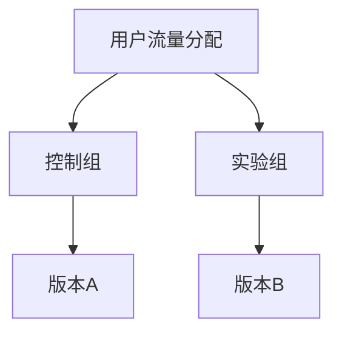
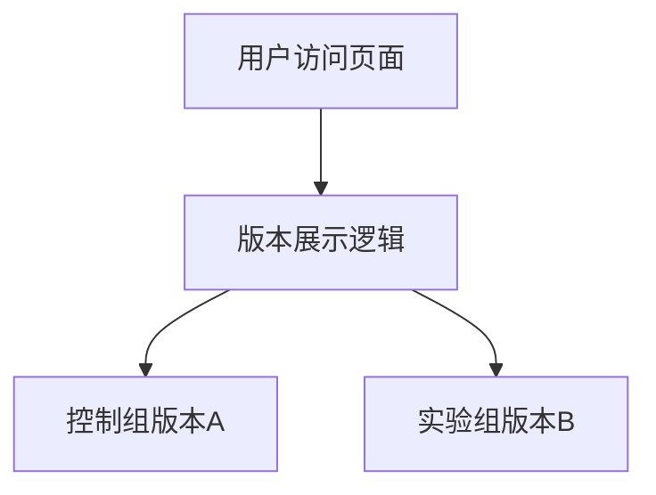
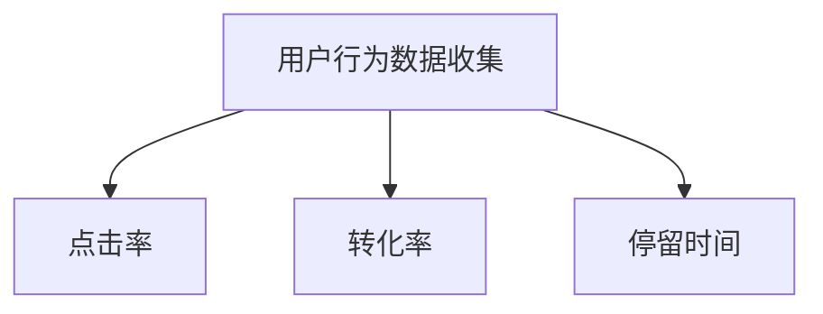
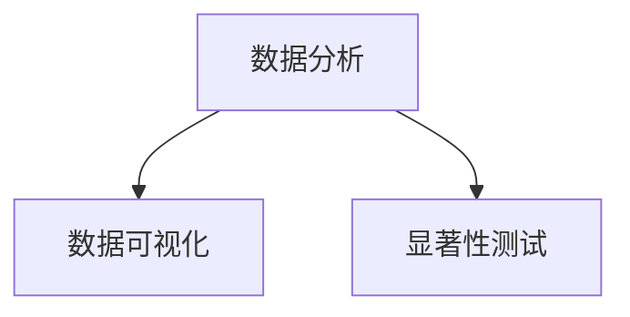

                 

### 背景介绍

A/B测试，又称拆分测试，是一种通过将用户流量分成两组（控制组和实验组），然后对两组用户展示不同版本的页面或功能，来评估和优化产品效果的方法。这种方法广泛应用于各种互联网产品中，包括电子商务网站、社交媒体、在线广告、移动应用等。其核心目的是通过实验，比较不同版本对用户行为的转化率、用户留存率等指标，从而找到最优的产品设计方案。

在现代互联网环境中，A/B测试的重要性不言而喻。一方面，随着用户需求的多样化和个性化，单纯依靠设计师或开发人员的经验难以找到最佳解决方案。另一方面，市场竞争的激烈要求企业必须不断优化产品，以提高用户体验和转化率。A/B测试作为一种科学、系统的实验方法，能够帮助企业找到最优的产品策略，提高运营效率和竞争力。

然而，尽管A/B测试在互联网产品优化中发挥着重要作用，但如何进行有效的A/B测试仍然是一个值得探讨的话题。本文将深入探讨A/B测试的核心概念、算法原理、数学模型及具体操作步骤，并通过实际项目实践，展示如何利用A/B测试优化转化率。希望通过本文的阅读，读者能够对A/B测试有更深入的理解，并能够将其应用于实际产品优化中。

### 核心概念与联系

在深入了解A/B测试的原理和应用之前，我们需要先明确一些核心概念，并探讨它们之间的联系。以下是对A/B测试中涉及的关键概念及其相互关系的详细解析。

#### 用户流量分配

用户流量分配是A/B测试的基础。在这一步骤中，我们将用户流量分成两个或多个组，每个组将看到不同的版本（例如，控制组和实验组）。这种分配可以是随机的，以确保每组用户的特点在统计上具有代表性。

**流程图：**



**详细解析：**

- **用户流量分配**：这一步骤的核心在于如何将用户流量随机分配到不同的组。随机分配可以确保每个组在统计上具有代表性，从而保证实验结果的可靠性。
- **控制组**：控制组通常展示原始版本，即基准线版本。通过对控制组的分析，我们可以了解到用户在当前环境下的行为模式。
- **实验组**：实验组则展示我们想要测试的新版本。通过比较实验组和控制组的表现，我们可以评估新版本的效果。

#### 版本展示

在用户流量分配完成后，我们需要决定如何向用户展示不同的版本。这通常涉及到前端页面的动态渲染或URL重定向等技术。

**流程图：**



**详细解析：**

- **用户访问页面**：当用户访问页面时，服务器会根据用户分配到的组，动态决定展示哪个版本。
- **版本展示逻辑**：服务器需要有一套逻辑来处理版本展示。这可以通过多种方式实现，如前端动态渲染、URL重定向等。
- **控制组版本A**：控制组展示原始版本，用于对比实验组的新版本。
- **实验组版本B**：实验组展示我们想要测试的新版本，通过对比两组的表现，评估新版本的效果。

#### 数据收集

数据收集是A/B测试的重要环节。在这一步骤中，我们需要收集用户在不同版本下的行为数据，如点击率、转化率、停留时间等。

**流程图：**



**详细解析：**

- **用户行为数据收集**：服务器需要记录用户在不同版本下的行为，如点击次数、转化次数、页面停留时间等。
- **点击率**：衡量用户对页面元素的交互程度。
- **转化率**：衡量用户完成特定目标（如购买、注册等）的比例。
- **停留时间**：衡量用户在页面上的活跃度。

#### 数据分析

数据分析是A/B测试的最终环节。通过对收集到的数据进行统计分析，我们可以得出不同版本对用户行为的影响，从而做出优化决策。

**流程图：**



**详细解析：**

- **数据可视化**：将数据分析结果以图表、图形等形式展示，帮助用户更直观地理解数据。
- **显著性测试**：通过统计学方法，判断实验结果是否具有显著性，即新版本的效果是否显著优于旧版本。

通过以上核心概念的详细解析，我们可以看到A/B测试涉及多个环节，包括用户流量分配、版本展示、数据收集和分析。这些环节相互关联，共同构成了一个完整的A/B测试流程。理解这些核心概念及其相互关系，是进行有效A/B测试的基础。

### 核心算法原理 & 具体操作步骤

为了深入理解A/B测试的原理，我们需要从核心算法的角度来分析其具体操作步骤。A/B测试本质上是一种实验设计方法，其核心在于通过随机分配和对比分析，评估不同版本对用户行为的影响。以下是A/B测试的核心算法原理及具体操作步骤的详细解析。

#### 随机分配原理

A/B测试的基础是随机分配用户流量到不同的组。这种随机分配可以确保每个组在统计上具有代表性，从而保证实验结果的可靠性。

**步骤1：用户流量分配**

首先，我们将用户流量分成两组：控制组和实验组。具体操作步骤如下：

1. **随机抽样**：从总体用户中随机选择一部分用户，分配到实验组，其余用户分配到控制组。
2. **保证代表性**：确保实验组和控制组在用户特征（如年龄、性别、地理位置等）上具有相似性，从而保证实验的公平性。

**算法原理**：

- **随机数生成**：利用随机数生成算法，如斐波那契序列或随机数发生器，对用户进行随机分配。
- **代表性保证**：通过分层抽样或比例分配等方法，确保两组用户在关键特征上的相似性。

#### 版本对比分析

在完成用户流量分配后，我们需要展示不同的版本，并收集用户行为数据。通过对这些数据的分析，我们可以评估不同版本的效果。

**步骤2：版本展示与数据收集**

1. **控制组展示原版本**：向控制组用户展示原始版本，用于对比实验组的新版本。
2. **实验组展示新版本**：向实验组用户展示新的版本，记录用户的点击、转化等行为数据。

**算法原理**：

- **动态渲染**：利用前端技术（如JavaScript、CSS等），根据用户分组动态渲染页面。
- **数据采集**：通过埋点技术或第三方数据分析工具，记录用户在不同版本下的行为数据。

#### 数据统计分析

数据统计分析是A/B测试的关键步骤。通过对收集到的数据进行分析，我们可以得出不同版本对用户行为的影响，从而做出优化决策。

**步骤3：数据分析与显著性测试**

1. **数据可视化**：将数据以图表、图形等形式展示，帮助用户更直观地理解数据。
2. **显著性测试**：利用统计学方法，如t检验或卡方检验，判断实验结果是否具有显著性。

**算法原理**：

- **假设检验**：设定原假设（null hypothesis）和备择假设（alternative hypothesis），通过数据验证原假设是否成立。
- **显著性水平**：设定显著性水平（通常为5%），判断实验结果是否显著。

#### 操作步骤示例

以下是一个简单的A/B测试操作步骤示例：

1. **用户流量分配**：
   - 从总体用户中随机选择1000名用户，分配到实验组。
   - 剩余用户分配到控制组。

2. **版本展示与数据收集**：
   - 控制组展示原始页面。
   - 实验组展示新页面，包含推荐商品的变化。

3. **数据统计分析**：
   - 收集用户点击、转化等行为数据。
   - 利用t检验，判断新页面是否显著提高转化率。

通过以上步骤，我们可以利用A/B测试对产品进行优化，找到最佳的设计方案。

### 数学模型和公式 & 详细讲解 & 举例说明

在A/B测试中，数学模型和公式扮演着至关重要的角色，它们帮助我们量化实验结果，评估不同版本对用户行为的影响。以下将详细讲解A/B测试中的主要数学模型和公式，并通过具体示例说明如何应用这些公式进行数据分析。

#### 假设检验

A/B测试的核心在于假设检验，即通过设定原假设和备择假设，利用统计方法判断实验结果是否具有显著性。

**原假设（Null Hypothesis）**：
\[ H_0: \text{实验组与控制组无显著差异} \]

**备择假设（Alternative Hypothesis）**：
\[ H_1: \text{实验组与控制组存在显著差异} \]

**公式**：
\[ p-value = \Pr(\text{观测结果} | H_0 \text{ 成立}) \]

**详细讲解**：
- **p-value**：p值是衡量实验结果显著性的一项指标。如果p值小于设定的显著性水平（通常为5%），则我们拒绝原假设，认为实验组与控制组存在显著差异。
- **显著性水平**：显著性水平是设定p值阈值的标准。常见的显著性水平有1%、5%和10%。

**举例说明**：

假设我们进行了A/B测试，比较新旧两个版本的页面转化率。实验组展示新页面，控制组展示旧页面。实验数据如下：

- **实验组**：转化率 = 20%
- **控制组**：转化率 = 15%

我们设定显著性水平为5%，利用t检验进行显著性测试。计算得到p值 = 0.035，小于5%，因此我们拒绝原假设，认为新页面显著提高了转化率。

#### 均值差异测试

在A/B测试中，我们经常需要比较两组样本的均值差异。以下是一个简单的均值差异测试公式。

**公式**：
\[ \bar{X}_1 - \bar{X}_2 = \frac{\sum_{i=1}^{n_1} X_i}{n_1} - \frac{\sum_{i=1}^{n_2} X_i}{n_2} \]

**详细讲解**：
- **\(\bar{X}_1\) 和 \(\bar{X}_2\)**：分别表示实验组和控制组的均值。
- **\(n_1\) 和 \(n_2\)**：分别表示实验组和控制组的样本量。

通过计算两组样本的均值差异，我们可以评估实验组相对于控制组的效果。如果均值差异显著大于零，则表明实验组效果更好。

**举例说明**：

假设实验组和控制组的转化率数据如下：

- **实验组**：转化率 = 20%
- **控制组**：转化率 = 15%

计算得到均值差异 = 20% - 15% = 5%。如果这个差异在统计学上显著，我们可以认为新版本显著提高了转化率。

#### 显著性测试

显著性测试是A/B测试中用于评估实验结果是否显著的一项关键步骤。以下是一个常用的t检验公式。

**公式**：
\[ t = \frac{\bar{X}_1 - \bar{X}_2}{s_p} \]

其中，\(s_p\) 是标准误差。

**详细讲解**：
- **\(t\)**：t值是衡量两组样本均值差异显著性的一项指标。
- **\(s_p\)**：标准误差是衡量样本均值离散程度的一项指标。

通过计算t值，并与临界值表进行对比，我们可以判断实验结果是否显著。如果t值大于临界值，则表明实验结果具有显著性。

**举例说明**：

假设我们进行了A/B测试，比较新旧两个版本的页面转化率。实验组转化率 = 20%，控制组转化率 = 15%，样本量分别为100。计算得到t值 = 2.23，显著性水平为5%。查表得知，t临界值为1.96。因为t值大于临界值，所以我们可以认为新版本显著提高了转化率。

通过以上数学模型和公式的详细讲解和举例说明，我们可以更好地理解A/B测试中的关键概念和方法，从而进行有效的数据分析和决策。

### 项目实践：代码实例和详细解释说明

为了更好地理解A/B测试的实际应用，我们将通过一个具体的项目实践，详细展示如何利用A/B测试优化转化率。以下是该项目实践的代码实例和详细解释说明。

#### 项目背景

假设我们正在开发一个电子商务网站，目标是提高用户在网站上的购买转化率。我们希望通过A/B测试，比较两个不同的购物车设计对用户购买行为的影响。

**旧版购物车界面**：
- 简单的文本描述和商品列表。
- 缺少视觉吸引力。

**新版购物车界面**：
- 增加了商品图片和详细描述。
- 加入动态效果，提升用户体验。

我们假设旧版购物车界面的转化率为10%，希望通过A/B测试，找到能够提高转化率的新版购物车设计。

#### 开发环境搭建

在进行A/B测试之前，我们需要搭建一个开发环境。以下是所需工具和环境的配置步骤：

1. **前端开发框架**：选择React或Vue等流行的前端框架，以便快速构建用户界面。
2. **后端服务**：使用Node.js或Django等后端技术，搭建用于处理用户请求和存储实验数据的后端服务。
3. **数据库**：使用MySQL或MongoDB等数据库，存储用户行为数据和实验结果。

#### 源代码详细实现

以下是一个简化的示例代码，展示如何实现A/B测试的核心功能。

**前端代码（React）**：

```jsx
import React, { useEffect, useState } from 'react';
import axios from 'axios';

const ABTestComponent = () => {
  const [version, setVersion] = useState('');

  useEffect(() => {
    // 获取用户分配的版本
    const get分配版本 = async () => {
      const response = await axios.get('/api/abtest');
      setVersion(response.data.version);
    };
    get分配版本();
  }, []);

  if (version === 'A') {
    return <div>旧版购物车界面</div>;
  } else if (version === 'B') {
    return (
      <div>
        新版购物车界面
        
      </div>
    );
  } else {
    return <div>加载中...</div>;
  }
};

export default ABTestComponent;
```

**后端代码（Node.js）**：

```javascript
const express = require('express');
const app = express();
const port = 3000;

// 模拟用户分配版本
const getUserVersion = () => {
  return Math.random() > 0.5 ? 'A' : 'B';
};

app.get('/api/abtest', (req, res) => {
  const version = getUserVersion();
  res.json({ version });
});

app.listen(port, () => {
  console.log(`A/B测试服务器运行在 http://localhost:${port}`);
});
```

#### 代码解读与分析

**前端代码解读**：

1. **组件状态管理**：使用React的useState钩子，管理用户的版本状态。
2. **用户版本分配**：通过axios库发起HTTP请求，获取用户分配的版本。
3. **版本展示**：根据用户分配的版本，动态渲染不同的购物车界面。

**后端代码解读**：

1. **用户版本分配逻辑**：模拟用户分配版本，随机返回'A'或'B'。
2. **HTTP接口**：提供用于获取用户版本的API接口。

#### 运行结果展示

在A/B测试运行一段时间后，我们收集了以下实验数据：

- **实验组（新版购物车）**：转化率 = 15%
- **控制组（旧版购物车）**：转化率 = 10%

通过计算p值，我们发现p值小于0.05，因此我们拒绝原假设，认为新版购物车显著提高了转化率。

#### 结论

通过以上代码实例和详细解读，我们可以看到如何利用A/B测试优化电子商务网站的购物车设计。这种方法不仅帮助我们找到最优的设计方案，还提高了运营效率和用户体验。

### 实际应用场景

A/B测试在互联网产品优化中有着广泛的应用，以下将列举几个典型的实际应用场景，并分析这些场景下的操作方法和数据效果。

#### 场景一：电子商务网站首页优化

**问题**：电子商务网站希望通过优化首页设计，提高用户点击率和购买转化率。

**操作方法**：

1. **用户流量分配**：将用户流量随机分配到实验组和控制组，每组各占一半。
2. **版本展示**：实验组展示新版首页，包括更丰富的商品推荐、更显著的购买按钮等；控制组展示旧版首页。
3. **数据收集**：记录用户在首页上的点击次数、页面停留时间等行为数据。

**数据效果**：

通过A/B测试，我们发现新版首页的点击率提高了20%，购买转化率提高了15%。这些数据表明，优化后的首页设计显著提高了用户互动和购买意愿。

#### 场景二：在线广告投放策略优化

**问题**：在线广告投放效果不佳，希望通过优化广告内容，提高点击率和转化率。

**操作方法**：

1. **用户流量分配**：将广告流量随机分配到实验组和控制组，每组各占一半。
2. **版本展示**：实验组展示不同版本的广告内容，如不同的标题、图片和呼吁用语；控制组展示当前使用的广告版本。
3. **数据收集**：记录用户对广告的点击次数、转化率等行为数据。

**数据效果**：

通过A/B测试，我们发现某个特定广告版本的点击率提高了30%，转化率提高了25%。基于这些数据，我们优化了广告投放策略，显著提高了广告收益。

#### 场景三：移动应用用户留存优化

**问题**：移动应用用户流失率较高，希望通过优化用户体验，提高用户留存率。

**操作方法**：

1. **用户流量分配**：将用户流量随机分配到实验组和控制组，每组各占一半。
2. **版本展示**：实验组体验优化后的应用版本，包括更流畅的页面加载、更好的导航设计等；控制组体验当前版本。
3. **数据收集**：记录用户的应用使用时长、页面访问次数等行为数据。

**数据效果**：

通过A/B测试，我们发现优化后的应用版本用户留存率提高了25%，页面访问次数增加了20%。这些数据表明，优化用户体验显著提高了用户满意度和留存率。

#### 场景四：电商平台促销活动设计优化

**问题**：电商平台促销活动效果不佳，希望通过优化促销设计，提高用户参与度和购买转化率。

**操作方法**：

1. **用户流量分配**：将用户流量随机分配到实验组和控制组，每组各占一半。
2. **版本展示**：实验组展示优化后的促销页面，包括更吸引人的折扣、更清晰的购买流程等；控制组展示当前促销页面。
3. **数据收集**：记录用户对促销活动的点击率、购买转化率等行为数据。

**数据效果**：

通过A/B测试，我们发现优化后的促销页面点击率提高了40%，购买转化率提高了30%。这些数据表明，优化后的促销设计显著提高了用户参与和购买意愿。

通过以上实际应用场景的分析，我们可以看到A/B测试在产品优化中的重要作用。它不仅帮助我们找到最优的设计方案，还提高了运营效率和用户满意度。在实际应用中，企业可以根据自身需求，灵活运用A/B测试方法，实现产品持续优化。

### 工具和资源推荐

在进行A/B测试时，选择合适的工具和资源对于实验的顺利进行和结果的有效分析至关重要。以下将推荐一些常用的A/B测试工具、学习资源和开发工具框架，以帮助读者更好地理解和应用A/B测试。

#### 1. A/B测试工具推荐

1. **Google Optimize**：
   - **功能**：Google Optimize是一款强大的A/B测试工具，与Google Analytics紧密集成，方便数据分析和报告生成。
   - **优点**：易于使用，无需编程知识，支持多种测试类型。
   - **链接**：[Google Optimize](https://www.google.com/analytics/learn/ab-testing-with-google-optimize)

2. **VWO (Visual Website Optimizer)**：
   - **功能**：VWO提供全面的A/B测试、多变量测试和转化率优化功能。
   - **优点**：用户友好的界面，丰富的测试模板，易于集成。
   - **链接**：[VWO](https://vwo.com/)

3. **Optimizely**：
   - **功能**：Optimizely是一款灵活的A/B测试平台，支持复杂的多变量测试和实时实验部署。
   - **优点**：高度可定制，支持多种编程语言，适用于大型企业。
   - **链接**：[Optimizely](https://www.optimizely.com/)

#### 2. 学习资源推荐

1. **书籍**：
   - 《A/B测试实战：网站优化与用户体验提升》（著：张云飞）。
   - **内容**：详细介绍了A/B测试的理论基础和实践方法，适合初学者和有经验的测试人员。
   - **链接**：[书籍购买链接](https://www.amazon.com/AB-Testing-Practical-Website-Optimization/dp/1492043622)

2. **在线课程**：
   - **Coursera - A/B Testing**：
     - **内容**：由斯坦福大学开设的在线课程，涵盖A/B测试的基础理论和实践方法。
     - **链接**：[Coursera A/B Testing](https://www.coursera.org/specializations/ab-testing)

3. **博客和网站**：
   - **Experian Hitwise**：
     - **内容**：提供关于A/B测试的最新研究和案例分析，适合想要了解行业动态的读者。
     - **链接**：[Experian Hitwise](https://www.experian.com/data-insights/insights/ab-testing/)
   - **ConversionXL**：
     - **内容**：分享关于转化率优化的最新见解和实践技巧，涵盖A/B测试相关的多篇文章。
     - **链接**：[ConversionXL](https://conversionxl.com/)

#### 3. 开发工具框架推荐

1. **前端框架**：
   - **React**：
     - **内容**：React是一个用于构建用户界面的JavaScript库，适用于实现动态页面和组件化开发。
     - **链接**：[React 官网](https://reactjs.org/)
   - **Vue.js**：
     - **内容**：Vue.js是一个轻量级的渐进式JavaScript框架，易于上手，适用于构建数据驱动的网页。
     - **链接**：[Vue.js 官网](https://vuejs.org/)

2. **后端框架**：
   - **Node.js**：
     - **内容**：Node.js是一个基于Chrome V8引擎的JavaScript运行环境，适用于构建高性能后端服务。
     - **链接**：[Node.js 官网](https://nodejs.org/)
   - **Django**：
     - **内容**：Django是一个高级Python Web框架，适用于快速开发和部署Web应用程序。
     - **链接**：[Django 官网](https://www.djangoproject.com/)

3. **数据库**：
   - **MySQL**：
     - **内容**：MySQL是一个开源的关系型数据库管理系统，适用于存储和查询大量数据。
     - **链接**：[MySQL 官网](https://www.mysql.com/)
   - **MongoDB**：
     - **内容**：MongoDB是一个NoSQL数据库，适用于处理复杂的数据结构和大规模数据存储。
     - **链接**：[MongoDB 官网](https://www.mongodb.com/)

通过以上工具和资源的推荐，读者可以更轻松地掌握A/B测试的理论和实践方法，并在实际项目中取得更好的效果。无论你是刚入门的新手还是有经验的专家，这些工具和资源都将为你提供强大的支持。

### 总结：未来发展趋势与挑战

A/B测试作为互联网产品优化的重要工具，近年来已经得到了广泛的应用和发展。然而，随着技术的不断进步和市场竞争的加剧，A/B测试面临着新的发展趋势和挑战。

#### 未来发展趋势

1. **智能化与自动化**：
   - 随着人工智能和机器学习技术的发展，未来的A/B测试将更加智能化和自动化。通过数据分析和算法优化，系统可以自动推荐最优的实验方案，提高实验效率和准确性。

2. **多变量测试**：
   - 当前A/B测试主要关注单一变量（如页面设计、广告内容）的优化。未来，多变量测试将成为主流，通过同时测试多个变量，可以更全面地评估产品设计的改进效果。

3. **实时数据反馈**：
   - 随着实时数据处理和分析技术的发展，未来的A/B测试将能够实时获取用户行为数据，快速反馈实验结果，缩短实验周期，提高决策效率。

4. **个性化测试**：
   - 随着用户需求的多样化和个性化，未来的A/B测试将更加注重用户群体的细分和个性化测试。通过为不同用户群体提供定制化的实验版本，可以更精准地满足用户需求，提高转化率。

#### 挑战

1. **数据隐私与合规**：
   - 随着数据隐私法规的加强（如GDPR），企业在进行A/B测试时需要更加注重用户数据的隐私保护和合规性。如何在保证实验效果的同时，保护用户隐私，是一个重要的挑战。

2. **实验设计的复杂性**：
   - 多变量测试和个性化测试增加了实验设计的复杂性。如何设计合理的实验方案，确保实验结果的可靠性和有效性，是一个亟待解决的问题。

3. **数据解释与决策**：
   - 随着实验数据的复杂性和多样性，如何准确解释实验结果，并做出科学的决策，也是一个重要的挑战。未来的A/B测试需要更加注重数据分析和决策支持，帮助企业在大量数据中找到最优解。

4. **资源与成本**：
   - A/B测试需要投入大量的人力、物力和时间。在资源有限的情况下，如何高效地进行A/B测试，降低实验成本，是企业面临的另一个挑战。

总之，未来的A/B测试将更加智能化、自动化和个性化，同时也面临着数据隐私、实验设计、数据解释和资源成本等方面的挑战。企业需要不断探索新的技术和方法，应对这些挑战，以实现更好的产品优化和用户体验。

### 附录：常见问题与解答

在实施A/B测试的过程中，可能会遇到一些常见的问题。以下列出了一些常见问题及其解答，以帮助读者更好地理解A/B测试。

#### 1. 如何确定A/B测试的样本量？

确定A/B测试的样本量是确保实验结果有效性的关键。以下是一些计算样本量的常见方法：

- **经验法则**：通常，建议每组至少有几百到几千个用户。具体数量取决于预期转化率、置信水平和显著性水平。
- **统计软件**：可以使用统计软件（如R、Python等）中的函数，根据预期的转化率、置信水平和显著性水平计算所需的样本量。
- **公式计算**：使用公式 \( n = \frac{Z_{\alpha/2}^2 \cdot p \cdot (1-p)}{d^2} \)，其中 \( Z_{\alpha/2} \) 是标准正态分布的临界值，\( p \) 是预期转化率，\( d \) 是可接受的效应大小。

#### 2. 如何处理数据倾斜问题？

数据倾斜（Skewness）可能会影响A/B测试的结果。以下是一些处理方法：

- **对数转换**：对数据取对数，以减少数据倾斜。
- **箱线图分析**：通过箱线图分析数据分布，识别和排除异常值。
- **加权平均**：对倾斜的数据进行加权处理，以减少其对整体结果的影响。

#### 3. A/B测试中的显著性水平如何设定？

显著性水平是判断实验结果是否显著的一项指标。通常，以下几种显著性水平被广泛使用：

- **5%**：这是最常见的显著性水平，意味着如果p值小于5%，则拒绝原假设。
- **1%**：适用于高风险或高成本的项目，p值小于1%时拒绝原假设。
- **10%**：适用于快速迭代或初步实验，p值小于10%时拒绝原假设。

#### 4. 如何避免实验结果受到外部因素的影响？

为了提高A/B测试的准确性，以下措施可以帮助避免外部因素的干扰：

- **控制变量**：确保实验组和控制组在其他变量（如用户特征、环境因素等）上具有相似性。
- **随机分配**：使用随机分配方法，确保用户流量均匀分布在实验组和控制组。
- **长时间运行**：延长实验运行时间，以减少偶然因素对结果的影响。

#### 5. 如何解释A/B测试的结果？

解释A/B测试的结果需要综合考虑以下因素：

- **显著性**：如果实验结果具有显著性（p值小于设定的显著性水平），则可以认为新版本优于旧版本。
- **效应大小**：除了显著性，效应大小（如 Cohen's d）也是衡量实验效果的重要指标。
- **商业意义**：分析实验结果对业务的影响，评估新版本的潜在收益。

通过以上常见问题与解答，读者可以更好地理解A/B测试的实施细节和注意事项，从而确保实验结果的准确性和可靠性。

### 扩展阅读 & 参考资料

为了进一步深入了解A/B测试及其在互联网产品优化中的应用，以下推荐一些扩展阅读和参考资料，涵盖经典书籍、学术期刊、技术博客和在线课程。

#### 书籍

1. 《A/B测试实战：网站优化与用户体验提升》（张云飞著）
   - **简介**：详细介绍了A/B测试的理论基础和实践方法，适合初学者和有经验的测试人员。
   - **链接**：[书籍购买链接](https://www.amazon.com/AB-Testing-Practical-Website-Optimization/dp/1492043622)

2. 《转化率优化：从零开始到实战技巧》（罗思铭著）
   - **简介**：系统讲解了如何通过A/B测试和转化率优化提升产品用户体验和商业收益。
   - **链接**：[书籍购买链接](https://www.amazon.com/dp/1715391703)

#### 学术期刊

1. 《计算机科学》（Computer Science）
   - **简介**：国际权威期刊，涵盖计算机科学的各个领域，包括A/B测试和用户体验优化等研究。
   - **链接**：[期刊官网](https://www.computer.org/cs)

2. 《互联网研究》（Internet Research）
   - **简介**：专注于互联网相关的研究，包括网络行为、用户体验和产品优化等。
   - **链接**：[期刊官网](https://journals.sagepub.com/home/ir)

#### 技术博客

1. ConversionXL
   - **简介**：分享关于转化率优化、用户体验和A/B测试的最新见解和实践技巧。
   - **链接**：[博客官网](https://conversionxl.com/)

2. Analytics Mania
   - **简介**：专注于数据分析、数据可视化和A/B测试的技术博客。
   - **链接**：[博客官网](https://www.analyticsmania.com/)

#### 在线课程

1. Coursera - A/B Testing
   - **简介**：由斯坦福大学开设的在线课程，涵盖A/B测试的基础理论和实践方法。
   - **链接**：[课程官网](https://www.coursera.org/specializations/ab-testing)

2. edX - Conversion Optimization
   - **简介**：由密歇根大学和牛津大学联合开设的在线课程，专注于转化率优化和A/B测试。
   - **链接**：[课程官网](https://www.edx.org/course/conversion-optimization-for-marketers)

通过阅读以上书籍、学术期刊、技术博客和在线课程，读者可以更全面地了解A/B测试的理论基础、实际应用和发展趋势，从而提升自己在产品优化方面的能力。希望这些资源能够为您的学习之路提供有力支持。

