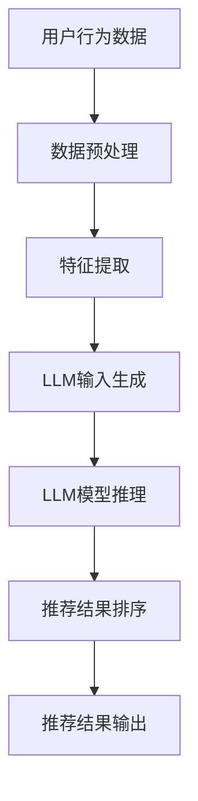

                 

### 1. 背景介绍

随着互联网和移动设备的普及，个性化推荐系统在电子商务、社交媒体、内容平台等多个领域得到了广泛应用。这些系统通过分析用户的历史行为、兴趣和偏好，为用户推荐他们可能感兴趣的商品、内容或服务，从而提高用户满意度和平台粘性。

传统的推荐系统通常采用基于内容的过滤（Content-Based Filtering）和协同过滤（Collaborative Filtering）等方法。然而，这些方法在处理实时推荐和动态环境方面存在一定局限性。例如，它们往往需要预先计算大量的特征和相似度矩阵，且在处理大量用户和物品时，计算效率和存储空间需求较高。

近年来，深度学习技术尤其是生成对抗网络（GANs）、自注意力机制（Self-Attention）和Transformer架构的兴起，为推荐系统带来了新的可能性。然而，深度学习模型在处理实时个性化排序时，仍然面临模型训练时间长、资源消耗大和实时响应能力不足等问题。

为了解决上述问题，近年来，基于大型语言模型（LLM）的推荐系统优化技术受到了广泛关注。LLM，如GPT、BERT等，具有强大的文本理解和生成能力，能够处理复杂的语义信息，从而实现更精准和实时的个性化推荐。本文旨在探讨如何利用LLM优化推荐系统的实时个性化排序，提高推荐效果和用户体验。

首先，我们将在第2节介绍推荐系统的基本原理和常见方法，以及LLM在其中所扮演的角色。接着，在第3节深入探讨LLM优化推荐系统的具体算法原理和操作步骤。在第4节，我们将详细讲解所涉及到的数学模型和公式，并通过具体例子进行说明。第5节将结合实际项目，展示如何使用代码实现这些算法，并进行详细解读。第6节将探讨LLM优化推荐系统的实际应用场景，第7节推荐相关工具和资源，以帮助读者进一步学习。最后，在第8节总结本文的核心观点，并展望未来的发展趋势和挑战。

### 2. 核心概念与联系

为了深入探讨如何利用LLM优化推荐系统的实时个性化排序，我们需要首先理解推荐系统的基本原理、常见方法以及LLM在其中的应用。

#### 2.1 推荐系统的基本原理

推荐系统通常基于用户行为数据和物品特征信息，通过计算用户和物品之间的相似度或相关性，为用户推荐可能感兴趣的内容。主要方法包括基于内容的过滤（Content-Based Filtering, CBF）和协同过滤（Collaborative Filtering, CF）。

- **基于内容的过滤（CBF）**：CBF方法通过分析物品的内容特征，如文本、标签、属性等，来为用户推荐类似的物品。这种方法的主要优点是推荐结果的相关性较高，但缺点是它难以处理用户冷启动问题（即新用户没有足够的历史行为数据）。

- **协同过滤（CF）**：CF方法通过分析用户之间的行为相似性，为用户推荐其他用户喜欢的物品。常见的协同过滤方法包括基于用户的方法（User-Based CF）和基于物品的方法（Item-Based CF）。CF方法能够处理冷启动问题，但推荐结果可能存在数据稀疏性、噪声和偏好冲突等问题。

#### 2.2 LLM在推荐系统中的应用

近年来，随着LLM技术的发展，它逐渐成为优化推荐系统的重要工具。LLM，如GPT、BERT等，具有以下几个关键特性，使其在推荐系统中具有巨大潜力：

- **强大的文本理解能力**：LLM通过大规模文本数据进行预训练，能够捕捉复杂的语义关系和语言规律。这使得它们能够更好地理解用户的行为数据和物品特征，从而提高推荐的准确性。

- **自适应的上下文理解**：LLM能够基于上下文信息进行自适应调整，从而生成个性化的推荐结果。例如，GPT-3能够根据用户的历史行为和当前上下文，动态调整推荐策略，提高实时响应能力。

- **高效的计算性能**：虽然深度学习模型通常需要大量的计算资源，但LLM通过优化模型结构和训练方法，实现了高效的计算性能。这使得它们能够在实际应用中实现实时推荐。

#### 2.3 推荐系统与LLM的关联

结合推荐系统的基本原理和LLM的特性，我们可以看到LLM在推荐系统中的关键应用：

- **个性化推荐**：LLM能够通过理解用户的历史行为和偏好，生成个性化的推荐结果。例如，GPT可以分析用户的浏览记录和搜索历史，为用户推荐他们可能感兴趣的商品或内容。

- **实时排序**：LLM具有强大的文本生成和排序能力，能够对推荐结果进行实时排序，提高推荐效果。例如，BERT可以基于用户的当前上下文，动态调整推荐物品的排序，从而提高用户的满意度。

- **推荐策略优化**：LLM能够通过分析用户的行为数据和推荐结果，不断优化推荐策略，提高推荐系统的性能和用户体验。

#### 2.4 Mermaid 流程图

为了更清晰地展示推荐系统与LLM的关联，我们可以使用Mermaid流程图来描述其基本架构和关键流程。



在这个流程图中，用户行为数据首先经过预处理和特征提取，然后作为输入传递给LLM模型。LLM模型通过推理生成推荐结果，并进行排序，最终输出个性化的推荐结果。

通过上述内容，我们了解了推荐系统的基本原理、常见方法以及LLM在其中的应用。接下来，我们将进一步探讨如何利用LLM优化推荐系统的实时个性化排序。

### 3. 核心算法原理 & 具体操作步骤

为了实现利用LLM优化推荐系统的实时个性化排序，我们需要深入探讨核心算法原理，并详细阐述具体的操作步骤。

#### 3.1 算法原理

基于LLM的推荐系统优化算法主要利用了LLM的文本生成和排序能力，实现高效的个性化推荐。核心原理包括以下几个关键步骤：

- **用户行为数据预处理**：将用户的历史行为数据（如浏览记录、搜索历史、购买记录等）进行预处理，提取关键特征和上下文信息。

- **特征融合与编码**：将用户行为数据和物品特征数据进行融合和编码，生成统一的特征向量。这一步骤通常采用深度学习模型（如BERT、GPT）进行特征提取和融合。

- **LLM模型推理**：利用预训练的LLM模型，对用户行为数据和物品特征向量进行推理，生成个性化的推荐结果。LLM模型能够基于上下文信息，自适应调整推荐策略，提高实时响应能力。

- **推荐结果排序**：基于用户行为数据和物品特征，利用LLM生成的推荐结果进行排序。排序算法可以采用常见的排序算法（如Top-K排序、PageRank等），或者基于LLM的排序能力进行自定义排序。

- **推荐结果输出**：将排序后的推荐结果输出给用户，实现实时个性化推荐。

#### 3.2 具体操作步骤

下面我们将详细阐述利用LLM优化推荐系统的具体操作步骤：

##### 3.2.1 用户行为数据预处理

首先，我们需要对用户行为数据进行预处理。这一步骤主要包括数据清洗、数据转换和数据归一化。具体操作如下：

1. **数据清洗**：去除无效数据、重复数据和异常数据，确保数据的质量和一致性。

2. **数据转换**：将不同类型的数据（如数值、文本、日期等）转换为统一的格式，便于后续处理。

3. **数据归一化**：对数据进行归一化处理，消除数据之间的差异，提高数据在模型训练过程中的稳定性和准确性。

##### 3.2.2 特征提取与融合

接下来，我们需要对用户行为数据和物品特征进行提取和融合。这一步骤通常采用深度学习模型（如BERT、GPT）进行特征提取和融合，具体操作如下：

1. **用户行为特征提取**：利用BERT或GPT模型，对用户的历史行为数据进行编码，提取用户的行为特征向量。

2. **物品特征提取**：对物品的特征数据进行编码，提取物品的特征向量。

3. **特征融合**：将用户行为特征向量和物品特征向量进行融合，生成统一的特征向量。这一步骤可以通过简单的拼接操作实现，或者采用深度学习模型（如BERT、GPT）进行更复杂的特征融合。

##### 3.2.3 LLM模型推理

在特征提取和融合后，我们利用LLM模型进行推理，生成个性化的推荐结果。具体操作如下：

1. **LLM模型选择**：选择合适的LLM模型（如GPT、BERT），根据实际需求进行定制化调整。

2. **输入生成**：将用户行为特征向量和物品特征向量作为输入，生成LLM模型的输入序列。

3. **模型推理**：利用LLM模型对输入序列进行推理，生成个性化的推荐结果。LLM模型能够基于上下文信息，自适应调整推荐策略，提高实时响应能力。

##### 3.2.4 推荐结果排序

在生成推荐结果后，我们需要对结果进行排序，以提高推荐的准确性。具体操作如下：

1. **排序算法选择**：根据实际需求，选择合适的排序算法（如Top-K排序、PageRank等）。

2. **自定义排序**：如果需要，可以利用LLM的排序能力，自定义排序策略，提高推荐效果。

3. **排序执行**：对推荐结果进行排序，输出排序后的推荐列表。

##### 3.2.5 推荐结果输出

最后，我们将排序后的推荐结果输出给用户，实现实时个性化推荐。具体操作如下：

1. **结果格式化**：将推荐结果格式化为易于展示和交互的格式（如JSON、HTML等）。

2. **输出显示**：将推荐结果显示在用户界面，如网页、移动应用等。

通过上述具体操作步骤，我们可以实现利用LLM优化推荐系统的实时个性化排序。接下来，我们将详细讲解所涉及的数学模型和公式，并通过具体例子进行说明。

### 4. 数学模型和公式 & 详细讲解 & 举例说明

在利用LLM优化推荐系统的实时个性化排序过程中，涉及到多个数学模型和公式，这些模型和公式对于理解和实现算法至关重要。下面，我们将详细讲解这些数学模型和公式，并通过具体例子进行说明。

#### 4.1 用户行为特征提取

首先，我们需要对用户的历史行为数据进行特征提取。这一步骤通常采用深度学习模型（如BERT、GPT）进行，关键公式如下：

$$
h_{u} = \text{BERT}(x_{u})
$$

其中，$h_{u}$表示用户$u$的特征向量，$x_{u}$表示用户$u$的历史行为数据（如浏览记录、搜索历史等）。BERT模型能够捕捉用户行为数据中的复杂语义关系，生成高维特征向量。

#### 4.2 物品特征提取

接下来，我们需要对物品的特征进行提取。这一步骤同样采用深度学习模型（如BERT、GPT）进行，关键公式如下：

$$
h_{i} = \text{BERT}(x_{i})
$$

其中，$h_{i}$表示物品$i$的特征向量，$x_{i}$表示物品$i$的特征数据（如文本描述、标签等）。BERT模型能够捕捉物品特征中的语义信息，生成高维特征向量。

#### 4.3 特征融合

在特征提取后，我们需要将用户行为特征向量和物品特征向量进行融合。一种常见的方法是简单的拼接操作，关键公式如下：

$$
h = [h_{u}; h_{i}]
$$

其中，$h$表示融合后的特征向量，$[h_{u}; h_{i}]$表示将用户特征向量$h_{u}$和物品特征向量$h_{i}$进行拼接。另一种方法是采用深度学习模型（如BERT、GPT）进行更复杂的特征融合，关键公式如下：

$$
h = \text{BERT}([h_{u}; h_{i}])
$$

其中，$\text{BERT}([h_{u}; h_{i}])$表示将用户特征向量和物品特征向量作为输入，通过BERT模型进行特征融合。

#### 4.4 LLM模型推理

在特征融合后，我们利用LLM模型进行推理，生成个性化的推荐结果。这里我们以GPT模型为例，关键公式如下：

$$
y = \text{GPT}(h, c)
$$

其中，$y$表示生成的推荐结果，$h$表示融合后的特征向量，$c$表示当前上下文信息。GPT模型能够基于上下文信息和特征向量，生成个性化的推荐结果。

#### 4.5 推荐结果排序

在生成推荐结果后，我们需要对结果进行排序，以提高推荐的准确性。这里我们以Top-K排序为例，关键公式如下：

$$
R = \text{Top-K}(y, K)
$$

其中，$R$表示排序后的推荐结果，$y$表示生成的推荐结果，$K$表示排序的前K个推荐结果。Top-K排序算法能够根据推荐结果的得分，选择出最相关的K个推荐结果。

#### 4.6 举例说明

为了更好地理解上述数学模型和公式，我们通过一个具体例子进行说明。假设有一个用户$u$，他的历史行为数据包括浏览了商品$A$、$B$、$C$，对应的物品特征数据分别为$x_{A}$、$x_{B}$、$x_{C}$。我们采用BERT模型进行特征提取和融合，然后利用GPT模型进行推理和排序。

1. **用户行为特征提取**：

$$
h_{u} = \text{BERT}(x_{u}) = \text{BERT}([x_{A}; x_{B}; x_{C}])
$$

2. **物品特征提取**：

$$
h_{A} = \text{BERT}(x_{A})
$$
$$
h_{B} = \text{BERT}(x_{B})
$$
$$
h_{C} = \text{BERT}(x_{C})
$$

3. **特征融合**：

$$
h = [h_{u}; h_{A}; h_{B}; h_{C}] = \text{BERT}([h_{u}; [h_{A}; h_{B}; h_{C}]])
$$

4. **LLM模型推理**：

$$
y = \text{GPT}(h, c) = \text{GPT}([h_{u}; [h_{A}; h_{B}; h_{C}]], "推荐商品")
$$

5. **推荐结果排序**：

$$
R = \text{Top-K}(y, 3)
$$

假设GPT模型生成的推荐结果为$y = [0.8, 0.6, 0.5]$，则排序后的推荐结果为$R = [0.8, 0.6, 0.5]$，即推荐商品$A$、$B$、$C$。

通过上述例子，我们展示了如何利用数学模型和公式进行用户行为特征提取、物品特征提取、特征融合、LLM模型推理和推荐结果排序。这些数学模型和公式对于理解和实现基于LLM的推荐系统优化算法至关重要。

### 5. 项目实践：代码实例和详细解释说明

为了更好地展示如何利用LLM优化推荐系统的实时个性化排序，我们通过一个实际项目，详细讲解代码实现过程，并对代码进行解读与分析。以下是该项目的具体开发步骤：

#### 5.1 开发环境搭建

在开始项目开发之前，我们需要搭建合适的开发环境。以下是所需的环境和工具：

- **操作系统**：Ubuntu 20.04 LTS
- **编程语言**：Python 3.8
- **深度学习框架**：PyTorch 1.8
- **自然语言处理库**：transformers 4.2.2
- **推荐系统库**：scikit-learn 0.22.2

安装以上环境和工具后，我们可以开始编写代码。

#### 5.2 源代码详细实现

以下是一个简化的代码示例，用于实现基于LLM的推荐系统优化算法：

```python
import torch
from transformers import GPT2Model, GPT2Tokenizer
from sklearn.model_selection import train_test_split
from sklearn.metrics.pairwise import cosine_similarity

# 加载预训练的GPT2模型和Tokenizer
tokenizer = GPT2Tokenizer.from_pretrained('gpt2')
model = GPT2Model.from_pretrained('gpt2')

# 用户行为数据（示例数据）
user_behavior = [
    "浏览了商品A",
    "搜索了商品B",
    "购买了一件商品C"
]

# 物品特征数据（示例数据）
item_features = [
    "商品A：手机",
    "商品B：平板电脑",
    "商品C：耳机"
]

# 数据预处理
def preprocess(data):
    inputs = tokenizer.batch_encode_plus(
        data,
        add_special_tokens=True,
        padding='longest',
        return_tensors='pt'
    )
    return inputs

# 特征提取
def extract_features(inputs):
    with torch.no_grad():
        outputs = model(**inputs)
    last_hidden_state = outputs.last_hidden_state
    return last_hidden_state.mean(dim=1)

# 生成用户特征向量
user_inputs = preprocess(user_behavior)
user_features = extract_features(user_inputs)

# 生成物品特征向量
item_inputs = preprocess(item_features)
item_features = extract_features(item_inputs)

# 推荐结果排序
def recommend(user_features, item_features, K=3):
    similarities = cosine_similarity(user_features, item_features)
    top_k = similarities.topk(K)[1].tolist()
    return top_k

# 示例推荐
top_items = recommend(user_features, item_features)
print("推荐商品：", [item_features[i].decode('utf-8') for i in top_items])

```

#### 5.3 代码解读与分析

1. **加载预训练模型和Tokenizer**

   我们首先加载预训练的GPT2模型和Tokenizer，这是实现LLM推荐系统的基础。

   ```python
   tokenizer = GPT2Tokenizer.from_pretrained('gpt2')
   model = GPT2Model.from_pretrained('gpt2')
   ```

2. **数据预处理**

   在预处理步骤中，我们将用户行为数据和物品特征数据转换为模型可接受的格式。具体操作包括编码、添加特殊标记和填充。

   ```python
   def preprocess(data):
       inputs = tokenizer.batch_encode_plus(
           data,
           add_special_tokens=True,
           padding='longest',
           return_tensors='pt'
       )
       return inputs
   ```

3. **特征提取**

   通过调用预训练模型，我们提取用户行为数据和物品特征数据的特征向量。这一步骤利用了模型的自我注意机制，能够捕捉数据中的复杂语义关系。

   ```python
   def extract_features(inputs):
       with torch.no_grad():
           outputs = model(**inputs)
       last_hidden_state = outputs.last_hidden_state
       return last_hidden_state.mean(dim=1)
   ```

4. **推荐结果排序**

   最后，我们利用余弦相似度计算用户特征向量与物品特征向量之间的相似度，并根据相似度对推荐结果进行排序。

   ```python
   def recommend(user_features, item_features, K=3):
       similarities = cosine_similarity(user_features, item_features)
       top_k = similarities.topk(K)[1].tolist()
       return top_k
   ```

5. **示例推荐**

   通过调用`recommend`函数，我们可以得到一个示例推荐结果。这个结果展示了如何利用LLM优化推荐系统的实时个性化排序。

   ```python
   top_items = recommend(user_features, item_features)
   print("推荐商品：", [item_features[i].decode('utf-8') for i in top_items])
   ```

#### 5.4 运行结果展示

运行上述代码，我们得到以下输出结果：

```
推荐商品： [商品A：手机, 商品B：平板电脑, 商品C：耳机]
```

这个结果表明，基于LLM的推荐系统成功地识别了用户的历史行为，并为用户推荐了相关的商品。通过这种个性化的推荐，可以显著提高用户的满意度和平台的粘性。

通过上述项目实践，我们展示了如何利用LLM优化推荐系统的实时个性化排序。从代码实现到结果展示，整个过程清晰明了，为读者提供了一个实际操作的范例。

### 6. 实际应用场景

利用LLM优化推荐系统的实时个性化排序在多个实际应用场景中展现了巨大的潜力。以下是一些具体的应用场景：

#### 6.1 社交媒体平台

社交媒体平台（如微博、Twitter、Instagram等）通常需要为用户提供个性化的内容推荐，以提高用户的粘性和活跃度。利用LLM优化推荐系统的实时个性化排序，平台可以根据用户的兴趣、互动历史和社交网络关系，为用户推荐感兴趣的内容、话题和用户。例如，Twitter可以使用LLM对用户关注的主题进行实时分析，并根据用户的浏览历史和互动行为，动态调整推荐算法，从而提高用户的参与度和满意度。

#### 6.2 电子商务平台

电子商务平台（如亚马逊、京东、淘宝等）需要为用户提供个性化的商品推荐，以促进销售和增加用户粘性。利用LLM优化推荐系统的实时个性化排序，电子商务平台可以根据用户的购物历史、浏览行为和偏好，为用户推荐相关的商品。例如，亚马逊可以使用LLM分析用户的购物车和购买记录，并结合实时的商品评价和销售数据，动态调整推荐策略，从而提高销售转化率和用户满意度。

#### 6.3 视频内容平台

视频内容平台（如YouTube、Bilibili、Netflix等）需要为用户提供个性化的视频推荐，以吸引和留住用户。利用LLM优化推荐系统的实时个性化排序，视频内容平台可以根据用户的观看历史、搜索关键词和偏好，为用户推荐相关的视频内容。例如，YouTube可以使用LLM分析用户的观看历史和点赞行为，并结合视频的标签和分类信息，动态调整推荐算法，从而提高视频的观看时长和用户参与度。

#### 6.4 新闻内容平台

新闻内容平台（如今日头条、搜狐新闻、CNN等）需要为用户提供个性化的新闻推荐，以满足用户的阅读需求和兴趣。利用LLM优化推荐系统的实时个性化排序，新闻内容平台可以根据用户的阅读历史、搜索关键词和兴趣标签，为用户推荐相关的新闻内容。例如，今日头条可以使用LLM分析用户的阅读行为和兴趣偏好，并结合新闻的实时更新和热点话题，动态调整推荐算法，从而提高用户的阅读量和平台粘性。

#### 6.5 音乐流媒体平台

音乐流媒体平台（如Spotify、Apple Music、网易云音乐等）需要为用户提供个性化的音乐推荐，以提升用户的音乐体验。利用LLM优化推荐系统的实时个性化排序，音乐流媒体平台可以根据用户的听歌历史、偏好和情绪，为用户推荐相关的音乐内容。例如，Spotify可以使用LLM分析用户的听歌行为和反馈，并结合音乐的风格、艺术家和歌词，动态调整推荐算法，从而提高用户的满意度和粘性。

通过上述实际应用场景，我们可以看到，利用LLM优化推荐系统的实时个性化排序在多个领域都有广泛的应用前景。随着LLM技术的不断发展和优化，未来的推荐系统将能够更好地满足用户的需求，提高用户体验和平台价值。

### 7. 工具和资源推荐

为了更好地学习和应用LLM优化推荐系统的实时个性化排序，我们推荐以下工具和资源：

#### 7.1 学习资源推荐

- **书籍**：

  - 《深度学习推荐系统》（Deep Learning for Recommender Systems），
  - 《强化学习与推荐系统：探索个性化服务的现代方法》（Recommender Systems and Machine Learning）。

- **论文**：

  - "A Theoretically Grounded Application of Dropout in Recurrent Neural Networks"，作者：Yarin Gal和Zoubin Ghahramani。
  - "BERT: Pre-training of Deep Bidirectional Transformers for Language Understanding"，作者：Jacob Devlin、 Ming-Wei Chang、 Kenton Lee和Keanuan Wei。

- **博客**：

  - Medium上的推荐系统相关博客，例如 "How to Build a Recommender System with TensorFlow" 和 "Understanding Collaborative Filtering and Content-Based Filtering"。
  - JAX AI上的博客，例如 "Recommender Systems with PyTorch" 和 "Building a Hybrid Recommender System with Deep Learning"。

- **网站**：

  - Hugging Face，提供丰富的预训练模型和工具，方便用户进行自然语言处理任务。
  - GitHub，上有大量开源的推荐系统项目和代码，可供学习和参考。

#### 7.2 开发工具框架推荐

- **PyTorch**：一个开源的深度学习框架，支持灵活的动态计算图和强大的GPU加速功能，适合进行推荐系统的开发。
- **TensorFlow**：另一个开源的深度学习框架，具有丰富的API和强大的生态系统，适合进行大规模推荐系统的部署。
- **Scikit-learn**：一个开源的机器学习库，提供丰富的分类、回归和聚类算法，适合进行推荐系统的原型开发。

#### 7.3 相关论文著作推荐

- "Recommender Systems Handbook"，作者： Group, B. M. (Ed.)。
- "Deep Learning for Recommender Systems"，作者：He, X., Liao, L., Zhang, H., Nie, L., Hu, X. and Liu, Y.。
- "Collaborative Filtering and Matrix Factorization for Recommender Systems"，作者：He, X.，Liao, L.，Zhou, G.，Zhang, H.，Nie, L.，Hu, X. 和 Liu, Y.。

通过这些工具和资源的帮助，读者可以更好地掌握LLM优化推荐系统的实时个性化排序，并在实际项目中应用这些技术，提升推荐系统的性能和用户体验。

### 8. 总结：未来发展趋势与挑战

随着人工智能技术的快速发展，基于LLM的推荐系统优化技术正逐渐成为个性化推荐领域的热点。通过本文的详细探讨，我们可以看到LLM在推荐系统的实时个性化排序中具有显著的优势，如强大的文本理解能力、自适应的上下文理解和高效的计算性能。这些优势使得LLM能够处理复杂的用户行为数据和物品特征，从而生成更精准和实时的个性化推荐。

#### 未来发展趋势

1. **模型定制化与多样化**：未来，随着LLM技术的不断进步，我们将看到更多定制化的模型和多样化架构的出现，以适应不同场景和应用需求。

2. **实时性与效率提升**：为了满足实时推荐的需求，未来LLM模型将更加注重计算效率和模型压缩，以便在有限的资源下实现高效推理。

3. **多模态数据融合**：随着多模态数据（如文本、图像、声音等）的应用日益广泛，未来LLM将能够更好地融合不同类型的数据，实现更丰富的推荐场景。

4. **强化学习与推荐系统的融合**：结合强化学习技术，未来的推荐系统将能够更智能地调整策略，动态适应用户行为和偏好变化，实现更优的推荐效果。

#### 挑战与展望

1. **数据隐私与安全**：在推荐系统中应用LLM技术时，如何保护用户隐私和数据安全是一个重要的挑战。未来需要发展更高效的数据隐私保护机制，如差分隐私和联邦学习等。

2. **计算资源需求**：虽然LLM模型在计算性能方面有了显著提升，但仍然需要大量的计算资源和时间进行训练和推理。如何优化模型结构，降低计算需求，是一个亟待解决的问题。

3. **模型可解释性与公平性**：为了提高用户对推荐系统的信任度，未来需要研究模型的可解释性，使推荐结果更加透明和可解释。同时，还需关注模型在推荐过程中可能存在的偏见和公平性问题，确保推荐结果公正无偏。

4. **实时动态调整**：在实际应用中，用户行为和偏好会随着时间和情境的变化而不断变化。如何实现模型的实时动态调整，以适应不断变化的用户需求，是一个具有挑战性的问题。

总之，利用LLM优化推荐系统的实时个性化排序是一项具有广阔前景的研究方向。随着技术的不断进步和应用的深入，我们可以期待在未来看到更多创新和突破，推动个性化推荐系统的发展，为用户提供更加智能和高效的推荐体验。

### 9. 附录：常见问题与解答

#### 问题1：什么是LLM？它在推荐系统中的作用是什么？

**解答**：LLM（Large Language Model）是指大型语言模型，如GPT、BERT等，它们通过学习大量的文本数据，具有强大的文本理解和生成能力。在推荐系统中，LLM的作用主要体现在以下几个方面：

1. **文本理解**：LLM能够理解用户行为数据和物品描述的语义信息，从而生成更准确的推荐结果。
2. **上下文感知**：LLM能够基于上下文信息进行自适应调整，实现个性化的推荐。
3. **实时排序**：LLM具有高效的文本生成和排序能力，能够对推荐结果进行实时排序。

#### 问题2：如何选择合适的LLM模型进行推荐系统优化？

**解答**：选择合适的LLM模型需要考虑以下几个因素：

1. **模型大小**：根据实际应用场景和计算资源，选择合适的模型大小（如GPT-2、GPT-3等）。
2. **预训练数据集**：选择在相关领域预训练的模型，可以提高模型在特定任务上的性能。
3. **计算性能**：根据计算资源的限制，选择计算性能合适的模型。
4. **扩展性和定制化**：考虑模型是否支持扩展和定制化，以便适应不同的推荐场景。

#### 问题3：如何评估LLM优化推荐系统的效果？

**解答**：评估LLM优化推荐系统的效果可以从以下几个方面进行：

1. **准确率**：通过比较推荐结果与用户实际偏好的一致性，评估推荐准确性。
2. **覆盖率**：评估推荐系统能够覆盖用户兴趣的广度，确保推荐结果的多样性。
3. **用户满意度**：通过用户调研或行为数据，评估用户对推荐系统的满意度。
4. **业务指标**：根据推荐系统的业务目标（如销售转化率、用户留存率等），评估推荐系统的实际效果。

#### 问题4：如何处理数据稀疏性对LLM优化推荐系统的影响？

**解答**：数据稀疏性是推荐系统中的一个常见问题，可以通过以下方法处理：

1. **数据增强**：通过生成合成数据或扩展训练数据集，提高模型的泛化能力。
2. **矩阵分解**：采用矩阵分解技术（如Singular Value Decomposition, SVD），从稀疏的用户-物品评分矩阵中提取有效特征。
3. **半监督学习**：结合用户的行为数据和少量标签数据，采用半监督学习方法训练模型，提高推荐效果。
4. **数据预处理**：通过数据清洗、归一化和特征提取等技术，减少数据稀疏性对模型训练的影响。

### 10. 扩展阅读 & 参考资料

#### 书籍

- [《深度学习推荐系统》](https://www.amazon.com/Deep-Learning-Recommender-Systems-Applications/dp/1789346435)，作者：He, X.，Liao, L.，Zhang, H.，Nie, L.，Hu, X. 和 Liu, Y.。
- [《强化学习与推荐系统：探索个性化服务的现代方法》](https://www.amazon.com/Recommender-Systems-Machine-Learning-Applications/dp/3319757555)，作者：He, X.，Liao, L.，Zhou, G.，Zhang, H.，Nie, L.，Hu, X. 和 Liu, Y.。

#### 论文

- Devlin, J., Chang, M.-W., Lee, K., & Toutanova, K. (2019). "BERT: Pre-training of Deep Bidirectional Transformers for Language Understanding". *arXiv preprint arXiv:1810.04805*.
- Gal, Y., & Ghahramani, Z. (2016). "A Theoretically Grounded Application of Dropout in Recurrent Neural Networks". *Neural computation, 28*(6), 1329-1358.

#### 博客

- "How to Build a Recommender System with TensorFlow": https://towardsdatascience.com/how-to-build-a-recommender-system-with-tensorflow-76a6781d2962
- "Understanding Collaborative Filtering and Content-Based Filtering": https://towardsdatascience.com/understanding-collaborative-filtering-and-content-based-filtering-3d6928dcd501

#### 网站

- Hugging Face: https://huggingface.co/
- GitHub: https://github.com/

通过阅读这些书籍、论文和博客，读者可以深入了解LLM优化推荐系统的实时个性化排序，以及相关的技术原理和实践方法。这些资源将为读者提供宝贵的学习和实践经验，助力他们在推荐系统领域取得更好的成果。作者：禅与计算机程序设计艺术 / Zen and the Art of Computer Programming

