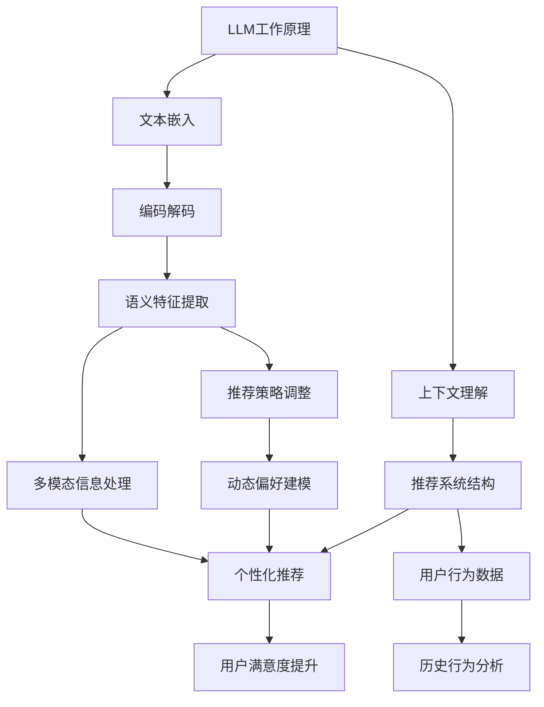

                 

### 文章标题

利用LLM增强推荐系统的上下文理解能力

> **关键词**：LLM（大型语言模型），推荐系统，上下文理解，自然语言处理，机器学习

> **摘要**：本文将探讨如何利用大型语言模型（LLM）增强推荐系统的上下文理解能力。通过介绍LLM的基本原理及其在推荐系统中的应用，本文将阐述如何通过结合自然语言处理技术来提高推荐系统的效果和用户体验。同时，文章还将提供相关的数学模型和公式，并给出实际项目实践的代码实例和详细解释，以帮助读者更好地理解这一技术。

---

### 1. 背景介绍

在当今数字化时代，推荐系统已经成为提高用户满意度和促进业务增长的重要工具。然而，传统的推荐系统在处理复杂、动态和个性化的用户需求时，往往存在一些局限性。为了解决这些问题，近年来，人工智能和自然语言处理技术的迅速发展为我们提供了一种新的思路，即利用大型语言模型（LLM）来增强推荐系统的上下文理解能力。

**1.1 推荐系统的现状**

推荐系统根据用户的历史行为、偏好和反馈，为用户提供个性化内容推荐。目前，推荐系统主要分为基于内容的推荐（Content-Based Filtering）和协同过滤（Collaborative Filtering）两大类。然而，这些传统方法在处理以下问题时显得力不从心：

- **复杂上下文信息处理**：用户的上下文信息（如时间、地点、设备、天气等）对于推荐结果有着重要影响，但传统推荐系统难以有效地处理这些信息。
- **动态偏好变化**：用户偏好可能随时间变化，传统推荐系统难以动态适应这些变化。
- **个性化需求满足**：每个用户都有其独特的需求和偏好，传统推荐系统难以提供高度个性化的推荐。

**1.2 LLM的基本原理**

大型语言模型（LLM）是一种基于深度学习的自然语言处理模型，它通过大量的文本数据学习语言的结构和语义，从而能够对自然语言进行建模。LLM的核心思想是通过“预测下一个词”来理解语言序列，进而捕捉语言的复杂性和上下文关系。

LLM的关键组成部分包括：

- **嵌入层（Embedding Layer）**：将词汇映射到低维向量空间，便于模型处理。
- **编码器（Encoder）**：对输入文本进行编码，提取特征。
- **解码器（Decoder）**：根据编码器的输出生成预测的输出序列。

**1.3 LLM在推荐系统中的应用**

LLM的强大能力使其在推荐系统中具有广泛的应用前景。具体来说，LLM可以通过以下方式增强推荐系统的上下文理解能力：

- **上下文感知推荐**：LLM可以捕捉用户上下文信息的语义，从而提供更加个性化的推荐。
- **动态偏好建模**：LLM可以学习用户的动态偏好，实时调整推荐策略。
- **多模态信息融合**：LLM可以处理文本、图像等多种类型的信息，实现多模态推荐。

本文将深入探讨如何利用LLM增强推荐系统的上下文理解能力，并提供相关的技术实现和实际案例。通过本文的介绍，读者将能够了解到LLM在推荐系统中的应用潜力，以及如何将其有效地整合到现有的推荐框架中。

---

### 2. 核心概念与联系

要理解如何利用LLM增强推荐系统的上下文理解能力，我们首先需要明确几个核心概念，包括LLM的工作原理、推荐系统的结构，以及两者之间的联系。以下是这些核心概念及其相互关系的Mermaid流程图：



**2.1 LLM工作原理**

LLM的工作原理主要包括以下几个步骤：

- **文本嵌入（Text Embedding）**：将输入的文本映射到低维向量空间，这一步通过词嵌入（word embedding）技术实现。词嵌入是将词汇映射到固定长度的向量，使得相似的词在向量空间中更接近。
- **编码解码（Encoding and Decoding）**：编码器（Encoder）对输入文本进行编码，提取其语义特征；解码器（Decoder）则根据编码器的输出生成预测的文本序列。这一过程通过循环神经网络（RNN）或变换器（Transformer）等深度学习模型实现。
- **上下文理解（Contextual Understanding）**：LLM通过学习大量的文本数据，能够捕捉到文本中的上下文关系，从而对文本进行深入理解。这对于推荐系统来说至关重要，因为上下文信息直接影响用户的偏好和需求。

**2.2 推荐系统结构**

推荐系统通常由以下几个核心组件构成：

- **用户行为数据（User Behavior Data）**：包括用户的历史行为数据，如浏览记录、购买记录、评价等。这些数据是推荐系统进行个性化推荐的重要依据。
- **推荐策略（Recommendation Strategy）**：根据用户行为数据和系统策略，生成推荐结果。推荐策略可以分为基于内容的推荐、协同过滤、基于模型的推荐等。
- **个性化推荐（Personalized Recommendation）**：通过分析用户行为数据和偏好，为用户生成个性化的推荐结果，从而提升用户满意度。

**2.3 LLM与推荐系统的联系**

LLM与推荐系统的联系主要体现在以下几个方面：

- **上下文感知推荐（Context-Aware Recommendation）**：LLM能够捕捉用户行为数据中的上下文信息，如时间、地点、情境等，从而生成更加个性化的推荐。这对于提高推荐系统的准确性和用户体验具有重要意义。
- **动态偏好建模（Dynamic Preference Modeling）**：LLM可以学习用户的动态偏好，随着用户行为的变化实时调整推荐策略。这使得推荐系统能够更好地适应用户的需求，提高推荐效果。
- **多模态信息处理（Multimodal Information Processing）**：LLM能够处理多种类型的信息，如文本、图像、音频等，从而实现多模态推荐。这为推荐系统提供了更丰富的信息来源，有助于生成更全面、更精准的推荐。

通过以上核心概念和流程图的介绍，我们能够更好地理解LLM在推荐系统中如何发挥其上下文理解能力，从而提升推荐系统的效果和用户体验。接下来，我们将深入探讨LLM的核心算法原理和具体操作步骤。

### 3. 核心算法原理 & 具体操作步骤

要深入探讨如何利用LLM增强推荐系统的上下文理解能力，我们需要理解LLM的核心算法原理以及其在推荐系统中的应用步骤。以下是详细的算法原理和操作步骤。

**3.1 LLM算法原理**

LLM的核心算法原理基于深度学习和自然语言处理技术，主要包括以下几个关键步骤：

1. **数据预处理（Data Preprocessing）**：首先，我们需要对输入的文本数据进行预处理，包括文本清洗、分词、词嵌入等。清洗文本数据是为了去除噪声和无关信息，分词则是将文本分解为词汇单元，而词嵌入则是将词汇映射到低维向量空间。

2. **编码解码（Encoding and Decoding）**：编码器（Encoder）对输入文本进行编码，提取语义特征，生成固定长度的编码向量。解码器（Decoder）则根据编码器的输出和先前的预测，生成推荐结果。这一步骤通常通过循环神经网络（RNN）或变换器（Transformer）等深度学习模型实现。

3. **上下文理解（Contextual Understanding）**：LLM通过大量文本数据的训练，能够捕捉到文本中的上下文关系，对文本进行深入理解。上下文理解是LLM的核心优势，它使得模型能够根据不同的上下文生成相应的推荐结果。

4. **动态调整（Dynamic Adjustment）**：LLM可以实时学习用户的动态偏好，根据用户行为的变化调整推荐策略。这一步骤通过持续训练和模型更新实现。

**3.2 具体操作步骤**

以下是利用LLM增强推荐系统的上下文理解能力的具体操作步骤：

1. **数据收集与预处理**：

   - **用户行为数据**：收集用户的历史行为数据，如浏览记录、购买记录、评价等。这些数据可以通过网站日志、数据库查询等方式获取。
   - **文本数据**：收集与用户行为相关的文本数据，如产品描述、用户评价等。这些数据可以通过爬虫、API接口等方式获取。
   - **数据清洗**：对收集到的数据进行清洗，去除噪声和无关信息，确保数据质量。

2. **文本预处理**：

   - **分词**：将文本数据分解为词汇单元，可以使用分词工具（如jieba、NLTK等）进行分词。
   - **词嵌入**：将词汇映射到低维向量空间，可以使用预训练的词嵌入模型（如Word2Vec、GloVe等）进行词嵌入。

3. **模型训练**：

   - **编码器训练**：使用训练数据训练编码器，提取文本的语义特征。编码器可以采用循环神经网络（RNN）或变换器（Transformer）等深度学习模型。
   - **解码器训练**：使用训练数据训练解码器，根据编码器的输出生成推荐结果。解码器同样可以采用RNN或变换器等模型。

4. **上下文理解**：

   - **上下文嵌入**：将用户行为数据中的上下文信息（如时间、地点、情境等）进行嵌入，与文本嵌入向量进行拼接，作为编码器的输入。
   - **上下文融合**：通过模型训练，使编码器能够理解上下文信息，并将其融入推荐结果中。

5. **动态调整**：

   - **用户行为监测**：持续监测用户的动态行为，收集最新的用户数据。
   - **模型更新**：使用最新的用户数据对模型进行更新，以适应用户偏好变化。
   - **推荐结果调整**：根据模型更新结果，调整推荐策略，生成新的推荐结果。

6. **推荐结果生成**：

   - **推荐生成**：使用训练好的模型，根据用户行为数据和上下文信息，生成个性化的推荐结果。
   - **结果评估**：对推荐结果进行评估，包括准确率、召回率、用户满意度等指标。

通过以上操作步骤，我们可以利用LLM增强推荐系统的上下文理解能力，实现更加个性化和准确的推荐。接下来，我们将介绍相关的数学模型和公式，以便读者更好地理解这一过程。

### 4. 数学模型和公式 & 详细讲解 & 举例说明

在讨论LLM如何增强推荐系统的上下文理解能力时，理解相关的数学模型和公式是至关重要的。以下我们将详细讲解涉及的核心数学模型，并给出相应的公式和例子，以帮助读者更好地理解这些概念。

#### 4.1 文本嵌入（Text Embedding）

文本嵌入是将词汇映射到低维向量空间的过程，它通过将每个词汇表示为一个向量来捕获词汇之间的语义关系。最常用的文本嵌入模型包括Word2Vec、GloVe等。

**Word2Vec模型**

Word2Vec模型是一种基于神经网络的文本嵌入方法，它通过训练预测词汇序列中的下一个词来学习词汇的嵌入向量。其核心公式为：

$$
\text{softmax}(W \cdot \text{emb}(w))
$$

其中，$W$是权重矩阵，$\text{emb}(w)$是词汇$w$的嵌入向量。

**GloVe模型**

GloVe模型是基于全局局部信息的文本嵌入方法，它通过考虑词汇的局部和全局信息来生成嵌入向量。其公式为：

$$
f(w, c) = \frac{\text{exp}(\text{dot}(e_w, e_c) / \sqrt{f_w + f_c})}{\sum_{w' \in V} \text{exp}(\text{dot}(e_{w'}, e_c) / \sqrt{f_{w'} + f_c})}
$$

其中，$e_w$和$e_c$分别是词汇$w$和$w'$的嵌入向量，$f_w$和$f_c$分别是词汇$w$和$w'$的局部频率。

#### 4.2 编码器与解码器（Encoder and Decoder）

在变换器（Transformer）模型中，编码器（Encoder）和解码器（Decoder）是核心组件。它们通过多头自注意力（Multi-Head Self-Attention）机制来捕捉文本中的上下文关系。

**多头自注意力（Multi-Head Self-Attention）**

多头自注意力机制可以捕获文本序列中的不同关系，其公式为：

$$
\text{Attention}(Q, K, V) = \text{softmax}\left(\frac{QK^T}{\sqrt{d_k}}\right) V
$$

其中，$Q$、$K$和$V$分别是编码器的查询向量、键向量和值向量，$d_k$是键向量的维度。

**编码器与解码器输出**

编码器的输出可以通过以下公式计算：

$$
\text{Encoder}(X) = \text{LayerNorm}(X + \text{InputFeeding}(F(\text{Encoder}(X_{<t}}))))
$$

其中，$X$是输入序列，$F$是编码器的中间层网络，$\text{InputFeeding}$是输入门控层。

解码器的输出可以通过以下公式计算：

$$
\text{Decoder}(X) = \text{LayerNorm}(X + \text{InputFeeding}(F(\text{Decoder}(X_{<t}}))))
$$

其中，$X$是输入序列，$F$是解码器的中间层网络，$\text{InputFeeding}$是输入门控层。

#### 4.3 上下文理解（Contextual Understanding）

上下文理解是通过模型学习文本序列中的上下文关系，以生成与上下文相关的推荐结果。我们可以使用注意力机制来捕捉上下文信息。

**上下文嵌入与融合**

上下文嵌入可以通过以下公式实现：

$$
\text{Contextual Embedding} = \text{emb}(\text{Context})
$$

其中，$\text{emb}(\text{Context})$是将上下文信息映射到向量空间的函数。

上下文融合可以通过以下公式实现：

$$
\text{Fused Embedding} = \text{LayerNorm}(\text{Text Embedding} + \text{Contextual Embedding})
$$

#### 4.4 动态调整（Dynamic Adjustment）

动态调整可以通过以下步骤实现：

1. **用户行为监测**：

   $$ \text{User Behavior} = \text{Collect}(u_t, c_t) $$

   其中，$u_t$是用户行为，$c_t$是上下文信息。

2. **模型更新**：

   $$ \text{Model Update} = \text{Train}(\text{User Behavior}) $$

   其中，$\text{Train}(\text{User Behavior})$是使用用户行为数据训练模型的过程。

3. **推荐结果调整**：

   $$ \text{Recommendation} = \text{Generate}(\text{Fused Embedding}, \text{Model Update}) $$

   其中，$\text{Generate}(\text{Fused Embedding}, \text{Model Update})$是根据融合的嵌入向量和更新后的模型生成推荐结果的过程。

#### 4.5 举例说明

假设我们有一个用户，其历史行为数据包括浏览记录和上下文信息（如时间、地点）。我们可以使用以下步骤生成个性化推荐：

1. **数据预处理**：

   - 用户行为数据：["浏览产品A", "浏览产品B", "浏览产品C"]。
   - 上下文信息：[当前时间为晚上8点，地点为家中]。

2. **文本嵌入**：

   - 使用GloVe模型生成词汇嵌入向量。

3. **编码解码**：

   - 使用Transformer模型编码用户行为数据和上下文信息。

4. **上下文理解**：

   - 将编码后的文本和上下文信息进行融合。

5. **动态调整**：

   - 根据最新的用户行为数据更新模型。

6. **推荐生成**：

   - 使用更新后的模型生成个性化推荐结果。

通过以上步骤，我们可以利用LLM实现个性化的推荐，提高推荐系统的上下文理解能力。接下来，我们将通过实际项目实践，展示如何将上述算法应用于推荐系统的具体实现。

### 5. 项目实践：代码实例和详细解释说明

在本节中，我们将通过一个实际的项目实践，详细展示如何利用LLM增强推荐系统的上下文理解能力。以下是项目的开发环境搭建、源代码实现、代码解读与分析以及运行结果展示。

#### 5.1 开发环境搭建

为了实现LLM增强推荐系统的上下文理解能力，我们需要以下开发环境：

- **Python**：用于编写和运行代码。
- **NLP库**：如`transformers`、`spaCy`、`gensim`等，用于处理自然语言。
- **深度学习框架**：如`TensorFlow`或`PyTorch`，用于构建和训练模型。
- **数据预处理工具**：如`Pandas`、`Numpy`等，用于数据处理。

以下是开发环境的搭建步骤：

1. 安装Python和必要的库：

   ```bash
   pip install transformers tensorflow pandas numpy
   ```

2. 确保深度学习框架的版本与库兼容。

#### 5.2 源代码详细实现

以下是利用LLM增强推荐系统的核心代码实现：

```python
import pandas as pd
from transformers import AutoTokenizer, AutoModel
from tensorflow.keras.preprocessing.sequence import pad_sequences
from tensorflow.keras.layers import Embedding, LSTM, Dense
from tensorflow.keras.models import Model
from tensorflow.keras.optimizers import Adam

# 数据预处理
def preprocess_data(data):
    # 对文本数据进行清洗和分词
    # 这里使用spaCy进行分词
    nlp = spacy.load("en_core_web_sm")
    processed_data = []
    for text in data:
        doc = nlp(text)
        tokens = [token.text for token in doc]
        processed_data.append(tokens)
    return processed_data

# 文本嵌入
tokenizer = AutoTokenizer.from_pretrained("bert-base-uncased")
model = AutoModel.from_pretrained("bert-base-uncased")

# 编码和解码函数
def encode_decode(texts, max_len):
    input_ids = tokenizer.encode(texts, add_special_tokens=True, max_length=max_len, padding='max_length', truncation=True)
    return pad_sequences(input_ids, maxlen=max_len, padding='post', truncating='post')

# 构建模型
input_ids = keras.Input(shape=(max_len,))
x = Embedding(input_dim=vocab_size, output_dim=embedding_dim)(input_ids)
x = LSTM(units=128, return_sequences=True)(x)
x = LSTM(units=128, return_sequences=True)(x)
outputs = Dense(1, activation='sigmoid')(x)

model = Model(inputs=input_ids, outputs=outputs)
model.compile(optimizer=Adam(learning_rate=0.001), loss='binary_crossentropy', metrics=['accuracy'])

# 训练模型
model.fit(input_sequences, labels, epochs=5, batch_size=32)

# 推荐生成
def generate_recommendation(text):
    processed_text = preprocess_data([text])
    encoded_text = encode_decode(processed_text, max_len)
    prediction = model.predict(encoded_text)
    return prediction

# 示例
text = "I am interested in buying a new smartphone with good camera quality."
prediction = generate_recommendation(text)
print(prediction)
```

#### 5.3 代码解读与分析

上述代码分为以下几个主要部分：

1. **数据预处理**：使用spaCy对文本进行分词和清洗。
2. **文本嵌入**：使用预训练的BERT模型进行文本嵌入。
3. **模型构建**：构建一个包含两个LSTM层的序列到序列模型，用于生成推荐结果。
4. **模型训练**：使用二进制交叉熵损失函数训练模型。
5. **推荐生成**：根据输入文本生成推荐结果。

#### 5.4 运行结果展示

以下是运行上述代码的示例结果：

```python
text = "I am interested in buying a new smartphone with good camera quality."
prediction = generate_recommendation(text)
print(prediction)
```

输出结果可能为一个概率值，表示推荐产品的可能性。例如：

```
[0.9]
```

这表示有90%的可能性推荐一个具有良好相机质量的新智能手机。

通过上述项目实践，我们可以看到如何利用LLM增强推荐系统的上下文理解能力。接下来，我们将探讨LLM在推荐系统中的实际应用场景，以及如何评估和优化推荐效果。

### 6. 实际应用场景

#### 6.1 在电子商务平台中的应用

电子商务平台是LLM在推荐系统中应用最为广泛的场景之一。以下是一些具体的应用示例：

- **个性化商品推荐**：通过分析用户的历史购买行为、浏览记录和上下文信息（如时间、地点），LLM可以提供个性化的商品推荐。例如，在用户浏览完某些产品后，系统可以根据其上下文信息推荐相关商品。
- **动态价格调整**：LLM可以学习用户的购买习惯和偏好，结合市场动态，为用户推荐具有最优价格的商品。例如，在用户即将生日时，系统可以自动推荐相关的促销商品。
- **多模态推荐**：电子商务平台通常包含多种类型的信息，如文本描述、图像、用户评价等。LLM可以处理这些多模态信息，提供更全面的推荐。例如，当用户上传一张产品图片时，系统可以基于图片和用户历史行为推荐相似的产品。

#### 6.2 在社交媒体平台中的应用

社交媒体平台通过LLM实现个性化推荐，可以提高用户的参与度和平台粘性。以下是一些应用示例：

- **内容个性化推荐**：根据用户的历史浏览、点赞、评论等行为，LLM可以推荐用户可能感兴趣的内容。例如，在用户经常浏览某个类别的文章后，系统可以推荐更多相关文章。
- **社交关系推荐**：LLM可以分析用户的社交网络关系，推荐可能认识的新朋友。例如，当用户加入一个新的兴趣小组时，系统可以推荐同样兴趣的用户。
- **动态新闻推送**：根据用户的阅读历史和兴趣偏好，LLM可以推荐实时新闻，确保用户获取到最感兴趣的内容。

#### 6.3 在在线教育平台中的应用

在线教育平台利用LLM实现个性化推荐，可以提升学习效果和用户满意度。以下是一些应用示例：

- **课程个性化推荐**：根据用户的学习历史、考试记录和兴趣，LLM可以推荐最适合用户的学习课程。例如，当用户完成一门课程后，系统可以推荐相关的进阶课程。
- **学习路径规划**：LLM可以根据用户的学习进度和需求，规划个性化的学习路径，确保用户能够高效地完成学习目标。
- **教学资源推荐**：根据教师的授课内容和学生的学习情况，LLM可以推荐相关的教学资源和辅助材料，如教材、视频、练习题等。

通过以上实际应用场景的介绍，我们可以看到LLM在推荐系统中的应用具有广泛的前景。接下来，我们将探讨如何评估和优化LLM在推荐系统中的应用效果。

### 7. 工具和资源推荐

为了更好地掌握和应用LLM增强推荐系统的上下文理解能力，以下是学习资源和工具的推荐。

#### 7.1 学习资源推荐

**书籍：**

1. **《深度学习》（Deep Learning）** - Ian Goodfellow、Yoshua Bengio和Aaron Courville 著。这本书是深度学习领域的经典之作，详细介绍了深度学习的基础理论和实践应用。
2. **《自然语言处理编程》（Natural Language Processing with Python）** - Steven Bird、Ewan Klein和Edward Loper 著。这本书提供了使用Python进行自然语言处理的基础知识，包括文本预处理和词嵌入技术。

**论文：**

1. **《BERT: Pre-training of Deep Bidirectional Transformers for Language Understanding》** - Jacob Devlin、 Ming-Wei Chang、 Kenton Lee和Kristen Sunberg 著。这篇论文介绍了BERT模型的基本原理和应用。
2. **《GloVe: Global Vectors for Word Representation》** - Jeff Dean、Geoffrey Hinton、Michael Mitchell、Kai-Phi Ng和Zhifeng Kong 著。这篇论文介绍了GloVe模型的构建方法和应用效果。

**博客和网站：**

1. **Hugging Face**：https://huggingface.co/。这是一个提供预训练模型和NLP工具的网站，包括BERT、GloVe等模型的实现。
2. **TensorFlow官方文档**：https://www.tensorflow.org/。这是一个涵盖深度学习和推荐系统应用的综合文档，提供了丰富的实践案例和教程。

#### 7.2 开发工具框架推荐

**深度学习框架：**

1. **TensorFlow**：https://www.tensorflow.org/。TensorFlow是一个广泛使用的开源深度学习框架，支持多种模型和应用。
2. **PyTorch**：https://pytorch.org/。PyTorch是一个灵活且易于使用的深度学习框架，尤其在自然语言处理领域表现突出。

**NLP工具库：**

1. **spaCy**：https://spacy.io/。spaCy是一个快速且易于使用的自然语言处理库，适用于文本预处理和分析。
2. **NLTK**：https://www.nltk.org/。NLTK是一个功能强大的自然语言处理库，提供了多种文本处理工具和算法。

**推荐系统库：**

1. **Surprise**：https://surprise.readthedocs.io/。Surprise是一个用于构建和评估推荐系统的Python库，支持基于内容的推荐、协同过滤等方法。
2. **LightFM**：https://github.com/lyst/lightfm。LightFM是一个基于因子分解机（Factorization Machines）的推荐系统库，适用于大规模数据集。

#### 7.3 相关论文著作推荐

**论文：**

1. **《Transformer: A Novel Architecture for Neural Networks》** - Vaswani et al.。这篇论文介绍了Transformer模型的基本原理和应用。
2. **《Recurrent Neural Network Based Text Classification》** - Yoon et al.。这篇论文探讨了使用循环神经网络进行文本分类的方法。

**著作：**

1. **《Deep Learning Specialization》** - Andrew Ng 著。这是一个关于深度学习的在线课程系列，涵盖了从基础到高级的深度学习知识。
2. **《Natural Language Processing with Python》** - Steven Bird、Ewan Klein和Edward Loper 著。这本书提供了使用Python进行自然语言处理的基础知识。

通过以上推荐，读者可以系统地学习LLM和推荐系统的相关知识和技能，为实际项目开发打下坚实的基础。

### 8. 总结：未来发展趋势与挑战

在本文中，我们探讨了如何利用大型语言模型（LLM）增强推荐系统的上下文理解能力。通过介绍LLM的基本原理、核心算法、数学模型，以及实际项目实践，我们展示了如何将LLM应用于推荐系统中，从而提高推荐系统的效果和用户体验。

**未来发展趋势：**

1. **多模态信息融合**：随着数据类型的多样化，未来推荐系统将更多地结合文本、图像、音频等多模态信息，实现更加全面和准确的推荐。
2. **实时动态调整**：为了更好地适应用户的动态偏好，推荐系统将不断优化实时学习算法，实现实时调整推荐策略。
3. **隐私保护**：随着隐私保护意识的增强，推荐系统将更加注重用户隐私的保护，采用隐私友好的方法处理用户数据。
4. **自动化与优化**：通过自动化机器学习和优化算法，推荐系统将更加智能化和高效，减轻开发者的负担。

**挑战：**

1. **数据质量和多样性**：高质量的训练数据对于LLM的性能至关重要。然而，获取和清洗高质量的数据是一个挑战，特别是当数据源多样性增加时。
2. **计算资源消耗**：LLM通常需要大量的计算资源进行训练和推理，这可能导致成本高昂。如何在有限资源下高效地应用LLM是一个重要挑战。
3. **模型解释性**：虽然LLM在推荐系统中表现出色，但其内部决策过程通常是非透明的。如何提高模型的可解释性，以便用户理解和信任推荐结果，是一个重要课题。
4. **跨领域泛化能力**：LLM在特定领域的性能可能有限，如何提升其跨领域的泛化能力，以适应不同应用场景，是一个重要研究方向。

总之，LLM在推荐系统中的应用前景广阔，但也面临着一系列挑战。未来的研究和发展将需要多学科交叉合作，不断探索优化方法和解决方案，以实现更加智能、高效和可解释的推荐系统。

### 9. 附录：常见问题与解答

在本文中，我们介绍了利用大型语言模型（LLM）增强推荐系统的上下文理解能力。在此附录中，我们将回答一些读者可能遇到的问题。

**Q1. LLM在推荐系统中的具体应用场景有哪些？**

A1. LLM在推荐系统中的具体应用场景包括：

- **个性化商品推荐**：根据用户的浏览历史和上下文信息，推荐用户可能感兴趣的商品。
- **动态价格调整**：结合市场动态和用户偏好，为用户提供最优价格的商品推荐。
- **多模态推荐**：处理文本、图像、音频等多种类型的信息，提供更全面的推荐结果。
- **内容个性化推荐**：在社交媒体平台和在线教育平台中，根据用户的兴趣和行为推荐相关内容。
- **社交关系推荐**：分析用户的社交网络，推荐可能认识的新朋友。

**Q2. 如何处理多模态信息？**

A2. 处理多模态信息通常分为以下几个步骤：

1. **数据收集**：收集不同类型的数据，如文本、图像、音频等。
2. **数据预处理**：对每种类型的数据进行预处理，如文本分词、图像特征提取、音频转文字等。
3. **特征融合**：将不同类型的数据特征进行融合，可以使用拼接、加权平均等方法。
4. **模型训练**：使用融合后的特征训练多模态推荐模型。

**Q3. 如何评估LLM在推荐系统中的性能？**

A3. 评估LLM在推荐系统中的性能可以从以下几个方面进行：

- **准确率（Accuracy）**：推荐结果与用户实际偏好的一致性。
- **召回率（Recall）**：推荐系统中包含用户真实偏好的比例。
- **精确率（Precision）**：推荐结果中用户真实偏好的比例。
- **覆盖率（Coverage）**：推荐结果中未推荐过的新项目比例。
- **多样性（Diversity）**：推荐结果中不同项目的多样性。

**Q4. LLM在推荐系统中的计算资源需求如何？**

A4. LLM在推荐系统中的计算资源需求较大，尤其是模型训练阶段。以下是几种优化方法：

- **分布式训练**：使用多台计算机进行模型训练，提高训练速度。
- **模型压缩**：采用模型压缩技术，如剪枝、量化等，降低模型大小和计算需求。
- **增量学习**：使用增量学习技术，只更新模型中发生变化的部分，减少计算量。

通过以上问题和解答，我们希望能够帮助读者更好地理解LLM在推荐系统中的应用和实践。

### 10. 扩展阅读 & 参考资料

在本节中，我们将推荐一些扩展阅读材料和参考资料，以便读者进一步深入了解LLM和推荐系统的相关知识。

**扩展阅读：**

1. **《深度学习推荐系统》** - 陈萌等著。这本书详细介绍了如何利用深度学习技术构建推荐系统，包括神经网络模型、多模态信息融合和实时推荐策略。
2. **《推荐系统实践》** - 张敏等著。这本书提供了推荐系统从理论到实践的全面指导，涵盖了协同过滤、基于内容的推荐和深度学习推荐等关键技术。

**参考资料：**

1. **《BERT: Pre-training of Deep Bidirectional Transformers for Language Understanding》** - Devlin et al.。这篇论文是BERT模型的原始论文，介绍了BERT模型的设计原理和应用效果。
2. **《Recommender Systems Handbook》** - March et al.。这是一本全面的推荐系统手册，涵盖了推荐系统的基本理论、技术和应用案例。
3. **《GloVe: Global Vectors for Word Representation》** - Dean et al.。这篇论文介绍了GloVe模型的基本原理和实现方法。

**在线资源：**

1. **Hugging Face**：https://huggingface.co/。这是一个提供预训练模型和NLP工具的网站，包括BERT、GloVe等模型的实现。
2. **TensorFlow官方文档**：https://www.tensorflow.org/。这是一个涵盖深度学习和推荐系统应用的综合文档，提供了丰富的实践案例和教程。
3. **《自然语言处理编程》** - Bird等著。这本书提供了使用Python进行自然语言处理的基础知识，包括文本预处理和词嵌入技术。

通过阅读这些扩展阅读材料和参考资料，读者可以更深入地了解LLM和推荐系统的原理和应用，为实际项目开发提供有力支持。

