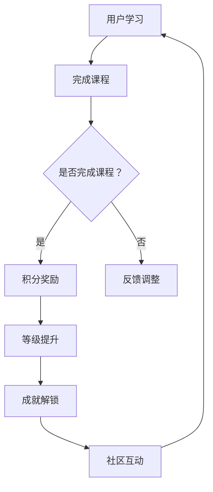

                 

### 文章标题

**利用gamification提升知识付费参与度**

> **关键词**：Gamification, 知识付费，参与度，激励机制，用户体验
>
> **摘要**：本文深入探讨了如何在知识付费领域利用gamification（游戏化）来提升用户的参与度。通过分析gamification的核心概念，结合实际案例，文章提出了一系列切实可行的策略，旨在为知识付费平台提供优化用户参与度的指导。文章结构紧凑，逻辑清晰，适用于IT领域专业人士及对知识付费和用户体验感兴趣的读者。

### 1. 背景介绍

在当今信息化社会中，知识付费作为一种新型的学习模式，正逐渐成为许多用户获取新知识和技能的首选途径。然而，随着市场供给的增加和用户需求的多样化，如何提高用户的参与度和粘性，成为知识付费平台面临的一大挑战。

传统的知识付费模式主要依赖于内容的质量和价格策略来吸引用户，但这种单向的传播方式往往难以激发用户的参与热情。用户在内容消费过程中，缺乏互动性、竞争性和成就感，导致学习体验不够丰富，参与度也难以提高。

在此背景下，gamification（游戏化）作为一种新兴的激励手段，逐渐引起了广泛关注。gamification 通过将游戏化的元素和机制融入到非游戏场景中，如知识付费平台，可以有效地提升用户的参与度和积极性。这种做法不仅能够增加用户的互动性，还能通过奖励机制和等级系统增强用户的成就感和归属感。

本文将围绕gamification在知识付费领域中的应用，深入探讨其核心概念、应用策略以及实际效果，旨在为知识付费平台提供优化用户参与度的指导。文章还将结合实际案例，分析成功的gamification实践，以及可能面临的挑战和解决方法。

### 2. 核心概念与联系

#### 2.1 Gamification的定义

Gamification 是指将游戏设计中的元素和机制（如奖励、等级、竞争、社区互动等）应用于非游戏场景中，以激励用户参与并提高其体验。其核心在于利用游戏的吸引力来促进用户的行为和互动。

在知识付费领域，Gamification 可以被理解为将游戏化的设计理念融入到学习过程中，以激发用户的兴趣和动力。例如，通过积分系统、等级提升、成就解锁等方式，让用户在知识获取过程中感受到乐趣和奖励。

#### 2.2 关键概念

为了更好地理解gamification在知识付费中的应用，以下是一些关键概念：

- **奖励机制**：通过给予用户一定的奖励（如积分、虚拟货币、证书等），激励其积极参与和完成任务。
- **等级系统**：设定不同的等级，用户通过完成任务和达到一定积分，可以晋升到更高的等级，从而获得更多的权益和认可。
- **成就解锁**：用户在完成特定的任务或达到某个里程碑时，可以获得成就奖励，增强其成就感和归属感。
- **社区互动**：鼓励用户之间的互动和交流，形成良好的学习氛围，提升社区粘性。

#### 2.3 Mermaid流程图

下面是一个简化的Mermaid流程图，展示了Gamification在知识付费中的应用流程：



在这个流程中，用户首先进行学习，完成课程后根据是否完成课程决定是否给予积分奖励。积分奖励不仅能够激励用户继续学习，还能通过等级系统和成就解锁机制增加用户的参与度和成就感。社区互动则有助于形成良好的学习氛围，提升用户的整体体验。

### 3. 核心算法原理 & 具体操作步骤

#### 3.1 Gamification算法原理

Gamification 的核心在于设计一套激励机制，以激发用户的兴趣和动力。以下是一个简化的Gamification算法原理：

1. **需求分析**：了解用户的实际需求和期望，为Gamification设计提供基础。
2. **目标设定**：明确Gamification的目标，如提高用户参与度、提升学习效率等。
3. **激励设计**：根据需求和分析结果，设计奖励机制、等级系统和成就解锁等激励措施。
4. **用户行为分析**：实时监测用户的行为，通过数据反馈调整激励机制，优化用户体验。
5. **效果评估**：定期评估Gamification的实施效果，根据反馈进行优化。

#### 3.2 具体操作步骤

为了实现Gamification在知识付费中的应用，以下是具体的操作步骤：

1. **需求分析**：

   - 调查用户的需求和痛点，如学习动力不足、学习进度慢等。
   - 分析用户的行为特征，如学习时间、学习频次、学习偏好等。

2. **目标设定**：

   - 设定Gamification的具体目标，如提高用户参与度20%、提升课程完成率30%等。
   - 确定关键绩效指标（KPI），如学习时长、完成课程数、社区互动频次等。

3. **激励设计**：

   - 设计奖励机制：根据用户行为，给予相应的积分、虚拟货币或证书等奖励。
   - 设定等级系统：根据积分和完成任务的情况，设定不同的等级，每个等级对应不同的权益和奖励。
   - 设计成就解锁：设置一系列成就任务，用户完成特定任务后解锁成就奖励。

4. **用户行为分析**：

   - 实时监测用户行为，通过数据分析和反馈，了解用户的参与情况和满意度。
   - 根据用户反馈，调整激励措施，优化用户体验。

5. **效果评估**：

   - 定期评估Gamification的实施效果，通过关键绩效指标（KPI）对比，分析激励措施的有效性。
   - 根据评估结果，对激励机制进行优化和调整。

#### 3.3 例子

假设一个在线教育平台希望通过Gamification提高用户的参与度和学习积极性，可以采取以下措施：

1. **需求分析**：

   - 通过问卷调查和用户访谈，发现用户对课程内容感兴趣，但学习动力不足，学习进度较慢。
   - 用户行为数据显示，用户在课程学习中的活跃时间主要集中在晚上和周末。

2. **目标设定**：

   - 提高用户参与度20%，即增加用户每日平均在线学习时间10分钟。
   - 提升课程完成率30%，即增加用户完成课程的比例。

3. **激励设计**：

   - **奖励机制**：用户每次完成课程后，获得一定数量的积分奖励，用于兑换虚拟礼物或优惠券。
   - **等级系统**：根据积分和完成任务的情况，设定初级、中级、高级三个等级，每个等级对应不同的积分要求和权益。
   - **成就解锁**：设置一系列成就任务，如连续学习30天、完成指定课程数等，用户完成特定任务后解锁成就奖励。

4. **用户行为分析**：

   - 通过数据分析，了解用户的学习习惯和参与情况，针对不同用户群体制定个性化激励措施。
   - 定期收集用户反馈，优化激励方案，提升用户满意度。

5. **效果评估**：

   - 通过关键绩效指标（KPI）对比，分析激励措施的有效性。
   - 根据评估结果，调整激励措施，如增加积分奖励、调整等级设定等，以优化用户参与度和学习积极性。

### 4. 数学模型和公式 & 详细讲解 & 举例说明

#### 4.1 数学模型

为了更好地理解Gamification的激励机制，我们可以使用一些简单的数学模型和公式来描述用户的积分累积和等级晋升过程。以下是一个简化的模型：

1. **积分累积模型**：

   用户每次完成任务或达到一定条件，可以获得一定数量的积分。积分累积的公式可以表示为：

   $$I(t) = \sum_{i=1}^{n} R_i \cdot P_i$$

   其中，$I(t)$ 表示用户在时间 $t$ 的总积分，$R_i$ 表示用户在第 $i$ 次完成任务获得的积分，$P_i$ 表示用户在第 $i$ 次完成任务的概率。

2. **等级晋升模型**：

   用户根据累积的积分，可以晋升到不同的等级。每个等级对应一定的积分要求。等级晋升的公式可以表示为：

   $$L(t) = \sum_{i=1}^{k} (I(t) \geq I_{\min,i}) \cdot L_i$$

   其中，$L(t)$ 表示用户在时间 $t$ 的等级，$I_{\min,i}$ 表示第 $i$ 个等级的最低积分要求，$L_i$ 表示第 $i$ 个等级的权重。

#### 4.2 详细讲解

1. **积分累积模型**：

   积分累积模型描述了用户在完成任务过程中积分的累积过程。$R_i$ 和 $P_i$ 的设置可以根据任务类型和用户行为进行灵活调整。例如，对于难度较大的任务，可以设置较高的积分奖励和较低的完成概率，以激励用户挑战自我。

   假设用户在一天内完成了三个任务，分别获得的积分和完成概率如下：

   | 任务 | 积分奖励 | 完成概率 |
   | ---- | -------- | -------- |
   | A    | 10       | 0.8      |
   | B    | 20       | 0.6      |
   | C    | 30       | 0.4      |

   那么用户在一天内累积的积分可以计算如下：

   $$I(t) = 10 \cdot 0.8 + 20 \cdot 0.6 + 30 \cdot 0.4 = 18$$

2. **等级晋升模型**：

   等级晋升模型描述了用户根据累积积分晋升到不同等级的过程。每个等级的最低积分要求 $I_{\min,i}$ 和权重 $L_i$ 可以根据平台的具体规则进行设置。

   假设平台设定了三个等级，每个等级的最低积分要求和权重如下：

   | 等级 | 最低积分要求 | 权重 |
   | ---- | ------------ | ---- |
   | 一级 | 0 - 100      | 1    |
   | 二级 | 101 - 200    | 2    |
   | 三级 | 201及以上    | 3    |

   那么用户在一天内累积的积分达到 18 后，可以晋升到一级等级，权重为 1。随着积分的继续累积，用户可能会晋升到更高等级，获得更多的权益和奖励。

#### 4.3 举例说明

假设一个用户在一个月内完成了多个任务，累积的积分和等级变化如下：

| 日期 | 积分累积 | 等级 |
| ---- | -------- | ---- |
| 1日  | 18       | 一级 |
| 5日  | 120      | 二级 |
| 10日 | 220      | 二级 |
| 15日 | 320      | 三级 |
| 20日 | 420      | 三级 |
| 25日 | 560      | 三级 |

根据上述等级晋升模型，用户在1日时达到一级等级，5日时累积积分超过100，晋升到二级等级。在10日和15日，积分继续累积，用户保持二级等级。直到15日，积分达到320，用户晋升到三级等级。在之后的20日和25日，用户保持三级等级。

这个例子展示了用户通过完成任务和累积积分，逐步晋升到更高等级的过程。通过积分和等级的激励机制，用户在知识付费过程中感受到了成就感和归属感，从而提升了参与度和学习积极性。

### 5. 项目实践：代码实例和详细解释说明

为了更直观地展示Gamification在知识付费中的应用，下面我们将通过一个简单的Python代码实例，实现一个基本的积分累积和等级晋升系统。

#### 5.1 开发环境搭建

在进行代码实践之前，我们需要搭建一个简单的开发环境。以下是所需的环境配置步骤：

1. 安装Python 3.x版本（建议使用最新稳定版）。
2. 安装必要的Python库，如`numpy`和`matplotlib`，可以使用以下命令：

   ```bash
   pip install numpy matplotlib
   ```

3. 创建一个Python项目文件夹，并在其中创建一个名为`gamification.py`的文件。

#### 5.2 源代码详细实现

下面是`gamification.py`文件的源代码实现：

```python
import numpy as np
import matplotlib.pyplot as plt

# 积分累积模型参数
R = [10, 20, 30]  # 任务积分奖励
P = [0.8, 0.6, 0.4]  # 任务完成概率

# 等级晋升模型参数
I_min = [0, 100, 200]  # 等级最低积分要求
L = [1, 2, 3]  # 等级权重

# 用户行为数据
days = 25  # 观察天数
行为数据 = np.random.binomial(1, P, size=(days, len(R)))  # 模拟用户完成任务的情况

# 积分累积计算
积分累积 = np.dot(行为数据, R)

# 等级晋升计算
等级晋升 = np.zeros(days)
for i in range(days):
    for j in range(len(I_min)):
        if 积分累积[i] >= I_min[j]:
            等级晋升[i] = L[j]
            break

# 结果可视化
plt.figure(figsize=(10, 5))
plt.plot(积分累积, label='积分累积')
plt.plot(等级晋升, label='等级晋升')
plt.xlabel('天数')
plt.ylabel('积分/等级')
plt.title('积分累积与等级晋升')
plt.legend()
plt.show()
```

#### 5.3 代码解读与分析

1. **参数设置**：

   - `R`：任务积分奖励，每个任务的积分奖励。
   - `P`：任务完成概率，每个任务的完成概率。
   - `I_min`：等级最低积分要求，每个等级的最低积分要求。
   - `L`：等级权重，每个等级的权重。

2. **用户行为数据生成**：

   使用`numpy.random.binomial`函数模拟用户完成任务的情况，生成一个$25 \times 3$的矩阵，表示用户在25天内完成任务的情况。

3. **积分累积计算**：

   使用`np.dot`函数计算用户在完成任务后的积分累积。`行为数据`和`R`相乘，得到每个用户在每天累积的积分。

4. **等级晋升计算**：

   通过嵌套循环计算用户在每天的等级。首先，对于每一天的积分累积，判断其是否达到当前所有等级的最低积分要求。如果满足，则将该等级的权重赋值给用户当天对应的等级。

5. **结果可视化**：

   使用`matplotlib.pyplot`绘制积分累积和等级晋升的折线图，直观展示用户在25天内的积分累积和等级晋升情况。

#### 5.4 运行结果展示

在运行上述代码后，我们将看到一个可视化图表，展示用户在25天内的积分累积和等级晋升情况。通过这个图表，我们可以直观地观察到用户的积分变化和等级晋升过程。例如，在一个模拟案例中，用户可能从一级晋升到二级，再从二级晋升到三级，其积分也在不断增加。

#### 5.5 实际应用场景扩展

在实际应用中，我们可以根据具体需求和场景，对上述代码进行扩展和优化。例如：

1. **增加任务种类**：根据不同的课程和任务，设置不同的积分奖励和完成概率，以适应多样化的用户需求。
2. **个性化激励**：根据用户的学习习惯和偏好，设置个性化的奖励机制，提高用户参与度。
3. **多维度等级体系**：除了积分累积，还可以结合其他维度（如学习时长、课程完成度等）设置多维度等级体系，提升用户的成就感。

通过这些扩展和优化，我们可以使Gamification在知识付费领域发挥更大的作用，提升用户的参与度和学习积极性。

### 6. 实际应用场景

#### 6.1 在线教育平台

在线教育平台是Gamification应用的一个重要场景。通过将Gamification元素融入到学习过程中，可以有效地提高用户的参与度和学习动力。例如：

- **积分奖励**：用户在完成课程任务、参与讨论区互动、完成测验等行为时，可以获得积分奖励。积分可以用来兑换虚拟礼物、优惠券等。
- **等级系统**：用户根据累积的积分和完成任务的情况，可以晋升到不同的等级，每个等级对应不同的权益和奖励。例如，高级别用户可以获得优先参与课程、优先解答问题等特权。
- **成就解锁**：用户在完成特定的学习任务或达到某个里程碑时，可以解锁相应的成就，如“学习达人”、“课程完成王”等。成就不仅能够增加用户的成就感，还能激励其继续深入学习。

#### 6.2 培训机构和职业认证

对于提供职业培训和认证的机构，Gamification可以作为一种有效的学习激励手段。以下是一些具体应用：

- **任务驱动的学习**：通过设计一系列与职业认证相关的任务，引导用户逐步完成，从而提高其学习效果。每个任务完成后，用户可以获得相应的积分和奖励。
- **模拟考试**：提供模拟考试，让用户在真实考试前进行模拟训练。通过考试成绩和排名，激发用户的竞争意识，提高其学习动力。
- **社区互动**：鼓励用户在社区中进行互动和交流，形成良好的学习氛围。通过社区积分和等级系统，增强用户的归属感和参与度。

#### 6.3 企业内训

企业内训通常涉及多个部门和员工，Gamification可以作为一种有效的激励手段，促进员工的参与和积极性。以下是一些应用场景：

- **团队挑战**：通过团队积分和排名，激励不同团队之间进行良性竞争。团队积分可以用来兑换团队奖励，如团建活动、奖品等。
- **员工成长计划**：设计一系列与员工职业发展相关的任务和挑战，鼓励员工持续学习和提升。完成特定任务或达到某个里程碑后，员工可以获得相应的奖励和认可。
- **知识竞赛**：定期举办知识竞赛，提高员工对知识的掌握和应用能力。通过比赛成绩和排名，激励员工积极参与学习和工作。

#### 6.4 总结

Gamification在知识付费领域的实际应用场景非常广泛，通过将游戏化的元素和激励机制融入到学习过程中，可以有效地提高用户的参与度和学习动力。无论是在线教育平台、培训机构、职业认证，还是企业内训，Gamification都可以作为一种有效的学习激励手段，为用户带来更好的学习体验和成果。

### 7. 工具和资源推荐

#### 7.1 学习资源推荐

要深入了解Gamification，以下是一些推荐的学习资源：

- **书籍**：
  - 《游戏化思维：如何通过游戏化的方法提升产品、服务和组织》（"The Game Believes in You: How Game Design Is Transforming the Workplace and Education" by Greg T Dorie）。
  - 《游戏化：改变未来的设计力量》（"Game-Based Marketing: Inspire Customer Loyalty Through Gamification" by Gabe Zichermann and Josh Wagner）。

- **论文**：
  - "Gamification in Education: A Systematic Review" by Zichermann et al. (2015)。
  - "Motivations in Gamification of Learning Experiences: A Self-Determination Theory Perspective" by Lacerda et al. (2016)。

- **博客**：
  - [Gameful](https://gameful.org/)：一个关于游戏化在教育、工作和日常生活中的应用的博客。
  - [Gamification Co](https://gamification.co/)：提供关于游戏化趋势、案例和工具的最新资讯。

- **网站**：
  - [Gyroscope](https://gyroscope.co/)：一个基于游戏化原则的个人成长平台。
  - [ BadgeList](https://badgelist.com/)：一个收集各种数字徽章和认证的目录网站。

#### 7.2 开发工具框架推荐

在实现Gamification时，以下是一些实用的开发工具和框架：

- **工具**：
  - **Google Analytics**：用于跟踪用户行为，提供丰富的数据分析和报告功能。
  - **Mixpanel**：提供用户行为分析和用户增长工具，可以帮助了解用户参与度。

- **框架**：
  - **React**：一个用于构建用户界面的JavaScript库，适用于创建动态和交互式的应用界面。
  - **Vue.js**：另一个流行的前端框架，轻量级且易于上手，适用于快速开发。

#### 7.3 相关论文著作推荐

- **论文**：
  - "Gamification in Education: A Practical Guide to Transforming Course Design" by Dr. Karl M. M. Funke (2021)。
  - "Gamification for Learning: Games That Provide Understanding and Retention of Knowledge" by Karl M. Funke (2018)。

- **著作**：
  - 《游戏化设计：如何通过游戏化提高学习、创造力和创新》（"Gameful Design: Engaging Students in a Multi-Touch World" by Karl M. Funke）。

这些资源将帮助您更深入地了解Gamification的理论和实践，为在知识付费领域应用游戏化提供有益的指导。

### 8. 总结：未来发展趋势与挑战

#### 8.1 发展趋势

Gamification在知识付费领域的应用前景广阔，未来发展趋势主要体现在以下几个方面：

1. **个性化定制**：随着大数据和人工智能技术的发展，Gamification将更加注重个性化定制，根据用户的行为数据和学习偏好，设计更加精准的激励措施。
2. **跨平台融合**：Gamification将不仅仅局限于在线教育平台，还可能扩展到移动应用、社交媒体等更多场景，实现跨平台的无缝互动。
3. **多维度评估**：除了积分和等级，未来的Gamification将更多地结合学习时长、课程完成度、用户反馈等多维度数据，进行综合评估，提供更全面的学习反馈。
4. **社会影响力**：Gamification不仅限于个人学习，还将扩展到团队协作、社区建设等领域，通过集体成就和共同目标，提升社会影响力。

#### 8.2 挑战

尽管Gamification具有巨大的潜力，但在实际应用过程中也面临着一些挑战：

1. **隐私保护**：随着用户数据的收集和分析，隐私保护成为Gamification应用的一大挑战。如何确保用户数据的安全和隐私，是未来需要重点解决的问题。
2. **过度依赖**：过度依赖Gamification激励机制可能导致用户产生依赖性，影响其自我驱动力和长期学习效果。如何平衡激励和自主性，是平台需要关注的焦点。
3. **用户疲劳**：持续的激励措施可能导致用户疲劳，降低参与度和积极性。如何创新激励机制，避免用户疲劳，是平台需要持续探索的方向。
4. **技术门槛**：实现有效的Gamification需要一定的技术支持，对于一些中小企业来说，可能存在技术门槛和成本问题。如何降低技术门槛，提高普及率，是未来需要解决的问题。

### 9. 附录：常见问题与解答

#### 9.1 问题1：Gamification是否会降低用户的学习质量？

解答：适当的Gamification设计可以激发用户的学习兴趣和动力，但并不会直接降低学习质量。关键在于平衡激励措施和学习目标，避免过度依赖Gamification而忽视学习内容本身。

#### 9.2 问题2：如何确保用户数据的安全和隐私？

解答：平台应采用加密技术和安全协议，保护用户数据的安全。同时，遵循相关法律法规，确保用户数据的合法合规使用。

#### 9.3 问题3：Gamification是否适用于所有类型的知识付费？

解答：Gamification适用于多种类型的知识付费，但具体应用效果取决于用户需求和学习内容。对于某些专业性较强的课程，可能需要更精细化的设计。

### 10. 扩展阅读 & 参考资料

为了深入了解Gamification在知识付费领域的应用，以下是扩展阅读和参考资料：

- "Gamification in Education: A Practical Guide" by Karl M. Funke (2021)。
- "Game-Based Learning: Methods and Strategies for Video Game-Based Learning" by Monica Cornetti (2013)。
- [EdX Research on Gamification in Online Education](https://research.edx.org/research-highlights/gamification)。
- [The Gamification Summit](https://thegamificationsummit.com/)：一个关于游戏化趋势和应用的年度会议。

这些资料将为读者提供更深入的理论和实践指导，帮助更好地理解和应用Gamification。

### 结束语

通过本文的探讨，我们详细介绍了Gamification在知识付费领域的应用，从核心概念、算法原理到具体实践，再到实际应用场景和未来发展，全面阐述了Gamification如何提升知识付费的参与度。希望本文能为知识付费平台和从业者提供有益的参考和启示。未来，随着技术的不断进步和用户需求的多样化，Gamification在知识付费领域的应用将更加深入和广泛，为教育行业带来新的发展机遇。

**作者：禅与计算机程序设计艺术 / Zen and the Art of Computer Programming**

