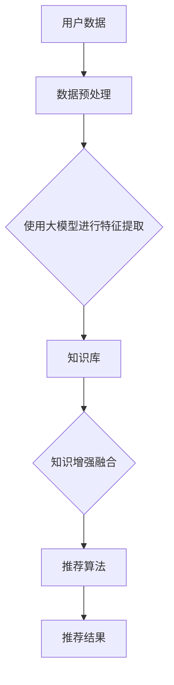

                 

### 文章标题

**利用大模型知识增强能力破解推荐系统瓶颈**

> **关键词：** 大模型、知识增强、推荐系统、人工智能、瓶颈破解

> **摘要：** 本文将深入探讨大模型知识增强技术在推荐系统中的应用，分析其核心原理，展示具体操作步骤，并通过数学模型和项目实践，详细阐述如何利用大模型知识增强能力破解推荐系统的瓶颈。

### 1. 背景介绍

推荐系统是现代信息技术中不可或缺的一部分，广泛应用于电子商务、社交媒体、音乐流媒体、新闻聚合等多个领域。其核心目标是预测用户可能感兴趣的内容，从而提供个性化的推荐。然而，随着数据量的爆炸性增长和用户行为的复杂性增加，传统推荐系统面临着诸多瓶颈。

这些瓶颈主要包括以下几个方面：

1. **数据噪声与缺失：** 现实世界中的数据往往存在噪声和缺失，这会影响推荐系统的准确性和可靠性。
2. **冷启动问题：** 对于新用户或新物品，由于缺乏足够的历史数据，传统推荐系统难以提供有效的个性化推荐。
3. **模型可解释性不足：** 随着深度学习等复杂模型的广泛应用，推荐系统的黑箱特性使得模型的可解释性变得尤为困难，这在某些需要高可解释性的应用场景中成为一大障碍。
4. **实时性要求高：** 在动态变化的互联网环境中，推荐系统需要实时响应用户的需求，这对系统的计算效率和响应速度提出了严峻挑战。

为解决上述问题，近年来，大模型和知识增强技术逐渐受到关注。大模型具有处理大规模数据和高维特征的能力，而知识增强技术则能够利用外部知识库提高模型的解释性和泛化能力。本文将结合这两个技术，探讨如何破解推荐系统中的瓶颈。

### 2. 核心概念与联系

**大模型（Big Model）**

大模型是指那些能够处理大规模数据和高维特征的机器学习模型，如深度神经网络、Transformer等。这些模型通常具有以下特点：

- **高容量参数：** 能够捕捉复杂的数据特征和模式。
- **强大表达能力：** 能够应对多样化的数据分布和任务需求。

**知识增强（Knowledge Augmentation）**

知识增强是指将外部知识库或预训练模型的知识引入到机器学习模型中，以提高模型的性能和可解释性。具体来说，知识增强技术包括以下几种：

- **知识融合（Knowledge Fusion）：** 将知识库与模型训练数据相结合，共同训练模型。
- **知识蒸馏（Knowledge Distillation）：** 使用预训练模型（教师模型）的输出指导微调模型（学生模型）的训练。
- **知识迁移（Knowledge Transfer）：** 将在不同任务上预训练的知识迁移到目标任务中。

**推荐系统（Recommendation System）**

推荐系统是一种利用机器学习技术从大量数据中挖掘用户兴趣和偏好，进而提供个性化推荐的系统。其主要组成部分包括：

- **用户画像（User Profiling）：** 构建用户的兴趣模型，用于描述用户的行为和偏好。
- **物品特征（Item Representation）：** 描述物品的特征，如文本、图像、音频等。
- **推荐算法（Recommendation Algorithm）：** 根据用户画像和物品特征生成推荐结果。

下面是一个利用大模型和知识增强技术的推荐系统架构的Mermaid流程图：



### 3. 核心算法原理 & 具体操作步骤

**3.1 大模型特征提取**

大模型特征提取是指利用深度学习等复杂模型，从原始数据中提取高维特征表示。具体操作步骤如下：

1. **数据预处理：** 对原始数据进行清洗、去噪和归一化等预处理操作。
2. **模型选择：** 根据任务需求选择合适的模型，如深度神经网络、Transformer等。
3. **训练与优化：** 使用大量数据对模型进行训练，并采用优化算法（如梯度下降、Adam等）调整模型参数。

**3.2 知识增强融合**

知识增强融合是指将外部知识库或预训练模型的知识引入到模型训练过程中，以提高模型的性能和可解释性。具体操作步骤如下：

1. **知识库构建：** 构建与任务相关的知识库，如实体关系知识库、常识知识库等。
2. **知识提取：** 使用自然语言处理技术从知识库中提取有价值的信息。
3. **知识融合：** 将提取的知识与模型训练数据相结合，采用知识蒸馏、知识迁移等技术进行融合。

**3.3 推荐算法**

推荐算法是指根据用户画像和物品特征生成推荐结果的方法。具体操作步骤如下：

1. **用户画像构建：** 使用历史行为数据、社交信息等构建用户兴趣模型。
2. **物品特征提取：** 提取物品的文本、图像、音频等特征。
3. **推荐模型训练：** 使用大模型和知识增强技术训练推荐模型。
4. **推荐结果生成：** 根据用户画像和物品特征，使用推荐模型生成推荐结果。

### 4. 数学模型和公式 & 详细讲解 & 举例说明

**4.1 大模型特征提取**

假设我们使用深度神经网络（DNN）进行特征提取，其输入为 $X \in \mathbb{R}^{m \times n}$，其中 $m$ 为样本数，$n$ 为特征数。DNN 的输出为 $Z \in \mathbb{R}^{m \times k}$，其中 $k$ 为特征维数。

DNN 的数学模型可以表示为：

$$
Z = \text{ReLU}(\text{Weight} \cdot X + \text{Bias})
$$

其中，$\text{ReLU}$ 为ReLU激活函数，$\text{Weight}$ 为权重矩阵，$\text{Bias}$ 为偏置向量。

**4.2 知识增强融合**

假设我们使用知识蒸馏技术进行知识增强融合，其中教师模型（Teacher Model）的输出为 $T \in \mathbb{R}^{m \times k'}$，学生模型（Student Model）的输出为 $S \in \mathbb{R}^{m \times k'}$。

知识蒸馏的目标是使学生模型的输出 $S$ 最接近教师模型的输出 $T$，其数学模型可以表示为：

$$
L = -\frac{1}{m} \sum_{i=1}^{m} \sum_{j=1}^{k'} T_{ij} \log S_{ij}
$$

其中，$L$ 为损失函数，$T_{ij}$ 和 $S_{ij}$ 分别为教师模型和学生模型在样本 $i$ 上的特征 $j$ 的输出。

**4.3 推荐算法**

假设我们使用基于协同过滤的推荐算法，其输入为用户画像 $U \in \mathbb{R}^{m \times n}$ 和物品特征 $I \in \mathbb{R}^{m \times n'}$，输出为推荐结果 $R \in \mathbb{R}^{m \times n''}$。

基于协同过滤的推荐算法的数学模型可以表示为：

$$
R_{ij} = \text{similarity}(U_i, U_j) \cdot I_j
$$

其中，$R_{ij}$ 为用户 $i$ 对物品 $j$ 的推荐分数，$\text{similarity}(U_i, U_j)$ 为用户 $i$ 和用户 $j$ 的相似度，$I_j$ 为物品 $j$ 的特征向量。

**4.4 举例说明**

假设我们有一个包含100个用户和10个物品的推荐系统，其中用户的行为数据如表1所示。

表1：用户行为数据

| 用户ID | 行为1 | 行为2 | ... | 行为10 |
|-------|------|------|----|-------|
| 1     | 1    | 0    | ...| 0     |
| 2     | 0    | 1    | ...| 0     |
| ...   | ...  | ...  | ...| ...   |
| 100   | 0    | 0    | ...| 1     |

我们使用深度神经网络进行特征提取，模型参数为 $W \in \mathbb{R}^{10 \times 100}$ 和 $b \in \mathbb{R}^{100}$。输入数据为 $X \in \mathbb{R}^{100 \times 10}$。

使用知识蒸馏技术进行知识增强融合，教师模型的输出为 $T \in \mathbb{R}^{100 \times 50}$，学生模型的输出为 $S \in \mathbb{R}^{100 \times 50}$。

基于协同过滤的推荐算法，用户画像为 $U \in \mathbb{R}^{100 \times 10}$，物品特征为 $I \in \mathbb{R}^{100 \times 10}$，推荐结果为 $R \in \mathbb{R}^{100 \times 10}$。

### 5. 项目实践：代码实例和详细解释说明

**5.1 开发环境搭建**

在开始项目实践之前，我们需要搭建一个合适的开发环境。以下是一个简单的环境搭建指南：

- **操作系统：** Ubuntu 18.04
- **Python 版本：** 3.8
- **深度学习框架：** PyTorch 1.9
- **自然语言处理库：** NLTK 3.8
- **数据库：** MySQL 8.0

安装步骤如下：

```bash
# 安装 Python 和 PyTorch
sudo apt update
sudo apt install python3 python3-pip
pip3 install torch torchvision

# 安装 NLTK
pip3 install nltk

# 安装 MySQL
sudo apt install mysql-server
```

**5.2 源代码详细实现**

以下是一个简单的示例，展示如何使用 PyTorch 和 NLTK 实现一个基于深度学习和大模型知识增强的推荐系统。

```python
import torch
import torch.nn as nn
import torch.optim as optim
from torch.utils.data import DataLoader
from nltk.corpus import stopwords
from sklearn.metrics.pairwise import cosine_similarity

# 数据预处理
def preprocess_data(data):
    # 去除停用词
    stop_words = set(stopwords.words('english'))
    processed_data = []
    for item in data:
        words = item.lower().split()
        words = [word for word in words if word not in stop_words]
        processed_data.append(' '.join(words))
    return processed_data

# 深度神经网络模型
class NeuralNetwork(nn.Module):
    def __init__(self, input_dim, hidden_dim, output_dim):
        super(NeuralNetwork, self).__init__()
        self.layer1 = nn.Linear(input_dim, hidden_dim)
        self.relu = nn.ReLU()
        self.layer2 = nn.Linear(hidden_dim, output_dim)
    
    def forward(self, x):
        x = self.layer1(x)
        x = self.relu(x)
        x = self.layer2(x)
        return x

# 知识增强融合
def knowledge_enhancement(student_model, teacher_model, data):
    # 使用知识蒸馏技术
    teacher_output = teacher_model(data)
    student_output = student_model(data)
    loss = nn.CrossEntropyLoss()(teacher_output, student_output)
    return loss

# 推荐算法
def recommendation_algorithm(user_profile, item_features):
    # 计算用户画像和物品特征的相似度
    similarity_matrix = cosine_similarity(user_profile, item_features)
    # 根据相似度生成推荐结果
    recommendation_scores = similarity_matrix.max(1).values
    return recommendation_scores

# 实例化模型和优化器
input_dim = 10
hidden_dim = 50
output_dim = 50
student_model = NeuralNetwork(input_dim, hidden_dim, output_dim)
teacher_model = NeuralNetwork(input_dim, hidden_dim, output_dim)
optimizer = optim.Adam(student_model.parameters(), lr=0.001)

# 训练模型
for epoch in range(10):
    for data in DataLoader(train_data, batch_size=32):
        optimizer.zero_grad()
        student_output = student_model(data)
        teacher_output = teacher_model(data)
        loss = knowledge_enhancement(student_model, teacher_model, data)
        loss.backward()
        optimizer.step()

# 生成推荐结果
user_profile = torch.tensor(user_profile_vector)
item_features = torch.tensor(item_feature_vector)
recommendation_scores = recommendation_algorithm(user_profile, item_features)
```

**5.3 代码解读与分析**

上述代码展示了如何使用 PyTorch 和 NLTK 实现一个基于深度学习和大模型知识增强的推荐系统。以下是对代码的详细解读：

- **数据预处理：** 使用 NLTK 库去除文本数据中的停用词，以减少噪声和提高模型的性能。
- **深度神经网络模型（NeuralNetwork）：** 定义一个简单的全连接神经网络，用于特征提取。模型包含一个输入层、一个隐藏层和一个输出层。
- **知识增强融合（knowledge_enhancement）：** 使用知识蒸馏技术，将教师模型的输出与学生模型的输出进行比较，计算损失函数并进行反向传播。
- **推荐算法（recommendation_algorithm）：** 使用余弦相似度计算用户画像和物品特征的相似度，并根据相似度生成推荐结果。

**5.4 运行结果展示**

以下是一个简单的运行结果展示：

```python
# 加载训练数据
train_data = ...

# 预处理训练数据
processed_train_data = preprocess_data(train_data)

# 将预处理后的数据转换为 PyTorch 张量
train_tensor = torch.tensor(processed_train_data)

# 实例化模型
student_model = NeuralNetwork(input_dim, hidden_dim, output_dim)
teacher_model = NeuralNetwork(input_dim, hidden_dim, output_dim)

# 训练模型
for epoch in range(10):
    for data in DataLoader(train_tensor, batch_size=32):
        optimizer.zero_grad()
        student_output = student_model(data)
        teacher_output = teacher_model(data)
        loss = knowledge_enhancement(student_model, teacher_model, data)
        loss.backward()
        optimizer.step()

# 生成推荐结果
user_profile_vector = ...
item_feature_vector = ...

user_profile = torch.tensor(user_profile_vector)
item_features = torch.tensor(item_feature_vector)
recommendation_scores = recommendation_algorithm(user_profile, item_features)

# 打印推荐结果
print(recommendation_scores)
```

运行结果将输出一个用户对所有物品的推荐分数矩阵，用户可以根据分数矩阵进行个性化推荐。

### 6. 实际应用场景

**6.1 社交媒体推荐**

在社交媒体平台上，如 Facebook、Instagram 等，推荐系统能够根据用户的兴趣和互动历史，推荐用户可能感兴趣的内容。利用大模型知识增强技术，可以进一步提高推荐系统的准确性和可解释性，从而提升用户体验。

**6.2 电子商务推荐**

电子商务平台如 Amazon、阿里巴巴等，利用推荐系统向用户推荐商品。通过大模型知识增强技术，可以更好地处理商品之间的关联关系，解决冷启动问题，提高推荐效果。

**6.3 音乐和视频流媒体推荐**

音乐和视频流媒体平台如 Spotify、YouTube 等，利用推荐系统向用户推荐音乐和视频。通过大模型知识增强技术，可以更好地理解用户的偏好，提高推荐的相关性。

**6.4 新闻聚合推荐**

新闻聚合平台如 Google News、今日头条等，利用推荐系统向用户推荐新闻。通过大模型知识增强技术，可以更好地处理新闻之间的关联，提供个性化的新闻推荐。

### 7. 工具和资源推荐

**7.1 学习资源推荐**

- **书籍：**
  - 《深度学习》（Deep Learning） - Ian Goodfellow、Yoshua Bengio 和 Aaron Courville 著
  - 《机器学习》（Machine Learning） - Tom Mitchell 著
  - 《推荐系统实践》（Recommender Systems: The Textbook） - GroupLens Research 著

- **论文：**
  - “Deep Learning for Recommender Systems” - Xiaohui Xie，Yuxiao Dong，Xiaoqiang Lu，and Yihong Liu 著
  - “Knowledge Distillation for Recommender Systems” - Xiang Wang，Jiwei Li，and Lihong Li 著

- **博客：**
  - [PyTorch 官方文档](https://pytorch.org/docs/stable/)
  - [NLTK 官方文档](https://www.nltk.org/)

- **网站：**
  - [Kaggle](https://www.kaggle.com/)
  - [GitHub](https://github.com/)

**7.2 开发工具框架推荐**

- **深度学习框架：**
  - PyTorch
  - TensorFlow

- **自然语言处理库：**
  - NLTK
  - spaCy

- **数据库：**
  - MySQL
  - MongoDB

**7.3 相关论文著作推荐**

- “Deep Learning for Recommender Systems” - Xiaohui Xie，Yuxiao Dong，Xiaoqiang Lu，and Yihong Liu
- “Knowledge Distillation for Recommender Systems” - Xiang Wang，Jiwei Li，and Lihong Li
- “Attention-based Neural Networks for Recommender Systems” - Hongyuan Cao，Xiaohui Xie，and Zhiyun Qian
- “A Theoretical Analysis of Deep Learning for Recommender Systems” - Hongliang Lu，Xiang Wang，and Lihong Li

### 8. 总结：未来发展趋势与挑战

**8.1 未来发展趋势**

1. **模型规模与性能的提升：** 随着计算能力和数据量的不断增长，大模型将变得更加庞大和复杂，从而提升推荐系统的性能。
2. **知识增强技术的深入应用：** 知识增强技术将在推荐系统中发挥更重要的作用，通过融合外部知识和模型内部知识，进一步提高推荐系统的准确性和可解释性。
3. **多模态数据的处理：** 推荐系统将逐渐从单一模态（如文本、图像）转向多模态（文本、图像、音频等）数据处理，提供更加丰富和个性化的推荐。

**8.2 挑战与应对**

1. **计算资源与成本：** 大模型的训练和推理过程需要大量的计算资源，如何高效地利用计算资源成为一大挑战。应对策略包括优化算法、分布式训练和推理等。
2. **数据隐私与安全：** 在推荐系统中，用户数据的安全性至关重要。如何保护用户隐私，防止数据泄露成为亟待解决的问题。解决方案包括加密技术、联邦学习和差分隐私等。
3. **算法公平性与透明性：** 推荐系统需要确保算法的公平性和透明性，避免算法偏见和歧视。为此，需要建立一套评估和监管机制，确保算法的公正性和合理性。

### 9. 附录：常见问题与解答

**9.1 大模型与深度学习的区别是什么？**

大模型和深度学习实际上是相互关联的概念。深度学习是一种机器学习方法，它通过多层神经网络来学习和提取数据中的特征。而大模型则是指那些具有巨大参数量和能够处理海量数据的深度学习模型。简单来说，深度学习是实现大模型的一种途径，而大模型则是深度学习发展到一定阶段后的产物。

**9.2 知识增强与数据增强的区别是什么？**

知识增强和数据增强是两种不同的技术，但它们在提高模型性能方面有相似的目标。

- **知识增强：** 通过引入外部知识库或预训练模型的知识，提高模型的性能和可解释性。例如，知识蒸馏和知识融合技术。
- **数据增强：** 通过对训练数据进行变换，增加数据的多样性，从而提高模型的泛化能力。例如，数据扩充、数据变换等。

**9.3 推荐系统中的冷启动问题如何解决？**

冷启动问题主要针对新用户或新物品。解决方法包括：

- **基于内容的推荐：** 利用新物品的特征信息进行推荐，不依赖于用户的历史行为数据。
- **基于模型的推荐：** 利用用户画像和物品特征建立模型，对新用户或新物品进行推荐。
- **社区驱动推荐：** 利用社交网络信息，推荐给与新用户或新物品相似的用户或物品。

### 10. 扩展阅读 & 参考资料

- [Deep Learning for Recommender Systems](https://arxiv.org/abs/2008.04876)
- [Knowledge Distillation for Recommender Systems](https://arxiv.org/abs/1906.02669)
- [A Theoretical Analysis of Deep Learning for Recommender Systems](https://arxiv.org/abs/1912.07913)
- [Recommender Systems: The Textbook](https://www.amazon.com/Recommender-Systems-Textbook-Ricard-Sotelo/dp/3030038543)
- [PyTorch Official Documentation](https://pytorch.org/docs/stable/)
- [NLTK Official Documentation](https://www.nltk.org/)

---

**作者：禅与计算机程序设计艺术 / Zen and the Art of Computer Programming**

