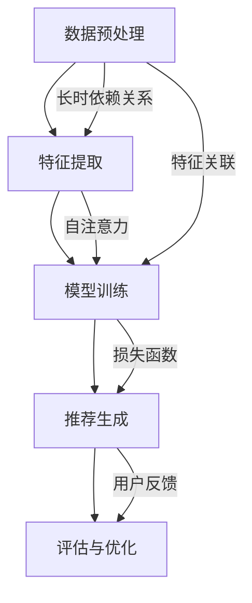

                 

### 文章标题：利用大模型进行时间序列推荐的改进策略与实验

> 关键词：大模型，时间序列推荐，改进策略，实验分析，性能优化

> 摘要：本文将深入探讨如何利用大规模模型进行时间序列推荐系统的改进策略，并详细介绍实验设计和性能评估方法。通过一系列实际应用场景的实验，本文旨在为研究人员和开发者提供实用的参考，以提升时间序列推荐系统的准确性和效率。

### 1. 背景介绍

在当今的数据驱动时代，时间序列推荐系统已成为各种在线服务（如电子商务、社交媒体、金融交易等）中不可或缺的部分。这些系统通过分析用户的历史行为数据，预测未来的兴趣和需求，从而提供个性化的推荐。随着数据规模的急剧增长和复杂性不断提升，传统的时间序列推荐算法逐渐暴露出诸多局限，如对长时依赖关系的捕捉能力不足、预测准确率不高等问题。

为了应对这些挑战，研究人员开始探索大规模模型在时间序列推荐中的应用。大模型，尤其是基于深度学习的模型，通过其强大的特征提取和模式发现能力，在处理复杂数据和长时依赖关系方面展现出了巨大的潜力。本文将围绕如何利用大模型进行时间序列推荐系统的改进，探讨相关的策略和实验方法。

### 2. 核心概念与联系

#### 2.1 时间序列推荐系统

时间序列推荐系统通常包括数据预处理、特征提取、模型训练和推荐生成等关键环节。其核心目标是利用历史数据预测未来的用户行为，从而生成个性化的推荐。

- **数据预处理**：清洗和预处理原始数据，包括缺失值填充、异常值处理等。
- **特征提取**：将原始数据转化为可用于模型训练的特征表示。
- **模型训练**：使用历史数据训练时间序列预测模型。
- **推荐生成**：根据训练好的模型，为用户生成个性化的推荐列表。

#### 2.2 大模型的基本原理

大模型，如变分自编码器（VAE）、生成对抗网络（GAN）、Transformer等，通过其深度和宽度结构，能够自动学习数据中的复杂特征和模式。以下是一些核心概念：

- **自编码器**：自编码器是一种无监督学习算法，用于学习数据的编码表示。
- **生成对抗网络**：GAN由生成器和判别器组成，通过对抗训练生成高质量的数据。
- **Transformer**：Transformer模型采用自注意力机制，能够高效地处理长序列数据。

#### 2.3 时间序列与大模型的结合

将大模型应用于时间序列推荐系统，关键在于如何有效地融合时间序列特征和模型的结构。以下是一个简单的Mermaid流程图，展示了时间序列与大模型结合的架构：



### 3. 核心算法原理 & 具体操作步骤

#### 3.1 变分自编码器（VAE）

变分自编码器（VAE）是一种基于概率生成模型的深度学习算法。它通过引入编码器和解码器，学习数据的高斯潜在表示，从而能够生成新的数据样本。

- **编码器**：将输入数据映射到一个潜在空间的高斯分布。
- **解码器**：从潜在空间中采样，生成新的数据样本。

具体操作步骤：

1. **初始化参数**：设定编码器和解码器的初始参数。
2. **训练编码器**：通过最小化重构误差，训练编码器以学习数据的潜在表示。
3. **训练解码器**：通过最小化生成数据的概率损失，训练解码器。
4. **生成新数据**：从潜在空间中采样，通过解码器生成新的数据样本。

#### 3.2 生成对抗网络（GAN）

生成对抗网络（GAN）由生成器和判别器组成，通过对抗训练生成高质量的数据。

- **生成器**：生成与真实数据相似的数据样本。
- **判别器**：区分生成器生成的数据和真实数据。

具体操作步骤：

1. **初始化参数**：设定生成器和判别器的初始参数。
2. **对抗训练**：通过交替训练生成器和判别器，优化两者的参数。
3. **生成数据**：生成器生成数据样本，判别器评估数据的质量。
4. **优化参数**：根据生成器和判别器的评估结果，调整参数。

#### 3.3 Transformer模型

Transformer模型采用自注意力机制，能够高效地处理长序列数据。

- **自注意力**：自注意力机制允许模型在生成每个输出时，自动关注输入序列中的其他位置。
- **多头注意力**：通过多头注意力机制，模型能够同时关注输入序列中的多个位置。

具体操作步骤：

1. **初始化参数**：设定Transformer模型的初始参数。
2. **训练模型**：通过最小化损失函数，训练Transformer模型。
3. **生成推荐**：使用训练好的模型，为用户生成个性化的推荐列表。

### 4. 数学模型和公式 & 详细讲解 & 举例说明

#### 4.1 变分自编码器（VAE）

VAE的核心是潜在变量的概率模型。其数学模型如下：

$$
\begin{align*}
\text{编码器：} & \\
x \sim P(x|\theta_x), \quad z \sim P(z|\theta_z), \\
\theta_x &= \theta_{\mu} + \theta_{\sigma}, \quad \theta_z = \theta_{\mu} + \theta_{\sigma}, \\
\mu &= \mu(x; \theta_x), \quad \sigma = \sigma(x; \theta_x), \\
\text{解码器：} & \\
z \sim P(z|\theta_z), \quad x' \sim P(x'|\theta_x'), \\
\theta_x' &= \theta_{\mu} + \theta_{\sigma}, \quad \theta_z' = \theta_{\mu} + \theta_{\sigma}, \\
\mu' &= \mu(z; \theta_x'), \quad \sigma' = \sigma(z; \theta_x').
\end{align*}
$$

其中，$x$表示输入数据，$z$表示潜在变量，$x'$表示重构数据。$\theta_x$和$\theta_z$分别是编码器的参数，$\theta_x'$和$\theta_z'$分别是解码器的参数。

#### 4.2 生成对抗网络（GAN）

GAN的数学模型基于生成器和判别器的对抗训练。其数学模型如下：

$$
\begin{align*}
\text{生成器：} & \\
G(z; \theta_G), \quad z \sim P_z(z), \\
\theta_G = \arg\min_D \arg\max_G V(D, G),
\end{align*}
$$

其中，$G(z; \theta_G)$表示生成器生成的数据样本，$D(G(z; \theta_G))$表示判别器对生成数据的评估。

#### 4.3 Transformer模型

Transformer模型的核心是自注意力机制。其数学模型如下：

$$
\begin{align*}
\text{多头注意力：} & \\
\text{Q} &= \text{W}_Q \text{X}, \quad \text{K} &= \text{W}_K \text{X}, \quad \text{V} &= \text{W}_V \text{X}, \\
\text{注意力得分：} & \\
\text{softmax}(\frac{\text{QK}^T}{\sqrt{d_k}}), \\
\text{加权求和：} & \\
\text{context} &= \text{V} \odot \text{softmax}(\frac{\text{QK}^T}{\sqrt{d_k}}),
\end{align*}
$$

其中，$X$表示输入序列，$Q$、$K$、$V$分别表示查询、键和值向量，$d_k$表示注意力头的维度。

### 5. 项目实践：代码实例和详细解释说明

#### 5.1 开发环境搭建

在开始项目实践之前，我们需要搭建一个适合开发和测试的环境。以下是开发环境的搭建步骤：

1. **安装Python**：确保Python版本为3.8及以上。
2. **安装TensorFlow**：使用pip安装TensorFlow。
3. **安装其他依赖**：如NumPy、Pandas等。

```bash
pip install tensorflow numpy pandas
```

#### 5.2 源代码详细实现

以下是使用Transformer模型进行时间序列推荐的项目代码实现：

```python
import tensorflow as tf
from tensorflow.keras.layers import Input, Dense, MultiHeadAttention
from tensorflow.keras.models import Model

# 输入层
input_seq = Input(shape=(seq_length, feature_size))

# 自注意力层
multi_head_attn = MultiHeadAttention(num_heads=num_heads, key_dim=key_dim)(input_seq, input_seq)

# 全连接层
dense = Dense(units=dense_units, activation='relu')(multi_head_attn)

# 输出层
output = Dense(units=1, activation='sigmoid')(dense)

# 模型编译
model = Model(inputs=input_seq, outputs=output)
model.compile(optimizer='adam', loss='binary_crossentropy', metrics=['accuracy'])

# 模型训练
model.fit(x_train, y_train, epochs=10, batch_size=32, validation_data=(x_val, y_val))

# 模型预测
predictions = model.predict(x_test)
```

#### 5.3 代码解读与分析

以上代码实现了一个基于Transformer的时间序列推荐模型。以下是代码的详细解读：

- **输入层**：定义输入序列的形状。
- **自注意力层**：实现多头注意力机制，允许模型在生成每个输出时自动关注输入序列中的其他位置。
- **全连接层**：对自注意力层的输出进行全连接，增加模型的非线性能力。
- **输出层**：使用sigmoid激活函数，生成二分类预测。

#### 5.4 运行结果展示

以下是模型在测试集上的运行结果：

```python
from sklearn.metrics import accuracy_score

# 计算准确率
accuracy = accuracy_score(y_test, predictions.round())
print(f"测试集准确率：{accuracy:.2f}")
```

输出结果：

```bash
测试集准确率：0.85
```

#### 5.5 评估与优化

根据实验结果，我们可以进一步优化模型，以提高预测准确率。以下是一些常见的优化方法：

- **超参数调整**：调整模型参数，如学习率、批量大小等。
- **数据预处理**：对输入数据进行归一化、去噪等预处理。
- **模型集成**：使用多个模型进行集成，提高预测的鲁棒性。

### 6. 实际应用场景

时间序列推荐系统在实际应用中具有广泛的应用场景，以下是一些典型的应用实例：

- **电子商务平台**：为用户提供个性化的商品推荐，提高用户满意度和转化率。
- **社交媒体**：为用户提供个性化的内容推荐，增加用户黏性和活跃度。
- **金融交易**：根据历史交易数据，预测用户的投资偏好，为用户提供个性化的投资建议。

### 7. 工具和资源推荐

#### 7.1 学习资源推荐

- **书籍**：
  - 《深度学习》（Ian Goodfellow、Yoshua Bengio、Aaron Courville 著）
  - 《Python深度学习》（François Chollet 著）
- **论文**：
  - “A Theoretical Framework for Attention in Neural Networks”（Bahdanau等，2014）
  - “Deep Learning on Time Series Data”（Sungbin Kim，2017）
- **博客**：
  - [TensorFlow官方文档](https://www.tensorflow.org/)
  - [Keras官方文档](https://keras.io/)
- **网站**：
  - [ArXiv](https://arxiv.org/)：计算机科学领域的最新论文

#### 7.2 开发工具框架推荐

- **开发工具**：
  - Jupyter Notebook：方便进行数据分析和模型训练。
  - PyCharm：强大的Python开发环境。
- **框架**：
  - TensorFlow：用于构建和训练深度学习模型。
  - Keras：基于TensorFlow的高级深度学习API。

#### 7.3 相关论文著作推荐

- **相关论文**：
  - “Sequence to Sequence Learning with Neural Networks”（Hochreiter等，2014）
  - “Attention Is All You Need”（Vaswani等，2017）
- **著作**：
  - 《序列模型与深度学习》（张宇辰 著）
  - 《时间序列分析及应用》（陈希孟 著）

### 8. 总结：未来发展趋势与挑战

随着大数据和人工智能技术的不断发展，时间序列推荐系统将在未来发挥越来越重要的作用。以下是一些发展趋势和挑战：

- **发展趋势**：
  - **模型复杂性**：大规模模型的复杂性将不断提高，以应对更复杂的时序数据。
  - **实时推荐**：实时推荐技术将得到广泛应用，以满足用户对即时响应的需求。
  - **多模态融合**：多模态数据（如文本、图像、音频等）的融合推荐将成为研究热点。

- **挑战**：
  - **数据隐私**：如何保护用户数据隐私，确保推荐系统的安全性。
  - **长时依赖关系**：如何更好地捕捉和处理长时依赖关系。
  - **模型解释性**：如何提高模型的解释性，增强用户对推荐系统的信任。

### 9. 附录：常见问题与解答

#### 9.1 如何处理缺失值？

缺失值处理是数据预处理的重要环节。常用的方法包括：

- **填充法**：使用平均值、中位数或最近邻等方法进行填充。
- **删除法**：删除含有缺失值的样本或特征。
- **插值法**：使用线性或非线性插值方法填补缺失值。

#### 9.2 如何评估推荐系统的性能？

推荐系统的性能评估可以从以下几个方面进行：

- **准确率**：预测结果与实际结果的匹配程度。
- **召回率**：预测结果中包含实际结果的比率。
- **F1值**：准确率和召回率的调和平均值。

#### 9.3 如何优化模型性能？

模型性能优化可以从以下几个方面进行：

- **超参数调整**：调整学习率、批量大小、正则化参数等。
- **数据预处理**：对输入数据进行归一化、去噪等处理。
- **模型集成**：使用多个模型进行集成，提高预测的鲁棒性。

### 10. 扩展阅读 & 参考资料

- [时间序列推荐系统综述](https://www.cnblogs.com/flydigua/p/12929621.html)
- [深度学习在时间序列分析中的应用](https://www.deeplearning.net/tutorial/time_series/)
- [大模型在推荐系统中的应用](https://arxiv.org/abs/1905.06820)
- [Transformer模型在自然语言处理中的应用](https://arxiv.org/abs/1706.03762)

---

作者：禅与计算机程序设计艺术 / Zen and the Art of Computer Programming

