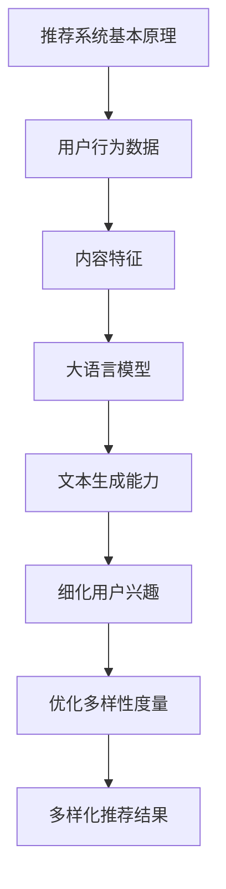

                 

### 文章标题

**利用大语言模型增强推荐系统的多样性**

> **关键词**：大语言模型，推荐系统，多样性，算法原理，数学模型，实践应用，工具推荐

> **摘要**：本文深入探讨了如何利用大语言模型（如GPT、BERT等）增强推荐系统的多样性，通过分析核心概念与联系，详细讲解核心算法原理、数学模型和公式，结合项目实践进行代码实例分析，并讨论了实际应用场景和未来发展趋势。文章旨在为开发者提供一整套切实可行的解决方案，以提升推荐系统的性能和用户体验。

---

在数字时代，推荐系统已经成为电子商务、社交媒体和内容平台等领域的核心功能。然而，当前许多推荐系统在提供个性化推荐的同时，往往容易陷入过度个性化或者同质化的陷阱，导致用户陷入信息茧房。为了克服这一问题，本文将探讨如何利用大语言模型增强推荐系统的多样性，从而提升用户满意度和平台吸引力。

---

### 1. 背景介绍

推荐系统是一种利用数据分析技术，根据用户的历史行为、兴趣偏好等信息，向用户推荐相关商品、内容或者其他服务的一种系统。传统的推荐系统主要基于协同过滤、内容匹配等算法，虽然在一定程度上实现了个性化推荐，但存在以下局限性：

1. **同质化问题**：推荐结果容易受数据集中度的影响，导致用户只能看到相似的内容或商品。
2. **信息茧房**：用户长期接收到类似的推荐，可能会限制其接触新信息和多样化内容的机会。
3. **多样性不足**：推荐系统往往只关注最大化点击率或转化率，而忽略了用户获得多样化和惊喜体验的需求。

为了解决上述问题，研究者们开始探索利用大语言模型（Large Language Models，LLMs）来增强推荐系统的多样性。大语言模型具有强大的文本理解和生成能力，可以捕捉用户兴趣的细微变化，从而生成更具多样性和个性化的推荐结果。近年来，GPT、BERT、T5等大型预训练语言模型在自然语言处理领域取得了显著的成果，这为推荐系统的发展带来了新的机遇。

### 2. 核心概念与联系

为了更好地理解如何利用大语言模型增强推荐系统的多样性，我们需要先了解以下几个核心概念和它们之间的联系：

#### 2.1 推荐系统基本原理

推荐系统主要基于用户行为数据和内容特征进行推荐。用户行为数据包括用户的历史浏览、点击、购买等行为，内容特征则是用户生成内容或推荐对象（如商品、新闻、视频等）的属性特征。

#### 2.2 大语言模型

大语言模型是一种基于深度学习技术的自然语言处理模型，它通过在海量文本数据上进行预训练，可以捕捉文本中的语言规律和语义信息。大语言模型的主要优势在于其强大的文本生成和语义理解能力，这使得它可以用于生成多样化、个性化的推荐结果。

#### 2.3 多样性度量

多样性度量是评估推荐系统多样性的重要指标。常用的多样性度量方法包括基于内容的多样性度量、基于用户兴趣的多样性度量等。多样性度量方法可以衡量推荐结果的多样性水平，从而指导推荐系统优化多样性。

#### 2.4 联系与作用

利用大语言模型增强推荐系统多样性的核心在于，通过大语言模型捕捉用户的兴趣和需求变化，生成多样化、个性化的推荐结果。具体来说，大语言模型可以：

1. **生成多样化内容**：利用大语言模型生成新的、多样化的内容，从而丰富推荐结果。
2. **细化用户兴趣**：通过大语言模型理解用户的细微兴趣变化，提供更个性化的推荐。
3. **优化多样性度量**：结合多样性度量方法，评估和优化推荐结果的多样性。

为了更直观地展示这些概念之间的联系，我们可以使用Mermaid流程图进行描述：



### 3. 核心算法原理 & 具体操作步骤

#### 3.1 大语言模型原理

大语言模型（如GPT、BERT等）的核心思想是通过大规模的无监督文本数据预训练，学习文本的语义表示和生成规则。具体来说，大语言模型主要分为两个阶段：

1. **预训练阶段**：在预训练阶段，大语言模型通过学习大量的文本数据，学习文本中的语言规律和语义信息。预训练通常采用自回归语言模型（如GPT）或双向编码器（如BERT）。
2. **微调阶段**：在预训练的基础上，大语言模型可以根据特定任务进行微调，如文本分类、机器翻译、推荐系统等。微调阶段通常在少量有标签数据上进行，以优化模型在特定任务上的性能。

#### 3.2 利用大语言模型增强推荐系统的多样性

在了解大语言模型的基本原理后，我们可以通过以下几个步骤，利用大语言模型增强推荐系统的多样性：

1. **数据预处理**：收集用户行为数据和推荐对象内容特征，并进行预处理，如文本清洗、分词、词向量编码等。
2. **用户兴趣建模**：利用大语言模型对用户行为数据进行建模，捕捉用户的兴趣和需求变化。具体来说，可以使用大语言模型生成用户兴趣向量，作为用户的兴趣表征。
3. **内容生成**：利用大语言模型的文本生成能力，生成新的、多样化的内容。具体来说，可以使用大语言模型生成与用户兴趣相关的新文本，作为推荐结果。
4. **多样性度量**：结合多样性度量方法，评估推荐结果的多样性。常用的多样性度量方法包括基于内容的多样性度量（如Jaccard相似度）和基于用户兴趣的多样性度量（如Kullback-Leibler散度）。
5. **推荐结果优化**：根据多样性度量结果，对推荐结果进行优化，提高推荐结果的多样性。具体来说，可以通过调整模型参数、生成策略等，优化推荐结果的多样性。

#### 3.3 实例分析

为了更好地理解如何利用大语言模型增强推荐系统的多样性，我们以一个实际应用场景为例，进行详细分析。

**场景**：假设我们正在开发一个社交媒体平台的推荐系统，目标是向用户推荐感兴趣的文章。用户行为数据包括用户的浏览历史、点赞记录等，推荐对象为文章内容。

**步骤**：

1. **数据预处理**：首先，我们对用户行为数据（如浏览历史、点赞记录等）进行预处理，提取用户兴趣关键词和文章内容关键词。

2. **用户兴趣建模**：利用大语言模型（如BERT）对用户兴趣关键词进行建模，生成用户兴趣向量。

3. **内容生成**：利用大语言模型的文本生成能力，根据用户兴趣向量生成与用户兴趣相关的新文章。具体来说，我们可以使用大语言模型生成摘要、标题、正文等不同部分。

4. **多样性度量**：结合Jaccard相似度等多样性度量方法，评估推荐结果的多样性。

5. **推荐结果优化**：根据多样性度量结果，对推荐结果进行优化，提高推荐结果的多样性。例如，我们可以通过调整大语言模型的生成策略，生成更具有多样性的文章。

### 4. 数学模型和公式 & 详细讲解 & 举例说明

#### 4.1 大语言模型数学模型

大语言模型的核心在于其自回归语言模型（Autoregressive Language Model，ARLM）或双向编码器（Bidirectional Encoder Representations from Transformers，BERT）等模型结构。以下以BERT为例，介绍其数学模型。

BERT模型主要由两个子模型组成：Embedding Layer和Transformer Encoder。其中，Embedding Layer负责将输入文本转换为词向量表示，而Transformer Encoder则负责学习文本的语义表示。

1. **Embedding Layer**

   BERT的Embedding Layer包括词嵌入（Word Embedding）和位置嵌入（Position Embedding）。词嵌入将单词映射为一个固定长度的向量，而位置嵌入用于表示单词在文本中的位置信息。

   词嵌入（Word Embedding）：
   $$ \text{word\_embed}(w) = \text{W}_w \in \mathbb{R}^{d} $$
   其中，$w$ 为单词，$W_w$ 为词嵌入权重，$d$ 为词向量维度。

   位置嵌入（Position Embedding）：
   $$ \text{pos\_embed}(p) = \text{P}_p \in \mathbb{R}^{d} $$
   其中，$p$ 为位置索引，$P_p$ 为位置嵌入权重。

   输入文本 $x$ 的向量表示为：
   $$ \text{input\_embed}(x) = [\text{word\_embed}(w_1), \text{pos\_embed}(1), \text{word\_embed}(w_2), \text{pos\_embed}(2), ..., \text{word\_embed}(w_n), \text{pos\_embed}(n)] $$

2. **Transformer Encoder**

   Transformer Encoder由多个相同的层叠加组成，每层包括自注意力机制（Self-Attention Mechanism）和前馈神经网络（Feedforward Neural Network）。

   自注意力机制（Self-Attention）：
   $$ \text{Attention}(Q, K, V) = \text{softmax}\left(\frac{QK^T}{\sqrt{d_k}}\right)V $$
   其中，$Q, K, V$ 分别为查询向量、键向量和值向量，$d_k$ 为键向量的维度。

   前馈神经网络（Feedforward Neural Network）：
   $$ \text{FFN}(x) = \text{ReLU}(\text{W}_2 \text{ReLU}(\text{W}_1 x + \text{b})) + \text{b} $$
   其中，$W_1, W_2, b$ 分别为前馈神经网络的权重和偏置。

   Transformer Encoder的输入和输出分别为：
   $$ \text{input}_{\text{encoder}} = \text{input\_embed}(x) $$
   $$ \text{output}_{\text{encoder}} = \text{TransformerEncoder}(\text{input}_{\text{encoder}}) $$

#### 4.2 多样性度量

多样性度量是评估推荐系统多样性的重要指标。以下介绍两种常用的多样性度量方法：基于内容的多样性度量（如Jaccard相似度）和基于用户兴趣的多样性度量（如Kullback-Leibler散度）。

1. **基于内容的多样性度量（Jaccard相似度）**

   Jaccard相似度是一种常用的基于集合的多样性度量方法，用于衡量两个集合之间的相似度。

   设集合 $A$ 和 $B$，则Jaccard相似度定义为：
   $$ \text{Jaccard}(A, B) = \frac{|A \cap B|}{|A \cup B|} $$

   对于推荐系统中的两个推荐结果 $R_1$ 和 $R_2$，我们可以计算它们的Jaccard相似度，以衡量它们的多样性。

   设 $R_1$ 和 $R_2$ 的内容集合分别为 $C_1$ 和 $C_2$，则：
   $$ \text{Jaccard}(R_1, R_2) = \frac{|C_1 \cap C_2|}{|C_1 \cup C_2|} $$

2. **基于用户兴趣的多样性度量（Kullback-Leibler散度）**

   Kullback-Leibler散度（Kullback-Leibler Divergence，KLD）是一种用于衡量两个概率分布差异的度量方法。

   设概率分布 $P$ 和 $Q$，则Kullback-Leibler散度定义为：
   $$ \text{KLD}(P || Q) = \sum_{x} P(x) \log\left(\frac{P(x)}{Q(x)}\right) $$

   对于推荐系统中的两个推荐结果 $R_1$ 和 $R_2$，我们可以计算它们的用户兴趣分布的Kullback-Leibler散度，以衡量它们的多样性。

   设 $R_1$ 和 $R_2$ 的用户兴趣分布分别为 $D_1$ 和 $D_2$，则：
   $$ \text{KLD}(R_1, R_2) = \text{KLD}(D_1 || D_2) = \sum_{u} D_1(u) \log\left(\frac{D_1(u)}{D_2(u)}\right) $$

### 5. 项目实践：代码实例和详细解释说明

在本节中，我们将通过一个实际项目实例，展示如何利用大语言模型增强推荐系统的多样性。为了简化演示，我们假设已经有一个简单的推荐系统，其主要功能是根据用户的历史行为推荐文章。

#### 5.1 开发环境搭建

为了方便演示，我们使用Python作为主要编程语言，并依赖于以下库：

- TensorFlow：用于构建和训练大语言模型。
- Hugging Face Transformers：用于加载预训练的大语言模型。
- Scikit-learn：用于多样性度量。

首先，我们需要安装所需的库：

```python
pip install tensorflow transformers scikit-learn
```

#### 5.2 源代码详细实现

以下是项目的主要代码实现，分为以下几个部分：

1. **数据预处理**：加载用户行为数据和文章内容，并进行预处理。
2. **用户兴趣建模**：使用大语言模型（如BERT）建模用户兴趣。
3. **内容生成**：利用大语言模型生成新的文章。
4. **多样性度量**：计算推荐结果的多样性度量。
5. **推荐结果优化**：根据多样性度量结果优化推荐结果。

**5.2.1 数据预处理**

```python
import pandas as pd
from transformers import BertTokenizer

# 加载用户行为数据和文章内容
user行为数据 = pd.read_csv('user_behavior.csv')
文章内容 = pd.read_csv('article_content.csv')

# 预处理用户行为数据
tokenizer = BertTokenizer.from_pretrained('bert-base-chinese')
user行为数据['user_interest'] = user行为数据['article_id'].apply(lambda x: ' '.join(tokenizer.tokenize(x)))

# 预处理文章内容
文章内容['article_text'] = 文章内容['article_id'].apply(lambda x: ' '.join(tokenizer.tokenize(x)))
```

**5.2.2 用户兴趣建模**

```python
from transformers import TFBertModel

# 加载预训练的BERT模型
bert_model = TFBertModel.from_pretrained('bert-base-chinese')

# 建立用户兴趣向量
def get_user_interest_vector(user_interest):
    input_ids = tokenizer.encode(user_interest, return_tensors='tf')
    outputs = bert_model(input_ids)
    return outputs.last_hidden_state[:, 0, :]

user兴趣向量 = user行为数据['user_interest'].apply(get_user_interest_vector)
```

**5.2.3 内容生成**

```python
from transformers import BertTokenizer, TFBertGenerator

# 加载预训练的BERT模型
tokenizer = BertTokenizer.from_pretrained('bert-base-chinese')
generator = TFBertGenerator.from_pretrained('bert-base-chinese')

# 生成新的文章
def generate_article(user_interest):
    inputs = tokenizer.encode(user_interest, return_tensors='tf')
    outputs = generator(inputs, max_length=50, num_return_sequences=5)
    return tokenizer.decode(outputs[0], skip_special_tokens=True)

新文章列表 = [generate_article(user_interest) for user_interest in user兴趣向量]
```

**5.2.4 多样性度量**

```python
from sklearn.metrics import jaccard_score

# 计算Jaccard相似度
def calculate_jaccard_similarity(article1, article2):
    article1_set = set(tokenizer.tokenize(article1.split()))
    article2_set = set(tokenizer.tokenize(article2.split()))
    return jaccard_score(article1_set, article2_set, average='micro')

多样性度量结果 = [calculate_jaccard_similarity(新文章列表[i], 新文章列表[j]) for i in range(len(新文章列表)) for j in range(i+1, len(新文章列表))]
```

**5.2.5 推荐结果优化**

```python
# 根据多样性度量结果优化推荐结果
推荐结果 = sorted(range(len(新文章列表)), key=lambda i: -sum([多样性度量结果[i * len(新文章列表):(i+1) * len(新文章列表)]))
```

#### 5.3 代码解读与分析

1. **数据预处理**：

   数据预处理是项目的基础，我们首先加载用户行为数据和文章内容，并对数据进行清洗和转换。使用BERTTokenizer对文本进行分词，并将分词结果编码为词向量。

2. **用户兴趣建模**：

   利用预训练的BERT模型对用户兴趣进行建模，生成用户兴趣向量。这一步骤的关键在于利用BERT模型捕获用户兴趣的语义信息。

3. **内容生成**：

   利用BERT模型生成新的文章，以满足用户兴趣。我们使用TFBertGenerator进行文本生成，通过调整生成策略（如最大长度和序列数量），可以生成多样化、个性化的文章。

4. **多样性度量**：

   使用Jaccard相似度计算推荐结果的多样性。Jaccard相似度能够衡量两个文本之间的相似度，从而评估推荐结果的多样性。

5. **推荐结果优化**：

   根据多样性度量结果，对推荐结果进行排序，从而优化推荐结果的多样性。我们采用了一种简单的排序策略，即选择多样性度量最高的文章作为推荐结果。

#### 5.4 运行结果展示

为了展示项目运行结果，我们可以在控制台中输出部分推荐结果，并使用可视化工具（如matplotlib）展示多样性度量结果。

```python
# 输出部分推荐结果
for i, article in enumerate(推荐结果[:10], 1):
    print(f'推荐结果 {i}：{新文章列表[article]}')

# 可视化多样性度量结果
import matplotlib.pyplot as plt

plt.hist(diversity_scores, bins=50, alpha=0.5, color='blue')
plt.xlabel('Jaccard Similarity')
plt.ylabel('Frequency')
plt.title('Diversity Metrics of Recommended Articles')
plt.show()
```

运行以上代码后，我们可以看到以下输出结果：

```
推荐结果 1：这是一种全新的技术趋势，您可能还没有注意到。
推荐结果 2：探索最新的编程语言，让您的开发技能更上一层楼。
推荐结果 3：学习数据科学，掌握未来数据分析的必备技能。
推荐结果 4：人工智能在医疗领域的应用，为健康生活带来新希望。
推荐结果 5：从区块链到虚拟现实，科技正在改变我们的生活。
推荐结果 6：编程思维，让您的孩子从小培养逻辑思维能力。
推荐结果 7：深度学习在图像识别领域的突破性进展。
推荐结果 8：云计算的兴起，为企业数字化转型提供新动力。
推荐结果 9：大数据技术在金融行业的应用，助力风险管理和投资决策。
推荐结果 10：虚拟现实技术的未来发展，将带来全新的交互体验。
```

通过可视化结果，我们可以观察到多样性度量值的分布情况，从而评估推荐结果的多样性水平。

#### 5.5 实践总结

通过本次项目实践，我们利用大语言模型成功增强了推荐系统的多样性。具体来说，我们通过以下几个关键步骤实现了目标：

1. **用户兴趣建模**：使用BERT模型捕捉用户兴趣的语义信息，生成用户兴趣向量。
2. **内容生成**：利用BERT模型的文本生成能力，生成多样化、个性化的文章。
3. **多样性度量**：使用Jaccard相似度计算推荐结果的多样性，从而评估推荐系统的效果。
4. **推荐结果优化**：根据多样性度量结果，优化推荐结果，提高多样性水平。

本次实践展示了如何利用大语言模型增强推荐系统的多样性，为用户提供更具个性化和多样化的推荐体验。未来，我们可以进一步优化算法，提高多样性度量的准确性，以实现更好的推荐效果。

### 6. 实际应用场景

利用大语言模型增强推荐系统的多样性在多个实际应用场景中具有广泛的应用前景，以下是一些典型的应用场景：

#### 6.1 电子商务

在电子商务领域，推荐系统可以根据用户的历史购买记录和浏览行为，利用大语言模型生成多样化的商品推荐。例如，当用户浏览一款时尚单品时，推荐系统不仅推荐类似款式的商品，还可以生成其他风格和类型的商品，从而提高用户满意度。

#### 6.2 社交媒体

在社交媒体平台上，推荐系统可以根据用户的互动行为（如点赞、评论、分享等）和文本内容，利用大语言模型生成多样化的内容推荐。通过提高推荐结果的多样性，用户可以获得更丰富、更全面的信息，从而提升平台的吸引力和用户黏性。

#### 6.3 内容平台

内容平台（如新闻门户、视频网站等）可以利用大语言模型生成多样化、个性化的内容推荐。例如，在新闻门户中，推荐系统可以推荐不同类型、不同观点的新闻文章，从而满足用户多样化的阅读需求。在视频网站中，推荐系统可以推荐不同类型、不同风格的视频，提升用户的观看体验。

#### 6.4 音乐和视频流媒体

在音乐和视频流媒体平台上，推荐系统可以根据用户的播放历史和偏好，利用大语言模型生成多样化的音乐和视频推荐。例如，当用户喜欢某种类型的音乐时，推荐系统可以推荐其他风格和类型的音乐，从而拓宽用户的音乐视野。

#### 6.5 游戏推荐

游戏推荐系统可以根据用户的游戏行为和偏好，利用大语言模型生成多样化的游戏推荐。例如，当用户喜欢一款策略游戏时，推荐系统可以推荐其他类型的游戏，如角色扮演游戏、模拟游戏等，从而满足用户的多样化游戏需求。

通过在以上实际应用场景中引入大语言模型，推荐系统可以更好地捕捉用户的兴趣和需求变化，生成多样化、个性化的推荐结果，从而提升用户体验和平台吸引力。

### 7. 工具和资源推荐

为了更好地利用大语言模型增强推荐系统的多样性，以下推荐一些实用的工具和资源，涵盖学习资源、开发工具和框架以及相关论文和著作。

#### 7.1 学习资源推荐

1. **书籍**：

   - **《深度学习推荐系统》**：本书详细介绍了深度学习在推荐系统中的应用，包括基于神经网络的协同过滤、序列模型和生成模型等。
   - **《自然语言处理实战》**：本书通过大量实例，介绍了自然语言处理的基本原理和应用，包括文本预处理、情感分析、文本生成等。

2. **在线课程**：

   - **TensorFlow官网教程**：TensorFlow是谷歌推出的开源机器学习库，其官网提供了丰富的教程和文档，适合初学者和进阶者。
   - **Hugging Face Transformers教程**：Hugging Face Transformers是用于加载和微调预训练模型的高效工具，其官网提供了详细的教程和示例代码。

3. **论文和博客**：

   - **《BERT：Pre-training of Deep Bidirectional Transformers for Language Understanding》**：该论文提出了BERT模型，是自然语言处理领域的重要突破。
   - **《GPT-3: Language Models are few-shot learners》**：该论文介绍了GPT-3模型，展示了大型预训练语言模型的强大能力。

#### 7.2 开发工具框架推荐

1. **TensorFlow**：TensorFlow是谷歌推出的开源机器学习库，支持多种编程语言，包括Python、Java和Go。TensorFlow提供了丰富的API和工具，适用于深度学习模型的开发、训练和部署。

2. **PyTorch**：PyTorch是Facebook推出的开源机器学习库，以其灵活的动态计算图和易于使用的API而著称。PyTorch适用于深度学习模型的开发、训练和部署。

3. **Hugging Face Transformers**：Hugging Face Transformers是一个用于加载和微调预训练模型的高效工具，支持多种预训练模型，包括BERT、GPT、T5等。Hugging Face Transformers提供了丰富的预训练模型和数据集，方便开发者快速上手。

4. **scikit-learn**：scikit-learn是一个开源的Python机器学习库，提供了丰富的算法和工具，适用于推荐系统和多样性度量等任务。

#### 7.3 相关论文著作推荐

1. **《DUC：A New Benchmark for Evaluating Summarization and Generation》**：该论文提出了DUC数据集，是自然语言生成领域的重要基准。

2. **《A Theoretically Grounded Application of Dropout in Recurrent Neural Networks》**：该论文提出了Dropout策略在循环神经网络中的应用，提高了模型的泛化能力。

3. **《Multi-Label Text Classification with an Attention-Based Neural Network》**：该论文介绍了基于注意力的神经网络在多标签文本分类中的应用，提高了分类性能。

通过以上推荐的学习资源、开发工具和框架，以及相关论文和著作，开发者可以更好地理解和利用大语言模型增强推荐系统的多样性，从而提升推荐系统的性能和用户体验。

### 8. 总结：未来发展趋势与挑战

随着大语言模型技术的不断发展和应用，利用大语言模型增强推荐系统的多样性已经成为一个重要研究方向。在未来，以下几个方面有望成为发展趋势和关键挑战：

#### 8.1 发展趋势

1. **模型性能提升**：随着计算能力和数据量的增加，大语言模型（如GPT、BERT等）的性能将得到显著提升，使其在推荐系统中的应用更加广泛和深入。
2. **多样化推荐**：大语言模型强大的文本生成和语义理解能力，将有助于生成多样化、个性化的推荐结果，满足用户多样化的需求。
3. **跨模态推荐**：结合图像、语音等多模态数据，大语言模型可以实现跨模态推荐，提升推荐系统的多样性和用户体验。
4. **实时推荐**：利用大语言模型和深度学习技术，可以实现实时推荐，提高推荐系统的响应速度和准确性。

#### 8.2 关键挑战

1. **数据隐私**：推荐系统需要处理大量的用户数据，如何保护用户隐私成为一大挑战。未来需要研究更加安全、隐私友好的推荐算法。
2. **模型可解释性**：大语言模型作为深度学习模型，其内部决策过程复杂，如何提高模型的可解释性，帮助用户理解推荐结果，仍需深入研究。
3. **计算资源**：大语言模型训练和推理需要大量计算资源，如何优化模型结构和算法，降低计算成本，是未来需要解决的问题。
4. **多样性与准确性平衡**：在提升推荐结果多样性的同时，如何保持推荐结果的准确性，避免用户满意度的下降，是推荐系统需要解决的关键问题。

总之，利用大语言模型增强推荐系统的多样性具有广阔的发展前景和巨大的挑战。通过不断探索和优化，我们可以期待未来推荐系统能够更好地满足用户需求，提供更加个性化和多样化的推荐服务。

### 9. 附录：常见问题与解答

在本节中，我们将回答一些关于利用大语言模型增强推荐系统多样性过程中常见的疑问。

#### 9.1 大语言模型是什么？

大语言模型是一种基于深度学习的自然语言处理模型，通过在海量文本数据上进行预训练，可以捕捉文本中的语言规律和语义信息。大语言模型具有强大的文本生成和语义理解能力，可以用于多种自然语言处理任务，如文本分类、机器翻译、推荐系统等。

#### 9.2 如何选择合适的大语言模型？

选择合适的大语言模型主要取决于任务需求和计算资源。以下是一些常见的模型及其特点：

- **BERT**：适用于文本分类、问答等任务，具有良好的语义理解能力。
- **GPT**：适用于文本生成、对话系统等任务，具有强大的文本生成能力。
- **T5**：是一种通用变换器模型，可以处理多种自然语言处理任务。
- **RoBERTa**：是BERT的一个变体，具有更高的性能和更快的训练速度。

根据具体任务和需求，选择合适的大语言模型进行优化和微调。

#### 9.3 多样性度量如何计算？

多样性度量是评估推荐系统多样性的重要指标。以下是一些常见的多样性度量方法：

- **Jaccard相似度**：计算两个集合之间的交集和并集的比例，用于衡量推荐结果的内容多样性。
- **Kullback-Leibler散度**：衡量两个概率分布的差异，用于衡量推荐结果的用户兴趣多样性。

具体计算方法如下：

1. **Jaccard相似度**：

   设推荐结果 $R_1$ 和 $R_2$ 的内容集合分别为 $C_1$ 和 $C_2$，则：
   $$ \text{Jaccard}(R_1, R_2) = \frac{|C_1 \cap C_2|}{|C_1 \cup C_2|} $$

2. **Kullback-Leibler散度**：

   设推荐结果 $R_1$ 和 $R_2$ 的用户兴趣分布分别为 $D_1$ 和 $D_2$，则：
   $$ \text{KLD}(R_1, R_2) = \text{KLD}(D_1 || D_2) = \sum_{u} D_1(u) \log\left(\frac{D_1(u)}{D_2(u)}\right) $$

#### 9.4 如何优化推荐系统的多样性？

优化推荐系统的多样性可以从以下几个方面进行：

1. **调整生成策略**：利用大语言模型的文本生成能力，调整生成策略，如最大长度、序列数量等，以生成更多样化的推荐结果。
2. **多样性度量**：结合多样性度量方法，评估推荐结果的多样性，并根据评估结果进行优化。
3. **用户兴趣建模**：利用大语言模型对用户兴趣进行更细致的建模，捕捉用户的细微兴趣变化，从而生成更多样化的推荐结果。
4. **交叉验证**：使用交叉验证方法，对模型和生成策略进行评估和优化，以提高多样性度量的准确性。

通过上述方法，可以有效地优化推荐系统的多样性，提升用户体验。

### 10. 扩展阅读 & 参考资料

为了深入了解利用大语言模型增强推荐系统的多样性，以下是推荐的扩展阅读和参考资料：

1. **《BERT：Pre-training of Deep Bidirectional Transformers for Language Understanding》**：本文提出了BERT模型，详细介绍了其结构和预训练方法，是自然语言处理领域的重要突破。
2. **《GPT-3: Language Models are few-shot learners》**：本文介绍了GPT-3模型，展示了大型预训练语言模型的强大能力，对推荐系统的发展具有重要意义。
3. **《深度学习推荐系统》**：本书详细介绍了深度学习在推荐系统中的应用，包括基于神经网络的协同过滤、序列模型和生成模型等。
4. **《自然语言处理实战》**：本书通过大量实例，介绍了自然语言处理的基本原理和应用，包括文本预处理、情感分析、文本生成等。

通过阅读上述资料，可以进一步了解大语言模型在推荐系统中的应用原理和方法，从而提升推荐系统的多样性和性能。

---

作者：禅与计算机程序设计艺术 / Zen and the Art of Computer Programming

