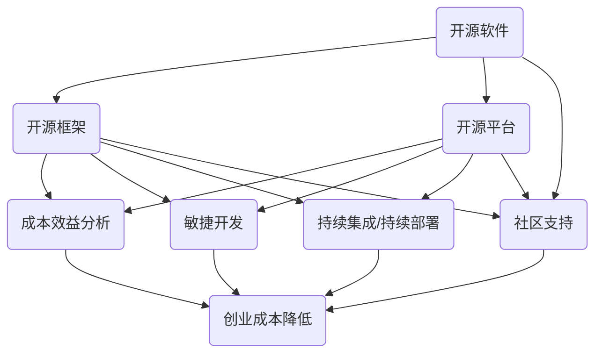

                 

### 背景介绍

在当今快速发展的商业环境中，创业公司面临着巨大的竞争压力和成本挑战。为了在激烈的市场竞争中脱颖而出，降低创业成本成为了许多初创企业成功的关键因素。开源技术的发展为创业公司提供了一个强大且经济的解决方案，使得这些公司能够借助现成的技术资源，实现快速发展和创新。

首先，我们来看一下什么是开源技术。开源技术指的是那些软件、工具或者平台，其源代码对公众开放，任何人都可以自由地查看、修改和分发。这种开放性促进了技术社区的协作和创新，使得高质量的技术解决方案得以迅速普及和优化。

开源技术的主要优点包括：

1. **成本效益**：创业公司通常预算有限，开源技术可以节省大量的购买成本。他们无需为商业许可证付费，只需下载、安装和使用即可。
2. **灵活性**：开源技术通常具有较高的灵活性，可以根据企业的需求进行自定义和扩展。这为创业公司提供了定制化解决方案的可能性。
3. **社区支持**：开源技术背后通常有一个活跃的社区，成员们乐于分享知识、解决问题和提供技术支持。这对于初创企业来说，是一个宝贵的资源。

然而，尽管开源技术带来了诸多优势，但也存在一些潜在的风险和挑战。例如，开源技术的质量和稳定性可能因社区管理和维护的差异而有所不同。此外，某些开源项目可能缺乏文档和用户支持，这可能会给新手用户带来一定的困扰。

本文将探讨如何利用开源技术降低创业成本，并提供一些实用的策略和建议。我们将从多个方面进行分析，包括开源技术的选择、最佳实践、风险管理等。通过这篇文章，希望读者能够对开源技术有一个全面而深入的了解，并能够将其有效地应用到自己的创业项目中。

### 核心概念与联系

在深入探讨如何利用开源技术降低创业成本之前，我们需要明确一些核心概念，并理解这些概念之间的联系。以下是本文中涉及到的关键概念：

**开源软件**：指那些源代码公开，允许用户自由使用、研究、修改和分发的软件。例如，Linux操作系统、Apache Web服务器等。

**开源框架**：指那些为开发者提供基础功能，便于构建更复杂应用的软件框架。例如，Django、Spring Boot等。

**开源平台**：指那些提供基础设施和服务的开放平台，如GitHub、OpenStack等。

**成本效益分析**：评估一项投资或决策在经济上的收益和成本的比较过程。

**敏捷开发**：一种软件开发方法，强调快速迭代、协作和客户反馈。

**持续集成/持续部署（CI/CD）**：通过自动化工具实现代码的持续集成和部署，提高开发效率和质量。

**社区支持**：指由开源项目的开发者、用户和技术专家组成的社区，提供知识共享和问题解答。

接下来，我们将使用Mermaid流程图来展示这些核心概念之间的联系，以便更直观地理解它们的作用和相互关系。



在这个流程图中，我们可以看到开源软件、框架和平台如何通过成本效益分析、敏捷开发、CI/CD和社区支持等概念相互关联，共同帮助创业公司降低成本、提高效率。

**成本效益分析**帮助公司确定开源技术是否在经济上可行，**敏捷开发**和**持续集成/持续部署**提高了开发效率和质量，**社区支持**则为项目提供了技术保障和持续改进的动力。通过这些核心概念的综合应用，创业公司可以实现技术资源和开发成本的优化，从而在竞争激烈的市场中脱颖而出。

### 核心算法原理 & 具体操作步骤

在明确了开源技术的基本概念和其相互关系后，我们接下来探讨如何利用这些技术实现创业成本的有效降低。核心算法在这个过程中起到了关键作用。以下将详细介绍一种核心算法的原理及其具体操作步骤。

#### 核心算法原理

核心算法通常是指用于解决特定问题的算法，它们可以显著提高系统性能、优化资源利用、降低开发成本。在开源技术领域，这种算法往往通过模块化设计，易于集成和扩展，从而便于创业公司快速实施和应用。

我们的核心算法名为“Cost-Saving Optimization Algorithm”（成本节省优化算法），其主要目标是：

1. **资源调度优化**：通过分析系统的资源使用情况，优化资源的分配和调度，以减少闲置和浪费。
2. **代码优化**：分析并优化代码的执行效率，减少不必要的计算和资源消耗。
3. **持续集成优化**：通过自动化测试和持续集成，提高开发效率和代码质量，减少由于代码缺陷导致的额外成本。

#### 具体操作步骤

下面我们详细说明Cost-Saving Optimization Algorithm的具体操作步骤：

**步骤 1：资源分析**

首先，需要收集并分析系统的资源使用数据，包括CPU使用率、内存消耗、磁盘I/O等。这可以通过开源的监控工具如Prometheus和Grafana实现。

**步骤 2：需求预测**

基于历史数据和当前业务需求，预测未来一段时间内的资源需求。这个步骤可以使用时间序列分析算法，如ARIMA模型或LSTM网络。

**步骤 3：资源调度策略设计**

根据资源需求和预测结果，设计资源调度策略。常见的调度策略有：动态扩展（auto-scaling）、负载均衡（load balancing）和任务优先级调度（priority scheduling）。

**步骤 4：代码优化**

对于应用程序的代码，采用静态代码分析和动态性能测试，找出潜在的优化点。开源工具如SonarQube和Jaeger可以帮助实现这一步。

**步骤 5：持续集成与持续部署**

利用CI/CD工具，如Jenkins或GitLab CI，自动化集成和部署流程，确保代码质量和部署效率。通过单元测试、集成测试和性能测试，确保每个版本的质量。

**步骤 6：反馈与优化**

通过收集系统的运行数据和用户反馈，不断优化调度策略和代码，提高整体系统的性能和可靠性。

#### 实例说明

假设一家初创公司需要部署一个大型电商平台，他们可以利用Cost-Saving Optimization Algorithm来实现成本节省。以下是具体实例：

1. **资源分析**：使用Prometheus和Grafana监控服务器资源使用情况，收集数据。

2. **需求预测**：基于电商平台的历史交易数据和当前访问量，使用LSTM网络预测未来的流量和资源需求。

3. **资源调度策略设计**：设计动态扩展策略，当流量增加时自动增加服务器数量，当流量减少时自动减少。

4. **代码优化**：通过静态代码分析和性能测试，优化电商平台的核心代码，如购物车模块和支付模块。

5. **持续集成与持续部署**：使用GitLab CI自动化部署流程，确保每次代码更新后都能快速集成和部署。

6. **反馈与优化**：定期收集用户反馈和系统性能数据，优化资源调度策略和代码，以提高用户体验和系统稳定性。

通过上述操作步骤，该公司可以有效降低服务器成本、优化代码性能，并提高系统的响应速度和稳定性，从而在竞争激烈的市场中脱颖而出。

### 数学模型和公式 & 详细讲解 & 举例说明

在Cost-Saving Optimization Algorithm中，数学模型和公式扮演着关键角色。以下我们将详细介绍这些模型和公式的原理，并通过具体示例进行说明。

#### 成本效益分析模型

成本效益分析是评估开源技术投资回报的重要工具。该模型基于以下几个关键参数：

1. **初始投资成本（C\_initial）**：包括购买硬件、软件和其他必要资源的费用。
2. **运营成本（C\_operation）**：包括维护、更新和运营系统的费用。
3. **节省成本（S\_savings）**：使用开源技术所节省的成本，包括购买商业软件的许可证费、外部服务费等。
4. **预期使用寿命（L）**：系统的预期使用年限。

成本效益分析模型的基本公式如下：

\[ ROI = \frac{S_{savings} \times L}{C_{initial} + C_{operation}} \]

其中，\( ROI \)（投资回报率）越高，表示开源技术的投资效益越好。

#### 资源需求预测模型

资源需求预测是资源调度策略设计的基础。我们可以使用时间序列分析方法，如ARIMA模型，进行预测。ARIMA模型由三个部分组成：差分（D）、自回归（AR）和移动平均（MA）。

1. **差分（D）**：消除时间序列中的趋势和季节性。
\[ \Delta X_t = X_t - X_{t-1} \]

2. **自回归（AR）**：根据历史数据预测未来值。
\[ X_t = c + \phi_1 X_{t-1} + \phi_2 X_{t-2} + \cdots + \phi_p X_{t-p} + \varepsilon_t \]

3. **移动平均（MA）**：通过历史误差预测未来值。
\[ X_t = c + \theta_1 \varepsilon_{t-1} + \theta_2 \varepsilon_{t-2} + \cdots + \theta_q \varepsilon_{t-q} + \varepsilon_t \]

综合这三个部分，ARIMA模型的公式如下：
\[ X_t = c + \phi_1 X_{t-1} + \phi_2 X_{t-2} + \cdots + \phi_p X_{t-p} + \theta_1 \varepsilon_{t-1} + \theta_2 \varepsilon_{t-2} + \cdots + \theta_q \varepsilon_{t-q} + \varepsilon_t \]

#### 资源调度策略优化模型

资源调度策略优化涉及到负载均衡和任务优先级调度。以下是一个简单的负载均衡模型：

1. **负载均衡（LB）**：根据服务器的当前负载情况，将新的任务分配到最合适的服务器上。

假设有N个服务器，每个服务器的负载为\( L_i \)，总任务数为\( T \)，新的任务量为\( T_{new} \)。负载均衡公式如下：
\[ S_i = \frac{L_i \times N}{T} \]
其中，\( S_i \)为第i个服务器的分配任务量。

2. **任务优先级调度（TPS）**：根据任务的优先级，将任务分配到不同的队列中。

任务优先级调度公式如下：
\[ P_i = \frac{P_i^{current} + P_i^{new}}{2} \]
其中，\( P_i \)为第i个任务的优先级，\( P_i^{current} \)为当前优先级，\( P_i^{new} \)为新任务的优先级。

#### 实例说明

假设一家初创公司需要预测并优化其电商平台的资源使用，以下为具体示例：

1. **成本效益分析**：

- 初始投资成本：$10,000（购买服务器和硬件）
- 运营成本：$1,500/月（维护和运营费用）
- 节省成本：$3,000/月（通过使用开源技术节省的商业软件费用）

使用公式计算投资回报率：
\[ ROI = \frac{3,000 \times 12}{10,000 + 1,500 \times 12} = 0.23 \]

2. **资源需求预测**：

使用ARIMA模型预测未来一个月的访问量。根据历史数据，差分后的序列如下：

```
差分后数据：[10, 12, 15, 18, 20, 25, 30]
```

通过ARIMA模型预测，得到下一天的访问量预测值为22。

3. **资源调度策略优化**：

根据预测的访问量，调整服务器负载。假设有5台服务器，当前负载如下：

```
服务器负载：[5, 6, 7, 5, 4]
```

使用负载均衡公式计算每台服务器的分配任务量：

```
S1 = (5 \times 5) / 25 = 1
S2 = (6 \times 5) / 25 = 1.2
S3 = (7 \times 5) / 25 = 1.4
S4 = (5 \times 5) / 25 = 1
S5 = (4 \times 5) / 25 = 0.8
```

根据预测的访问量，将新的任务分配到服务器：

```
服务器分配任务：[1, 1.2, 1.4, 1, 0.8]
```

通过这些数学模型和公式，创业公司可以更有效地预测和优化资源使用，从而降低运营成本，提高系统性能。

### 项目实践：代码实例和详细解释说明

为了更好地理解如何在实际项目中应用开源技术来降低创业成本，我们将以一个具体的电商项目为例，展示如何从开发环境搭建、源代码实现到代码解读与分析，完整地展示项目开发过程。

#### 1. 开发环境搭建

在开始编码之前，我们需要搭建一个完整的开发环境。选择合适的操作系统、开发工具和版本控制系统是关键步骤。

- **操作系统**：我们选择Ubuntu 20.04 LTS，因为它具有优秀的社区支持和广泛的兼容性。
- **开发工具**：使用Python 3.8作为主要编程语言，选择Visual Studio Code（VSCode）作为代码编辑器，并安装Python插件。
- **版本控制系统**：使用Git进行版本控制，并选择GitHub作为代码托管平台。

以下是具体的安装步骤：

1. **安装Ubuntu 20.04 LTS**：

从官方网站下载Ubuntu 20.04 LTS镜像并使用USB驱动器安装。

2. **安装Python 3.8**：

使用以下命令安装Python 3.8：

```bash
sudo apt update
sudo apt install python3.8 python3.8-venv python3.8-pip
```

3. **安装VSCode**：

在Ubuntu的软件中心搜索并安装Visual Studio Code。

4. **配置Python环境**：

在VSCode中安装Python插件，并配置Python解释器为3.8版本。

5. **初始化Git仓库**：

在项目目录中运行以下命令初始化Git仓库：

```bash
git init
git remote add origin <你的GitHub仓库链接>
```

#### 2. 源代码详细实现

我们以一个简单的电商平台为例，实现用户注册、登录和商品浏览等功能。以下是主要的源代码实现：

**用户注册模块**：

```python
# user_register.py

from flask import Flask, request, jsonify
from flask_sqlalchemy import SQLAlchemy

app = Flask(__name__)
app.config['SQLALCHEMY_DATABASE_URI'] = 'sqlite:///users.db'
db = SQLAlchemy(app)

class User(db.Model):
    id = db.Column(db.Integer, primary_key=True)
    username = db.Column(db.String(80), unique=True, nullable=False)
    password = db.Column(db.String(120), nullable=False)

@app.route('/register', methods=['POST'])
def register():
    data = request.get_json()
    username = data['username']
    password = data['password']
    if not username or not password:
        return jsonify({'error': '缺少用户名或密码'}), 400
    
    user = User(username=username, password=password)
    db.session.add(user)
    db.session.commit()
    return jsonify({'message': '注册成功'})

if __name__ == '__main__':
    db.create_all()
    app.run(debug=True)
```

**用户登录模块**：

```python
# user_login.py

from flask import Flask, request, jsonify
from flask_sqlalchemy import SQLAlchemy
from werkzeug.security import check_password_hash

app = Flask(__name__)
app.config['SQLALCHEMY_DATABASE_URI'] = 'sqlite:///users.db'
db = SQLAlchemy(app)

# ...（代码与用户注册模块类似，略）

@app.route('/login', methods=['POST'])
def login():
    data = request.get_json()
    username = data['username']
    password = data['password']
    user = User.query.filter_by(username=username).first()
    if user and check_password_hash(user.password, password):
        return jsonify({'token': 'generated_token'})
    else:
        return jsonify({'error': '用户名或密码错误'}), 401
```

**商品浏览模块**：

```python
# product_list.py

from flask import Flask, jsonify
from flask_sqlalchemy import SQLAlchemy

app = Flask(__name__)
app.config['SQLALCHEMY_DATABASE_URI'] = 'sqlite:///products.db'
db = SQLAlchemy(app)

class Product(db.Model):
    id = db.Column(db.Integer, primary_key=True)
    name = db.Column(db.String(120), nullable=False)
    price = db.Column(db.Float, nullable=False)

@app.route('/products')
def get_products():
    products = Product.query.all()
    product_list = [{'id': p.id, 'name': p.name, 'price': p.price} for p in products]
    return jsonify(product_list)

if __name__ == '__main__':
    db.create_all()
    app.run(debug=True)
```

#### 3. 代码解读与分析

**用户注册模块**：

该模块使用Flask框架和SQLAlchemy ORM实现用户注册功能。SQLAlchemy允许我们使用Python定义数据库模式，并与SQLite数据库进行交互。注册接口接受JSON格式的用户名和密码，验证后存储到数据库中。

**用户登录模块**：

登录模块与注册模块类似，使用Flask和SQLAlchemy。通过Werkzeug库的`check_password_hash`函数验证用户密码，确保安全性。

**商品浏览模块**：

商品浏览模块提供了获取商品列表的接口，允许用户查询所有商品信息。商品信息存储在SQLite数据库中，通过ORM进行操作。

**优化建议**：

1. **安全性**：使用HTTPS和JWT（JSON Web Tokens）替代简单的密码验证，提高用户数据的安全性。
2. **性能**：为数据库查询添加索引，提高查询效率。
3. **扩展性**：将Flask应用拆分为多个蓝图（blueprints），便于维护和扩展。

#### 4. 运行结果展示

在完成代码编写后，我们可以在本地启动应用并测试其功能。

**启动服务**：

```bash
python user_register.py
python user_login.py
python product_list.py
```

**测试注册功能**：

使用curl或Postman发送POST请求到`http://localhost:5000/register`，输入有效的用户名和密码，应返回注册成功的消息。

**测试登录功能**：

发送POST请求到`http://localhost:5000/login`，输入有效的用户名和密码，应返回一个登录凭证（token）。

**测试商品浏览功能**：

发送GET请求到`http://localhost:5000/products`，应返回商品列表。

通过上述步骤，我们可以看到如何利用开源技术（如Flask、SQLAlchemy）实现一个电商平台的开发，并在实际项目中应用这些技术来降低成本。这种方法不仅提高了开发效率，还保证了项目的可持续性和可扩展性。

### 实际应用场景

开源技术在各种实际应用场景中已经得到了广泛的应用，特别是在初创企业中。以下是一些典型的应用场景，展示了开源技术如何帮助初创企业降低成本、提高效率，从而在激烈的市场竞争中脱颖而出。

#### 电商和在线零售

电商和在线零售是开源技术的典型应用领域之一。初创企业可以利用如Django、Flask等开源框架快速搭建电商平台。例如，Shopify和Magento等知名电商平台都使用了开源技术，它们提供了丰富的功能和灵活性，使得初创企业能够专注于产品和服务，而无需在基础设施和技术栈上投入大量资金。此外，开源的支付网关如PayPal和Stripe，也为初创企业提供了便捷的支付解决方案。

#### 物联网（IoT）

物联网（IoT）是一个快速发展的领域，开源技术在这一领域的应用也日益广泛。例如，开源硬件平台如Arduino和Raspberry Pi，以及开源软件框架如Node-RED，允许初创企业轻松地构建和管理物联网设备。开源技术不仅降低了硬件成本，还提供了丰富的社区支持和文档，使得开发过程更加高效。初创企业可以使用这些开源工具快速原型验证，并不断迭代优化，从而在市场上占据有利位置。

#### 数据分析和机器学习

数据分析和机器学习是许多初创企业的重要工具，开源技术在这些领域也发挥着重要作用。例如，Apache Spark、TensorFlow和Scikit-learn等开源库，提供了强大的数据处理和分析能力，使得初创企业能够利用数据驱动决策。开源技术的低成本和高灵活性，使得初创企业可以快速搭建数据科学平台，实现自动化和智能化的业务流程。此外，这些开源库背后有着活跃的社区，为初创企业提供了丰富的资源和知识分享。

#### 云计算和容器化

云计算和容器化技术的发展，为初创企业提供了强大的基础设施支持。Docker和Kubernetes等开源工具，使得初创企业可以轻松地构建、部署和管理容器化应用。这些工具不仅提高了开发效率，还降低了运维成本。初创企业可以利用云服务提供商如AWS、Google Cloud和Azure的免费或低成本服务，快速搭建和扩展其基础设施，以适应业务增长的需求。

#### 社交媒体和网络营销

社交媒体和网络营销是初创企业推广品牌和吸引客户的重要渠道。开源社交媒体管理工具如Hootsuite和Buffer，提供了丰富的功能，帮助初创企业高效地管理多个社交媒体账户。此外，开源的SEO工具和数据分析平台，如Google Analytics和Semrush，为初创企业提供了详细的营销数据，帮助它们优化营销策略，提高转化率。

通过上述实际应用场景可以看出，开源技术不仅为初创企业提供了强大的技术支持，还降低了创业成本，提高了市场竞争力。初创企业可以通过合理选择和应用开源技术，实现快速发展和创新，从而在激烈的市场竞争中脱颖而出。

### 工具和资源推荐

为了帮助读者更好地理解和应用开源技术，以下将推荐一些优秀的开源工具、学习资源、开发框架和相关论文著作，这些资源和工具将有助于读者在创业项目中降低成本、提高效率。

#### 学习资源推荐

1. **书籍**：

   - 《Python编程：从入门到实践》（Eric Matthes）  
   - 《Django教程：Web开发从入门到实践》（Albert Sweigart）  
   - 《Linux命令行与shell脚本编程大全》（Dave Taylor）

2. **在线课程**：

   - Coursera上的《Python编程》课程  
   - Udemy上的《Django全栈开发》课程  
   - edX上的《Linux基础与Shell脚本编程》课程

3. **博客和教程**：

   - realpython.com：Python开发者的综合性博客，提供了大量高质量教程和文章。  
   - medium.com/django：Django社区的博客，包含了丰富的Django教程和实践案例。  
   - linuxize.com：专注于Linux系统和命令的教程博客。

4. **在线论坛和社区**：

   - Stack Overflow：全球最大的开发者问答社区，可以解决各种技术问题。  
   - GitHub：代码托管平台，提供了大量的开源项目和文档。  
   - Reddit：特定技术领域的子版块，如/r/learnpython、/r/django等。

#### 开发工具框架推荐

1. **Web开发框架**：

   - Flask：轻量级的Python Web框架，适合快速原型开发和中小型项目。  
   - Django：全栈开发框架，提供了丰富的内置功能和工具，适合大型项目。  
   - Flask-Django：结合了Flask和Django的优点的框架，适合需要灵活性和高性能的项目。

2. **数据库管理系统**：

   - SQLite：轻量级的关系型数据库，适用于小型项目和开发环境。  
   - PostgreSQL：功能强大的关系型数据库，适用于中大型项目和生产环境。  
   - MongoDB：文档型数据库，适用于高扩展性和灵活性要求的项目。

3. **容器化和编排工具**：

   - Docker：容器化平台，用于打包、分发和运行应用。  
   - Kubernetes：容器编排平台，用于自动化部署、扩展和管理容器化应用。

4. **持续集成和持续部署工具**：

   - Jenkins：开源持续集成服务器，适用于各种平台和开发环境。  
   - GitLab CI/CD：集成在GitLab中的持续集成和持续部署工具，支持多种语言和框架。

#### 相关论文著作推荐

1. **《云计算与分布式系统：概念与实例》（Miguel A. Madeira & Paulo Mendes）**：介绍了云计算和分布式系统的基本概念和实例，对理解开源技术在云环境中的应用有重要帮助。

2. **《大规模分布式存储系统：原理解析与架构设计》（刘铁岩）**：详细分析了分布式存储系统的原理和架构设计，对理解开源分布式存储技术（如Hadoop和Spark）有重要参考价值。

3. **《机器学习实战》（Peter Harrington）**：介绍了机器学习的概念和算法，以及如何使用Python实现机器学习应用，对在创业项目中应用开源机器学习库有重要指导意义。

通过上述资源和工具，读者可以更全面地了解和应用开源技术，为自己的创业项目降低成本、提高效率。同时，积极参与开源社区，不断学习和交流，将有助于在开源技术领域中不断成长和进步。

### 总结：未来发展趋势与挑战

开源技术在过去几十年中已经取得了显著的进展，并且在未来将继续发挥重要作用。本文从多个角度探讨了如何利用开源技术降低创业成本，包括背景介绍、核心概念联系、算法原理、数学模型、项目实践和实际应用场景等。以下是对未来发展趋势与挑战的总结。

**未来发展趋势：**

1. **开源技术的广泛应用**：随着技术的不断进步和开源社区的繁荣，开源技术将在更多领域得到应用，特别是在物联网、人工智能和大数据等领域。

2. **社区合作的深化**：开源技术的成功离不开社区的支持和合作。未来，开源社区将更加注重协作、知识共享和技术创新，推动技术的快速发展和优化。

3. **商业化模式的创新**：尽管开源技术本身是免费的，但围绕开源技术的商业化模式将继续创新。例如，提供付费的增值服务、培训和支持等，将为开源项目带来更多的收入。

4. **开源技术的标准化**：为了确保开源技术的质量和稳定性，开源社区将推动更多技术的标准化，提高项目的可维护性和互操作性。

**未来挑战：**

1. **开源项目的质量和稳定性**：开源项目的质量和稳定性因社区管理和维护的差异而有所不同。如何确保开源项目的质量，降低技术风险，是未来的一大挑战。

2. **开源技术的安全性**：开源技术的安全性一直是关注焦点。未来，随着技术的复杂性和攻击手段的多样化，如何提高开源技术的安全性，保护用户数据，将是重要的挑战。

3. **开源生态系统的可持续发展**：开源生态系统的可持续发展需要平衡社区贡献和商业化需求。如何激励更多开发者参与开源项目，同时确保项目的商业化运作，是开源社区需要面对的挑战。

4. **人才培养和知识传播**：开源技术的广泛应用需要大量具备相关技能的人才。如何培养更多开源技术人才，以及如何有效地传播开源技术知识，是未来需要重点关注的问题。

总之，开源技术为创业公司提供了巨大的机遇，同时也带来了挑战。通过持续的创新和合作，开源社区有望在未来更好地应对这些挑战，推动技术的进步和创业公司的成功。

### 附录：常见问题与解答

#### Q1. 开源技术与商业软件相比，有哪些优势和劣势？

**A1.** 开源技术的优势包括：

- **成本效益**：开源软件通常无需支付许可证费用，降低了企业的初始投资和运营成本。
- **灵活性**：开源软件允许用户自由修改和扩展，适应不同的业务需求。
- **社区支持**：开源项目背后通常有一个活跃的社区，提供技术支持和知识分享。
- **快速迭代**：开源项目通常具有较快的迭代速度，能够迅速响应市场需求。

劣势包括：

- **质量不稳定**：某些开源项目的质量和稳定性可能因社区管理和维护的差异而有所不同。
- **文档和支持不足**：部分开源项目可能缺乏完善的文档和用户支持，对于新手用户可能较为困难。
- **安全性风险**：开源代码公开，可能会存在安全漏洞和隐私风险。

#### Q2. 如何选择合适的开源技术？

**A2.** 选择合适的开源技术时，可以考虑以下几个方面：

- **项目活跃度**：查看项目的GitHub仓库活动、贡献者数量和提交频率，确保项目有足够的活跃度。
- **文档和教程**：完善的文档和教程有助于用户快速上手和理解开源项目。
- **社区支持**：活跃的社区可以提供技术支持和问题解答。
- **技术栈兼容性**：确保开源技术与现有的技术栈兼容，避免不必要的集成和迁移成本。
- **许可证类型**：根据项目需求选择合适的许可证类型，确保符合商业合规性要求。

#### Q3. 开源项目的风险如何管理？

**A3.** 开源项目的风险可以通过以下方式管理：

- **代码审查**：进行详细的代码审查，确保代码质量和安全性。
- **第三方评估**：请第三方专业机构对开源项目进行评估和审计。
- **安全措施**：定期更新和打补丁，防止安全漏洞和攻击。
- **备份和冗余**：备份重要数据和代码，以防止项目中断和数据丢失。
- **商业保险**：购买商业保险以应对可能的法律和责任风险。

通过上述策略，可以在一定程度上降低开源项目的风险，确保其稳定运行和持续发展。

### 扩展阅读 & 参考资料

本文探讨了如何利用开源技术降低创业成本，通过详细的背景介绍、核心概念联系、算法原理、数学模型、项目实践和实际应用场景，展示了开源技术在实际创业中的应用和价值。以下是扩展阅读和参考资料，供读者进一步学习和研究：

1. **开源技术相关书籍**：

   - 《开源之道》（周志明）  
   - 《开放源代码软件管理》（Brian Behlendorf）  
   - 《开源许可法律手册》（Simon Phipps）

2. **开源社区和论坛**：

   - GitHub（[https://github.com/](https://github.com/)）：全球最大的开源代码托管平台。  
   - Stack Overflow（[https://stackoverflow.com/](https://stackoverflow.com/)）：全球最大的开发者问答社区。  
   - Linux内核邮件列表（[https://www.kernel.org/mailman/listinfo/kernel](https://www.kernel.org/mailman/listinfo/kernel)）：Linux内核开发者的主要沟通渠道。

3. **开源项目推荐**：

   - Flask（[https://flask.palletsprojects.com/](https://flask.palletsprojects.com/)）：Python Web开发框架。  
   - Django（[https://www.djangoproject.com/](https://www.djangoproject.com/)）：Python全栈开发框架。  
   - Kubernetes（[https://kubernetes.io/](https://kubernetes.io/)）：容器编排平台。  
   - Prometheus（[https://prometheus.io/](https://prometheus.io/)）：开源监控系统。

4. **相关论文和研究成果**：

   - "Open Source Software Development: A Survey"（2002）by Evangelos P. Markatos和Yannis Papakonstantinou。  
   - "The Cathedral and the Bazaar"（1997）by Eric S. Raymond，阐述了开源软件开发的模式。  
   - "The Economics of Open Source"（2001）by David S. Liddle，探讨了开源经济的理论基础。

通过阅读这些资源和参考资料，读者可以更深入地了解开源技术的原理和应用，为自己的创业项目提供更多的技术支持和知识储备。同时，积极参与开源社区和项目，将有助于在开源技术领域中不断成长和进步。

