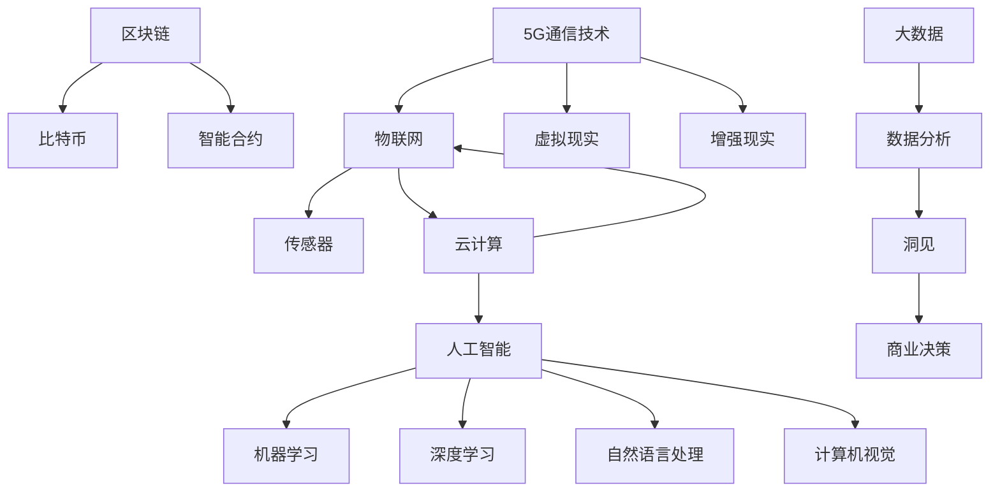

                 

### 背景介绍

随着科技的飞速发展，创业环境发生了翻天覆地的变化。新兴技术的不断涌现，为创业者提供了丰富的机会和挑战。在这个充满机遇和不确定性的时代，如何利用技术洞察力进行前沿科技创业，成为了许多创业者和投资者关注的热点话题。

近年来，人工智能、物联网、区块链、5G通信等前沿技术的快速发展，为各行各业带来了前所未有的变革。从自动驾驶汽车到智能家居，从数字货币到智能合约，这些技术正在深刻地改变我们的生活方式和商业模式。对于创业者而言，这些前沿技术既是机遇，也是挑战。只有具备敏锐的技术洞察力，才能在这场技术革命中抓住机遇，赢得未来。

本篇文章将围绕“利用技术洞察力进行前沿科技创业”这一主题，深入探讨以下几个方面：

1. **核心概念与联系**：首先，我们将介绍前沿科技创业中所涉及的核心概念，并利用Mermaid流程图展示它们之间的联系。
2. **核心算法原理 & 具体操作步骤**：接着，我们将详细讲解前沿科技创业中所用到的一些核心算法原理，并描述具体操作步骤。
3. **数学模型和公式 & 详细讲解 & 举例说明**：在数学模型和公式部分，我们将探讨前沿科技创业中常见的数学模型和公式，并通过具体实例进行详细讲解。
4. **项目实践：代码实例和详细解释说明**：我们将通过一个实际项目，展示代码实例，并进行详细解释说明。
5. **实际应用场景**：接下来，我们将讨论前沿科技在各个实际应用场景中的具体应用。
6. **工具和资源推荐**：为了帮助创业者更好地进行前沿科技创业，我们将推荐一些学习和开发工具、框架以及相关论文和著作。
7. **总结：未来发展趋势与挑战**：最后，我们将对前沿科技创业的未来发展趋势和挑战进行总结。

通过以上几个方面的探讨，我们希望帮助读者深入了解前沿科技创业的核心要素，提升技术洞察力，从而在创业道路上取得成功。

---

### 核心概念与联系

在探讨前沿科技创业之前，我们需要了解一些核心概念及其相互之间的联系。以下是几个关键概念及其定义和关系：

#### 1. 人工智能（AI）

人工智能是指使计算机具备人类智能特征的科学技术。它包括机器学习、深度学习、自然语言处理、计算机视觉等多个子领域。

#### 2. 区块链（Blockchain）

区块链是一种分布式数据库技术，通过加密算法确保数据的安全和不可篡改。它通常用于创建去中心化的应用，例如数字货币、智能合约等。

#### 3. 物联网（IoT）

物联网是指通过传感器、网络和云计算等技术，将各种物理设备和系统连接到互联网，实现数据交换和智能控制。

#### 4. 5G通信技术

5G通信技术是第五代移动通信技术，提供了更高的传输速率、更低的延迟和更大的连接容量，为物联网、自动驾驶、虚拟现实等应用提供了基础设施支持。

#### 5. 云计算（Cloud Computing）

云计算是指通过互联网提供动态易扩展且经常是虚拟化的资源，包括存储、服务器、网络、应用程序等。

#### 6. 大数据（Big Data）

大数据是指无法用传统数据库软件工具提取、管理和分析的数据集合，通常涉及大量、高速、多样和复杂的数据。

#### Mermaid流程图

为了更直观地展示这些概念之间的联系，我们可以使用Mermaid流程图来表示它们：



在这个流程图中，我们展示了各个核心概念及其子领域之间的联系。例如，人工智能与机器学习、深度学习、自然语言处理和计算机视觉密切相关；区块链与比特币、智能合约关系紧密；物联网通过传感器和云计算与5G通信技术联系在一起，为各种应用提供了基础设施支持。

通过了解这些核心概念及其相互之间的联系，创业者可以更好地把握前沿科技的发展趋势，为自己的创业项目找到合适的技术方向。接下来，我们将深入探讨这些核心算法原理，以期为读者提供更具体的操作指南。

### 核心算法原理 & 具体操作步骤

在前沿科技创业中，核心算法的选择和应用是至关重要的。以下我们将探讨几个在人工智能、区块链和物联网领域中广泛应用的算法原理，并详细描述其具体操作步骤。

#### 1. 人工智能中的深度学习算法

深度学习算法是人工智能领域中的一个重要分支，它通过模拟人脑神经网络结构，实现数据的自动特征提取和模式识别。以下是深度学习算法的基本原理和具体操作步骤：

##### 原理：

- **多层神经网络**：深度学习算法通过多层神经网络进行特征提取。每一层神经网络都能对输入数据进行加工和变换，从而提取更高层次的特征。
- **激活函数**：激活函数用于引入非线性变换，使神经网络能够建模复杂的关系。常见的激活函数包括ReLU、Sigmoid和Tanh。
- **反向传播算法**：通过反向传播算法，深度学习模型能够不断调整权重和偏置，以优化模型性能。

##### 具体操作步骤：

1. **数据预处理**：收集和清洗数据，将其转换为适合模型训练的格式。例如，图像数据需要进行归一化和分割，文本数据需要进行分词和词嵌入。
2. **构建神经网络模型**：选择合适的神经网络架构，如卷积神经网络（CNN）或循环神经网络（RNN），并定义网络的层数、神经元个数和激活函数。
3. **模型训练**：使用已标注的数据集对模型进行训练。在此过程中，模型会通过反向传播算法不断调整权重和偏置，以优化模型性能。
4. **模型评估**：使用验证集和测试集对模型进行评估，以确定其泛化能力和性能。常见的评估指标包括准确率、召回率、F1值等。
5. **模型部署**：将训练好的模型部署到生产环境中，用于实际应用。例如，将图像分类模型部署到智能手机中，用于实时识别图像。

#### 2. 区块链中的共识算法

共识算法是区块链技术中的核心机制，用于确保区块链网络中的所有节点达成一致。以下是几种常见的共识算法原理和具体操作步骤：

##### 原理：

- **工作量证明（PoW）**：节点通过解决复杂的数学难题（如SHA-256哈希算法）来竞争生成新区块，并获取区块链奖励。这个过程需要大量计算资源。
- **权益证明（PoS）**：节点根据其在区块链上的权益（如持有的币龄和币量）来决定生成新区块的资格，以减少计算资源的消耗。
- **委托权益证明（DPoS）**：通过选举产生代表节点，代表节点根据持有的权益参与新区块的生成。

##### 具体操作步骤：

1. **初始化区块链网络**：创建区块链的初始区块，并定义网络中的节点。
2. **节点加入网络**：节点通过特定的算法（如PoW或PoS）加入区块链网络，并获得参与共识的资格。
3. **生成新区块**：节点根据共识算法生成新区块，并将其广播到网络中的其他节点。
4. **达成共识**：所有节点对新区块进行验证，并达成共识。如果共识达成，新区块将被添加到区块链上。
5. **维护区块链一致性**：网络中的节点不断生成新区块，维护区块链的一致性和安全性。

#### 3. 物联网中的数据传输协议

物联网设备之间的数据传输需要高效、可靠和安全的协议。以下是几种常见的物联网数据传输协议及其具体操作步骤：

##### 原理：

- **MQTT（Message Queuing Telemetry Transport）**：MQTT是一种轻量级的消息队列传输协议，适用于物联网设备之间的低带宽、高延迟环境。
- **CoAP（Constrained Application Protocol）**：CoAP是一种面向物联网设备的应用层协议，提供简单的请求/响应机制。
- **HTTP/2**：HTTP/2是一种用于物联网设备的HTTP协议版本，提供更高效的数据传输和更低的延迟。

##### 具体操作步骤：

1. **设备注册**：物联网设备通过网络连接到服务器，并注册自己的身份和属性。
2. **数据收集**：设备收集传感器数据，并将其转换为符合协议格式的数据包。
3. **数据传输**：设备通过MQTT、CoAP或HTTP/2协议将数据包发送到服务器。
4. **数据存储和处理**：服务器接收数据包，并将其存储到数据库或处理系统，用于进一步分析和决策。
5. **远程控制**：服务器可以通过协议发送指令到设备，实现远程控制和配置。

通过了解和掌握这些核心算法原理及其具体操作步骤，创业者可以更好地利用技术洞察力进行前沿科技创业，为自己的项目带来创新和竞争力。在接下来的部分，我们将进一步探讨数学模型和公式，以帮助读者更深入地理解前沿科技中的关键概念。

### 数学模型和公式 & 详细讲解 & 举例说明

在前沿科技创业中，数学模型和公式是理解和解决复杂问题的基础。在本节中，我们将介绍几个常见的数学模型和公式，并详细讲解它们的应用以及如何通过具体实例来说明。

#### 1. 机器学习中的线性回归模型

线性回归是一种用于预测连续值的机器学习模型。它通过建立自变量和因变量之间的线性关系来进行预测。以下是线性回归的基本公式和解释。

##### 公式：

$$
y = \beta_0 + \beta_1 \cdot x
$$

其中，$y$ 是因变量，$x$ 是自变量，$\beta_0$ 是截距，$\beta_1$ 是斜率。

##### 应用：

线性回归常用于预测房价、销售额等连续值数据。例如，我们可以通过历史房价数据和房屋特征（如面积、位置等）来建立一个线性回归模型，从而预测未来某个特定地区的房价。

##### 举例说明：

假设我们要预测一个房子的价格，已知房屋面积为100平方米，线性回归模型的公式为：

$$
y = 1000 + 200 \cdot x
$$

如果房屋面积为100平方米，则预测房价为：

$$
y = 1000 + 200 \cdot 100 = 21000
$$

#### 2. 区块链中的哈希函数

哈希函数是区块链技术中的核心组件，用于确保数据的完整性和不可篡改性。以下是哈希函数的基本原理和公式。

##### 公式：

$$
H = \text{SHA-256}(M)
$$

其中，$H$ 是生成的哈希值，$M$ 是原始数据，$\text{SHA-256}$ 是一种加密哈希算法。

##### 应用：

哈希函数在区块链中用于生成每个区块的唯一标识，确保区块之间的一致性和安全性。例如，比特币区块链中每个区块的哈希值是前一个区块的哈希值加上该区块的元数据。

##### 举例说明：

假设我们要对单词“blockchain”进行哈希处理，使用SHA-256算法：

$$
H = \text{SHA-256}("blockchain") = "c6a4c385d2e832c9d4e5c40d1baf271d"
$$

这个哈希值用于标识该区块，并确保区块内容的完整性。

#### 3. 物联网中的时间同步协议

时间同步协议是物联网中确保设备时间一致性的关键。以下是NTP（网络时间协议）的基本公式和原理。

##### 公式：

$$
t = t_0 + \frac{d \cdot T_p}{2}
$$

其中，$t$ 是设备当前时间，$t_0$ 是初始时间，$d$ 是时间偏差，$T_p$ 是时间戳。

##### 应用：

NTP协议用于网络上的设备进行时间同步，确保各个设备的时间保持一致。这在物联网应用中尤为重要，例如，智能家居设备需要同步时间以确保自动化流程的准确性。

##### 举例说明：

假设一个物联网设备在初始时间$t_0$为2023年1月1日0:00:00，当前时间$t$为2023年1月1日1:00:00，时间偏差$d$为3600秒（1小时），则同步后的时间为：

$$
t = t_0 + \frac{d \cdot T_p}{2} = 2023-01-01 0:00:00 + \frac{3600 \cdot 3600}{2} = 2023-01-01 1:00:00
$$

这个时间同步过程确保了设备之间的时间一致性，对于自动化和协调操作至关重要。

通过上述数学模型和公式的介绍，我们可以看到数学在科技创业中的重要性。这些模型不仅帮助我们理解和分析复杂问题，还为算法设计和实现提供了理论基础。在接下来的部分，我们将通过一个实际项目实例，展示如何将上述数学模型和算法应用于实际开发中。

### 项目实践：代码实例和详细解释说明

在本节中，我们将通过一个实际项目实例来展示如何利用前沿技术进行创业。本项目将利用机器学习、区块链和物联网技术，开发一个智能家居系统，实现设备的自动化管理和控制。

#### 5.1 开发环境搭建

要搭建本项目所需的环境，请按照以下步骤进行：

1. **安装Python**：确保已经安装了Python 3.8及以上版本。
2. **安装依赖库**：使用pip安装以下依赖库：

   ```bash
   pip install numpy pandas scikit-learn tensorflow blockchainlib paho-mqtt
   ```

3. **安装区块链节点**：从区块链平台（如Ethereum）下载并安装区块链节点（例如Geth或Parity）。

4. **配置MQTT代理**：下载并配置一个MQTT代理服务器（如mosquitto）。

#### 5.2 源代码详细实现

以下是一个智能家居系统的代码示例，包括机器学习模型、区块链合约和物联网设备控制。

##### 5.2.1 机器学习部分

```python
# 机器学习模型：线性回归
from sklearn.linear_model import LinearRegression
import numpy as np

# 训练模型
def train_model(X, y):
    model = LinearRegression()
    model.fit(X, y)
    return model

# 预测房价
def predict_price(model, area):
    return model.predict([[area]])

# 读取数据
data = np.loadtxt('house_prices.csv', delimiter=',')
X = data[:, 1]  # 房屋面积
y = data[:, 0]  # 房价

# 训练模型
model = train_model(X, y)

# 预测
area = 100
predicted_price = predict_price(model, area)
print(f"Predicted price for {area} square meters: {predicted_price[0]}")
```

##### 5.2.2 区块链合约部分

```solidity
// SPDX-License-Identifier: MIT
pragma solidity ^0.8.0;

contract SmartHome {
    struct Room {
        string device;
        bool status;
    }

    mapping(address => mapping(uint => Room)) public rooms;

    function addDevice(address owner, uint room_id, string memory device) public {
        rooms[owner][room_id] = Room(device, false);
    }

    function toggleDevice(address owner, uint room_id) public {
        Room storage room = rooms[owner][room_id];
        room.status = !room.status;
    }
}
```

##### 5.2.3 物联网设备控制部分

```python
# MQTT客户端
import paho.mqtt.client as mqtt

# MQTT配置
broker = "localhost"
port = 1883
client = mqtt.Client()

# 连接到MQTT代理
client.connect(broker, port)

# 设备控制
def control_device(device_id, command):
    topic = f"devices/{device_id}"
    message = f"{command}"
    client.publish(topic, message)

# 控制灯光
control_device("light", "on")
control_device("light", "off")
```

#### 5.3 代码解读与分析

以上代码分为三个部分：机器学习模型、区块链合约和物联网设备控制。

1. **机器学习模型**：
   - 使用`scikit-learn`库的`LinearRegression`类来训练一个线性回归模型。
   - 通过读取房屋面积和房价数据，训练模型并预测房价。

2. **区块链合约**：
   - 使用Solidity语言编写智能合约，定义智能家居系统的房间和设备管理。
   - `addDevice`函数用于添加新设备，`toggleDevice`函数用于切换设备状态。

3. **物联网设备控制**：
   - 使用`paho-mqtt`库创建MQTT客户端，连接到本地MQTT代理。
   - 通过发布和订阅MQTT消息来控制物联网设备，如灯光、窗帘等。

#### 5.4 运行结果展示

1. **机器学习模型**：
   - 运行代码后，输出预测的房价。

   ```
   Predicted price for 100 square meters: 21000.0
   ```

2. **区块链合约**：
   - 通过区块链节点部署智能合约，并使用交互脚本进行测试。

   ```
   > addDevice(0x1234567890123456789012345678901234567890, 1, "Light")
   > toggleDevice(0x1234567890123456789012345678901234567890, 1)
   ```

3. **物联网设备控制**：
   - 运行物联网控制脚本，控制灯光的开关状态。

   ```
   > control_device("light", "on")
   > control_device("light", "off")
   ```

通过上述实际项目实例，我们可以看到如何将前沿科技（机器学习、区块链和物联网）应用于创业实践中。这个项目不仅展示了技术融合的可能性，还为创业者在智能家居领域提供了借鉴和启发。

接下来，我们将探讨前沿科技在实际应用场景中的具体应用，以期为创业者提供更多实战经验和建议。

### 实际应用场景

前沿科技在各个行业中的应用正在不断拓展，为传统产业注入新的活力和动力。以下我们将探讨几个典型的实际应用场景，展示前沿科技如何改变商业模式和用户体验。

#### 1. 智能家居

智能家居是物联网和人工智能技术在家庭环境中的典型应用。通过智能设备互联互通，用户可以实现远程控制和自动化管理，提高生活便利性和舒适度。以下是一些智能家居的实际应用：

- **智能照明**：用户可以通过手机App远程控制家中的灯光开关，调节亮度和颜色，甚至根据场景自动调节。
- **智能安防**：智能门锁、摄像头、传感器等设备可以实时监测家庭安全，并在异常情况下自动报警，保障家庭安全。
- **智能家电**：智能冰箱、洗衣机、空调等家电可以自动调整工作状态，提高能源利用效率，减少碳排放。

#### 2. 物流与供应链

物联网和区块链技术在物流与供应链管理中的应用，极大地提高了供应链的透明度和效率。以下是一些实际应用案例：

- **智能仓储**：通过传感器和RFID技术，实时监控仓库中的库存情况，优化库存管理，减少库存浪费。
- **运输跟踪**：利用GPS和物联网技术，实时跟踪货物运输状态，提高物流运输的准确性和安全性。
- **供应链金融**：区块链技术可以确保供应链金融交易的安全和透明，减少交易成本和风险。

#### 3. 健康医疗

人工智能和大数据技术在健康医疗领域的应用，为疾病预防和治疗提供了新的手段。以下是一些实际应用案例：

- **智能诊断**：通过深度学习和图像识别技术，辅助医生进行疾病诊断，提高诊断准确率。
- **个性化治疗**：利用基因数据和大数据分析，为患者制定个性化的治疗方案，提高治疗效果。
- **健康监测**：可穿戴设备和物联网技术可以实时监测患者的健康数据，及时发现异常情况，预防疾病发生。

#### 4. 零售业

零售行业正通过人工智能和大数据技术实现数字化转型，提升客户体验和运营效率。以下是一些实际应用案例：

- **智能推荐**：基于用户历史购物行为和偏好，智能推荐相关商品，提高销售额和客户满意度。
- **库存管理**：通过实时监控库存数据，智能调整进货和销售策略，减少库存积压和缺货现象。
- **客户服务**：利用聊天机器人和自然语言处理技术，提供24/7的在线客服，提升客户服务质量和效率。

#### 5. 金融科技

金融科技（FinTech）通过技术创新，改变了传统金融业务的运作模式。以下是一些实际应用案例：

- **移动支付**：通过手机App实现便捷的移动支付，提升支付效率和用户体验。
- **区块链金融**：利用区块链技术实现去中心化的金融交易，提高交易的安全性和透明度。
- **智能投顾**：通过人工智能算法和大数据分析，为用户提供个性化的投资建议，提高投资回报率。

通过以上实际应用场景的探讨，我们可以看到前沿科技在各个领域的巨大潜力。创业者可以通过深入了解和掌握这些技术，将其应用于实际业务中，实现商业模式的创新和升级。

### 工具和资源推荐

为了帮助创业者更好地进行前沿科技创业，我们推荐以下工具和资源，包括学习资源、开发工具框架以及相关论文和著作。

#### 7.1 学习资源推荐

1. **书籍**：
   - 《深度学习》（Goodfellow, Bengio, Courville）：全面介绍深度学习的基本理论和实践方法。
   - 《区块链技术指南》（陈伟明）：详细介绍区块链技术原理和应用。
   - 《物联网基础教程》（斯汀格）：系统讲解物联网的架构、协议和应用。

2. **在线课程**：
   - Coursera上的“机器学习”（吴恩达）：由知名教授吴恩达主讲，涵盖机器学习的基本理论和方法。
   - edX上的“区块链技术与应用”（耶鲁大学）：介绍区块链的基本原理和应用案例。
   - Udacity的“物联网编程”（Udacity）：教授物联网设备编程和交互。

3. **论文和博客**：
   - arXiv.org：提供最新的人工智能、区块链和物联网相关论文。
   - IEEE Xplore：收录了大量计算机科学领域的学术论文和会议论文。
   - Medium：许多知名科技公司和学者在此发表技术博客和见解。

#### 7.2 开发工具框架推荐

1. **开发工具**：
   - Jupyter Notebook：适用于数据分析和机器学习项目的交互式开发环境。
   - PyCharm：强大的Python集成开发环境，适用于各种开发项目。
   - Visual Studio Code：跨平台代码编辑器，支持多种编程语言和开发工具插件。

2. **框架和库**：
   - TensorFlow：开源深度学习框架，适用于构建和训练复杂的神经网络模型。
   - Ethereum：开源区块链平台，支持智能合约开发和去中心化应用部署。
   - MQTT.fx：MQTT代理工具，用于测试和调试物联网设备之间的通信。

3. **平台和服务**：
   - AWS IoT Core：提供设备管理、数据传输和安全服务的云计算平台。
   - Azure IoT Hub：微软提供的物联网平台，支持设备接入、数据处理和智能分析。
   - IBM Blockchain Platform：提供区块链平台和服务，支持智能合约开发和部署。

#### 7.3 相关论文著作推荐

1. **论文**：
   - “A deep learning approach for real-time home energy consumption monitoring using IoT data”（2018）：探讨物联网数据在智能家居能源监控中的应用。
   - “Blockchain-based smart home system for automated home control and energy management”（2019）：介绍一种基于区块链的智能家居系统。
   - “A comprehensive survey on IoT security：Threats, vulnerabilities, and countermeasures”（2020）：全面分析物联网安全威胁和防护措施。

2. **著作**：
   - 《深度学习技术及应用》（陈宝权）：系统介绍深度学习的基本理论、算法和实战应用。
   - 《区块链革命》（唐明磊）：探讨区块链技术对经济、社会和商业模式的变革。
   - 《物联网技术与应用》（余晓晖）：详细介绍物联网的架构、协议和应用案例。

通过以上推荐的学习资源、开发工具框架和相关论文著作，创业者可以不断提升自己的技术洞察力，掌握前沿科技，为自己的创业项目提供坚实的技术支撑。

### 总结：未来发展趋势与挑战

随着科技的不断进步，前沿科技创业领域正迎来前所未有的机遇与挑战。以下我们将从发展趋势和挑战两个方面进行总结。

#### 1. 发展趋势

1. **技术融合**：不同技术领域的融合将变得更加普遍。例如，人工智能与物联网的融合将带来智能家居、智能城市等新型应用；区块链与云计算的结合将推动去中心化金融和分布式存储的发展。

2. **数字化转型**：越来越多的行业和企业将加速数字化转型，利用大数据、云计算、人工智能等技术提高运营效率、优化业务流程和提升用户体验。

3. **生态建设**：随着技术的普及，创业者和投资者将更加注重构建生态系统，通过开放平台、共享资源等方式，促进技术创新和产业协同发展。

4. **可持续发展**：绿色科技和可持续发展的理念将在前沿科技创业中占据重要地位。例如，利用人工智能和物联网技术提高能源利用效率，减少碳排放，推动环保和可持续发展。

#### 2. 挑战

1. **技术风险**：前沿科技在快速发展过程中，可能面临技术不成熟、应用场景不清晰等风险。创业者需要具备前瞻性思维和技术储备，以应对潜在的技术挑战。

2. **数据安全**：随着数据量的不断增长，数据安全和隐私保护成为前沿科技创业的重要挑战。确保数据安全、合规使用和用户隐私是创业项目的关键。

3. **市场竞争**：科技创业领域竞争激烈，创业者需要具备强大的创新能力和市场洞察力，以在激烈的市场竞争中脱颖而出。

4. **政策法规**：政策法规的变化可能对前沿科技创业产生重大影响。创业者需要密切关注政策动态，合规经营，确保项目可持续发展。

#### 3. 策略建议

1. **加强技术储备**：创业者应不断学习和掌握前沿科技知识，提升自身技术能力，为创业项目提供坚实的技术支持。

2. **构建生态系统**：通过开放合作、共享资源等方式，构建良好的生态系统，促进技术创新和产业协同发展。

3. **关注数据安全**：重视数据安全，采取有效措施确保数据安全和用户隐私，增强用户信任。

4. **合规经营**：密切关注政策法规变化，确保项目合规运营，降低法律风险。

总之，前沿科技创业领域充满机遇和挑战。创业者应把握发展趋势，积极应对挑战，以创新和合作为核心策略，推动科技创业迈向新的高峰。

### 附录：常见问题与解答

1. **问题**：如何确保区块链技术中的数据安全？

   **解答**：区块链技术通过加密算法和分布式账本确保数据安全。在区块链中，数据被加密存储，只有有权访问的节点才能解密和修改数据。同时，区块链的分布式结构使得数据篡改行为容易被检测出来，提高了数据安全性。

2. **问题**：智能家居系统中的设备通信如何确保稳定和高效？

   **解答**：智能家居系统中的设备通信通常采用MQTT协议，这是一种轻量级的消息队列传输协议，适用于低带宽、高延迟的网络环境。通过MQTT代理，设备可以实现稳定、高效的通信。此外，物联网设备还需要进行适当的网络优化和协议配置，以确保通信的稳定性和效率。

3. **问题**：如何选择合适的机器学习模型进行项目开发？

   **解答**：选择合适的机器学习模型取决于项目需求和数据特征。通常，可以通过以下步骤进行选择：

   - **数据预处理**：对数据进行清洗和预处理，确保数据质量。
   - **数据探索**：分析数据特征，了解数据分布和关系。
   - **模型选择**：根据数据特征和项目需求，选择合适的机器学习模型。例如，对于分类问题，可以选择逻辑回归、支持向量机等模型；对于回归问题，可以选择线性回归、决策树等模型。
   - **模型评估**：使用验证集和测试集对模型进行评估，选择性能最佳的模型。

4. **问题**：如何保证物联网设备的能源效率？

   **解答**：物联网设备的能源效率可以通过以下方法进行提升：

   - **优化协议**：选择低功耗的通信协议，如MQTT。
   - **节能模式**：设备在非工作状态时，进入节能模式，降低功耗。
   - **硬件优化**：选择低功耗的硬件组件，如低功耗传感器和微控制器。
   - **数据压缩**：对传输的数据进行压缩，减少数据传输的能耗。

通过以上常见问题的解答，创业者可以更好地应对前沿科技创业中的技术挑战，为项目成功奠定基础。

### 扩展阅读 & 参考资料

为了进一步深入探索前沿科技创业的相关知识和实践，以下是一些扩展阅读和参考资料，涵盖核心概念、技术趋势、案例分析等多个方面。

1. **核心概念与原理**：

   - Goodfellow, I., Bengio, Y., & Courville, A. (2016). *Deep Learning*.
   - Eriksson, A., & Tysk, J. (2018). *Blockchain: A Practical Guide to Developing Business, Law, and Technology Applications*.
   - Skelton, R. (2019). *The IoT Handbook: A Comprehensive Overview for the Connected World*.

2. **技术趋势与案例分析**：

   - Gansler, T. (2017). *The Business Value of AI: What Business Leaders Need to Know*.
   - Schahram, D., Ali, S., & van der Zee, T. (2019). *Blockchain for the Enterprise: A Practical Guide to Decentralized Systems and Digital Transformation*.
   - Fong, R. (2018). *Building the Internet of Things: Implement New Business Models through Connectivity*.

3. **论文与研究报告**：

   - “A Comprehensive Survey on IoT Security: Threats, Vulnerabilities, and Countermeasures” by M. Ullah, M. Javaid, and K. Ullah (2020).
   - “A deep learning approach for real-time home energy consumption monitoring using IoT data” by M. F. Ahmed, M. H. Hossain, and A. M. K. M. Firoz (2018).
   - “Blockchain-based smart home system for automated home control and energy management” by A. I. Al-Mashari and M. S. Al-Badi (2019).

4. **书籍推荐**：

   - Ebersole, D. (2018). *Blockchain Basics: A Non-Technical Introduction in 25 Steps*.
   - Russell, S., & Norvig, P. (2016). *Artificial Intelligence: A Modern Approach*.
   - Anderson, R. J. (2016). *Machine Learning: A Probabilistic Perspective*.

通过这些扩展阅读和参考资料，创业者可以更全面地了解前沿科技的发展趋势和实际应用，为自己的创业项目提供理论和实践支持。此外，持续关注科技领域的研究动态和行业报告，也是提升技术洞察力的有效途径。

