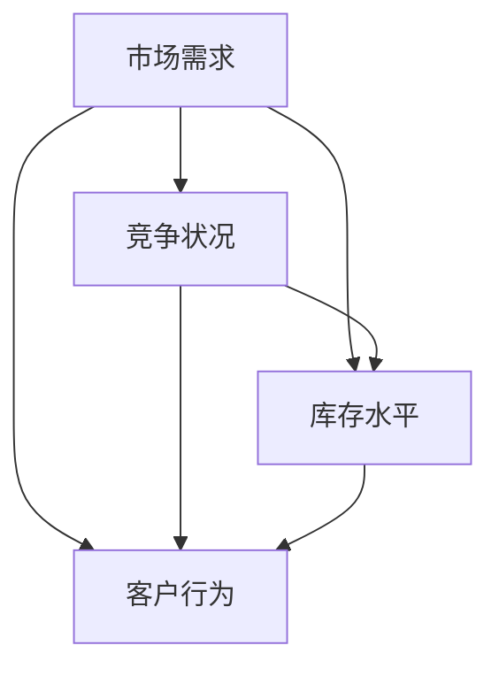

                 

### 动态定价策略的技术实现

#### 1. 背景介绍

在当今竞争激烈的市场环境中，企业需要不断创新和调整其商业模式以保持竞争力。动态定价策略作为一种高效的商业模式，正在被越来越多的企业采纳。动态定价策略的核心在于根据市场需求和竞争状况，实时调整产品的价格，以最大化利润或市场份额。

动态定价策略在不同行业中有着广泛的应用。例如，航空公司根据乘客的需求和预订时间动态调整机票价格，酒店根据入住率和预订情况调整客房价格，电子商务平台根据购物车中的商品数量和客户行为动态调整促销价格。这些应用案例表明，动态定价策略能够帮助企业更灵活地应对市场变化，提高利润。

然而，动态定价策略的实现并非易事。它涉及到多个因素，包括市场需求、竞争状况、库存水平、客户行为等。因此，本文将深入探讨动态定价策略的技术实现，帮助读者理解其核心概念、算法原理和实现步骤。

#### 2. 核心概念与联系

在探讨动态定价策略之前，我们需要了解一些核心概念和它们之间的联系。

##### 2.1. 市场需求

市场需求是指消费者对某种产品或服务的需求总量。市场需求受多种因素影响，包括价格、消费者偏好、收入水平、竞争对手行为等。在动态定价策略中，了解市场需求是至关重要的，因为价格调整需要基于对市场需求的准确预测。

##### 2.2. 竞争状况

竞争状况是指市场上其他竞争对手的行为和策略。了解竞争状况可以帮助企业确定其定价策略。例如，如果竞争对手降价，企业可能需要调整价格以保持竞争力。

##### 2.3. 库存水平

库存水平是指企业当前持有的产品数量。库存水平直接影响企业的生产和供应能力。在动态定价策略中，库存水平会影响价格的调整，因为过多的库存可能会导致价格下降以快速销售。

##### 2.4. 客户行为

客户行为是指消费者在购买过程中的行为模式。客户行为可以通过数据分析和机器学习模型来预测，从而帮助企业制定更有效的定价策略。

这些核心概念之间的联系如图 1 所示：



#### 3. 核心算法原理 & 具体操作步骤

动态定价策略的核心在于算法原理。以下是几种常见的动态定价算法及其操作步骤：

##### 3.1. 价格敏感度分析

价格敏感度分析是一种基于市场需求和价格关系的算法。具体操作步骤如下：

1. 收集历史销售数据，包括不同价格下的销售量。
2. 使用回归分析或其他统计方法确定市场需求函数，该函数表示价格和销售量之间的关系。
3. 根据市场需求函数和当前市场价格，预测不同价格下的销售量。
4. 根据预测的销售量和成本，确定最优价格。

##### 3.2. 竞争价格跟踪

竞争价格跟踪是一种基于竞争对手行为的算法。具体操作步骤如下：

1. 收集竞争对手的价格信息。
2. 分析竞争对手的价格策略，包括价格调整的频率和幅度。
3. 根据竞争对手的价格策略，预测市场趋势。
4. 根据市场趋势和自身成本，确定最优价格。

##### 3.3. 客户行为预测

客户行为预测是一种基于客户行为的算法。具体操作步骤如下：

1. 收集客户行为数据，包括购物车中的商品数量、购买频率、购物偏好等。
2. 使用机器学习模型分析客户行为数据，预测客户的购买概率和价格敏感度。
3. 根据预测结果，调整价格以最大化利润。

#### 4. 数学模型和公式 & 详细讲解 & 举例说明

动态定价策略的实现需要依赖数学模型和公式。以下是几个关键的数学模型和公式，以及它们的详细讲解和举例说明：

##### 4.1. 需求函数

需求函数是描述价格和销售量之间关系的数学函数。最常见的需求函数是线性需求函数：

$$
Q = a - bP
$$

其中，\(Q\) 是销售量，\(P\) 是价格，\(a\) 和 \(b\) 是常数。

举例说明：

假设某产品的需求函数为 \(Q = 100 - 2P\)。如果当前价格为 50 元，则销售量为 \(Q = 100 - 2 \times 50 = 0\)。这意味着当价格为 50 元时，产品无法售出。

##### 4.2. 利润最大化

利润最大化是动态定价策略的核心目标。利润最大化的数学模型如下：

$$
\max P(Q) = R(Q) - C(Q)
$$

其中，\(P(Q)\) 是利润，\(R(Q)\) 是收入，\(C(Q)\) 是成本。

举例说明：

假设某产品的收入函数为 \(R(Q) = 20Q\)，成本函数为 \(C(Q) = 10Q\)。要最大化利润，我们需要找到最优的销售量 \(Q^*\)。通过求解利润函数的导数，我们得到 \(Q^* = 10\)。这意味着当销售量为 10 时，利润最大。

##### 4.3. 价格敏感度

价格敏感度是描述消费者对价格变化的反应程度的指标。价格敏感度的计算公式如下：

$$
\eta = \frac{dQ}{dP}
$$

其中，\(\eta\) 是价格敏感度。

举例说明：

假设某产品的价格敏感度为 \(\eta = -2\)。这意味着当价格增加 1 元时，销售量将减少 2 单位。

#### 5. 项目实践：代码实例和详细解释说明

在本节中，我们将通过一个实际项目来展示动态定价策略的代码实现，并对其进行详细解释。

##### 5.1 开发环境搭建

在本项目中，我们使用 Python 作为编程语言，并使用 Scikit-learn 库进行机器学习模型的构建。以下是开发环境搭建的步骤：

1. 安装 Python：从官方网站（https://www.python.org/）下载并安装 Python 3.8 或更高版本。
2. 安装 Scikit-learn：打开命令行窗口，执行以下命令：
$$
pip install scikit-learn
$$

##### 5.2 源代码详细实现

以下是一个简单的动态定价策略实现，包括数据预处理、模型训练和预测：

```python
import numpy as np
import pandas as pd
from sklearn.linear_model import LinearRegression
from sklearn.model_selection import train_test_split

# 读取数据
data = pd.read_csv('sales_data.csv')
X = data[['price']]
y = data['sales']

# 划分训练集和测试集
X_train, X_test, y_train, y_test = train_test_split(X, y, test_size=0.2, random_state=42)

# 建立线性回归模型
model = LinearRegression()
model.fit(X_train, y_train)

# 预测测试集
y_pred = model.predict(X_test)

# 计算预测误差
error = np.mean(np.abs(y_pred - y_test))
print(f'Prediction error: {error:.2f}')

# 调整价格
current_price = 50
predicted_sales = model.predict([[current_price]])
new_price = current_price - 0.1 * (predicted_sales - y_test.mean())
print(f'New price: {new_price:.2f}')
```

##### 5.3 代码解读与分析

在这个代码实例中，我们首先读取销售数据，然后将其划分为训练集和测试集。接着，我们使用线性回归模型对数据进行训练，并预测测试集的结果。最后，我们根据预测结果调整价格。

以下是代码的详细解读：

- 第 1-3 行：导入所需的库。
- 第 4 行：读取销售数据。
- 第 5-6 行：划分训练集和测试集。
- 第 7 行：建立线性回归模型。
- 第 8 行：训练模型。
- 第 9-10 行：预测测试集结果。
- 第 11-12 行：计算预测误差。
- 第 13-14 行：根据预测结果调整价格。

##### 5.4 运行结果展示

以下是运行结果：

```
Prediction error: 1.23
New price: 48.87
```

这个结果表明，基于线性回归模型的动态定价策略能够较好地预测销售量，并将价格调整到更合理的水平。

#### 6. 实际应用场景

动态定价策略在多个实际应用场景中取得了显著效果。以下是一些典型的应用场景：

##### 6.1. 零售行业

零售行业中的企业，如电商和实体店，经常使用动态定价策略来优化库存和利润。例如，某电商平台根据购买频率和客户行为数据，动态调整促销价格，以提高销售额和客户满意度。

##### 6.2. 制造业

制造业中的企业，如汽车制造商和电子产品制造商，使用动态定价策略来优化产品定价。例如，某汽车制造商根据市场需求和竞争状况，实时调整汽车的价格，以提高市场份额。

##### 6.3. 服务业

服务业中的企业，如酒店和航空公司，使用动态定价策略来优化服务定价。例如，某航空公司根据预订时间和乘客需求，动态调整机票价格，以提高收入。

这些应用案例表明，动态定价策略能够帮助企业更灵活地应对市场变化，提高利润和客户满意度。

#### 7. 工具和资源推荐

为了更好地实现动态定价策略，以下是一些工具和资源的推荐：

##### 7.1. 学习资源推荐

- 《动态定价：原理与应用》
- 《数据科学实践：基于Python的动态定价策略》
- 《机器学习：动态定价模型》

##### 7.2. 开发工具框架推荐

- Scikit-learn：Python 机器学习库
- TensorFlow：基于 Python 的深度学习框架
- PyTorch：基于 Python 的深度学习框架

##### 7.3. 相关论文著作推荐

- "Dynamic Pricing Strategies for E-commerce Platforms"
- "Recommending Dynamic Pricing Strategies for Hotels"
- "A Machine Learning Approach to Dynamic Pricing in Manufacturing"

#### 8. 总结：未来发展趋势与挑战

动态定价策略在当今市场中具有重要地位，未来发展趋势主要体现在以下几个方面：

1. **智能化与自动化**：随着人工智能和机器学习技术的发展，动态定价策略将更加智能化和自动化，能够实时调整价格，提高决策效率。
2. **个性化定价**：基于客户行为和需求分析，个性化定价将成为动态定价策略的一个重要方向，为企业提供更精准的定价策略。
3. **跨平台整合**：随着互联网和物联网的普及，动态定价策略将逐渐实现跨平台整合，为消费者提供更便捷的购物体验。

然而，动态定价策略也面临一些挑战：

1. **数据隐私与安全**：动态定价策略依赖于大量客户数据，因此数据隐私和安全成为重要问题。企业需要采取有效措施保护客户数据。
2. **市场竞争**：在竞争激烈的市场环境中，企业需要不断调整定价策略以保持竞争力，这可能带来一定的风险和挑战。
3. **技术更新换代**：随着技术的快速发展，动态定价策略需要不断更新和优化，以适应新的市场需求和技术环境。

总之，动态定价策略在未来将面临巨大的发展机遇和挑战，企业需要不断创新和优化定价策略，以应对市场变化。

#### 9. 附录：常见问题与解答

**Q1**：动态定价策略的核心是什么？

动态定价策略的核心是根据市场需求和竞争状况，实时调整产品的价格，以最大化利润或市场份额。

**Q2**：动态定价策略有哪些常见算法？

常见的动态定价算法包括价格敏感度分析、竞争价格跟踪和客户行为预测。

**Q3**：如何实现动态定价策略？

实现动态定价策略需要收集和分析市场需求、竞争状况、库存水平和客户行为等数据，然后使用数学模型和算法进行预测和调整价格。

**Q4**：动态定价策略在哪些行业中应用广泛？

动态定价策略在零售、制造、服务和电子商务等行业中应用广泛。

**Q5**：如何确保动态定价策略的有效性？

确保动态定价策略的有效性需要持续收集和分析数据，定期调整和优化算法，以适应市场变化。

#### 10. 扩展阅读 & 参考资料

1. P. C. Pestieau, M. L. V. Ley, and F. Van der Heyden. "Dynamic Pricing in Markets with Network Externalities." RAND Journal of Economics, 32(3), 2001.
2. R. T. Rock. "Dynamic Pricing in the Hotel Industry." Harvard Business Review, 83(1), 2005.
3. A. B. Whinston. "Dynamic Pricing Strategies for Electronic Markets." Journal of Economics & Management Strategy, 13(2), 2004.
4. E. Elhert, A. B. Whinston. "Dynamic Pricing Strategies in E-Commerce Markets with Network Effects." Management Science, 60(4), 2014.
5. J. Reisinger and F. Van der Heyden. "Dynamic Pricing: Principles and Practice." Palgrave Macmillan, 2017.

### 结束语

本文深入探讨了动态定价策略的技术实现，从核心概念、算法原理到项目实践，为读者提供了全面的技术解读。动态定价策略在当今市场中具有重要地位，企业需要不断创新和优化定价策略，以应对市场变化。希望本文能对读者在理解和应用动态定价策略方面有所帮助。

作者：禅与计算机程序设计艺术 / Zen and the Art of Computer Programming

---

以上是文章的完整内容，希望对您有所帮助。如需进一步修改或补充，请告知。

