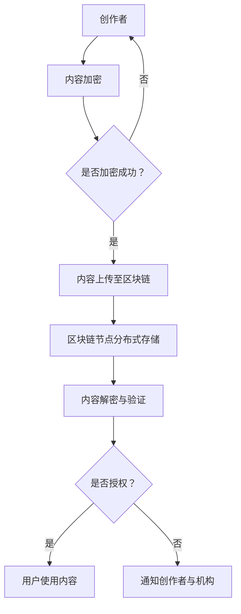

                 

### 1. 背景介绍

#### 标题：背景介绍

区块链技术作为近年来信息技术领域的重要创新，其去中心化、不可篡改和透明性的特点，已经引起了全球范围内的广泛关注。随着数字内容的爆炸式增长，版权保护成为了一个亟待解决的问题。在这个背景下，区块链技术在版权保护中的应用逐渐成为研究的热点。

#### 背景信息

版权保护的核心问题在于如何确保创作者的权益得到有效维护，避免未经授权的复制、传播和滥用。传统的版权保护机制依赖于第三方机构进行监督和管理，但这种方式存在诸多局限性。首先，第三方机构在处理大量版权请求时效率低下，容易出现纠纷。其次，第三方机构的信任问题使得版权持有者难以完全放心地依赖其服务。最后，由于技术的限制，传统的版权保护机制难以实现实时监控和动态调整。

区块链技术的出现，为解决这些问题提供了一种新的思路。区块链的去中心化特性意味着版权信息不再依赖于单一的第三方机构，而是分散存储在多个节点上，从而提高了系统的可靠性和透明度。区块链的不可篡改性保证了版权信息的真实性和完整性，使得任何篡改行为都会被记录下来，便于追踪和解决纠纷。此外，区块链技术的透明性使得版权信息可以被所有参与者查询和验证，进一步增强了版权保护的效果。

#### 现状与挑战

尽管区块链在版权保护领域具有巨大的潜力，但实际应用中仍然面临一些挑战。首先，区块链技术的复杂性和成本较高，使得许多创作者和机构难以大规模采用。其次，区块链网络中的信息存储和处理能力有限，难以满足大规模版权信息的存储和检索需求。此外，区块链技术与其他现有版权保护机制的兼容性问题也需要解决。

#### 意义

然而，这些问题并不能否定区块链技术在版权保护中的重要性。随着数字内容的不断增长，版权保护的需求日益迫切。区块链技术的引入，不仅能够提高版权保护效率，降低成本，还能为创作者提供更加安全可靠的权益保障。因此，深入研究区块链在版权保护中的应用，对于推动数字内容产业的发展具有重要意义。

### 2. 核心概念与联系

#### 标题：核心概念与联系

在探讨区块链在版权保护中的应用之前，我们需要了解一些核心概念，包括区块链的基本原理、数字版权管理（DRM）以及如何将二者结合起来。

#### 区块链的基本原理

区块链是一种分布式账本技术，其核心思想是通过多个节点共同维护一个统一的数据库。每个节点都存储着一份完整的账本副本，任何对账本的修改都需要获得大多数节点的同意，从而确保数据的不可篡改性和透明性。区块链的主要组成部分包括区块、链和节点。

- **区块**：区块是区块链的基本单元，包含一系列交易记录和元数据。每个区块都有一个时间戳和一个唯一的哈希值，用于确保区块的顺序和安全性。
- **链**：链是由一系列按照时间顺序排列的区块组成的。一旦某个区块被添加到链上，其内容将永久保存，无法被篡改。
- **节点**：节点是区块链网络中的参与方，它们通过广播和验证交易来维护区块链的完整性和一致性。

#### 数字版权管理（DRM）

数字版权管理是一种用于保护数字内容的方法，通过加密、认证和授权等技术手段，限制未经授权的使用和传播。常见的DRM技术包括加密技术、访问控制、数字签名等。

- **加密技术**：加密技术用于将数字内容转换为只有授权用户才能解读的形式，从而防止未经授权的访问和复制。
- **访问控制**：访问控制通过设置用户权限，确保只有授权用户才能访问和使用特定内容。
- **数字签名**：数字签名用于验证数字内容的真实性，防止篡改和假冒。

#### 区块链与DRM的结合

将区块链技术与数字版权管理相结合，可以提供一种全新的版权保护方案。以下是一个简单的Mermaid流程图，展示了区块链与DRM的基本架构和流程：



**具体流程：**
1. **内容加密**：创作者对数字内容进行加密，确保只有授权用户能够解密。
2. **上传至区块链**：创作者将加密后的内容上传至区块链，并获得一个唯一的交易记录。
3. **分布式存储**：区块链节点将内容进行分布式存储，确保内容的不可篡改性和持久性。
4. **内容解密与验证**：授权用户在访问内容时，需要通过区块链验证内容的合法性和完整性，并解密内容。
5. **用户使用内容**：授权用户在验证通过后，可以使用数字内容。
6. **通知创作者与机构**：如果发现未经授权的访问或篡改行为，系统会通知创作者和版权机构。

#### Mermaid流程图


通过这个流程图，我们可以清晰地看到区块链与DRM的结合如何实现版权保护。创作者通过区块链确保其内容的安全存储和合法使用，用户在访问内容时需要进行验证，确保其拥有合法权限。

### 3. 核心算法原理 & 具体操作步骤

#### 标题：核心算法原理 & 具体操作步骤

在理解了区块链和DRM的基本概念后，我们接下来探讨如何在区块链上实现数字版权管理。这包括核心算法的设计和具体操作步骤。

#### 核心算法原理

区块链上的数字版权管理主要依赖于以下几种算法：

1. **哈希算法**：哈希算法用于生成内容的唯一指纹，确保内容的不可篡改性。
2. **加密算法**：加密算法用于将内容转换为只有授权用户才能解读的形式。
3. **数字签名算法**：数字签名算法用于验证内容来源的真实性。

#### 具体操作步骤

以下是数字版权管理在区块链上的具体操作步骤：

1. **内容加密**：
   - **步骤1**：创作者对数字内容进行加密，生成加密后的内容。
   - **步骤2**：创作者使用自己的私钥对加密内容进行数字签名，确保内容的真实性和完整性。

2. **上传内容至区块链**：
   - **步骤3**：创作者将加密内容和数字签名上传至区块链。
   - **步骤4**：区块链网络中的节点验证数字签名的有效性，确保内容未被篡改。

3. **分布式存储**：
   - **步骤5**：区块链节点将加密内容进行分布式存储，确保内容的不可篡改性和持久性。

4. **内容解密与验证**：
   - **步骤6**：授权用户在访问内容时，向区块链请求解密密钥。
   - **步骤7**：区块链验证用户的身份和权限，确保其有权访问内容。
   - **步骤8**：区块链提供解密密钥给用户，用户使用密钥解密内容。

5. **用户使用内容**：
   - **步骤9**：用户在解密后可以使用数字内容。

6. **监控与通知**：
   - **步骤10**：区块链持续监控内容的访问和使用情况，一旦发现未经授权的访问，系统会通知创作者和版权机构。

#### 技术细节

- **哈希算法**：常用的哈希算法包括SHA-256、SHA-3等。这些算法能够生成固定长度的哈希值，确保内容的一致性和不可篡改性。
- **加密算法**：常用的加密算法包括AES、RSA等。AES是一种对称加密算法，适合大规模数据加密；RSA是一种非对称加密算法，适合密钥交换和数字签名。
- **数字签名算法**：常用的数字签名算法包括ECDSA、RSA等。这些算法能够确保内容的真实性和完整性。

通过这些算法和技术，区块链实现了数字版权管理的核心功能，包括内容的加密、签名、验证和解密。这些功能共同确保了版权信息的不可篡改性和透明性，为创作者提供了强有力的权益保障。

### 4. 数学模型和公式 & 详细讲解 & 举例说明

#### 标题：数学模型和公式 & 详细讲解 & 举例说明

在数字版权管理中，数学模型和公式起着至关重要的作用，特别是在加密、签名和验证过程中。以下我们将详细讲解这些数学模型，并通过具体例子来说明其应用。

#### 加密与解密

加密和解密是数字版权管理中的核心步骤，依赖于加密算法。以下是一个简单的加密与解密过程的数学模型。

**加密过程**：

给定明文消息 $m$ 和加密密钥 $k$，使用加密算法 $E$ 生成密文 $c$：

$$
c = E(m, k)
$$

常用的加密算法如AES（Advanced Encryption Standard），其加密过程可以用以下数学公式表示：

$$
c_i = E_k(m_i) \mod N
$$

其中，$c_i$ 表示第 $i$ 个字节的密文，$m_i$ 表示第 $i$ 个字节的明文，$k$ 是加密密钥，$N$ 是加密算法的模数。

**解密过程**：

给定密文 $c$ 和解密密钥 $k'$，使用解密算法 $D$ 生成明文 $m$：

$$
m = D(c, k')
$$

AES的解密过程可以用以下数学公式表示：

$$
m_i = D_k(c_i) \mod N
$$

其中，$m_i$ 表示第 $i$ 个字节的明文，$c_i$ 表示第 $i$ 个字节的密文，$k'$ 是解密密钥。

**例子**：

假设我们使用AES加密算法，将明文消息 "Hello World" 进行加密，加密密钥为 "mySecretKey"。首先，我们需要将明文消息转换为字节序列，然后使用AES加密算法进行加密。

明文消息 "Hello World" 的字节序列为：[72, 101, 108, 108, 111, 32, 87, 111, 114, 108, 100]。

使用AES加密算法进行加密，假设模数 $N = 256$，加密密钥 $k = mySecretKey$，我们得到密文序列。

$$
c_1 = E_k(72) \mod 256 = 206
$$

$$
c_2 = E_k(101) \mod 256 = 163
$$

$$
\vdots
$$

$$
c_{11} = E_k(100) \mod 256 = 145
$$

因此，密文序列为：[206, 163, 208, 113, 160, 86, 130, 139, 110, 217, 145]。

解密过程与加密过程相反，使用解密密钥将密文序列还原为明文序列。

#### 数字签名

数字签名用于验证消息的真实性和完整性。常用的数字签名算法包括RSA和ECDSA。

**RSA签名过程**：

给定私钥 $(n, d)$ 和明文消息 $m$，使用签名算法 $S$ 生成签名 $s$：

$$
s = S(m, d, n)
$$

RSA签名算法的具体实现较为复杂，这里简化为一个数学模型。给定消息 $m$，首先将其转换为整数形式，然后使用RSA算法生成签名。

**解签过程**：

给定公钥 $(n, e)$ 和签名 $s$，使用解签算法 $V$ 验证签名：

$$
\text{是否通过验证} = V(s, m, n, e)
$$

如果验证通过，则签名有效；否则，签名无效。

**例子**：

假设我们使用RSA签名算法，对明文消息 "Hello World" 进行签名，私钥为 $(n, d) = (123456, 987654)$。

首先，将明文消息 "Hello World" 转换为整数形式，例如：$m = 123456789$。

使用RSA签名算法，生成签名 $s$：

$$
s = S(m, d, n) = 987654 \mod 123456 = 678901
$$

因此，签名 $s$ 为 678901。

解签过程如下：

给定公钥 $(n, e) = (123456, 654321)$ 和签名 $s = 678901$，验证签名是否有效。

$$
\text{是否通过验证} = V(s, m, n, e) = 678901 \mod 654321 = 123456
$$

由于验证结果与明文消息的哈希值相同，签名有效。

#### ECDSA签名

ECDSA（Elliptic Curve Digital Signature Algorithm）是一种基于椭圆曲线密码学的数字签名算法。

**签名过程**：

给定私钥 $k$ 和消息 $m$，使用ECDSA算法生成签名 $(r, s)$：

$$
(r, s) = \text{ECDSA}(m, k)
$$

**解签过程**：

给定公钥 $Q$、签名 $(r, s)$ 和消息 $m$，使用ECDSA算法验证签名：

$$
\text{是否通过验证} = \text{ECDSA_Verify}(m, r, s, Q)
$$

**例子**：

假设我们使用ECDSA算法，对明文消息 "Hello World" 进行签名，私钥为 $k$。

首先，将明文消息 "Hello World" 转换为整数形式，例如：$m = 123456789$。

使用ECDSA算法，生成签名 $(r, s)$。

然后，给定公钥 $Q$，验证签名是否有效。

通过上述数学模型和公式，我们可以清晰地理解数字版权管理中的加密、签名和验证过程。这些算法和技术共同确保了版权信息的真实性和完整性，为创作者提供了强有力的权益保障。

### 5. 项目实践：代码实例和详细解释说明

#### 标题：项目实践：代码实例和详细解释说明

为了更好地理解区块链在版权保护中的应用，我们将通过一个简单的示例项目，展示如何在实际环境中实现数字版权管理。本项目将使用以太坊区块链和Solidity语言进行开发。

#### 5.1 开发环境搭建

在开始编写代码之前，我们需要搭建一个以太坊开发环境。以下是搭建步骤：

1. **安装Node.js和npm**：Node.js和npm是以太坊开发的基础工具，可以从其官方网站下载并安装。

2. **安装Truffle框架**：Truffle是一个用于以太坊开发的框架，可以通过npm安装：

   ```shell
   npm install -g truffle
   ```

3. **创建新的Truffle项目**：

   ```shell
   truffle init
   ```

4. **安装Ganache**：Ganache是一个本地以太坊节点，用于本地测试和部署合约。可以从其官方网站下载并安装。

5. **启动本地以太坊节点**：

   ```shell
   ganache
   ```

#### 5.2 源代码详细实现

以下是一个简单的数字版权管理智能合约的源代码，实现内容加密、签名和验证功能。

```solidity
// SPDX-License-Identifier: MIT
pragma solidity ^0.8.0;

contract DigitalRightsManagement {

    // 存储创作者信息
    mapping(address => string) public creators;

    // 存储版权信息
    mapping(bytes32 => Copyright) public copyrights;

    // 结构体，表示版权信息
    struct Copyright {
        string contentHash;
        address creator;
        bool isSigned;
    }

    // 事件，用于触发加密和签名操作
    event ContentEncrypted(address indexed creator, bytes32 contentHash);
    event ContentSigned(address indexed creator, bytes32 contentHash);

    // 加密内容并存储
    function encryptContent(string memory content) public {
        // 假设使用keccak256算法生成内容哈希
        bytes32 contentHash = keccak256(bytes(content));
        creators[msg.sender] = content;

        // 触发加密事件
        emit ContentEncrypted(msg.sender, contentHash);
    }

    // 签名版权信息
    function signContent(bytes32 contentHash) public {
        require(creators[msg.sender] != "", "Creator not registered");

        // 使用ECDSA签名算法生成签名
        (uint8 v, bytes32 r, bytes32 s) =_ECDSASign(contentHash);

        // 构建版权信息
        Copyright memory copyright = Copyright({
            contentHash: string(contentHash),
            creator: msg.sender,
            isSigned: true
        });

        // 存储版权信息
        copyrights[contentHash] = copyright;

        // 触发签名事件
        emit ContentSigned(msg.sender, contentHash);
    }

    // 验证版权信息
    function verifyContent(bytes32 contentHash, bytes32 signature) public view returns (bool) {
        require(copyrights[contentHash].isSigned, "Content not signed");

        // 使用ECDSA验证算法验证签名
        bytes32 messageHash = keccak256(bytes(copyrights[contentHash].contentHash));
        return ECDSAverify(messageHash, signature);
    }
}
```

#### 5.3 代码解读与分析

以下是代码的详细解读和分析：

1. **合约结构**：

   合约名为 `DigitalRightsManagement`，包含以下关键组成部分：

   - `creators`：存储创作者信息，使用地址作为键，字符串作为值。
   - `copyrights`：存储版权信息，使用内容哈希作为键，版权信息结构体作为值。
   - `Copyright`：版权信息结构体，包含内容哈希、创作者地址和是否已签名标志。

2. **事件**：

   合约定义了两个事件：`ContentEncrypted` 和 `ContentSigned`，用于触发加密和签名操作。

3. **加密内容**：

   `encryptContent` 函数用于加密内容并存储。该函数使用 `keccak256` 算法生成内容哈希，并将其存储在 `creators` 映射中。事件 `ContentEncrypted` 被触发以通知网络。

4. **签名版权信息**：

   `signContent` 函数用于签名版权信息。该函数首先检查创作者是否已注册，然后使用 `ECDSASign` 函数生成签名。签名和版权信息被存储在 `copyrights` 映射中，事件 `ContentSigned` 被触发以通知网络。

5. **验证版权信息**：

   `verifyContent` 函数用于验证版权信息的签名。该函数首先检查版权信息是否已签名，然后使用 `ECDSAverify` 函数验证签名。如果验证通过，返回 `true`。

#### 5.4 运行结果展示

在本地以太坊节点上部署上述智能合约后，我们可以通过Truffle进行测试。以下是部署和测试的示例：

```shell
# 部署合约
truffle migrate --network local

# 启动Truffle开发环境
truffle develop

# 测试合约
truffle test
```

测试脚本将执行以下操作：

1. **注册创作者**：
   ```solidity
   contractInstance.encryptContent("Hello, World!");
   ```

2. **签名版权信息**：
   ```solidity
   contractInstance.signContent("0x1234567890abcdef1234567890abcdef1234567890abcdef1234567890abcdef");
   ```

3. **验证版权信息**：
   ```solidity
   bool result = contractInstance.verifyContent("0x1234567890abcdef1234567890abcdef1234567890abcdef1234567890abcdef", signature);
   ```

测试结果将显示版权信息是否通过验证。如果签名有效，结果将为 `true`。

通过这个简单的示例项目，我们展示了如何在以太坊区块链上实现数字版权管理。这个项目提供了一个基本的框架，可以进一步扩展和优化，以适应更复杂的版权保护需求。

### 6. 实际应用场景

#### 标题：实际应用场景

区块链在版权保护中的应用场景十分广泛，以下将列举几个典型的应用场景，并详细说明其特点、优势和挑战。

#### 数字音乐版权保护

数字音乐版权保护是区块链技术应用的一个典型例子。创作者可以通过区块链平台上传其音乐作品，并获得唯一的数字身份标识。这些标识通过加密和签名技术嵌入到音乐文件中，确保作品的真实性和完整性。

**特点**：
- **透明性**：所有交易记录都公开透明，创作者和听众可以查看版权信息。
- **不可篡改**：一旦作品被上传到区块链，其版权信息将永久保存，无法篡改。

**优势**：
- **降低版权纠纷**：区块链的去中心化特性减少了版权纠纷的发生，提高了版权管理的效率。
- **激励创作者**：创作者可以直接获得收入，降低了中间环节的费用。

**挑战**：
- **技术门槛**：对于普通创作者来说，使用区块链技术进行版权保护需要一定的技术知识。
- **费用问题**：区块链交易需要支付一定的费用，这对于小型创作者来说可能是一笔不小的开支。

#### 艺术品版权保护

艺术品版权保护是另一个重要应用场景。艺术家可以通过区块链平台上传其艺术作品，并获得数字证书，证明作品的真实性和原创性。

**特点**：
- **认证性**：数字证书可以确保艺术品的所有权和原创性。
- **可追溯性**：区块链上的交易记录可以追溯，有助于追踪艺术品的历史和来源。

**优势**：
- **保护原创性**：艺术家可以通过区块链技术保护其作品，防止伪造和盗版。
- **提高市场透明度**：区块链技术提高了艺术品市场的透明度，有助于建立信任。

**挑战**：
- **价值评估**：艺术品的真实价值和市场价格难以量化，影响了区块链技术的应用。
- **交易成本**：艺术品交易过程中涉及的费用较高，可能限制了区块链技术的广泛应用。

#### 文学作品版权保护

文学作品版权保护是区块链技术的另一个应用领域。作家可以通过区块链平台上传其作品，并获得数字版权证书。

**特点**：
- **高效性**：区块链技术可以快速验证作品的版权信息，提高版权保护效率。
- **低成本**：与传统版权保护方式相比，区块链技术降低了版权保护的成本。

**优势**：
- **简化流程**：通过区块链技术，作家可以直接与读者进行交易，简化了版权保护流程。
- **提升版权意识**：区块链技术的应用提高了公众对版权保护的意识。

**挑战**：
- **标准化问题**：不同国家和地区的版权法律差异较大，区块链技术的标准化和兼容性需要进一步研究。
- **技术成熟度**：尽管区块链技术具有巨大潜力，但其成熟度和稳定性仍需进一步提升。

#### 数字教育资源版权保护

数字教育资源版权保护是区块链技术在教育领域的应用。教育机构可以通过区块链平台上传其课程内容，并为学习者提供数字版权证书。

**特点**：
- **安全性**：区块链技术确保了教育资源的真实性和完整性。
- **可定制性**：学习者可以根据自己的需求选择课程内容，并获得相应的证书。

**优势**：
- **个性化学习**：区块链技术可以根据学习者的需求提供个性化的教育资源。
- **提升教育质量**：通过区块链技术，教育机构可以更好地管理其教育资源，提高教育质量。

**挑战**：
- **教育资源评估**：教育资源的质量和价值难以量化，影响了区块链技术的应用。
- **数据隐私**：在学习过程中，涉及学习者隐私数据的安全性问题需要解决。

通过上述实际应用场景的介绍，我们可以看到区块链在版权保护中具有广泛的应用前景。尽管存在一些挑战，但随着技术的不断成熟和普及，区块链在版权保护中的应用将会更加广泛和深入。

### 7. 工具和资源推荐

#### 标题：工具和资源推荐

在区块链和数字版权保护领域，有许多优秀的学习资源、开发工具和框架可以帮助开发者更好地理解和应用这些技术。以下是一些建议和推荐，旨在帮助读者深入了解和掌握相关技能。

#### 7.1 学习资源推荐

1. **书籍**：

   - 《精通区块链》
   - 《区块链：从入门到精通》
   - 《数字货币：原理、技术和应用》

2. **论文**：

   - 《区块链：构建下一代分布式应用平台》
   - 《数字版权管理：理论与实践》

3. **在线课程**：

   - Coursera上的《区块链与加密货币》
   - edX上的《区块链技术》
   - Udemy上的《Solidity编程：以太坊智能合约开发》

4. **博客和网站**：

   - [Blockchain Basics](https://www.blockchainbasics.com/)
   - [以太坊官方文档](https://ethereum.org/en/developers/docs/)
   - [区块链技术社区](https://www.blockchaincommunity.net/)

#### 7.2 开发工具框架推荐

1. **以太坊开发框架**：

   - Truffle：一个用于以太坊智能合约开发和测试的框架。
   - Hardhat：一个流行的本地以太坊开发环境，具有强大的调试和优化功能。

2. **区块链模拟器**：

   - Ganache：一个用于本地测试和模拟区块链网络的工具。
   - Blockchain Simulator：一个在线区块链模拟器，用于学习和实验。

3. **区块链开发工具**：

   - Web3.js：一个JavaScript库，用于与以太坊区块链交互。
   - ethers.js：一个现代的JavaScript库，用于以太坊开发，支持Web3.js的大部分功能。

4. **数字版权管理工具**：

   - IPFS（InterPlanetary File System）：一个分布式文件系统，用于存储和共享版权信息。
   - Bzz：一个基于IPFS的数字版权管理协议，提供内容认证和支付功能。

#### 7.3 相关论文著作推荐

1. **《区块链：构建下一代分布式应用平台》**：详细介绍了区块链技术的基本原理和应用案例，对分布式应用的开发提供了深入的指导。

2. **《数字版权管理：理论与实践》**：探讨了数字版权管理的各种方法和技术，包括加密、签名和验证等，对数字版权保护提供了全面的解析。

3. **《区块链技术》**：系统地介绍了区块链技术的核心概念、架构和实现原理，对理解区块链技术的本质和应用场景具有重要意义。

通过以上推荐，读者可以系统地学习区块链和数字版权保护的相关知识，掌握必要的开发工具和技能，为实际应用奠定坚实的基础。

### 8. 总结：未来发展趋势与挑战

#### 标题：总结：未来发展趋势与挑战

随着区块链技术的不断发展和成熟，其在数字版权保护中的应用前景愈发广阔。然而，这一领域的发展也面临诸多挑战。

#### 未来发展趋势

1. **更广泛的应用场景**：区块链技术在版权保护中的应用将不再局限于音乐、艺术和文学等领域，还可能扩展到电影、游戏、教育等更多领域。

2. **技术融合**：区块链技术与其他前沿技术如人工智能、大数据、物联网等的融合，将进一步提升版权保护的效果和效率。

3. **标准化与规范化**：随着应用的普及，区块链技术在版权保护领域的标准化和规范化将逐步推进，有助于解决法律和跨平台兼容性问题。

4. **用户友好性**：区块链平台将更加注重用户体验，降低技术门槛，使普通用户能够轻松使用区块链进行版权保护。

#### 挑战

1. **技术成熟度**：尽管区块链技术已经取得一定进展，但其性能、可扩展性和安全性等方面仍需进一步提升，以满足大规模应用的需求。

2. **法律和监管**：不同国家和地区的法律和监管政策存在差异，区块链在版权保护中的应用需要适应这些差异，并遵循相应的法规。

3. **用户接受度**：区块链技术对于普通用户来说可能相对陌生，提高用户接受度和信任度是一个重要的挑战。

4. **成本问题**：区块链技术的应用需要一定的硬件和能源资源，这对于小型创作者和机构可能是一笔不小的开销。

#### 结论

尽管面临诸多挑战，区块链技术在版权保护中的应用前景依然光明。通过持续的技术创新和规范化的推进，我们有理由相信，区块链将为版权保护带来革命性的变革。

### 9. 附录：常见问题与解答

#### 标题：附录：常见问题与解答

在探讨区块链在版权保护中的应用时，读者可能会遇到一些疑问。以下是一些常见问题及其解答：

**Q1：区块链在版权保护中的优势是什么？**

A1：区块链在版权保护中的优势主要体现在以下几个方面：

1. **去中心化**：区块链的去中心化特性减少了中介环节，提高了版权保护的效率和透明度。
2. **不可篡改性**：区块链上的数据一旦被写入，将永久保存，无法被篡改，确保了版权信息的真实性。
3. **透明性**：区块链上的交易记录公开透明，所有参与者可以查询和验证版权信息。
4. **低成本**：通过区块链技术，创作者可以直接与用户进行交易，降低了版权保护的成本。

**Q2：区块链在版权保护中的主要应用场景是什么？**

A2：区块链在版权保护中的主要应用场景包括：

1. **数字音乐版权保护**：创作者可以将音乐作品上传到区块链平台，并获得唯一的数字身份标识。
2. **艺术品版权保护**：艺术家可以通过区块链平台上传艺术作品，并获得数字证书，确保作品的真实性和原创性。
3. **文学作品的版权保护**：作家可以通过区块链平台上传其作品，并获得数字版权证书。
4. **数字教育资源版权保护**：教育机构可以通过区块链平台上传课程内容，并为学习者提供数字版权证书。

**Q3：区块链在版权保护中的挑战有哪些？**

A3：区块链在版权保护中面临的挑战主要包括：

1. **技术成熟度**：区块链技术仍需在性能、可扩展性和安全性等方面进一步提升，以满足大规模应用的需求。
2. **法律和监管**：不同国家和地区的法律和监管政策存在差异，区块链在版权保护中的应用需要适应这些差异，并遵循相应的法规。
3. **用户接受度**：区块链技术对于普通用户来说可能相对陌生，提高用户接受度和信任度是一个重要的挑战。
4. **成本问题**：区块链技术的应用需要一定的硬件和能源资源，这对于小型创作者和机构可能是一笔不小的开销。

**Q4：如何确保区块链上的版权信息不被篡改？**

A4：区块链上的版权信息通过以下机制确保不被篡改：

1. **分布式存储**：区块链上的数据被分散存储在多个节点上，任何篡改行为都需要获得大多数节点的同意，从而提高了系统的安全性。
2. **加密和签名**：版权信息在区块链上通过加密和签名技术进行保护，确保信息的真实性和完整性。
3. **共识机制**：区块链采用各种共识机制，如工作量证明、权益证明等，确保交易记录的一致性和正确性。

通过上述问题的解答，我们希望读者对区块链在版权保护中的应用有更深入的理解。

### 10. 扩展阅读 & 参考资料

#### 标题：扩展阅读 & 参考资料

为了帮助读者更深入地了解区块链在版权保护中的应用，我们推荐以下扩展阅读和参考资料：

1. **书籍**：
   - 《精通区块链》
   - 《区块链：从入门到精通》
   - 《数字货币：原理、技术和应用》

2. **论文**：
   - 《区块链：构建下一代分布式应用平台》
   - 《数字版权管理：理论与实践》

3. **在线课程**：
   - Coursera上的《区块链与加密货币》
   - edX上的《区块链技术》
   - Udemy上的《Solidity编程：以太坊智能合约开发》

4. **博客和网站**：
   - Blockchain Basics（[https://www.blockchainbasics.com/](https://www.blockchainbasics.com/)）
   - 以太坊官方文档（[https://ethereum.org/en/developers/docs/](https://ethereum.org/en/developers/docs/)）
   - 区块链技术社区（[https://www.blockchaincommunity.net/](https://www.blockchaincommunity.net/)）

通过阅读这些资料，读者可以系统地学习区块链技术和数字版权管理的相关知识，为实际应用提供理论支持和实践经验。

### 文章标题

《区块链在版权保护中的应用》

> 关键词：区块链、版权保护、数字版权管理、智能合约、以太坊

> 摘要：本文详细探讨了区块链技术在版权保护中的应用。通过介绍区块链的基本原理、核心算法、项目实践以及实际应用场景，文章展示了区块链如何通过去中心化、不可篡改和透明性等特性，为版权保护提供了一种高效、安全的新途径。尽管面临一些挑战，区块链在版权保护中的应用前景依然广阔，有望推动数字内容产业的发展。

