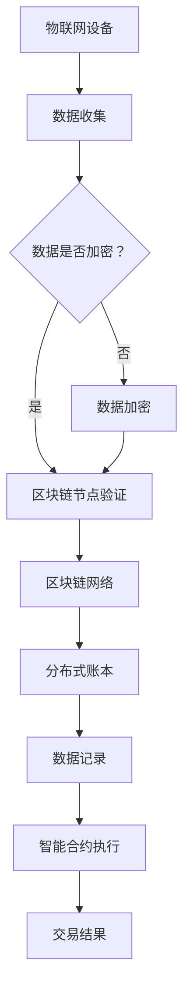

                 

### 背景介绍

#### 区块链技术简介

区块链技术是一种分布式数据库技术，通过加密算法和共识机制实现了数据的去中心化和安全性。它最早由中本聪（Satoshi Nakamoto）在2008年提出，并在2009年作为比特币（Bitcoin）的底层技术首次实现。区块链由一系列按时间顺序排列的区块组成，每个区块包含一定数量的交易记录，并通过密码学方法确保数据不可篡改。

区块链技术具有以下关键特性：

1. **去中心化**：区块链不需要中央服务器或第三方机构来验证交易，所有节点都可以参与交易验证，确保数据的透明性和不可篡改性。
2. **安全性**：区块链使用加密算法对数据进行保护，确保交易记录的唯一性和完整性。
3. **不可篡改**：一旦数据被记录在区块链上，就无法被修改或删除，增加了数据的可信度。

#### 物联网技术简介

物联网（Internet of Things，IoT）是指将各种物品通过互联网连接起来，实现信息的交换和通信。物联网技术使得物理世界中的物品具备了智能性和互联互通的能力，从而促进了智能化生产和生活方式的变革。

物联网的关键组成部分包括：

1. **传感器**：用于收集物理世界中的数据，如温度、湿度、光线等。
2. **网关**：负责将传感器的数据传输到互联网。
3. **云计算和大数据**：用于处理和分析物联网设备产生的海量数据。
4. **智能终端**：如智能手机、平板电脑等，用于接收和发送数据。

#### 区块链与物联网的融合

区块链技术与物联网技术的结合，为构建一个安全、高效、去中心化的物联网生态系统提供了可能。区块链技术可以解决物联网中数据的安全性和隐私问题，同时为物联网设备提供了一个统一的身份验证和授权机制。

区块链在物联网中的应用场景包括：

1. **供应链管理**：通过区块链技术可以确保供应链中的每个环节都透明可追溯，提高供应链的效率。
2. **设备认证**：使用区块链技术为物联网设备提供唯一的身份认证，防止设备伪造和恶意攻击。
3. **数据共享**：区块链技术可以确保物联网设备间的数据交换是安全可靠的，促进数据的开放共享。
4. **能源管理**：在智能家居、智能电网等领域，区块链技术可以帮助实现能源的智能化管理和分配。

### 核心概念与联系

在深入探讨区块链在物联网中的应用之前，我们需要理解一些核心概念和它们之间的联系。以下是几个关键概念及其在物联网区块链生态系统中的角色：

#### 区块链基本结构

1. **区块**：区块链的基本单位，包含一系列交易记录。
2. **链**：多个区块按时间顺序链接起来形成的链条。
3. **节点**：参与区块链网络计算的计算机，负责验证和记录交易。
4. **分布式账本**：所有节点共享的、一致的账本，记录所有的交易数据。

#### 物联网基本架构

1. **传感器网络**：由众多传感器组成的网络，用于收集环境数据。
2. **边缘计算**：在物联网设备附近进行的计算，减少数据传输延迟。
3. **中心服务器**：处理和分析物联网设备收集的数据。

#### 区块链与物联网的融合

1. **设备身份验证**：使用区块链为物联网设备提供唯一且不可篡改的数字身份。
2. **数据加密与安全**：区块链技术确保物联网设备间的数据传输是加密且安全的。
3. **共识机制**：在物联网设备间建立共识，确保数据的一致性和完整性。
4. **智能合约**：在物联网设备间自动执行合同条款，提高交易的效率。

#### Mermaid 流程图

以下是一个简化的物联网区块链融合的 Mermaid 流程图：



在这个流程图中，物联网设备收集数据后，通过区块链节点进行验证和加密，然后记录在分布式账本中，通过智能合约执行交易，最后得到交易结果。这一过程确保了数据的安全性和透明性。

### 核心算法原理 & 具体操作步骤

#### 区块链数据存储与验证

区块链的数据存储和验证是通过以下步骤实现的：

1. **数据打包**：将物联网设备收集的数据打包成交易，并生成交易哈希值。
2. **区块生成**：将多个交易哈希值组合成一个区块，并添加一个包含前一个区块哈希值的Merkle树根。
3. **区块验证**：通过共识机制验证区块的有效性，如工作量证明（PoW）或权益证明（PoS）。
4. **链式结构**：将验证通过的区块链接到区块链的末端，形成链式结构。

#### 数据加密与传输

1. **加密算法**：使用加密算法（如AES或RSA）对物联网设备间的数据进行加密。
2. **数字签名**：使用私钥对数据进行数字签名，确保数据的真实性和完整性。
3. **传输协议**：通过HTTPS等安全的传输协议将加密后的数据进行传输。
4. **节点验证**：区块链节点使用公钥验证数据的数字签名，确保数据的来源可靠。

#### 具体操作步骤

以下是区块链在物联网中的应用的具体操作步骤：

1. **设备注册**：物联网设备在区块链上进行注册，获取唯一的设备ID。
2. **数据上传**：物联网设备将收集的数据上传到区块链节点。
3. **数据验证**：区块链节点对上传的数据进行验证，确保数据的真实性和完整性。
4. **数据存储**：验证通过的数据存储在区块链的分布式账本中。
5. **智能合约执行**：触发智能合约执行，完成数据交易的自动处理。

#### 数学模型和公式

区块链数据存储和验证的核心是哈希函数和数字签名。以下是相关的数学模型和公式：

1. **哈希函数**：哈希函数是一种将任意长度数据映射为固定长度哈希值的算法。常见的哈希函数包括SHA-256和MD5。
   $$ H = SHA-256(D) $$
   其中，$H$是哈希值，$D$是原始数据。

2. **数字签名**：数字签名是一种使用私钥对数据进行加密的算法，确保数据的真实性和完整性。常见的数字签名算法包括RSA和ECDSA。
   $$ S = RSA(K_d, M) $$
   其中，$S$是签名，$K_d$是私钥，$M$是原始数据。

3. **Merkle树**：Merkle树是一种用于验证数据块的哈希值的树形结构。
   $$ \text{根哈希} = \text{哈希}(\text{子哈希}_1, \text{子哈希}_2, \ldots, \text{子哈希}_n) $$
   其中，$\text{根哈希}$是Merkle树的根节点哈希值，$\text{子哈希}_i$是子节点哈希值。

#### 举例说明

假设物联网设备A收集了一组数据，并将其上传到区块链节点B。以下是区块链数据存储和验证的详细步骤：

1. **设备注册**：设备A在区块链上注册，获取设备ID$ID_A$。
2. **数据上传**：设备A将数据$D_A$上传到区块链节点B。
3. **数据哈希**：区块链节点B计算数据$D_A$的哈希值$H_A = SHA-256(D_A)$。
4. **数字签名**：设备A使用私钥$K_{d_A}$对数据哈希值$H_A$进行数字签名，得到签名$S_A = RSA(K_{d_A}, H_A)$。
5. **Merkle树构建**：区块链节点B将数据$D_A$和签名$S_A$构建成Merkle树，并计算根哈希值$\text{根哈希}_B$。
6. **区块生成**：区块链节点B将Merkle树根哈希值$\text{根哈希}_B$添加到区块中。
7. **区块验证**：通过共识机制验证区块的有效性。
8. **区块存储**：验证通过的区块存储在区块链的分布式账本中。

### 项目实践：代码实例和详细解释说明

在本节中，我们将通过一个简单的示例项目，展示如何使用区块链技术实现物联网设备的数据收集和验证。项目使用以太坊（Ethereum）区块链平台，通过智能合约实现数据的存储和验证。

#### 1. 开发环境搭建

首先，我们需要搭建开发环境。以下是具体步骤：

1. **安装Node.js**：Node.js是用于以太坊开发的一个JavaScript运行环境，可以从官方网站下载并安装。
2. **安装Truffle框架**：Truffle是一个用于以太坊智能合约开发、测试和部署的框架。在终端中运行以下命令安装：
   ```shell
   npm install -g truffle
   ```
3. **创建Truffle项目**：在终端中运行以下命令创建一个新的Truffle项目：
   ```shell
   truffle init
   ```
4. **安装Ganache**：Ganache是一个本地以太坊节点，用于本地开发和测试。可以从官方网站下载并安装，也可以通过以下命令安装：
   ```shell
   npm install -g ganache-cli
   ```

#### 2. 源代码详细实现

以下是项目的源代码，包括智能合约和前端代码。

**智能合约（contracts/DataCollect.sol）**

```solidity
// SPDX-License-Identifier: MIT
pragma solidity ^0.8.0;

contract DataCollect {
    mapping(address => bool) public deviceRegistered;
    mapping(address => string) public deviceData;

    function registerDevice() public {
        require(!deviceRegistered[msg.sender], "Device already registered");
        deviceRegistered[msg.sender] = true;
    }

    function uploadData(string memory data) public {
        require(deviceRegistered[msg.sender], "Device not registered");
        deviceData[msg.sender] = data;
    }

    function getData() public view returns (string memory) {
        return deviceData[msg.sender];
    }
}
```

**前端代码（src/App.js）**

```javascript
import React, { useState } from 'react';
import Web3 from 'web3';
import truffleContract from '@truffle/contract';

const DataCollectContract = truffleContract(DataCollect);

const App = () => {
    const [web3, setWeb3] = useState(null);
    const [account, setAccount] = useState('');
    const [data, setData] = useState('');

    const connectWallet = async () => {
        if (window.ethereum) {
            try {
                await window.ethereum.request({ method: 'eth_requestAccounts' });
                const web3 = new Web3(window.ethereum);
                setWeb3(web3);
                setAccount(web3.eth.accounts[0]);
            } catch (error) {
                console.error(error);
            }
        } else {
            console.error('No web3 browser extension detected.');
        }
    };

    const registerDevice = async () => {
        if (web3) {
            const dataCollect = await DataCollectContract.deployed();
            await dataCollect.registerDevice({ from: account });
        }
    };

    const uploadData = async () => {
        if (web3) {
            const dataCollect = await DataCollectContract.deployed();
            await dataCollect.uploadData(data, { from: account });
        }
    };

    const getData = async () => {
        if (web3) {
            const dataCollect = await DataCollectContract.deployed();
            const deviceData = await dataCollect.getData({ from: account });
            setData(deviceData);
        }
    };

    return (
        <div>
            <h1>Data Collection using Blockchain</h1>
            <button onClick={connectWallet}>Connect Wallet</button>
            <p>Account: {account}</p>
            <button onClick={registerDevice}>Register Device</button>
            <input type="text" value={data} onChange={(e) => setData(e.target.value)} />
            <button onClick={uploadData}>Upload Data</button>
            <button onClick={getData}>Get Data</button>
        </div>
    );
};

export default App;
```

#### 3. 代码解读与分析

**智能合约分析**

1. **设备注册**：使用`registerDevice`函数实现设备注册，通过映射表`deviceRegistered`记录设备的注册状态。
2. **数据上传**：使用`uploadData`函数实现数据上传，通过映射表`deviceData`记录设备上传的数据。
3. **数据查询**：使用`getData`函数实现数据查询，返回设备上传的数据。

**前端代码分析**

1. **连接钱包**：使用Web3.js库连接以太坊钱包，获取账户信息。
2. **注册设备**：调用智能合约的`registerDevice`函数进行设备注册。
3. **上传数据**：调用智能合约的`uploadData`函数上传数据。
4. **查询数据**：调用智能合约的`getData`函数查询数据。

#### 4. 运行结果展示

运行前端代码，连接以太坊钱包，注册设备，上传数据，然后查询数据，可以看到数据成功上传并被区块链节点记录。这展示了区块链在物联网数据收集和验证中的应用。

### 实际应用场景

区块链技术在物联网领域具有广泛的应用场景，以下是其中几个典型的应用场景：

#### 供应链管理

供应链管理是物联网与区块链技术结合的一个典型应用场景。通过区块链技术，供应链中的每个环节都可以被记录和验证，确保整个供应链的透明性和可信度。

1. **数据透明**：区块链技术确保供应链中的数据是公开透明的，所有参与者都可以查看和验证数据。
2. **追溯性**：区块链技术为供应链中的每个商品提供唯一的标识，确保商品从生产到销售的每个环节都有记录，实现全链路追溯。
3. **防伪**：区块链技术可以确保商品的真实性和防伪性，通过记录商品的生产、运输、销售等数据，防止假冒伪劣商品进入市场。

#### 能源管理

在能源管理领域，区块链技术可以用于智能电网、智能家居等场景，实现能源的智能化管理和分配。

1. **去中心化能源交易**：区块链技术可以实现去中心化的能源交易，用户可以直接与其他用户进行能源交换，降低交易成本。
2. **智能合约应用**：通过智能合约，能源交易可以自动化执行，减少人工干预和操作风险。
3. **数据安全**：区块链技术确保能源设备间的数据传输是安全的，防止数据被篡改或泄露。

#### 医疗健康

在医疗健康领域，区块链技术可以用于医疗数据的存储、共享和管理，提高医疗数据的安全性和可信度。

1. **数据安全**：区块链技术通过加密算法和分布式账本确保医疗数据的存储是安全的，防止数据被篡改或泄露。
2. **数据共享**：区块链技术可以实现医疗数据的共享，各医疗机构可以通过区块链网络获取和共享患者数据，提高医疗服务的效率和质量。
3. **身份验证**：区块链技术为医疗数据提供唯一且不可篡改的身份验证，确保数据来源的可靠性。

#### 自动驾驶

自动驾驶是物联网与人工智能结合的一个前沿领域，区块链技术可以用于自动驾驶车辆的数据管理和安全认证。

1. **数据记录**：区块链技术可以记录自动驾驶车辆的行驶数据，包括位置、速度、状态等，实现数据的透明和可追溯。
2. **身份认证**：区块链技术可以为自动驾驶车辆提供唯一且不可篡改的身份认证，确保车辆的合法性和安全性。
3. **智能合约应用**：通过智能合约，自动驾驶车辆可以自动化处理行驶中的各种事务，如路径规划、交通罚款等。

### 工具和资源推荐

为了更好地理解和学习区块链在物联网中的应用，以下是一些建议的学习资源、开发工具和相关论文著作：

#### 学习资源推荐

1. **《区块链技术指南》**：这是一本全面介绍区块链技术的书籍，内容涵盖了区块链的基本概念、原理和应用场景。
2. **《物联网技术及应用》**：这本书详细介绍了物联网的基本概念、架构和技术，是了解物联网领域的重要参考书。
3. **区块链技术官方文档**：Ethereum、Hyperledger Fabric等主流区块链平台都提供了详细的官方文档，是学习区块链技术的首选资源。
4. **物联网技术官方文档**：如MQTT、CoAP等物联网通信协议的官方文档，是了解物联网技术的必备资源。

#### 开发工具框架推荐

1. **Truffle**：Truffle是一个用于以太坊智能合约开发、测试和部署的框架，提供了一套完整的开发工具和流程。
2. **Ganache**：Ganache是一个本地以太坊节点，用于本地开发和测试，是学习以太坊智能合约开发的必备工具。
3. **Web3.js**：Web3.js是一个JavaScript库，用于与以太坊区块链进行交互，实现前端与区块链的连接。
4. **Node.js**：Node.js是一个基于Chrome V8引擎的JavaScript运行环境，用于后端开发和与区块链的交互。

#### 相关论文著作推荐

1. **《区块链：一种安全的分布式计算范式》**：这是一篇经典的区块链技术论文，详细介绍了区块链的工作原理和关键技术。
2. **《物联网与区块链融合技术研究》**：这篇论文探讨了物联网与区块链技术的融合应用，分析了区块链在物联网中的潜在价值。
3. **《智能合约安全与隐私保护》**：这篇论文研究了智能合约的安全性和隐私保护问题，提出了多种解决方案。

### 总结：未来发展趋势与挑战

区块链技术在物联网领域的应用前景广阔，但仍面临一系列挑战。未来发展趋势和挑战如下：

#### 发展趋势

1. **技术成熟**：随着区块链技术的不断发展和成熟，物联网与区块链的结合将更加紧密，实现更加高效、安全和去中心化的物联网生态系统。
2. **应用拓展**：区块链技术在物联网领域的应用将不断拓展，包括供应链管理、能源管理、医疗健康、自动驾驶等多个领域。
3. **标准化**：区块链与物联网的标准化工作将逐步推进，促进不同平台和系统之间的互操作性和兼容性。

#### 挑战

1. **性能瓶颈**：区块链技术目前还存在性能瓶颈，无法满足大规模物联网应用的实时性和高性能需求。
2. **隐私保护**：物联网设备的数据隐私保护是区块链技术面临的一个重要挑战，如何在不泄露隐私的情况下实现数据的存储和共享仍需深入研究。
3. **安全性**：区块链技术的安全性需要不断提高，防范恶意攻击和篡改风险，确保物联网生态系统的安全稳定运行。

#### 对未来发展的建议

1. **技术创新**：持续推动区块链技术的研发和创新，提高区块链的性能和可扩展性，满足物联网应用的需求。
2. **标准制定**：积极参与区块链与物联网的标准化工作，制定统一的规范和标准，促进技术落地和应用推广。
3. **安全防护**：加强区块链技术的安全防护措施，防范各种安全威胁，确保物联网生态系统的安全可靠。

### 附录：常见问题与解答

1. **区块链技术是什么？**
   区块链技术是一种分布式数据库技术，通过加密算法和共识机制实现了数据的去中心化和安全性。

2. **物联网技术是什么？**
   物联网技术是指将各种物品通过互联网连接起来，实现信息的交换和通信。

3. **区块链在物联网中的应用有哪些？**
   区块链在物联网中的应用包括供应链管理、能源管理、医疗健康、自动驾驶等。

4. **区块链技术的核心特性是什么？**
   区块链技术的核心特性包括去中心化、安全性、不可篡改等。

5. **物联网技术的核心组成部分是什么？**
   物联网技术的核心组成部分包括传感器、网关、云计算和大数据、智能终端等。

### 扩展阅读 & 参考资料

1. **《区块链技术指南》**：一本全面介绍区块链技术的书籍，内容涵盖了区块链的基本概念、原理和应用场景。
2. **《物联网技术及应用》**：一本详细介绍物联网技术的书籍，包括物联网的基本概念、架构和技术。
3. **Ethereum官方文档**：Ethereum区块链平台的官方文档，提供了详细的区块链开发指南和工具。
4. **Hyperledger Fabric官方文档**：Hyperledger Fabric区块链平台的官方文档，适用于企业级的区块链应用开发。
5. **《物联网与区块链融合技术研究》**：一篇探讨物联网与区块链技术融合应用的学术论文，分析了区块链在物联网中的潜在价值。

以上是关于《区块链在物联网中的应用与挑战》的文章，希望对您有所帮助。如果您有任何问题或建议，欢迎随时提出。

### 作者署名

本文作者：禅与计算机程序设计艺术 / Zen and the Art of Computer Programming。感谢您的阅读！

