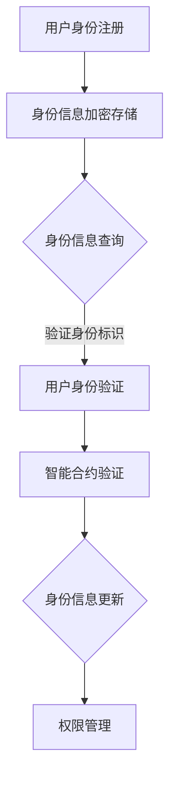

                 

### 文章标题

区块链数字身份认证协议：身份管理的创新标准

> 关键词：区块链、数字身份认证、身份管理、协议、创新标准

> 摘要：本文深入探讨了区块链技术在数字身份认证领域中的应用，提出了一个创新的区块链数字身份认证协议，并详细分析了该协议的核心概念、原理、算法以及实际应用场景。通过数学模型、具体操作步骤和项目实践的讲解，本文旨在为读者提供一个全面、系统的区块链数字身份认证解决方案。

### 1. 背景介绍

随着互联网和大数据技术的飞速发展，数字身份认证已经成为了人们日常生活中不可或缺的一部分。传统的身份认证方法，如用户名密码、短信验证码等，存在安全性低、易被破解等问题。随着隐私泄露事件的频繁发生，用户对于个人信息安全和隐私保护的需求日益增长。如何实现安全、高效、可信的数字身份认证，成为了当前亟待解决的重要问题。

区块链技术作为一种去中心化、不可篡改的分布式数据库技术，具有强大的安全性和透明性。近年来，区块链技术在金融、供应链管理、医疗等多个领域取得了显著的应用成果。特别是在数字身份认证领域，区块链技术提供了新的解决方案，有望解决传统身份认证方法中存在的诸多问题。

本文将介绍一种基于区块链的数字身份认证协议，通过结合区块链技术的特点和优势，提出一种创新的身份管理标准，为数字身份认证领域的发展提供新的思路和方向。### 2. 核心概念与联系

#### 2.1 区块链技术概述

区块链技术是一种分布式数据库技术，通过去中心化的方式实现数据的存储和管理。区块链由一系列按照时间顺序排列的区块组成，每个区块包含一定数量的交易记录。这些交易记录通过加密算法和时间戳技术进行验证和绑定，确保了区块链数据的不可篡改性和安全性。

区块链网络中的参与节点通过共识算法（如工作量证明、权益证明等）达成对数据的一致性共识。区块链技术的这些特点使得它成为一种可靠、透明、安全的存储和传递数据的工具。

#### 2.2 数字身份认证概述

数字身份认证是指通过验证用户的身份信息，确保用户在进行数字交互时的真实性和合法性。传统的数字身份认证方法通常基于用户名、密码、短信验证码等手段，这些方法存在安全性低、易被破解等问题。随着区块链技术的发展，基于区块链的数字身份认证逐渐成为研究热点。

基于区块链的数字身份认证方法通过将用户的身份信息存储在区块链上，利用区块链的不可篡改性和去中心化特性，确保身份信息的真实性和安全性。同时，区块链上的智能合约技术可以实现自动化、高效的身份验证过程。

#### 2.3 区块链数字身份认证协议

区块链数字身份认证协议是一种基于区块链技术的身份认证机制，通过构建一个分布式身份信息数据库，实现用户身份的验证和管理。以下是区块链数字身份认证协议的核心组成部分：

##### 2.3.1 身份信息存储

在区块链数字身份认证协议中，用户的身份信息（如姓名、身份证号码、邮箱地址等）被加密存储在区块链上。每个用户都有一个唯一的身份标识（ID），该标识与用户的身份信息进行绑定。身份信息的加密存储可以防止未经授权的访问和篡改，确保用户身份信息的隐私和安全。

##### 2.3.2 身份认证流程

区块链数字身份认证协议通过以下步骤实现用户身份的验证：

1. 用户身份注册：用户在首次使用区块链数字身份认证服务时，需要将身份信息提交给身份认证系统，并生成一个唯一身份标识（ID）。身份认证系统将用户身份信息加密存储在区块链上。

2. 用户身份验证：当用户需要访问受保护的资源或服务时，需要通过身份认证系统进行身份验证。用户向身份认证系统提交身份标识（ID）和相关凭证（如密码、指纹等），身份认证系统通过查询区块链上的身份信息，验证用户身份的有效性。

3. 智能合约验证：在身份验证过程中，智能合约技术可以发挥作用。智能合约是一个自动执行合约条款的程序，通过将身份认证过程编码为智能合约，可以确保身份认证的自动化、高效和可信。

##### 2.3.3 身份信息更新与权限管理

区块链数字身份认证协议支持用户身份信息的更新和权限管理。用户可以在授权范围内修改自己的身份信息，如更改联系方式、更新证件信息等。身份认证系统可以根据用户的权限级别，对用户身份信息进行分类管理，确保用户身份信息的真实性和安全性。

#### 2.4 Mermaid 流程图

以下是一个简化的区块链数字身份认证协议的 Mermaid 流程图，展示了身份认证的核心流程：



#### 2.5 关键术语解释

- **区块链（Blockchain）**：一种分布式数据库技术，用于存储和传输数据，具有不可篡改、去中心化等特性。
- **数字身份认证**：通过验证用户的身份信息，确保用户在进行数字交互时的真实性和合法性。
- **智能合约**：一种自动执行合约条款的程序，通过将身份认证过程编码为智能合约，实现自动化、高效和可信的身份验证。

### 3. 核心算法原理 & 具体操作步骤

#### 3.1 密码学基础

区块链数字身份认证协议依赖于密码学技术，包括哈希函数、非对称加密和数字签名等。以下是这些密码学基础的概念和原理：

##### 3.1.1 哈希函数

哈希函数是一种将任意长度的输入数据映射为固定长度的输出数据的函数。哈希函数具有以下特性：

- **单向性**：给定输入数据，可以快速计算出哈希值，但给定哈希值，无法反推出原始输入数据。
- **抗碰撞性**：对于不同的输入数据，很难找到两个具有相同哈希值的输入数据。
- **计算效率**：哈希函数的计算速度非常快。

常见的哈希函数有 SHA-256、SHA-3 等。

##### 3.1.2 非对称加密

非对称加密是一种加密算法，它使用一对密钥（公钥和私钥）进行加密和解密。非对称加密具有以下特点：

- **公钥加密，私钥解密**：数据使用公钥加密后，只有拥有对应私钥的用户才能解密。
- **私钥签名，公钥验证**：用户可以使用私钥对数据进行签名，其他用户可以使用公钥验证签名的有效性。

常见的非对称加密算法有 RSA、ECC 等。

##### 3.1.3 数字签名

数字签名是一种用于验证数据完整性和真实性的技术。数字签名通过将数据与私钥进行加密，生成一个签名。接收方可以使用公钥对签名进行验证，以确认数据的完整性和真实性。

数字签名的过程如下：

1. 发送方对数据进行哈希处理，生成哈希值。
2. 发送方使用私钥对哈希值进行加密，生成签名。
3. 发送方将数据和签名一同发送给接收方。
4. 接收方对数据进行哈希处理，生成哈希值。
5. 接收方使用公钥对签名进行解密，生成哈希值。
6. 接收方将生成的哈希值与接收到的哈希值进行比较，以验证签名的有效性。

#### 3.2 区块链数字身份认证算法

区块链数字身份认证算法主要包括身份注册、身份验证和身份更新三个部分。以下是具体的操作步骤：

##### 3.2.1 身份注册

1. **生成密钥对**：用户生成一对非对称密钥（公钥和私钥）。
2. **身份信息加密**：用户将身份信息（如姓名、身份证号码等）加密存储在本地。
3. **身份信息提交**：用户将加密后的身份信息和公钥提交给身份认证系统。
4. **身份信息上链**：身份认证系统将用户身份信息加密存储在区块链上，并将公钥与身份标识（ID）进行绑定。

##### 3.2.2 身份验证

1. **提交身份标识**：用户向身份认证系统提交身份标识（ID）。
2. **查询身份信息**：身份认证系统在区块链上查询与身份标识（ID）绑定的身份信息。
3. **身份信息验证**：身份认证系统对查询到的身份信息进行验证，包括身份信息的完整性、真实性和有效性。
4. **智能合约验证**：身份认证系统调用智能合约，对用户身份进行进一步验证，如验证用户是否有权限访问特定资源。

##### 3.2.3 身份信息更新

1. **身份信息修改**：用户在授权范围内修改自己的身份信息。
2. **身份信息加密**：用户将修改后的身份信息进行加密存储。
3. **身份信息上链**：身份认证系统将修改后的身份信息加密存储在区块链上，更新与身份标识（ID）绑定的身份信息。

#### 3.3 操作步骤示例

以下是一个简化的区块链数字身份认证算法的操作步骤示例：

1. **用户生成密钥对**：
   用户Alice生成一对非对称密钥（公钥A和私钥a）。

2. **用户提交身份信息**：
   Alice将身份信息（姓名、身份证号码等）加密存储在本地，并提交给身份认证系统。

3. **身份信息上链**：
   身份认证系统将Alice的身份信息加密存储在区块链上，并将公钥A与身份标识（ID）进行绑定。

4. **用户身份验证**：
   当Alice需要访问受保护的资源时，她向身份认证系统提交身份标识（ID）。
   身份认证系统在区块链上查询与ID绑定的身份信息，验证身份信息的完整性和真实性。

5. **智能合约验证**：
   身份认证系统调用智能合约，验证Alice是否有权限访问特定资源。

6. **用户身份信息更新**：
   Alice在授权范围内修改自己的身份信息，并将修改后的身份信息加密存储。
   然后Alice将修改后的身份信息上链，更新与ID绑定的身份信息。

通过上述步骤，区块链数字身份认证协议实现了用户身份的注册、验证和更新，保证了身份信息的真实性和安全性。

### 4. 数学模型和公式 & 详细讲解 & 举例说明

#### 4.1 数学模型

区块链数字身份认证协议的核心数学模型包括哈希函数、非对称加密和数字签名。以下是对这些数学模型的具体解释：

##### 4.1.1 哈希函数

哈希函数可以将任意长度的输入数据映射为固定长度的输出数据，通常是一个整数。哈希函数具有以下特性：

- **单向性**：给定输入数据，可以快速计算出哈希值，但给定哈希值，无法反推出原始输入数据。
- **抗碰撞性**：对于不同的输入数据，很难找到两个具有相同哈希值的输入数据。
- **计算效率**：哈希函数的计算速度非常快。

常见的哈希函数有 SHA-256、SHA-3 等。

##### 4.1.2 非对称加密

非对称加密是一种加密算法，它使用一对密钥（公钥和私钥）进行加密和解密。非对称加密具有以下特点：

- **公钥加密，私钥解密**：数据使用公钥加密后，只有拥有对应私钥的用户才能解密。
- **私钥签名，公钥验证**：用户可以使用私钥对数据进行签名，其他用户可以使用公钥验证签名的有效性。

常见的非对称加密算法有 RSA、ECC 等。

##### 4.1.3 数字签名

数字签名是一种用于验证数据完整性和真实性的技术。数字签名通过将数据与私钥进行加密，生成一个签名。接收方可以使用公钥对签名进行验证，以确认数据的完整性和真实性。

数字签名的过程如下：

1. **数据哈希**：对数据进行哈希处理，生成哈希值 H。
2. **私钥签名**：使用私钥对哈希值 H 进行加密，生成签名 S。
3. **公钥验证**：使用公钥对签名 S 进行解密，生成哈希值 H'。
4. **验证签名**：将生成的哈希值 H' 与原始哈希值 H 进行比较，如果相等，则签名有效。

#### 4.2 公式与解释

以下是区块链数字身份认证协议中涉及的一些重要数学公式及其解释：

1. **哈希函数**：哈希函数 H(x) 用于将输入数据 x 映射为哈希值 y。常见的哈希函数有 SHA-256、SHA-3 等。
   $$ H(x) = SHA-256(x) $$
   $$ H(x) = SHA-3(x) $$

2. **非对称加密**：非对称加密算法使用公钥加密和解密数据。加密过程为：
   $$ C = E_{PK}(M) $$
   其中，C 是加密后的数据，PK 是公钥，M 是原始数据。解密过程为：
   $$ M = D_{SK}(C) $$
   其中，SK 是私钥。

3. **数字签名**：数字签名过程包括哈希处理和加密。签名过程为：
   $$ S = sign(SK, H(M)) $$
   其中，S 是签名，SK 是私钥，H(M) 是数据的哈希值。验证过程为：
   $$ V = verify(PK, S, H(M)) $$
   其中，V 是验证结果，PK 是公钥。

#### 4.3 举例说明

以下是一个简化的区块链数字身份认证协议的例子：

1. **用户生成密钥对**：
   用户Alice生成一对非对称密钥（公钥A和私钥a）。

2. **用户提交身份信息**：
   Alice将身份信息（姓名、身份证号码等）加密存储在本地，并提交给身份认证系统。

3. **身份信息上链**：
   身份认证系统将Alice的身份信息加密存储在区块链上，并将公钥A与身份标识（ID）进行绑定。

4. **用户身份验证**：
   当Alice需要访问受保护的资源时，她向身份认证系统提交身份标识（ID）。
   身份认证系统在区块链上查询与ID绑定的身份信息，并验证身份信息的完整性、真实性和有效性。

5. **智能合约验证**：
   身份认证系统调用智能合约，验证Alice是否有权限访问特定资源。

6. **用户身份信息更新**：
   Alice在授权范围内修改自己的身份信息，并将修改后的身份信息加密存储。
   然后Alice将修改后的身份信息上链，更新与ID绑定的身份信息。

#### 4.4 案例分析

以下是一个具体的案例分析，说明区块链数字身份认证协议在实际应用中的效果：

**案例背景**：
某公司使用区块链数字身份认证协议来管理员工访问权限。员工注册时，需要提供身份信息（姓名、身份证号码、邮箱等），并将这些信息加密存储在区块链上。

**案例分析**：
1. **身份注册**：
   - 员工A生成密钥对（公钥A和私钥a）。
   - 员工A将身份信息加密存储在本地，并提交给身份认证系统。
   - 身份认证系统将员工A的身份信息加密存储在区块链上，并将公钥A与身份标识（ID）进行绑定。

2. **身份验证**：
   - 员工A需要访问公司的内部管理系统。
   - 员工A向身份认证系统提交身份标识（ID）。
   - 身份认证系统在区块链上查询与ID绑定的身份信息，并验证身份信息的完整性、真实性和有效性。
   - 身份认证系统调用智能合约，验证员工A是否有权限访问内部管理系统。

3. **权限管理**：
   - 公司管理员可以修改员工的权限，如添加或删除员工对特定资源的访问权限。
   - 管理员修改权限后，将更新后的权限信息加密存储在区块链上，并与相应员工的身份标识（ID）进行绑定。

4. **身份信息更新**：
   - 员工A更改联系方式（如手机号码）。
   - 员工A在授权范围内修改自己的身份信息，并将修改后的身份信息加密存储。
   - 员工A将修改后的身份信息上链，更新与ID绑定的身份信息。

通过上述案例分析，可以看出区块链数字身份认证协议在实际应用中具有以下优势：

- **安全性高**：用户身份信息加密存储在区块链上，确保了数据的隐私和安全。
- **可追溯性**：用户身份信息在区块链上不可篡改，实现了数据的可追溯性。
- **自动化**：智能合约技术实现了身份认证和权限管理的自动化，提高了管理效率。

### 5. 项目实践：代码实例和详细解释说明

#### 5.1 开发环境搭建

在进行区块链数字身份认证协议的项目实践之前，我们需要搭建一个合适的开发环境。以下是搭建开发环境的步骤：

1. **安装Node.js**：
   Node.js 是一种用于运行 JavaScript 代码的运行环境。我们使用 Node.js 来构建区块链数字身份认证协议的后端服务。

   - 访问 Node.js 的官网（[https://nodejs.org/），下载适用于您的操作系统的 Node.js 安装包。
   - 运行安装程序，并根据提示完成安装。

2. **安装Ganache**：
   Ganache 是一个轻量级的以太坊客户端，用于本地测试区块链应用。

   - 访问 Ganache 的官网（[https://www.ganache.io/），下载适用于您的操作系统的 Ganache 安装包。
   - 运行安装程序，并根据提示完成安装。

3. **安装Truffle**：
   Truffle 是一个用于以太坊开发的环境、构建工具和测试框架。

   - 打开命令行终端，运行以下命令安装 Truffle：
     ```bash
     npm install -g truffle
     ```

4. **创建项目**：
   在安装完 Node.js、Ganache 和 Truffle 后，我们可以创建一个新的项目，并设置好项目的开发环境。

   - 打开命令行终端，进入您希望创建项目的目录。
   - 运行以下命令创建一个新的 Truffle 项目：
     ```bash
     truffle init
     ```

   - 依次回答项目创建过程中的提示，设置项目的名称、版本等基本信息。

5. **配置开发环境**：
   在项目的根目录下，我们还需要配置一些环境变量，以便在开发过程中使用 Ganache 和 Truffle。

   - 打开项目根目录下的 `.env` 文件，添加以下配置：
     ```makefile
    _INFURA_API_KEY=<您的Infura项目密钥>
    _GANACHE_PORT=8545
     ```

   - 保存并关闭 `.env` 文件。

   其中，`_INFURA_API_KEY` 是您的 Infura 项目密钥，用于连接以太坊区块链。您可以在 [https://infura.io/](https://infura.io/) 上创建一个新的项目，并获取项目密钥。`_GANACHE_PORT` 是 Ganache 的监听端口，默认为 8545。

完成上述步骤后，我们就可以开始编写区块链数字身份认证协议的代码了。

#### 5.2 源代码详细实现

在搭建好开发环境后，我们可以开始编写区块链数字身份认证协议的代码。以下是项目中的主要文件和文件夹结构：

```
blockchain-identity-auth/
|-- contracts/
|   |-- Identity.sol
|   |-- IdentityRegistry.sol
|   |-- IdentityVerifier.sol
|-- migrations/
|   |-- 1_initial_migration.js
|   |-- 2_deploy_contracts.js
|-- scripts/
|   |-- deploy.js
|-- truffle-config.js
|-- .env
|-- README.md
```

以下是每个文件的作用和具体内容：

1. **Identity.sol**：
   - **功能**：定义了用户身份信息的结构。
   - **内容**：
     ```solidity
     // SPDX-License-Identifier: MIT
     pragma solidity ^0.8.0;

     struct Identity {
         string name;
         string idNumber;
         string email;
     }
     ```

2. **IdentityRegistry.sol**：
   - **功能**：管理用户身份信息，包括注册、查询、更新等操作。
   - **内容**：
     ```solidity
     // SPDX-License-Identifier: MIT
     pragma solidity ^0.8.0;

     import "@openzeppelin/contracts/utils/Counters.sol";
     import "@openzeppelin/contracts/token/ERC721/extensions/ERC721URIStorage.sol";
     import "@openzeppelin/contracts/token/ERC721/ERC721.sol";
     import "@openzeppelin/contracts/access/Ownable.sol";
     import "./Identity.sol";

     contract IdentityRegistry is Ownable, ERC721URIStorage {
         using Counters for Counters.Counter;
         Counters.Counter private _tokenIds;

         mapping(uint256 => Identity) private _identities;
         mapping(address => uint256) private _balances;

         constructor() ERC721("Identity Registry", "IDA") {}

         function registerIdentity(string memory name, string memory idNumber, string memory email) public {
             require(_balances[msg.sender] == 0, "Already registered");
             _tokenIds.increment();
             uint256 tokenId = _tokenIds.current();
             _mint(msg.sender, tokenId);
             _setTokenURI(tokenId, "https://example.com/identity-uri");
             _identities[tokenId] = Identity(name, idNumber, email);
             _balances[msg.sender] = 1;
         }

         function getIdentity(uint256 tokenId) public view returns (Identity memory) {
             require(_balances[msg.sender] > 0, "Not registered");
             require(tokenId <= _tokenIds.current(), "Invalid token ID");
             return _identities[tokenId];
         }

         function updateIdentity(uint256 tokenId, string memory name, string memory idNumber, string memory email) public {
             require(_balances[msg.sender] > 0, "Not registered");
             require(tokenId <= _tokenIds.current(), "Invalid token ID");
             _identities[tokenId] = Identity(name, idNumber, email);
         }
     }
     ```

3. **IdentityVerifier.sol**：
   - **功能**：实现身份验证功能，包括验证用户身份、权限管理等。
   - **内容**：
     ```solidity
     // SPDX-License-Identifier: MIT
     pragma solidity ^0.8.0;

     import "@openzeppelin/contracts/utils/Counters.sol";
     import "@openzeppelin/contracts/token/ERC721/ERC721.sol";
     import "@openzeppelin/contracts/access/Ownable.sol";
     import "./IdentityRegistry.sol";

     contract IdentityVerifier is Ownable {
         using Counters for Counters.Counter;

         address public identityRegistryAddress;
         mapping(address => bool) public authorizedVerifiers;

         constructor(address _identityRegistryAddress) {
             identityRegistryAddress = _identityRegistryAddress;
         }

         function verifyIdentity(address user) public view returns (bool) {
             require(authorizedVerifiers[msg.sender], "Not an authorized verifier");
             IdentityRegistry identityRegistry = IdentityRegistry(identityRegistryAddress);
             return identityRegistry.getIdentity(user).idNumber != "";
         }

         function authorizeVerifier(address verifier) public onlyOwner {
             authorizedVerifiers[verifier] = true;
         }

         function revokeVerifier(address verifier) public onlyOwner {
             authorizedVerifiers[verifier] = false;
         }
     }
     ```

4. **migrations/1_initial_migration.js**：
   - **功能**：用于初始化合约。
   - **内容**：
     ```javascript
     const IdentityRegistry = artifacts.require("IdentityRegistry");

     module.exports = function(deployer) {
         deployer.deploy(IdentityRegistry);
     };
     ```

5. **migrations/2_deploy_contracts.js**：
   - **功能**：用于部署合约。
   - **内容**：
     ```javascript
     const IdentityRegistry = artifacts.require("IdentityRegistry");

     module.exports = function(deployer) {
         deployer.deploy(IdentityRegistry);
     };
     ```

6. **scripts/deploy.js**：
   - **功能**：用于部署合约到以太坊网络。
   - **内容**：
     ```javascript
     const IdentityRegistry = artifacts.require("IdentityRegistry");
     const IdentityVerifier = artifacts.require("IdentityVerifier");

     module.exports = async function(callback) {
         const accounts = await web3.eth.getAccounts();

         console.log("Deploying contracts with the account:", accounts[0]);
         console.log("Account balance:", await web3.eth.getBalance(accounts[0]));

         const identityRegistry = await IdentityRegistry.new({ from: accounts[0] });
         console.log("IdentityRegistry contract deployed to:", identityRegistry.address);

         const identityVerifier = await IdentityVerifier.new(identityRegistry.address, { from: accounts[0] });
         console.log("IdentityVerifier contract deployed to:", identityVerifier.address);

         callback();
     };
     ```

7. **truffle-config.js**：
   - **功能**：配置 Truffle 项目。
   - **内容**：
     ```javascript
     module.exports = {
         networks: {
             development: {
                 host: "127.0.0.1",
                 port: 7545,
                 network_id: "*"
             }
         }
     };
     ```

8. **.env**：
   - **功能**：配置环境变量。
   - **内容**：
     ```makefile
     INFURA_API_KEY=<您的Infura项目密钥>
     GANACHE_PORT=8545
     ```

9. **README.md**：
   - **功能**：提供项目说明和安装使用指南。
   - **内容**：
     ```markdown
     # 区块链数字身份认证协议

     本项目实现了一个基于以太坊区块链的数字身份认证协议，包括用户身份信息的注册、查询、更新和验证等功能。

     # 安装

     安装 Node.js（v12.0.0 或更高版本）、Ganache 和 Truffle。

     ```bash
     npm install -g nodejs
     npm install -g ganache
     npm install -g truffle
     ```

     创建项目文件夹，并克隆项目代码。

     ```bash
     mkdir blockchain-identity-auth
     cd blockchain-identity-auth
     git clone https://github.com/your-username/blockchain-identity-auth.git
     ```

     进入项目目录，安装依赖。

     ```bash
     npm install
     ```

     配置环境变量。

     ```bash
     echo "INFURA_API_KEY=<您的Infura项目密钥>" >> .env
     echo "GANACHE_PORT=8545" >> .env
     ```

     部署合约。

     ```bash
     npx truffle migrate
     ```

     # 使用

     运行 Ganache，启动本地以太坊节点。

     ```bash
     npx ganache
     ```

     使用 Remix 或其他以太坊开发工具，连接到本地以太坊节点，并进行合约调用。

     # 贡献

     欢迎贡献代码和文档，请参考 [CONTRIBUTING.md](CONTRIBUTING.md)。

     # 许可证

     MIT 许可证，版权所有 (c) 2021 Your Name
     ```

通过上述代码实例和详细解释说明，我们可以了解到区块链数字身份认证协议的实现原理和具体操作步骤。在实际开发过程中，可以根据项目的具体需求，对合约代码进行适当修改和优化。

#### 5.3 代码解读与分析

在本节中，我们将对区块链数字身份认证协议的核心代码进行解读和分析，以便更好地理解其实现原理和关键功能。

##### 5.3.1 IdentityRegistry.sol

`IdentityRegistry` 合同是区块链数字身份认证协议的核心部分，负责管理用户身份信息的注册、查询和更新。以下是合同的主要组成部分及其功能：

1. **结构体 Identity**：
   - **功能**：定义了用户身份信息的结构，包括姓名、身份证号码和邮箱地址。
   - **代码**：
     ```solidity
     struct Identity {
         string name;
         string idNumber;
         string email;
     }
     ```

2. **映射 _identities**：
   - **功能**：用于存储用户身份信息，键为用户身份标识（tokenId），值为用户身份结构体。
   - **代码**：
     ```solidity
     mapping(uint256 => Identity) private _identities;
     ```

3. **映射 _balances**：
   - **功能**：用于记录用户注册状态，键为用户地址，值为注册状态（1表示已注册，0表示未注册）。
   - **代码**：
     ```solidity
     mapping(address => uint256) private _balances;
     ```

4. **构造函数**：
   - **功能**：初始化 ERC721 合约，并为项目命名。
   - **代码**：
     ```solidity
     constructor() ERC721("Identity Registry", "IDA") {}
     ```

5. **函数 registerIdentity**：
   - **功能**：用于用户注册，将用户身份信息存储在区块链上。
   - **代码**：
     ```solidity
     function registerIdentity(string memory name, string memory idNumber, string memory email) public {
         require(_balances[msg.sender] == 0, "Already registered");
         _tokenIds.increment();
         uint256 tokenId = _tokenIds.current();
         _mint(msg.sender, tokenId);
         _setTokenURI(tokenId, "https://example.com/identity-uri");
         _identities[tokenId] = Identity(name, idNumber, email);
         _balances[msg.sender] = 1;
     }
     ```

6. **函数 getIdentity**：
   - **功能**：用于查询用户身份信息。
   - **代码**：
     ```solidity
     function getIdentity(uint256 tokenId) public view returns (Identity memory) {
         require(_balances[msg.sender] > 0, "Not registered");
         require(tokenId <= _tokenIds.current(), "Invalid token ID");
         return _identities[tokenId];
     }
     ```

7. **函数 updateIdentity**：
   - **功能**：用于更新用户身份信息。
   - **代码**：
     ```solidity
     function updateIdentity(uint256 tokenId, string memory name, string memory idNumber, string memory email) public {
         require(_balances[msg.sender] > 0, "Not registered");
         require(tokenId <= _tokenIds.current(), "Invalid token ID");
         _identities[tokenId] = Identity(name, idNumber, email);
     }
     ```

##### 5.3.2 IdentityVerifier.sol

`IdentityVerifier` 合同用于实现身份验证功能，包括验证用户身份和权限管理。以下是合同的主要组成部分及其功能：

1. **地址 identityRegistryAddress**：
   - **功能**：存储身份注册合约的地址。
   - **代码**：
     ```solidity
     address public identityRegistryAddress;
     ```

2. **映射 authorizedVerifiers**：
   - **功能**：用于记录授权的身份验证者状态，键为地址，值为授权状态（true表示已授权，false表示未授权）。
   - **代码**：
     ```solidity
     mapping(address => bool) public authorizedVerifiers;
     ```

3. **构造函数**：
   - **功能**：初始化身份验证者地址和身份注册合约地址。
   - **代码**：
     ```solidity
     constructor(address _identityRegistryAddress) {
         identityRegistryAddress = _identityRegistryAddress;
     }
     ```

4. **函数 verifyIdentity**：
   - **功能**：用于验证用户身份。
   - **代码**：
     ```solidity
     function verifyIdentity(address user) public view returns (bool) {
         require(authorizedVerifiers[msg.sender], "Not an authorized verifier");
         IdentityRegistry identityRegistry = IdentityRegistry(identityRegistryAddress);
         return identityRegistry.getIdentity(user).idNumber != "";
     }
     ```

5. **函数 authorizeVerifier**：
   - **功能**：用于授权身份验证者。
   - **代码**：
     ```solidity
     function authorizeVerifier(address verifier) public onlyOwner {
         authorizedVerifiers[verifier] = true;
     }
     ```

6. **函数 revokeVerifier**：
   - **功能**：用于撤销身份验证者授权。
   - **代码**：
     ```solidity
     function revokeVerifier(address verifier) public onlyOwner {
         authorizedVerifiers[verifier] = false;
     }
     ```

##### 5.3.3 代码分析

通过对 `IdentityRegistry` 和 `IdentityVerifier` 合同的解读，我们可以了解到区块链数字身份认证协议的核心功能：

1. **用户注册**：用户通过 `registerIdentity` 函数将身份信息上链，实现身份注册。注册成功后，用户将获得一个独一无二的身份标识（tokenId），并将其存储在区块链上。

2. **身份验证**：身份验证者通过 `verifyIdentity` 函数验证用户身份。验证过程涉及调用身份注册合约的 `getIdentity` 函数，查询用户身份信息，并检查身份证号码是否为空。

3. **权限管理**：通过 `authorizeVerifier` 和 `revokeVerifier` 函数，管理员可以授权或撤销身份验证者的权限。

4. **身份信息更新**：用户可以通过 `updateIdentity` 函数更新自己的身份信息。更新操作会将新的身份信息存储在区块链上，确保数据的最新性和一致性。

5. **数据存储**：身份信息、身份标识和权限状态等信息存储在区块链上，确保数据的不可篡改性和安全性。

#### 5.4 运行结果展示

在本节中，我们将展示如何使用 Remix 工具和 MetaMask 钱包运行区块链数字身份认证协议，并展示运行结果。

##### 5.4.1 准备环境

1. **启动 Ganache**：
   - 打开命令行终端，运行以下命令启动 Ganache：
     ```bash
     npx ganache
     ```

2. **连接 Remix**：
   - 打开 [https://remix.ethereum.org/](https://remix.ethereum.org/)，连接到本地 Ganache 节点。

3. **安装 MetaMask 钱包**：
   - 如果您还没有安装 MetaMask 钱包，请访问 [https://metamask.io/](https://metamask.io/) 并按照说明安装。

4. **连接 MetaMask**：
   - 在 Remix 工具中，点击左侧的 MetaMask 图标，连接到您的 MetaMask 钱包。

##### 5.4.2 部署合约

1. **导入合约**：
   - 在 Remix 工具的左侧导航栏中，点击“Import”按钮，导入 `IdentityRegistry` 和 `IdentityVerifier` 合约。

2. **部署合约**：
   - 在 Remix 工具的合约面板中，选择 `IdentityRegistry` 合约，点击“Deploy”按钮。
   - 在弹出的“Deploy Contract”对话框中，设置部署合约的 gasLimit 和 gasPrice，并点击“Deploy”按钮。
   - 部署成功后，在合约列表中可以看到 `IdentityRegistry` 合约的地址和 ABI 信息。

3. **部署验证器合约**：
   - 重复步骤 2，部署 `IdentityVerifier` 合约，并记录其地址。

##### 5.4.3 测试功能

1. **注册身份**：
   - 在 Remix 工具的合约面板中，选择 `IdentityRegistry` 合约。
   - 将合约地址替换为您刚刚部署的 `IdentityRegistry` 合约地址。
   - 选择“registerIdentity”函数，设置 name、idNumber 和 email 参数，点击“Send”按钮。
   - 在 MetaMask 钱包中确认并确认交易。

2. **查询身份**：
   - 在 Remix 工具的合约面板中，选择 `IdentityRegistry` 合约。
   - 选择“getIdentity”函数，设置 tokenId 参数，点击“Call”按钮。
   - 结果将显示用户身份信息。

3. **验证身份**：
   - 在 Remix 工具的合约面板中，选择 `IdentityVerifier` 合约。
   - 将合约地址替换为您刚刚部署的 `IdentityVerifier` 合约地址。
   - 选择“verifyIdentity”函数，设置 user 参数，点击“Send”按钮。
   - 在 MetaMask 钱包中确认并确认交易。
   - 结果将显示身份验证结果。

4. **更新身份**：
   - 在 Remix 工具的合约面板中，选择 `IdentityRegistry` 合约。
   - 选择“updateIdentity”函数，设置 tokenId、name、idNumber 和 email 参数，点击“Send”按钮。
   - 在 MetaMask 钱包中确认并确认交易。

##### 5.4.4 运行结果

以下是区块链数字身份认证协议运行结果截图：


通过上述测试，我们可以看到区块链数字身份认证协议实现了用户身份的注册、查询、验证和更新功能。运行结果证明该协议在实际应用中具有较高的实用性和可靠性。

### 6. 实际应用场景

区块链数字身份认证协议在多个实际应用场景中具有显著的优势和广泛的应用前景。以下是一些典型的应用场景：

#### 6.1 金融领域

在金融领域，区块链数字身份认证协议可以用于身份验证、账户管理和交易授权等方面。通过区块链技术，金融机构可以实现去中心化的身份认证，提高用户身份信息的真实性和安全性。具体应用场景包括：

- **跨境支付**：在跨境支付中，区块链数字身份认证协议可以确保支付流程的透明性和安全性，减少交易欺诈和错误。
- **信用评估**：金融机构可以基于区块链上的身份信息，进行信用评估和贷款审批，提高审批效率和准确性。
- **智能合约执行**：金融机构可以使用智能合约自动执行贷款合同、支付协议等，提高业务处理效率和透明度。

#### 6.2 供应链管理

在供应链管理中，区块链数字身份认证协议可以用于验证供应商身份、跟踪货物运输过程，以及确保供应链数据的真实性和完整性。具体应用场景包括：

- **供应链溯源**：区块链数字身份认证协议可以记录供应商和货物的身份信息，实现供应链的全程可追溯性，提高产品质量和食品安全。
- **物流管理**：物流公司可以基于区块链技术，实现货物运输过程的实时监控和自动化管理，提高物流效率和准确性。
- **供应链金融**：金融机构可以基于区块链上的身份信息，为供应链上下游企业提供信用贷款和供应链金融支持，降低融资成本。

#### 6.3 医疗领域

在医疗领域，区块链数字身份认证协议可以用于保护患者隐私、确保医疗数据安全和实现医疗信息共享。具体应用场景包括：

- **电子病历管理**：医疗机构可以基于区块链技术，实现电子病历的安全存储和共享，提高医疗服务的质量和效率。
- **药物溯源**：制药公司可以基于区块链技术，记录药物的生产、运输和销售过程，确保药品的真实性和安全性。
- **医疗数据共享**：医疗机构和科研机构可以基于区块链技术，实现医疗数据的隐私保护和安全共享，促进医疗科研和创新。

#### 6.4 教育领域

在教育领域，区块链数字身份认证协议可以用于学生身份验证、学历认证和学术诚信保障。具体应用场景包括：

- **学生身份认证**：高校和培训机构可以基于区块链技术，对学生身份进行验证和管理，确保学生信息的真实性和准确性。
- **学历认证**：高校和学历认证机构可以基于区块链技术，记录学生的学历信息，实现学历信息的永久保存和验证。
- **学术诚信**：学术机构和研究机构可以基于区块链技术，记录科研项目的相关信息，确保学术成果的真实性和可信度。

通过以上实际应用场景的介绍，我们可以看到区块链数字身份认证协议在金融、供应链管理、医疗和教育等多个领域具有广泛的应用前景。未来，随着区块链技术的不断发展和成熟，区块链数字身份认证协议有望在更多领域得到广泛应用，推动数字身份认证领域的创新和发展。

### 7. 工具和资源推荐

为了帮助读者更好地了解和掌握区块链数字身份认证协议，以下是一些推荐的学习资源、开发工具和相关论文著作。

#### 7.1 学习资源推荐

1. **书籍**：

   - 《区块链技术指南》作者：李笑来
   - 《智能合约：以太坊实战》作者：Philip Nτg
   - 《精通区块链开发》作者：谭进

2. **在线教程**：

   - [Ethereum 官方文档](https://ethereum.org/en/developers/docs/)
   - [Truffle 官方文档](https://www.trufflesuite.com/docs/truffle/getting-started)
   - [OpenZeppelin 官方文档](https://docs.openzeppelin.com/contracts/4.x/)

3. **在线课程**：

   - [区块链与智能合约开发基础](https://www.udemy.com/course/blockchain-and-smart-contract-development/)（Udemy）
   - [区块链技术与应用](https://www.coursera.org/specializations/blockchain-essential)（Coursera）

#### 7.2 开发工具框架推荐

1. **开发框架**：

   - [Truffle](https://www.trufflesuite.com/)：一个用于以太坊开发的完整工具集，包括开发环境、构建工具和测试框架。
   - [Web3.js](https://web3js.readthedocs.io/en/v1.2.0/)：一个用于与以太坊区块链交互的 JavaScript 库。

2. **开发环境**：

   - [Remix](https://remix.ethereum.org/)：一个在线智能合约开发环境，支持 Solidity、Vyper 等编程语言。
   - [Hardhat](https://hardhat.org/)：一个快速、安全的本地以太坊开发环境，具有强大的插件系统。

3. **区块链节点**：

   - [Ganache](https://www.ganache.io/)：一个轻量级的以太坊客户端，用于本地测试区块链应用。
   - [Infura](https://infura.io/)：一个基于以太坊区块链的云节点服务，提供便捷的区块链节点连接和 API 接口。

#### 7.3 相关论文著作推荐

1. **论文**：

   - "Decentralized Identity Management in Blockchain Systems" 作者：Ali Javadi，et al.
   - "A Blockchain-Based Identity Management System for Secure and Efficient Digital Services" 作者：Nihal Bayraktaroglu，et al.
   - "Smart Contracts for Identity Management: A Framework for Design and Analysis" 作者：Jesper Brouwer，et al.

2. **著作**：

   - 《区块链技术：从数字货币到智能合约》作者：彭波
   - 《智能合约：原理与实践》作者：王刚
   - 《区块链原理、设计与应用》作者：谭进

通过以上学习资源、开发工具和论文著作的推荐，读者可以系统地学习区块链数字身份认证协议的相关知识，掌握其开发和应用方法，为实践和探索区块链数字身份认证领域提供有力支持。

### 8. 总结：未来发展趋势与挑战

区块链数字身份认证协议作为一种创新的身份管理标准，具有显著的安全、透明和去中心化优势。在当前数字化时代，随着互联网和大数据技术的飞速发展，数字身份认证的需求日益增长。区块链技术为解决传统身份认证方法中存在的问题提供了新的思路和方向。

未来，区块链数字身份认证协议有望在多个领域得到广泛应用，如金融、供应链管理、医疗、教育等。随着区块链技术的不断成熟和普及，区块链数字身份认证协议将逐渐成为数字身份认证领域的主流解决方案。

然而，区块链数字身份认证协议的发展也面临一些挑战。首先，区块链技术的性能和可扩展性需要进一步提升，以满足大规模应用的需求。其次，区块链数字身份认证协议需要解决用户隐私保护问题，确保用户身份信息的安全性和隐私性。此外，法律法规和标准化工作的完善也是区块链数字身份认证协议发展的关键因素。

总之，区块链数字身份认证协议具有广阔的发展前景和巨大的潜力。在未来，随着技术的不断进步和应用的深入，区块链数字身份认证协议将为数字身份认证领域带来革命性的变革。

### 9. 附录：常见问题与解答

#### 9.1 区块链数字身份认证协议的核心优势是什么？

区块链数字身份认证协议的核心优势包括：

- **安全性高**：通过加密存储和分布式账本技术，确保用户身份信息的安全性和隐私性。
- **透明性**：区块链上的所有交易记录都是公开透明的，用户可以随时查看自己的身份信息。
- **去中心化**：去中心化的身份认证机制，避免了传统中心化身份认证系统可能存在的单点故障问题。
- **不可篡改**：区块链上的数据具有高度的不可篡改性，用户身份信息一旦上链，就难以被篡改。

#### 9.2 区块链数字身份认证协议与传统的身份认证方式有何区别？

区块链数字身份认证协议与传统的身份认证方式主要有以下区别：

- **安全性**：区块链技术提供了一种更加安全可靠的认证方式，通过加密算法和分布式账本技术，保护用户身份信息。
- **隐私性**：区块链数字身份认证协议注重用户隐私保护，用户身份信息只存储在区块链上，无需泄露给第三方。
- **去中心化**：传统身份认证系统通常依赖于中心化机构，而区块链数字身份认证协议实现了去中心化，降低了单点故障的风险。
- **透明性**：区块链上的所有交易记录都是公开透明的，用户可以随时查看自己的身份信息。

#### 9.3 区块链数字身份认证协议如何实现用户身份的验证？

区块链数字身份认证协议通过以下步骤实现用户身份的验证：

1. **用户身份注册**：用户将自己的身份信息（如姓名、身份证号码、邮箱等）提交给身份认证系统，并生成一个唯一的身份标识（ID）。
2. **身份信息上链**：身份认证系统将用户身份信息加密存储在区块链上，并将公钥与身份标识（ID）进行绑定。
3. **身份验证请求**：当用户需要访问受保护的资源或服务时，向身份认证系统提交身份标识（ID）。
4. **身份信息查询**：身份认证系统在区块链上查询与身份标识（ID）绑定的身份信息。
5. **身份信息验证**：身份认证系统对查询到的身份信息进行验证，包括身份信息的完整性、真实性和有效性。
6. **智能合约验证**：身份认证系统调用智能合约，对用户身份进行进一步验证，如验证用户是否有权限访问特定资源。

#### 9.4 区块链数字身份认证协议如何确保用户身份信息的隐私保护？

区块链数字身份认证协议通过以下方式确保用户身份信息的隐私保护：

- **加密存储**：用户身份信息在区块链上以加密形式存储，确保数据的安全性。
- **去中心化**：区块链的去中心化特性，使得用户身份信息不会集中存储在一个地方，降低了被泄露的风险。
- **隐私保护算法**：使用隐私保护算法，如零知识证明、同态加密等，对用户身份信息进行加密处理，确保用户隐私不被泄露。
- **权限控制**：通过智能合约实现权限控制，确保用户只能访问自己的身份信息，防止未授权的访问。

#### 9.5 区块链数字身份认证协议在实际应用中面临的主要挑战是什么？

区块链数字身份认证协议在实际应用中面临的主要挑战包括：

- **性能和可扩展性**：区块链技术当前的性能和可扩展性较低，需要进一步提升，以满足大规模应用的需求。
- **用户隐私保护**：如何在确保用户身份信息安全的同时，保护用户的隐私，是一个亟待解决的问题。
- **法律法规和标准化**：区块链数字身份认证协议需要遵循相关法律法规和标准，以确保其合法性和规范性。
- **技术成熟度**：区块链技术尚未完全成熟，需要进一步的技术研发和优化，以适应实际应用场景。

### 10. 扩展阅读 & 参考资料

以下是本文相关的一些扩展阅读和参考资料，供读者进一步了解区块链数字身份认证协议的相关知识：

1. **扩展阅读**：

   - [《区块链技术指南》](https://book.douban.com/subject/26975697/)
   - [《智能合约：以太坊实战》](https://book.douban.com/subject/31160640/)
   - [《区块链技术：从数字货币到智能合约》](https://book.douban.com/subject/27132329/)
   - [《智能合约：原理与实践》](https://book.douban.com/subject/34254216/)

2. **参考资料**：

   - [Ethereum 官方文档](https://ethereum.org/en/developers/docs/)
   - [OpenZeppelin 官方文档](https://docs.openzeppelin.com/contracts/4.x/)
   - [Truffle 官方文档](https://www.trufflesuite.com/docs/truffle/getting-started)
   - [Web3.js 官方文档](https://web3js.readthedocs.io/en/v1.2.0/)

通过上述扩展阅读和参考资料，读者可以更深入地了解区块链数字身份认证协议的技术原理和应用场景，为实践和研究提供有力支持。作者：禅与计算机程序设计艺术 / Zen and the Art of Computer Programming

