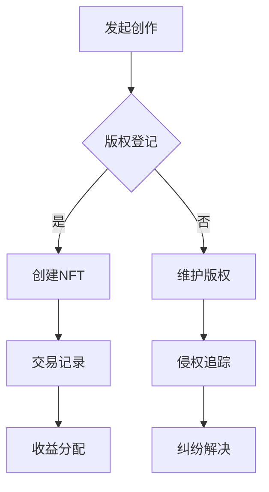

                 

### 文章标题

《区块链版权保护系统：知识产权的创新应用》

> **关键词**：区块链、版权保护、知识产权、创新应用
> 
> **摘要**：本文深入探讨了区块链技术在版权保护领域的应用，分析了其核心概念、算法原理、数学模型，并通过具体项目实践展示了其在实际场景中的效能，最后对未来的发展趋势和挑战进行了展望。

### 1. 背景介绍

知识产权（Intellectual Property，简称IP）是指人们创造的智力成果依法享有的专有权利。随着数字技术的迅猛发展，知识产权的重要性日益凸显。然而，现有的版权保护体系面临着诸多挑战，如版权信息不透明、侵权行为难以追踪、权利纠纷处理复杂等问题。这些问题不仅损害了原创者的权益，也影响了整个文化产业的健康发展。

区块链技术的兴起为解决这些问题提供了新的可能性。区块链是一种去中心化的分布式数据库技术，具有不可篡改、透明性、匿名性和安全性等特点。这些特性使得区块链在版权保护领域具有独特的优势，可以有效地解决现有版权保护体系中的痛点。

本文旨在探讨区块链版权保护系统的构建方法，通过分析核心概念、算法原理、数学模型和实际应用案例，展示区块链在知识产权保护领域的创新应用。

### 2. 核心概念与联系

#### 2.1 区块链技术简介

区块链技术是一种去中心化的分布式数据库技术，其基本原理是将数据分散存储在多个节点上，并通过密码学算法保证数据的安全性和不可篡改性。每个区块都包含了特定的时间戳、交易记录和其他区块的哈希值，形成了一个链条，因此称为“区块链”。


#### 2.2 智能合约

智能合约是一种运行在区块链上的计算机程序，它能够根据预设的条件自动执行。智能合约的出现使得区块链在版权保护等领域具有了更高的灵活性和效率。通过智能合约，版权信息可以在区块链上进行登记、交易和追踪，实现了版权保护的全过程自动化。


#### 2.3 非同质化代币（NFT）

非同质化代币（Non-Fungible Token，简称NFT）是一种基于区块链技术的数字资产，用于表示独特的、不可替代的物品。NFT的出现使得数字作品具有了真实的所有权凭证，为版权保护提供了新的手段。每个NFT都具有唯一的标识符，确保了数字作品的真实性和唯一性。


### 2.4 Mermaid 流程图

以下是区块链版权保护系统的一个简化的 Mermaid 流程图：



### 3. 核心算法原理 & 具体操作步骤

#### 3.1 哈希算法

哈希算法是将任意长度的输入数据转换成固定长度的字符串的算法。在区块链技术中，哈希算法用于确保数据的一致性和安全性。常见的哈希算法有SHA-256、SHA-3等。

#### 3.2 智能合约编写

智能合约的实现通常使用Solidity等编程语言。以下是一个简单的智能合约示例，用于版权登记和交易：

```solidity
pragma solidity ^0.8.0;

contract CopyrightProtection {
    mapping(address => bool) public isOwner;
    mapping(address => mapping(address => bool)) public isSeller;

    function registerCopyright(string memory _title, string memory _content) public {
        require(!isOwner[msg.sender], "版权已登记");
        isOwner[msg.sender] = true;
        emit CopyrightRegistered(_title, _content);
    }

    function sellCopyright(address _buyer) public {
        require(isOwner[msg.sender], "版权未登记");
        isSeller[msg.sender][_buyer] = true;
        emit CopyrightSold(msg.sender, _buyer);
    }

    function buyCopyright(address _seller) public payable {
        require(isSeller[_seller][msg.sender], "版权未出售");
        require(msg.value > 0, "请支付版权费");
        isSeller[_seller][msg.sender] = false;
        payable(_seller).transfer(msg.value);
        emit CopyrightBought(msg.sender, _seller);
    }
}
```

#### 3.3 非同质化代币创建

创建NFT通常需要使用专门的区块链平台，如Ethereum的ERC-721标准。以下是一个简单的ERC-721智能合约示例：

```solidity
pragma solidity ^0.8.0;

import "@openzeppelin/contracts/token/ERC721/ERC721.sol";

contract MyNFT is ERC721 {
    constructor() ERC721("MyNFT", "MNT") {}

    function mintNFT(address _to, uint256 _tokenId) public {
        require(!isNFTOwner(_tokenId), "NFT已存在");
        _mint(_to, _tokenId);
    }

    function isNFTOwner(uint256 _tokenId) public view returns (bool) {
        return ownerOf(_tokenId) != address(0);
    }
}
```

### 4. 数学模型和公式 & 详细讲解 & 举例说明

#### 4.1 数学模型

在区块链版权保护系统中，涉及到的数学模型主要包括哈希函数、加密算法和签名算法等。以下是一个简化的数学模型：

$$
H = Hash(_input)
$$

其中，$H$为哈希值，$_input$为输入数据。

#### 4.2 哈希算法

哈希算法是一种将任意长度的输入数据转换成固定长度的字符串的算法。常见的哈希算法有SHA-256、SHA-3等。以下是一个简单的SHA-256哈希算法示例：

```python
import hashlib

def sha256_hash(_input):
    hash_object = hashlib.sha256(_input.encode())
    hex_dig

