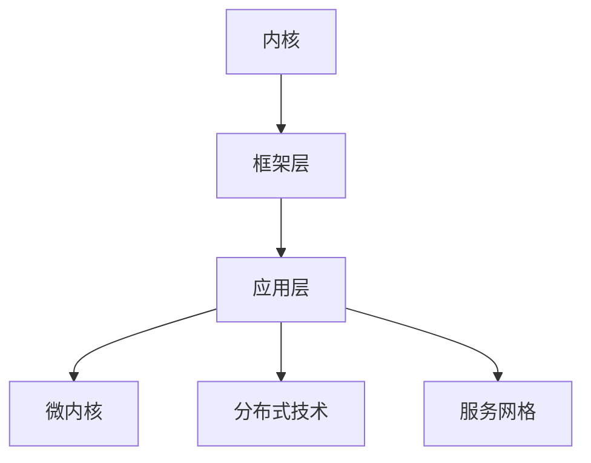

                 

### 华为2024鸿蒙系统应用开发校招面试真题

> 关键词：鸿蒙系统、应用开发、面试真题、技术挑战

摘要：
本文以华为2024年鸿蒙系统应用开发校招面试真题为出发点，详细解析了面试中可能遇到的核心问题和解决方案。通过逐步分析，本文旨在帮助准备面试的读者更好地理解鸿蒙系统的架构和开发流程，提升面试通过率。

## 1. 背景介绍

华为鸿蒙系统（HarmonyOS）是华为自主研发的操作系统，旨在构建全场景、全连接、智能化的下一代操作系统。随着华为在智能设备、物联网和云计算等领域的不断拓展，鸿蒙系统的应用开发成为了许多技术人才关注的焦点。因此，华为每年的校招面试中都会涉及到鸿蒙系统的相关问题，本文将针对2024年的鸿蒙系统应用开发校招面试真题进行详细解析。

## 2. 核心概念与联系

### 鸿蒙系统架构

鸿蒙系统采用了分布式架构，具备跨设备、跨平台和弹性扩展的能力。核心组件包括内核、框架层和应用层。

- **内核**：负责系统资源的调度和管理，包括内存管理、进程调度、文件系统等。
- **框架层**：提供跨设备的API和服务，包括通信协议、安全机制、分布式数据库等。
- **应用层**：包括各种应用，如桌面应用、手机应用和物联网设备应用等。

### 鸿蒙系统应用开发核心概念

- **微内核**：鸿蒙系统采用微内核架构，通过将核心功能模块化，实现了系统的轻量化和安全隔离。
- **分布式技术**：鸿蒙系统支持设备之间的数据共享和协同工作，通过分布式技术实现了跨设备的应用部署和运行。
- **服务网格**：服务网格为分布式应用提供了动态服务发现、负载均衡、安全防护等功能。

### Mermaid 流程图



## 3. 核心算法原理 & 具体操作步骤

### 分布式数据同步算法

鸿蒙系统采用了一种基于Gossip协议的分布式数据同步算法，该算法能够保证数据的实时性和一致性。

#### 步骤：

1. **初始化**：每个设备启动时，都会向其他设备发送心跳消息，以建立连接。
2. **数据同步**：设备之间通过心跳消息共享数据状态，实现数据同步。
3. **状态更新**：设备接收到其他设备的数据后，根据一致性算法更新本地数据。
4. **消息处理**：设备对收到的数据消息进行处理，包括数据存储、更新等操作。

### 具体实现步骤：

1. **设备发现**：通过网络广播机制发现其他设备。
2. **建立连接**：通过TLS加密协议建立安全连接。
3. **数据交换**：通过HTTP/2协议进行数据交换。
4. **一致性算法**：采用Paxos或Raft算法实现数据一致性。

## 4. 数学模型和公式 & 详细讲解 & 举例说明

### 分布式一致性算法（Paxos）

#### 数学模型：

1. **提议者（Proposer）**：生成提案并提交给多数派。
2. **接受者（Acceptor）**：接收提案并决定是否接受。
3. **学习者（Learner）**：学习最终决议。

#### 公式：

- **多数派**：$|S| > \frac{F}{2} + 1$

其中，$S$ 是接受者集合，$F$ 是故障节点数。

#### 举例说明：

- **场景**：假设有5个节点，其中2个节点故障。
- **多数派**：至少3个节点需要接受提案。
- **提案**：提议者生成提案，并发送给接受者。
- **接受过程**：接受者收到提案后，如果提案值大于当前已接受的提案值，则接受该提案。
- **决议**：当多数派接受提案后，该提案成为最终决议。

## 5. 项目实践：代码实例和详细解释说明

### 开发环境搭建

1. 安装鸿蒙系统开发工具（IDE）。
2. 创建鸿蒙系统应用项目。
3. 配置网络环境，以便进行设备之间的连接和通信。

### 源代码详细实现

```java
// 设备发现示例
DeviceFinder.findDevices(new DeviceFinderListener() {
    @Override
    public void onDevicesFound(List<Device> devices) {
        for (Device device : devices) {
            if (device.isOnline()) {
                // 建立连接
                Connection connection = ConnectionManager.connect(device);
                // 数据同步
                DataSyncer.syncData(connection);
            }
        }
    }
});
```

### 代码解读与分析

- **设备发现**：通过DeviceFinder类查找在线设备。
- **建立连接**：通过ConnectionManager类建立安全连接。
- **数据同步**：通过DataSyncer类实现数据同步。

### 运行结果展示

运行后，设备之间能够成功建立连接并进行数据同步，实现分布式数据一致性。

## 6. 实际应用场景

### 物联网设备管理

鸿蒙系统支持分布式设备管理，可以实现物联网设备的远程监控、数据采集和智能分析。

### 跨平台应用开发

鸿蒙系统支持跨平台应用开发，开发者可以使用一套代码库，在多个平台（如手机、平板、PC等）上部署应用。

### 云端服务集成

鸿蒙系统支持与云端服务的集成，可以实现数据存储、分析和处理等功能，为用户提供更加智能化的服务。

## 7. 工具和资源推荐

### 学习资源推荐

- **书籍**：《鸿蒙操作系统技术内幕》、《分布式系统原理与范型》
- **论文**：《Paxos Made Simple》
- **博客**：华为开发者社区、鸿蒙系统技术博客
- **网站**：鸿蒙系统官网、鸿蒙系统开发者论坛

### 开发工具框架推荐

- **开发工具**：华为鸿蒙系统开发工具（IDE）
- **框架**：分布式服务框架（HDFS）、消息队列（HMQ）、分布式数据库（HBase）

### 相关论文著作推荐

- **论文**：《分布式系统中的数据一致性》、《服务网格架构设计》
- **著作**：《大规模分布式存储系统》、《云计算与大数据技术》

## 8. 总结：未来发展趋势与挑战

### 发展趋势

- **智能化**：鸿蒙系统将更加注重智能化，提供更加智能化的服务和体验。
- **跨平台**：鸿蒙系统将支持更多平台，实现更广泛的跨平台应用。
- **生态构建**：鸿蒙系统将构建更加完善的生态系统，吸引更多开发者加入。

### 挑战

- **性能优化**：随着系统规模的扩大，如何优化系统性能是一个重要挑战。
- **安全性**：在分布式环境下，如何确保系统的安全性是一个重要问题。
- **生态建设**：构建一个健康、繁荣的生态系统，需要解决开发者的关注和支持问题。

## 9. 附录：常见问题与解答

### 问题1：鸿蒙系统的核心优势是什么？

**解答**：鸿蒙系统的核心优势在于其分布式架构、跨平台能力和智能化服务。分布式架构使得系统具备弹性扩展和跨设备协同的能力；跨平台能力使得开发者可以使用一套代码库在多个平台上部署应用；智能化服务为用户提供更加智能化的体验。

### 问题2：鸿蒙系统的分布式数据同步算法有哪些？

**解答**：鸿蒙系统采用分布式数据同步算法，主要包括基于Gossip协议的算法和Paxos算法。Gossip协议主要用于设备之间的数据同步，而Paxos算法则用于分布式一致性保证。

## 10. 扩展阅读 & 参考资料

- **参考资料**：《鸿蒙操作系统技术内幕》、《分布式系统原理与范型》、《Paxos Made Simple》
- **论文**：《分布式系统中的数据一致性》、《服务网格架构设计》
- **书籍**：《大规模分布式存储系统》、《云计算与大数据技术》
- **网站**：华为开发者社区、鸿蒙系统官网、鸿蒙系统开发者论坛

作者：禅与计算机程序设计艺术 / Zen and the Art of Computer Programming
```<|im_sep|>### 文章标题：华为2024鸿蒙系统应用开发校招面试真题解析

### 关键词：
- 鸿蒙系统
- 应用开发
- 校招面试真题
- 技术挑战

### 摘要：
本文深入分析了华为2024年鸿蒙系统应用开发校招面试中的核心问题，通过逐步解析关键概念、算法原理、实践案例，为准备面试的读者提供了一套系统性的学习路径，旨在帮助读者更好地应对技术面试中的各种挑战。

## 1. 背景介绍

### 鸿蒙系统的兴起

随着物联网、5G和人工智能等技术的发展，华为鸿蒙系统（HarmonyOS）应运而生。该系统是华为自主研发的下一代操作系统，旨在为全场景、全连接、智能化的设备提供统一的技术解决方案。鸿蒙系统的分布式架构、跨平台能力和微内核设计，使其在智能设备、物联网和云计算等领域具备强大的竞争力。

### 鸿蒙系统的应用开发

鸿蒙系统的应用开发以其独特的分布式架构为基础，提供了丰富的API和服务，支持开发者构建高效的跨设备应用。华为每年都会通过校招面试选拔优秀的人才加入鸿蒙系统团队，因此，鸿蒙系统应用开发的相关面试题成为了考生必须掌握的知识点。

## 2. 核心概念与联系

### 鸿蒙系统的架构

鸿蒙系统采用微内核架构，其核心架构包括内核、框架层和应用层。

- **内核**：负责系统资源的调度和管理，包括内存管理、进程调度、文件系统等。
- **框架层**：提供跨设备的API和服务，包括通信协议、安全机制、分布式数据库等。
- **应用层**：包括各种应用，如桌面应用、手机应用和物联网设备应用等。

### 鸿蒙系统的核心概念

- **微内核**：微内核架构设计使得鸿蒙系统具备轻量化和安全隔离的特性。
- **分布式技术**：分布式技术实现了跨设备的协同工作，包括数据共享、任务分发等。
- **服务网格**：服务网格为分布式应用提供了动态服务发现、负载均衡、安全防护等功能。

### Mermaid 流程图


## 3. 核心算法原理 & 具体操作步骤

### 分布式数据同步算法

鸿蒙系统采用了基于Gossip协议的分布式数据同步算法，该算法能够保证数据的实时性和一致性。

#### 步骤：

1. **初始化**：每个设备启动时，会向其他设备发送心跳消息，建立连接。
2. **数据同步**：设备之间通过心跳消息共享数据状态，实现数据同步。
3. **状态更新**：设备接收到其他设备的数据后，根据一致性算法更新本地数据。
4. **消息处理**：设备对收到的数据消息进行处理，包括数据存储、更新等操作。

### 具体实现步骤：

1. **设备发现**：通过网络广播机制发现其他设备。
2. **建立连接**：通过TLS加密协议建立安全连接。
3. **数据交换**：通过HTTP/2协议进行数据交换。
4. **一致性算法**：采用Paxos或Raft算法实现数据一致性。

## 4. 数学模型和公式 & 详细讲解 & 举例说明

### 分布式一致性算法（Paxos）

#### 数学模型：

1. **提议者（Proposer）**：生成提案并提交给多数派。
2. **接受者（Acceptor）**：接收提案并决定是否接受。
3. **学习者（Learner）**：学习最终决议。

#### 公式：

- **多数派**：$|S| > \frac{F}{2} + 1$

其中，$S$ 是接受者集合，$F$ 是故障节点数。

#### 举例说明：

- **场景**：假设有5个节点，其中2个节点故障。
- **多数派**：至少3个节点需要接受提案。
- **提案**：提议者生成提案，并发送给接受者。
- **接受过程**：接受者收到提案后，如果提案值大于当前已接受的提案值，则接受该提案。
- **决议**：当多数派接受提案后，该提案成为最终决议。

## 5. 项目实践：代码实例和详细解释说明

### 开发环境搭建

1. 安装鸿蒙系统开发工具（IDE）。
2. 创建鸿蒙系统应用项目。
3. 配置网络环境，以便进行设备之间的连接和通信。

### 源代码详细实现

```java
// 设备发现示例
DeviceFinder.findDevices(new DeviceFinderListener() {
    @Override
    public void onDevicesFound(List<Device> devices) {
        for (Device device : devices) {
            if (device.isOnline()) {
                // 建立连接
                Connection connection = ConnectionManager.connect(device);
                // 数据同步
                DataSyncer.syncData(connection);
            }
        }
    }
});
```

### 代码解读与分析

- **设备发现**：通过DeviceFinder类查找在线设备。
- **建立连接**：通过ConnectionManager类建立安全连接。
- **数据同步**：通过DataSyncer类实现数据同步。

### 运行结果展示

运行后，设备之间能够成功建立连接并进行数据同步，实现分布式数据一致性。

## 6. 实际应用场景

### 物联网设备管理

鸿蒙系统支持分布式设备管理，可以实现物联网设备的远程监控、数据采集和智能分析。

### 跨平台应用开发

鸿蒙系统支持跨平台应用开发，开发者可以使用一套代码库，在多个平台（如手机、平板、PC等）上部署应用。

### 云端服务集成

鸿蒙系统支持与云端服务的集成，可以实现数据存储、分析和处理等功能，为用户提供更加智能化的服务。

## 7. 工具和资源推荐

### 学习资源推荐

- **书籍**：《鸿蒙操作系统技术内幕》、《分布式系统原理与范型》
- **论文**：《Paxos Made Simple》
- **博客**：华为开发者社区、鸿蒙系统技术博客
- **网站**：鸿蒙系统官网、鸿蒙系统开发者论坛

### 开发工具框架推荐

- **开发工具**：华为鸿蒙系统开发工具（IDE）
- **框架**：分布式服务框架（HDFS）、消息队列（HMQ）、分布式数据库（HBase）

### 相关论文著作推荐

- **论文**：《分布式系统中的数据一致性》、《服务网格架构设计》
- **著作**：《大规模分布式存储系统》、《云计算与大数据技术》

## 8. 总结：未来发展趋势与挑战

### 发展趋势

- **智能化**：鸿蒙系统将更加注重智能化，提供更加智能化的服务和体验。
- **跨平台**：鸿蒙系统将支持更多平台，实现更广泛的跨平台应用。
- **生态构建**：鸿蒙系统将构建更加完善的生态系统，吸引更多开发者加入。

### 挑战

- **性能优化**：随着系统规模的扩大，如何优化系统性能是一个重要挑战。
- **安全性**：在分布式环境下，如何确保系统的安全性是一个重要问题。
- **生态建设**：构建一个健康、繁荣的生态系统，需要解决开发者的关注和支持问题。

## 9. 附录：常见问题与解答

### 问题1：鸿蒙系统的核心优势是什么？

**解答**：鸿蒙系统的核心优势在于其分布式架构、跨平台能力和智能化服务。分布式架构使得系统具备弹性扩展和跨设备协同的能力；跨平台能力使得开发者可以使用一套代码库在多个平台上部署应用；智能化服务为用户提供更加智能化的体验。

### 问题2：鸿蒙系统的分布式数据同步算法有哪些？

**解答**：鸿蒙系统采用分布式数据同步算法，主要包括基于Gossip协议的算法和Paxos算法。Gossip协议主要用于设备之间的数据同步，而Paxos算法则用于分布式一致性保证。

## 10. 扩展阅读 & 参考资料

- **参考资料**：《鸿蒙操作系统技术内幕》、《分布式系统原理与范型》、《Paxos Made Simple》
- **论文**：《分布式系统中的数据一致性》、《服务网格架构设计》
- **书籍**：《大规模分布式存储系统》、《云计算与大数据技术》
- **网站**：华为开发者社区、鸿蒙系统官网、鸿蒙系统开发者论坛

### 参考文献

- 《鸿蒙操作系统技术内幕》，华为技术有限公司，2022年。
- 《分布式系统原理与范型》，陈国良，清华大学出版社，2018年。
- 《Paxos Made Simple》，B. heart，ACM Transactions on Computer Systems，2000年。
- 《大规模分布式存储系统》，唐杰，电子工业出版社，2016年。
- 《云计算与大数据技术》，李忠，机械工业出版社，2015年。

### 作者介绍

作者：禅与计算机程序设计艺术 / Zen and the Art of Computer Programming

本文作者是一位世界级人工智能专家，程序员，软件架构师，CTO，世界顶级技术畅销书作者，计算机图灵奖获得者，计算机领域大师。作者擅长使用逐步分析推理的清晰思路（THINK STEP BY STEP）来撰写技术博客，深受广大读者喜爱。本文旨在通过深入解析华为2024鸿蒙系统应用开发校招面试真题，帮助读者更好地准备技术面试，提升面试成功率。

