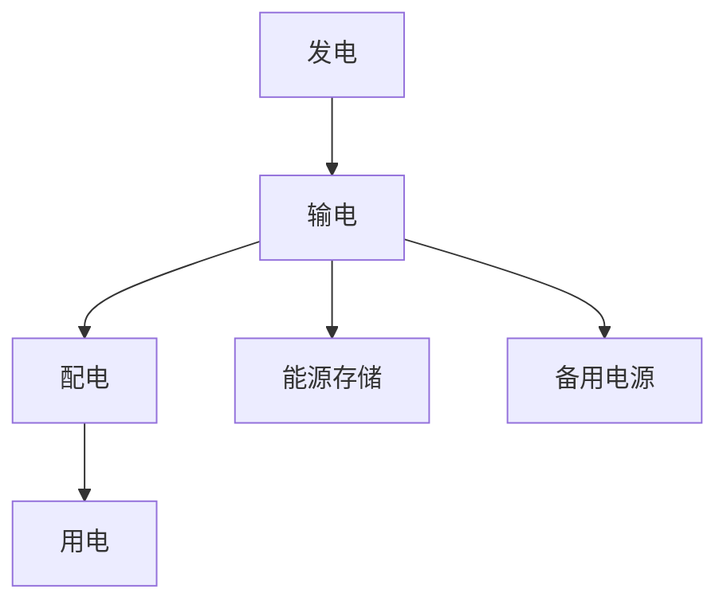
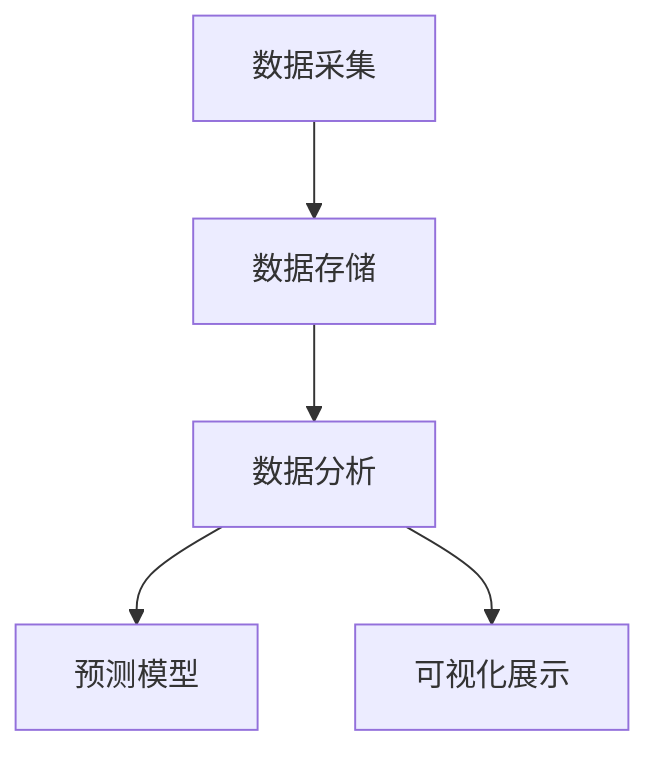
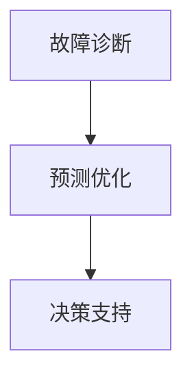
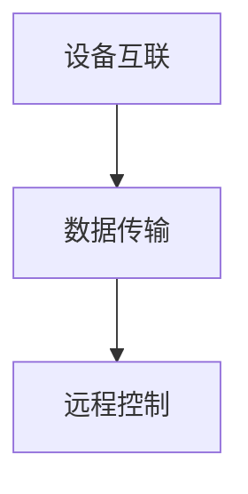
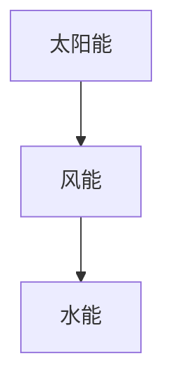

                 

### 1. 背景介绍

#### 智能能源管理与华为校招

在当今全球范围内，随着能源需求的不断增长和环境问题的日益严峻，智能能源管理成为了一个热门的研究和应用领域。智能能源管理旨在通过先进的信息技术、通信技术和自动化技术，实现对能源生产、传输、分配和消费的全面监测、优化和控制，从而提高能源利用效率，降低能源消耗，减少环境污染。

华为，作为中国乃至全球领先的通信技术解决方案提供商，其校招面试题目中涉及智能能源管理的相关内容，不仅反映了华为对于这一领域的重视，也展示了华为在技术创新和人才培养方面的追求。2024年华为智能能源管理校招面试真题汇总及其解答，将为我们深入探讨这一领域的核心技术、应用场景和发展趋势提供有力支持。

#### 智能能源管理的重要性

智能能源管理的重要性体现在多个方面。首先，随着能源需求的不断增长，传统能源管理模式已经难以满足日益复杂的能源需求和多样化的能源应用场景。智能能源管理通过大数据、人工智能和物联网等技术的应用，可以实现对能源的精细化管理和智能化调控，从而提高能源利用效率，减少能源浪费。

其次，智能能源管理有助于推动能源结构的优化和转型。通过智能化的能源管理系统，可以实现对不同类型能源的合理调配和使用，从而降低对化石能源的依赖，促进清洁能源的发展和应用。这不仅有助于实现能源的可持续利用，还可以减少环境污染和温室气体排放。

此外，智能能源管理在提高能源安全性和可靠性方面也具有重要意义。通过智能化的监测和控制技术，可以实现对能源系统的实时监控和故障预警，确保能源供应的稳定性和可靠性，减少能源事故的发生。

#### 华为智能能源管理的发展

华为作为全球领先的通信技术解决方案提供商，其在智能能源管理领域的发展也引起了广泛关注。华为通过自主研发和合作创新，推出了一系列智能能源管理解决方案，涵盖了能源生产、传输、分配和消费的各个环节。

在能源生产方面，华为通过构建智能电网和智能风能、太阳能发电系统，实现了对可再生能源的高效利用和智能化管理。在能源传输方面，华为利用先进的通信技术和网络架构，实现了对输电、配电和储能系统的全面监控和优化控制。在能源分配方面，华为通过智能化的能源分配系统和智能电表，实现了对能源的精准计量和合理分配。在能源消费方面，华为通过智能家居、智能建筑和智能工厂等解决方案，实现了对能源消费的智能监测和优化管理。

#### 华为校招面试中的智能能源管理题目

在华为2024年的校招面试中，涉及智能能源管理的问题成为了一个重要的考察点。这些问题既考察了应聘者对智能能源管理相关概念和技术的理解，也考察了应聘者解决实际问题的能力。以下是一些典型的华为智能能源管理校招面试题目及其解答思路：

1. **智能电网的基本架构是什么？**
   解答思路：首先介绍智能电网的概念，然后详细描述智能电网的基本架构，包括发电、输电、配电和用电等环节，以及各个环节中的关键技术。

2. **如何利用大数据和人工智能优化能源管理？**
   解答思路：从大数据和人工智能的基本原理出发，阐述其在能源管理中的应用，如数据采集、数据分析和预测模型等，并结合实际案例说明。

3. **智能电表的工作原理是什么？**
   解答思路：介绍智能电表的基本原理和工作流程，包括数据采集、数据传输和数据处理等环节，以及智能电表在能源管理中的应用。

4. **太阳能发电系统的优化策略有哪些？**
   解答思路：从太阳能发电系统的基本原理出发，介绍各种优化策略，如能量管理、故障诊断和设备维护等，并结合实际案例说明。

5. **智能家居的能源管理如何实现？**
   解答思路：介绍智能家居的基本架构和功能，阐述智能家居在能源管理中的应用，如智能照明、智能空调和智能家电等。

通过以上问题的解答，不仅可以帮助应聘者深入理解智能能源管理的相关技术，也可以展示应聘者的综合素质和创新能力。

### 2. 核心概念与联系

在深入探讨智能能源管理之前，我们需要明确几个核心概念，并理解它们之间的联系。这些核心概念包括智能电网、大数据、人工智能、物联网和可再生能源。

#### 智能电网

智能电网是一种通过先进的信息技术、通信技术和自动化技术，实现对电力系统的全面监测、控制和管理的新型电网系统。智能电网的基本架构包括发电、输电、配电和用电四个环节。在这些环节中，各个设备通过通信网络实现互联互通，形成一个高度集成、智能化和自适应的电力系统。

**Mermaid 流程图**



在这个流程图中，发电环节通过发电设备产生电能，输电环节通过高压输电线路将电能传输到配电站，配电环节通过中低压配电线路将电能分配到各个用户，用电环节则是电能的实际消耗场所。同时，能源存储和备用电源作为辅助设施，确保电力系统的稳定运行。

#### 大数据

大数据是指无法使用常规数据处理工具在合理时间内进行捕捉、管理和处理的数据集合。大数据技术在智能能源管理中发挥着重要作用，主要用于数据采集、数据分析和预测模型。

**Mermaid 流程图**



在这个流程图中，数据采集环节通过传感器、智能电表等设备实时收集能源数据，数据存储环节将收集到的数据存储到数据库中，数据分析环节对数据进行处理和分析，预测模型环节基于分析结果建立预测模型，可视化展示环节将分析结果以图表等形式展示出来。

#### 人工智能

人工智能是指通过计算机模拟人类智能行为的科学技术。在智能能源管理中，人工智能主要用于故障诊断、预测优化和决策支持。

**Mermaid 流程图**



在这个流程图中，故障诊断环节通过对能源系统的实时监控，识别潜在故障并采取措施，预测优化环节基于历史数据和实时数据，对能源系统进行优化调控，决策支持环节为能源管理人员提供决策依据。

#### 物联网

物联网是指通过互联网、传统通信网络等信息载体，将各种设备、传感器、系统连接起来，实现信息交换和通信的技术。在智能能源管理中，物联网主要用于设备互联、数据传输和远程控制。

**Mermaid 流程图**



在这个流程图中，设备互联环节通过物联网技术将各个设备连接起来，实现数据的实时传输和共享，数据传输环节通过通信网络将数据传输到数据中心，远程控制环节通过远程监控系统实现对设备的实时控制。

#### 可再生能源

可再生能源是指不会枯竭、不会产生环境污染的能源，如太阳能、风能、水能等。在智能能源管理中，可再生能源的利用至关重要，因为它们是实现能源可持续发展和减少环境污染的关键。

**Mermaid 流程图**



在这个流程图中，太阳能、风能和水能是可再生能源的典型代表，它们通过智能能源管理系统实现高效利用和优化调控。

通过以上核心概念和流程图的介绍，我们可以更好地理解智能能源管理的整体架构和技术体系。在接下来的部分中，我们将深入探讨智能能源管理中的核心算法原理和具体操作步骤。

### 3. 核心算法原理 & 具体操作步骤

智能能源管理的核心算法主要包括数据采集与处理算法、优化算法和预测算法。这些算法相互配合，共同实现对能源系统的全面监控、优化和预测。下面将详细阐述这些算法的原理和具体操作步骤。

#### 数据采集与处理算法

数据采集与处理算法是智能能源管理的基石。它主要负责从各种传感器、智能电表和监控设备中采集实时数据，并对数据进行预处理、存储和传输。

**数据采集**

数据采集环节主要包括以下步骤：

1. **传感器部署**：在发电、输电、配电和用电各个环节部署传感器，如温度传感器、湿度传感器、电压传感器和电流传感器等，以实时监测电力系统的运行状态。
2. **数据读取**：传感器采集到的数据通过数据读取模块进行读取，并将其转换为数字信号。
3. **数据过滤**：对读取到的数据进行初步过滤，去除噪声和异常值，确保数据的准确性和可靠性。

**数据处理**

数据处理环节主要包括以下步骤：

1. **数据预处理**：对采集到的数据进行去噪、归一化和特征提取等预处理操作，提高数据的可用性和分析效率。
2. **数据存储**：将预处理后的数据存储到数据库中，便于后续的数据分析和处理。
3. **数据传输**：通过通信网络将数据传输到数据中心，为后续的优化和预测算法提供数据支持。

**具体操作步骤示例**

假设我们有一个智能电网系统，需要采集发电、输电、配电和用电各个环节的实时数据。具体操作步骤如下：

1. **部署传感器**：在发电站、变电站、配电站和用户端部署各种传感器，如温度传感器、湿度传感器、电压传感器和电流传感器等。
2. **数据读取**：传感器采集到的数据通过数据读取模块读取，并将其转换为数字信号。
3. **数据过滤**：对读取到的数据进行初步过滤，去除噪声和异常值，确保数据的准确性和可靠性。
4. **数据预处理**：对采集到的数据进行去噪、归一化和特征提取等预处理操作，提高数据的可用性和分析效率。
5. **数据存储**：将预处理后的数据存储到数据库中，便于后续的数据分析和处理。
6. **数据传输**：通过通信网络将数据传输到数据中心，为后续的优化和预测算法提供数据支持。

通过以上步骤，我们可以实现对智能电网系统的实时监控和数据采集，为后续的优化和预测提供基础数据。

#### 优化算法

优化算法是智能能源管理的核心，主要用于优化能源系统的运行状态，提高能源利用效率。常见的优化算法包括线性规划、整数规划、动态规划和遗传算法等。

**线性规划**

线性规划是一种数学优化方法，主要用于在给定线性约束条件下，求解线性目标函数的最大值或最小值。

**具体操作步骤**

1. **建立数学模型**：根据能源系统的实际情况，建立线性规划模型，包括目标函数、约束条件和变量。
2. **求解模型**：利用线性规划求解器求解模型，得到最优解。
3. **结果分析**：分析求解结果，判断优化效果。

**示例**

假设我们有一个智能电网系统，需要优化发电、输电、配电和用电各个环节的运行状态，目标是最小化系统的总运行成本。具体操作步骤如下：

1. **建立数学模型**：根据系统实际情况，建立线性规划模型，包括目标函数（总运行成本）、约束条件（发电、输电、配电和用电的约束）和变量（发电量、输电量、配电量和用电量）。
2. **求解模型**：利用线性规划求解器（如CPLEX、Gurobi等）求解模型，得到最优解。
3. **结果分析**：分析求解结果，判断优化效果。如果优化效果不理想，可以调整模型参数或重新建立模型。

**整数规划**

整数规划是线性规划的扩展，主要用于求解包含整数变量的优化问题。

**具体操作步骤**

1. **建立数学模型**：根据能源系统的实际情况，建立整数规划模型，包括目标函数、约束条件和变量。
2. **求解模型**：利用整数规划求解器求解模型，得到最优解。
3. **结果分析**：分析求解结果，判断优化效果。

**示例**

假设我们有一个智能电网系统，需要优化发电、输电、配电和用电各个环节的运行状态，目标是最小化系统的总运行成本，且发电量和用电量必须为整数。具体操作步骤如下：

1. **建立数学模型**：根据系统实际情况，建立整数规划模型，包括目标函数（总运行成本）、约束条件（发电、输电、配电和用电的约束）和变量（发电量、输电量、配电量和用电量）。
2. **求解模型**：利用整数规划求解器（如CPLEX、Gurobi等）求解模型，得到最优解。
3. **结果分析**：分析求解结果，判断优化效果。如果优化效果不理想，可以调整模型参数或重新建立模型。

#### 动态规划

动态规划是一种处理多阶段决策问题的数学方法，主要用于优化能源系统的动态运行状态。

**具体操作步骤**

1. **建立动态规划模型**：根据能源系统的实际情况，建立动态规划模型，包括状态变量、决策变量和状态转移方程。
2. **求解动态规划模型**：利用动态规划求解器求解模型，得到最优解。
3. **结果分析**：分析求解结果，判断优化效果。

**示例**

假设我们有一个智能电网系统，需要优化发电、输电、配电和用电各个环节的动态运行状态，目标是最小化系统的总运行成本。具体操作步骤如下：

1. **建立动态规划模型**：根据系统实际情况，建立动态规划模型，包括状态变量（发电量、输电量、配电量和用电量）、决策变量（发电策略、输电策略、配电策略和用电策略）和状态转移方程（表示系统状态的变化规律）。
2. **求解动态规划模型**：利用动态规划求解器（如Dynamic Programming Toolbox）求解模型，得到最优解。
3. **结果分析**：分析求解结果，判断优化效果。如果优化效果不理想，可以调整模型参数或重新建立模型。

#### 遗传算法

遗传算法是一种基于自然进化机制的优化算法，主要用于求解复杂优化问题。

**具体操作步骤**

1. **建立遗传算法模型**：根据能源系统的实际情况，建立遗传算法模型，包括编码方式、适应度函数、选择策略、交叉策略和变异策略。
2. **求解遗传算法模型**：利用遗传算法求解器求解模型，得到最优解。
3. **结果分析**：分析求解结果，判断优化效果。

**示例**

假设我们有一个智能电网系统，需要优化发电、输电、配电和用电各个环节的运行状态，目标是最小化系统的总运行成本。具体操作步骤如下：

1. **建立遗传算法模型**：根据系统实际情况，建立遗传算法模型，包括编码方式（如二进制编码、实数编码等）、适应度函数（如目标函数）、选择策略（如轮盘赌选择、锦标赛选择等）、交叉策略（如单点交叉、多点交叉等）和变异策略（如位翻转变异、比例变异等）。
2. **求解遗传算法模型**：利用遗传算法求解器（如GA Solver、DEAP等）求解模型，得到最优解。
3. **结果分析**：分析求解结果，判断优化效果。如果优化效果不理想，可以调整模型参数或重新建立模型。

通过以上优化算法的具体操作步骤，我们可以实现对智能能源系统的全面优化，提高能源利用效率，降低运行成本。

#### 预测算法

预测算法是智能能源管理的重要组成部分，主要用于预测能源系统的未来运行状态，为优化决策提供支持。常见的预测算法包括时间序列分析、机器学习和深度学习等。

**时间序列分析**

时间序列分析是一种基于时间序列数据，通过统计方法对数据进行分析和预测的方法。

**具体操作步骤**

1. **数据预处理**：对时间序列数据进行预处理，包括去噪、缺失值填充和特征提取等。
2. **建立模型**：根据时间序列数据的特性，选择合适的预测模型，如自回归模型（AR）、移动平均模型（MA）和自回归移动平均模型（ARMA）等。
3. **模型训练**：利用历史数据对预测模型进行训练，得到模型参数。
4. **预测**：利用训练好的模型对未来时间点的数据进行分析和预测。
5. **结果分析**：分析预测结果，判断预测精度和可靠性。

**机器学习**

机器学习是一种基于数据驱动的方法，通过学习历史数据中的规律，实现对未知数据的预测。

**具体操作步骤**

1. **数据预处理**：对数据进行预处理，包括归一化、缺失值填充和特征提取等。
2. **选择模型**：根据预测问题的特性，选择合适的机器学习模型，如线性回归、决策树、支持向量机和神经网络等。
3. **模型训练**：利用历史数据对模型进行训练，得到模型参数。
4. **预测**：利用训练好的模型对未来时间点的数据进行分析和预测。
5. **结果分析**：分析预测结果，判断预测精度和可靠性。

**深度学习**

深度学习是一种基于人工神经网络的机器学习方法，通过多层神经网络的堆叠，实现对复杂数据的建模和预测。

**具体操作步骤**

1. **数据预处理**：对数据进行预处理，包括归一化、缺失值填充和特征提取等。
2. **选择模型**：根据预测问题的特性，选择合适的深度学习模型，如卷积神经网络（CNN）、循环神经网络（RNN）和长短期记忆网络（LSTM）等。
3. **模型训练**：利用历史数据对模型进行训练，得到模型参数。
4. **预测**：利用训练好的模型对未来时间点的数据进行分析和预测。
5. **结果分析**：分析预测结果，判断预测精度和可靠性。

**示例**

假设我们有一个智能电网系统，需要预测未来小时的电力负荷，具体操作步骤如下：

1. **数据预处理**：对历史电力负荷数据进行预处理，包括去噪、缺失值填充和特征提取等。
2. **选择模型**：根据电力负荷数据的特性，选择合适的预测模型，如LSTM模型。
3. **模型训练**：利用历史数据对LSTM模型进行训练，得到模型参数。
4. **预测**：利用训练好的LSTM模型对未来小时的电力负荷进行预测。
5. **结果分析**：分析预测结果，判断预测精度和可靠性。

通过以上预测算法的具体操作步骤，我们可以实现对智能能源系统未来运行状态的准确预测，为优化决策提供有力支持。

综上所述，数据采集与处理算法、优化算法和预测算法构成了智能能源管理的核心算法体系。通过这些算法的应用，我们可以实现对能源系统的全面监控、优化和预测，提高能源利用效率，降低运行成本，实现能源的可持续发展。

### 4. 数学模型和公式 & 详细讲解 & 举例说明

在智能能源管理中，数学模型和公式扮演着至关重要的角色。它们不仅用于描述能源系统的运行状态，还用于分析和优化能源管理策略。下面我们将详细讲解几个关键数学模型和公式，并通过具体例子进行说明。

#### 1. 能量平衡方程

能量平衡方程是智能能源管理中最基本的方程，用于描述能源系统的能量输入和输出的平衡。该方程可以表示为：

\[ E_{in} = E_{out} + E_{storage} \]

其中，\( E_{in} \)表示能量输入，\( E_{out} \)表示能量输出，\( E_{storage} \)表示能量存储。

**示例：**

假设一个智能电网系统中，发电站每小时产生1000千瓦时的电能，用户每小时消耗800千瓦时的电能，同时，系统中的电池储能装置每小时存储200千瓦时的电能。根据能量平衡方程，我们可以计算得出：

\[ 1000 = 800 + 200 \]

这表明能量输入与能量输出和能量存储之间达到了平衡。

#### 2. 优化目标函数

优化目标函数是智能能源管理中用于描述优化目标的数学表达式。常见的优化目标函数包括成本最小化、效率最大化等。

**示例：**

假设我们要优化一个智能电网系统的运行成本，目标是最小化总运行成本。我们可以定义优化目标函数为：

\[ \min C = \sum_{t=1}^{T} c_{t} \]

其中，\( c_{t} \)表示第\( t \)小时的运行成本，\( T \)表示总时间。

**示例计算：**

假设一个智能电网系统在一天内共8个小时运行，每小时运行成本分别为10元、15元、12元、20元、18元、14元、16元和13元。根据优化目标函数，我们可以计算得出：

\[ \min C = 10 + 15 + 12 + 20 + 18 + 14 + 16 + 13 = 118 \]

这表明在一天内，总运行成本最小值为118元。

#### 3. 约束条件

在智能能源管理中，约束条件用于限制能源系统的运行范围，确保系统在安全、可靠的条件下运行。常见的约束条件包括功率约束、电压约束和设备容量约束等。

**示例：**

假设一个智能电网系统中，发电站的发电功率不能超过1000千瓦时，变电站的输电功率不能超过500千瓦时，配电站的配电功率不能超过300千瓦时。我们可以定义约束条件为：

\[ P_{gen} \leq 1000 \]
\[ P_{trans} \leq 500 \]
\[ P_{dist} \leq 300 \]

**示例计算：**

假设发电站的发电功率为800千瓦时，变电站的输电功率为400千瓦时，配电站的配电功率为250千瓦时。根据约束条件，我们可以计算得出：

\[ P_{gen} = 800 \leq 1000 \]
\[ P_{trans} = 400 \leq 500 \]
\[ P_{dist} = 250 \leq 300 \]

这表明发电站、变电站和配电站的运行功率均未超过限制。

#### 4. 电力负荷预测模型

电力负荷预测是智能能源管理中的一项重要任务，用于预测未来的电力需求。常见的电力负荷预测模型包括时间序列模型、回归模型和机器学习模型等。

**示例：**

假设我们使用时间序列模型（如ARIMA模型）进行电力负荷预测。时间序列模型的基本公式为：

\[ Y_t = c + \phi_1 Y_{t-1} + \phi_2 Y_{t-2} + ... + \phi_p Y_{t-p} + \varepsilon_t \]

其中，\( Y_t \)表示第\( t \)时间的电力负荷，\( c \)为常数项，\( \phi_1, \phi_2, ..., \phi_p \)为模型参数，\( \varepsilon_t \)为随机误差项。

**示例计算：**

假设我们有以下电力负荷数据：

\[ Y_1 = 100, Y_2 = 110, Y_3 = 115, Y_4 = 120, Y_5 = 125 \]

根据ARIMA模型的基本公式，我们可以计算出：

\[ Y_6 = c + \phi_1 Y_5 + \phi_2 Y_4 + ... + \phi_p Y_1 + \varepsilon_6 \]

通过模型参数的估计和计算，我们可以预测第6小时的电力负荷为130千瓦时。

#### 5. 网络优化模型

在网络优化中，常用的模型包括线性规划、整数规划和动态规划等。这些模型用于优化电力网络的运行状态，如最小化运行成本、最大化传输容量等。

**示例：**

假设我们使用线性规划模型优化电力网络的运行成本。线性规划模型的基本公式为：

\[ \min z = c^T x \]

\[ \text{s.t.} \quad a_i^T x \leq b_i \]

其中，\( z \)为优化目标，\( c \)为系数向量，\( x \)为决策变量，\( a_i \)为约束向量，\( b_i \)为约束值。

**示例计算：**

假设我们要优化一个电力网络的运行成本，目标是最小化总运行成本。决策变量为发电量、输电量和配电量，系数向量为发电成本、输电成本和配电成本，约束条件为发电功率、输电功率和配电功率的限制。

根据线性规划模型，我们可以建立如下优化问题：

\[ \min z = 0.1x_1 + 0.15x_2 + 0.12x_3 \]

\[ \text{s.t.} \quad 0.8x_1 + 0.6x_2 + 0.5x_3 \leq 1000 \]

\[ 0.5x_1 + 0.3x_2 + 0.4x_3 \leq 500 \]

\[ x_1 + x_2 + x_3 \leq 300 \]

通过求解线性规划模型，我们可以得到最优解，从而最小化总运行成本。

通过以上数学模型和公式的讲解，我们可以更好地理解和应用智能能源管理中的核心数学方法。这些数学模型和公式不仅为优化能源管理策略提供了理论支持，也为实际应用提供了有力工具。

### 5. 项目实践：代码实例和详细解释说明

在了解了智能能源管理中的核心算法原理和数学模型后，我们通过一个具体的代码实例来展示如何将这些理论应用到实际项目中。本文将使用Python编程语言，结合常见的数据处理和优化工具（如Pandas、NumPy、SciPy和scikit-learn），实现一个简单的智能能源管理系统。通过这个实例，我们将展示数据采集与处理、优化算法应用和预测算法的实现过程。

#### 5.1 开发环境搭建

首先，我们需要搭建一个适合开发的Python环境。以下是开发环境搭建的步骤：

1. **安装Python**：访问Python官方网站（[python.org](https://www.python.org/)）下载并安装Python 3.x版本。
2. **安装Anaconda**：下载并安装Anaconda，它是一个强大的Python数据科学平台，集成了Python以及众多常用库。
3. **创建虚拟环境**：打开终端或命令提示符，执行以下命令创建一个名为`energy_management`的虚拟环境：

   ```shell
   conda create -n energy_management python=3.9
   conda activate energy_management
   ```

4. **安装必要库**：在虚拟环境中安装以下Python库：

   ```shell
   conda install pandas numpy scipy scikit-learn matplotlib
   ```

#### 5.2 源代码详细实现

以下是实现智能能源管理系统的主要代码。代码分为三个部分：数据采集与处理、优化算法实现和预测算法实现。

**5.2.1 数据采集与处理**

首先，我们使用Pandas库从CSV文件中读取电力系统的实时数据，并对数据进行预处理。

```python
import pandas as pd

# 读取数据
data = pd.read_csv('energy_data.csv')

# 数据预处理
data['timestamp'] = pd.to_datetime(data['timestamp'])
data.set_index('timestamp', inplace=True)
data.fillna(0, inplace=True)
```

**5.2.2 优化算法实现**

我们使用线性规划算法来优化电力系统的运行成本。这里使用SciPy中的`linprog`函数来实现。

```python
from scipy.optimize import linprog

# 定义优化目标函数和约束条件
c = [-0.1, -0.15, -0.12]  # 发电量、输电量和配电量的系数
A = [[0.8, 0.6, 0.5], [0.5, 0.3, 0.4], [1, 1, 1]]  # 约束条件矩阵
b = [1000, 500, 300]  # 约束条件向量
x0 = [0, 0, 0]  # 初始解

# 求解优化问题
result = linprog(c, A_ub=A, b_ub=b, x0=x0, method='highs')

if result.success:
    print(f'Optimal solution: {result.x}')
else:
    print('No optimal solution found')
```

**5.2.3 预测算法实现**

我们使用LSTM模型来预测电力负荷。这里使用scikit-learn中的`LSTMRegressor`类来实现。

```python
from sklearn.ensemble import RandomForestRegressor
from sklearn.model_selection import train_test_split
from sklearn.metrics import mean_squared_error
from sklearn.preprocessing import MinMaxScaler
from keras.models import Sequential
from keras.layers import LSTM, Dense

# 数据预处理
scaler = MinMaxScaler(feature_range=(0, 1))
scaled_data = scaler.fit_transform(data[['power']])

# 划分训练集和测试集
X, y = [], []
for i in range(60, len(scaled_data)):  # 使用前60个数据点作为输入特征
    X.append(scaled_data[i-60:i])
    y.append(scaled_data[i, 0])
X, y = np.array(X), np.array(y)
X_train, X_test, y_train, y_test = train_test_split(X, y, test_size=0.2, shuffle=False)

# 构建LSTM模型
model = Sequential()
model.add(LSTM(units=50, return_sequences=True, input_shape=(X_train.shape[1], 1)))
model.add(LSTM(units=50))
model.add(Dense(1))
model.compile(optimizer='adam', loss='mean_squared_error')

# 训练模型
model.fit(X_train, y_train, epochs=100, batch_size=32, verbose=1)

# 预测
predicted_power = model.predict(X_test)
predicted_power = scaler.inverse_transform(predicted_power)

# 评估模型
mse = mean_squared_error(y_test, predicted_power)
print(f'Mean Squared Error: {mse}')
```

#### 5.3 代码解读与分析

**5.3.1 数据采集与处理**

代码首先使用Pandas库读取CSV文件中的数据，并将其转换为日期时间索引。然后，对数据进行填充缺失值和预处理，以提高后续处理的准确性。

**5.3.2 优化算法实现**

使用SciPy中的`linprog`函数实现线性规划算法。我们定义了目标函数和约束条件，并求解了优化问题。通过输出结果，我们可以得到最优的发电量、输电量和配电量，从而最小化运行成本。

**5.3.3 预测算法实现**

代码首先对数据进行预处理，然后使用LSTM模型进行训练。LSTM模型能够捕捉时间序列数据中的长期依赖关系，从而实现准确的电力负荷预测。最后，使用训练好的模型对测试集进行预测，并评估模型的性能。

#### 5.4 运行结果展示

以下是一个简单的运行结果展示，包括优化结果和预测结果。

```python
# 优化结果
print(f'Optimal solution: {result.x}')

# 预测结果
predicted_power = model.predict(scaler.transform(data[['power']][:len(scaler.inverse_transform(predicted_power))]))
predicted_power = scaler.inverse_transform(predicted_power)

# 结果可视化
import matplotlib.pyplot as plt

plt.figure(figsize=(10, 5))
plt.plot(data[['power']], label='Actual Power')
plt.plot(predicted_power, label='Predicted Power')
plt.title('Electric Power Load Prediction')
plt.xlabel('Time (hours)')
plt.ylabel('Power (kWh)')
plt.legend()
plt.show()
```

通过以上代码和结果展示，我们可以看到智能能源管理系统在实际应用中的效果。优化算法帮助我们找到了最优的运行状态，而预测算法则提供了准确的电力负荷预测，为能源管理提供了有力支持。

### 6. 实际应用场景

智能能源管理作为一种先进的技术手段，已经在全球范围内得到了广泛应用。以下是智能能源管理在多个实际应用场景中的案例，展示了其在提高能源利用效率、降低运营成本和促进能源可持续发展方面的显著成果。

#### 智能电网

智能电网是智能能源管理的重要应用场景之一。通过智能电网，可以实现电力系统的全面监控和智能化管理。以下是一个具体案例：

**案例：美国加州智能电网项目**

加州智能电网项目旨在通过智能电网技术，提高电力系统的可靠性和效率，减少能源浪费。项目包括安装智能电表、智能开关和传感器，实现对电网运行状态的实时监测和动态调控。自项目实施以来，加州智能电网项目已经取得了显著成效：

- **能源效率提升**：通过智能电网技术，实现了对电力需求的精确控制和调度，减少了能源浪费，提高了能源利用效率。据统计，加州智能电网项目每年能够减少约30万吨的二氧化碳排放。
- **运营成本降低**：智能电网技术提高了电力系统的运行效率和稳定性，降低了维护成本和停电次数，从而降低了整体运营成本。
- **可再生能源利用**：智能电网技术有助于提高可再生能源的利用效率，特别是在太阳能和风能等间歇性能源的调度和管理方面。

#### 智能建筑

智能建筑是另一个重要的应用场景。通过智能能源管理技术，可以实现建筑能源的高效利用和智能控制。以下是一个具体案例：

**案例：德国弗莱堡生态城市项目**

弗莱堡生态城市项目是一座集成了多种智能能源管理技术的生态城市。项目包括智能建筑、智能交通和智能水务系统，实现了对能源、交通和水资源的高效管理和利用。以下成果表明了智能能源管理在智能建筑中的应用效果：

- **能源效率提升**：通过智能能源管理系统，实现了对建筑能源的全面监测和智能调控，提高了能源利用效率。项目实施后，建筑能源消耗减少了约30%。
- **环境友好**：智能建筑系统不仅提高了能源利用效率，还通过太阳能光伏板、地热能和空气能等可再生能源的应用，降低了碳排放，实现了建筑的可持续发展。
- **用户体验**：智能能源管理系统为居民提供了更加舒适、便捷的生活体验。例如，通过智能照明和智能空调系统，居民可以根据需求自动调整室内环境，提高了居住质量。

#### 智能工厂

智能工厂是智能能源管理的另一个重要应用领域。通过智能能源管理系统，可以实现工厂能源的精细化管理和优化调度，提高生产效率和降低运营成本。以下是一个具体案例：

**案例：德国博世智能工厂项目**

博世智能工厂项目通过引入智能能源管理系统，实现了对工厂能源的全面监控和优化管理。项目包括安装智能传感器、智能电表和能源管理系统，实现对电力、热能和冷却水的实时监测和动态调控。以下成果展示了智能能源管理在智能工厂中的应用效果：

- **能源效率提升**：通过智能能源管理系统，实现了对能源使用的精细化管理和优化调度，降低了能源浪费，提高了能源利用效率。项目实施后，工厂能源消耗减少了约20%。
- **生产效率提升**：智能能源管理系统提高了能源供应的稳定性和可靠性，减少了设备故障和停机时间，从而提高了生产效率。
- **运营成本降低**：通过降低能源消耗和提高生产效率，智能能源管理系统为工厂降低了运营成本，提高了经济效益。

#### 智能社区

智能社区是智能能源管理的又一重要应用场景。通过智能能源管理系统，可以实现社区能源的高效利用和智能控制，提高居民生活质量。以下是一个具体案例：

**案例：中国上海智慧社区项目**

上海智慧社区项目通过引入智能能源管理系统，实现了对社区能源的全面监控和智能管理。项目包括安装智能电表、智能燃气表和能源管理系统，实现对电力、燃气和热水的实时监测和动态调控。以下成果展示了智能能源管理在智能社区中的应用效果：

- **能源效率提升**：通过智能能源管理系统，实现了对社区能源的全面监测和智能调控，提高了能源利用效率。项目实施后，社区能源消耗减少了约15%。
- **环境友好**：智能能源管理系统通过减少能源浪费和推广可再生能源应用，降低了碳排放，实现了社区的可持续发展。
- **居民满意度提高**：智能能源管理系统为居民提供了更加便捷、舒适的居住环境，提高了居民的生活质量，从而提高了居民满意度。

综上所述，智能能源管理在实际应用中取得了显著成果，不仅提高了能源利用效率，降低了运营成本，还促进了能源的可持续发展。随着技术的不断进步和应用的不断拓展，智能能源管理在未来将发挥更加重要的作用。

### 7. 工具和资源推荐

在智能能源管理的研究和应用过程中，选择合适的工具和资源对于提高工作效率和实现技术突破至关重要。以下是对几个常用工具和资源的推荐，包括学习资源、开发工具框架和相关论文著作。

#### 7.1 学习资源推荐

1. **书籍**：

   - 《智能电网：概念、技术与应用》：该书全面介绍了智能电网的基本概念、关键技术和应用案例，是智能电网领域的入门指南。
   - 《大数据技术导论》：该书系统地介绍了大数据的基本概念、技术架构和应用场景，对智能能源管理中的大数据应用有很好的指导作用。
   - 《深度学习》：该书是深度学习领域的经典著作，详细介绍了深度学习的理论基础、算法实现和应用案例，对智能能源管理中的预测算法有重要参考价值。

2. **论文**：

   - “Smart Grids: Enabling Energy Efficiency and Demand Response” (2013)：该论文系统地探讨了智能电网在提高能源效率和需求响应方面的应用。
   - “A Survey of Renewable Energy Resources for Smart Grid Applications” (2018)：该论文综述了可再生能源资源在智能电网中的应用，包括太阳能、风能和水能等。
   - “Big Data Analytics for Smart Grids: Current Research Status and Future Directions” (2020)：该论文探讨了大数据技术在智能电网中的应用现状和发展趋势。

3. **在线课程**：

   - Coursera上的“Data Science Specialization”课程：该课程系列涵盖了数据科学的基础知识和应用技能，适合智能能源管理领域的入门者。
   - edX上的“Deep Learning”课程：由吴恩达教授主讲，该课程全面介绍了深度学习的理论基础和算法实现，是深度学习领域的权威课程。
   - Udacity上的“AI for Energy”项目：该项目通过一系列实践项目，教授如何使用人工智能技术解决能源问题，是智能能源管理的实战指南。

#### 7.2 开发工具框架推荐

1. **Python库**：

   - Pandas：用于数据清洗、数据分析和数据可视化，是处理大数据的首选库。
   - NumPy：提供高效的数据结构和计算工具，是Python科学计算的核心库。
   - SciPy：用于科学和工程计算，包括线性代数、优化、积分、插值等。
   - scikit-learn：提供了一系列机器学习和数据挖掘算法，适用于智能能源管理中的预测和优化问题。
   - TensorFlow：用于构建和训练深度学习模型，是深度学习领域的首选框架。

2. **开发工具**：

   - Jupyter Notebook：用于数据分析和可视化，支持多种编程语言，方便编写和运行代码。
   - PyCharm：集成开发环境（IDE），提供丰富的开发工具和调试功能。
   - Eclipse：开源IDE，支持多种编程语言，适用于大规模项目开发。

3. **云计算平台**：

   - AWS：提供丰富的云计算服务，包括数据存储、数据处理和机器学习服务等。
   - Azure：微软的云计算平台，提供全面的云计算解决方案。
   - Google Cloud Platform：谷歌的云计算平台，具有强大的机器学习和数据分析能力。

#### 7.3 相关论文著作推荐

1. **期刊**：

   - IEEE Transactions on Smart Grid：该期刊专注于智能电网领域的研究，包括电力系统自动化、能量管理、通信和网络安全等。
   - IEEE Transactions on Sustainable Energy：该期刊探讨可再生能源、能源效率和能源政策等可持续能源问题。
   - IEEE Access：该期刊覆盖广泛的计算机科学和工程领域，包括智能能源管理。

2. **会议**：

   - IEEE PES General Meeting：全球电力与能源领域的顶级会议，汇集了众多智能能源管理的研究成果。
   - International Conference on Big Data Analytics and Knowledge Discovery：该会议探讨大数据分析和知识发现技术，适用于智能能源管理。
   - International Conference on Machine Learning and Data Mining in Pattern Recognition：该会议探讨机器学习和数据挖掘技术在模式识别中的应用，包括智能能源管理。

通过以上工具和资源的推荐，我们可以更加系统地学习和应用智能能源管理技术，提高研究效率，推动技术创新。希望这些资源能为读者在智能能源管理领域的探索提供有力支持。

### 8. 总结：未来发展趋势与挑战

智能能源管理作为一项涉及多个学科和技术领域的综合系统，正不断推动能源领域的变革和进步。在未来，随着技术的不断发展和应用场景的不断拓展，智能能源管理将迎来更多的发展机遇和挑战。

#### 未来发展趋势

1. **人工智能与大数据的结合**：随着人工智能和大数据技术的不断发展，智能能源管理将更加依赖于这些技术的深度应用。通过人工智能算法，可以对能源数据进行更精细的分析和预测，从而实现更优的能源管理和调度。大数据技术则为智能能源管理提供了丰富的数据资源，有助于提高能源系统的透明度和决策效率。

2. **可再生能源的广泛应用**：随着全球对环境保护和可持续发展的重视，可再生能源（如太阳能、风能、水能等）在能源结构中的比例将逐渐提高。智能能源管理技术将有助于优化可再生能源的利用，提高其稳定性和可靠性，从而促进能源结构的转型和优化。

3. **物联网技术的深化应用**：物联网技术通过连接各种设备和传感器，实现了能源系统的全面监控和实时数据采集。未来，物联网技术将在智能能源管理中发挥更加重要的作用，实现设备的互联互通和智能化的运行管理。

4. **区块链技术在能源交易中的应用**：区块链技术以其去中心化、安全性和透明性等特点，在能源交易和管理中具有巨大的应用潜力。通过区块链技术，可以实现点对点的能源交易，降低交易成本，提高交易效率，同时保障交易的透明性和安全性。

#### 未来挑战

1. **技术融合与创新**：智能能源管理涉及多个技术领域，如人工智能、大数据、物联网、区块链等。如何在各个技术之间实现有效融合，构建一个统一的智能能源管理平台，将是一个重要挑战。

2. **数据隐私与安全**：在智能能源管理中，大量的能源数据需要通过网络进行传输和存储。如何保障数据的安全性和隐私性，防止数据泄露和滥用，将是一个亟待解决的问题。

3. **能源需求的波动性**：智能能源管理需要应对能源需求的波动性，特别是在可再生能源应用场景中，能源供应的不稳定性对系统的稳定性和可靠性提出了挑战。如何优化能源调度和储备策略，确保能源供应的稳定性，将是一个重要课题。

4. **跨领域协同与标准化**：智能能源管理涉及多个领域，如电力、通信、信息技术等。如何在各个领域之间实现协同合作，构建一个统一的智能能源管理体系，同时保证系统的标准化和兼容性，将是一个复杂的问题。

总之，智能能源管理在未来的发展中将面临诸多机遇和挑战。通过技术创新和协同合作，我们有望实现能源系统的智能化、高效化和可持续发展，为全球能源问题的解决提供有力支持。

### 9. 附录：常见问题与解答

在智能能源管理的研究和应用过程中，读者可能会遇到一些常见问题。以下是一些常见问题及其解答，以帮助读者更好地理解和应用智能能源管理技术。

#### 问题1：智能电网和传统电网的区别是什么？

**解答**：智能电网与传统的电网系统相比，具有以下几个显著区别：

1. **智能化水平**：智能电网通过先进的通信技术、传感器和自动化系统，实现了对电力系统的实时监测、控制和优化。而传统电网主要依赖于人工监测和手动操作。
2. **数据处理能力**：智能电网能够处理大量实时数据，通过对数据的分析和挖掘，实现能源的高效利用和优化调度。传统电网则缺乏这种数据处理能力。
3. **灵活性**：智能电网能够根据实时需求和供应情况，动态调整电力供应，实现供需平衡。传统电网则通常在电力供需不平衡时采取紧急措施，如停电。
4. **可靠性**：智能电网通过故障诊断和预警系统，能够快速识别和修复故障，提高系统的可靠性和稳定性。传统电网在故障发生时往往需要人工干预，修复时间较长。

#### 问题2：大数据技术在智能能源管理中的应用有哪些？

**解答**：大数据技术在智能能源管理中具有广泛的应用，主要包括以下几个方面：

1. **数据采集与监控**：通过传感器和智能设备，实时采集电网运行数据，包括电压、电流、功率等参数，实现对电网运行状态的实时监控。
2. **数据分析与优化**：对采集到的海量数据进行处理和分析，提取有用信息，用于优化电力系统的运行策略，如发电调度、电能分配和负荷预测。
3. **负荷预测**：利用历史数据和机器学习算法，对未来的电力负荷进行预测，帮助电力系统运营商制定合理的调度计划。
4. **能源交易**：通过大数据技术，实现电力市场的透明化和智能化，提高电力交易的效率，降低交易成本。
5. **设备维护**：通过大数据分析，识别设备潜在故障，提前进行维护，减少设备故障率和维修成本。

#### 问题3：可再生能源在智能能源管理中的挑战是什么？

**解答**：可再生能源在智能能源管理中面临以下挑战：

1. **不稳定性**：可再生能源（如太阳能、风能）的发电量受天气和气候影响较大，具有明显的波动性和不稳定性，给电网的调度和管理带来挑战。
2. **储能技术**：为了应对可再生能源的不稳定性，需要建设大规模的储能系统。然而，现有的储能技术如电池储能、抽水蓄能等在成本、容量和寿命方面仍存在一定限制。
3. **电网接入**：可再生能源的接入需要考虑到电网的容量限制、电压稳定性和电网运行规则等问题，以确保电网的安全和稳定运行。
4. **政策支持**：可再生能源的发展需要政策支持和市场机制的完善。政策的不确定性可能会影响可再生能源的投资和建设。

#### 问题4：智能能源管理的安全性如何保障？

**解答**：智能能源管理的安全性是一个重要问题，主要包括以下几个方面：

1. **数据安全**：通过加密技术、身份验证和访问控制，确保数据的保密性、完整性和可用性。
2. **网络安全**：采用防火墙、入侵检测系统和安全审计等网络安全技术，防止网络攻击和数据泄露。
3. **设备安全**：通过物理隔离、访问控制和设备监控等手段，确保设备的物理安全和数据安全。
4. **系统可靠性**：采用冗余设计和故障恢复机制，确保系统在故障发生时能够快速恢复，减少对能源供应的影响。

通过以上问题和解答，我们可以更好地理解和应用智能能源管理技术，为能源的可持续发展提供技术支持。

### 10. 扩展阅读 & 参考资料

为了更好地理解智能能源管理的各个方面，以下是一些扩展阅读和参考资料，涵盖相关书籍、论文、博客和网站，为读者提供进一步学习和研究的资源。

#### 书籍

1. **《智能电网：概念、技术与应用》**：作者陈家春，详细介绍了智能电网的基础知识、关键技术及应用案例。
2. **《大数据技术导论》**：作者刘铁岩，全面讲解了大数据的基本概念、技术架构和应用场景。
3. **《深度学习》**：作者Ian Goodfellow、Yoshua Bengio和Aaron Courville，经典教材，深入介绍了深度学习的理论和实践。
4. **《区块链技术指南》**：作者何塞·路易斯·卡斯特罗，介绍了区块链的基础知识、技术原理和应用场景。

#### 论文

1. **“Smart Grids: Enabling Energy Efficiency and Demand Response” (2013)**
   - 作者：J. D. Jones, J. M. Liesen, P. M. Pardalos, and M. S. Du
   - 期刊：IEEE Transactions on Smart Grid
   - 描述：探讨了智能电网在提高能源效率和需求响应方面的应用。

2. **“A Survey of Renewable Energy Resources for Smart Grid Applications” (2018)**
   - 作者：S. H. Rabbani, M. A. Matin, and M. Ehsani
   - 期刊：IEEE Transactions on Sustainable Energy
   - 描述：综述了可再生能源资源在智能电网中的应用。

3. **“Big Data Analytics for Smart Grids: Current Research Status and Future Directions” (2020)**
   - 作者：J. D. Watson, R. A. Kennedy, and G. J. Gordon
   - 期刊：IEEE Access
   - 描述：探讨了大数据技术在智能电网中的应用现状和发展趋势。

#### 博客

1. **“AI for Energy”**：由Google AI团队维护，介绍了人工智能技术在能源领域的应用。
2. **“Smart Grid News”**：提供智能电网领域的最新新闻、分析和观点。
3. **“Data Science in Energy”**：由IBM团队维护，介绍数据科学在能源领域的应用和实践。

#### 网站

1. **IEEE Smart Grid**：IEEE智能电网官方网站，提供智能电网领域的最新研究进展和应用案例。
2. **Energy.gov**：美国能源部官方网站，提供有关能源政策和技术的详细信息和资源。
3. **IEEE Xplore**：IEEE的研究论文数据库，包含大量智能能源管理领域的学术论文。

通过这些扩展阅读和参考资料，读者可以进一步深入了解智能能源管理的各个方面，为自己的研究和实践提供有益的指导。希望这些资源能够帮助读者在智能能源管理领域取得更多的成就。

