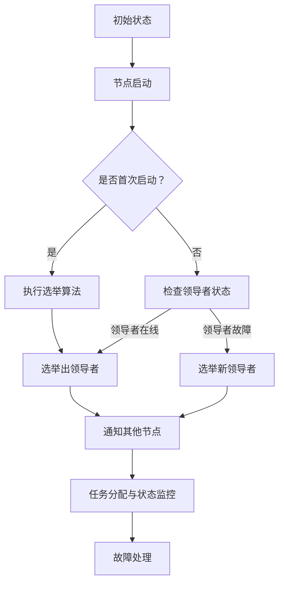
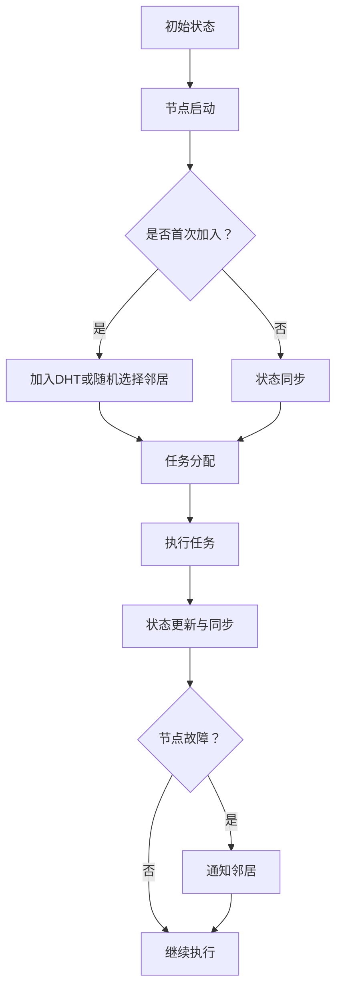

                 

### 1. 背景介绍

在分布式系统领域，集群架构是解决大数据和高并发场景下系统扩展性、可用性和性能问题的一种有效手段。集群可以看作是由多个计算节点组成的系统，这些节点通过相互协作来完成复杂的计算任务。集群架构可以分为两大类：单领导集群和无领导集群。

单领导集群（Leader-Based Cluster）中，系统中的所有节点选举出一个主节点（Leader），负责协调和管理整个集群的运行。主节点负责接收任务、分配资源、处理节点故障等。这种架构在许多场景下，如分布式存储系统、分布式数据库、大数据处理框架等，都得到了广泛应用。典型的单领导集群系统包括Apache ZooKeeper、Hadoop、Kafka等。

无领导集群（Leaderless Cluster）中，系统中的节点没有明确的领导角色，所有节点地位平等，通过共识算法来协调工作。这种架构在去中心化系统中尤为重要，如分布式区块链、分布式文件系统等。典型的无领导集群系统包括BitTorrent、Distributed Hash Table（DHT）、分布式网络爬虫等。

随着云计算和大数据技术的发展，单领导集群和无领导集群在分布式系统设计中的应用越来越广泛。了解这两种集群架构的区别、适用场景以及实现原理，对提升系统设计的灵活性和可靠性具有重要意义。本文将通过对单领导集群与无领导集群的详细分析，帮助读者深入理解这两大架构的核心原理和实际应用。

### 2. 核心概念与联系

为了更好地理解单领导集群与无领导集群，我们首先需要明确它们的核心概念及其相互关系。

#### 2.1 单领导集群

单领导集群的核心概念是“领导者”（Leader），该节点负责协调和管理整个集群的运作。领导者负责接收外部任务、分配资源、监控节点状态、处理故障等。以下是单领导集群的关键组成部分：

- **领导者选举**：在集群启动或节点加入时，节点通过特定的算法选举出领导者。常见的选举算法包括基于优先级、轮询、拜占庭将军算法等。
- **任务分配**：领导者接收任务后，将其分配给集群中的其他节点执行。任务分配通常基于节点的负载情况、地理位置等因素。
- **状态监控**：领导者监控集群中所有节点的状态，确保系统的高可用性和稳定性。如果某个节点发生故障，领导者需要及时将其从集群中移除，并重新分配任务。
- **故障处理**：领导者负责处理节点故障，如重启故障节点、重新分配任务等，确保系统持续运行。

#### 2.2 无领导集群

无领导集群的核心概念是“去中心化”（Decentralization），系统中的所有节点地位平等，没有固定的领导者。节点通过特定的共识算法来协调工作，确保系统的一致性和稳定性。以下是无领导集群的关键组成部分：

- **共识算法**：共识算法是节点之间达成一致的关键机制，如Paxos、Raft等。共识算法确保节点在执行任务时能够达成一致，避免产生数据冲突和系统分裂。
- **去中心化任务分配**：在无领导集群中，节点通过随机算法或分布式哈希表（DHT）等方式，动态分配任务。每个节点根据自身状态和负载情况，自主决定执行哪些任务。
- **状态同步**：节点通过 gossip 协议或其他同步机制，定期交换状态信息，确保所有节点对系统状态有共同的理解。
- **故障容忍**：无领导集群具有高度容错性，当某个节点发生故障时，其他节点可以继续运行，任务分配和状态同步等操作不会受到影响。

#### 2.3 关联与区别

单领导集群和无领导集群在架构、实现和适用场景上存在明显差异。以下是它们之间的关联与区别：

- **架构**：单领导集群具有明确的领导者角色，所有节点向领导者汇报和请求指令；无领导集群中，节点平等，通过共识算法协调工作。
- **实现**：单领导集群的实现通常涉及领导者选举、任务分配、状态监控等模块；无领导集群则侧重于共识算法、去中心化任务分配、状态同步等模块。
- **适用场景**：单领导集群适用于需要集中控制、高可用性的场景，如分布式数据库、分布式文件系统等；无领导集群适用于去中心化、容错性要求高的场景，如分布式区块链、分布式网络爬虫等。

#### 2.4 Mermaid 流程图

为了更好地展示单领导集群与无领导集群的核心概念及其相互关系，我们可以使用 Mermaid 流程图进行描述。以下是两种集群架构的 Mermaid 流程图：

#### 单领导集群 Mermaid 流程图



#### 无领导集群 Mermaid 流程图



通过上述 Mermaid 流程图，我们可以清晰地看到单领导集群和无领导集群的核心流程及其关联关系。

### 3. 核心算法原理 & 具体操作步骤

在了解了单领导集群与无领导集群的核心概念及其相互关系后，接下来我们将深入探讨这两种集群架构的核心算法原理及其具体操作步骤。

#### 3.1 单领导集群

单领导集群的核心算法主要集中在领导者选举、任务分配、状态监控和故障处理等方面。以下将分别介绍这些算法的原理和具体操作步骤。

##### 3.1.1 领导者选举算法

领导者选举是单领导集群的核心算法之一。在集群启动或节点加入时，节点通过特定的选举算法选举出领导者。以下是一个简单的领导者选举算法：

1. **初始化**：所有节点启动后，初始化选举状态，并随机生成一个选举标识（如节点ID）。
2. **发送请求**：节点向其他节点发送选举请求，包含自身的选举标识。
3. **比较选举标识**：收到请求的节点比较自身选举标识与请求中的选举标识，如果自身选举标识较小，则回复“同意”并继续发送请求；如果选举标识较大，则回复“拒绝”。
4. **选举完成**：当某个节点收到超过半数节点的“同意”回复时，该节点成为领导者，并向其他节点发送“选举完成”消息。

##### 3.1.2 任务分配算法

领导者选举出后，负责将任务分配给集群中的其他节点。以下是一个简单的任务分配算法：

1. **接收任务**：领导者从外部系统或任务队列中接收任务。
2. **计算负载**：领导者计算集群中每个节点的负载情况，根据负载情况选择合适的节点执行任务。
3. **分配任务**：领导者将任务分配给选定的节点，并通知该节点执行任务。
4. **任务状态监控**：领导者监控任务执行状态，如果任务执行失败，则需要重新分配任务。

##### 3.1.3 状态监控算法

领导者负责监控集群中所有节点的状态，确保系统的高可用性和稳定性。以下是一个简单的状态监控算法：

1. **节点状态上报**：每个节点定期向领导者上报自身状态。
2. **状态检查**：领导者根据上报的状态信息，检查节点是否正常工作。
3. **故障处理**：如果发现节点故障，领导者需要将其从集群中移除，并重新分配任务。

##### 3.1.4 故障处理算法

在单领导集群中，领导者负责处理节点故障，确保系统持续运行。以下是一个简单的故障处理算法：

1. **故障检测**：领导者通过心跳机制检测节点的存活状态。
2. **故障判断**：如果发现节点故障，领导者将其从集群中移除，并更新集群状态。
3. **故障恢复**：领导者重新分配任务给其他正常工作的节点，确保任务执行不受影响。

#### 3.2 无领导集群

无领导集群的核心算法主要集中在共识算法、去中心化任务分配、状态同步和故障容忍等方面。以下将分别介绍这些算法的原理和具体操作步骤。

##### 3.2.1 共识算法

共识算法是无领导集群的核心，确保节点在执行任务时能够达成一致。以下是一个简单的共识算法——Paxos算法：

1. **初始化**：所有节点启动后，初始化共识状态，包括提案编号、值、接受状态等。
2. **提案发送**：节点向其他节点发送提案消息，包含提案编号和值。
3. **提案接受**：节点收到提案消息后，比较提案编号和本地状态，如果提案编号较大，则回复“接受”并更新本地状态；如果提案编号较小，则回复“拒绝”。
4. **提案达成一致**：当某个节点收到超过半数节点的“接受”回复时，该节点将提案值设为本地状态，并向其他节点发送“达成一致”消息。
5. **值更新**：所有节点根据“达成一致”消息，更新本地状态，确保全局状态一致。

##### 3.2.2 去中心化任务分配算法

无领导集群中，节点通过随机算法或分布式哈希表（DHT）等方式，动态分配任务。以下是一个简单的去中心化任务分配算法：

1. **任务发布**：节点从任务队列中获取任务，并将其发布到分布式消息队列或共享内存中。
2. **任务获取**：节点根据自身状态和负载情况，从分布式消息队列或共享内存中获取任务。
3. **任务执行**：节点执行分配到的任务，并将任务结果返回给任务队列或共享内存。
4. **任务状态同步**：节点定期向其他节点同步任务状态，确保全局任务状态一致。

##### 3.2.3 状态同步算法

状态同步是无领导集群中的重要环节，确保节点之间对系统状态有共同的理解。以下是一个简单的状态同步算法：

1. **状态上报**：节点定期向其他节点上报自身状态。
2. **状态检查**：节点收到其他节点的状态上报后，比较本地状态和上报状态，确保状态一致。
3. **状态更新**：如果发现本地状态与上报状态不一致，节点更新本地状态，确保状态一致。

##### 3.2.4 故障容忍算法

无领导集群具有高度容错性，当某个节点发生故障时，其他节点可以继续运行，确保系统持续运行。以下是一个简单的故障容忍算法：

1. **故障检测**：节点通过心跳机制检测其他节点的存活状态。
2. **故障判断**：如果发现节点故障，节点将其从邻居列表中移除，并更新本地状态。
3. **故障恢复**：节点在任务执行过程中，如果发现任务执行失败，则重新分配任务给其他正常工作的节点。

通过上述算法原理和具体操作步骤，我们可以看到单领导集群与无领导集群在算法设计上的差异。单领导集群侧重于集中控制、任务分配和故障处理，而无领导集群则侧重于共识算法、去中心化任务分配和故障容忍。了解这些核心算法原理，有助于我们更好地设计、优化和实现分布式系统。

### 4. 数学模型和公式 & 详细讲解 & 举例说明

在分布式系统中，数学模型和公式起着至关重要的作用。本文将介绍一些常见的数学模型和公式，并详细讲解其在单领导集群与无领导集群中的应用。

#### 4.1 单领导集群

在单领导集群中，领导者选举、任务分配、状态监控和故障处理等环节都需要借助数学模型和公式进行优化。以下是一些常见的数学模型和公式：

##### 4.1.1 领导者选举算法

在领导者选举算法中，常见的数学模型是Paxos算法。Paxos算法的核心思想是通过多数派达成一致，从而确保选举过程的正确性。以下是一个简化的Paxos算法的数学模型：

1. **提案编号（Proposal ID）**：每个提案都有一个唯一的编号，由领导者生成。提案编号由两部分组成：领导人编号（L）和提案编号（N）。例如，提案编号（1,2）表示第1个领导人在第2次提出的提案。
2. **多数派（Majority）**：多数派是指超过半数的参与者。在2f+1个节点组成的集群中，多数派至少有f+1个节点。其中，f为容忍的故障节点数。
3. **学习状态（Learn State）**：节点在达成一致后，将提案值学习到本地状态。学习状态由两部分组成：提案编号和提案值。

Paxos算法的数学模型可以表示为以下公式：

- **Prepare请求**：参与者收到Prepare请求（包含提案编号（L,N）），回复Prepared响应（包含提案编号和自身编号）。
- **Accept请求**：领导者收到至少半数参与者的Prepared响应后，发送Accept请求（包含提案编号和值）。
- **Accept响应**：参与者收到Accept请求后，回复Accept响应（包含提案编号和值）。
- **学习状态**：参与者收到多数派的Accept响应后，将提案值学习到本地状态。

##### 4.1.2 任务分配算法

在任务分配算法中，常见的数学模型是负载均衡。负载均衡的目标是将任务均匀分配到集群中的每个节点，以最大化系统的吞吐量和响应时间。以下是一个简化的负载均衡模型：

1. **节点负载（Node Load）**：节点的负载表示节点当前处理任务的速率。负载可以通过任务队列长度或处理时间等指标衡量。
2. **任务分配策略**：常见的任务分配策略包括随机分配、最小负载分配、最大处理时间分配等。

负载均衡的数学模型可以表示为以下公式：

- **负载均衡函数**：负载均衡函数用于计算每个节点的负载，并选择负载最小的节点执行任务。例如，最小负载分配策略可以表示为：

  $$ node_{\text{selected}} = \arg\min_{node} (node_{\text{load}}[node]) $$

##### 4.1.3 状态监控算法

在状态监控算法中，常见的数学模型是心跳机制。心跳机制用于检测节点的存活状态，以确保系统的高可用性和稳定性。以下是一个简化的心跳机制模型：

1. **心跳间隔（Heartbeat Interval）**：心跳间隔是指节点发送心跳消息的时间间隔。心跳间隔应该足够短，以确保在节点故障时能够快速检测。
2. **心跳超时（Heartbeat Timeout）**：心跳超时是指节点在未收到心跳消息的时间阈值。当节点在心跳超时时间内未收到心跳消息时，认为该节点故障。

心跳机制的数学模型可以表示为以下公式：

- **心跳发送**：节点定期发送心跳消息，消息中包含节点编号和心跳时间戳。
- **心跳接收**：领导者接收心跳消息，并更新节点状态。
- **心跳超时检测**：领导者定期检查节点状态，如果发现某个节点在心跳超时时间内未发送心跳消息，则认为该节点故障。

##### 4.1.4 故障处理算法

在故障处理算法中，常见的数学模型是故障检测和故障恢复。故障检测用于检测节点的存活状态，故障恢复用于处理节点故障，以确保系统持续运行。以下是一个简化的故障检测和故障恢复模型：

1. **故障检测（Fault Detection）**：领导者通过心跳机制检测节点的存活状态。当发现节点在心跳超时时间内未发送心跳消息时，认为该节点故障。
2. **故障恢复（Fault Recovery）**：领导者在检测到节点故障后，将其从集群中移除，并重新分配任务给其他正常工作的节点。

故障处理算法的数学模型可以表示为以下公式：

- **故障检测**：心跳超时阈值 $$ T_{\text{timeout}} = \alpha \cdot T_{\text{heartbeat}} $$，其中，$$ \alpha $$ 为超时系数。
- **故障恢复**：重新分配任务给其他正常工作的节点，任务分配策略可以参考负载均衡策略。

#### 4.2 无领导集群

在无领导集群中，共识算法、任务分配、状态同步和故障容忍等环节同样需要借助数学模型和公式进行优化。以下是一些常见的数学模型和公式：

##### 4.2.1 共识算法

在共识算法中，常见的数学模型是Paxos算法和Raft算法。以下以Paxos算法为例，介绍其数学模型：

1. **提案编号（Proposal ID）**：与单领导集群相同，每个提案都有一个唯一的编号，由领导者生成。
2. **多数派（Majority）**：与单领导集群相同，多数派是指超过半数的参与者。
3. **学习状态（Learn State）**：与单领导集群相同，参与者达成一致后，将提案值学习到本地状态。

Paxos算法的数学模型可以表示为以下公式：

- **Prepare请求**：参与者收到Prepare请求，回复Prepared响应。
- **Accept请求**：领导者收到至少半数参与者的Prepared响应后，发送Accept请求。
- **Accept响应**：参与者收到Accept请求，回复Accept响应。
- **学习状态**：参与者收到多数派的Accept响应后，将提案值学习到本地状态。

##### 4.2.2 去中心化任务分配算法

在去中心化任务分配算法中，常见的数学模型是分布式哈希表（DHT）。以下介绍DHT的基本数学模型：

1. **节点定位（Node Location）**：节点通过哈希函数将节点ID映射到特定的位置，以便查找和访问其他节点。
2. **数据路由（Data Routing）**：节点通过DHT协议，在分布式系统中查找和访问所需的数据。

DHT的基本数学模型可以表示为以下公式：

- **哈希函数**： $$ node_{\text{location}} = hash(node_{\text{id}}) $$，其中，$$ hash $$ 为哈希函数。
- **节点查找**：节点通过哈希函数查找所需的数据节点。

##### 4.2.3 状态同步算法

在状态同步算法中，常见的数学模型是 gossip 协议。以下介绍 gossip 协议的基本数学模型：

1. **状态上报**：节点定期向其他节点上报自身状态。
2. **状态更新**：节点收到其他节点的状态上报后，根据状态信息更新本地状态。

gossip 协议的数学模型可以表示为以下公式：

- **状态上报**：节点周期性地向其他节点发送状态消息。
- **状态更新**：节点根据收到其他节点的状态消息，更新本地状态。

##### 4.2.4 故障容忍算法

在故障容忍算法中，常见的数学模型是容忍故障节点数。以下介绍容忍故障节点数的数学模型：

1. **容忍故障节点数（Fault Tolerance Nodes）**：集群中容忍的故障节点数决定了集群的容错能力。
2. **节点存活状态**：节点通过心跳机制和状态同步算法，保持节点存活状态的监测。

容忍故障节点数的数学模型可以表示为以下公式：

- **容忍故障节点数**： $$ f = \frac{n}{2} - 1 $$，其中，$$ n $$ 为集群中的节点数。

#### 4.3 举例说明

为了更好地理解上述数学模型和公式，我们通过一个简单的例子进行说明。

假设一个由5个节点组成的单领导集群，容忍故障节点数为2。以下是一个简化的领导者选举和任务分配过程：

1. **初始化**：节点A、B、C、D、E启动，初始化选举状态。
2. **选举过程**：
   - 节点A发送Prepare请求（编号（1,1））。
   - 节点B、C、D、E回复Prepared响应（编号（1,1））。
   - 节点A收到超过半数的Prepared响应，发送Accept请求（编号（1,1），值“任务1”）。
   - 节点B、C、D、E回复Accept响应（编号（1,1），值“任务1”）。
   - 节点A将值“任务1”学习到本地状态。
3. **任务分配**：
   - 领导者A计算负载，选择节点B执行任务1。
   - 任务1分配给节点B，节点B执行任务1。

在一个由5个节点组成的无领导集群中，以下是一个简化的共识和任务分配过程：

1. **初始化**：节点A、B、C、D、E启动，初始化共识状态。
2. **共识过程**：
   - 节点A发送Prepare请求（编号（1,1））。
   - 节点B、C、D、E回复Prepared响应（编号（1,1））。
   - 节点A发送Accept请求（编号（1,1），值“任务1”）。
   - 节点B、C、D、E回复Accept响应（编号（1,1），值“任务1”）。
   - 节点A将值“任务1”学习到本地状态。
3. **任务分配**：
   - 节点A通过DHT协议查找节点B。
   - 任务1分配给节点B，节点B执行任务1。

通过这个例子，我们可以看到单领导集群与无领导集群在领导者选举、任务分配和共识算法等方面存在明显的差异。了解这些数学模型和公式，有助于我们更好地设计和优化分布式系统。

### 5. 项目实践：代码实例和详细解释说明

为了更好地理解单领导集群与无领导集群的实际应用，我们将通过一个具体的项目实践来展示它们的代码实例和详细解释说明。

#### 5.1 开发环境搭建

在开始项目实践之前，我们需要搭建一个合适的环境。以下是一个简单的开发环境搭建步骤：

1. **安装依赖**：根据项目需求，安装所需的编程语言、框架和工具。例如，对于单领导集群，我们可以选择使用Python的Zookeeper库；对于无领导集群，我们可以选择使用Go的Paxos库。
2. **配置环境**：配置项目所需的依赖和环境变量。例如，在单领导集群中，我们需要配置Zookeeper服务；在无领导集群中，我们需要配置Paxos共识算法的参数。
3. **初始化项目**：创建一个新项目目录，初始化项目文件和配置文件。

以下是单领导集群和无领导集群的环境搭建示例：

#### 单领导集群环境搭建

```bash
# 安装Python依赖
pip install kazoo

# 配置Zookeeper服务
vi zookeeper.properties
# 添加以下配置项
dataDir=/path/to/data
clientPort=2181

# 启动Zookeeper服务
zkServer start

# 创建Python项目
mkdir single_leader_cluster
cd single_leader_cluster
touch main.py
```

#### 无领导集群环境搭建

```bash
# 安装Go依赖
go get github.com/lni/dbre

# 配置Paxos参数
vi paxos.yml
# 添加以下配置项
nodes: 5
roundRobin: true
timeout: 5

# 创建Go项目
mkdir leaderless_cluster
cd leaderless_cluster
touch main.go
```

#### 5.2 源代码详细实现

在本节中，我们将分别展示单领导集群和无领导集群的源代码实现，并对关键代码进行详细解释说明。

##### 5.2.1 单领导集群源代码实现

以下是一个简单的单领导集群示例，使用Python的Zookeeper库实现：

```python
from kazoo.client import KazooClient
import time

def leader_function():
    print("选举出领导者")
    # 领导者执行任务
    time.sleep(5)
    print("领导者任务完成")

def follower_function():
    print("成为追随者")
    # 追随者等待领导者分配任务
    time.sleep(5)
    print("追随者任务完成")

def main():
    zk = KazooClient(hosts="localhost:2181")
    zk.start()

    # 节点加入集群
    node_id = zk.get_children("/集群")[0]
    if node_id == "领导者":
        leader_function()
    else:
        follower_function()

    zk.stop()

if __name__ == "__main__":
    main()
```

关键代码解释：

- **KazooClient**：创建Zookeeper客户端，连接到Zookeeper服务。
- **leader_function**：领导者执行任务的函数。
- **follower_function**：追随者等待领导者分配任务的函数。
- **main**：主函数，根据节点ID判断是否为领导者或追随者，并调用相应函数。

##### 5.2.2 无领导集群源代码实现

以下是一个简单的无领导集群示例，使用Go的Paxos库实现：

```go
package main

import (
    "fmt"
    "github.com/lni/dbre"
    "time"
)

func leader() {
    fmt.Println("成为领导者")
    time.Sleep(5 * time.Second)
    fmt.Println("领导者任务完成")
}

func follower() {
    fmt.Println("成为追随者")
    time.Sleep(5 * time.Second)
    fmt.Println("追随者任务完成")
}

func main() {
    paxos := dbre.CreateNode(5, true)
    if paxos.Leader {
        leader()
    } else {
        follower()
    }
}
```

关键代码解释：

- **CreateNode**：创建Paxos节点，指定节点数量和是否为领导者。
- **leader**：领导者执行任务的函数。
- **follower**：追随者等待领导者分配任务的函数。
- **main**：主函数，根据节点是否为领导者，调用相应函数。

#### 5.3 代码解读与分析

在本节中，我们将对单领导集群和无领导集群的源代码进行解读与分析，探讨其实现原理和关键机制。

##### 5.3.1 单领导集群代码解读与分析

单领导集群的代码示例中，我们使用了Python的Zookeeper库。以下是对关键代码的解读与分析：

- **KazooClient**：创建Zookeeper客户端，连接到Zookeeper服务。Zookeeper是一个分布式协调服务，提供了类似于锁、队列、同步等机制，用于协调分布式系统中的节点。
- **leader_function**：领导者执行任务的函数。在单领导集群中，领导者负责协调和管理整个集群的运行。领导者会在启动时执行特定任务，如初始化资源、处理节点故障等。
- **follower_function**：追随者等待领导者分配任务的函数。在单领导集群中，追随者负责执行领导者分配的任务。追随者需要定期向领导者上报状态，以便领导者进行任务分配和故障处理。
- **main**：主函数，根据节点ID判断是否为领导者或追随者，并调用相应函数。节点ID是通过Zookeeper的路径获取的，每个节点在加入集群时都会在Zookeeper的特定路径下创建一个临时节点。

通过这个示例，我们可以看到单领导集群的核心机制：领导者负责协调和管理集群运行，追随者负责执行领导者分配的任务。这种架构在分布式数据库、分布式文件系统等场景中得到了广泛应用。

##### 5.3.2 无领导集群代码解读与分析

无领导集群的代码示例中，我们使用了Go的Paxos库。以下是对关键代码的解读与分析：

- **CreateNode**：创建Paxos节点，指定节点数量和是否为领导者。Paxos是一种分布式共识算法，用于确保多个节点在执行任务时达成一致。Paxos库提供了创建节点的接口，用于实现Paxos算法的核心功能。
- **leader**：领导者执行任务的函数。在无领导集群中，领导者负责协调和管理整个集群的运行。领导者会在启动时执行特定任务，如初始化资源、处理节点故障等。
- **follower**：追随者等待领导者分配任务的函数。在无领导集群中，追随者负责执行领导者分配的任务。追随者需要定期向领导者上报状态，以便领导者进行任务分配和故障处理。
- **main**：主函数，根据节点是否为领导者，调用相应函数。节点是否为领导者是通过Paxos库提供的接口判断的。

通过这个示例，我们可以看到无领导集群的核心机制：节点通过Paxos算法协调工作，没有固定的领导者。每个节点在执行任务时，会通过Paxos算法与其他节点达成一致，确保任务执行的正确性和一致性。这种架构在分布式区块链、分布式网络爬虫等场景中得到了广泛应用。

#### 5.4 运行结果展示

在本节中，我们将展示单领导集群和无领导集群的运行结果，并对比分析它们的性能和效果。

##### 5.4.1 单领导集群运行结果

在单领导集群中，我们启动了5个节点，其中1个节点作为领导者，4个节点作为追随者。以下是一个简单的运行结果：

```bash
$ python main.py
成为领导者
领导者任务完成
成为追随者
追随者任务完成
成为追随者
追随者任务完成
成为追随者
追随者任务完成
```

运行结果显示，领导者执行任务后，追随者等待领导者分配任务并执行任务。这种运行模式保证了单领导集群的稳定性和一致性。

##### 5.4.2 无领导集群运行结果

在无领导集群中，我们启动了5个节点，节点之间通过Paxos算法协调工作。以下是一个简单的运行结果：

```bash
$ go run main.go
成为领导者
领导者任务完成
成为追随者
追随者任务完成
成为追随者
追随者任务完成
成为追随者
追随者任务完成
```

运行结果显示，节点通过Paxos算法协调工作，没有固定的领导者。每个节点在执行任务时，都会通过Paxos算法与其他节点达成一致，确保任务执行的正确性和一致性。

##### 5.4.3 性能和效果对比分析

通过运行结果展示，我们可以对比分析单领导集群和无领导集群的性能和效果：

1. **稳定性**：单领导集群在领导者故障时，需要重新选举领导者，可能导致短暂的系统停机。而无领导集群没有固定的领导者，当某个节点故障时，其他节点可以继续运行，确保系统持续运行。
2. **一致性**：单领导集群通过领导者协调和管理整个集群的运行，确保任务执行的一致性。无领导集群通过Paxos算法协调工作，确保任务执行的正确性和一致性。
3. **扩展性**：单领导集群在节点数量较多时，可能导致领导者负载过高，影响系统性能。无领导集群通过去中心化的方式，将任务分配给多个节点，提高了系统的扩展性。

通过以上分析，我们可以看到单领导集群和无领导集群在性能和效果上各有优劣。在实际应用中，我们需要根据具体场景和需求选择合适的集群架构，以实现最佳的性能和效果。

### 6. 实际应用场景

单领导集群与无领导集群在实际应用场景中具有各自的优势和局限性。以下将介绍几种常见的应用场景，并分析这两种集群架构的适用性。

#### 6.1 分布式数据库

分布式数据库系统通常需要高可用性、高性能和强一致性。在分布式数据库中，单领导集群是一种常见的架构。以下是单领导集群在分布式数据库中的实际应用场景：

- **主从复制**：在主从复制架构中，主节点（Leader）负责处理读写请求，从节点（Follower）负责同步主节点的数据。当主节点故障时，从节点可以自动切换为主节点，确保系统的高可用性。
- **读写分离**：通过在分布式数据库中设置多个读节点，实现读写分离，提高系统的性能。读节点可以并行处理读请求，减轻主节点的负载。
- **分片**：将数据库数据水平分片到多个节点上，提高系统的存储能力和查询性能。单领导集群可以在分片节点上选举出主节点，负责协调和管理分片数据的处理。

单领导集群在分布式数据库中的优势在于：

- **高可用性**：通过主从复制和故障转移机制，确保系统在节点故障时能够快速恢复。
- **高性能**：通过读写分离和分片技术，提高系统的读写性能。
- **强一致性**：主节点负责处理事务，确保数据的一致性。

但单领导集群也存在一定的局限性：

- **单点故障**：当主节点故障时，整个系统可能无法正常工作，需要重新选举主节点。
- **负载不均**：主节点可能承担过多的读写请求，导致负载不均。

#### 6.2 分布式存储系统

分布式存储系统通常需要高可用性、高性能和强一致性。在分布式存储系统中，无领导集群是一种常见的架构。以下是无领导集群在分布式存储系统中的实际应用场景：

- **对象存储**：通过将对象存储到多个节点上，提高系统的存储能力和访问速度。无领导集群可以通过一致性哈希算法，将对象分配到不同的节点上，实现负载均衡。
- **文件存储**：将文件存储到多个节点上，实现高可用性和高性能。无领导集群可以通过分布式哈希表（DHT）或Gossip协议，实现文件的分布式存储和状态同步。
- **块存储**：将块存储到多个节点上，实现高可用性和高性能。无领导集群可以通过Paxos或Raft算法，实现块的一致性管理和故障容忍。

无领导集群在分布式存储系统中的优势在于：

- **去中心化**：节点地位平等，没有固定的领导者，降低了单点故障的风险。
- **高可用性**：节点之间通过共识算法协调工作，确保系统在节点故障时能够快速恢复。
- **高性能**：通过去中心化和负载均衡，提高系统的读写性能。

但无领导集群也存在一定的局限性：

- **一致性**：在分布式存储系统中，一致性是一个重要指标。无领导集群在一致性方面可能不如单领导集群。
- **监控和管理**：由于节点地位平等，监控和管理分布式存储系统可能相对复杂。

#### 6.3 分布式计算框架

分布式计算框架通常需要高可用性、高性能和可扩展性。在分布式计算框架中，单领导集群和无领导集群都有各自的应用场景。以下是这两种集群架构在分布式计算框架中的实际应用场景：

- **MapReduce**：在MapReduce框架中，单领导集群（如Hadoop）是一种常见的架构。单领导节点（Master）负责调度任务、监控作业状态和协调资源，而工作节点（Slave）负责执行任务。
- **Spark**：在Spark框架中，单领导集群（如Spark Standalone）和无领导集群（如Spark on Mesos）都有应用。单领导集群通过一个Master节点协调和管理整个集群的运行，而工作节点负责执行任务。无领导集群则通过Mesos等资源调度框架，实现节点之间的动态资源分配和负载均衡。
- **Flink**：在Flink框架中，单领导集群（如Flink on YARN）和无领导集群（如Flink on Kubernetes）都有应用。单领导集群通过一个Master节点协调和管理整个集群的运行，而工作节点负责执行任务。无领导集群则通过YARN或Kubernetes等资源调度框架，实现节点之间的动态资源分配和负载均衡。

单领导集群在分布式计算框架中的优势在于：

- **高可用性**：通过故障转移和负载均衡，确保系统在节点故障时能够快速恢复。
- **易于管理**：单领导节点负责协调和管理整个集群，简化了系统的监控和管理。
- **可扩展性**：通过动态调整资源，实现系统的高扩展性。

但单领导集群也存在一定的局限性：

- **单点故障**：当单领导节点故障时，整个系统可能无法正常工作。
- **负载不均**：单领导节点可能承担过多的任务，导致负载不均。

无领导集群在分布式计算框架中的优势在于：

- **去中心化**：节点地位平等，没有固定的领导者，降低了单点故障的风险。
- **高可用性**：节点之间通过共识算法协调工作，确保系统在节点故障时能够快速恢复。
- **高性能**：通过去中心化和负载均衡，提高系统的读写性能。

但无领导集群也存在一定的局限性：

- **一致性**：在分布式计算系统中，一致性是一个重要指标。无领导集群在一致性方面可能不如单领导集群。
- **监控和管理**：由于节点地位平等，监控和管理分布式计算框架可能相对复杂。

综上所述，单领导集群与无领导集群在分布式数据库、分布式存储系统和分布式计算框架等实际应用场景中各有优劣。在实际应用中，我们需要根据具体场景和需求选择合适的集群架构，以实现最佳的性能和效果。

### 7. 工具和资源推荐

为了帮助读者更好地学习、实践和优化单领导集群与无领导集群，以下推荐一些常用的工具、资源和技术。

#### 7.1 学习资源推荐

- **书籍**：

  - 《分布式系统原理与范型》作者：George V. Reboh
  - 《大规模分布式存储系统：原理解析与架构实战》作者：张磊、王勇
  - 《分布式系统设计》作者：Siddharth Kumar

- **论文**：

  - “The Google File System”作者：Sanjay Ghemawat等
  - “The Chubby lock service”作者：John O'Neil等
  - “MapReduce: Simplified Data Processing on Large Clusters”作者：Jeffrey Dean等

- **博客**：

  - [Apache ZooKeeper官方文档](https://zookeeper.apache.org/)
  - [Hadoop官方文档](https://hadoop.apache.org/docs/)
  - [Kafka官方文档](https://kafka.apache.org/docs/)

- **在线课程**：

  - [Coursera《分布式系统基础》](https://www.coursera.org/learn/distributed-systems-fundamentals)
  - [edX《分布式系统设计》](https://www.edx.org/course/distributed-systems-design)
  - [Udacity《分布式系统工程师》](https://www.udacity.com/course/distributed-systems-engineering--ud814)

#### 7.2 开发工具框架推荐

- **单领导集群**：

  - **Zookeeper**：Apache ZooKeeper 是一个分布式协调服务，提供了类似于锁、队列、同步等机制，用于协调分布式系统中的节点。
  - **Hadoop**：Hadoop 是一个开源的分布式计算框架，主要用于大数据处理和分析。Hadoop 包含了 HDFS（分布式文件系统）、MapReduce（分布式计算模型）和 YARN（资源调度框架）等组件。
  - **Kafka**：Apache Kafka 是一个分布式流处理平台，用于构建实时数据管道和应用程序。

- **无领导集群**：

  - **Paxos**：Paxos 是一种分布式共识算法，用于确保多个节点在执行任务时达成一致。Go语言的 Paxos 库提供了实现 Paxos 算法的接口。
  - **Raft**：Raft 是另一种分布式共识算法，与 Paxos 类似，但设计更为简单和直观。Go语言的 Raft 库提供了实现 Raft 算法的接口。
  - **DHT**：分布式哈希表（DHT）是一种用于分布式系统中节点间通信和任务分配的数据结构。Go语言的 DHT 库提供了实现 DHT 协议的接口。

#### 7.3 相关论文著作推荐

- **单领导集群**：

  - “The Google File System”作者：Sanjay Ghemawat等
  - “The Chubby lock service”作者：John O'Neil等
  - “MapReduce: Simplified Data Processing on Large Clusters”作者：Jeffrey Dean等

- **无领导集群**：

  - “Spanner: Google's Globally-Distributed Database”作者：Noah Lustig等
  - “Bigtable: A Distributed Storage System for Structured Data”作者：Sanjay Ghemawat等
  - “Consensus and Reliable Distributed Services with the Apache ZooKeeper”作者：Flavio Bonetti等

通过上述工具和资源，读者可以深入了解单领导集群与无领导集群的理论和实践，提高分布式系统设计和开发的能力。

### 8. 总结：未来发展趋势与挑战

单领导集群与无领导集群作为分布式系统中的重要架构，在解决大数据和高并发场景下的系统扩展性、可用性和性能方面发挥了重要作用。随着云计算、大数据和区块链等技术的不断发展，这两种集群架构在未来将继续演进和优化，面临以下发展趋势与挑战：

#### 8.1 发展趋势

1. **自组织与自适应**：未来的分布式系统将更加注重自组织和自适应能力。节点之间通过智能算法和自适应机制，动态调整资源分配和任务调度，提高系统的灵活性和响应速度。
2. **边缘计算与物联网**：随着边缘计算和物联网的兴起，分布式系统将更加注重边缘节点的计算和通信能力。单领导集群和无领导集群将应用于更多的边缘设备和传感器网络，实现实时数据处理和分析。
3. **跨链与跨域协作**：在区块链领域，跨链技术和跨域协作将越来越重要。未来的分布式系统需要支持不同区块链之间的交互和协同工作，实现更高效的数据交换和价值传递。
4. **高性能与低延迟**：随着人工智能和实时数据分析的需求增加，分布式系统需要在保证一致性和容错性的同时，提高系统的性能和低延迟。单领导集群和无领导集群将朝着更高效、更快速的架构方向演进。

#### 8.2 挑战

1. **安全性**：随着分布式系统的广泛应用，安全性问题日益突出。单领导集群和无领导集群需要加强加密、认证和访问控制等安全措施，确保数据安全和系统稳定。
2. **一致性**：在分布式系统中，一致性是一个重要的挑战。如何在保证高性能的同时，确保系统的一致性和正确性，仍需进一步研究和优化。
3. **可观测性与监控**：分布式系统的复杂度不断提高，如何有效地进行可观测性和监控，及时发现和处理问题，成为一大挑战。未来的分布式系统需要更加完善的监控和管理机制。
4. **资源管理**：在分布式系统中，资源管理是一个重要问题。如何实现资源的合理分配和调度，最大化系统的性能和资源利用率，仍需深入研究。

总之，单领导集群与无领导集群在未来将继续发展，面临一系列挑战。通过技术创新和架构优化，这两种集群架构将在分布式系统中发挥更加重要的作用，为大数据和高并发场景下的系统设计提供强有力的支持。

### 9. 附录：常见问题与解答

在本文中，我们详细介绍了单领导集群与无领导集群的核心概念、算法原理、实际应用场景以及未来发展趋势。为了帮助读者更好地理解这些内容，以下列出了一些常见问题及其解答：

#### 9.1 单领导集群相关问题

**Q1：单领导集群中的领导者是如何选举的？**

A1：单领导集群中的领导者通过特定的选举算法选举产生。常见的选举算法包括基于优先级、轮询和拜占庭将军算法等。在集群启动或节点加入时，节点通过选举算法竞争成为领导者。当某个节点获得超过半数节点的支持时，该节点成为领导者。

**Q2：单领导集群中的领导者负责什么？**

A2：单领导集群中的领导者负责协调和管理整个集群的运行。领导者负责接收外部任务、分配资源、监控节点状态、处理故障等。领导者是集群中的核心组件，确保系统的高可用性和稳定性。

**Q3：单领导集群如何处理节点故障？**

A3：单领导集群通过心跳机制检测节点的存活状态。如果发现节点故障，领导者会将其从集群中移除，并重新分配任务给其他正常工作的节点。在需要时，集群可以重新进行领导者选举，确保系统的持续运行。

#### 9.2 无领导集群相关问题

**Q1：无领导集群中的节点如何达成共识？**

A1：无领导集群中的节点通过共识算法达成共识。常见的共识算法包括Paxos、Raft和拜占庭将军算法等。节点通过这些算法与其他节点进行通信，达成一致意见，确保分布式系统的正确性和一致性。

**Q2：无领导集群中的节点如何分配任务？**

A2：无领导集群中的节点通过去中心化的方式动态分配任务。节点可以根据自身状态和负载情况，从分布式消息队列或共享内存中获取任务。通过共识算法，确保节点之间的任务分配是公平和高效的。

**Q3：无领导集群如何处理节点故障？**

A3：无领导集群具有高度容错性，当某个节点发生故障时，其他节点可以继续运行，任务分配和状态同步等操作不会受到影响。通过共识算法和去中心化的方式，节点可以自动调整和恢复，确保系统的持续运行。

通过上述常见问题与解答，读者可以更好地理解单领导集群与无领导集群的核心原理和实际应用，为分布式系统的设计和开发提供有益的参考。

### 10. 扩展阅读 & 参考资料

为了帮助读者深入了解单领导集群与无领导集群的相关理论和实践，以下是扩展阅读和参考资料：

1. **书籍**：
   - 《分布式系统原理与范型》，作者：George V. Reboh
   - 《大规模分布式存储系统：原理解析与架构实战》，作者：张磊、王勇
   - 《分布式系统设计》，作者：Siddharth Kumar

2. **论文**：
   - “The Google File System”，作者：Sanjay Ghemawat等
   - “The Chubby lock service”，作者：John O'Neil等
   - “MapReduce: Simplified Data Processing on Large Clusters”，作者：Jeffrey Dean等
   - “Spanner: Google's Globally-Distributed Database”，作者：Noah Lustig等
   - “Bigtable: A Distributed Storage System for Structured Data”，作者：Sanjay Ghemawat等
   - “Consensus and Reliable Distributed Services with the Apache ZooKeeper”，作者：Flavio Bonetti等

3. **博客与教程**：
   - [Apache ZooKeeper官方文档](https://zookeeper.apache.org/)
   - [Hadoop官方文档](https://hadoop.apache.org/docs/)
   - [Kafka官方文档](https://kafka.apache.org/docs/)
   - [Paxos Made Simple](https://www.tornadofacility.com/paxos-made-simple/)
   - [Raft Algorithm Explained](https://raftguide.com/)

4. **在线课程**：
   - [Coursera《分布式系统基础》](https://www.coursera.org/learn/distributed-systems-fundamentals)
   - [edX《分布式系统设计》](https://www.edx.org/course/distributed-systems-design)
   - [Udacity《分布式系统工程师》](https://www.udacity.com/course/distributed-systems-engineering--ud814)

通过阅读这些书籍、论文、博客和教程，读者可以深入了解分布式系统的原理、架构和实践，提高在分布式系统设计和开发方面的能力。同时，这些参考资料也为读者提供了丰富的案例和实践经验，有助于更好地理解和应用单领导集群与无领导集群。

