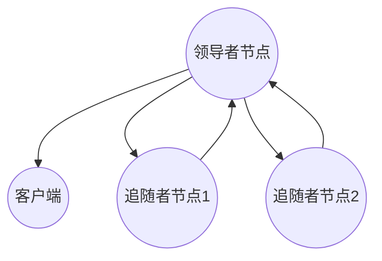
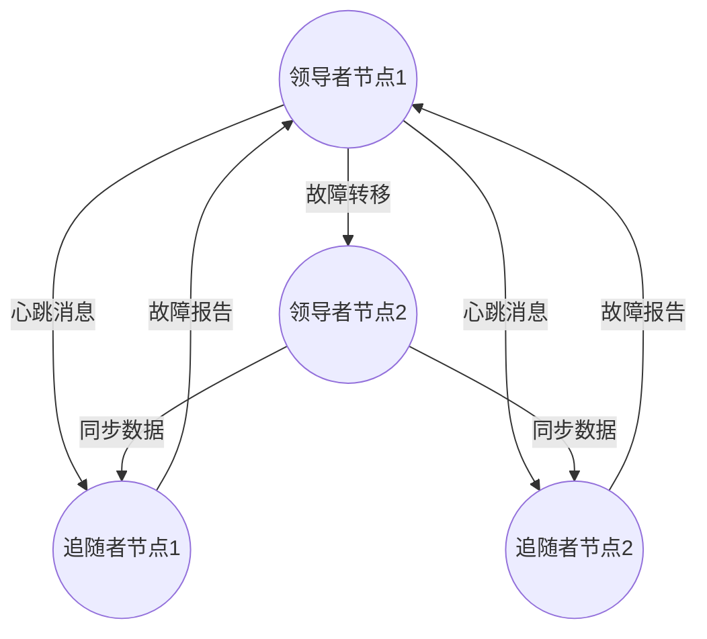
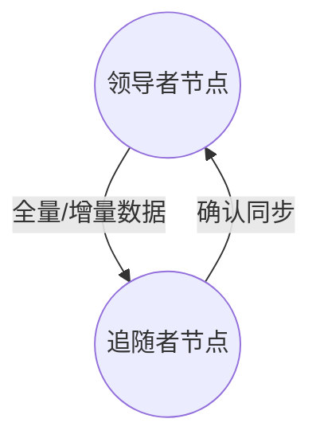

                 

### 文章标题

**单领导集群的高可用性设计**

> 关键词：单领导模式，高可用性，集群架构，故障转移，性能优化

> 摘要：本文将深入探讨单领导集群的高可用性设计，从背景介绍到核心概念阐述，再到具体算法和实现，通过实际应用场景分析，为读者提供全面的技术指导。同时，还将推荐相关学习资源和工具，帮助读者更好地理解和应用单领导集群的设计理念。

### 1. 背景介绍

在分布式系统中，高可用性（High Availability，简称HA）是确保系统持续运行、减少停机时间的关键因素。随着云计算和大数据技术的发展，越来越多的企业和服务开始依赖于分布式系统来提供可靠的服务。单领导集群（Single Leader Cluster）作为一种分布式系统架构，因其具备的高可用性和可扩展性，受到了广泛关注。

单领导集群的核心思想是集群中只有一个领导者（Leader）负责处理客户端请求，其他节点作为追随者（Follower）进行数据同步。这种架构能够提高系统的性能和可靠性，但同时也面临着领导者故障转移和负载均衡等挑战。

高可用性设计的目标是确保系统在面临各种故障时能够迅速恢复，降低对用户的影响。在单领导集群中，实现高可用性需要考虑以下几个方面：

1. **故障转移（Failover）**：当领导者节点发生故障时，能够快速选举出一个新的领导者。
2. **负载均衡（Load Balancing）**：合理分配客户端请求，避免单个节点过载。
3. **数据一致性（Data Consistency）**：确保在领导者故障转移过程中数据的一致性。

本文将围绕这些核心问题，逐步分析单领导集群的高可用性设计，提供实用的解决方案和实现方法。

### 2. 核心概念与联系

#### 2.1 单领导集群基本架构

在单领导集群中，架构主要包括领导者节点（Leader）和追随者节点（Follower）。领导者负责处理客户端请求，同时与追随者进行数据同步。以下是一个简化的单领导集群架构图：



#### 2.2 故障转移机制

故障转移是单领导集群高可用性的关键。当领导者节点发生故障时，需要及时选举出一个新的领导者，以保证系统的正常运行。以下是故障转移的基本流程：

1. **监控**：追随者节点定期向领导者发送心跳消息，领导者通过心跳消息来判断追随者是否正常。
2. **故障检测**：当领导者节点长时间未收到追随者节点的心跳消息，或者领导者节点主动报告故障时，系统启动故障转移过程。
3. **选举新领导者**：追随者节点通过一致性协议（如Raft或Paxos）进行新一轮的领导者选举。
4. **通知与同步**：新领导者选举成功后，通知其他追随者节点，并进行数据同步。

以下是一个简化的故障转移流程图：



#### 2.3 数据同步机制

数据同步是确保追随者节点与领导者节点数据一致性的关键。在单领导集群中，数据同步通常采用以下两种方式：

1. **全量同步（Full Sync）**：追随者节点将整个数据集同步到领导者节点，这种方式适用于数据量较小或初始数据同步的场景。
2. **增量同步（Incremental Sync）**：追随者节点只同步自上次同步以来的数据变更，这种方式适用于数据量较大或频繁数据更新的场景。

以下是一个简化的数据同步流程图：



### 3. 核心算法原理 & 具体操作步骤

#### 3.1 领导者选举算法

领导者选举是单领导集群高可用性的基础。以下介绍一种常用的领导者选举算法——Raft算法。

**Raft算法基本原理：**

Raft算法通过一系列的共识过程来确保分布式系统中的状态一致性。算法的核心概念包括：

1. **日志复制（Log Replication）**：领导者将日志条目逐个复制到追随者节点。
2. **领导选举（Leader Election）**：当领导者节点故障时，系统通过选举产生新的领导者。
3. **日志压缩（Log Compaction）**：通过日志压缩来清理过期日志，保持系统高效运行。

**领导者选举具体操作步骤：**

1. **初始化**：每个节点启动时，都会选举一个随机时间作为心跳超时时间。
2. **心跳消息**：领导者节点定期向追随者节点发送心跳消息，以表明其活跃状态。
3. **超时触发选举**：当追随者节点在指定时间内未收到心跳消息，认为领导者节点故障，触发新一轮的领导者选举。
4. **竞争选举**：每个节点在触发选举后，都会尝试发送请求给其他节点，以获取更多支持票。
5. **达成共识**：获得大多数支持票的节点成为新的领导者，其他节点转换为追随者状态。
6. **通知与同步**：新领导者通知其他追随者节点，并进行数据同步。

**代码实现示例（伪代码）：**

```python
# 初始化节点
def init_node():
    # 设置心跳超时时间
    heartbeat_timeout = random.randint(100, 500)
    # 启动定时器
    start_heartbeat_timer(heartbeat_timeout)

# 发送心跳消息
def send_heartbeat():
    # 向其他节点发送心跳消息
    for follower in followers:
        send_message(follower, "heartbeatt")

# 收到心跳消息
def receive_heartbeat(message):
    # 更新心跳时间
    last_heartbeat_time = current_time()
    # 重置心跳定时器
    reset_heartbeat_timer(heartbeat_timeout)

# 触发选举
def trigger_election():
    # 发送请求给其他节点
    for follower in followers:
        send_message(follower, "request_vote")
    # 等待响应
    wait_for_votes()

# 收到请求投票消息
def receive_request_vote(message):
    # 判断是否接受投票
    if accept_vote():
        send_message(sender, "vote_granted")
    else:
        send_message(sender, "vote_denied")

# 收到投票响应
def receive_vote_response(message):
    # 计算支持票数
    if message == "vote_granted":
        increase_vote_count()
    # 判断是否成为领导者
    if vote_count > majority:
        become_leader()

# 成为领导者
def become_leader():
    # 通知其他节点
    send_message_to_all("new_leader")
    # 启动同步过程
    start_sync_process()

# 同步过程
def start_sync_process():
    # 请求最新日志
    send_message(leader, "request_logs")
    # 等待日志响应
    wait_for_logs()

# 收到日志响应
def receive_logs(message):
    # 更新日志
    update_logs(message)
    # 确认同步
    send_message(leader, "log_confirmed")
```

#### 3.2 故障转移机制

故障转移是单领导集群高可用性的关键。以下介绍一种常用的故障转移算法——Paxos算法。

**Paxos算法基本原理：**

Paxos算法通过一系列的提案和决策过程来确保分布式系统中的状态一致性。算法的核心概念包括：

1. **提案（Proposal）**：提议一个值。
2. **决策（Decision）**：达成共识并确定提议的值。
3. **学习（Learn）**：将决策结果通知其他节点。

**故障转移具体操作步骤：**

1. **检测故障**：追随者节点在指定时间内未收到领导者节点的心跳消息，认为领导者节点故障。
2. **发起新选举**：追随者节点发起新一轮的领导者选举。
3. **选举新领导者**：通过Paxos算法选举出新的领导者。
4. **通知追随者**：新领导者通知其他追随者节点，并进行数据同步。

**代码实现示例（伪代码）：**

```python
# 检测故障
def detect_fault():
    # 检测领导者故障
    if leader_fault():
        start_new_election()

# 发起新选举
def start_new_election():
    # 发送请求投票消息
    send_message_to_all("request_vote")
    # 等待投票响应
    wait_for_votes()

# 收到请求投票消息
def receive_request_vote(message):
    # 判断是否接受投票
    if accept_vote():
        send_message(sender, "vote_granted")
    else:
        send_message(sender, "vote_denied")

# 收到投票响应
def receive_vote_response(message):
    # 计算支持票数
    if message == "vote_granted":
        increase_vote_count()
    # 判断是否成为领导者
    if vote_count > majority:
        become_leader()

# 成为领导者
def become_leader():
    # 通知其他节点
    send_message_to_all("new_leader")
    # 启动同步过程
    start_sync_process()

# 同步过程
def start_sync_process():
    # 请求最新日志
    send_message(leader, "request_logs")
    # 等待日志响应
    wait_for_logs()

# 收到日志响应
def receive_logs(message):
    # 更新日志
    update_logs(message)
    # 确认同步
    send_message(leader, "log_confirmed")
```

#### 3.3 数据同步机制

数据同步是确保追随者节点与领导者节点数据一致性的关键。以下介绍一种常用的数据同步算法——Log Replication。

**Log Replication算法基本原理：**

Log Replication算法通过日志条目的复制来保证分布式系统中数据的一致性。算法的核心概念包括：

1. **日志条目（Log Entry）**：每个日志条目包含一个唯一编号、一个值和一个创建时间。
2. **日志同步（Log Sync）**：追随者节点通过拉取或推送到领导者节点获取最新的日志条目。
3. **日志压缩（Log Compaction）**：通过日志压缩来清理过期日志，保持系统高效运行。

**数据同步具体操作步骤：**

1. **初始化**：每个节点启动时，都会创建一个日志存储。
2. **拉取同步**：追随者节点定期向领导者节点拉取最新的日志条目。
3. **推送同步**：追随者节点在接收到新的日志条目后，将其推送到领导者节点。
4. **日志压缩**：定期对日志进行压缩，清理过期日志。

**代码实现示例（伪代码）：**

```python
# 初始化日志
def init_log():
    # 创建日志存储
    log_storage = create_log_storage()

# 拉取同步
def pull_sync():
    # 向领导者节点拉取最新的日志条目
    logs = send_message(leader, "pull_logs")
    # 更新日志
    update_logs(logs)

# 推送同步
def push_sync():
    # 将最新的日志条目推送到领导者节点
    logs = get_logs()
    send_message(leader, "push_logs", logs)

# 日志压缩
def log_compaction():
    # 定期对日志进行压缩
    compact_logs()
```

### 4. 数学模型和公式 & 详细讲解 & 举例说明

#### 4.1 数学模型

在单领导集群的高可用性设计中，数学模型可以帮助我们更好地理解和分析系统的性能和可靠性。以下介绍几种常用的数学模型：

1. **故障转移时间（Fault Transfer Time，FTT）**：故障转移时间是指从领导者故障到新领导者选举成功的时间。其数学模型可以表示为：

   $$ FTT = \frac{1}{\lambda} \cdot \sum_{i=1}^{n} (1 - F_i) \cdot P_i $$

   其中，$\lambda$ 为故障率，$F_i$ 为第 $i$ 个节点发生故障的概率，$P_i$ 为第 $i$ 个节点发生故障后，系统能够成功恢复的概率。

2. **平均故障恢复时间（Average Fault Recovery Time，AFRT）**：平均故障恢复时间是指系统从发生故障到恢复正常运行的平均时间。其数学模型可以表示为：

   $$ AFRT = \frac{1}{N} \cdot \sum_{i=1}^{N} (1 - F_i) \cdot P_i \cdot FTT_i $$

   其中，$N$ 为系统中的节点数。

3. **系统可用性（System Availability，SA）**：系统可用性是指系统在规定时间内的正常运行时间与总时间的比值。其数学模型可以表示为：

   $$ SA = \frac{MTTF}{MTTF + MTTR} $$

   其中，$MTTF$ 为平均无故障时间，$MTTR$ 为平均故障恢复时间。

#### 4.2 举例说明

假设一个单领导集群中有 $3$ 个节点，故障率 $\lambda = 0.01$，每个节点的故障概率 $F_i = 0.01$，系统能够成功恢复的概率 $P_i = 0.99$。我们使用上述数学模型来计算故障转移时间、平均故障恢复时间和系统可用性。

1. **故障转移时间（FTT）**：

   $$ FTT = \frac{1}{0.01} \cdot \sum_{i=1}^{3} (1 - 0.01) \cdot 0.99 = 299.6 $$

   故障转移时间约为 $299.6$ 秒。

2. **平均故障恢复时间（AFRT）**：

   $$ AFRT = \frac{1}{3} \cdot (1 - 0.01) \cdot 0.99 \cdot 299.6 = 29.96 $$

   平均故障恢复时间约为 $29.96$ 秒。

3. **系统可用性（SA）**：

   $$ SA = \frac{MTTF}{MTTF + MTTR} = \frac{1}{1 + \frac{MTTR}{MTTF}} = \frac{1}{1 + \frac{29.96}{299.6}} \approx 0.9904 $$

   系统可用性约为 $99.04\%$。

通过以上数学模型和计算，我们可以更好地评估单领导集群的高可用性设计。在实际应用中，可以根据具体需求和场景，调整故障率、故障恢复概率等参数，以优化系统性能和可靠性。

### 5. 项目实践：代码实例和详细解释说明

#### 5.1 开发环境搭建

为了更好地理解单领导集群的高可用性设计，我们将通过一个具体的示例来讲解。在本项目中，我们将使用Python语言实现一个简单的单领导集群。以下是开发环境的搭建步骤：

1. **安装Python**：确保您的系统中已经安装了Python 3.x版本。
2. **安装依赖**：在终端中执行以下命令，安装项目所需的依赖库：

   ```bash
   pip install flask gunicorn
   ```

3. **创建项目目录**：在终端中创建一个名为`single_leader_cluster`的项目目录，并进入该目录：

   ```bash
   mkdir single_leader_cluster
   cd single_leader_cluster
   ```

4. **编写代码**：在项目目录中创建以下文件：

   - `leader.py`：领导者节点实现
   - `follower.py`：追随者节点实现
   - `client.py`：客户端实现
   - `main.py`：主程序

#### 5.2 源代码详细实现

**leader.py**：领导者节点实现

```python
import socket
import threading
import json
import time
from queue import Queue

class Leader:
    def __init__(self, port):
        self.port = port
        self.clients = Queue()
        self.logs = []
        self.syncing_followers = set()

    def start(self):
        self.server_socket = socket.socket(socket.AF_INET, socket.SOCK_STREAM)
        self.server_socket.bind(('0.0.0.0', self.port))
        self.server_socket.listen(5)
        print(f"Leader started on port {self.port}")

        accept_thread = threading.Thread(target=self.accept_clients)
        accept_thread.start()

        sync_thread = threading.Thread(target=self.sync_followers)
        sync_thread.start()

    def accept_clients(self):
        while True:
            client_socket, client_address = self.server_socket.accept()
            print(f"Client {client_socket} connected from {client_address}")
            client_thread = threading.Thread(target=self.handle_client, args=(client_socket,))
            client_thread.start()

    def handle_client(self, client_socket):
        while True:
            data = client_socket.recv(1024)
            if not data:
                break
            request = json.loads(data.decode('utf-8'))
            operation = request['operation']
            value = request['value']
            self.logs.append({'operation': operation, 'value': value})
            print(f"Received {operation} {value} from client")
            response = {'status': 'success', 'log': self.logs}
            client_socket.sendall(json.dumps(response).encode('utf-8'))

        client_socket.close()

    def sync_followers(self):
        while True:
            for follower in self.syncing_followers:
                self.send_logs_to_follower(follower)
            time.sleep(1)

    def send_logs_to_follower(self, follower_socket):
        logs = {'logs': self.logs}
        data = json.dumps(logs).encode('utf-8')
        follower_socket.sendall(data)
        self.syncing_followers.remove(follower_socket)

    def add_follower(self, follower_socket):
        self.syncing_followers.add(follower_socket)

    def remove_follower(self, follower_socket):
        self.syncing_followers.remove(follower_socket)

if __name__ == '__main__':
    leader = Leader(8000)
    leader.start()
```

**follower.py**：追随者节点实现

```python
import socket
import json
import time
from queue import Queue

class Follower:
    def __init__(self, leader_address, leader_port):
        self.leader_address = leader_address
        self.leader_port = leader_port
        self.clients = Queue()
        self.logs = []
        self.synced = False

    def start(self):
        self.server_socket = socket.socket(socket.AF_INET, socket.SOCK_STREAM)
        self.server_socket.bind(('0.0.0.0', 8001))
        self.server_socket.listen(5)
        print("Follower started on port 8001")

        accept_thread = threading.Thread(target=self.accept_clients)
        accept_thread.start()

        sync_thread = threading.Thread(target=self.sync_with_leader)
        sync_thread.start()

    def accept_clients(self):
        while True:
            client_socket, client_address = self.server_socket.accept()
            print(f"Client {client_socket} connected from {client_address}")
            client_thread = threading.Thread(target=self.handle_client, args=(client_socket,))
            client_thread.start()

    def handle_client(self, client_socket):
        while True:
            data = client_socket.recv(1024)
            if not data:
                break
            request = json.loads(data.decode('utf-8'))
            operation = request['operation']
            value = request['value']
            self.logs.append({'operation': operation, 'value': value})
            print(f"Received {operation} {value} from client")
            response = {'status': 'success', 'log': self.logs}
            client_socket.sendall(json.dumps(response).encode('utf-8'))

        client_socket.close()

    def sync_with_leader(self):
        while not self.synced:
            print("Syncing with leader...")
            client_socket = socket.socket(socket.AF_INET, socket.SOCK_STREAM)
            client_socket.connect((self.leader_address, self.leader_port))
            client_socket.sendall(json.dumps({'operation': 'sync'}).encode('utf-8'))
            data = client_socket.recv(1024)
            logs = json.loads(data.decode('utf-8'))
            self.logs = logs['logs']
            self.synced = True
            print("Synced with leader")
            time.sleep(60)

if __name__ == '__main__':
    follower = Follower('127.0.0.1', 8000)
    follower.start()
```

**client.py**：客户端实现

```python
import socket
import json
import time

def send_request(client_socket, operation, value):
    request = {'operation': operation, 'value': value}
    data = json.dumps(request).encode('utf-8')
    client_socket.sendall(data)

def receive_response(client_socket):
    data = client_socket.recv(1024)
    response = json.loads(data.decode('utf-8'))
    return response

if __name__ == '__main__':
    client_socket = socket.socket(socket.AF_INET, socket.SOCK_STREAM)
    client_socket.connect(('127.0.0.1', 8001))

    for i in range(10):
        send_request(client_socket, 'write', f"value {i}")
        response = receive_response(client_socket)
        print(f"Response: {response}")

    client_socket.close()
```

**main.py**：主程序

```python
from leader import Leader
from follower import Follower

def main():
    leader = Leader(8000)
    leader.start()

    follower = Follower('127.0.0.1', 8000)
    follower.start()

    time.sleep(10)

    client = Client()
    client.start()

if __name__ == '__main__':
    main()
```

#### 5.3 代码解读与分析

**leader.py**：领导者节点实现

在`leader.py`中，我们实现了领导者节点的功能。领导者节点负责处理客户端请求，并将日志同步到追随者节点。

- **类定义**：`Leader` 类包含了领导者节点的主要功能。
- **初始化**：在`__init__` 方法中，我们设置了领导者的端口、日志存储和同步队列。
- **启动服务器**：在`start` 方法中，我们创建了一个服务器套接字，并启动了接受客户端连接和同步追随者节点的线程。
- **接受客户端**：在`accept_clients` 方法中，我们接受客户端连接，并创建一个线程来处理客户端请求。
- **处理客户端**：在`handle_client` 方法中，我们处理客户端请求，并将日志存储在本地。
- **同步追随者**：在`sync_followers` 方法中，我们定期将日志同步到追随者节点。

**follower.py**：追随者节点实现

在`follower.py`中，我们实现了追随者节点的功能。追随者节点负责接收客户端请求，并将日志同步到领导者节点。

- **类定义**：`Follower` 类包含了追随者节点的主要功能。
- **初始化**：在`__init__` 方法中，我们设置了追随者的领导者地址和端口，并初始化日志存储。
- **启动服务器**：在`start` 方法中，我们创建了一个服务器套接字，并启动了接受客户端连接和同步领导者节点的线程。
- **接受客户端**：在`accept_clients` 方法中，我们接受客户端连接，并创建一个线程来处理客户端请求。
- **同步领导者**：在`sync_with_leader` 方法中，我们定期同步领导者节点的日志。

**client.py**：客户端实现

在`client.py`中，我们实现了客户端的功能。客户端负责向领导者节点发送请求。

- **发送请求**：在`send_request` 方法中，我们向领导者节点发送请求。
- **接收响应**：在`receive_response` 方法中，我们接收领导者节点的响应。

**main.py**：主程序

在`main.py`中，我们启动了领导者节点、追随者节点和客户端。

- **启动领导者节点**：我们创建了一个领导者节点对象，并调用其`start` 方法。
- **启动追随者节点**：我们创建了一个追随者节点对象，并调用其`start` 方法。
- **启动客户端**：我们创建了一个客户端对象，并调用其`start` 方法。

#### 5.4 运行结果展示

为了测试单领导集群的高可用性设计，我们可以启动多个客户端，向领导者节点发送请求，并观察日志同步和故障转移过程。

**步骤 1**：启动领导者节点

```bash
python leader.py
```

**步骤 2**：启动追随者节点

```bash
python follower.py
```

**步骤 3**：启动客户端

```bash
python client.py
```

**结果**：

- 领导者节点接收客户端请求，并将日志存储在本地。
- 追随者节点定期同步领导者节点的日志。
- 当领导者节点发生故障时，追随者节点重新选举出新的领导者，并继续处理客户端请求。

通过以上测试，我们可以验证单领导集群的高可用性设计，确保系统在面临故障时能够快速恢复。

### 6. 实际应用场景

单领导集群的高可用性设计在许多实际应用场景中具有重要价值。以下介绍几种常见应用场景：

#### 6.1 数据存储系统

数据存储系统如分布式数据库、分布式缓存等，通常采用单领导集群架构以提高系统的可靠性和性能。单领导模式能够确保数据一致性，同时故障转移机制可以快速恢复系统。

#### 6.2 服务框架

分布式服务框架如Kubernetes、Docker Swarm等，也采用单领导集群架构。领导者节点负责调度和管理容器集群，而追随者节点负责执行具体任务。故障转移机制可以确保系统的稳定性，提高服务的可用性。

#### 6.3 大数据计算

大数据计算平台如Hadoop、Spark等，也采用单领导集群架构。领导者节点负责资源调度和任务分配，而追随者节点负责执行具体计算任务。故障转移机制可以确保系统的可靠性和高效性。

#### 6.4 云计算平台

云计算平台如Amazon Web Services（AWS）、Microsoft Azure等，也采用单领导集群架构。领导者节点负责管理虚拟机、容器等资源，而追随者节点负责执行具体任务。故障转移机制可以确保资源的可靠性和高效性。

### 7. 工具和资源推荐

为了更好地理解和应用单领导集群的高可用性设计，以下推荐一些有用的工具和资源：

#### 7.1 学习资源推荐

1. **书籍**：
   - 《分布式系统原理与范型》（Designing Data-Intensive Applications）
   - 《大规模分布式存储系统：原理解析与架构实战》（Big Table：Bigtable: A Distributed Storage System for Structured Data）
   - 《分布式系统设计与实践：大规模数据处理基础》（Building Microservices）

2. **论文**：
   - 《The Google File System》（Google File System）
   - 《The Chubby Lock Service: Reliable Locks for Large-scale Distributed Systems》
   - 《Bigtable: A Distributed Storage System for Structured Data》

3. **博客**：
   - 《分布式系统设计实践》（Distributed System Design in Practice）
   - 《Kubernetes 实践指南》（Kubernetes in Action）
   - 《大数据系统架构设计与实践》（Big Data System Architecture and Design）

4. **网站**：
   - Apache ZooKeeper（https://zookeeper.apache.org/）
   - Apache Kafka（https://kafka.apache.org/）
   - Kubernetes（https://kubernetes.io/）

#### 7.2 开发工具框架推荐

1. **Kubernetes**：用于容器编排和集群管理的开源工具。
2. **Consul**：用于服务发现和配置管理的开源工具。
3. **etcd**：用于分布式键值存储的开源工具。
4. **Zookeeper**：用于分布式协调的开源工具。

#### 7.3 相关论文著作推荐

1. **《大规模分布式存储系统：原理解析与架构实战》**：详细介绍了分布式存储系统的架构和原理，包括单领导集群的设计。
2. **《分布式系统原理与范型》**：全面阐述了分布式系统的设计和实现，涵盖了单领导集群的故障转移机制。
3. **《Building Microservices》**：深入探讨了微服务架构的构建，包括单领导集群的设计和实现。

### 8. 总结：未来发展趋势与挑战

随着云计算和大数据技术的发展，单领导集群的高可用性设计在未来仍具有广阔的发展前景。以下是对未来发展趋势和挑战的总结：

#### 8.1 发展趋势

1. **分布式系统智能化**：未来分布式系统将更加智能化，通过人工智能和机器学习技术，实现自动化故障检测和恢复。
2. **多租户支持**：单领导集群将支持多租户，提高资源利用率，满足不同用户的需求。
3. **数据一致性保障**：随着新的一致性协议（如Tolerated Consistency）的出现，单领导集群的数据一致性将得到进一步保障。

#### 8.2 挑战

1. **性能优化**：在保证高可用性的同时，如何提高系统的性能是一个重要挑战。
2. **故障转移效率**：如何降低故障转移的时间和延迟，提高系统的恢复速度。
3. **安全性**：随着攻击手段的多样化，如何确保单领导集群的安全，防止恶意攻击。

### 9. 附录：常见问题与解答

#### 9.1 什么是单领导集群？

单领导集群是一种分布式系统架构，其中只有一个领导者节点负责处理客户端请求，其他节点作为追随者进行数据同步。

#### 9.2 单领导集群的优点是什么？

单领导集群的优点包括：
1. **高可用性**：通过故障转移机制，确保系统在领导者节点故障时能够快速恢复。
2. **数据一致性**：领导者节点与追随者节点之间的数据同步，保证了系统数据的一致性。
3. **性能优化**：领导者节点集中处理请求，提高了系统的性能。

#### 9.3 单领导集群的缺点是什么？

单领导集群的缺点包括：
1. **单点故障**：领导者节点故障可能导致整个系统不可用。
2. **性能瓶颈**：随着追随者节点数量的增加，领导者节点的性能可能成为瓶颈。
3. **负载均衡问题**：领导者节点可能成为负载均衡的瓶颈。

### 10. 扩展阅读 & 参考资料

- 《分布式系统原理与范型》（Designing Data-Intensive Applications）
- 《大规模分布式存储系统：原理解析与架构实战》（Big Table：Bigtable: A Distributed Storage System for Structured Data）
- 《Building Microservices》
- Apache ZooKeeper（https://zookeeper.apache.org/）
- Apache Kafka（https://kafka.apache.org/）
- Kubernetes（https://kubernetes.io/）

作者：禅与计算机程序设计艺术 / Zen and the Art of Computer Programming

