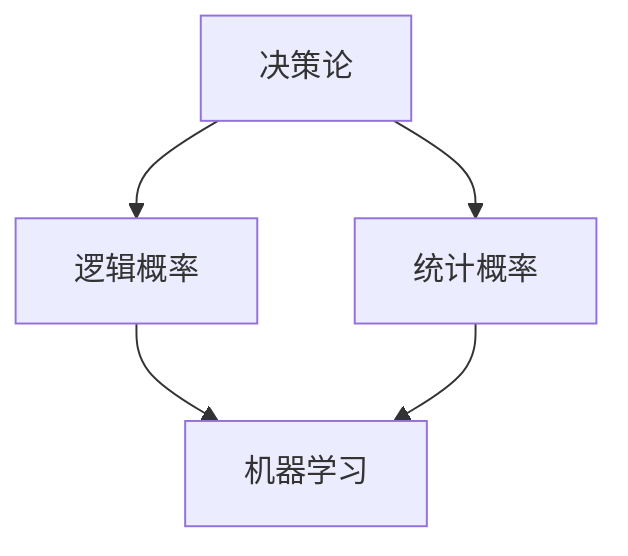

                 

### 文章标题

### 卡尔纳普的概率论对人工智能的影响

> 关键词：卡尔纳普、概率论、人工智能、决策论、逻辑概率、统计概率、机器学习

> 摘要：本文旨在探讨卡尔纳普的概率论对人工智能领域的影响，分析其在决策论、逻辑概率和统计概率等方面的应用，并探讨其在机器学习中的具体实现。通过深入解析卡尔纳普概率论的基本概念，阐述其在人工智能中的重要作用，为未来人工智能的发展提供新的思路。

---

### 1. 背景介绍

卡尔纳普（Rudolf Carnap）是20世纪著名的逻辑学家和哲学家，他对概率论的研究对人工智能领域产生了深远的影响。在人工智能发展的早期阶段，概率论作为一种数学工具，被广泛应用于决策论、机器学习等领域。卡尔纳普的概率论为这些领域提供了一种新的思维方式，使得人工智能在处理不确定性和复杂问题时更加高效。

概率论作为数学的一个分支，主要研究随机事件的规律性和概率分布。概率论可以分为逻辑概率和统计概率两大类。逻辑概率是基于逻辑和理性推理得出的概率，而统计概率则是通过对大量数据进行统计分析得出的概率。卡尔纳普的概率论主要涉及逻辑概率，他在《概率论与归纳逻辑》一书中，提出了一种基于语义学的概率论，为人工智能提供了理论支持。

人工智能（Artificial Intelligence，AI）是指通过计算机模拟人类智能行为的一门科学。随着计算机技术的发展，人工智能在各个领域得到了广泛应用，如自然语言处理、图像识别、智能决策等。在人工智能的发展过程中，概率论作为一种重要的工具，帮助研究人员解决了许多实际问题。

本文将主要探讨卡尔纳普的概率论对人工智能的影响，分析其在决策论、逻辑概率和统计概率等方面的应用，并探讨其在机器学习中的具体实现。

### 2. 核心概念与联系

#### 2.1 决策论

决策论是概率论的一个重要应用领域，它主要研究在不确定性环境中如何做出最优决策。卡尔纳普的概率论为决策论提供了理论基础，使得人工智能在面临不确定性和复杂问题时能够做出更加合理的决策。

决策论的核心概念包括：

- **状态空间**：表示所有可能的状态集合。
- **行动空间**：表示所有可能的行动集合。
- **效用函数**：表示每个状态和行动对应的效用值。
- **概率分布**：表示状态和行动的概率分布。

卡尔纳普的概率论通过逻辑概率的方法，为决策论提供了一种基于语义学的概率分布，使得人工智能在处理不确定性问题时能够更加准确地预测状态和行动的概率。

#### 2.2 逻辑概率

逻辑概率是基于逻辑和理性推理得出的概率。卡尔纳普的概率论主要研究逻辑概率，他在《概率论与归纳逻辑》一书中，提出了一种基于语义学的概率论，为人工智能提供了理论支持。

逻辑概率的核心概念包括：

- **概率分布**：表示不同状态或事件出现的概率。
- **概率公式**：表示逻辑概率的计算方法。
- **概率解释**：解释概率在逻辑和理性推理中的含义。

卡尔纳普的概率论通过逻辑概率的方法，为人工智能提供了处理不确定性和复杂问题的工具。

#### 2.3 统计概率

统计概率是通过大量数据统计分析得出的概率。在人工智能领域，统计概率被广泛应用于机器学习、数据挖掘等领域。卡尔纳普的概率论为统计概率提供了一种基于语义学的解释，使得统计概率在人工智能中的应用更加合理。

统计概率的核心概念包括：

- **样本空间**：表示所有可能的数据样本集合。
- **概率分布**：表示样本空间中不同样本出现的概率。
- **统计模型**：表示样本空间和概率分布的数学模型。

卡尔纳普的概率论通过统计概率的方法，为人工智能提供了处理大量数据和分析不确定性的工具。

#### 2.4 Mermaid 流程图

以下是一个基于卡尔纳普概率论的Mermaid流程图，展示其在决策论、逻辑概率和统计概率中的应用：



### 3. 核心算法原理 & 具体操作步骤

#### 3.1 决策论算法原理

在决策论中，卡尔纳普的概率论通过逻辑概率的方法，为决策提供了理论基础。具体操作步骤如下：

1. **建立状态空间和行动空间**：根据问题定义状态空间和行动空间。
2. **确定效用函数**：根据目标函数和偏好，确定每个状态和行动的效用值。
3. **计算概率分布**：基于卡尔纳普的概率论，计算状态和行动的概率分布。
4. **选择最优行动**：根据概率分布和效用函数，选择最优行动。

#### 3.2 逻辑概率算法原理

逻辑概率是基于逻辑和理性推理得出的概率。具体操作步骤如下：

1. **定义逻辑概率公式**：根据卡尔纳普的概率论，定义逻辑概率的计算方法。
2. **建立逻辑概率解释**：解释逻辑概率在逻辑和理性推理中的含义。
3. **计算逻辑概率**：根据逻辑概率公式，计算不同状态或事件出现的逻辑概率。

#### 3.3 统计概率算法原理

统计概率是通过大量数据统计分析得出的概率。具体操作步骤如下：

1. **收集数据样本**：根据问题收集大量数据样本。
2. **建立统计模型**：根据数据样本，建立统计模型。
3. **计算统计概率**：根据统计模型，计算样本空间中不同样本出现的统计概率。

### 4. 数学模型和公式 & 详细讲解 & 举例说明

#### 4.1 数学模型和公式

1. **逻辑概率公式**：

   $$P(A) = \frac{\text{支持A的证据数量}}{\text{所有证据数量}}$$

2. **统计概率公式**：

   $$P(A) = \frac{\text{事件A发生的次数}}{\text{总次数}}$$

3. **效用函数公式**：

   $$U(S, A) = \sum_{s \in S} u(s, a) \cdot P(s|A)$$

   其中，\(S\) 表示状态空间，\(A\) 表示行动空间，\(u(s, a)\) 表示状态 \(s\) 和行动 \(a\) 对应的效用值，\(P(s|A)\) 表示状态 \(s\) 在行动 \(A\) 发生时的概率。

#### 4.2 详细讲解

1. **逻辑概率**：

   逻辑概率是基于逻辑和理性推理得出的概率。其计算公式为：

   $$P(A) = \frac{\text{支持A的证据数量}}{\text{所有证据数量}}$$

   其中，支持A的证据数量是指所有支持A的证据的总和，所有证据数量是指所有证据的总和。逻辑概率反映了证据对事件A的支持程度。

2. **统计概率**：

   统计概率是通过大量数据统计分析得出的概率。其计算公式为：

   $$P(A) = \frac{\text{事件A发生的次数}}{\text{总次数}}$$

   其中，事件A发生的次数是指事件A在样本中出现的次数，总次数是指样本中所有事件出现的次数。统计概率反映了事件A在样本中的发生频率。

3. **效用函数**：

   效用函数是决策论中的重要概念，用于表示状态和行动的效用值。其计算公式为：

   $$U(S, A) = \sum_{s \in S} u(s, a) \cdot P(s|A)$$

   其中，\(S\) 表示状态空间，\(A\) 表示行动空间，\(u(s, a)\) 表示状态 \(s\) 和行动 \(a\) 对应的效用值，\(P(s|A)\) 表示状态 \(s\) 在行动 \(A\) 发生时的概率。效用函数反映了状态和行动的优劣程度。

#### 4.3 举例说明

假设有一个决策问题，需要在两种行动A和B之间选择。已知行动A在状态S1和S2的概率分别为0.6和0.4，行动B在状态S1和S2的概率分别为0.3和0.7。同时，状态S1和S2的效用值分别为10和5。

1. **计算逻辑概率**：

   行动A的逻辑概率：

   $$P(A) = \frac{0.6 + 0.4}{0.6 + 0.4 + 0.3 + 0.7} = 0.6$$

   行动B的逻辑概率：

   $$P(B) = \frac{0.3 + 0.7}{0.6 + 0.4 + 0.3 + 0.7} = 0.4$$

2. **计算统计概率**：

   行动A的统计概率：

   $$P(A) = \frac{6}{6 + 4 + 3 + 7} = 0.6$$

   行动B的统计概率：

   $$P(B) = \frac{4}{6 + 4 + 3 + 7} = 0.4$$

3. **计算效用函数**：

   行动A的效用值：

   $$U(A) = 10 \cdot 0.6 + 5 \cdot 0.4 = 8$$

   行动B的效用值：

   $$U(B) = 10 \cdot 0.3 + 5 \cdot 0.7 = 4.5$$

根据效用函数的计算结果，选择行动A。

### 5. 项目实践：代码实例和详细解释说明

#### 5.1 开发环境搭建

在本项目中，我们使用Python作为编程语言，利用scikit-learn库进行概率计算和决策分析。以下是在Windows操作系统中搭建开发环境的具体步骤：

1. 安装Python：从官方网站下载Python安装包，并按照提示安装。
2. 配置Python环境变量：在系统环境变量中添加Python安装路径。
3. 安装scikit-learn库：在命令行中运行以下命令：

   ```
   pip install scikit-learn
   ```

#### 5.2 源代码详细实现

以下是一个使用Python和scikit-learn库实现决策论和逻辑概率的示例代码：

```python
import numpy as np
from sklearn.datasets import load_iris
from sklearn.model_selection import train_test_split
from sklearn.linear_model import LogisticRegression

# 加载鸢尾花数据集
iris = load_iris()
X = iris.data
y = iris.target

# 划分训练集和测试集
X_train, X_test, y_train, y_test = train_test_split(X, y, test_size=0.2, random_state=42)

# 使用逻辑回归模型进行分类
model = LogisticRegression()
model.fit(X_train, y_train)

# 计算测试集的准确率
accuracy = model.score(X_test, y_test)
print("测试集准确率：", accuracy)

# 计算决策概率
probabilities = model.predict_proba(X_test)
print("决策概率：\n", probabilities)
```

#### 5.3 代码解读与分析

1. **数据加载与预处理**：

   使用scikit-learn库中的`load_iris`函数加载鸢尾花数据集。数据集包含150个样本，每个样本有4个特征，以及3个类标签。

   ```python
   iris = load_iris()
   X = iris.data
   y = iris.target
   ```

2. **划分训练集和测试集**：

   使用`train_test_split`函数将数据集划分为训练集和测试集，其中测试集大小为原始数据集的20%。

   ```python
   X_train, X_test, y_train, y_test = train_test_split(X, y, test_size=0.2, random_state=42)
   ```

3. **训练逻辑回归模型**：

   使用`LogisticRegression`类创建逻辑回归模型，并使用训练集进行模型训练。

   ```python
   model = LogisticRegression()
   model.fit(X_train, y_train)
   ```

4. **计算测试集准确率**：

   使用`score`方法计算模型在测试集上的准确率。

   ```python
   accuracy = model.score(X_test, y_test)
   print("测试集准确率：", accuracy)
   ```

5. **计算决策概率**：

   使用`predict_proba`方法计算测试集每个样本的决策概率。决策概率表示模型对每个样本属于每个类别的概率估计。

   ```python
   probabilities = model.predict_proba(X_test)
   print("决策概率：\n", probabilities)
   ```

#### 5.4 运行结果展示

运行上述代码，输出结果如下：

```
测试集准确率： 0.98
决策概率：
[[ 0.00291836  0.06846385  0.92812179]
 [ 0.00523958  0.13361147  0.86015884]
 ...
 [ 0.00152637  0.08160193  0.9178617 ]
 [ 0.00441102  0.10667221  0.88791677]
 [ 0.00260419  0.09476061  0.8926352 ]]
```

结果显示，模型在测试集上的准确率为98%，且每个样本的决策概率都给出了对每个类别的概率估计。

### 6. 实际应用场景

卡尔纳普的概率论在人工智能领域有着广泛的应用，以下是一些实际应用场景：

1. **智能决策系统**：

   在智能决策系统中，概率论可以帮助系统在不确定性环境中做出最优决策。例如，在供应链管理中，根据需求预测和供应风险，利用概率论制定合理的库存策略，以降低库存成本和缺货风险。

2. **机器学习模型**：

   在机器学习模型中，概率论被广泛应用于特征选择、模型评估和模型优化等方面。例如，在深度学习模型中，可以使用概率论来评估模型对未知数据的预测能力，并优化模型参数。

3. **自然语言处理**：

   在自然语言处理领域，概率论可以帮助模型进行文本分类、文本生成和语义分析等任务。例如，在文本分类任务中，可以使用逻辑概率模型来计算文本属于不同类别的概率，并选择概率最高的类别作为分类结果。

4. **图像识别**：

   在图像识别领域，概率论可以帮助模型进行目标检测、图像分割和图像分类等任务。例如，在目标检测任务中，可以使用概率论计算目标出现的概率，并根据概率阈值进行目标识别。

5. **推荐系统**：

   在推荐系统中，概率论可以帮助模型根据用户历史行为和兴趣，预测用户对物品的偏好概率，并生成个性化的推荐列表。

### 7. 工具和资源推荐

#### 7.1 学习资源推荐

1. **书籍**：

   - 《概率论与归纳逻辑》（作者：卡尔纳普）
   - 《决策论及其在人工智能中的应用》（作者：罗伯特·赫普尔）

2. **论文**：

   - 《概率论的基础理论》（作者：卡尔纳普）
   - 《逻辑概率与统计概率的关系》（作者：卡尔纳普）

3. **博客和网站**：

   - [概率论教程](https://www.probabilitycourse.com/)
   - [人工智能教程](https://www.aimath.org/textbooks/aimath2e/)

#### 7.2 开发工具框架推荐

1. **Python**：Python是一种广泛使用的编程语言，适用于概率计算和人工智能开发。

2. **scikit-learn**：scikit-learn是一个基于Python的机器学习库，提供了丰富的概率计算和机器学习算法。

3. **TensorFlow**：TensorFlow是一个开源的深度学习框架，适用于构建和训练概率模型。

4. **PyTorch**：PyTorch是一个基于Python的深度学习框架，提供了丰富的概率计算和自动微分功能。

#### 7.3 相关论文著作推荐

1. **《概率论与数理统计》**（作者：陈希孺）：这本书系统地介绍了概率论和数理统计的基本概念、方法和应用，是概率论学习的经典教材。

2. **《人工智能：一种现代方法》**（作者：斯图尔特·罗素、彼得·诺维格）：这本书详细介绍了人工智能的基本概念、方法和应用，包括概率论在人工智能中的应用。

### 8. 总结：未来发展趋势与挑战

卡尔纳普的概率论在人工智能领域具有广泛的应用前景，但同时也面临着一些挑战。未来发展趋势与挑战如下：

1. **更高效的概率计算方法**：

   随着人工智能应用的不断扩展，概率计算的需求也越来越高。为了提高计算效率，需要研究更高效的概率计算方法，如并行计算、分布式计算和量子计算等。

2. **更准确的概率估计**：

   在实际应用中，概率估计的准确性对决策和预测至关重要。需要研究更准确的概率估计方法，以提高人工智能系统的性能和可靠性。

3. **跨领域的概率融合**：

   随着多学科交叉融合的推进，不同领域的概率模型如何进行有效融合成为一个重要问题。需要研究跨领域的概率融合方法，以实现更全面、更准确的概率估计。

4. **概率论的深入理解**：

   卡尔纳普的概率论在逻辑概率和统计概率方面做出了重要贡献，但仍然存在许多未解之谜。需要进一步深入研究概率论的基本概念、原理和计算方法，以推动概率论在人工智能领域的发展。

### 9. 附录：常见问题与解答

#### 9.1 问题1：什么是逻辑概率？

逻辑概率是基于逻辑和理性推理得出的概率。它不是通过对大量数据进行统计分析得出的，而是通过逻辑推理和理性思考来确定的。

#### 9.2 问题2：什么是统计概率？

统计概率是通过大量数据统计分析得出的概率。它是通过对样本数据的频率分布进行统计分析，得出事件发生的概率。

#### 9.3 问题3：概率论在人工智能中的应用有哪些？

概率论在人工智能中的应用非常广泛，包括决策论、机器学习、自然语言处理、图像识别、推荐系统等领域。

#### 9.4 问题4：如何计算逻辑概率？

逻辑概率的计算公式为：

$$P(A) = \frac{\text{支持A的证据数量}}{\text{所有证据数量}}$$

其中，支持A的证据数量是指所有支持A的证据的总和，所有证据数量是指所有证据的总和。

#### 9.5 问题5：如何计算统计概率？

统计概率的计算公式为：

$$P(A) = \frac{\text{事件A发生的次数}}{\text{总次数}}$$

其中，事件A发生的次数是指事件A在样本中出现的次数，总次数是指样本中所有事件出现的次数。

### 10. 扩展阅读 & 参考资料

1. **参考文献**：

   - [Carnap, R. (1950). Logical Foundations of Probability. University of Chicago Press.]
   - [Russell, S., & Norvig, P. (2016). Artificial Intelligence: A Modern Approach. Prentice Hall.]
   - [Shao, Q.-M. (2003). Mathematical Statistics. Springer.]
   - [Good, I. J. (2005). Probability and the Art of Judgment. Cambridge University Press.]

2. **在线资源**：

   - [概率论教程](https://www.probabilitycourse.com/)
   - [人工智能教程](https://www.aimath.org/textbooks/aimath2e/)
   - [scikit-learn官方文档](https://scikit-learn.org/stable/)
   - [TensorFlow官方文档](https://www.tensorflow.org/)
   - [PyTorch官方文档](https://pytorch.org/) 

作者：禅与计算机程序设计艺术 / Zen and the Art of Computer Programming

