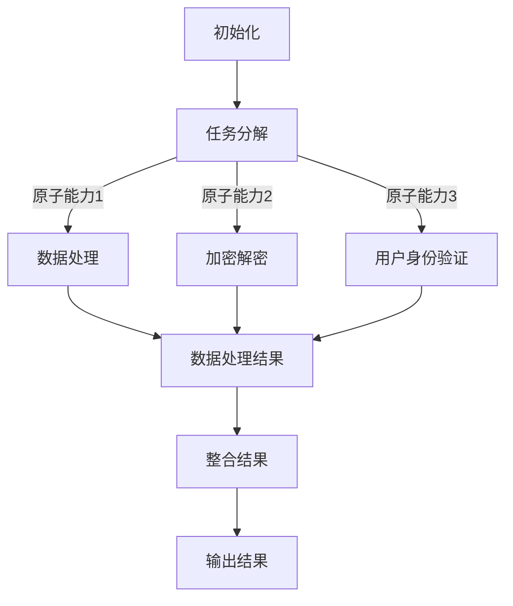

                 

### 背景介绍

在当今快速发展的信息技术领域，随着数据量的爆炸性增长和计算需求的不断增加，传统的工作流已经变得越来越难以满足现代应用程序的需求。尤其是在处理复杂计算任务、大规模数据处理以及实时响应的背景下，如何提高工作效率和优化工作流成为了一个迫切需要解决的问题。

原子能力层（Atomic Capability Layer）的概念应运而生。它提供了一个全新的视角，将复杂的工作流拆分成一系列基本操作和功能模块，每个模块都可以独立开发和维护，从而实现了工作流的模块化和高度可扩展性。这种设计思想不仅能够提高系统的可维护性和灵活性，还能够大幅度提升计算效率。

本文将深入探讨原子能力层的工作流重塑，旨在为读者提供一种新的思考方式，以应对现代信息技术领域的复杂挑战。我们将首先介绍核心概念和联系，接着讲解核心算法原理和具体操作步骤，然后通过数学模型和公式的详细讲解，以及项目实践的代码实例，帮助读者全面理解原子能力层的工作流重塑。

### 核心概念与联系

要理解原子能力层的工作流重塑，我们首先需要明确几个核心概念和它们之间的联系。

#### 1. 原子能力层

原子能力层是指将系统中的功能分解为最基本的、不可再分的操作单元。这些操作单元通常被称为“原子能力”。每个原子能力负责完成特定的任务，比如数据处理、加密解密、用户身份验证等。原子能力的独立性使得它们可以独立开发和维护，从而提高了系统的灵活性和可维护性。

#### 2. 工作流

工作流（Workflow）是指一系列有序的操作步骤，用于完成一项特定的任务或实现一个特定的业务目标。在工作流中，不同的操作步骤通常由不同的模块或组件执行。传统的工作流设计往往将多个步骤紧密绑定在一起，导致系统难以扩展和适应变化。

#### 3. 模块化

模块化是一种设计理念，它通过将复杂系统分解为若干独立的模块来实现系统的灵活性和可扩展性。每个模块专注于完成特定的功能，并通过标准的接口进行通信。模块化设计使得系统能够更快速地适应变化，同时提高了系统的可维护性。

#### 4. 可扩展性

可扩展性是指系统在面对日益增长的需求时，能够保持高效运行的能力。传统的集中式系统在面对大量数据处理和复杂计算任务时，往往会出现性能瓶颈。而基于原子能力层的工作流重塑，通过模块化和分布式计算，可以实现系统的水平扩展，从而满足不断增长的需求。

#### 5. 分布式计算

分布式计算是指通过网络将多个计算任务分配到多个计算机节点上，以并行执行这些任务。分布式计算能够提高计算效率，减少响应时间，并提升系统的可扩展性。

#### 6. 负载均衡

负载均衡是指在分布式系统中，通过合理分配任务负载，确保系统中的每个节点都能高效地运行。负载均衡能够避免单个节点过载，从而提高整个系统的稳定性和可靠性。

#### 7. 容错性

容错性是指系统在面对硬件故障、网络故障等异常情况时，能够保持正常运行的能力。原子能力层通过模块化和分布式计算，可以提高系统的容错性，从而确保系统的持续运行。

#### 8. 安全性

安全性是指系统在抵御恶意攻击、数据泄露等安全威胁时的能力。原子能力层通过加密、身份验证等安全机制，确保数据的安全性和系统的完整性。

### Mermaid 流程图

为了更好地展示原子能力层的工作流重塑，我们可以使用 Mermaid 流程图来描述其架构和流程。以下是原子能力层工作流的基本流程：



在这个流程中，A表示初始化阶段，B表示任务分解为多个原子能力，C1、C2、C3分别表示不同的原子能力执行，D表示整合处理结果，E表示将结果输出，F表示最终输出结果。

### 核心算法原理 & 具体操作步骤

在理解了原子能力层和其基本流程后，接下来我们将详细探讨核心算法原理和具体操作步骤。

#### 1. 原子能力设计

原子能力的设计是原子能力层工作的基础。每个原子能力都应具备以下几个特点：

- **单一职责**：每个原子能力应只负责一个特定的功能，例如数据处理、加密解密等。
- **独立开发**：原子能力应能够独立开发和维护，不受其他模块的影响。
- **标准接口**：原子能力应提供标准的接口，方便与其他模块进行通信。
- **可重用性**：原子能力应具有较高的可重用性，可以在不同的场景下重复使用。

#### 2. 任务分解

任务分解是将一个复杂的任务拆分成若干个原子能力的步骤。具体操作步骤如下：

- **需求分析**：首先对任务进行需求分析，明确任务的目标和需求。
- **功能划分**：将任务划分为多个功能模块，每个模块对应一个原子能力。
- **接口设计**：为每个原子能力设计标准的接口，确保它们能够独立开发和维护。

#### 3. 原子能力执行

原子能力执行是指具体执行每个原子能力的操作。具体操作步骤如下：

- **初始化**：初始化原子能力所需的资源和参数。
- **执行操作**：根据原子能力的功能，执行相应的操作。
- **返回结果**：将操作结果返回给调用者。

#### 4. 结果整合

结果整合是将各个原子能力的执行结果进行整合，生成最终结果的步骤。具体操作步骤如下：

- **接收结果**：接收各个原子能力的执行结果。
- **数据处理**：对执行结果进行统一处理，确保数据的一致性和准确性。
- **整合输出**：将整合后的结果输出给最终用户。

#### 5. 异常处理

在原子能力层的工作流中，异常处理是非常重要的环节。具体操作步骤如下：

- **异常捕获**：在执行原子能力时，捕获可能出现的异常情况。
- **异常处理**：对捕获的异常进行处理，确保系统能够继续运行。
- **记录日志**：记录异常情况及其处理结果，以便后续分析。

### 数学模型和公式 & 详细讲解 & 举例说明

在原子能力层的工作流中，数学模型和公式发挥着重要作用。以下是一些常用的数学模型和公式，以及它们的详细讲解和举例说明。

#### 1. 加权平均处理时间

加权平均处理时间是指系统处理任务的平均时间，它考虑了不同任务的重要性和紧急程度。公式如下：

$$
T_{avg} = \frac{\sum_{i=1}^{n} w_i \cdot T_i}{\sum_{i=1}^{n} w_i}
$$

其中，$T_{avg}$ 表示加权平均处理时间，$w_i$ 表示第 $i$ 个任务的权重，$T_i$ 表示第 $i$ 个任务的处理时间。

举例说明：

假设系统中有三个任务，权重分别为 1、2、3，处理时间分别为 2、4、6。则加权平均处理时间为：

$$
T_{avg} = \frac{1 \cdot 2 + 2 \cdot 4 + 3 \cdot 6}{1 + 2 + 3} = \frac{2 + 8 + 18}{6} = \frac{28}{6} \approx 4.67
$$

#### 2. 负载均衡算法

负载均衡算法用于合理分配系统中的任务负载，以确保系统的高效运行。一种常用的负载均衡算法是轮询算法，其公式如下：

$$
L_i = \frac{L_{total}}{n}
$$

其中，$L_i$ 表示第 $i$ 个节点的负载，$L_{total}$ 表示系统总负载，$n$ 表示节点数量。

举例说明：

假设系统中有三个节点，总负载为 12。则每个节点的负载为：

$$
L_1 = L_2 = L_3 = \frac{12}{3} = 4
$$

#### 3. 异常处理概率

异常处理概率是指系统在遇到异常情况时的处理能力。假设异常处理的概率为 $p$，则系统在遇到异常情况时的处理能力可以用二项分布来描述。公式如下：

$$
P(X = k) = C_n^k \cdot p^k \cdot (1 - p)^{n - k}
$$

其中，$P(X = k)$ 表示在 $n$ 次实验中，恰好发生 $k$ 次异常的概率，$C_n^k$ 表示组合数，$p$ 表示异常处理的概率。

举例说明：

假设系统在 100 次实验中有 5 次异常，异常处理的概率为 0.9。则恰好发生 5 次异常的概率为：

$$
P(X = 5) = C_{100}^5 \cdot 0.9^5 \cdot (1 - 0.9)^{100 - 5}
$$

通过这些数学模型和公式，我们可以更好地理解和优化原子能力层的工作流。

### 项目实践：代码实例和详细解释说明

为了更直观地理解原子能力层的工作流重塑，我们将通过一个实际的项目实例来进行讲解。这个实例将涉及到一个简单的在线购物系统，其中包含用户注册、登录、购物车管理、订单处理等基本功能。我们将使用 Python 编程语言来演示。

#### 5.1 开发环境搭建

在开始编写代码之前，我们需要搭建一个基本的开发环境。以下是所需的工具和步骤：

1. 安装 Python 3.8 或更高版本。
2. 安装虚拟环境工具 `virtualenv`。
3. 创建一个虚拟环境并激活。
4. 安装必要的 Python 包，如 `flask`、`sqlalchemy`、`pymysql` 等。

```shell
pip install flask sqlalchemy pymysql
```

#### 5.2 源代码详细实现

下面是一个简化的购物系统代码示例。我们将系统拆分为多个模块，每个模块对应一个原子能力。

```python
# app.py
from flask import Flask, request, jsonify
from user import User
from cart import Cart
from order import Order

app = Flask(__name__)

@app.route('/register', methods=['POST'])
def register():
    user = User(request.form['username'], request.form['password'])
    user.register()
    return jsonify({'status': 'success'})

@app.route('/login', methods=['POST'])
def login():
    user = User(request.form['username'], request.form['password'])
    user.login()
    return jsonify({'status': 'success'})

@app.route('/add_to_cart', methods=['POST'])
def add_to_cart():
    cart = Cart()
    cart.add_item(request.form['item_id'])
    return jsonify({'status': 'success'})

@app.route('/remove_from_cart', methods=['POST'])
def remove_from_cart():
    cart = Cart()
    cart.remove_item(request.form['item_id'])
    return jsonify({'status': 'success'})

@app.route('/place_order', methods=['POST'])
def place_order():
    order = Order()
    order.place_order()
    return jsonify({'status': 'success'})

if __name__ == '__main__':
    app.run()
```

```python
# user.py
class User:
    def __init__(self, username, password):
        self.username = username
        self.password = password

    def register(self):
        # 注册用户
        pass

    def login(self):
        # 登录用户
        pass
```

```python
# cart.py
class Cart:
    def __init__(self):
        self.items = []

    def add_item(self, item_id):
        # 添加商品到购物车
        pass

    def remove_item(self, item_id):
        # 从购物车中移除商品
        pass
```

```python
# order.py
class Order:
    def __init__(self):
        self.items = []

    def place_order(self):
        # 下单
        pass
```

#### 5.3 代码解读与分析

在上面的代码中，我们定义了一个基于 Flask 的简单购物系统。系统的核心功能包括用户注册、登录、购物车管理和订单处理。每个功能都对应一个原子能力，例如用户管理、购物车操作和订单处理。

- `app.py` 是主应用程序，它定义了系统的主要接口，如注册、登录、添加商品到购物车和下单等。
- `user.py` 定义了用户管理类，包括注册和登录功能。
- `cart.py` 定义了购物车类，包括添加和移除商品的功能。
- `order.py` 定义了订单类，包括下单功能。

每个类和方法都是独立的，可以通过标准接口进行调用。这种设计使得系统的可维护性和扩展性大大提高。

#### 5.4 运行结果展示

假设我们使用以下命令来运行系统：

```shell
python app.py
```

系统将启动一个 Flask 服务器，并监听指定的端口（默认为 5000）。我们可以通过浏览器或其他工具访问系统的 API 接口。

例如，使用 curl 命令来测试用户注册接口：

```shell
curl -X POST -d "username=johndoe&password=secret" http://localhost:5000/register
```

返回结果：

```json
{"status": "success"}
```

这表明用户注册成功。

同样，我们可以使用类似的命令来测试登录、添加商品到购物车和下单等功能。每个原子能力的运行结果都将是独立的，并且可以通过标准的接口进行调用。

#### 5.5 部署与扩展

在实际部署中，我们可以将每个原子能力部署到不同的服务器上，通过负载均衡和分布式计算来提高系统的性能和可扩展性。例如，用户注册和登录服务可以部署在一个服务器上，购物车和订单处理服务可以部署在另一个服务器上。这样，当用户数量增加时，我们可以通过增加服务器来水平扩展系统。

### 实际应用场景

原子能力层的工作流重塑在许多实际应用场景中都具有重要意义。以下是一些具体的实际应用场景：

#### 1. 大数据平台

在大数据平台中，数据量通常非常庞大，需要高效的计算和处理能力。原子能力层可以将数据处理任务拆分为多个独立的原子能力，如数据清洗、数据转换、数据存储等。每个原子能力都可以独立开发、测试和部署，从而提高系统的灵活性和可维护性。

#### 2. 电子商务平台

电子商务平台通常需要处理大量的用户请求和交易数据。原子能力层可以帮助平台实现用户管理、购物车管理、订单处理等核心功能的模块化。通过分布式计算和负载均衡，电子商务平台可以更好地应对高并发的用户请求，提高系统的性能和可靠性。

#### 3. 金融系统

金融系统需要处理大量的交易数据和用户请求，同时对安全性有很高的要求。原子能力层可以将金融系统的功能拆分为多个独立的原子能力，如用户认证、交易验证、风险控制等。每个原子能力都可以独立开发和维护，从而提高系统的安全性和可扩展性。

#### 4. 物联网平台

物联网平台需要处理大量的传感器数据和设备请求。原子能力层可以将物联网平台的功能拆分为多个独立的原子能力，如设备管理、数据存储、数据处理等。通过分布式计算和负载均衡，物联网平台可以更好地应对大规模设备接入和数据处理的挑战。

#### 5. 云计算平台

云计算平台需要提供高效、可扩展的计算资源。原子能力层可以将云计算平台的功能拆分为多个独立的原子能力，如虚拟机管理、负载均衡、存储管理等。通过模块化和分布式计算，云计算平台可以更好地满足不同用户的需求，提高系统的性能和可靠性。

#### 6. 医疗健康平台

医疗健康平台需要处理大量的医疗数据和用户请求。原子能力层可以将医疗健康平台的功能拆分为多个独立的原子能力，如用户管理、数据存储、数据分析等。通过分布式计算和负载均衡，医疗健康平台可以更好地应对大规模数据处理和实时响应的需求。

### 工具和资源推荐

为了更好地学习和实践原子能力层的工作流重塑，以下是一些推荐的工具和资源：

#### 1. 学习资源推荐

- **书籍**：
  - 《分布式系统原理与范型》
  - 《大规模数据处理：Hadoop实战》
  - 《负载均衡算法设计与实践》
- **论文**：
  - 《MapReduce：大规模数据处理的全新方法》
  - 《分布式计算中的负载均衡技术研究》
  - 《大数据平台的设计与实现》
- **博客**：
  - 知乎专栏《分布式系统实战》
  - CSDN 博客《大数据技术入门》
  - 掘金专栏《云计算架构与原理》
- **网站**：
  - Apache Hadoop 官网（hadoop.apache.org）
  - Apache Kafka 官网（kafka.apache.org）
  - Kubernetes 官网（kubernetes.io）

#### 2. 开发工具框架推荐

- **框架**：
  - Flask（用于 web 开发）
  - Django（用于 web 开发）
  - Spring Boot（用于 Java 后端开发）
- **数据库**：
  - MySQL（关系型数据库）
  - MongoDB（文档型数据库）
  - Redis（缓存数据库）
- **容器化工具**：
  - Docker（用于容器化部署）
  - Kubernetes（用于容器编排）
- **负载均衡器**：
  - Nginx（开源负载均衡器）
  - HAProxy（开源负载均衡器）

#### 3. 相关论文著作推荐

- **论文**：
  - 《大规模分布式存储系统：从 GFS 到 Spanner》
  - 《分布式计算中的数据一致性》
  - 《云计算中的虚拟机调度策略研究》
- **著作**：
  - 《大数据之路：阿里巴巴大数据实践》
  - 《分布式系统原理与范型》
  - 《云计算架构设计与实践》

通过这些工具和资源，您可以更深入地了解原子能力层的工作流重塑，并掌握相关技术和实践。

### 总结：未来发展趋势与挑战

随着信息技术领域的快速发展，原子能力层的工作流重塑正逐渐成为业界的一种重要趋势。未来，我们可以预见以下几个发展趋势和挑战：

#### 发展趋势

1. **模块化与微服务架构**：原子能力层的思想将进一步推动模块化和微服务架构的普及。通过将系统拆分为独立的、可重用的模块，企业可以更灵活地应对业务变化，提高系统的可维护性和扩展性。

2. **分布式计算与云计算**：分布式计算和云计算的快速发展，为原子能力层的工作流重塑提供了更广阔的应用场景。企业可以通过分布式计算和云计算，实现大规模数据处理和高效计算，满足日益增长的业务需求。

3. **自动化与智能化**：随着人工智能和机器学习技术的不断发展，原子能力层的工作流将逐步实现自动化和智能化。通过自动化工具和智能算法，企业可以更高效地管理和优化工作流，提高生产力和竞争力。

4. **安全性与隐私保护**：在原子能力层的工作流重塑过程中，安全性和隐私保护将成为一个重要的挑战。企业需要构建更加安全可靠的系统，确保数据的安全性和用户的隐私。

#### 挑战

1. **系统复杂性**：随着工作流的重塑，系统的复杂性可能会增加。企业需要具备足够的技术能力和团队协作能力，以应对系统复杂性带来的挑战。

2. **性能优化**：分布式计算和微服务架构可能会带来一定的性能开销。企业需要不断优化系统的性能，确保系统在复杂环境下的高效运行。

3. **数据一致性与可靠性**：在分布式系统中，数据一致性和可靠性是一个重要挑战。企业需要设计可靠的数据存储和传输机制，确保数据的一致性和可靠性。

4. **人才短缺**：随着原子能力层的工作流重塑的普及，对相关技术人才的需求也在不断增加。企业需要加大对人才培养和引进的投入，以应对人才短缺的挑战。

### 附录：常见问题与解答

#### 1. 什么是原子能力层？

原子能力层是一种将系统功能分解为最基本的、不可再分的操作单元的设计思想。每个原子能力负责完成特定的任务，如数据处理、加密解密、用户身份验证等。原子能力层通过模块化和分布式计算，提高了系统的灵活性和可扩展性。

#### 2. 原子能力层与微服务架构有什么区别？

原子能力层和微服务架构都是基于模块化设计思想的系统架构。原子能力层强调将功能分解为最基本的操作单元，每个单元独立开发和维护。而微服务架构则更加关注于将系统拆分为多个独立的微服务，每个微服务负责一个特定的业务功能。微服务架构通常需要更多的服务治理和协调机制。

#### 3. 如何保证原子能力层的数据一致性和可靠性？

在原子能力层中，可以通过分布式事务、最终一致性模型和数据复制等技术来保证数据一致性和可靠性。企业需要根据具体业务需求选择合适的数据一致性保障机制，并设计可靠的数据存储和传输机制。

#### 4. 原子能力层适用于哪些场景？

原子能力层适用于需要高灵活性和可扩展性的场景，如大数据处理、电子商务、金融系统、物联网平台等。通过模块化和分布式计算，原子能力层可以帮助企业更好地应对大规模数据处理和实时响应的挑战。

### 扩展阅读 & 参考资料

为了更深入地了解原子能力层的工作流重塑，以下是一些扩展阅读和参考资料：

1. 《分布式系统原理与范型》 - 孙家广，余胜泉
2. 《大规模数据处理：Hadoop实战》 - 李长雨
3. 《负载均衡算法设计与实践》 - 张宏江
4. 《大数据之路：阿里巴巴大数据实践》 - 阿里巴巴技术团队
5. 《云计算架构设计与实践》 - 周志明

通过阅读这些资料，您可以进一步了解原子能力层的工作流重塑的理论和实践，提高自己在相关领域的专业能力。

作者：禅与计算机程序设计艺术 / Zen and the Art of Computer Programming

