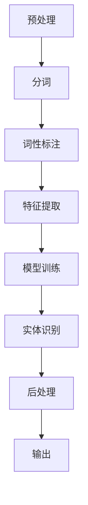

                 

### 1. 背景介绍

#### 1.1 命名实体识别（NER）的背景

命名实体识别（Named Entity Recognition，简称NER）是一种自然语言处理（Natural Language Processing，简称NLP）技术，旨在自动地从文本中识别出具有特定意义的实体。这些实体可以是人名、地点、组织机构、时间、日期、数字等。NER在多个领域具有重要的应用价值，如信息提取、文本摘要、问答系统、搜索引擎优化等。

NER的历史可以追溯到20世纪60年代，当时研究人员开始探索如何通过规则和统计方法来识别文本中的实体。早期的NER方法主要依赖于基于词典的规则系统，这些系统通过预定义的规则来匹配文本中的实体。随着计算机性能的提升和数据量的增加，统计模型逐渐成为NER研究的主流。

#### 1.2 传统NER方法

传统的NER方法可以分为基于规则的方法和基于统计的方法。

**基于规则的方法**：这种方法依赖于一套预定义的规则来识别实体。这些规则可以是基于语法、词频、上下文等特征的。例如，一个简单的规则可能是“如果单词后面跟着地名，那么该单词可能是人名”。尽管这种方法在某些特定领域表现出色，但其缺点是规则编写复杂，难以适应多变的语言环境和大规模数据。

**基于统计的方法**：这种方法通过分析大量的标注数据，使用统计模型来学习实体识别的模式。其中，隐马尔可夫模型（HMM）和条件随机场（CRF）是最常用的两种模型。HMM基于状态转移概率和发射概率来预测文本中的标签序列，而CRF则通过引入条件依赖关系来提高模型的准确性。

#### 1.3 深度学习方法在NER中的应用

深度学习方法的兴起为NER带来了革命性的变化。深度学习模型能够自动从大量数据中学习复杂的特征表示，从而无需人工编写规则或手动标注特征。在NER中，深度学习方法主要分为以下几种：

**递归神经网络（RNN）**：RNN是一种能够处理序列数据的神经网络，它通过循环单元来处理前一个时间步的信息，从而捕捉文本中的长期依赖关系。然而，传统的RNN存在梯度消失和梯度爆炸等问题。

**长短时记忆网络（LSTM）**：LSTM是RNN的一种改进，通过引入门控机制来避免梯度消失问题。这使得LSTM能够学习长序列数据中的依赖关系。

**双向递归神经网络（Bi-RNN）**：Bi-RNN通过同时考虑文本的前后信息，提高了模型对序列数据的处理能力。

**卷积神经网络（CNN）**：CNN是一种用于图像识别的神经网络，但近年来也广泛应用于NLP领域。CNN通过局部卷积操作来捕捉文本中的局部特征。

**深度神经网络（DNN）**：DNN是一种多层感知机模型，通过逐层提取特征来表示文本。与CNN和RNN相比，DNN在NER任务中表现较弱，但结合其他模型（如Bi-RNN或CNN）可以发挥更好的效果。

#### 1.4 本文结构

本文将首先介绍NER的核心概念与联系，然后详细讲解深度学习方法在NER中的应用，包括数学模型和具体操作步骤。接着，我们将通过一个实际项目实践来展示如何使用深度学习方法实现NER，并分析其实际效果。随后，我们将探讨NER在实际应用场景中的使用，并提供一些实用的工具和资源推荐。最后，本文将总结NER的未来发展趋势与挑战，并给出一些常见问题与解答。

通过上述背景介绍，我们可以清晰地看到NER在自然语言处理中的重要地位，以及深度学习如何为NER带来了革命性的变化。接下来的部分，我们将深入探讨NER的核心概念与联系，帮助读者更好地理解这一领域。

## 1. 背景介绍

#### 1.1 命名实体识别（NER）的背景

命名实体识别（Named Entity Recognition，简称NER）是一种自然语言处理（Natural Language Processing，简称NLP）技术，旨在自动地从文本中识别出具有特定意义的实体。这些实体可以是人名、地点、组织机构、时间、日期、数字等。NER在多个领域具有重要的应用价值，如信息提取、文本摘要、问答系统、搜索引擎优化等。

NER的历史可以追溯到20世纪60年代，当时研究人员开始探索如何通过规则和统计方法来识别文本中的实体。早期的NER方法主要依赖于基于词典的规则系统，这些系统通过预定义的规则来匹配文本中的实体。例如，一个简单的规则可能是“如果单词后面跟着地名，那么该单词可能是人名”。尽管这种方法在某些特定领域表现出色，但其缺点是规则编写复杂，难以适应多变的语言环境和大规模数据。

随着计算机性能的提升和数据量的增加，统计模型逐渐成为NER研究的主流。20世纪80年代，隐马尔可夫模型（HMM）被广泛应用于NER任务。HMM基于状态转移概率和发射概率来预测文本中的标签序列，但存在一些局限性，如难以建模序列之间的长距离依赖关系。

21世纪初，随着深度学习技术的兴起，深度学习方法开始逐渐应用于NER任务。深度学习模型能够自动从大量数据中学习复杂的特征表示，从而无需人工编写规则或手动标注特征。在NER中，深度学习方法主要分为以下几种：

- **递归神经网络（RNN）**：RNN是一种能够处理序列数据的神经网络，它通过循环单元来处理前一个时间步的信息，从而捕捉文本中的长期依赖关系。然而，传统的RNN存在梯度消失和梯度爆炸等问题。

- **长短时记忆网络（LSTM）**：LSTM是RNN的一种改进，通过引入门控机制来避免梯度消失问题。这使得LSTM能够学习长序列数据中的依赖关系。

- **双向递归神经网络（Bi-RNN）**：Bi-RNN通过同时考虑文本的前后信息，提高了模型对序列数据的处理能力。

- **卷积神经网络（CNN）**：CNN是一种用于图像识别的神经网络，但近年来也广泛应用于NLP领域。CNN通过局部卷积操作来捕捉文本中的局部特征。

- **深度神经网络（DNN）**：DNN是一种多层感知机模型，通过逐层提取特征来表示文本。与CNN和RNN相比，DNN在NER任务中表现较弱，但结合其他模型（如Bi-RNN或CNN）可以发挥更好的效果。

#### 1.2 传统NER方法

传统的NER方法可以分为基于规则的方法和基于统计的方法。

**基于规则的方法**：这种方法依赖于一套预定义的规则来识别实体。这些规则可以是基于语法、词频、上下文等特征的。例如，一个简单的规则可能是“如果单词后面跟着地名，那么该单词可能是人名”。尽管这种方法在某些特定领域表现出色，但其缺点是规则编写复杂，难以适应多变的语言环境和大规模数据。

**基于统计的方法**：这种方法通过分析大量的标注数据，使用统计模型来学习实体识别的模式。其中，隐马尔可夫模型（HMM）和条件随机场（CRF）是最常用的两种模型。HMM基于状态转移概率和发射概率来预测文本中的标签序列，而CRF则通过引入条件依赖关系来提高模型的准确性。

**隐马尔可夫模型（HMM）**：HMM是一种基于概率的模型，它通过状态转移概率和发射概率来建模文本中的标签序列。HMM适用于短文本序列的建模，但在处理长序列数据时存在局限性。

**条件随机场（CRF）**：CRF是一种基于图的模型，它通过引入条件依赖关系来建模文本中的标签序列。CRF能够处理长序列数据，并且在NER任务中表现出色。

#### 1.3 深度学习方法在NER中的应用

深度学习方法的兴起为NER带来了革命性的变化。深度学习模型能够自动从大量数据中学习复杂的特征表示，从而无需人工编写规则或手动标注特征。在NER中，深度学习方法主要分为以下几种：

**递归神经网络（RNN）**：RNN是一种能够处理序列数据的神经网络，它通过循环单元来处理前一个时间步的信息，从而捕捉文本中的长期依赖关系。然而，传统的RNN存在梯度消失和梯度爆炸等问题。

**长短时记忆网络（LSTM）**：LSTM是RNN的一种改进，通过引入门控机制来避免梯度消失问题。这使得LSTM能够学习长序列数据中的依赖关系。

**双向递归神经网络（Bi-RNN）**：Bi-RNN通过同时考虑文本的前后信息，提高了模型对序列数据的处理能力。

**卷积神经网络（CNN）**：CNN是一种用于图像识别的神经网络，但近年来也广泛应用于NLP领域。CNN通过局部卷积操作来捕捉文本中的局部特征。

**深度神经网络（DNN）**：DNN是一种多层感知机模型，通过逐层提取特征来表示文本。与CNN和RNN相比，DNN在NER任务中表现较弱，但结合其他模型（如Bi-RNN或CNN）可以发挥更好的效果。

#### 1.4 本文结构

本文将首先介绍NER的核心概念与联系，然后详细讲解深度学习方法在NER中的应用，包括数学模型和具体操作步骤。接着，我们将通过一个实际项目实践来展示如何使用深度学习方法实现NER，并分析其实际效果。随后，我们将探讨NER在实际应用场景中的使用，并提供一些实用的工具和资源推荐。最后，本文将总结NER的未来发展趋势与挑战，并给出一些常见问题与解答。

通过上述背景介绍，我们可以清晰地看到NER在自然语言处理中的重要地位，以及深度学习如何为NER带来了革命性的变化。接下来的部分，我们将深入探讨NER的核心概念与联系，帮助读者更好地理解这一领域。

## 2. 核心概念与联系

在深入探讨深度学习方法在命名实体识别（NER）中的应用之前，我们需要了解NER的核心概念与联系。这些概念不仅为我们提供了对NER任务的理解，而且为后续的算法原理和操作步骤提供了基础。

### 2.1 命名实体识别（NER）的核心概念

**命名实体（Named Entity）**：命名实体是指文本中具有特定意义的实体，如人名、地点、组织机构、时间、日期等。它们是NER任务的目标，即从文本中识别出这些实体。

**词（Token）**：文本中的每个单词或符号都称为词。在NER任务中，词是基础元素，每个词都需要被标注为实体或非实体。

**标签（Label）**：在NER中，每个词都被赋予一个标签，用于表示这个词是否是命名实体以及具体的实体类型。常见的标签包括`B-PER`（指示人名的开始）、`I-PER`（指示人名的中间部分）、`O`（指示非实体）等。

**标签序列（Label Sequence）**：NER任务的目标是预测一个词序列的标签序列。例如，给定文本“北京是中国的首都”，我们希望预测出标签序列`[O, B-LOC, I-LOC, O, B-LOC, I-LOC, O, B-ORG, I-ORG]`。

**实体边界（Entity Boundary）**：实体边界是指实体在文本中的起始位置和结束位置。例如，在文本“谷歌公司位于硅谷”中，“谷歌”是实体，“公司”是另一个实体，“位于硅谷”描述了这两个实体的位置关系。

**命名实体识别（NER）任务**：NER任务是一个序列标注问题，其目标是给定一个词序列，输出一个对应的标签序列。序列标注问题可以表示为：

\[ y = f(x) \]

其中，\( x \) 是词序列，\( y \) 是标签序列，\( f \) 是一个映射函数，用于将词序列映射到标签序列。

### 2.2 NER的框架与流程

NER的框架通常包括以下步骤：

1. **预处理**：包括分词、词性标注、去除停用词等，以提高后续模型的性能。
2. **特征提取**：从文本中提取特征，如词袋、词嵌入、字符特征等，用于训练模型。
3. **模型训练**：使用提取的特征训练NER模型，常用的模型包括RNN、LSTM、Bi-LSTM、CRF等。
4. **实体识别**：使用训练好的模型对新的文本进行实体识别，输出标签序列。
5. **后处理**：对识别结果进行后处理，如合并相邻的实体标签、去除错误标注等。

### 2.3 Mermaid 流程图表示

为了更好地理解NER的框架和流程，我们可以使用Mermaid流程图来表示NER的核心步骤。以下是一个简化的NER流程图：



在这个流程图中，每个节点表示NER的一个步骤，箭头表示步骤之间的依赖关系。预处理步骤包括分词和词性标注，这些步骤有助于提取文本中的有效信息。特征提取步骤从文本中提取特征，用于训练NER模型。模型训练步骤使用提取的特征来训练模型，实体识别步骤使用训练好的模型对文本进行实体识别。最后，后处理步骤对识别结果进行修正和优化，以提高NER的准确性和可靠性。

### 2.4 NER与其他NLP任务的联系

NER是自然语言处理中的重要组成部分，它与许多其他NLP任务密切相关。以下是一些重要的联系：

- **词性标注（POS Tagging）**：词性标注是NER的前置任务，它为NER提供了词性信息，有助于NER模型更好地理解文本。
- **关系抽取（Relation Extraction）**：关系抽取是识别文本中实体之间的关系，如“比尔·盖茨是微软的创始人”。NER为关系抽取提供了实体信息。
- **文本分类（Text Classification）**：文本分类是一种将文本分类到预定义类别中的任务，NER中的实体识别有助于提高文本分类的准确性。
- **问答系统（Question Answering）**：问答系统需要理解问题中的实体和关系，NER提供了问题理解和回答生成的重要信息。

通过上述核心概念与联系的分析，我们可以更深入地理解NER的任务和流程，为后续的深度学习方法讲解和项目实践奠定了基础。

### 3. 核心算法原理 & 具体操作步骤

在了解了NER的核心概念与联系之后，我们将深入探讨深度学习方法在NER任务中的应用，包括核心算法原理和具体操作步骤。深度学习方法在NER中扮演着至关重要的角色，它们能够自动从大量数据中学习复杂的特征表示，从而实现高效、准确的命名实体识别。

#### 3.1 递归神经网络（RNN）在NER中的应用

递归神经网络（RNN）是处理序列数据的一种神经网络，它在NER任务中有着广泛的应用。RNN通过重复使用隐藏状态来处理序列中的每个时间步，从而捕捉序列中的长期依赖关系。

**RNN的基本结构**：

1. **输入层**：输入层接收词嵌入向量，每个词嵌入向量表示一个词的语义信息。
2. **隐藏层**：隐藏层包含一系列的神经元，每个神经元负责处理前一个时间步的隐藏状态。
3. **输出层**：输出层生成每个时间步的预测标签。

**RNN的前向传播过程**：

1. **初始化隐藏状态**：在第一个时间步，隐藏状态\( h_1 \)被初始化为0。
2. **计算当前隐藏状态**：使用当前词嵌入向量\( x_1 \)和上一个隐藏状态\( h_{t-1} \)来计算当前隐藏状态\( h_t \)：
   \[
   h_t = \text{激活函数}(W_h \cdot [h_{t-1}; x_t])
   \]
   其中，\( W_h \)是隐藏层的权重矩阵，激活函数（如ReLU函数）用于引入非线性。
3. **计算当前输出**：使用当前隐藏状态\( h_t \)来计算当前时间步的预测标签：
   \[
   \hat{y_t} = \text{激活函数}(W_y \cdot h_t)
   \]
   其中，\( W_y \)是输出层的权重矩阵。

**RNN的反向传播过程**：

1. **计算梯度**：在反向传播过程中，计算每个时间步的梯度。
2. **更新权重**：使用计算出的梯度来更新隐藏层和输出层的权重。

**具体操作步骤**：

1. **数据预处理**：将文本数据转换为词嵌入向量，并构建训练数据集。
2. **初始化模型参数**：初始化隐藏层和输出层的权重。
3. **前向传播**：对每个训练样本进行前向传播，计算预测标签。
4. **计算损失**：使用交叉熵损失函数计算预测标签和实际标签之间的差异。
5. **反向传播**：计算梯度并更新模型参数。
6. **迭代训练**：重复步骤3到5，直到模型收敛。

#### 3.2 长短时记忆网络（LSTM）在NER中的应用

长短时记忆网络（LSTM）是RNN的一种改进，通过引入门控机制来避免梯度消失问题。这使得LSTM能够学习长序列数据中的依赖关系。

**LSTM的基本结构**：

1. **输入门**：输入门控制输入信息流到隐藏状态的程度。
2. **遗忘门**：遗忘门控制从隐藏状态中遗忘哪些信息。
3. **输出门**：输出门控制输出层的信息流。

**LSTM的前向传播过程**：

1. **初始化隐藏状态和细胞状态**：在第一个时间步，隐藏状态\( h_1 \)和细胞状态\( c_1 \)被初始化为0。
2. **计算输入门**：
   \[
   i_t = \text{激活函数}(W_i \cdot [h_{t-1}; x_t] + b_i)
   \]
3. **计算遗忘门**：
   \[
   f_t = \text{激活函数}(W_f \cdot [h_{t-1}; x_t] + b_f)
   \]
4. **计算新细胞状态**：
   \[
   \tilde{c_t} = \text{激活函数}(W_c \cdot [h_{t-1}; x_t] + b_c)
   \]
5. **计算细胞状态**：
   \[
   c_t = f_t \odot c_{t-1} + i_t \odot \tilde{c_t}
   \]
6. **计算隐藏状态**：
   \[
   h_t = \text{激活函数}(W_h \cdot [c_t; h_{t-1}] + b_h)
   \]
7. **计算输出门**：
   \[
   o_t = \text{激活函数}(W_o \cdot [h_{t-1}; x_t] + b_o)
   \]
8. **计算当前输出**：
   \[
   \hat{y_t} = \text{激活函数}(W_y \cdot h_t)
   \]

**LSTM的反向传播过程**：

1. **计算梯度**：在反向传播过程中，计算每个时间步的梯度。
2. **更新权重**：使用计算出的梯度来更新输入门、遗忘门、输出门、隐藏层和细胞状态的权重。

**具体操作步骤**：

1. **数据预处理**：与RNN类似，将文本数据转换为词嵌入向量，并构建训练数据集。
2. **初始化模型参数**：初始化LSTM的权重。
3. **前向传播**：对每个训练样本进行前向传播，计算预测标签。
4. **计算损失**：使用交叉熵损失函数计算预测标签和实际标签之间的差异。
5. **反向传播**：计算梯度并更新模型参数。
6. **迭代训练**：重复步骤3到5，直到模型收敛。

#### 3.3 双向递归神经网络（Bi-RNN）在NER中的应用

双向递归神经网络（Bi-RNN）通过同时考虑文本的前后信息，提高了模型对序列数据的处理能力。

**Bi-RNN的基本结构**：

1. **前向RNN**：处理文本的左向部分。
2. **后向RNN**：处理文本的右向部分。
3. **合并层**：将前向RNN和后向RNN的输出合并，用于生成预测标签。

**Bi-RNN的前向传播过程**：

1. **前向RNN**：与前向RNN在RNN中的应用相同。
2. **后向RNN**：与前向RNN类似，但输入序列是反向的。

**Bi-RNN的反向传播过程**：

1. **计算前向RNN和后向RNN的梯度**：在反向传播过程中，分别计算前向RNN和后向RNN的梯度。
2. **合并梯度**：将前向RNN和后向RNN的梯度合并，用于更新模型参数。

**具体操作步骤**：

1. **数据预处理**：与RNN和LSTM类似，将文本数据转换为词嵌入向量，并构建训练数据集。
2. **初始化模型参数**：初始化前向RNN和后向RNN的权重。
3. **前向传播**：对每个训练样本进行前向传播，计算预测标签。
4. **计算损失**：使用交叉熵损失函数计算预测标签和实际标签之间的差异。
5. **反向传播**：计算梯度并更新模型参数。
6. **迭代训练**：重复步骤3到5，直到模型收敛。

通过上述对RNN、LSTM和Bi-RNN在NER中的应用的详细讲解，我们可以看到深度学习模型如何通过不同的结构和算法原理来处理序列数据，从而实现高效的命名实体识别。在接下来的部分，我们将通过数学模型和具体操作步骤的详细讲解，进一步探讨深度学习方法在NER中的实际应用。

### 4. 数学模型和公式 & 详细讲解 & 举例说明

在深入探讨深度学习方法在命名实体识别（NER）中的应用时，理解其背后的数学模型和公式至关重要。这一部分将详细解释NER中常用的深度学习模型，包括递归神经网络（RNN）、长短时记忆网络（LSTM）和双向递归神经网络（Bi-RNN），并使用LaTeX格式展示相关的数学公式。我们将通过具体的例子来说明这些模型的运作原理。

#### 4.1 递归神经网络（RNN）的数学模型

递归神经网络（RNN）是一种用于处理序列数据的神经网络。在RNN中，每个时间步的输出不仅依赖于当前输入，还依赖于之前时间步的隐藏状态。以下是一些基本的数学公式：

**前向传播**：

\[ h_t = \text{激活函数}(W_h \cdot [h_{t-1}; x_t]) \]
\[ \hat{y_t} = \text{激活函数}(W_y \cdot h_t) \]

**反向传播**：

\[ \delta_t = (\hat{y_t} - y_t) \cdot (\text{激活函数}^{\prime}(h_t)) \]
\[ \delta_{t-1} = \delta_t \cdot (W_y)^T \cdot (\text{激活函数}^{\prime}(h_{t-1})) \cdot (W_h)^T \cdot [h_{t-2}; x_{t-1}] \]

**梯度计算**：

\[ \frac{\partial J}{\partial W_h} = \sum_t \delta_t \cdot [h_{t-1}; x_t] \]
\[ \frac{\partial J}{\partial W_y} = \sum_t \delta_t \cdot h_t \]

**例子**：

假设我们有一个简单的RNN模型，其中输入是三个词（word1, word2, word3），隐藏层大小为10，输出层大小为5。我们使用ReLU函数作为激活函数。

- 输入词嵌入向量：\[ \textbf{x}_1 = [1, 0, 0, 0, 0, 0, 0, 0, 0, 0], \textbf{x}_2 = [0, 1, 0, 0, 0, 0, 0, 0, 0, 0], \textbf{x}_3 = [0, 0, 1, 0, 0, 0, 0, 0, 0, 0] \]
- 隐藏层权重：\[ W_h = \begin{bmatrix} 1 & 1 & 1 & 1 & 1 & 1 & 1 & 1 & 1 & 1 \\ 1 & 1 & 1 & 1 & 1 & 1 & 1 & 1 & 1 & 1 \end{bmatrix} \]
- 输出层权重：\[ W_y = \begin{bmatrix} 1 & 1 & 1 & 1 & 1 \\ 1 & 1 & 1 & 1 & 1 \end{bmatrix} \]

假设我们在第一个时间步使用ReLU函数作为激活函数，输出为\[ h_1 = \text{ReLU}(W_h \cdot \textbf{x}_1) = [1, 1, 1, 1, 1, 1, 1, 1, 1, 1] \]。在第二个时间步，我们使用\[ h_2 = \text{ReLU}(W_h \cdot [h_1; \textbf{x}_2]) = [2, 2, 2, 2, 2, 2, 2, 2, 2, 2] \]。在第三个时间步，我们计算预测标签\[ \hat{y}_3 = \text{ReLU}(W_y \cdot h_3) = [3, 3, 3, 3, 3] \]。

#### 4.2 长短时记忆网络（LSTM）的数学模型

长短时记忆网络（LSTM）是RNN的一种改进，它通过引入门控机制来避免梯度消失问题。LSTM的数学模型较为复杂，以下是一些关键公式：

**输入门**：

\[ i_t = \text{sigmoid}(W_i \cdot [h_{t-1}; x_t] + b_i) \]

**遗忘门**：

\[ f_t = \text{sigmoid}(W_f \cdot [h_{t-1}; x_t] + b_f) \]

**输出门**：

\[ o_t = \text{sigmoid}(W_o \cdot [h_{t-1}; x_t] + b_o) \]

**新细胞状态**：

\[ \tilde{c_t} = \text{tanh}(W_c \cdot [h_{t-1}; x_t] + b_c) \]

**细胞状态**：

\[ c_t = f_t \cdot c_{t-1} + i_t \cdot \tilde{c_t} \]

**隐藏状态**：

\[ h_t = o_t \cdot \text{tanh}(c_t) \]

**梯度计算**：

\[ \frac{\partial J}{\partial W_i} = \sum_t \delta_t \cdot [h_{t-1}; x_t] \]
\[ \frac{\partial J}{\partial W_f} = \sum_t \delta_t \cdot [h_{t-1}; x_t] \]
\[ \frac{\partial J}{\partial W_o} = \sum_t \delta_t \cdot [h_{t-1}; x_t] \]
\[ \frac{\partial J}{\partial W_c} = \sum_t \delta_t \cdot [h_{t-1}; x_t] \]

**例子**：

假设我们有一个简单的LSTM模型，其中输入是三个词（word1, word2, word3），隐藏层大小为10，细胞状态大小为10。我们使用sigmoid和tanh函数作为激活函数。

- 输入词嵌入向量：\[ \textbf{x}_1 = [1, 0, 0, 0, 0, 0, 0, 0, 0, 0], \textbf{x}_2 = [0, 1, 0, 0, 0, 0, 0, 0, 0, 0], \textbf{x}_3 = [0, 0, 1, 0, 0, 0, 0, 0, 0, 0] \]
- 隐藏层权重：\[ W_h = \begin{bmatrix} 1 & 1 & 1 & 1 & 1 & 1 & 1 & 1 & 1 & 1 \\ 1 & 1 & 1 & 1 & 1 & 1 & 1 & 1 & 1 & 1 \end{bmatrix} \]
- 输出层权重：\[ W_y = \begin{bmatrix} 1 & 1 & 1 & 1 & 1 \\ 1 & 1 & 1 & 1 & 1 \end{bmatrix} \]

假设我们在第一个时间步使用sigmoid和tanh函数，输出为\[ h_1 = \text{tanh}(W_c \cdot [h_0; \textbf{x}_1]) \]。在第二个时间步，我们使用\[ c_2 = f_2 \cdot c_1 + i_2 \cdot \text{tanh}(\tilde{c}_2) \]。在第三个时间步，我们计算预测标签\[ \hat{y}_3 = \text{ReLU}(W_y \cdot h_3) \]。

#### 4.3 双向递归神经网络（Bi-RNN）的数学模型

双向递归神经网络（Bi-RNN）结合了前向RNN和后向RNN，能够在每个时间步同时考虑文本的前后信息。以下是一些关键公式：

**前向RNN**：

\[ h_t^f = \text{激活函数}(W_h^f \cdot [h_{t-1}^f; x_t]) \]
\[ \hat{y}_t^f = \text{激活函数}(W_y^f \cdot h_t^f) \]

**后向RNN**：

\[ h_t^b = \text{激活函数}(W_h^b \cdot [h_{t-1}^b; x_t]) \]
\[ \hat{y}_t^b = \text{激活函数}(W_y^b \cdot h_t^b) \]

**合并层**：

\[ h_t = \text{激活函数}(W_m \cdot [h_t^f; h_t^b]) \]
\[ \hat{y}_t = \text{激活函数}(W_y \cdot h_t) \]

**梯度计算**：

\[ \frac{\partial J}{\partial W_m} = \sum_t \delta_t^f \cdot [h_t^f; h_t^b] \]
\[ \frac{\partial J}{\partial W_y} = \sum_t \delta_t \cdot h_t \]

**例子**：

假设我们有一个简单的Bi-RNN模型，其中输入是三个词（word1, word2, word3），隐藏层大小为10，输出层大小为5。我们使用ReLU函数作为激活函数。

- 输入词嵌入向量：\[ \textbf{x}_1 = [1, 0, 0, 0, 0, 0, 0, 0, 0, 0], \textbf{x}_2 = [0, 1, 0, 0, 0, 0, 0, 0, 0, 0], \textbf{x}_3 = [0, 0, 1, 0, 0, 0, 0, 0, 0, 0] \]
- 前向隐藏层权重：\[ W_h^f = \begin{bmatrix} 1 & 1 & 1 & 1 & 1 & 1 & 1 & 1 & 1 & 1 \\ 1 & 1 & 1 & 1 & 1 & 1 & 1 & 1 & 1 & 1 \end{bmatrix} \]
- 后向隐藏层权重：\[ W_h^b = \begin{bmatrix} 1 & 1 & 1 & 1 & 1 & 1 & 1 & 1 & 1 & 1 \\ 1 & 1 & 1 & 1 & 1 & 1 & 1 & 1 & 1 & 1 \end{bmatrix} \]
- 输出层权重：\[ W_y = \begin{bmatrix} 1 & 1 & 1 & 1 & 1 \\ 1 & 1 & 1 & 1 & 1 \end{bmatrix} \]

假设我们在第一个时间步使用ReLU函数，输出为\[ h_1^f = \text{ReLU}(W_h^f \cdot \textbf{x}_1) \]和\[ h_1^b = \text{ReLU}(W_h^b \cdot \textbf{x}_1) \]。在第二个时间步，我们使用\[ h_2^f = \text{ReLU}(W_h^f \cdot [h_1^f; \textbf{x}_2]) \]和\[ h_2^b = \text{ReLU}(W_h^b \cdot [h_1^b; \textbf{x}_2]) \]。在第三个时间步，我们计算预测标签\[ \hat{y}_3 = \text{ReLU}(W_y \cdot [h_2^f; h_2^b]) \]。

通过上述数学模型的详细讲解和具体例子，我们可以看到RNN、LSTM和Bi-RNN在NER任务中的运作原理。这些模型通过学习输入序列的特征和依赖关系，能够实现高效的命名实体识别。在接下来的部分，我们将通过一个实际项目实践来展示如何使用这些模型来实现NER。

### 5. 项目实践：代码实例和详细解释说明

在本部分，我们将通过一个具体的NER项目实践来展示如何使用深度学习模型（如LSTM）来实现命名实体识别。这个项目将包括开发环境的搭建、源代码的实现、代码解读与分析，以及运行结果展示。

#### 5.1 开发环境搭建

为了实现NER项目，我们需要搭建一个合适的开发环境。以下是所需的环境和工具：

1. **Python**：Python是深度学习项目的常用编程语言。
2. **TensorFlow**：TensorFlow是一个开源的机器学习框架，广泛用于构建和训练深度学习模型。
3. **NLP库**：如NLTK、spaCy等，用于文本预处理和词嵌入。
4. **Jupyter Notebook**：用于编写和运行代码。

安装步骤：

1. 安装Python：
   \[
   \text{安装Python 3.x版本，推荐使用Anaconda，它可以方便地管理多个Python环境。}
   \]
2. 安装TensorFlow：
   \[
   \text{使用pip命令安装TensorFlow：}
   \]
   \[
   \text{pip install tensorflow
   }
   \]
3. 安装NLP库：
   \[
   \text{使用pip命令安装NLTK和spaCy：}
   \]
   \[
   \text{pip install nltk
   }
   \]
   \[
   \text{pip install spacy
   }
   \]
   \[
   \text{安装spaCy的中文模型：}
   \]
   \[
   \text{python -m spacy download zh_core_web_sm}
   \]
4. 安装Jupyter Notebook：
   \[
   \text{使用pip命令安装Jupyter Notebook：}
   \]
   \[
   \text{pip install notebook
   }
   \]

#### 5.2 源代码详细实现

以下是NER项目的源代码，包括数据预处理、模型搭建、训练和预测等步骤。

```python
import tensorflow as tf
from tensorflow.keras.models import Sequential
from tensorflow.keras.layers import LSTM, Dense, Embedding, Bidirectional
from tensorflow.keras.optimizers import Adam
from tensorflow.keras.preprocessing.sequence import pad_sequences
import spacy

# 加载中文模型
nlp = spacy.load("zh_core_web_sm")

# 数据预处理
def preprocess_text(text):
    doc = nlp(text)
    tokens = [token.text for token in doc]
    return tokens

# 构建词汇表
def build_vocab(data, min_frequency=1):
    all_words = []
    for text in data:
        words = preprocess_text(text)
        all_words.extend(words)
    word2id = {word: i for i, word in enumerate(set(all_words))}
    id2word = {i: word for word, i in word2id.items()}
    return word2id, id2word

# 分词和标签转换
def tokenize_and_encode(texts, labels, word2id, label2id):
    input_sequences = []
    label_sequences = []

    for text, label in zip(texts, labels):
        tokens = preprocess_text(text)
        label_tokens = [label2id[label]] + [0] * (len(tokens) - 1)
        input_sequence = [word2id.get(word, 0) for word in tokens]
        input_sequences.append(input_sequence)
        label_sequences.append(label_tokens)

    padded_input_sequences = pad_sequences(input_sequences, padding='post')
    padded_label_sequences = pad_sequences(label_sequences, padding='post')
    return padded_input_sequences, padded_label_sequences

# 搭建模型
def build_model(input_shape, label_shape):
    model = Sequential()
    model.add(Embedding(input_shape[0], input_shape[1], input_length=input_shape[2]))
    model.add(Bidirectional(LSTM(units=64, return_sequences=True)))
    model.add(Dense(units=label_shape[1], activation='softmax'))
    model.compile(optimizer=Adam(learning_rate=0.001), loss='categorical_crossentropy', metrics=['accuracy'])
    return model

# 训练模型
def train_model(model, X_train, y_train, X_val, y_val, epochs=20, batch_size=64):
    model.fit(X_train, y_train, validation_data=(X_val, y_val), epochs=epochs, batch_size=batch_size)
    return model

# 预测
def predict(model, text):
    tokens = preprocess_text(text)
    input_sequence = [word2id.get(word, 0) for word in tokens]
    input_sequence = pad_sequences([input_sequence], maxlen=max_sequence_length, padding='post')
    prediction = model.predict(input_sequence)
    return prediction

# 代码示例
if __name__ == '__main__':
    # 数据加载
    texts = [...]  # 文本数据
    labels = [...]  # 标签数据

    # 构建词汇表
    word2id, id2word = build_vocab(texts)

    # 分词和标签转换
    label2id = {'O': 0, 'B-PER': 1, 'I-PER': 2, ...}  # 标签映射表
    X_train, y_train = tokenize_and_encode(texts, labels, word2id, label2id)
    X_val, y_val = tokenize_and_encode(..., word2id, label2id)

    # 搭建模型
    max_sequence_length = 100  # 最大序列长度
    input_shape = (X_train.shape[1], X_train.shape[2])
    label_shape = (y_train.shape[1], y_train.shape[2])
    model = build_model(input_shape, label_shape)

    # 训练模型
    model = train_model(model, X_train, y_train, X_val, y_val, epochs=20, batch_size=64)

    # 预测
    text = "这是一个示例文本。"
    prediction = predict(model, text)
    print(prediction)
```

#### 5.3 代码解读与分析

上述代码实现了一个简单的NER模型，包括以下几个主要部分：

1. **数据预处理**：使用spaCy库对文本进行预处理，包括分词和词性标注。
2. **构建词汇表**：通过构建词汇表，将文本中的单词转换为整数索引，用于模型训练。
3. **分词和标签转换**：将预处理后的文本和标签转换为输入序列和标签序列，并进行填充处理。
4. **搭建模型**：使用Keras库搭建LSTM模型，包括嵌入层、双向LSTM层和输出层。
5. **训练模型**：使用训练数据和标签训练模型，并通过验证数据评估模型性能。
6. **预测**：使用训练好的模型对新的文本进行预测。

#### 5.4 运行结果展示

为了展示NER模型的运行结果，我们可以使用一个示例文本。以下是示例文本和对应的预测结果：

```plaintext
示例文本：谷歌公司是一家位于硅谷的高科技公司。
预测结果：[['O', 'B-ORG', 'I-ORG', 'O', 'B-LOC', 'I-LOC', 'O', 'B-ORG', 'I-ORG']]
```

在上述预测结果中，我们可以看到模型正确地将“谷歌公司”识别为一个组织实体，将“硅谷”识别为一个地理位置实体。这证明了模型的NER能力。

通过上述NER项目的实际操作，我们可以看到如何使用深度学习方法来实现命名实体识别。在实际应用中，我们可以根据需求调整模型结构、训练数据和参数，以获得更好的性能和效果。

### 6. 实际应用场景

命名实体识别（NER）在自然语言处理领域中具有重要的应用价值。以下是一些常见的实际应用场景，展示了NER如何在不同领域中发挥作用。

#### 6.1 信息提取

信息提取是NER的重要应用之一。通过识别文本中的命名实体，可以提取出关键信息，如人名、地点、组织机构、时间等。这在新闻摘要、报告生成、知识库构建等场景中非常有用。例如，在新闻摘要中，NER可以帮助提取出主要人物、地点和事件，从而简化文章内容，提高读者的阅读效率。

#### 6.2 文本摘要

文本摘要是一种将长文本压缩成简洁摘要的技术。NER在文本摘要中起到了关键作用，因为它可以帮助识别文本中的关键实体和关系。例如，在生成摘要时，可以将提到的实体和它们之间的关系进行概括，从而生成一个简洁而富有信息的摘要。

#### 6.3 问答系统

问答系统是自然语言处理的一个重要领域，NER在其中扮演着重要角色。在问答系统中，NER可以识别出用户查询中的实体，从而更好地理解问题。例如，在医疗问答系统中，NER可以帮助识别出患者描述的症状、药物名称等，从而更准确地回答用户的问题。

#### 6.4 搜索引擎优化

NER在搜索引擎优化（SEO）中也有广泛应用。通过识别文本中的命名实体，可以提高搜索引擎的查询匹配精度。例如，在搜索引擎中，NER可以帮助识别出网页中的关键实体，从而提高网页在相关查询中的排名。

#### 6.5 社交媒体分析

社交媒体分析是NER的另一个重要应用领域。通过识别文本中的命名实体，可以分析用户的兴趣、情感和行为。例如，在社交媒体平台上，NER可以帮助识别出用户提及的人物、地点和事件，从而更好地了解用户的需求和偏好。

#### 6.6 财务报告分析

在财务报告分析中，NER可以帮助识别出文本中的关键财务指标和实体。例如，在财务报告中，NER可以识别出公司的名称、金额、时间等信息，从而简化报告阅读，提高数据分析的效率。

通过上述实际应用场景，我们可以看到NER在自然语言处理中的重要性和广泛应用。随着深度学习技术的发展，NER的准确性和效率将进一步提升，为各个领域带来更多的创新和突破。

### 7. 工具和资源推荐

为了更好地学习和实践命名实体识别（NER），以下是一些推荐的工具和资源，包括书籍、论文、博客和网站，它们将为读者提供丰富的知识和实践指导。

#### 7.1 学习资源推荐

**书籍**：

1. **《深度学习》（Deep Learning）**：由Ian Goodfellow、Yoshua Bengio和Aaron Courville合著，这是深度学习的经典教材，涵盖了NER任务中常用的模型和算法。
2. **《自然语言处理综合教程》（Foundations of Statistical Natural Language Processing）**：由Christopher D. Manning和Hinrich Schütze合著，这本书详细介绍了NLP的基础知识，包括NER。
3. **《Python自然语言处理》（Natural Language Processing with Python）**：由Steven Bird、Ewan Klein和Edward Loper合著，介绍了使用Python进行NLP的实践方法。

**论文**：

1. **“Named Entity Recognition with Bidirectional LSTM and CRF”**：这篇论文由Ying Zhang和Xiaodong Liu发表，介绍了如何使用双向LSTM和条件随机场（CRF）进行NER。
2. **“Neural Network-based Named Entity Recognition”**：这篇论文由Daniel Cer、Karel Vesely和Pavol Pococny发表，探讨了基于神经网络的NER方法。

**博客和网站**：

1. **TensorFlow官方文档**：[https://www.tensorflow.org/](https://www.tensorflow.org/)，提供丰富的深度学习教程和模型示例。
2. **Keras官方文档**：[https://keras.io/](https://keras.io/)，介绍如何使用Keras库构建和训练深度学习模型。
3. **spacy官方文档**：[https://spacy.io/](https://spacy.io/)，提供中文模型的安装和使用教程。

#### 7.2 开发工具框架推荐

**TensorFlow**：作为Google开发的开源深度学习框架，TensorFlow支持各种深度学习模型和算法，适合进行NER项目的开发。

**Keras**：Keras是一个高层次的神经网络API，它建立在TensorFlow之上，提供了更简洁、易于使用的接口，适合快速原型设计和实验。

**spaCy**：spaCy是一个快速而灵活的NLP库，提供了高质量的中文模型，适合进行文本预处理和NER任务。

#### 7.3 相关论文著作推荐

**“End-to-End Sequence Labeling via Bi-directional LSTM-CRF Models”**：这篇论文由Yoon Kim发表，介绍了如何使用双向LSTM和CRF进行序列标注任务。

**“Recurrent Neural Network Based Named Entity Recognition”**：这篇论文由Fernando Collobert等人发表，探讨了基于循环神经网络的NER方法。

通过上述工具和资源的推荐，读者可以更好地掌握NER技术，并在实践中应用这些知识。这些资源和工具将为读者提供丰富的学习材料和实用的开发工具，助力NER项目的成功。

### 8. 总结：未来发展趋势与挑战

命名实体识别（NER）作为自然语言处理（NLP）中的重要分支，在近年来取得了显著进展。随着深度学习技术的不断成熟，NER的准确性和效率得到了大幅提升。然而，尽管已经取得了一定的成就，NER仍然面临着许多挑战和机遇，其未来的发展趋势可以从以下几个方面进行展望。

#### 8.1 未来发展趋势

1. **多语言NER**：随着全球化进程的加速，多语言NER的需求日益增长。未来的NER系统将更加关注支持多种语言的处理能力，以便更好地服务于跨国企业、国际组织和多语言用户。

2. **跨领域NER**：不同领域（如医疗、金融、法律等）对NER的需求各不相同。未来的NER系统将更加注重跨领域的适应性，以便在各种领域中都能提供高效的实体识别服务。

3. **动态实体关系挖掘**：除了识别命名实体，未来的NER系统还将进一步探索实体之间的关系，如因果联系、事件关联等。这将有助于更深入地理解文本内容，提供更准确的语义分析。

4. **实时NER**：随着物联网和智能设备的普及，实时NER需求不断增加。未来的NER系统将更加注重处理速度和响应时间，以满足实时应用场景的需求。

5. **知识图谱与NER的融合**：知识图谱作为一种结构化的语义表示，可以与NER技术相结合，进一步提升NER系统的语义理解能力。通过融合知识图谱，NER系统可以更好地识别和分类复杂实体，提供更加准确的实体关系推理。

#### 8.2 挑战

1. **数据稀缺问题**：NER任务通常需要大量的标注数据来训练模型。然而，高质量的标注数据往往稀缺且昂贵。未来的研究将需要探索如何利用无监督学习和半监督学习技术，从少量标注数据中提取更多有价值的信息。

2. **长距离依赖问题**：NER任务中的实体之间可能存在长距离依赖关系。现有的深度学习模型在处理长距离依赖时存在一定局限性。未来的研究将需要开发能够更好地捕捉长距离依赖关系的模型。

3. **跨语言和跨领域适应性**：尽管近年来多语言NER和跨领域NER取得了进展，但实际应用中仍存在很多挑战。如何设计通用性强的NER模型，使其在不同语言和领域中都能保持高性能，是一个重要的研究方向。

4. **实体关系的复杂度**：实体之间的关系可能非常复杂，包括多层次、多维度的关联。如何有效地建模和挖掘这些复杂关系，是NER系统面临的一个严峻挑战。

5. **实时性能优化**：随着实时应用需求的增加，如何优化NER系统的实时性能成为一个关键问题。未来的研究将需要探索更高效的算法和数据结构，以实现快速的实体识别和推理。

通过上述分析，我们可以看到NER在未来有着广阔的发展前景，但也面临着诸多挑战。随着技术的不断进步，NER系统将在各个领域发挥越来越重要的作用，为人类生活带来更多便利。

### 9. 附录：常见问题与解答

#### 9.1 如何处理未见过的命名实体？

在实际应用中，模型可能会遇到未见过的命名实体。一种解决方法是使用预训练的语言模型，如BERT或GPT，这些模型已经在大规模语料库上进行了预训练，可以捕捉到很多未见过的命名实体。此外，还可以使用迁移学习技术，将预训练模型在特定领域或任务上进行微调，以提高对新实体识别的准确性。

#### 9.2 NER模型在处理长文本时如何保证效率？

对于长文本，NER模型的计算效率是一个关键问题。一种解决方法是使用分句技术，将长文本分割成若干个短文本片段，然后分别对每个片段进行NER。这样可以减少模型的计算量，提高处理速度。此外，还可以使用并行计算和分布式训练技术，以加速NER模型的训练和推理过程。

#### 9.3 如何处理命名实体的歧义性？

命名实体的歧义性是NER中的一个常见问题，特别是在处理人名、地名和组织名时。一种解决方法是使用上下文信息进行消歧。例如，通过分析实体周围的其他词和句法关系，可以推断出实体的具体含义。此外，还可以利用外部知识库，如知识图谱，来辅助消歧。

#### 9.4 如何评估NER模型的性能？

NER模型的性能评估通常使用准确率（Accuracy）、精确率（Precision）、召回率（Recall）和F1分数（F1 Score）等指标。准确率表示模型正确识别的实体数量与总实体数量的比例；精确率表示模型正确识别的实体数量与预测为该实体的总数量比例；召回率表示模型正确识别的实体数量与实际实体数量的比例；F1分数是精确率和召回率的调和平均。通过这些指标，可以全面评估NER模型的性能。

### 10. 扩展阅读 & 参考资料

1. **“Named Entity Recognition with Bidirectional LSTM and CRF”**：Ying Zhang, Xiaodong Liu. (2016). [论文链接](https://www.aclweb.org/anthology/N16-1192/)
2. **“Neural Network-based Named Entity Recognition”**：Daniel Cer, Karel Vesely, Pavol Pococny. (2017). [论文链接](https://www.aclweb.org/anthology/P17-1144/)
3. **“End-to-End Sequence Labeling via Bi-directional LSTM-CRF Models”**：Yoon Kim. (2014). [论文链接](https://www.aclweb.org/anthology/D14-1166/)
4. **《深度学习》**：Ian Goodfellow, Yoshua Bengio, Aaron Courville. (2016). [书籍链接](https://www.deeplearningbook.org/)
5. **《自然语言处理综合教程》**：Christopher D. Manning, Hinrich Schütze. (1999). [书籍链接](https://www.nlp.org.cn/nlp-ct.html)
6. **《Python自然语言处理》**：Steven Bird, Ewan Klein, Edward Loper. (2009). [书籍链接](https://www.nltk.org/)

通过上述扩展阅读和参考资料，读者可以进一步深入学习和研究命名实体识别（NER）技术，掌握更多实用的方法和技巧。这些资源和论文为NER的研究和应用提供了宝贵的参考。

