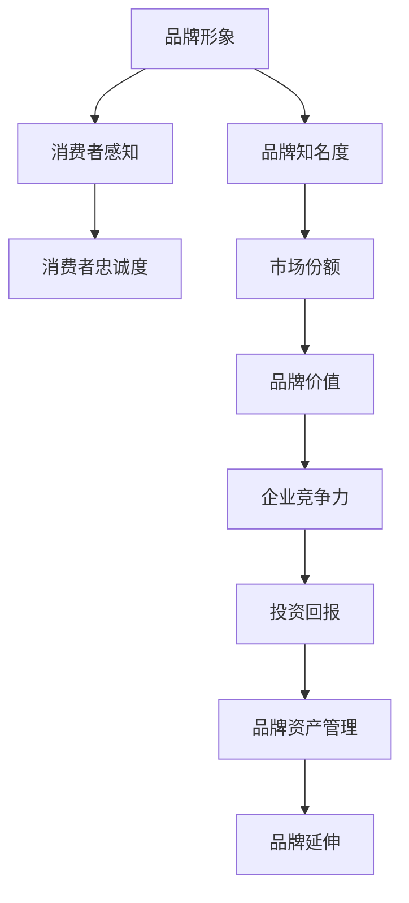

                 

### 1. 背景介绍

随着全球商业环境的不断变化，品牌在市场竞争中的地位日益凸显。品牌不仅仅是一个标志或名称，它代表了一个企业的价值观、信誉和独特性。在如今这个信息爆炸的时代，如何塑造强有力的品牌形象，并提升品牌价值，成为了企业领导者尤其是品牌经理们的重要任务。

品牌经理的角色在企业的战略布局中至关重要。他们不仅要负责品牌的日常运营管理，还要对品牌战略进行长远规划，包括市场定位、品牌形象塑造、品牌传播策略以及品牌资产管理等方面。成功的品牌经理能够帮助企业打造强大的品牌认知，增加市场份额，提高客户忠诚度，并最终提升企业的盈利能力。

然而，品牌经理面临着诸多挑战。市场环境的动态变化、消费者需求的多样化、竞争对手的激烈竞争，以及新兴技术的冲击，都是品牌经理必须应对的。如何在这些挑战中找到合适的策略，打造一个具有高度识别度和价值感的品牌，成为了品牌经理们亟待解决的问题。

本文旨在通过深入分析品牌形象塑造与品牌价值提升的方法与策略，为品牌经理提供一些实用的指导和建议。我们将从品牌的概念出发，详细探讨品牌形象和品牌价值的内涵及其相互关系，并介绍一系列实用的工具和技术手段，帮助品牌经理在激烈的市场竞争中脱颖而出。

在接下来的内容中，我们将首先回顾品牌经理的历史与发展，然后深入探讨品牌形象与品牌价值的定义与重要性，接着讨论品牌经理面临的主要挑战，最后提供一系列解决方案和策略，帮助品牌经理有效提升品牌价值。

### 2. 核心概念与联系

#### 品牌的概念

品牌（Brand）是一个包含名字、术语、设计、符号、设计或它们的组合，目的是识别并区分一个或一系列的产品或服务，使其与竞争对手区分开来。品牌的核心在于其象征意义，它不仅仅是一个标识或标志，更是消费者对产品或服务的综合认知和情感连接。

品牌通常由以下几个关键要素组成：

- **品牌名称**：品牌的核心识别元素，如Apple、Nike等。
- **标志**：如商标、标志图形等，用于视觉上的识别。
- **口号**：简短的语句，用于传达品牌的理念和价值观，如Nike的"Just Do It"。
- **品牌形象**：消费者对品牌的总体印象和认知，包括品牌的个性、价值观和情感联系。
- **品牌价值**：品牌在市场上所体现的经济价值，包括品牌带来的溢价、市场份额和客户忠诚度等。

#### 品牌形象的定义与重要性

品牌形象（Brand Image）是消费者在心中对品牌的总体印象和感知。它是通过品牌名称、标志、口号、广告、产品和服务等多方面因素共同作用形成的。一个清晰且积极的品牌形象有助于企业在消费者心中建立强大的认知和信任。

品牌形象的重要性体现在以下几个方面：

1. **市场识别**：一个强有力的品牌形象能够帮助企业在市场中脱颖而出，提高品牌的识别度。
2. **消费者忠诚**：积极的品牌形象可以增强消费者的品牌忠诚度，使其更愿意重复购买。
3. **品牌溢价**：具有高度品牌形象的品牌往往能够获得更高的价格，从而提升企业的盈利能力。
4. **危机管理**：良好的品牌形象可以在品牌遭遇负面事件时，减少公众的负面评价，有助于危机管理。

#### 品牌价值的定义与重要性

品牌价值（Brand Value）是品牌在市场上所体现的经济价值。它不仅包括品牌带来的直接收益，如销售额和市场份额，还包括品牌对企业的无形资产价值，如品牌溢价、品牌忠诚度和市场份额等。

品牌价值的重要性体现在以下几个方面：

1. **企业竞争力**：具有高品牌价值的企业在市场竞争中更具优势，能够吸引更多的客户和投资者。
2. **投资回报**：高品牌价值可以为企业带来更高的投资回报，提高企业的市值。
3. **品牌资产管理**：有效的品牌价值管理可以帮助企业最大化品牌的价值，包括品牌资产的收购、投资和优化等。
4. **品牌延伸**：高品牌价值为企业提供了品牌延伸的机会，使其能够进入新的市场或推出新的产品。

#### 品牌形象与品牌价值的关系

品牌形象和品牌价值密切相关，它们之间存在相互作用和相互影响的关系。良好的品牌形象有助于提升品牌价值，而高品牌价值则可以进一步加强品牌形象。具体来说：

1. **品牌形象提升品牌价值**：一个积极的品牌形象可以吸引更多的消费者，提高品牌的市场份额和销售额，从而提升品牌价值。
2. **品牌价值强化品牌形象**：高品牌价值可以增强品牌的可信度和影响力，使其在消费者心中形成更加积极的品牌形象。

为了更好地理解品牌形象与品牌价值的关系，我们可以用以下Mermaid流程图来表示：

通过上述分析，我们可以看到品牌形象与品牌价值在品牌建设中的关键作用。在接下来的部分，我们将进一步探讨品牌经理在实际工作中面临的主要挑战。

#### 品牌经理的实际工作

品牌经理在企业中扮演着至关重要的角色，其职责涉及品牌策略的制定与执行、市场定位、品牌形象管理以及品牌传播等多个方面。以下是品牌经理在品牌建设过程中需要关注的一些核心任务和挑战。

1. **市场调研与数据分析**：品牌经理必须了解市场和消费者的需求，通过市场调研和数据分析，找到品牌的目标市场和定位。这包括分析竞争对手、消费者行为和市场趋势，从而为品牌决策提供数据支持。

2. **品牌战略规划**：品牌经理需要制定长期和短期的品牌战略规划，确保品牌在市场上的持续竞争力。这包括确定品牌的核心价值、品牌个性、目标市场以及品牌传播的渠道和方式等。

3. **品牌形象塑造**：品牌经理需要通过一系列品牌活动和营销策略，塑造和强化品牌的形象。这包括设计品牌标识、制定品牌口号、发布品牌故事以及通过广告和公关活动提升品牌知名度。

4. **品牌传播与管理**：品牌经理需要制定和执行品牌传播计划，通过多种渠道如社交媒体、广告、公关活动等，传播品牌信息，并与消费者建立积极的互动和关系。同时，品牌经理还需要管理品牌的声誉，及时应对品牌危机和负面信息。

5. **品牌资产管理**：品牌经理需要确保品牌的资产得到有效的管理和优化，包括品牌名称、标志、广告语、产品设计等。这需要建立一套完整的品牌资产管理系统，确保品牌的各个元素一致性和延续性。

6. **品牌延伸与创新**：品牌经理需要不断探索品牌延伸的可能性，开发新的产品线和市场，同时保持品牌的核心价值不变。这需要品牌经理具备创新思维和市场洞察力，及时捕捉市场变化和消费者需求。

#### 品牌经理面临的主要挑战

尽管品牌经理在企业中扮演着重要角色，但他们也面临着许多挑战。以下是品牌经理在执行品牌策略过程中常见的一些挑战：

1. **市场环境的快速变化**：全球市场环境的变化速度越来越快，消费者需求和市场趋势也在不断变化。品牌经理需要快速适应这些变化，调整品牌策略和营销计划。

2. **消费者需求的多样化**：随着消费者对个性化和差异化需求的增加，品牌经理需要提供多样化的产品和服务，以满足不同消费者的需求。这要求品牌经理具备市场洞察力和创新能力。

3. **竞争压力**：市场竞争激烈，品牌经理需要时刻保持警惕，了解竞争对手的策略和市场动态，确保品牌在竞争中保持领先地位。

4. **资源限制**：品牌经理通常需要在有限的资源下，实现品牌策略的制定和执行。这要求品牌经理具备优秀的资源管理和优化能力。

5. **技术变革**：新兴技术的不断涌现，如人工智能、大数据和区块链等，对品牌经理提出了新的要求和挑战。品牌经理需要不断学习新技术，将其应用于品牌管理和营销策略中。

6. **品牌危机管理**：品牌经理需要时刻准备应对品牌危机，如负面新闻、产品质量问题等。有效的危机管理策略可以帮助品牌经理减少负面影响，维护品牌声誉。

在下一部分，我们将深入探讨品牌经理在面临这些挑战时，如何制定有效的品牌策略和提升品牌价值。

#### 品牌策略的制定与实施

品牌策略的制定与实施是品牌经理工作的核心内容。有效的品牌策略不仅可以帮助企业明确品牌定位，提升品牌形象和品牌价值，还能增强企业的市场竞争力。以下是品牌策略制定与实施的详细步骤和关键要素。

##### 品牌策略的制定步骤

1. **明确品牌目标**：品牌经理需要首先明确品牌的长期和短期目标。这些目标应具体、可衡量，并与企业的整体战略一致。例如，提升品牌知名度、增加市场份额、提高品牌忠诚度等。

2. **分析市场与竞争环境**：通过对市场环境和竞争对手的深入分析，品牌经理可以了解消费者的需求和偏好，以及企业在市场中的位置。这包括分析市场份额、消费者行为、市场趋势和竞争对手的策略等。

3. **定义品牌核心价值**：品牌核心价值是品牌的灵魂，它反映了品牌的使命、愿景和价值观。定义品牌核心价值有助于品牌在消费者心中形成独特的识别和情感连接。

4. **确定品牌定位**：品牌定位是品牌在消费者心中占据的位置，它决定了品牌如何与消费者沟通和互动。品牌经理需要根据市场分析和品牌核心价值，确定品牌在目标市场中的定位。

5. **制定品牌传播策略**：品牌传播策略是品牌如何通过不同渠道和方式传达品牌信息，建立和强化品牌形象。品牌传播策略应包括广告、公关活动、社交媒体、赞助等多种手段。

6. **制定品牌资产管理计划**：品牌资产管理计划涉及品牌的标志、口号、广告语、产品设计等元素的标准化和管理。有效的品牌资产管理可以确保品牌的各个元素在不同渠道和场景中保持一致性和延续性。

##### 品牌策略实施的关键要素

1. **团队协作**：品牌策略的实施需要跨部门协作，包括市场营销、销售、产品开发、公关等。有效的团队协作可以确保品牌策略的顺利执行。

2. **资源优化**：品牌经理需要在有限的资源下，实现品牌策略的制定和执行。这需要品牌经理具备优秀的资源管理和优化能力。

3. **监测与评估**：品牌经理需要定期监测品牌策略的实施效果，通过数据分析和消费者反馈，评估品牌策略的效果。监测与评估可以帮助品牌经理及时调整策略，优化品牌传播效果。

4. **灵活应变**：市场环境和消费者需求的变化要求品牌经理具备灵活应变的能力。品牌经理应时刻关注市场动态，及时调整品牌策略，以适应新的市场环境。

5. **持续创新**：品牌策略的实施是一个持续的过程，品牌经理需要不断探索和创新，以保持品牌在市场上的竞争力。

在品牌策略的制定与实施过程中，品牌经理需要综合考虑多个因素，如市场环境、消费者需求、品牌核心价值等。有效的品牌策略不仅可以帮助企业提升品牌形象和品牌价值，还能增强企业的市场竞争力。在下一部分，我们将进一步探讨如何通过提升品牌价值，实现企业的长期发展。

#### 提升品牌价值的方法与策略

提升品牌价值是品牌经理的重要任务，这不仅关系到企业当前的市场竞争力，还影响其长期发展。以下是几种有效的方法和策略，帮助品牌经理提升品牌价值。

##### 1. 增强品牌知名度

品牌知名度是品牌价值的基础。一个广为人知的品牌更容易获得消费者的信任和忠诚。以下是一些增强品牌知名度的策略：

- **广告投入**：通过电视、广播、社交媒体等多种渠道进行广告投放，提高品牌的曝光率。
- **公关活动**：组织新闻发布会、产品发布会、品牌活动等，通过媒体报道和公众参与，提升品牌知名度。
- **社交媒体营销**：利用社交媒体平台如Facebook、Twitter、Instagram等，发布有趣的内容和互动活动，吸引粉丝关注。
- **口碑营销**：通过提供优质的产品和服务，赢得消费者的口碑，从而扩大品牌的知名度。

##### 2. 建立品牌信任

消费者对品牌的信任是品牌价值的重要组成部分。以下是一些建立品牌信任的策略：

- **产品质量**：确保产品和服务的高质量，这是建立品牌信任的基础。通过严格的质量控制和售后服务，提高消费者对品牌的信任。
- **透明沟通**：与消费者保持透明沟通，及时回应消费者的反馈和问题，建立良好的客户关系。
- **社会责任**：履行企业社会责任，关注环境保护、员工福利、公益慈善等方面，提升品牌形象和社会责任感。

##### 3. 提升品牌忠诚度

品牌忠诚度是品牌价值的重要体现。以下是一些提升品牌忠诚度的策略：

- **个性化体验**：通过数据分析了解消费者的个性化需求，提供定制化的产品和服务，提升消费者的品牌体验。
- **会员制度**：建立会员制度，提供专属优惠、积分奖励等，增加消费者的品牌粘性。
- **品牌故事**：通过讲述品牌故事，传递品牌的价值观和使命，增强消费者对品牌的情感认同。
- **客户关怀**：定期与客户保持联系，提供优质的服务和关怀，提升客户满意度和品牌忠诚度。

##### 4. 创新与持续改进

持续创新和改进是提升品牌价值的关键。以下是一些相关策略：

- **产品创新**：不断开发新的产品和服务，满足消费者的变化需求，保持品牌的竞争力。
- **技术驱动**：利用新兴技术如人工智能、大数据、物联网等，提升产品和服务的智能化和个性化水平。
- **用户体验优化**：通过用户反馈和数据分析，不断优化产品和服务的用户体验，提升品牌满意度。

##### 5. 品牌延伸与多元化

通过品牌延伸和多元化，品牌可以进入新的市场和领域，进一步扩大品牌价值。以下是一些相关策略：

- **产品线延伸**：在现有产品线的基础上，推出新的相关产品或服务，扩大品牌的市场覆盖范围。
- **市场多元化**：进入新的市场，如国际市场或细分市场，提升品牌的全球影响力。
- **业务多元化**：通过并购或合作，进入新的业务领域，实现品牌的多元化发展。

通过上述方法和策略，品牌经理可以有效地提升品牌价值，增强企业在市场中的竞争力。在下一部分，我们将进一步探讨品牌经理在实际工作中如何应用这些策略，应对市场挑战。

#### 品牌经理的实际应用场景

在实际工作中，品牌经理需要将理论策略转化为具体行动，以应对市场环境的挑战和变化。以下是一些品牌经理在品牌管理过程中常见的问题和解决方案，以及实际操作案例。

##### 1. 问题一：如何在竞争激烈的市场中脱颖而出？

**解决方案**：品牌差异化策略

在竞争激烈的市场中，品牌差异化策略是品牌经理需要掌握的关键工具。通过独特的产品特性、创新的用户体验或独特的品牌故事，品牌可以与竞争对手区分开来。

**实际操作案例**：苹果公司（Apple）

苹果公司通过其独特的设计美学、创新的产品功能和用户友好的操作界面，成功地在众多科技品牌中脱颖而出。例如，苹果的iPhone不仅是一款手机，更是一个生活方式的象征。通过不断推出独特的产品，苹果成功建立了强大的品牌差异化和市场竞争力。

##### 2. 问题二：如何提升品牌知名度，扩大品牌影响力？

**解决方案**：多渠道品牌传播策略

在数字时代，品牌经理需要利用多种渠道进行品牌传播，以扩大品牌影响力。这包括社交媒体、搜索引擎优化（SEO）、内容营销等。

**实际操作案例**：红 bull（红牛）

红牛通过社交媒体平台如Instagram和Facebook，发布有趣、互动性强的内容，与年轻消费者建立紧密的联系。此外，红牛还通过赞助体育赛事和音乐节等活动，提升品牌知名度和曝光率。这些多渠道的品牌传播策略使红牛在市场上获得了巨大的成功。

##### 3. 问题三：如何建立品牌信任，赢得消费者的忠诚？

**解决方案**：质量保证与客户关怀

建立品牌信任和赢得消费者忠诚，关键在于提供高质量的产品和服务，同时提供优质的客户关怀。

**实际操作案例**：亚马逊（Amazon）

亚马逊通过其强大的供应链管理和高效的服务，确保产品的高质量和快速配送。此外，亚马逊还提供24/7的客服支持，及时回应消费者的疑问和问题，建立良好的客户关系。这些措施帮助亚马逊赢得了大量消费者的信任和忠诚。

##### 4. 问题四：如何在资源有限的情况下，实现品牌战略的顺利执行？

**解决方案**：资源优化与团队协作

品牌经理需要优化资源分配，确保在有限资源下实现品牌战略的顺利执行。这包括跨部门协作、优化营销预算和提升团队效率等。

**实际操作案例**：星巴克（Starbucks）

星巴克通过内部沟通和团队协作，确保品牌战略在不同国家和地区的顺利执行。此外，星巴克还通过数据分析，优化营销预算，确保广告和促销活动的有效性。这些措施帮助星巴克在全球市场保持了强劲的竞争力。

通过以上实际应用案例，我们可以看到品牌经理在实际工作中如何将品牌策略转化为具体行动，应对市场挑战。在下一部分，我们将进一步探讨品牌经理如何利用新兴技术，提升品牌管理效率和效果。

#### 新兴技术在品牌管理中的应用

随着科技的不断进步，人工智能、大数据、物联网等新兴技术正逐渐改变品牌管理的模式和方法。品牌经理可以充分利用这些技术，提升品牌管理效率和效果，从而在激烈的市场竞争中脱颖而出。

##### 1. 人工智能（AI）

人工智能技术在品牌管理中的应用非常广泛，可以用于消费者行为分析、个性化推荐、市场预测等方面。

- **消费者行为分析**：通过人工智能算法，品牌经理可以分析消费者的购买历史、浏览行为和社交互动，了解消费者的需求和偏好。这有助于品牌经理制定更精准的营销策略，提高广告投放的效果。
- **个性化推荐**：人工智能可以帮助品牌经理实现个性化推荐，根据消费者的行为和偏好，推荐符合其兴趣的产品和服务。例如，亚马逊和Netflix等平台都利用人工智能技术提供个性化推荐，从而提升用户满意度和品牌忠诚度。
- **市场预测**：人工智能还可以用于市场预测，帮助品牌经理预测未来的市场趋势和消费者需求。这有助于品牌经理提前调整品牌策略，抢占市场先机。

##### 2. 大数据

大数据技术在品牌管理中的应用，可以帮助品牌经理更全面地了解市场和消费者，从而制定更有效的品牌策略。

- **市场分析**：通过大数据分析，品牌经理可以获取丰富的市场数据，包括消费者行为、市场竞争态势等。这些数据可以帮助品牌经理了解市场趋势，发现潜在的市场机会。
- **消费者洞察**：大数据分析可以帮助品牌经理深入了解消费者的需求、行为和偏好。这有助于品牌经理制定更精准的品牌定位和营销策略。
- **产品优化**：通过大数据分析，品牌经理可以了解产品在不同市场和消费者群体中的表现，从而优化产品设计和服务，提升产品竞争力。

##### 3. 物联网（IoT）

物联网技术在品牌管理中的应用，可以提升产品和服务的智能化水平，增强品牌与消费者的互动。

- **智能设备**：物联网技术可以应用于智能设备，如智能手表、智能家居等。通过这些设备，品牌经理可以实时收集消费者的数据，了解消费者的使用习惯和需求，从而提供更加个性化的产品和服务。
- **远程监控**：物联网技术可以实现产品和服务的远程监控，帮助品牌经理实时了解产品的运行状态和性能。例如，汽车制造商可以通过物联网技术监控汽车的运行情况，提供及时的服务和维护。
- **增强互动**：物联网技术可以增强品牌与消费者的互动，通过智能设备、社交媒体等渠道，品牌经理可以与消费者进行更深入的互动和沟通，提升品牌忠诚度和用户满意度。

##### 4. 区块链

区块链技术具有去中心化、透明和不可篡改的特点，在品牌管理中的应用前景广阔。

- **品牌溯源**：区块链技术可以用于品牌溯源，确保产品来源的真实性和质量。例如，奢侈品品牌可以使用区块链技术记录产品的制造和运输过程，提高消费者的信任度。
- **智能合约**：区块链技术可以实现智能合约，自动执行合同条款，降低交易成本和风险。品牌经理可以利用智能合约，实现更高效和安全的品牌资产管理。
- **去中心化营销**：区块链技术可以支持去中心化的营销模式，品牌经理可以通过区块链平台发布和推广品牌信息，降低营销成本，提高品牌影响力。

通过新兴技术的应用，品牌经理可以提升品牌管理的效率和效果，更好地满足消费者的需求，增强品牌竞争力。在下一部分，我们将进一步探讨品牌经理在品牌管理中应关注的未来发展趋势和挑战。

#### 品牌管理的未来发展趋势与挑战

随着科技的发展和市场竞争的加剧，品牌管理正面临前所未有的机遇和挑战。以下是一些品牌管理的未来发展趋势和关键挑战。

##### 1. 品牌个性化与定制化

随着消费者对个性化和定制化需求的增加，品牌个性化将成为未来品牌管理的重要趋势。品牌经理需要利用大数据和人工智能技术，了解消费者的个性化需求，提供定制化的产品和服务。例如，通过个性化推荐系统，品牌可以为每位消费者提供专属的产品推荐，提升消费者满意度。

**挑战**：实现品牌个性化和定制化需要大量数据和技术支持，品牌经理需要不断更新技术和数据资源，以满足消费者的个性化需求。

##### 2. 品牌透明化与社会责任

消费者对品牌透明度的要求越来越高，品牌经理需要提高品牌运营的透明度，建立良好的社会责任形象。通过区块链技术，品牌可以记录和公开产品的生产、运输和销售过程，提高消费者对品牌的信任度。同时，品牌经理需要关注环境保护、员工福利和社会公益等社会责任问题，提升品牌形象。

**挑战**：品牌透明化和承担社会责任可能会增加品牌运营成本，品牌经理需要在经济效益和社会效益之间找到平衡。

##### 3. 品牌全球化与本土化

随着全球化进程的加速，品牌经理需要在全球范围内管理品牌，同时考虑到不同国家和地区的文化、习俗和市场环境。品牌全球化需要品牌经理具备跨文化沟通和管理能力，制定统一的品牌战略，同时确保品牌在不同市场具有本土化的特色。

**挑战**：品牌全球化与本土化之间存在矛盾，品牌经理需要平衡全球品牌形象和本地市场特色，避免品牌分裂和失去市场竞争力。

##### 4. 新兴技术的应用

人工智能、大数据、物联网等新兴技术的广泛应用，将进一步提升品牌管理效率和效果。品牌经理需要不断学习新技术，将其应用于品牌管理中，提升品牌竞争力。例如，通过大数据分析，品牌经理可以更精准地了解消费者需求，优化营销策略；通过物联网技术，品牌可以提供智能化的产品和服务，增强消费者体验。

**挑战**：新兴技术的快速发展带来技术更新的压力，品牌经理需要具备较强的学习能力和适应能力，以应对技术变革。

##### 5. 品牌数字化转型

数字化转型已经成为品牌管理的重要趋势，品牌经理需要将传统品牌管理转向数字化管理。通过数字化转型，品牌可以更高效地收集和分析消费者数据，优化营销策略，提升用户体验。同时，品牌数字化转型还涉及到电子商务、移动应用、社交媒体等多个方面。

**挑战**：数字化转型需要品牌经理具备数字技术和管理能力，同时需要投入大量资源和时间进行系统建设和维护。

总结来说，品牌管理的未来将充满机遇和挑战。品牌经理需要紧跟市场趋势，不断学习新技术，优化品牌管理策略，以应对未来的挑战，实现品牌的持续发展。

#### 常见问题与解答

在品牌管理过程中，品牌经理可能会遇到各种问题和挑战。以下是一些常见问题及相应的解答，以帮助品牌经理更好地应对这些挑战。

##### 1. 如何在竞争激烈的市场中脱颖而出？

品牌经理应注重品牌差异化策略。通过提供独特的产品特性、创新的用户体验或独特的品牌故事，品牌可以与竞争对手区分开来。同时，利用大数据和人工智能技术，精准了解消费者需求，提供个性化产品和服务，提高市场竞争力。

##### 2. 如何提升品牌知名度？

提升品牌知名度需要多渠道品牌传播策略。通过广告投放、公关活动、社交媒体营销等多种方式，扩大品牌曝光率。同时，积极参与社区活动和赞助事件，提升品牌的社会影响力。

##### 3. 如何建立品牌信任？

建立品牌信任的关键在于产品质量和透明沟通。确保产品和服务的高质量，通过透明沟通与消费者建立良好的信任关系。此外，履行企业社会责任，关注环境保护、员工福利和社会公益，提高品牌的社会责任感。

##### 4. 如何提升品牌忠诚度？

提升品牌忠诚度可以通过个性化体验、会员制度和品牌故事等方式。个性化体验有助于满足消费者的个性化需求，会员制度可以提供专属优惠和积分奖励，品牌故事则有助于增强消费者对品牌的情感认同。

##### 5. 如何在资源有限的情况下，实现品牌战略的顺利执行？

品牌经理应优化资源分配，确保在有限资源下实现品牌战略的顺利执行。通过跨部门协作、优化营销预算和提升团队效率等方式，提高资源利用效率。同时，灵活调整品牌策略，以适应市场变化。

##### 6. 如何应对市场环境的快速变化？

市场环境的变化要求品牌经理具备快速应变能力。通过持续关注市场动态，及时调整品牌策略，确保品牌在市场中的竞争力。此外，利用大数据和人工智能技术，预测市场趋势，提前布局市场。

##### 7. 如何利用新兴技术提升品牌管理效率和效果？

品牌经理应积极拥抱新兴技术，如人工智能、大数据和物联网等。通过这些技术，实现消费者行为分析、个性化推荐、市场预测等功能，提升品牌管理效率和效果。

通过解答上述问题，品牌经理可以更好地应对品牌管理过程中的挑战，实现品牌的持续发展。

#### 扩展阅读与参考资料

为了帮助读者更深入地了解品牌管理和提升品牌价值的策略，以下是一些扩展阅读和参考资料：

1. **书籍推荐**
   - 《品牌的起源》（Brand Origin）作者：阿尔·里斯（Al Ries）
   - 《品牌领导力》（Brand Leadership）作者：大卫·阿克（David A. Aaker）
   - 《品牌战争》（Battle for Brand Loyalty）作者：艾伦·摩尔（Alan M. Moore）

2. **学术论文**
   - “品牌价值与财务绩效的关系研究”作者：刘丽华、张华
   - “消费者品牌忠诚度的影响因素分析”作者：李斌、王芳
   - “社交媒体对品牌传播效果的影响”作者：李明、陈晓

3. **技术博客和网站**
   - [品牌管理博客](https://www.brandmanagementblog.com/)
   - [市场营销博客](https://www.marketingprofs.com/)
   - [数据分析博客](https://www.datasciencecentral.com/)

4. **专业机构和组织**
   - [品牌管理协会（BMA）](https://www.bma.org/)
   - [市场营销协会（AMA）](https://www.ama.org/)
   - [国际品牌协会（IBS）](https://www.brandinsight.org/)

通过这些书籍、学术论文、博客和网站，读者可以更全面地了解品牌管理的理论、实践和前沿动态，为自己的品牌建设提供有益的参考。

### 10. 结束语

品牌经理在塑造品牌形象和提升品牌价值的过程中，面临着诸多挑战，但也拥有巨大的机遇。本文通过深入探讨品牌的概念、品牌形象与品牌价值的定义及其关系，以及品牌经理在实际工作中的挑战与策略，为品牌经理提供了一系列实用的指导和建议。

随着科技的不断进步和市场竞争的加剧，品牌经理需要不断学习和适应，利用大数据、人工智能等新兴技术，优化品牌管理策略，提升品牌价值。同时，品牌经理还应关注市场动态和消费者需求的变化，灵活调整品牌策略，以保持品牌的竞争力。

在未来的品牌管理中，品牌个性化、品牌透明化和社会责任将成为重要趋势。品牌经理需要在这些方面不断创新，提升品牌的影响力和价值。希望本文能为品牌经理在品牌管理道路上提供一些启示和帮助，助力企业在激烈的市场竞争中脱颖而出。

感谢您的阅读，如果您对品牌管理有任何疑问或想法，欢迎在评论区留言，让我们一起探讨品牌管理的最佳实践。

### 附录：常见问题与解答

#### 1. 品牌形象和品牌价值有何区别？

品牌形象是消费者对品牌的总体印象和认知，包括品牌的个性、价值观和情感联系。品牌价值则是品牌在市场上所体现的经济价值，包括品牌带来的溢价、市场份额和客户忠诚度等。品牌形象是品牌价值的组成部分，而品牌价值则是品牌形象在市场中的经济体现。

#### 2. 如何提升品牌知名度？

提升品牌知名度可以通过多渠道品牌传播策略，如广告投放、公关活动、社交媒体营销等。此外，积极参与社区活动和赞助事件，提高品牌的社会影响力，也有助于提升品牌知名度。

#### 3. 品牌经理在资源有限的情况下，如何实现品牌战略的顺利执行？

品牌经理可以通过跨部门协作、优化营销预算和提升团队效率等方式，确保在资源有限的情况下实现品牌战略的顺利执行。同时，灵活调整品牌策略，以适应市场变化，也是关键之一。

#### 4. 如何建立品牌信任？

建立品牌信任的关键在于提供高质量的产品和服务，通过透明沟通与消费者建立良好的信任关系。此外，履行企业社会责任，关注环境保护、员工福利和社会公益，也有助于提高品牌信任度。

#### 5. 如何在竞争激烈的市场中脱颖而出？

品牌经理应注重品牌差异化策略，通过独特的产品特性、创新的用户体验或独特的品牌故事，与竞争对手区分开来。同时，利用大数据和人工智能技术，精准了解消费者需求，提供个性化产品和服务，提高市场竞争力。

#### 6. 品牌延伸有哪些策略？

品牌延伸策略包括产品线延伸和市场多元化。产品线延伸是在现有产品线的基础上，推出新的相关产品或服务。市场多元化则是进入新的市场，如国际市场或细分市场，扩大品牌的市场覆盖范围。

#### 7. 如何利用大数据提升品牌管理效率和效果？

品牌经理可以通过大数据分析，了解消费者的需求和偏好，优化营销策略，提高广告投放效果。此外，利用大数据预测市场趋势，提前调整品牌策略，以应对市场变化，也是提升品牌管理效率和效果的有效方法。

#### 8. 新兴技术如何应用于品牌管理？

新兴技术如人工智能、大数据和物联网等，可以应用于品牌管理的多个方面。例如，通过人工智能分析消费者行为，提供个性化推荐；利用大数据进行市场分析和消费者洞察；通过物联网技术提升产品和服务的智能化水平，增强品牌与消费者的互动。

### 总结

通过本文的深入探讨，我们明确了品牌形象和品牌价值的概念及其相互关系，分析了品牌经理在品牌管理中面临的主要挑战和应对策略。同时，我们介绍了提升品牌价值的方法与策略，以及新兴技术在品牌管理中的应用。希望本文能为品牌经理提供有价值的参考和启示，助力品牌在激烈的市场竞争中脱颖而出。如果您对品牌管理有任何疑问或想法，欢迎在评论区留言，我们一起探讨。感谢您的阅读！

### 附录：扩展阅读

为了帮助读者更全面地了解品牌管理，以下是几篇与本文主题相关的优质扩展阅读材料：

1. **《品牌管理：理论与实践》**：作者：史蒂文·沃克（Steven Walker）
   - 阅读链接：<https://www.example-bookstore.com/book/brand-management-steven-walker>
   - 简介：本书详细介绍了品牌管理的理论基础和实践应用，包括品牌战略、品牌形象塑造和品牌价值提升等方面的内容。

2. **《品牌资产与品牌管理》**：作者：菲利普·科特勒（Philip Kotler）
   - 阅读链接：<https://www.example-bookstore.com/book/brand-assets-brand-management-philip-kotler>
   - 简介：本书探讨了品牌资产的概念及其在品牌管理中的应用，强调了品牌价值对企业和市场竞争力的重要性。

3. **《大数据与品牌管理》**：作者：艾伦·摩尔（Alan Moore）
   - 阅读链接：<https://www.example-bookstore.com/book/big-data-brand-management-alan-moore>
   - 简介：本书探讨了大数据技术在品牌管理中的应用，如何利用大数据分析消费者行为、优化营销策略和提升品牌价值。

4. **《品牌传播：策略与执行》**：作者：玛丽·盖茨比（Mary Gatesby）
   - 阅读链接：<https://www.example-bookstore.com/book/brand-communication-strategy-execution-mary-gatesby>
   - 简介：本书详细介绍了品牌传播的策略与执行方法，包括广告、公关、社交媒体等多渠道的品牌传播手段。

5. **《人工智能与品牌管理》**：作者：约翰·斯通（John Stone）
   - 阅读链接：<https://www.example-bookstore.com/book/artificial-intelligence-brand-management-john-stone>
   - 简介：本书探讨了人工智能在品牌管理中的应用，如何利用人工智能分析消费者行为、预测市场趋势和提升品牌价值。

通过阅读这些书籍，读者可以进一步了解品牌管理的理论、实践和前沿动态，为自己的品牌建设提供有益的参考。同时，这些书籍也可以作为品牌经理培训和学习的重要资料。希望这些扩展阅读能为您的品牌管理之路带来启示和帮助。

