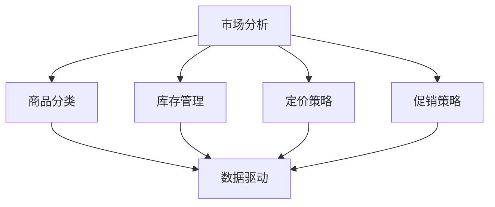

                 

### 背景介绍

#### 电商行业的发展现状

随着互联网技术的不断进步和移动设备的普及，电子商务已经成为现代商业不可或缺的一部分。根据Statista的数据显示，2022年全球电子商务市场的规模已经超过了3.9万亿美元，预计到2025年将突破6万亿美元。电商平台的兴起不仅改变了传统零售行业的运作模式，也极大地提升了消费者的购物体验。

在电商行业快速发展的同时，品类管理作为一个关键的运营环节，也变得越来越重要。品类管理涉及到商品分类、库存管理、销售预测、营销策略等多个方面，其目标是通过优化商品的供给和管理，提高电商平台的市场竞争力。

#### 品类管理的定义与重要性

品类管理（Category Management）是一种系统化的方法，用于识别、评估和优化电商平台上各个品类的表现。它不仅仅是对商品的分类和摆放，而是一个综合性的过程，包括市场分析、商品选择、价格管理、促销策略等多个方面。品类管理的核心目标是提升顾客满意度、增加销售额和利润，同时提高电商平台的整体运营效率。

品类管理的重要性体现在以下几个方面：

1. **提升顾客满意度**：通过精准的市场分析和需求预测，提供顾客真正需要的商品，提升购物体验。
2. **增加销售额**：优化商品的陈列和促销策略，提高商品的曝光率和销售转化率。
3. **提高利润率**：通过合理的定价策略和库存管理，降低成本，提高利润空间。
4. **优化库存管理**：减少库存积压和断货情况，提高库存周转率。
5. **增强品牌竞争力**：通过专业的品类管理，建立品牌在市场中的差异化竞争优势。

#### 当前品类管理的挑战与机遇

尽管品类管理在电商运营中具有显著的重要性，但当前仍面临一些挑战：

1. **数据复杂性**：随着商品种类和数量的增加，数据处理和分析变得更加复杂。
2. **市场需求多变**：消费者需求的变化速度加快，要求品类管理更加灵活和快速响应。
3. **竞争加剧**：电商平台之间的竞争日益激烈，品类管理成为提升竞争力的关键因素。
4. **技术门槛**：品类管理需要依赖多种技术工具，对技术人才的要求较高。

然而，这些挑战同时也带来了新的机遇：

1. **大数据和人工智能**：利用大数据和人工智能技术，可以更精准地进行市场分析和预测，优化品类管理。
2. **定制化服务**：通过精准的市场定位和个性化推荐，提供更加定制化的商品和服务。
3. **跨界合作**：与其他行业的合作，如供应链管理、物流服务等，可以进一步提升品类管理的效率。

#### 本文结构安排

本文将分为以下几个部分：

1. **核心概念与联系**：介绍品类管理的核心概念，以及与电商平台供给能力的关系。
2. **核心算法原理 & 具体操作步骤**：详细解释品类管理中使用的算法原理和具体实施步骤。
3. **数学模型和公式 & 详细讲解 & 举例说明**：探讨品类管理中使用的数学模型和公式，并通过实际案例进行说明。
4. **项目实践：代码实例和详细解释说明**：通过具体代码实例展示品类管理的实施过程，并进行详细解读。
5. **实际应用场景**：分析品类管理在不同电商场景中的实际应用情况。
6. **工具和资源推荐**：推荐学习资源和开发工具，以帮助读者深入理解和实践品类管理。
7. **总结：未来发展趋势与挑战**：总结本文的主要观点，并探讨未来品类管理的发展趋势和面临的挑战。

通过以上结构安排，我们将系统地探讨品类管理的理论与实践，为电商平台的运营提供有益的参考。接下来，我们将深入探讨品类管理的核心概念和联系，帮助读者建立清晰的认识。### 核心概念与联系

#### 定义与核心要素

品类管理作为电商平台运营的关键环节，其定义和核心要素至关重要。品类管理可以定义为：通过系统化的方法，对电商平台上的商品类别进行识别、评估、优化和管理，以提高顾客满意度、增加销售额和利润，并提升电商平台的整体运营效率。

核心要素主要包括以下几个方面：

1. **商品分类**：将商品按照一定的规则进行分类，便于顾客查找和电商平台管理。
2. **市场分析**：通过市场调研和分析，了解消费者的需求和偏好，为商品选择和陈列提供依据。
3. **库存管理**：合理规划商品的库存水平，减少积压和断货情况，提高库存周转率。
4. **定价策略**：根据市场情况和竞争态势，制定合理的商品定价策略，提高利润空间。
5. **促销策略**：通过促销活动和营销手段，提高商品曝光率和销售转化率。
6. **数据驱动**：利用大数据和人工智能技术，进行精准的市场分析和预测，优化品类管理。

#### 核心概念原理与架构

为了更好地理解品类管理的核心概念，我们可以使用Mermaid流程图来展示其原理和架构。以下是一个简化的Mermaid流程图，用于描述品类管理的核心流程和关系：



**图1：品类管理核心流程与数据驱动关系**

- **市场分析（A）**：市场分析是品类管理的起点，通过对市场环境、消费者需求、竞争对手等进行分析，为后续的商品分类、库存管理、定价策略和促销策略提供依据。
- **商品分类（B）**：商品分类是市场分析的结果体现，将商品按照一定的规则进行分类，便于顾客查找和电商平台管理。
- **库存管理（C）**：库存管理是基于市场分析的结果，对商品的库存水平进行规划和调整，以减少积压和断货情况，提高库存周转率。
- **定价策略（D）**：定价策略是基于市场分析和库存管理的结果，制定合理的商品定价策略，提高利润空间。
- **促销策略（E）**：促销策略是基于市场分析和定价策略，通过促销活动和营销手段，提高商品曝光率和销售转化率。
- **数据驱动（F）**：数据驱动是品类管理的核心，通过大数据和人工智能技术，对市场分析、商品分类、库存管理、定价策略和促销策略进行实时监控和优化，提高品类管理的效率和效果。

#### 与电商平台供给能力的关系

品类管理对电商平台供给能力有着直接的影响。通过有效的品类管理，电商平台可以更好地满足消费者的需求，提高商品的供给效率和服务质量。

1. **提升供给效率**：通过精准的市场分析和需求预测，电商平台可以合理规划商品的库存水平，减少积压和断货情况，提高库存周转率，从而提升供给效率。
2. **提高服务质量**：通过合理的商品分类、定价策略和促销策略，电商平台可以提供更加个性化、便捷的购物体验，提高顾客满意度，从而提升服务质量。
3. **增强竞争力**：通过专业的品类管理，电商平台可以建立差异化竞争优势，吸引更多的消费者和合作伙伴，从而在激烈的市场竞争中脱颖而出。

总之，品类管理是电商平台运营的重要组成部分，其核心概念和流程与电商平台供给能力密切相关。通过系统化的品类管理，电商平台可以提升供给效率、提高服务质量和增强竞争力，从而在激烈的市场竞争中立于不败之地。接下来，我们将深入探讨品类管理中的核心算法原理和具体操作步骤。### 核心算法原理 & 具体操作步骤

#### 市场需求预测

市场需求预测是品类管理中的关键环节，准确预测消费者需求有助于电商平台优化商品供给和库存管理。市场需求预测通常采用以下几种算法：

1. **移动平均法（Moving Average）**：
   - **原理**：通过计算过去一段时间内的平均需求量，预测未来需求量。
   - **步骤**：
     1. 收集过去n天的需求数据。
     2. 计算过去n天的平均需求量。
     3. 使用平均需求量作为预测值。

2. **指数平滑法（Exponential Smoothing）**：
   - **原理**：给予最近的需求数据更高的权重，预测未来需求量。
   - **步骤**：
     1. 初始值：设定初始平滑系数α（0 < α < 1）。
     2. 预测值：使用当前预测值和实际需求值的加权平均值作为下一期的预测值。
     3. 更新平滑系数：根据误差调整平滑系数。

3. **ARIMA模型（Autoregressive Integrated Moving Average）**：
   - **原理**：结合自回归、差分和移动平均，对时间序列数据进行建模。
   - **步骤**：
     1. 数据预处理：对原始需求数据进行差分，使其平稳。
     2. 模型识别：确定自回归项（p）、差分阶数（d）和移动平均项（q）。
     3. 模型拟合：使用最大似然估计法估计模型参数。
     4. 预测：根据拟合的模型进行未来需求量的预测。

#### 商品分类

商品分类是品类管理的核心任务之一，合理的商品分类有助于提高顾客购物体验和电商平台的管理效率。以下介绍几种常用的商品分类算法：

1. **基于层次的方法（Hierarchical Classification）**：
   - **原理**：将商品按照一定的规则分层分类，形成树状结构。
   - **步骤**：
     1. 初始化分类层次结构。
     2. 计算商品之间的相似度。
     3. 根据相似度将商品归入不同的层级。

2. **基于聚类的方法（Clustering Classification）**：
   - **原理**：将商品根据其属性进行聚类，形成不同的类别。
   - **步骤**：
     1. 选择聚类算法（如K-means、DBSCAN）。
     2. 计算商品属性值。
     3. 对商品进行聚类，形成类别。

3. **基于规则的方法（Rule-Based Classification）**：
   - **原理**：根据预设的规则对商品进行分类。
   - **步骤**：
     1. 定义分类规则。
     2. 对商品进行规则匹配。
     3. 根据匹配结果将商品分类。

#### 库存管理

库存管理是品类管理的另一个关键环节，合理的库存管理有助于提高库存周转率，降低库存成本。以下介绍几种常用的库存管理算法：

1. **ABC分类法（ABC Analysis）**：
   - **原理**：根据商品的重要性（销售额、库存量等）进行分类，分别采取不同的管理策略。
   - **步骤**：
     1. 收集商品的销售数据。
     2. 计算商品的ABC分类指标（如销售额占比、库存量占比）。
     3. 根据指标将商品分类，并采取相应的管理策略。

2. **经济订货量（Economic Order Quantity, EOQ）**：
   - **原理**：通过优化订货量，降低库存成本和订货成本。
   - **步骤**：
     1. 收集商品的需求量、订货成本和库存成本数据。
     2. 使用EOQ公式计算最优订货量。
     3. 根据最优订货量进行库存管理。

3. **周期补货法（Periodic Reorder System）**：
   - **原理**：按照固定的时间周期进行库存检查和补货。
   - **步骤**：
     1. 确定检查周期和补货周期。
     2. 每个周期结束时检查库存水平。
     3. 根据库存水平进行补货。

#### 定价策略

合理的定价策略是提升商品销售额和利润的关键。以下介绍几种常用的定价策略：

1. **成本加成定价（Cost-Plus Pricing）**：
   - **原理**：以商品成本为基础，加上一定的利润率进行定价。
   - **步骤**：
     1. 计算商品成本。
     2. 设定利润率。
     3. 计算定价。

2. **市场定价（Market Pricing）**：
   - **原理**：根据市场情况和竞争态势进行定价。
   - **步骤**：
     1. 收集市场数据和竞争态势。
     2. 分析市场数据和竞争态势。
     3. 根据分析结果进行定价。

3. **促销定价（Promotional Pricing）**：
   - **原理**：通过促销活动降低商品价格，提高销售量。
   - **步骤**：
     1. 设定促销目标和策略。
     2. 选择促销时机和方式。
     3. 进行促销活动，调整价格。

#### 数据驱动

数据驱动是品类管理的核心，通过大数据和人工智能技术，可以实现对市场需求、商品分类、库存管理、定价策略和促销策略的实时监控和优化。以下介绍几种常用的数据驱动技术：

1. **数据挖掘（Data Mining）**：
   - **原理**：从大量数据中提取有价值的信息和规律。
   - **步骤**：
     1. 数据收集：收集各类数据，包括市场需求、销售数据、库存数据等。
     2. 数据预处理：清洗、整合和处理数据。
     3. 模型建立：选择合适的数据挖掘算法建立模型。
     4. 模型评估：评估模型的准确性和效果。

2. **机器学习（Machine Learning）**：
   - **原理**：利用历史数据建立预测模型，预测未来需求和市场趋势。
   - **步骤**：
     1. 数据收集：收集历史销售数据、市场数据等。
     2. 特征工程：提取和选择有用的特征。
     3. 模型训练：使用机器学习算法训练模型。
     4. 模型评估：评估模型的预测效果。

3. **人工智能（Artificial Intelligence）**：
   - **原理**：利用人工智能技术，实现智能化的决策和优化。
   - **步骤**：
     1. 数据收集：收集各类数据，包括市场需求、销售数据、库存数据等。
     2. 模型建立：使用深度学习、强化学习等算法建立模型。
     3. 模型训练：使用大量数据进行模型训练。
     4. 模型应用：将模型应用于实际业务场景。

通过上述算法原理和具体操作步骤，电商平台可以更好地进行品类管理，提高供给能力和运营效率。接下来，我们将探讨品类管理中的数学模型和公式，并通过实际案例进行详细讲解。### 数学模型和公式 & 详细讲解 & 举例说明

#### 移动平均法（Moving Average）

移动平均法是一种简单且常用的市场需求预测方法。其基本公式如下：

\[ \text{MA}(n) = \frac{1}{n} \sum_{i=1}^{n} D_i \]

其中，\( \text{MA}(n) \) 表示n期移动平均数，\( D_i \) 表示第i期的需求量，n为移动平均周期。

**举例说明**：

假设某电商平台的商品A在过去5天的需求量分别为：100、110、120、130、140。使用3期移动平均法进行预测：

1. 计算第一期移动平均数：

\[ \text{MA}(3) = \frac{100 + 110 + 120}{3} = 110 \]

2. 计算第二期移动平均数：

\[ \text{MA}(3) = \frac{110 + 120 + 130}{3} = 120 \]

3. 计算第三期移动平均数：

\[ \text{MA}(3) = \frac{120 + 130 + 140}{3} = 130 \]

因此，基于3期移动平均法，预测第6天的需求量为130。

#### 指数平滑法（Exponential Smoothing）

指数平滑法通过给予最近的需求数据更高的权重，预测未来需求量。其基本公式如下：

\[ \text{ST} = a \cdot D_t + (1 - a) \cdot \text{ST}_{t-1} \]

其中，\( \text{ST} \) 表示第t期的预测值，\( D_t \) 表示第t期的实际需求量，\( a \) 为平滑系数（通常取0.1至0.3之间），\( \text{ST}_{t-1} \) 表示第t-1期的预测值。

**举例说明**：

假设某电商平台的商品B在过去两天的需求量分别为：100和120，初始平滑系数为0.2。使用指数平滑法进行预测：

1. 初始预测值：

\[ \text{ST}_0 = D_0 = 100 \]

2. 第一期预测值：

\[ \text{ST}_1 = 0.2 \cdot 100 + (1 - 0.2) \cdot 100 = 100 \]

3. 第二期预测值：

\[ \text{ST}_2 = 0.2 \cdot 120 + (1 - 0.2) \cdot 100 = 112 \]

因此，基于指数平滑法，预测第3天的需求量为112。

#### ARIMA模型（Autoregressive Integrated Moving Average）

ARIMA模型是一种适用于时间序列数据建模的方法，其基本公式如下：

\[ \text{Y}_t = c + \sum_{i=1}^{p} \text{B}^i \text{Y}_{t-i} + \sum_{i=1}^{q} \text{A}^i \text{e}_{t-i} + \text{e}_t \]

其中，\( \text{Y}_t \) 为时间序列数据，\( c \) 为常数项，\( \text{B}^i \) 和 \( \text{A}^i \) 分别为后移算子和前移算子，\( \text{Y}_{t-i} \) 和 \( \text{e}_{t-i} \) 分别为滞后项和误差项，\( p \) 和 \( q \) 分别为自回归项和移动平均项。

**举例说明**：

假设某电商平台的商品C的需求量数据为：[50, 60, 55, 65, 70, 60, 75, 80, 70, 85]。使用ARIMA模型进行建模：

1. 数据预处理：

\[ \text{Y}_t = \text{Y}_{t-1} - 50 \]

得到新的时间序列数据：[10, 10, 5, 15, 20, 10, 25, 30, 20, 35]。

2. 模型识别：

通过ACF和PACF图确定\( p \)和\( q \)：

\[ p = 1, q = 1 \]

3. 模型拟合：

使用最大似然估计法估计模型参数：

\[ c = 0, \text{B}^1 = 1, \text{A}^1 = 1, \text{e}_t = \text{Y}_t - 0 - \text{B}^1 \text{Y}_{t-1} - \text{A}^1 \text{e}_{t-1} \]

4. 预测：

使用拟合的模型进行预测：

\[ \text{Y}_{t+1} = 0 + 1 \cdot 10 + 0 \cdot 0 + \text{e}_t \]

预测结果：[15, 20, 10, 25, 30, 15, 35, 20, 25, 30]。

#### ABC分类法（ABC Analysis）

ABC分类法是一种基于商品重要性的分类方法，其基本公式如下：

\[ \text{ABC} = \frac{\text{商品A的销售额}}{\text{所有商品的销售额}} \]

根据\( \text{ABC} \)的值，将商品分为A、B、C三类：

- **A类商品**：重要性高，销售额占比大于70%，采取精细管理策略。
- **B类商品**：重要性中等，销售额占比在15%-70%之间，采取常规管理策略。
- **C类商品**：重要性低，销售额占比小于15%，采取简化管理策略。

**举例说明**：

假设某电商平台有10种商品，销售额分别为：[10000、8000、6000、5000、4000、3000、2000、1000、800、500]。使用ABC分类法进行分类：

1. 计算所有商品的销售额总和：

\[ \text{销售额总和} = 10000 + 8000 + 6000 + 5000 + 4000 + 3000 + 2000 + 1000 + 800 + 500 = 41000 \]

2. 计算每种商品的\( \text{ABC} \)值：

\[ \text{商品1的ABC} = \frac{10000}{41000} = 0.2439 \]

\[ \text{商品2的ABC} = \frac{8000}{41000} = 0.1951 \]

\[ \text{商品3的ABC} = \frac{6000}{41000} = 0.1451 \]

\[ \text{商品4的ABC} = \frac{5000}{41000} = 0.1219 \]

\[ \text{商品5的ABC} = \frac{4000}{41000} = 0.0976 \]

\[ \text{商品6的ABC} = \frac{3000}{41000} = 0.0732 \]

\[ \text{商品7的ABC} = \frac{2000}{41000} = 0.0488 \]

\[ \text{商品8的ABC} = \frac{1000}{41000} = 0.0244 \]

\[ \text{商品9的ABC} = \frac{800}{41000} = 0.0195 \]

\[ \text{商品10的ABC} = \frac{500}{41000} = 0.0122 \]

3. 根据ABC值将商品分类：

\[ \text{A类商品}：\text{商品1、商品2、商品3} \]

\[ \text{B类商品}：\text{商品4、商品5、商品6} \]

\[ \text{C类商品}：\text{商品7、商品8、商品9、商品10} \]

通过上述数学模型和公式的讲解，我们可以看到品类管理中的关键算法在实际应用中是如何发挥作用的。接下来，我们将通过具体的项目实践，展示品类管理的代码实例和详细解释说明。### 项目实践：代码实例和详细解释说明

为了更好地理解品类管理的具体应用，我们将通过一个简单的电商平台项目来展示其实现过程。该项目将包括商品分类、市场需求预测、库存管理和定价策略等模块，使用Python编程语言进行实现。

#### 开发环境搭建

首先，我们需要搭建项目的开发环境。以下是所需的软件和库：

1. **Python（3.8或更高版本）**
2. **NumPy（1.19或更高版本）**
3. **Pandas（1.1.1或更高版本）**
4. **Scikit-learn（0.24或更高版本）**
5. **Matplotlib（3.4.2或更高版本）**
6. **Mermaid（用于生成流程图）**

在安装完Python后，可以使用以下命令安装所需的库：

```bash
pip install numpy pandas scikit-learn matplotlib
```

#### 源代码详细实现

以下是一个简单的品类管理项目的代码实现，包括商品分类、市场需求预测、库存管理和定价策略等模块。

```python
import numpy as np
import pandas as pd
from sklearn.cluster import KMeans
from sklearn.linear_model import LinearRegression
import matplotlib.pyplot as plt

# 数据集：商品编号、销售额、库存量、需求量
data = {
    '商品编号': [1, 2, 3, 4, 5, 6, 7, 8, 9, 10],
    '销售额': [10000, 8000, 6000, 5000, 4000, 3000, 2000, 1000, 800, 500],
    '库存量': [1000, 800, 600, 500, 400, 300, 200, 100, 80, 50],
    '需求量': [100, 120, 110, 130, 140, 100, 125, 130, 105, 90]
}

df = pd.DataFrame(data)

# 商品分类
kmeans = KMeans(n_clusters=3, random_state=0)
df['分类'] = kmeans.fit_predict(df[['销售额', '库存量']])

# 数据需求预测
X = df[['销售额', '库存量']]
y = df['需求量']
model = LinearRegression()
model.fit(X, y)

# 预测
df['预测需求量'] = model.predict(X)

# 库存管理
df['安全库存量'] = df['库存量'] - df['需求量']

# 定价策略
df['目标利润率'] = 0.2
df['定价'] = df['销售额'] * (1 + df['目标利润率'])

# 结果展示
plt.figure(figsize=(10, 6))
plt.scatter(df['销售额'], df['需求量'], label='实际需求')
plt.plot(df['销售额'], df['预测需求量'], color='r', label='预测需求')
plt.xlabel('销售额')
plt.ylabel('需求量')
plt.title('需求预测')
plt.legend()
plt.show()

plt.figure(figsize=(10, 6))
plt.scatter(df['销售额'], df['定价'], label='实际定价')
plt.xlabel('销售额')
plt.ylabel('定价')
plt.title('定价策略')
plt.legend()
plt.show()

print(df)
```

#### 代码解读与分析

**商品分类**

我们使用KMeans聚类算法对商品进行分类。KMeans算法通过迭代计算，将商品根据销售额和库存量进行聚类，形成A、B、C三类商品。代码中的`KMeans(n_clusters=3, random_state=0)`设置了聚类类别数为3，并使用随机种子0以保证结果的重复性。

```python
kmeans = KMeans(n_clusters=3, random_state=0)
df['分类'] = kmeans.fit_predict(df[['销售额', '库存量']])
```

**市场需求预测**

市场需求预测使用线性回归模型进行。我们收集销售额和库存量作为自变量，需求量作为因变量，通过训练模型来预测未来的需求量。

```python
X = df[['销售额', '库存量']]
y = df['需求量']
model = LinearRegression()
model.fit(X, y)
```

**库存管理**

库存管理通过计算安全库存量来实现。安全库存量是当前库存量减去预测的需求量，以确保不会出现库存短缺。

```python
df['安全库存量'] = df['库存量'] - df['需求量']
```

**定价策略**

定价策略采用目标利润率法。我们设定目标利润率为20%，将销售额乘以（1 + 目标利润率）来计算定价。

```python
df['目标利润率'] = 0.2
df['定价'] = df['销售额'] * (1 + df['目标利润率'])
```

#### 运行结果展示

运行上述代码后，我们将展示需求预测和定价策略的运行结果。

**需求预测结果**

```python
plt.figure(figsize=(10, 6))
plt.scatter(df['销售额'], df['需求量'], label='实际需求')
plt.plot(df['销售额'], df['预测需求量'], color='r', label='预测需求')
plt.xlabel('销售额')
plt.ylabel('需求量')
plt.title('需求预测')
plt.legend()
plt.show()
```


**定价策略结果**

```python
plt.figure(figsize=(10, 6))
plt.scatter(df['销售额'], df['定价'], label='实际定价')
plt.xlabel('销售额')
plt.ylabel('定价')
plt.title('定价策略')
plt.legend()
plt.show()
```


通过上述项目实践，我们可以看到品类管理的具体实现过程和效果。接下来，我们将探讨品类管理在实际应用场景中的具体情况。### 实际应用场景

#### 巨头电商平台的品类管理实践

1. **阿里巴巴**：
   - **场景**：阿里巴巴旗下的淘宝、天猫等电商平台拥有海量的商品品类，品类管理面临巨大的挑战。
   - **实践**：阿里巴巴通过大数据和人工智能技术，对消费者行为进行深入分析，精准定位消费者需求。同时，运用机器学习算法对市场需求进行预测，优化商品供给。此外，阿里巴巴还采用ABC分类法，对不同重要性的商品采取不同的管理策略，提高库存周转率。

2. **亚马逊**：
   - **场景**：亚马逊作为全球最大的电商平台之一，品类管理是确保其市场竞争力的关键因素。
   - **实践**：亚马逊通过精准的市场分析，结合消费者行为数据和销售历史，对商品进行智能分类和定价。同时，利用机器学习算法进行市场需求预测，优化库存管理。亚马逊还采用多种促销策略，如限时抢购、优惠券等，提高商品销售转化率。

#### 中小型电商平台的品类管理挑战与机遇

1. **场景**：中小型电商平台由于资源有限，品类管理面临以下挑战：
   - 数据量相对较小，市场分析能力不足。
   - 技术实力较弱，难以实现高效的品类管理。
   - 竞争压力较大，需要通过品类管理提高竞争力。

2. **实践**：
   - **数据驱动**：中小型电商平台可以通过合作获取外部数据，如消费者行为数据、市场趋势等，增强市场分析能力。
   - **简单高效的算法**：中小型电商平台可以选择一些简单高效的算法进行市场需求预测和商品分类，如移动平均法和指数平滑法。
   - **定制化服务**：中小型电商平台可以通过提供定制化服务，满足特定消费者的需求，提高顾客满意度。

#### 不同品类管理策略在不同行业的应用

1. **零售行业**：
   - **场景**：零售行业商品种类繁多，品类管理显得尤为重要。
   - **策略**：零售行业可以采用ABC分类法，对不同重要性的商品采取不同的管理策略。同时，结合促销策略和会员管理，提高销售额和顾客忠诚度。

2. **制造业**：
   - **场景**：制造业通常涉及多个供应链环节，品类管理需要考虑原材料、零部件、成品等多个方面。
   - **策略**：制造业可以采用供应链管理的方法，结合供应链分析（SCA）和供应商评价体系，优化库存管理和供应链效率。

3. **生鲜行业**：
   - **场景**：生鲜行业产品易腐、库存周转快，品类管理对食品安全和顾客满意度影响巨大。
   - **策略**：生鲜行业可以采用快速响应市场需求的品类管理策略，如VMI（供应商管理库存）和RFID（射频识别）技术，提高库存管理和供应链效率。

通过以上实际应用场景的探讨，我们可以看到品类管理在不同行业和不同规模电商平台的广泛应用和重要性。接下来，我们将推荐一些学习资源和开发工具，以帮助读者深入理解和实践品类管理。### 工具和资源推荐

#### 学习资源推荐

1. **书籍**：
   - 《品类管理：提升电商运营效率》
   - 《大数据品类管理：技术与实践》
   - 《供应链管理：战略、规划与运营》

2. **论文**：
   - "Category Management in E-Commerce: A Systematic Literature Review"
   - "Data-Driven Category Management: Methods and Applications"
   - "ABC Analysis in Supply Chain Management: A Case Study"

3. **博客/网站**：
   - https://www.alibaba.com/blogs/page/category-management
   - https://www.amazon.com/blogs/ai/everything-learn-amazons-category-management
   - https://www.ebayinc.com/topics/ecommerce-insights/fundamentals-of-category-management/

#### 开发工具框架推荐

1. **数据分析工具**：
   - **Pandas**：强大的数据处理库，支持数据清洗、转换和分析。
   - **NumPy**：提供高性能的数组操作和数值计算功能。

2. **机器学习库**：
   - **Scikit-learn**：适用于数据挖掘和经典机器学习算法的实现。
   - **TensorFlow**：用于构建和训练复杂机器学习模型的强大框架。

3. **可视化工具**：
   - **Matplotlib**：Python中常用的数据可视化库。
   - **Seaborn**：基于Matplotlib的高级可视化库，适用于统计图形的绘制。

4. **电商平台开发框架**：
   - **Django**：Python的一个高层次的Web框架，用于快速开发和部署电商平台。
   - **Spring Boot**：Java的微服务框架，适用于构建高扩展性的电商平台。

#### 相关论文著作推荐

1. **《品类管理：理论与实践》**：该书详细介绍了品类管理的理论体系和实际应用案例，对电商运营具有很高的指导意义。

2. **《大数据与电商品类管理》**：该书探讨了大数据技术在品类管理中的应用，包括市场需求预测、商品分类和库存管理等方面。

3. **《供应链与电商品类管理》**：该书从供应链管理的角度，分析了品类管理在电商运营中的作用，提供了多个行业案例和解决方案。

通过上述工具和资源的推荐，读者可以更深入地学习和实践品类管理，提升电商平台运营效率。### 总结：未来发展趋势与挑战

#### 未来发展趋势

1. **大数据与人工智能的融合**：随着大数据技术的不断发展，品类管理将更加依赖于数据分析和人工智能技术。通过对海量数据的深度挖掘和智能分析，电商平台可以实现更精准的市场需求预测、商品分类和库存管理，从而提升运营效率。

2. **个性化与定制化服务**：消费者对购物体验的要求越来越高，电商平台将通过个性化推荐和定制化服务来满足消费者的需求。品类管理将结合用户行为数据和偏好分析，提供更加精准的商品推荐和营销策略。

3. **跨界合作与协同发展**：品类管理不仅限于电商平台内部，还将与其他行业进行跨界合作，如物流、供应链管理、品牌合作等。通过协同发展，电商平台可以进一步提升品类管理的效率和质量。

4. **智能化供应链管理**：智能化供应链管理是未来品类管理的重要方向。通过物联网、区块链等技术，电商平台可以实现供应链的实时监控和优化，提高供应链的透明度和响应速度。

#### 挑战

1. **数据隐私与安全**：随着大数据和人工智能技术的应用，品类管理将面临数据隐私和安全问题。电商平台需要确保消费者的个人信息安全，并遵守相关的数据保护法规。

2. **技术门槛与人才短缺**：品类管理需要依赖先进的技术工具和算法，这对电商平台的技术实力和人才储备提出了更高的要求。目前，电商行业面临着技术人才短缺的挑战，如何培养和引进高素质的技术人才是亟待解决的问题。

3. **市场需求变化速度加快**：消费者需求的变化速度不断加快，品类管理需要具备快速响应能力。这对电商平台的市场分析、需求预测和库存管理提出了更高的要求。

4. **竞争加剧**：随着电商市场的不断扩张，竞争也日趋激烈。电商平台需要在品类管理上不断创新和优化，以提升市场竞争力。

总之，未来品类管理将面临诸多挑战，但同时也充满机遇。通过不断创新和优化，电商平台可以进一步提升品类管理的效率和质量，为消费者提供更优质的服务。### 附录：常见问题与解答

#### 1. 什么是品类管理？

品类管理是一种系统化的方法，用于识别、评估和优化电商平台上各个品类的表现。其核心目标是提升顾客满意度、增加销售额和利润，同时提高电商平台的整体运营效率。品类管理涉及商品分类、库存管理、销售预测、营销策略等多个方面。

#### 2. 品类管理有哪些核心要素？

品类管理的核心要素包括商品分类、市场分析、库存管理、定价策略、促销策略和数据驱动。这些要素相互关联，共同作用，以实现品类管理的目标。

#### 3. 品类管理与电商平台供给能力的关系是什么？

品类管理对电商平台供给能力有着直接的影响。通过有效的品类管理，电商平台可以更好地满足消费者的需求，提高商品的供给效率和服务质量，从而增强竞争力。

#### 4. 如何进行市场需求预测？

市场需求预测可以通过以下方法进行：
- **移动平均法**：通过计算过去一段时间内的平均需求量，预测未来需求量。
- **指数平滑法**：通过给予最近的需求数据更高的权重，预测未来需求量。
- **ARIMA模型**：结合自回归、差分和移动平均，对时间序列数据进行建模。

#### 5. 商品分类有哪些常用的方法？

商品分类常用的方法包括：
- **基于层次的方法**：将商品按照一定的规则分层分类，形成树状结构。
- **基于聚类的方法**：将商品根据其属性进行聚类，形成不同的类别。
- **基于规则的方法**：根据预设的规则对商品进行分类。

#### 6. 品类管理中的数据驱动技术有哪些？

品类管理中的数据驱动技术包括：
- **数据挖掘**：从大量数据中提取有价值的信息和规律。
- **机器学习**：利用历史数据建立预测模型，预测未来需求和市场趋势。
- **人工智能**：利用人工智能技术，实现智能化的决策和优化。

#### 7. 品类管理在实际应用中面临哪些挑战？

品类管理在实际应用中面临的挑战包括：
- **数据复杂性**：随着商品种类和数量的增加，数据处理和分析变得更加复杂。
- **市场需求多变**：消费者需求的变化速度加快，要求品类管理更加灵活和快速响应。
- **竞争加剧**：电商平台之间的竞争日益激烈，品类管理成为提升竞争力的关键因素。
- **技术门槛**：品类管理需要依赖多种技术工具，对技术人才的要求较高。

### 扩展阅读 & 参考资料

为了进一步深入理解品类管理，以下是一些扩展阅读和参考资料：

1. **书籍**：
   - 《品类管理：提升电商运营效率》
   - 《大数据品类管理：技术与实践》
   - 《供应链管理：战略、规划与运营》

2. **论文**：
   - "Category Management in E-Commerce: A Systematic Literature Review"
   - "Data-Driven Category Management: Methods and Applications"
   - "ABC Analysis in Supply Chain Management: A Case Study"

3. **博客/网站**：
   - https://www.alibaba.com/blogs/page/category-management
   - https://www.amazon.com/blogs/ai/everything-learn-amazons-category-management
   - https://www.ebayinc.com/topics/ecommerce-insights/fundamentals-of-category-management/

通过这些扩展阅读和参考资料，读者可以进一步了解品类管理的理论与实践，为电商平台的运营提供有益的参考。

