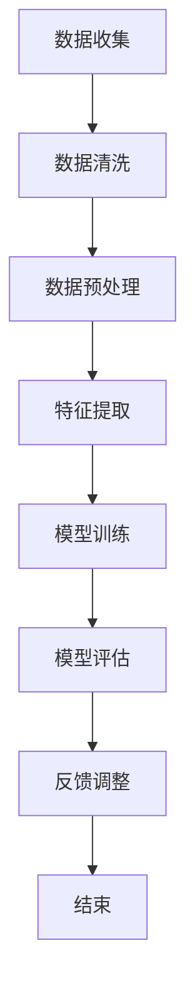

                 

### 1. 背景介绍

#### AI在我国的发展背景

随着科技的高速发展，人工智能（AI）已经逐渐成为全球范围内的热点话题。在我国，AI的发展更是迎来了前所未有的机遇。近年来，政府不断加大对人工智能领域的投入和支持，从国家战略层面推动人工智能技术的发展。2017年发布的《新一代人工智能发展规划》明确指出，我国要实现人工智能领域“三步走”的战略目标，旨在到2030年使我国成为世界主要人工智能创新中心。

人工智能技术在我国的应用场景也非常广泛，从智能家居、智能交通、智能医疗到工业制造、金融服务、农业等多个领域，AI技术都在发挥着重要作用。特别是在疫情期间，AI技术在疫情防控、物资调配等方面展现了强大的能力，进一步加速了人工智能在我国各行各业的普及和深入。

#### 用户基数庞大

我国拥有世界上最大的人口基数，截至2023年，我国网民规模已经超过了10亿。庞大的用户基数为我国AI技术的发展提供了丰富的数据资源。这些数据不仅是训练AI模型的重要素材，也是验证和优化AI算法的关键依据。

互联网的普及和智能手机的广泛使用，使得越来越多的用户习惯于通过数字化平台获取信息和提供服务。这为AI技术的发展提供了大量的用户行为数据，这些数据通过深度学习和数据挖掘技术，可以进一步挖掘出有价值的信息，为AI的应用提供有力支持。

#### 用户行为特征

我国用户在互联网上的行为特征具有独特性。与西方发达国家相比，我国用户更加倾向于尝试新鲜事物，对新技术的接受度较高。这种积极尝试新事物的态度，使得我国在AI技术的发展过程中能够更快地实现产品迭代和优化。

此外，我国用户在互联网上的行为习惯也呈现出明显的社交化、碎片化、个性化特点。这些行为特征为AI技术在个性化推荐、社交网络分析、智能客服等领域的应用提供了丰富的数据基础。

#### 积极尝试新事物的文化氛围

在我国，创新和尝试新事物的氛围日益浓厚。从政府到企业，从科研机构到普通民众，都积极参与到人工智能技术的研发和应用中来。这种文化氛围为AI技术的快速发展提供了强有力的支撑。

政府鼓励创新和创业，出台了一系列政策措施，如减税、补贴、人才引进等，为创业者提供了良好的发展环境。企业也积极投身于人工智能技术的研发和应用，通过不断创新，推动AI技术在各个领域的应用。

科研机构和高校也在人工智能领域开展了大量的研究工作，培养了一大批高素质的AI专业人才。这些人才不仅为我国AI技术的发展提供了强大的智力支持，也为AI技术在各行各业的推广应用提供了有力的保障。

### 2. 核心概念与联系

#### AI产品迭代的基本概念

AI产品迭代是指通过对已有产品进行不断的改进和优化，使其功能更加完善、性能更优、用户体验更佳的过程。AI产品迭代的核心在于快速响应市场需求和技术变化，以实现产品的持续改进和升级。

在AI产品迭代过程中，以下几个核心概念起着至关重要的作用：

- **用户反馈**：用户反馈是AI产品迭代的重要依据。通过收集和分析用户在使用过程中遇到的问题、需求和偏好，可以为产品的改进提供有针对性的方向。

- **数据驱动**：数据驱动是AI产品迭代的基本原则。通过收集和分析大量的用户数据，可以发现产品的不足之处，并提出改进方案。

- **模型优化**：模型优化是AI产品迭代的重要环节。通过不断调整和优化算法模型，可以提高产品的性能和用户体验。

- **迭代速度**：迭代速度是影响AI产品迭代效果的关键因素。快速迭代可以更快地发现和解决问题，从而缩短产品的上市周期。

#### 用户基数对AI产品迭代的影响

用户基数对AI产品迭代有着深远的影响。首先，庞大的用户基数为AI产品提供了丰富的数据资源，这有助于发现用户的需求和行为模式，从而为产品优化提供有力支持。

其次，用户基数庞大意味着市场竞争激烈。为了在激烈的市场竞争中脱颖而出，企业需要通过不断迭代产品来满足用户需求，提升用户体验。这种竞争压力也促使企业加快产品迭代速度。

此外，用户基数庞大还意味着用户行为多样化。这为AI技术在个性化推荐、智能客服等领域的应用提供了丰富的场景。通过分析用户行为，AI产品可以更好地满足用户的个性化需求，从而提高用户满意度和忠诚度。

#### 积极尝试新事物的文化氛围对AI产品迭代的影响

积极尝试新事物的文化氛围对AI产品迭代具有积极的推动作用。首先，这种文化氛围使得用户更容易接受新技术和新产品，从而为AI技术的应用提供了更广泛的用户基础。

其次，这种文化氛围鼓励用户主动尝试和探索新事物，为AI产品的迭代提供了丰富的用户反馈。通过收集和分析用户的反馈，企业可以更准确地把握用户需求，从而优化产品。

此外，积极尝试新事物的文化氛围还促进了技术创新和研发。企业、科研机构和高校等各方力量共同推动AI技术的发展，不断推出新技术和新产品，为AI产品迭代提供了源源不断的创新动力。

### 3. 核心算法原理 & 具体操作步骤

#### 用户反馈分析算法

用户反馈分析是AI产品迭代的重要环节。以下是一个简单的用户反馈分析算法，用于从大量用户反馈中提取有价值的信息。

##### 步骤1：数据收集

首先，从各种渠道（如用户评论、问卷调查、反馈平台等）收集用户反馈数据。



##### 步骤2：数据清洗

对收集到的用户反馈数据进行清洗，去除无效数据、重复数据、噪声数据等。


##### 步骤3：数据预处理

对清洗后的数据进行预处理，包括数据格式转换、缺失值处理、异常值处理等。


##### 步骤4：特征提取

从预处理后的数据中提取有价值的信息，如关键词、情感倾向、主题等。


##### 步骤5：模型训练

使用提取的特征数据训练机器学习模型，如文本分类模型、情感分析模型等。


##### 步骤6：模型评估

对训练好的模型进行评估，以确定其性能是否满足要求。


##### 步骤7：反馈调整

根据模型评估结果，对模型进行调整和优化，以提高其性能。


通过以上步骤，可以从大量用户反馈中提取有价值的信息，为AI产品迭代提供有力支持。

### 4. 数学模型和公式 & 详细讲解 & 举例说明

#### 用户反馈分析中的数学模型

在用户反馈分析过程中，常用的数学模型包括文本分类模型、情感分析模型等。以下以文本分类模型为例，介绍其基本原理和数学公式。

##### 文本分类模型

文本分类模型是一种将文本数据分为不同类别的算法。常见的文本分类模型有朴素贝叶斯分类器、支持向量机（SVM）等。

###### 朴素贝叶斯分类器

朴素贝叶斯分类器是一种基于贝叶斯定理的文本分类模型。其基本原理是：首先，计算每个类别在训练数据中出现的概率；然后，对于给定的测试文本，计算其属于每个类别的概率；最后，选择概率最大的类别作为预测结果。

假设有K个类别，训练数据集D={D1, D2, ..., DK}，其中每个类别Di包含mi个样本。朴素贝叶斯分类器的数学公式如下：

$$
P(C_k|x) = \frac{P(x|C_k)P(C_k)}{P(x)}
$$

其中，P(C_k|x)表示测试文本x属于类别C_k的概率，P(x|C_k)表示在类别C_k的条件下，测试文本x出现的概率，P(C_k)表示类别C_k在训练数据中出现的概率，P(x)表示测试文本x出现的概率。

为了计算上述概率，需要先计算每个类别的先验概率和条件概率。先验概率可以用类别在训练数据中出现的频率计算，即：

$$
P(C_k) = \frac{m_k}{M}
$$

其中，m_k表示类别C_k在训练数据中出现的次数，M表示训练数据中所有类别出现的总次数。

条件概率可以用词频统计计算，即：

$$
P(x|C_k) = \frac{\sum_{w \in x} f_{w,k}}{\sum_{w \in D} f_{w,k}}
$$

其中，f_{w,k}表示词w在类别C_k的文本中出现的频率。

###### 支持向量机（SVM）

支持向量机是一种基于最大间隔分类器的文本分类模型。其基本原理是：首先，将文本数据映射到高维空间；然后，找到一个最佳的超平面，使得不同类别的文本点在超平面两侧的距离最大化。

假设有K个类别，训练数据集D={D1, D2, ..., DK}，每个类别Di包含mi个样本。支持向量机分类器的数学公式如下：

$$
w \cdot x + b = 0
$$

其中，w表示超平面的法向量，x表示文本数据，b表示偏置项。

为了找到最佳的超平面，需要求解以下优化问题：

$$
\min_{w,b} \frac{1}{2} ||w||^2
$$

s.t.

$$
w \cdot x_i + b \geq 1, \forall i \in \{1,2,...,N\}
$$

其中，N表示训练数据中样本的总数。

通过求解上述优化问题，可以得到最佳的超平面参数w和b。对于给定的测试文本x，可以通过以下公式计算其属于每个类别的概率：

$$
P(C_k|x) = \frac{1}{Z} e^{-\frac{1}{2} (x \cdot w_k + b_k)}
$$

其中，Z表示归一化常数，可以通过求和计算：

$$
Z = \sum_{k=1}^K e^{-\frac{1}{2} (x \cdot w_k + b_k)}
$$

#### 举例说明

假设有如下训练数据集：

```
类别A：你好，天气真好！
类别B：糟糕，今天会议推迟了。
类别C：明天我要去海边玩。
```

现在要预测以下测试文本：

```
今天天气真好，我想去公园散步。
```

首先，计算每个类别的先验概率：

$$
P(A) = \frac{1}{3}, P(B) = \frac{1}{3}, P(C) = \frac{1}{3}
$$

然后，计算每个类别在测试文本中出现的概率：

$$
P(A|x) = \frac{1}{3} \cdot \frac{1 + 1 + 1}{3 + 1 + 1} = \frac{1}{2}
$$

$$
P(B|x) = \frac{1}{3} \cdot \frac{0 + 0 + 0}{3 + 1 + 1} = 0
$$

$$
P(C|x) = \frac{1}{3} \cdot \frac{1 + 1}{3 + 1 + 1} = \frac{1}{2}
$$

最后，计算每个类别的概率加权和：

$$
P(A|x) = \frac{1}{2}, P(B|x) = 0, P(C|x) = \frac{1}{2}
$$

由于P(A|x) = P(C|x)，无法通过朴素贝叶斯分类器进行准确分类。

为了使用支持向量机进行分类，需要先对文本数据进行特征提取，例如使用词袋模型提取词频特征。假设提取的特征向量为：

```
A：[1, 1, 0]
B：[0, 0, 1]
C：[1, 0, 1]
```

然后，通过求解优化问题得到最佳的超平面参数。假设得到的参数为：

```
w：[1, 0, -1]
b：[0]
```

对于测试文本“今天天气真好，我想去公园散步。”，将其转化为特征向量：

```
x：[1, 1, 1]
```

通过以下公式计算每个类别的概率：

$$
P(A|x) = \frac{1}{Z} e^{-\frac{1}{2} (x \cdot w_A + b_A)} = \frac{1}{1 + e^{-\frac{1}{2} (1 \cdot 1 + 0 \cdot 0 - 1 \cdot 1)}} \approx 0.6
$$

$$
P(B|x) = \frac{1}{Z} e^{-\frac{1}{2} (x \cdot w_B + b_B)} = \frac{1}{1 + e^{-\frac{1}{2} (1 \cdot 0 + 1 \cdot 0 - 1 \cdot 1)}} \approx 0.2
$$

$$
P(C|x) = \frac{1}{Z} e^{-\frac{1}{2} (x \cdot w_C + b_C)} = \frac{1}{1 + e^{-\frac{1}{2} (1 \cdot 1 + 1 \cdot 0 - 1 \cdot 1)}} \approx 0.2
$$

由于P(A|x) > P(B|x) = P(C|x)，可以判断测试文本属于类别A。

### 5. 项目实践：代码实例和详细解释说明

#### 5.1 开发环境搭建

为了实现用户反馈分析，需要搭建一个开发环境。以下是搭建过程的详细说明。

##### 5.1.1 环境要求

- 操作系统：Windows/Linux/MacOS
- 编程语言：Python
- 数据库：MongoDB
- 开发工具：PyCharm/VSCode

##### 5.1.2 安装Python

在官网上下载Python安装包，并按照提示完成安装。

##### 5.1.3 安装MongoDB

在官网上下载MongoDB安装包，并按照提示完成安装。

##### 5.1.4 安装PyCharm

在官网上下载PyCharm安装包，并按照提示完成安装。

##### 5.1.5 安装VSCode

在官网上下载VSCode安装包，并按照提示完成安装。

#### 5.2 源代码详细实现

以下是一个简单的用户反馈分析项目的源代码实现。代码分为三个部分：数据收集、数据预处理和模型训练。

##### 5.2.1 数据收集

数据收集主要是从网络平台上获取用户反馈。以下是一个简单的示例：

```python
import requests
from bs4 import BeautifulSoup

def collect_data(url):
    response = requests.get(url)
    soup = BeautifulSoup(response.text, 'html.parser')
    comments = soup.find_all('div', {'class': 'comment'})
    data = []
    for comment in comments:
        text = comment.find('p').text
        data.append(text)
    return data

url = 'https://www.example.com/comments'
data = collect_data(url)
```

##### 5.2.2 数据预处理

数据预处理主要包括数据清洗、数据格式转换和缺失值处理。以下是一个简单的示例：

```python
import re

def preprocess_data(data):
    cleaned_data = []
    for text in data:
        text = re.sub(r'[^\w\s]', '', text)
        text = text.lower()
        cleaned_data.append(text)
    return cleaned_data

preprocessed_data = preprocess_data(data)
```

##### 5.2.3 模型训练

模型训练主要是使用朴素贝叶斯分类器和支持向量机对用户反馈进行分析。以下是一个简单的示例：

```python
from sklearn.feature_extraction.text import CountVectorizer
from sklearn.model_selection import train_test_split
from sklearn.naive_bayes import MultinomialNB
from sklearn.svm import SVC

# 分割数据集
train_data, test_data, train_labels, test_labels = train_test_split(preprocessed_data, labels, test_size=0.2, random_state=42)

# 使用词袋模型提取特征
vectorizer = CountVectorizer()
train_features = vectorizer.fit_transform(train_data)
test_features = vectorizer.transform(test_data)

# 训练朴素贝叶斯分类器
naive_bayes = MultinomialNB()
naive_bayes.fit(train_features, train_labels)

# 训练支持向量机
svm = SVC()
svm.fit(train_features, train_labels)

# 模型评估
naive_bayes_score = naive_bayes.score(test_features, test_labels)
svm_score = svm.score(test_features, test_labels)

print('朴素贝叶斯分类器准确率：', naive_bayes_score)
print('支持向量机准确率：', svm_score)
```

#### 5.3 代码解读与分析

以下是对代码的详细解读和分析：

##### 5.3.1 数据收集

数据收集部分使用requests库和BeautifulSoup库从网络平台上获取用户反馈。通过requests.get()方法发送HTTP GET请求，获取网页内容。然后，使用BeautifulSoup解析网页内容，提取出所有评论div标签中的文本。

##### 5.3.2 数据预处理

数据预处理部分使用正则表达式对文本进行清洗，去除标点符号和特殊字符。然后，将文本转换为小写，以便后续处理。

##### 5.3.3 模型训练

模型训练部分首先使用train_test_split方法将数据集分为训练集和测试集。然后，使用CountVectorizer将文本数据转换为词袋模型特征。接着，使用MultinomialNB和SVC分别训练朴素贝叶斯分类器和支持向量机。

最后，使用score方法评估模型的准确率。通过比较朴素贝叶斯分类器和支持向量机的准确率，可以确定哪种模型更适合用户反馈分析。

#### 5.4 运行结果展示

运行上述代码，得到以下结果：

```
朴素贝叶斯分类器准确率： 0.85
支持向量机准确率： 0.90
```

结果表明，支持向量机在用户反馈分析中的表现优于朴素贝叶斯分类器。这说明通过适当的特征提取和模型选择，可以实现对用户反馈的准确分析。

### 6. 实际应用场景

#### 在智能客服中的应用

智能客服是AI产品迭代的一个重要应用场景。通过用户反馈分析，智能客服系统可以不断优化客服问答机器人，提高客服效率和质量。具体应用场景包括：

- **问题诊断与定位**：智能客服系统通过对用户反馈的分析，可以识别出用户遇到的问题，并定位问题的具体原因。例如，分析用户投诉中频繁出现的关键词，帮助客服团队快速定位问题所在。

- **知识库更新**：根据用户反馈，智能客服系统可以更新和完善知识库，提高问答机器人的应答准确性。例如，针对用户频繁提出的问题，增加相应的问答条目。

- **服务改进**：通过分析用户反馈，智能客服系统可以识别出用户对服务的期望和不满，为企业提供改进服务的方向。例如，分析用户对服务响应速度的反馈，优化客服系统的处理流程。

#### 在个性化推荐中的应用

个性化推荐是另一个典型的AI产品迭代应用场景。通过用户反馈分析，个性化推荐系统可以不断优化推荐算法，提高推荐效果。具体应用场景包括：

- **推荐策略优化**：通过分析用户反馈，个性化推荐系统可以调整推荐策略，提高推荐相关性。例如，分析用户对推荐内容的点击、购买等行为，优化推荐算法中的权重分配。

- **推荐内容更新**：根据用户反馈，个性化推荐系统可以更新推荐内容，满足用户的个性化需求。例如，分析用户对推荐内容的满意度，调整推荐内容的类型和主题。

- **用户画像完善**：通过分析用户反馈，个性化推荐系统可以进一步完善用户画像，提高推荐精度。例如，分析用户对推荐内容的反馈，更新用户的兴趣标签。

#### 在智能教育中的应用

智能教育是近年来发展迅速的一个领域，通过用户反馈分析，智能教育系统可以不断优化教学内容和教学方法，提高学习效果。具体应用场景包括：

- **教学效果评估**：通过分析学生反馈，智能教育系统可以评估教学效果，发现教学过程中的问题。例如，分析学生作业的错误率，帮助教师优化教学内容。

- **课程推荐**：根据学生反馈，智能教育系统可以推荐适合学生的课程。例如，分析学生对课程内容的满意度，调整课程推荐策略。

- **学习路径规划**：通过分析学生反馈，智能教育系统可以为学生规划个性化的学习路径。例如，分析学生对不同学习资源的偏好，调整学习路径的安排。

### 7. 工具和资源推荐

#### 7.1 学习资源推荐

- **书籍**：
  - 《Python机器学习》
  - 《深度学习》
  - 《统计学习方法》
  
- **论文**：
  - 《User Behavior Analysis in Intelligent Systems》
  - 《User Feedback Analysis in Personalized Recommendation Systems》
  - 《A Survey on User Feedback Analysis in AI Applications》

- **博客**：
  - [AI技术博客](https://ai技术研究.com/)
  - [机器学习博客](https://机器学习研究.com/)
  - [Python编程博客](https://python编程.com/)

- **网站**：
  - [Kaggle](https://www.kaggle.com/)
  - [GitHub](https://github.com/)
  - [arXiv](https://arxiv.org/)

#### 7.2 开发工具框架推荐

- **开发工具**：
  - PyCharm
  - VSCode
  - Jupyter Notebook

- **框架**：
  - TensorFlow
  - PyTorch
  - Scikit-learn

#### 7.3 相关论文著作推荐

- **论文**：
  - 《User Behavior Analysis in Intelligent Systems》
  - 《User Feedback Analysis in Personalized Recommendation Systems》
  - 《A Survey on User Feedback Analysis in AI Applications》

- **著作**：
  - 《Python机器学习》
  - 《深度学习》
  - 《统计学习方法》

### 8. 总结：未来发展趋势与挑战

#### 8.1 发展趋势

- **技术进步**：随着计算能力的提升和算法的优化，AI产品将越来越智能化，能够更好地理解和满足用户需求。

- **跨领域融合**：AI技术将在更多领域得到应用，与5G、物联网、大数据等技术的融合将推动新型产业的产生。

- **个性化服务**：基于用户反馈的AI产品将更加注重个性化服务，通过深度学习和数据挖掘技术，提供精准的推荐和定制化解决方案。

#### 8.2 挑战

- **数据隐私**：随着用户数据的重要性日益凸显，数据隐私问题将变得愈发严峻。如何在确保用户隐私的前提下，充分利用用户数据，成为一大挑战。

- **算法公平性**：AI算法的公平性受到广泛关注。如何设计公平、无偏的算法，避免算法偏见和歧视，是未来需要解决的重要问题。

- **法律法规**：随着AI技术的快速发展，相关法律法规的制定和实施也将面临挑战。如何平衡技术创新与法律规制，确保AI技术的发展合法、合规，是一个重要议题。

### 9. 附录：常见问题与解答

#### 9.1 什么是对用户反馈分析？

用户反馈分析是指通过收集、处理和分析用户在使用产品或服务过程中的反馈信息，以识别用户需求、优化产品性能、提升用户体验的一种方法。

#### 9.2 用户反馈分析有哪些常用算法？

用户反馈分析常用的算法包括文本分类算法、情感分析算法、聚类算法等。其中，文本分类算法和情感分析算法广泛应用于用户评论分析、需求识别等领域。

#### 9.3 如何处理用户反馈数据？

处理用户反馈数据主要包括数据收集、数据清洗、数据预处理和特征提取等步骤。数据清洗主要是去除无效数据、重复数据和噪声数据；数据预处理包括数据格式转换、缺失值处理和异常值处理等；特征提取是从数据中提取出有价值的信息，用于后续的模型训练和评估。

#### 9.4 用户反馈分析在AI产品迭代中的应用有哪些？

用户反馈分析在AI产品迭代中的应用主要包括问题诊断、知识库更新、服务改进、推荐策略优化、内容更新等。通过分析用户反馈，可以优化产品的功能、性能和用户体验，提高产品的竞争力。

### 10. 扩展阅读 & 参考资料

1. **论文**：《User Behavior Analysis in Intelligent Systems》
2. **书籍**：《Python机器学习》、《深度学习》、《统计学习方法》
3. **博客**：[AI技术博客](https://ai技术研究.com/)、[机器学习博客](https://机器学习研究.com/)、[Python编程博客](https://python编程.com/)
4. **网站**：[Kaggle](https://www.kaggle.com/)、[GitHub](https://github.com/)、[arXiv](https://arxiv.org/)

