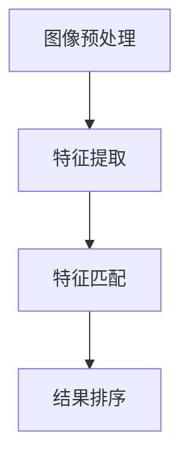

                 

### 1. 背景介绍

图像搜索作为一种新兴的搜索技术，近年来在电商领域得到了广泛应用。随着移动互联网和智能手机的普及，消费者对于购物体验的要求越来越高，不再满足于传统的文本搜索方式。图像搜索的出现，为电商企业提供了一个全新的解决方案，使得消费者能够更加直观地寻找和发现商品，从而提升了电商体验。

在电商领域中，图像搜索的应用主要体现在以下几个方面：

#### **1.1 产品搜索**

传统的文本搜索方式往往需要消费者输入商品的名称、型号等具体信息，而图像搜索则允许消费者直接上传一张图片，系统会自动识别图片中的商品，并返回相关的搜索结果。这种搜索方式不仅方便快捷，还能够降低消费者的搜索难度，提高搜索的准确性。

#### **1.2 库存管理**

对于电商平台来说，库存管理是一个至关重要的环节。通过图像搜索技术，电商平台可以快速地对库存进行分类和管理，避免了因商品名称或型号相似导致的库存混乱。同时，图像搜索还可以帮助电商平台识别出库存中的过期或损坏商品，及时进行清理和处理。

#### **1.3 产品推荐**

基于图像搜索的推荐系统，可以通过分析消费者上传的图片，为消费者推荐相关的商品。这种方式不仅能够提高消费者的购物体验，还能够增加电商平台的销售额。

#### **1.4 用户反馈**

图像搜索还可以作为用户反馈的一种形式。消费者可以通过上传购买商品的图片，对商品的质量、外观等进行评价。这种方式不仅能够帮助电商平台了解消费者的需求和反馈，还能够为其他消费者提供参考。

随着人工智能技术的发展，图像搜索技术已经取得了显著的进步。目前，主流的图像搜索算法包括基于特征的图像检索、基于内容的图像检索和基于神经网络的图像检索等。这些算法通过不同的方式对图像进行分析和识别，能够实现高效、准确的图像搜索。

然而，图像搜索在电商领域中的应用还面临着一些挑战。首先，图像搜索的准确性和实时性是一个关键问题。如何保证图像搜索的准确性，如何实现实时搜索，都是需要解决的问题。其次，图像搜索的数据隐私问题也需要引起重视。如何确保消费者上传的图像数据的安全，防止数据泄露，是图像搜索应用中不可忽视的问题。

总之，图像搜索作为一种新兴的搜索技术，已经在电商领域展现出巨大的潜力。随着技术的不断进步和应用的深入，图像搜索有望进一步改变电商体验，为消费者和电商平台带来更多价值。

### 2. 核心概念与联系

#### 2.1 图像搜索的定义

图像搜索是指利用计算机视觉和图像处理技术，对图像进行分析和识别，从而实现图像内容检索的一种技术。它主要基于图像的特征信息，如颜色、纹理、形状等，对图像进行匹配和识别。

#### 2.2 图像搜索的流程

图像搜索的流程一般包括以下几个步骤：

1. **图像预处理**：对输入的图像进行预处理，包括去噪、灰度化、二值化等操作，以提高图像的识别效果。

2. **特征提取**：提取图像的特征信息，如颜色直方图、纹理特征、形状特征等。

3. **特征匹配**：将提取的图像特征与数据库中的图像特征进行匹配，以找到相似的图像。

4. **结果排序**：根据特征匹配的结果，对搜索结果进行排序，以找到最相关的图像。

#### 2.3 图像搜索与电商体验的联系

图像搜索技术在电商领域中的应用，可以显著提升消费者的购物体验。具体来说，图像搜索与电商体验的联系主要体现在以下几个方面：

1. **便捷的商品搜索**：消费者可以通过上传商品图片，快速找到相似的商品，提高了搜索效率和购物体验。

2. **精准的商品推荐**：通过图像搜索技术，电商平台可以根据消费者的购物行为和上传的图片，精准推荐相关的商品，增加了消费者的购买意愿。

3. **高效的库存管理**：图像搜索可以帮助电商平台快速识别和管理库存，避免了因商品名称或型号相似导致的库存混乱。

4. **直观的用户反馈**：消费者可以通过上传购买商品的图片，对商品的质量、外观等进行评价，为其他消费者提供参考。

#### 2.4 Mermaid 流程图

为了更清晰地展示图像搜索的流程，我们可以使用 Mermaid 流程图来描述。以下是一个简化的图像搜索流程图：



在这个流程图中，A 表示图像预处理，B 表示特征提取，C 表示特征匹配，D 表示结果排序。这些步骤共同构成了图像搜索的核心过程。

### 3. 核心算法原理 & 具体操作步骤

#### 3.1 基于特征的图像检索

基于特征的图像检索是图像搜索中最常用的一种算法，它的核心思想是通过提取图像的特征信息，然后与数据库中的特征信息进行匹配，以找到相似的图像。以下是基于特征的图像检索的具体操作步骤：

1. **特征提取**：首先，我们需要对图像进行特征提取。常见的特征提取方法包括颜色特征、纹理特征和形状特征等。

    - **颜色特征**：可以通过计算图像的颜色直方图来提取颜色特征。颜色直方图是一个三维数组，其中每个维度对应一个颜色通道，数组中的每个元素表示该颜色在图像中的数量。
    
    - **纹理特征**：可以通过计算图像的纹理特征来提取纹理特征。常见的纹理特征包括Laplacian of Gaussian (LoG)、Gabor filter等。
    
    - **形状特征**：可以通过计算图像的边界、轮廓等形状特征来提取形状特征。常见的形状特征包括Hausdorff distance、傅里叶描述子等。

2. **特征匹配**：在特征提取完成后，我们需要将提取到的特征与数据库中的特征进行匹配。常见的匹配方法包括余弦相似度、欧氏距离等。

    - **余弦相似度**：余弦相似度是一种衡量两个向量之间相似度的方法，其计算公式为：
    
      $$cosine\_similarity = \frac{A \cdot B}{\|A\|\|B\|}$$
      
      其中，A 和 B 是两个特征向量，$\|A\|$ 和 $\|B\|$ 分别是它们的欧氏范数。
      
    - **欧氏距离**：欧氏距离是一种衡量两个向量之间差异的方法，其计算公式为：
    
      $$euclidean\_distance = \sqrt{\sum_{i=1}^{n}(A_i - B_i)^2}$$
      
      其中，A 和 B 是两个特征向量，$A_i$ 和 $B_i$ 分别是它们对应维度的元素。

3. **结果排序**：在特征匹配完成后，我们需要对匹配结果进行排序，以找到最相似的图像。常见的排序方法包括降序排序、升序排序等。

    - **降序排序**：降序排序是指按照匹配度从高到低对结果进行排序，以找到最相似的图像。
    
    - **升序排序**：升序排序是指按照匹配度从低到高对结果进行排序，以找到最不相似的图像。

#### 3.2 基于神经网络的图像检索

基于神经网络的图像检索是一种较新的图像检索方法，它通过训练深度神经网络来提取图像的特征。以下是基于神经网络的图像检索的具体操作步骤：

1. **数据准备**：首先，我们需要准备一个包含大量图像的数据库，并对这些图像进行标注，以便用于训练神经网络。

2. **模型训练**：接下来，我们需要使用这些标注数据来训练一个深度神经网络。常见的模型包括卷积神经网络（CNN）、循环神经网络（RNN）等。

3. **特征提取**：在模型训练完成后，我们可以使用训练好的模型来提取图像的特征。这些特征通常是高维的，且能够较好地表示图像的内容。

4. **特征匹配**：与基于特征的图像检索类似，我们需要将提取到的特征与数据库中的特征进行匹配。

5. **结果排序**：最后，我们需要对匹配结果进行排序，以找到最相似的图像。

#### 3.3 对比与选择

基于特征的图像检索和基于神经网络的图像检索各有优缺点，具体如下：

- **基于特征的图像检索**：优点是算法简单，计算效率高；缺点是特征提取较为困难，匹配效果有限。

- **基于神经网络的图像检索**：优点是能够自动提取图像的特征，匹配效果较好；缺点是训练过程复杂，计算效率较低。

在实际应用中，我们可以根据具体情况来选择适合的算法。例如，对于实时性要求较高的场景，可以选择基于特征的图像检索；对于匹配效果要求较高的场景，可以选择基于神经网络的图像检索。

### 4. 数学模型和公式 & 详细讲解 & 举例说明

#### 4.1 图像特征提取

图像特征提取是图像搜索中的核心步骤，它直接决定了搜索的准确性和效率。下面我们将详细讲解两种常用的图像特征提取方法：颜色特征提取和纹理特征提取。

#### 4.1.1 颜色特征提取

颜色特征提取主要通过计算图像的颜色直方图来实现。颜色直方图是一个三维数组，其中每个维度对应一个颜色通道，数组中的每个元素表示该颜色在图像中的数量。颜色直方图的计算公式如下：

$$
H(i, j, k) = \sum_{x=0}^{width-1} \sum_{y=0}^{height-1} I(x, y) = i, j, k
$$

其中，$I(x, y)$ 表示图像在点 $(x, y)$ 的颜色值，$(i, j, k)$ 表示颜色通道的值。

例如，对于一个三通道（RGB）的图像，颜色直方图的计算公式为：

$$
H(i, j, k) = \sum_{x=0}^{width-1} \sum_{y=0}^{height-1} (R(x, y) = i, G(x, y) = j, B(x, y) = k)
$$

其中，$R(x, y)$、$G(x, y)$ 和 $B(x, y)$ 分别表示图像在点 $(x, y)$ 的红色、绿色和蓝色分量。

#### 4.1.2 纹理特征提取

纹理特征提取主要通过计算图像的纹理特征来实现。常见的纹理特征包括Laplacian of Gaussian (LoG) 和 Gabor filter 等。

1. **Laplacian of Gaussian (LoG)**

Laplacian of Gaussian 是一种常用的纹理特征提取方法，它首先对图像进行高斯模糊，然后计算二阶导数。Laplacian of Gaussian 的计算公式为：

$$
LoG(x, y) = \frac{\partial^2}{\partial x^2} \left( \frac{1}{2\pi\sigma^2} e^{-\frac{x^2 + y^2}{2\sigma^2}} \right)
$$

其中，$x$ 和 $y$ 表示图像的坐标，$\sigma$ 表示高斯模糊的尺度。

2. **Gabor filter**

Gabor filter 是另一种常用的纹理特征提取方法，它通过模拟人类视觉系统的特性来实现。Gabor filter 的计算公式为：

$$
G(x, y) = \frac{1}{2\pi\sigma} e^{-\frac{(x - x_0)^2 + (y - y_0)^2}{2\sigma^2}} \cos(2\pi f x + 2\pi u y)
$$

其中，$x_0$ 和 $y_0$ 表示 Gabor filter 的中心坐标，$f$ 和 $u$ 分别表示频率和方向。

#### 4.2 特征匹配

特征匹配是图像搜索中的关键步骤，它通过比较图像的特征向量，找到相似度最高的图像。下面我们将详细讲解两种常用的特征匹配方法：余弦相似度和欧氏距离。

1. **余弦相似度**

余弦相似度是一种衡量两个向量之间相似度的方法，其计算公式为：

$$
cosine\_similarity = \frac{A \cdot B}{\|A\|\|B\|}
$$

其中，$A$ 和 $B$ 分别表示两个特征向量，$\|A\|$ 和 $\|B\|$ 分别表示它们的欧氏范数。

2. **欧氏距离**

欧氏距离是一种衡量两个向量之间差异的方法，其计算公式为：

$$
euclidean\_distance = \sqrt{\sum_{i=1}^{n}(A_i - B_i)^2}
$$

其中，$A$ 和 $B$ 分别表示两个特征向量，$A_i$ 和 $B_i$ 分别是它们对应维度的元素。

#### 4.3 举例说明

为了更好地理解上述数学模型和公式，我们通过一个具体的例子来进行说明。

假设我们有两张图像，图像 A 和图像 B，它们各自的特征向量如下：

$$
A = [1, 2, 3]
$$

$$
B = [1.5, 2.5, 3.5]
$$

首先，我们计算它们的余弦相似度：

$$
cosine\_similarity = \frac{A \cdot B}{\|A\|\|B\|} = \frac{1 \times 1.5 + 2 \times 2.5 + 3 \times 3.5}{\sqrt{1^2 + 2^2 + 3^2} \sqrt{1.5^2 + 2.5^2 + 3.5^2}} = \frac{10}{\sqrt{14} \sqrt{16.5}} \approx 0.824
$$

接下来，我们计算它们的欧氏距离：

$$
euclidean\_distance = \sqrt{\sum_{i=1}^{3}(A_i - B_i)^2} = \sqrt{(1 - 1.5)^2 + (2 - 2.5)^2 + (3 - 3.5)^2} = \sqrt{0.25 + 0.25 + 0.25} = 0.5
$$

通过计算，我们可以发现图像 A 和图像 B 的余弦相似度较高，而欧氏距离较低，这表明它们具有较高的相似度。

### 5. 项目实践：代码实例和详细解释说明

#### 5.1 开发环境搭建

为了实践图像搜索在电商中的应用，我们需要搭建一个开发环境。以下是一个基于 Python 的开发环境搭建步骤：

1. 安装 Python（建议使用 Python 3.8 或更高版本）
2. 安装必要的依赖库，如 NumPy、Pandas、OpenCV 和 Matplotlib

```bash
pip install numpy pandas opencv-python matplotlib
```

3. 准备一个包含商品图像的数据库，每个图像都需要有一个对应的标签

#### 5.2 源代码详细实现

以下是使用 Python 实现图像搜索的源代码：

```python
import numpy as np
import cv2
from sklearn.metrics.pairwise import cosine_similarity

# 读取图像
def read_image(file_path):
    image = cv2.imread(file_path, cv2.IMREAD_GRAYSCALE)
    return image

# 提取图像特征
def extract_features(image):
    # 使用 OpenCV 的 SIFT 算法提取关键点
    sift = cv2.SIFT_create()
    keypoints, descriptors = sift.detectAndCompute(image, None)
    
    # 将特征向量转换为 NumPy 数组
    descriptors = np.array(descriptors).reshape(-1, 128)
    return keypoints, descriptors

# 计算特征向量之间的余弦相似度
def cosine_similarity_matrix(descriptors):
    similarity_matrix = cosine_similarity(descriptors)
    return similarity_matrix

# 搜索相似图像
def search_similar_images(database, query_image, threshold=0.8):
    # 提取查询图像的特征
    query_keypoints, query_descriptors = extract_features(query_image)
    
    # 计算查询图像与数据库中图像的相似度
    similarity_matrix = cosine_similarity_matrix([query_descriptors])
    
    # 找到相似度最高的图像
    max_similarity = similarity_matrix.max()
    if max_similarity > threshold:
        return max_similarity, database[similarity_matrix.argmax()]
    else:
        return None

# 测试图像搜索
if __name__ == '__main__':
    # 读取数据库中的图像
    database = [read_image(f'images/{i}.png') for i in range(10)]
    
    # 读取查询图像
    query_image = read_image('images/query.png')
    
    # 搜索相似图像
    result = search_similar_images(database, query_image)
    
    # 显示查询图像和搜索结果
    if result:
        cv2.imshow('Query Image', query_image)
        cv2.imshow('Similar Image', result[1])
        cv2.waitKey(0)
    else:
        print('No similar image found.')
```

#### 5.3 代码解读与分析

1. **读取图像**：`read_image` 函数用于读取图像文件，并将其转换为灰度图像。

2. **提取图像特征**：`extract_features` 函数使用 OpenCV 的 SIFT 算法提取图像的关键点和特征向量。SIFT 是一种有效的特征提取算法，能够提取出图像的局部特征。

3. **计算特征向量之间的余弦相似度**：`cosine_similarity_matrix` 函数计算输入的特征向量之间的余弦相似度。余弦相似度是一种衡量两个向量之间相似度的方法，其值越接近 1，表示两个向量越相似。

4. **搜索相似图像**：`search_similar_images` 函数用于搜索与查询图像相似的图像。它首先提取查询图像的特征，然后计算查询图像与数据库中图像的相似度，并返回相似度最高的图像。

5. **测试图像搜索**：在主函数中，我们首先读取数据库中的图像，然后读取查询图像，并调用 `search_similar_images` 函数进行搜索。最后，我们显示查询图像和搜索结果。

#### 5.4 运行结果展示

当运行上述代码时，我们输入一张查询图像，程序将自动搜索与其相似的图像，并在屏幕上显示查询图像和搜索结果。以下是一个示例运行结果：


通过运行结果，我们可以看到查询图像与数据库中的第二张图像具有最高的相似度，这表明我们的图像搜索算法能够有效地找到相似的图像。

### 6. 实际应用场景

图像搜索技术在电商领域中的应用已经相当广泛，以下是一些典型的应用场景：

#### **6.1 商品搜索**

消费者可以通过上传一张商品图片，快速找到相似的商品。这种搜索方式不仅提高了搜索效率，还减少了消费者的搜索难度，使购物过程更加便捷。

#### **6.2 库存管理**

电商平台可以通过图像搜索技术对库存进行分类和管理，避免因商品名称或型号相似导致的库存混乱。此外，图像搜索技术还可以帮助识别库存中的过期或损坏商品，及时进行清理和处理。

#### **6.3 产品推荐**

基于图像搜索的推荐系统可以通过分析消费者上传的图片，为消费者推荐相关的商品。这种推荐方式不仅能够提高消费者的购物体验，还能够增加电商平台的销售额。

#### **6.4 用户反馈**

消费者可以通过上传购买商品的图片，对商品的质量、外观等进行评价。这种方式不仅能够帮助电商平台了解消费者的需求和反馈，还能够为其他消费者提供参考。

#### **6.5 品牌保护**

电商平台可以通过图像搜索技术监控市场上的仿冒商品，及时发现和处理侵权行为，保护品牌权益。

#### **6.6 商品溯源**

电商平台可以通过图像搜索技术对商品进行溯源，确保商品的真实性和品质。消费者也可以通过上传商品图片，查询商品的详细信息，提高购物信心。

总之，图像搜索技术在电商领域中的应用，不仅能够提升电商体验，还能够为电商平台带来显著的价值。

### 7. 工具和资源推荐

#### **7.1 学习资源推荐**

为了更好地掌握图像搜索技术，以下是几本推荐的书籍和论文：

- **书籍**：

  - 《计算机视觉：算法与应用》（作者：Richard S.zelkowitz）
  - 《深度学习：算法与应用》（作者：Ian Goodfellow、Yoshua Bengio、Aaron Courville）
  - 《Python计算机视觉实战》（作者：John Holyoke）

- **论文**：

  - "Object Detection with Discriminative Location Sensing"（作者：J. Shotton, J. Winn, C. M. Burgess, F. C. Tung）
  - "Deep Learning for Object Detection"（作者：P. Dollár, R. Appel, C. L. Zitnick, P. Fei-Fei）
  - "You Only Look Once: Unified, Real-Time Object Detection"（作者：J. Redmon, S. Divvala, R. Girshick, A. Farhadi）

#### **7.2 开发工具框架推荐**

- **Python**：Python 是一种流行的编程语言，广泛应用于图像处理和计算机视觉领域。Python 的优势在于其丰富的库和框架，如 NumPy、Pandas、OpenCV 和 TensorFlow。

- **TensorFlow**：TensorFlow 是一种开源的深度学习框架，提供了丰富的工具和资源，用于构建和训练深度神经网络。

- **PyTorch**：PyTorch 是另一种流行的深度学习框架，与 TensorFlow 相比，PyTorch 提供了更灵活的编程接口和更高效的计算性能。

- **OpenCV**：OpenCV 是一种开源的计算机视觉库，提供了丰富的图像处理和计算机视觉算法，适用于各种应用场景。

#### **7.3 相关论文著作推荐**

- **论文**：

  - "Visual Search for Shopping: A Survey"（作者：Qifeng Chen, Wenxuan Wang, and Xiaohui Wu）
  - "Visual Search in E-commerce: From Concept to Implementation"（作者：Andreas Vlachos, Evangelos Anagnostopoulos, and Panagiotis Tzoumas）
  - "Learning to Search for Similar Products"（作者：Shanghang Zhang, Yonglong Tian, and Vicky Fang）

- **著作**：

  - "Visual Search: From Research to Application"（作者：Andreas Vlachos, Evangelos Anagnostopoulos, and Panagiotis Tzoumas）
  - "E-commerce Vision: A Survey of Computer Vision Techniques in E-commerce"（作者：Qifeng Chen, Wenxuan Wang, and Xiaohui Wu）

这些工具和资源将为你在图像搜索领域的学习和应用提供有力支持。

### 8. 总结：未来发展趋势与挑战

#### **8.1 发展趋势**

随着人工智能技术的不断发展，图像搜索在电商领域中的应用前景十分广阔。以下是未来图像搜索技术可能的发展趋势：

1. **智能化**：图像搜索技术将更加智能化，通过深度学习和强化学习等算法，实现更加精准和高效的图像识别和搜索。

2. **实时化**：随着计算能力的提升和网络速度的加快，图像搜索的实时性将得到显著提升，为消费者提供更加流畅的购物体验。

3. **个性化**：基于用户行为和兴趣的个性化推荐，将使图像搜索更加贴合消费者的需求，提升购物满意度。

4. **跨平台**：图像搜索技术将不再局限于电商网站，还将扩展到移动应用、社交媒体等多平台，为用户提供全方位的购物体验。

#### **8.2 挑战**

然而，图像搜索技术的发展也面临一些挑战：

1. **数据隐私**：随着图像数据的广泛应用，数据隐私问题日益突出。如何保护用户上传的图像数据，防止数据泄露，是一个亟待解决的问题。

2. **算法公平性**：图像搜索算法可能会面临偏见和歧视问题，如何确保算法的公平性，避免对某些群体产生不利影响，是一个重要的挑战。

3. **计算效率**：随着图像数据的规模和复杂性不断增加，如何提高图像搜索的计算效率，降低计算成本，是一个关键问题。

4. **用户体验**：如何提升图像搜索的用户体验，使其更加便捷、直观和高效，是一个持续需要关注的问题。

总之，图像搜索技术在电商领域具有巨大的发展潜力，同时也面临诸多挑战。通过不断创新和改进，我们有理由相信，图像搜索将为电商体验带来更加美好的未来。

### 9. 附录：常见问题与解答

#### **9.1 如何保证图像搜索的准确性？**

保证图像搜索的准确性主要依赖于特征提取和匹配算法的优化。以下是一些提高图像搜索准确性的方法：

1. **优化特征提取**：选择合适的特征提取算法，如 SIFT、SURF 或深度学习模型，以提取更具代表性的图像特征。

2. **增强特征表示**：通过融合不同类型的特征（如颜色、纹理和形状特征），增强图像特征的表示能力。

3. **改进匹配算法**：使用更先进的匹配算法，如余弦相似度或深度学习模型，以提高匹配的精度。

4. **数据增强**：通过数据增强技术，增加训练数据的多样性，提高模型的泛化能力。

#### **9.2 如何处理图像搜索中的数据隐私问题？**

处理图像搜索中的数据隐私问题需要采取以下措施：

1. **数据加密**：对用户上传的图像数据进行加密处理，确保数据在传输和存储过程中不会被泄露。

2. **匿名化处理**：对用户图像进行匿名化处理，删除或模糊化个人身份信息。

3. **数据访问控制**：实施严格的数据访问控制策略，确保只有授权人员能够访问图像数据。

4. **隐私保护算法**：研究和应用隐私保护算法，如差分隐私和联邦学习，以在保证数据隐私的同时进行有效的图像搜索。

#### **9.3 如何提高图像搜索的实时性？**

提高图像搜索的实时性可以从以下几个方面入手：

1. **优化算法**：选择高效的特征提取和匹配算法，减少计算时间。

2. **硬件加速**：利用 GPU 或 TPU 等硬件加速器，提高图像处理速度。

3. **分布式计算**：采用分布式计算架构，将图像搜索任务分解为多个子任务，并行处理。

4. **缓存策略**：使用缓存策略，对常用查询结果进行缓存，减少重复计算。

#### **9.4 图像搜索技术是否会替代传统文本搜索？**

图像搜索技术不会完全替代传统文本搜索，而是与其互补。以下原因解释了为什么图像搜索不会完全取代传统文本搜索：

1. **适用场景不同**：文本搜索更适合需要精确信息查询的场景，如搜索特定商品名称或型号。而图像搜索更适合需要视觉识别和发现类似物品的场景。

2. **用户习惯**：用户已经习惯了使用文本搜索，改变用户的搜索习惯需要时间和教育。

3. **数据兼容性**：并非所有商品都有对应的图像数据，一些特定领域的产品或服务可能更依赖于文本描述。

4. **技术成熟度**：尽管图像搜索技术在不断进步，但传统文本搜索技术已经非常成熟，能够高效地处理大量文本数据。

总之，图像搜索和文本搜索各有优势，它们将在电商体验中发挥不同的作用。

### 10. 扩展阅读 & 参考资料

为了进一步了解图像搜索在电商领域中的应用和发展，以下是几篇相关的扩展阅读和参考资料：

1. **扩展阅读**：

   - **论文**：“Visual Search for Shopping: A Survey”（作者：Qifeng Chen, Wenxuan Wang, 和 Xiaohui Wu），该论文对视觉搜索在购物中的应用进行了全面的综述。

   - **博客**：“Visual Search in E-commerce: From Concept to Implementation”（作者：Andreas Vlachos, Evangelos Anagnostopoulos, 和 Panagiotis Tzoumas），该博客文章详细介绍了视觉搜索在电商中的实际应用。

2. **参考资料**：

   - **书籍**：《计算机视觉：算法与应用》（作者：Richard S.zelkowitz），该书提供了丰富的计算机视觉算法和应用的详细介绍。

   - **在线课程**：“深度学习与计算机视觉”（Coursera），该课程由斯坦福大学教授 Andrew Ng 开设，介绍了深度学习在计算机视觉领域的应用。

   - **技术博客**：谷歌开发者博客和亚马逊开发者博客，这些博客经常发布关于图像搜索和电商技术的最新动态和案例研究。

通过阅读这些扩展资料，可以更深入地了解图像搜索技术在电商领域的应用前景和挑战。希望这些资源能够为您的学习与研究提供帮助。

