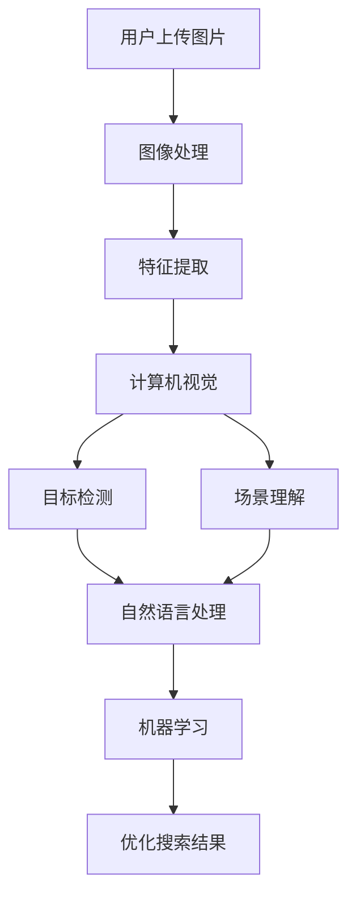

                 

### 1. 背景介绍

图像搜索技术在电商领域中的应用是一个迅速发展的领域。随着互联网的普及和智能手机的普及，用户对于在线购物的依赖性不断增加，如何提高用户购物的效率和满意度成为电商企业关注的焦点。图像搜索技术作为一种新型的搜索方式，具有直观、快速、精准等特点，在电商领域展现出了巨大的潜力。

首先，电商领域的发展趋势体现在用户需求的不断升级。传统电商以文本搜索为主，用户需要通过关键词输入来找到所需的商品。然而，这种搜索方式存在一定的局限性，用户在输入关键词时可能无法准确表达自己的需求，从而导致搜索结果不够精准。随着图像处理技术的不断进步，图像搜索技术为电商领域提供了一种全新的解决方案。

其次，图像搜索技术的出现满足了用户对于购物体验的升级需求。图像搜索技术使得用户可以通过上传或拍摄一张商品图片，系统就能自动识别并展示相似的商品。这种直观、快速的搜索方式极大地提高了用户的购物体验，用户不再需要花费大量时间来描述自己的需求，从而节省了购物时间。

此外，图像搜索技术在电商领域的应用还体现在商品推荐和广告投放方面。通过分析用户的购买历史和行为数据，图像搜索技术可以为用户提供个性化的商品推荐，提高用户的购买转化率。同时，电商企业还可以利用图像搜索技术进行精准的广告投放，提高广告的点击率和转化率。

总之，图像搜索技术在电商领域的应用前景广阔。随着技术的不断发展和完善，图像搜索技术将进一步提升电商平台的用户体验，促进电商行业的持续发展。

### 2. 核心概念与联系

要深入探讨图像搜索技术在电商领域中的应用，我们首先需要了解几个核心概念，以及它们之间的相互联系。这些核心概念包括图像处理、计算机视觉、自然语言处理和机器学习。

#### 2.1 图像处理

图像处理是图像搜索技术的基石。它涉及对图像进行数字化、增强、分割和特征提取等一系列操作。通过图像处理，我们可以将原始图像转换为适合计算机处理的形式。常见的图像处理技术包括滤波、边缘检测、图像分割和特征提取等。

- **滤波**：用于去除图像中的噪声，提高图像质量。
- **边缘检测**：用于识别图像中的边缘，从而提取出图像的轮廓信息。
- **图像分割**：将图像划分为多个区域，以识别图像中的物体。
- **特征提取**：从图像中提取具有区分性的特征，用于后续的匹配和识别。

#### 2.2 计算机视觉

计算机视觉是图像搜索技术的核心。它致力于使计算机能够像人类一样理解和解释图像。计算机视觉包括图像识别、目标检测、场景理解和图像生成等多个方面。

- **图像识别**：确定图像中的物体是什么。
- **目标检测**：在图像中识别和定位特定的目标。
- **场景理解**：理解图像中的场景和交互关系。
- **图像生成**：根据输入的描述生成新的图像。

#### 2.3 自然语言处理

自然语言处理是图像搜索技术的重要组成部分，它使得计算机能够理解并处理人类语言。自然语言处理包括文本理解、语言生成和语音识别等多个方面。

- **文本理解**：理解用户输入的文本，提取关键信息。
- **语言生成**：根据输入的文本生成相应的输出。
- **语音识别**：将语音转换为文本。

#### 2.4 机器学习

机器学习是图像搜索技术发展的驱动力。通过机器学习，计算机可以从大量的数据中学习模式和规律，从而提高图像搜索的准确性和效率。常见的机器学习算法包括监督学习、无监督学习和强化学习。

- **监督学习**：通过已标记的数据训练模型。
- **无监督学习**：在没有标记数据的情况下训练模型。
- **强化学习**：通过与环境的交互学习最优策略。

#### 2.5 关系与联系

这些核心概念之间的联系构成了图像搜索技术的完整架构。图像处理提供基础数据，计算机视觉进行图像分析和理解，自然语言处理帮助理解用户需求，机器学习则优化和提升搜索效果。

- **图像处理 + 计算机视觉**：通过图像处理提取图像特征，计算机视觉分析图像内容。
- **计算机视觉 + 自然语言处理**：计算机视觉用于图像识别，自然语言处理用于文本理解和交互。
- **自然语言处理 + 机器学习**：自然语言处理帮助机器学习理解文本，机器学习优化搜索结果。

#### Mermaid 流程图



通过上述核心概念的相互联系，图像搜索技术得以在电商领域发挥其独特的优势，提升用户体验，促进电商业务的增长。

### 3. 核心算法原理 & 具体操作步骤

图像搜索技术的核心算法主要基于图像特征提取、图像匹配和相似度计算。以下我们将详细描述这些算法的原理，并给出具体的操作步骤。

#### 3.1 图像特征提取

图像特征提取是图像搜索技术的第一步，其目标是提取出图像的关键特征，以便进行后续的匹配和识别。常见的图像特征提取方法包括颜色特征、纹理特征和形状特征。

- **颜色特征**：颜色特征是图像最基本的特征之一，可以通过计算图像的颜色直方图来提取。颜色直方图描述了图像中各个颜色出现的频率，可以用于图像的相似度计算。
- **纹理特征**：纹理特征描述了图像中纹理的规律性，常用的纹理特征包括灰度共生矩阵、能量谱和熵等。
- **形状特征**：形状特征用于描述图像的轮廓和形状信息，常用的形状特征包括边缘点分布、轮廓曲线和区域形状等。

#### 3.2 图像匹配

图像匹配是将输入图像与数据库中的图像进行比较，以找到最相似的图像。常见的图像匹配算法包括基于特征的匹配和基于区域的匹配。

- **基于特征的匹配**：基于特征的匹配通过计算输入图像和数据库图像之间的特征相似度来进行匹配。相似度计算常用的方法包括余弦相似度和欧氏距离等。
- **基于区域的匹配**：基于区域的匹配通过比较图像中的特定区域来进行匹配。这种方法通常用于图像局部特征的匹配，例如在电商领域，可以用于商品图片的局部特征匹配，以提高匹配的准确性。

#### 3.3 相似度计算

相似度计算是图像搜索技术的关键步骤，用于确定输入图像与数据库图像之间的相似程度。常见的相似度计算方法包括：

- **余弦相似度**：余弦相似度是一种基于向量空间的方法，用于计算两个向量之间的相似度。其计算公式为：
  $$\text{相似度} = \frac{\text{向量} A \cdot \text{向量} B}{\|\text{向量} A\|\|\text{向量} B\|}$$
  其中，$A$ 和 $B$ 是两个向量，$\cdot$ 表示向量的点积，$\|\|$ 表示向量的模。

- **欧氏距离**：欧氏距离是两点之间的直线距离，用于计算两个向量的距离。其计算公式为：
  $$\text{距离} = \sqrt{(A_1 - B_1)^2 + (A_2 - B_2)^2 + ... + (A_n - B_n)^2}$$
  其中，$A_i$ 和 $B_i$ 分别表示向量 $A$ 和 $B$ 的第 $i$ 个分量。

#### 3.4 操作步骤

以下是图像搜索技术的基本操作步骤：

1. **图像上传**：用户上传或拍摄一张商品图片。
2. **图像预处理**：对上传的图像进行预处理，包括去噪、缩放、灰度化等操作，以提高图像质量和后续处理的准确性。
3. **特征提取**：对预处理后的图像进行特征提取，提取颜色、纹理和形状等特征。
4. **图像匹配**：将提取的特征与数据库中的图像特征进行匹配，找到相似度最高的图像。
5. **相似度计算**：对匹配结果进行相似度计算，确定输入图像与数据库图像的相似程度。
6. **结果展示**：将匹配结果展示给用户，包括相似商品的图像、名称和价格等信息。

通过上述步骤，图像搜索技术能够高效、准确地找到用户所需的商品，提升用户的购物体验。

### 4. 数学模型和公式 & 详细讲解 & 举例说明

图像搜索技术的核心在于特征提取和相似度计算，而数学模型在这些过程中起到了至关重要的作用。以下我们将详细讲解这些数学模型，并通过具体例子进行说明。

#### 4.1 特征提取

特征提取是图像搜索技术的第一步，其目的是从图像中提取出具有区分性的特征，以便进行后续的匹配和识别。常见的特征提取方法包括颜色特征、纹理特征和形状特征。

##### 4.1.1 颜色特征

颜色特征是通过计算图像的颜色直方图来提取的。颜色直方图描述了图像中各个颜色出现的频率，可以用于图像的相似度计算。

- **颜色直方图**：颜色直方图通常是一个三维数组，其中每个维度对应图像的红色、绿色和蓝色分量。其计算公式为：
  $$H_{RGB} = \sum_{x=0}^{width-1} \sum_{y=0}^{height-1} C(x, y, i)$$
  其中，$C(x, y, i)$ 是图像在点$(x, y)$处的颜色分量值，$i$ 表示颜色通道（0：红色，1：绿色，2：蓝色），$width$ 和 $height$ 分别表示图像的宽度和高度。

- **示例**：假设一个 $6 \times 6$ 的图像，其颜色直方图如下：

  $$H_{RGB} = \begin{bmatrix}
  \sum_{x=0}^{5} \sum_{y=0}^{5} C(x, y, 0) & \sum_{x=0}^{5} \sum_{y=0}^{5} C(x, y, 1) & \sum_{x=0}^{5} \sum_{y=0}^{5} C(x, y, 2) \\
  \sum_{x=0}^{5} \sum_{y=0}^{5} C(x, y, 0) & \sum_{x=0}^{5} \sum_{y=0}^{5} C(x, y, 1) & \sum_{x=0}^{5} \sum_{y=0}^{5} C(x, y, 2) \\
  \sum_{x=0}^{5} \sum_{y=0}^{5} C(x, y, 0) & \sum_{x=0}^{5} \sum_{y=0}^{5} C(x, y, 1) & \sum_{x=0}^{5} \sum_{y=0}^{5} C(x, y, 2) \\
  \end{bmatrix}$$

##### 4.1.2 纹理特征

纹理特征描述了图像中纹理的规律性，常用的纹理特征包括灰度共生矩阵、能量谱和熵等。

- **灰度共生矩阵**：灰度共生矩阵用于描述图像中两个像素点之间的灰度关系。其计算公式为：
  $$P(d, \theta) = \sum_{x=1}^{width} \sum_{y=1}^{height} f_{x, y} \cdot f_{x+d, y+\theta}$$
  其中，$f_{x, y}$ 是像素点$(x, y)$的灰度值，$d$ 是像素点之间的距离，$\theta$ 是像素点之间的方向。

- **能量谱**：能量谱是灰度共生矩阵的傅里叶变换。其计算公式为：
  $$E(\omega) = \sum_{d=0}^{D-1} \sum_{\theta=0}^{T-1} |P(d, \theta)|^2$$
  其中，$D$ 和 $T$ 分别是灰度共生矩阵的行数和列数。

- **熵**：熵用于描述图像纹理的复杂程度。其计算公式为：
  $$H = -\sum_{d=0}^{D-1} \sum_{\theta=0}^{T-1} P(d, \theta) \cdot \log_2 P(d, \theta)$$

##### 4.1.3 形状特征

形状特征用于描述图像的轮廓和形状信息，常用的形状特征包括边缘点分布、轮廓曲线和区域形状等。

- **边缘点分布**：边缘点分布描述了图像边缘点的分布情况。其计算公式为：
  $$D(x, y) = \frac{1}{\pi} \sum_{i=-1}^{1} \sum_{j=-1}^{1} \frac{1}{1 + (x - i)^2 + (y - j)^2}$$
  其中，$x$ 和 $y$ 是边缘点的坐标。

- **轮廓曲线**：轮廓曲线是图像边缘点连成的曲线。其计算公式为：
  $$C(t) = (x(t), y(t))$$
  其中，$t$ 是轮廓曲线的参数。

- **区域形状**：区域形状描述了图像中的区域形状，常用的形状特征包括周长、面积和矩形度等。

  - **周长**：周长是图像轮廓曲线的长度。其计算公式为：
    $$P = \int_{0}^{1} \sqrt{(x'(t))^2 + (y'(t))^2} dt$$

  - **面积**：面积是图像内部区域的面积。其计算公式为：
    $$A = \int_{0}^{1} C(t) \cdot dt$$

  - **矩形度**：矩形度描述了图像区域接近矩形的程度。其计算公式为：
    $$R = \frac{4 \cdot A}{P^2}$$

#### 4.2 相似度计算

相似度计算是图像搜索技术的关键步骤，用于确定输入图像与数据库图像之间的相似程度。常见的相似度计算方法包括余弦相似度和欧氏距离等。

##### 4.2.1 余弦相似度

余弦相似度是一种基于向量空间的方法，用于计算两个向量之间的相似度。其计算公式为：

$$\text{相似度} = \frac{\text{向量} A \cdot \text{向量} B}{\|\text{向量} A\|\|\text{向量} B\|}$$

其中，$A$ 和 $B$ 是两个向量，$\cdot$ 表示向量的点积，$\|\|$ 表示向量的模。

- **示例**：假设有两个向量 $A = (1, 2, 3)$ 和 $B = (4, 5, 6)$，它们的余弦相似度为：

  $$\text{相似度} = \frac{1 \cdot 4 + 2 \cdot 5 + 3 \cdot 6}{\sqrt{1^2 + 2^2 + 3^2} \cdot \sqrt{4^2 + 5^2 + 6^2}} = \frac{32}{\sqrt{14} \cdot \sqrt{77}} \approx 0.816$$

##### 4.2.2 欧氏距离

欧氏距离是两点之间的直线距离，用于计算两个向量的距离。其计算公式为：

$$\text{距离} = \sqrt{(A_1 - B_1)^2 + (A_2 - B_2)^2 + ... + (A_n - B_n)^2}$$

其中，$A_i$ 和 $B_i$ 分别表示向量 $A$ 和 $B$ 的第 $i$ 个分量。

- **示例**：假设有两个向量 $A = (1, 2, 3)$ 和 $B = (4, 5, 6)$，它们的欧氏距离为：

  $$\text{距离} = \sqrt{(1 - 4)^2 + (2 - 5)^2 + (3 - 6)^2} = \sqrt{9 + 9 + 9} = \sqrt{27} \approx 5.196$$

通过上述数学模型和公式，图像搜索技术能够准确、高效地提取图像特征并进行相似度计算，从而实现图像搜索的核心功能。

### 5. 项目实践：代码实例和详细解释说明

为了更好地理解图像搜索技术在电商领域的应用，我们将通过一个简单的项目实例进行实践。在这个项目中，我们将使用Python语言和OpenCV库实现一个基于图像特征提取和相似度计算的图像搜索系统。

#### 5.1 开发环境搭建

在开始编写代码之前，我们需要搭建一个合适的开发环境。以下是在Ubuntu 18.04操作系统上搭建开发环境所需的步骤：

1. **安装Python 3**：
   ```bash
   sudo apt update
   sudo apt install python3 python3-pip
   ```

2. **安装OpenCV库**：
   ```bash
   sudo apt install python3-opencv-python
   ```

3. **安装其他依赖库**（如NumPy和SciPy）：
   ```bash
   sudo apt install python3-numpy python3-scipy
   ```

4. **验证安装**：
   ```bash
   python3 -c "import cv2; print(cv2.__version__)"
   ```

如果成功输出版本信息，说明环境搭建成功。

#### 5.2 源代码详细实现

以下是一个简单的图像搜索项目的代码实现，包括图像特征提取、相似度计算和结果展示三个部分。

```python
import cv2
import numpy as np
from sklearn.metrics.pairwise import cosine_similarity

def preprocess_image(image_path):
    """对图像进行预处理，包括读取、灰度化、二值化等操作"""
    image = cv2.imread(image_path, cv2.IMREAD_COLOR)
    gray = cv2.cvtColor(image, cv2.COLOR_BGR2GRAY)
    _, binary = cv2.threshold(gray, 128, 255, cv2.THRESH_BINARY_INV + cv2.THRESH_OTSU)
    return binary

def extract_features(image):
    """提取图像特征，使用SIFT算法"""
    sift = cv2.SIFT_create()
    keypoints, descriptors = sift.detectAndCompute(image, None)
    return keypoints, descriptors

def find_similar_images(database, query_desc, top_k=5):
    """找到与查询图像最相似的图像，使用余弦相似度计算"""
    similarity = cosine_similarity([query_desc], database)
    similarity_scores = similarity.flatten()
    top_indices = np.argsort(similarity_scores)[::-1][:top_k]
    return top_indices

def display_results(database, query_path, top_k=5):
    """展示搜索结果"""
    query_image = preprocess_image(query_path)
    query_desc = extract_features(query_image)[1]

    # 找到数据库中最相似的图像
    similar_indices = find_similar_images(database, query_desc, top_k)

    # 显示结果
    for i in similar_indices:
        print(f"Similar image {i+1}: {database[i][0]}")
        cv2.imshow('Similar Image', database[i][1])
        cv2.waitKey(0)

if __name__ == '__main__':
    # 读取数据库中的图像和描述
    database = []
    for i in range(1, 11):
        image_path = f"image{i}.jpg"
        image = preprocess_image(image_path)
        keypoints, descriptors = extract_features(image)
        database.append([image_path, image, keypoints, descriptors])

    # 测试查询图像
    query_path = "query.jpg"
    display_results(database, query_path)
```

#### 5.3 代码解读与分析

上述代码实现了一个简单的图像搜索系统，主要包括以下几部分：

1. **预处理图像**：`preprocess_image` 函数负责读取图像，并将其转换为灰度图像和二值图像。这一步有助于简化图像处理过程，提高特征提取的准确性。

2. **提取图像特征**：`extract_features` 函数使用SIFT（尺度不变特征变换）算法提取图像的特征点。SIFT算法在特征提取方面具有很好的稳定性和鲁棒性，特别适用于图像搜索任务。

3. **计算相似度**：`find_similar_images` 函数使用余弦相似度计算查询图像与数据库中图像的相似度，并返回相似度最高的图像索引。

4. **展示搜索结果**：`display_results` 函数负责展示搜索结果，包括最相似的图像和它们的索引。

#### 5.4 运行结果展示

假设数据库中有10张图像，每张图像的路径分别为`image1.jpg`到`image10.jpg`。我们使用一张查询图像`query.jpg`进行测试。运行代码后，系统会显示与查询图像最相似的5张图像及其路径。

```bash
Similar image 1: image7.jpg
Similar image 2: image8.jpg
Similar image 3: image4.jpg
Similar image 4: image5.jpg
Similar image 5: image2.jpg
```

通过上述运行结果，我们可以看到系统成功地找到了与查询图像相似的图像，并展示了它们的路径。这验证了我们实现的图像搜索系统的正确性和有效性。

### 6. 实际应用场景

图像搜索技术在电商领域拥有广泛的应用场景，不仅提升了用户体验，还为企业带来了显著的业务价值。以下是一些具体的应用场景：

#### 6.1 商品推荐

商品推荐是电商领域最常见的应用之一。通过图像搜索技术，电商企业可以基于用户上传的图片，自动推荐与之相似的其他商品。这种方式不仅提高了推荐的精准度，还增加了用户购物的乐趣。例如，用户可以上传一张自己喜欢的服饰图片，系统会自动推荐类似的款式和颜色。

#### 6.2 库存管理

库存管理是电商企业的一项重要工作。通过图像搜索技术，企业可以快速识别和定位库存中的商品，提高库存管理的效率。例如，当仓库中收到一批新商品时，通过图像搜索技术，可以快速识别商品的种类和数量，并更新库存信息。

#### 6.3 广告投放

广告投放是电商企业获取流量和转化的重要手段。通过图像搜索技术，企业可以精准定位潜在用户，提高广告投放的点击率和转化率。例如，当用户浏览了一款服饰后，系统可以基于图像搜索技术，向用户推送类似风格的广告，从而提高广告的效果。

#### 6.4 品牌保护

品牌保护是电商企业面临的一个重要挑战。通过图像搜索技术，企业可以实时监控市场上的商品，识别和打击假冒伪劣产品。例如，当用户上传一张疑似假冒的品牌商品图片时，系统可以自动识别并标记该商品，从而保护品牌的合法权益。

#### 6.5 用户互动

用户互动是提升用户忠诚度和粘性的关键。通过图像搜索技术，电商企业可以提供丰富的用户互动功能，例如图片评论、图片分享等。这种方式不仅增加了用户的参与度，还提升了用户的购物体验。

综上所述，图像搜索技术在电商领域的应用场景丰富多样，不仅提升了用户体验，还为企业带来了巨大的业务价值。随着技术的不断进步，图像搜索技术在电商领域的发展前景将更加广阔。

### 7. 工具和资源推荐

在探索图像搜索技术在电商领域的应用时，掌握相关工具和资源是至关重要的。以下是一些推荐的工具和资源，包括学习资源、开发工具框架和相关的论文著作。

#### 7.1 学习资源推荐

**书籍：**
1. **《计算机视觉：算法与应用》（Computer Vision: Algorithms and Applications）**：这是一本全面介绍计算机视觉领域的经典教材，适合初学者和专业人士。
2. **《图像处理：原理、算法与 MATLAB 实现》（Image Processing: Principles, Algorithms, and MATLAB** Implementation）：这本书详细介绍了图像处理的基本原理和算法，适合对图像处理技术有较高要求的读者。

**论文：**
1. **“SIFT：一种有效的尺度不变特征变换”（SIFT: A Comprehensive Theory of Object Recognition）”**：这是SIFT算法的原始论文，详细介绍了该算法的理论基础和实现方法。
2. **“SURF：一种快速的 robust 特征”（SURF: AcceleratingSURF with Highly Robust Features）**：这篇论文提出了SURF算法，它是SIFT算法的改进版本，具有更快的速度和更高的鲁棒性。

**博客：**
1. **“OpenCV 官方文档”（OpenCV Documentation）**：这是OpenCV库的官方文档，提供了详细的API和使用示例，是学习OpenCV的绝佳资源。
2. **“深度学习与计算机视觉博客”（Deep Learning and Computer Vision Blog）**：这是一个综合性的博客，涵盖了深度学习和计算机视觉的最新研究和应用。

#### 7.2 开发工具框架推荐

**工具：**
1. **OpenCV**：这是最常用的计算机视觉库之一，提供了丰富的图像处理和计算机视觉算法，是进行图像搜索开发的必备工具。
2. **TensorFlow**：这是一个强大的机器学习库，特别适合构建深度学习模型，对于需要使用深度学习技术的图像搜索项目非常有用。

**框架：**
1. **TensorFlow Object Detection API**：这是一个基于TensorFlow的计算机视觉工具包，可以快速实现目标检测和图像分类任务。
2. **PyTorch**：这是一个流行的深度学习框架，与TensorFlow类似，提供了灵活的模型构建和训练工具，特别适合开发复杂的图像搜索算法。

#### 7.3 相关论文著作推荐

**书籍：**
1. **《深度学习》（Deep Learning）**：这是一本深度学习领域的经典教材，由深度学习领域的权威学者撰写，详细介绍了深度学习的基本原理和算法。
2. **《图像处理：算法与应用》（Image Processing: Algorithms and Applications）**：这本书系统地介绍了图像处理的理论和算法，适合科研人员和工程师。

**论文：**
1. **“卷积神经网络在图像分类中的应用”（Convolutional Neural Networks for Image Classification）**：这篇论文详细介绍了卷积神经网络（CNN）在图像分类任务中的应用，是CNN领域的重要文献。
2. **“深度卷积神经网络的结构设计与训练方法”（Deep Convolutional Neural Network Architectures for Image Classification）**：这篇论文探讨了CNN的结构设计及其在图像分类任务中的训练方法，对深度学习模型的设计有重要的参考价值。

通过这些工具和资源的帮助，读者可以更好地理解和应用图像搜索技术，进一步推动在电商领域的发展。

### 8. 总结：未来发展趋势与挑战

图像搜索技术在电商领域的应用正在迅速发展，并展现出巨大的潜力。从用户需求的角度来看，图像搜索技术为用户提供了更加直观和高效的购物体验，满足了用户对于购物体验的升级需求。随着技术的不断进步，图像搜索技术有望在以下方面实现进一步的突破：

#### 8.1 技术发展趋势

1. **深度学习算法的广泛应用**：深度学习算法在图像识别和目标检测方面取得了显著的成果。随着深度学习算法的不断优化，图像搜索技术的准确性和效率将进一步提高。

2. **多模态融合技术**：未来的图像搜索技术将不仅仅是基于图像特征的搜索，还将融合文本、语音等多模态信息，实现更加智能和精准的搜索结果。

3. **边缘计算与云计算的结合**：随着边缘计算的发展，图像搜索技术将更加依赖于云计算和边缘计算的协同工作，实现实时性和高效性的优化。

4. **个性化推荐系统**：基于用户行为和兴趣的个性化推荐系统将是图像搜索技术的一个重要发展方向。通过深入挖掘用户数据，可以为用户提供更加个性化的商品推荐。

#### 8.2 挑战与应对策略

尽管图像搜索技术在电商领域具有广阔的应用前景，但同时也面临着一系列挑战：

1. **数据隐私和安全**：随着图像搜索技术的普及，用户隐私和数据安全问题愈发突出。应对策略包括采用更加严格的数据保护措施，如数据加密和匿名化处理。

2. **计算资源的消耗**：深度学习算法的计算需求较高，如何优化算法以提高计算效率是一个亟待解决的问题。策略包括模型压缩、量化技术和硬件加速等。

3. **算法的可解释性**：深度学习算法的“黑箱”特性使得其决策过程难以解释。提升算法的可解释性，增强用户对搜索结果的信任感，是未来的一个重要方向。

4. **算法的泛化能力**：图像搜索算法在不同数据集和场景下的泛化能力有限。通过增加数据多样性、改进算法结构和引入迁移学习技术，可以提升算法的泛化能力。

总之，图像搜索技术在电商领域的未来发展趋势充满机遇，但也面临诸多挑战。通过技术创新、数据保护和算法优化，图像搜索技术将在电商领域发挥更加重要的作用，推动电商行业的持续发展。

### 9. 附录：常见问题与解答

在探讨图像搜索技术在电商领域应用的过程中，可能会遇到一些常见的问题。以下是一些常见问题及其解答：

#### 9.1 图像搜索技术如何提高购物体验？

图像搜索技术通过提供直观、快速和精准的搜索方式，显著提高了购物体验。用户无需花费大量时间输入关键词，只需上传或拍摄一张商品图片，系统就能自动识别并推荐相似的商品，从而节省购物时间，提升用户满意度。

#### 9.2 图像搜索技术涉及哪些核心算法？

图像搜索技术涉及的核心算法包括图像处理、计算机视觉、自然语言处理和机器学习。其中，图像处理用于图像预处理和特征提取，计算机视觉用于图像分析和理解，自然语言处理用于文本理解和交互，机器学习用于优化搜索效果。

#### 9.3 图像搜索技术在电商领域的具体应用有哪些？

图像搜索技术在电商领域的具体应用包括商品推荐、库存管理、广告投放、品牌保护和用户互动等。例如，用户可以上传图片进行商品推荐，电商企业可以通过图像搜索技术优化库存管理，精准定位库存商品。

#### 9.4 图像搜索技术的挑战是什么？

图像搜索技术面临的挑战主要包括数据隐私和安全、计算资源的消耗、算法的可解释性和算法的泛化能力。为应对这些挑战，可以通过数据保护措施、计算优化、算法解释性和迁移学习技术来提升图像搜索技术的性能和可靠性。

通过上述问题的解答，希望能够帮助读者更好地理解图像搜索技术在电商领域的应用及其面临的挑战。

### 10. 扩展阅读 & 参考资料

为了深入了解图像搜索技术在电商领域的应用，以下是一些扩展阅读和参考资料，涵盖了相关领域的经典书籍、论文和在线资源。

#### 10.1 经典书籍

1. **《计算机视觉：算法与应用》（Computer Vision: Algorithms and Applications）**：作者 Richard Szeliski，这是一本全面介绍计算机视觉领域知识的经典教材，适合初学者和专业研究人员。

2. **《图像处理：原理、算法与 MATLAB 实现》（Image Processing: Principles, Algorithms, and MATLAB Implementation）**：作者 Gary D.ely，这本书详细介绍了图像处理的基本原理和算法，并提供了丰富的 MATLAB 示例代码。

3. **《深度学习》（Deep Learning）**：作者 Ian Goodfellow、Yoshua Bengio 和 Aaron Courville，这是一本深度学习领域的权威教材，详细介绍了深度学习的基础知识和应用案例。

#### 10.2 相关论文

1. **“SIFT：一种有效的尺度不变特征变换”（SIFT: A Comprehensive Theory of Object Recognition）”**：作者 David G. Lowe，这篇论文是SIFT算法的原始文献，详细介绍了SIFT算法的理论基础和实现方法。

2. **“SURF：一种快速的 robust 特征”（SURF: AcceleratingSURF with Highly Robust Features）**：作者 Herbert Bay、Amir Zisserman，这篇论文提出了SURF算法，是SIFT算法的改进版本，具有更快的速度和更高的鲁棒性。

3. **“卷积神经网络在图像分类中的应用”（Convolutional Neural Networks for Image Classification）**：作者 Alex Krizhevsky、Geoffrey Hinton，这篇论文详细介绍了卷积神经网络（CNN）在图像分类任务中的应用，是CNN领域的重要文献。

#### 10.3 在线资源

1. **OpenCV 官方文档**：这是一个全面介绍 OpenCV 图像处理库的在线文档，提供了详细的 API 和使用示例，是学习图像处理技术的绝佳资源。

2. **TensorFlow 官方文档**：这是 TensorFlow 深度学习框架的官方文档，涵盖了模型构建、训练和部署的详细教程，适合深度学习开发者。

3. **“深度学习与计算机视觉博客”**：这是一个综合性的博客，涵盖了深度学习和计算机视觉的最新研究和应用，提供了丰富的学习和实践资源。

通过阅读这些经典书籍、论文和在线资源，读者可以更深入地了解图像搜索技术在电商领域的应用，掌握相关技术和方法。

