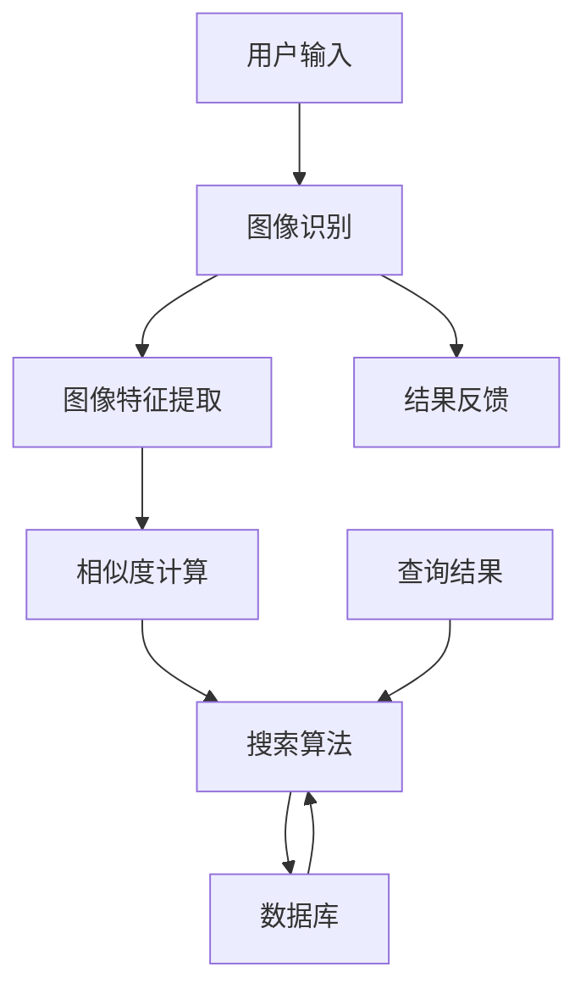

                 

### 1. 背景介绍

随着互联网和人工智能技术的飞速发展，图像搜索技术已经成为现代信息检索领域中的一大热门。图像搜索技术主要指的是通过计算机视觉算法和人工智能技术，对输入的图像进行理解和分析，从而在数据库中找到与之相似的其他图像或相关信息。

在日常生活中，图像搜索技术有着广泛的应用场景。例如，用户可以通过上传一张图片来查找相似的物品，这在电商平台上尤为常见。例如，用户在淘宝上看到一款漂亮的连衣裙，想要寻找更多类似的款式，只需上传这张图片，系统便会自动匹配合适的商品。此外，图像搜索技术还在社交媒体、摄影、医疗等多个领域发挥着重要作用。

随着移动设备的普及和5G网络的快速发展，图像搜索技术的应用场景和需求也在不断扩大。一方面，用户对于图像搜索的准确性和速度要求越来越高；另一方面，图像搜索技术的多样性和复杂性也不断提升。因此，研究如何提高图像搜索技术的性能和效率，成为当前人工智能和计算机视觉领域的重要课题。

本文将围绕图像搜索技术，深入探讨其核心概念、算法原理、数学模型以及实际应用场景，并针对当前存在的挑战和问题，提出一些可能的解决方案和未来发展趋势。通过本文的阅读，读者将能够全面了解图像搜索技术，并对其在各个领域的应用有更深刻的认识。

### 2. 核心概念与联系

图像搜索技术的核心概念包括图像识别、图像特征提取、相似度计算和搜索算法。这些概念之间相互联系，构成了一个完整的技术体系。下面我们将通过一个Mermaid流程图，详细展示这些概念之间的相互关系。



#### 2.1 图像识别

图像识别是图像搜索技术的第一步，它通过计算机视觉算法，对输入的图像进行理解和分析。图像识别的主要任务是从图像中识别出物体、场景、人脸等目标。常见的图像识别算法包括卷积神经网络（CNN）、循环神经网络（RNN）和深度学习模型等。

在图像识别过程中，系统首先会对图像进行预处理，如调整大小、灰度化、二值化等。然后，算法会将预处理后的图像输入到训练好的神经网络中，通过神经网络的层层卷积和池化操作，最终得到图像的特征表示。

#### 2.2 图像特征提取

图像特征提取是图像搜索技术的核心环节，其主要任务是从图像中提取出具有代表性的特征，以便进行后续的相似度计算和搜索。常见的图像特征提取方法包括直方图、SIFT（尺度不变特征变换）、SURF（加速稳健特征）等。

在图像特征提取过程中，系统首先会利用特征提取算法对图像中的关键点进行检测和定位。然后，系统会计算这些关键点的特征向量，并将其作为图像的代表性特征。这些特征向量通常具有高度的唯一性和鲁棒性，即使在图像发生旋转、缩放、遮挡等变化时，也能保持相对稳定。

#### 2.3 相似度计算

相似度计算是图像搜索技术的关键步骤，其主要任务是根据输入图像和数据库中图像的特征向量，计算它们之间的相似度。常见的相似度计算方法包括欧氏距离、余弦相似度、马氏距离等。

在相似度计算过程中，系统会首先对输入图像的特征向量进行预处理，如归一化、标准化等。然后，系统会根据选定的相似度计算方法，计算输入图像与数据库中每张图像的特征向量之间的相似度。相似度越高的图像，表示它们之间的相似性越大。

#### 2.4 搜索算法

搜索算法是图像搜索技术的核心组件，其主要任务是根据输入图像的特征向量，在数据库中搜索出相似度较高的图像。常见的搜索算法包括基于哈希表的相似性搜索、基于KD-Tree的相似性搜索和基于深度学习的相似性搜索等。

在搜索算法中，系统会首先对数据库中的图像进行预处理，如提取特征向量、构建索引结构等。然后，系统会根据输入图像的特征向量，在索引结构中快速查找相似度较高的图像。这些相似度较高的图像将被返回给用户，作为搜索结果。

#### 2.5 数据库

数据库是图像搜索技术的数据存储和管理中心，它存储了大量的图像数据，供搜索算法使用。数据库中的图像数据可以是本地存储，也可以是远程数据库。常见的数据库类型包括关系型数据库、非关系型数据库和图数据库等。

在数据库管理中，系统会首先对图像数据进行分类和组织，如按类别、标签、时间等维度进行分类。然后，系统会根据搜索需求，快速检索出符合条件的图像数据，供搜索算法使用。

#### 2.6 用户输入与结果反馈

用户输入与结果反馈是图像搜索技术的两个关键环节。用户输入主要指的是用户上传或输入的图像，系统需要对其进行识别和处理。结果反馈主要指的是系统返回给用户的搜索结果，系统需要根据用户需求，提供准确、高效的结果。

在用户输入环节，系统会首先对用户上传的图像进行预处理，如调整大小、灰度化等。然后，系统会利用图像识别算法，识别出图像中的关键特征。在结果反馈环节，系统会根据搜索算法，返回相似度较高的图像给用户，并展示搜索结果。

通过以上对核心概念与联系的介绍，我们可以看到，图像搜索技术是一个复杂而有序的系统，各个环节相互关联、相互支持，共同构成了一个完整的图像搜索流程。接下来，我们将深入探讨图像搜索技术的核心算法原理和具体操作步骤，以便读者更好地理解和掌握这一技术。

#### 3. 核心算法原理 & 具体操作步骤

在图像搜索技术中，核心算法的设计与实现直接决定了系统的性能和效率。以下是图像搜索技术中常用的几种核心算法原理及其具体操作步骤：

##### 3.1 卷积神经网络（CNN）

卷积神经网络（CNN）是图像识别和图像特征提取的重要工具。CNN通过模拟人类视觉系统的层次结构，利用多层卷积和池化操作，从图像中提取出具有代表性的特征。

1. **输入层（Input Layer）**：输入层接收原始图像，通常经过缩放、裁剪等预处理后，输入到网络中。
   
2. **卷积层（Convolutional Layer）**：卷积层通过卷积运算提取图像的特征。卷积核在图像上滑动，通过点积运算生成特征图。

3. **池化层（Pooling Layer）**：池化层用于降低特征图的维度，提高特征表达的稳定性。常用的池化操作包括最大池化（Max Pooling）和平均池化（Average Pooling）。

4. **全连接层（Fully Connected Layer）**：全连接层将卷积层和池化层输出的特征图展开为一维特征向量，并通过非线性激活函数（如ReLU）进行处理。

5. **输出层（Output Layer）**：输出层根据任务需求，如图像分类或物体检测，通过分类器或检测器输出最终结果。

##### 3.2 SIFT算法

SIFT（尺度不变特征变换）是一种经典的图像特征提取算法，其特点是在不同尺度和光照条件下具有很好的稳定性。

1. **尺度空间构建**：首先构建图像的尺度空间，通过高斯金字塔实现对图像的多次缩小。

2. **关键点检测**：对尺度空间进行差分运算，找到极值点作为潜在的关键点。通过确定关键点的局部极值和确定关键点的尺度，最终确定关键点的位置和尺度。

3. **关键点定位**：利用泰勒展开对关键点进行精细定位，确保关键点位置的准确性。

4. **特征向量计算**：对关键点周围的图像区域进行梯度方向和幅值计算，生成128维的特征向量。

##### 3.3 哈希相似性搜索

哈希相似性搜索是一种基于哈希表的快速图像搜索算法，其核心思想是将图像特征转换为哈希值，通过哈希表实现快速查询。

1. **特征提取**：对图像进行特征提取，生成特征向量。

2. **哈希函数设计**：设计哈希函数，将特征向量映射到哈希表中。哈希函数需要保证特征向量之间的相似度能够映射到哈希表中的相邻位置。

3. **哈希表构建**：将哈希值存储在哈希表中，形成图像特征到哈希值的映射。

4. **相似性搜索**：对查询图像进行特征提取，计算其哈希值。在哈希表中查找与查询图像哈希值相邻的哈希值，返回对应的图像。

##### 3.4 深度学习相似性搜索

深度学习相似性搜索利用深度学习模型，对图像特征进行学习和表示，实现高效的图像相似性搜索。

1. **特征提取**：使用预训练的深度学习模型（如ResNet、Inception等），对图像进行特征提取。

2. **模型训练**：通过大量标注数据，训练深度学习模型，学习图像特征的表示。

3. **相似性度量**：使用欧氏距离、余弦相似度等相似性度量方法，计算查询图像与数据库中图像的特征相似性。

4. **搜索优化**：通过优化搜索策略，提高搜索效率和准确性。

通过以上核心算法原理和具体操作步骤的介绍，我们可以看到，图像搜索技术涉及多个层面的算法和实现方法。不同的算法在性能、效率和适用场景上各有优劣，需要根据具体需求进行选择和优化。接下来，我们将进一步探讨图像搜索技术中的数学模型和公式，以便更深入地理解其工作原理。

#### 4. 数学模型和公式 & 详细讲解 & 举例说明

图像搜索技术中的数学模型和公式是其理论基础，用于描述图像的特征提取、相似度计算和搜索算法。以下将详细讲解这些数学模型和公式，并通过具体例子说明其应用。

##### 4.1 图像特征提取

图像特征提取过程中，常用的数学模型包括直方图、SIFT（尺度不变特征变换）和SURF（加速稳健特征）。

1. **直方图**

   直方图是一种常用的图像特征提取方法，通过统计图像在不同方向和尺度上的像素强度分布，生成特征向量。

   $$ H_{i}(x) = \sum_{x \in A} f(x) \cdot \cos(\theta(x) - \theta(i)) $$

   其中，\( H_{i}(x) \)表示第\( i \)个方向上的直方图值，\( f(x) \)表示像素强度，\( \theta(x) \)表示像素\( x \)的方向角。

   **例子**：假设图像中一个像素点的强度值为\[200, 150, 100\]，方向角为\[45^\circ\]。则：

   $$ H_{1}(x) = \sum_{x \in A} 200 \cdot \cos(45^\circ - 45^\circ) = 200 $$

2. **SIFT**

   SIFT算法通过构建尺度空间和检测关键点，提取图像的特征向量。

   **尺度空间构建**：

   $$ \text{Scale Space} = \left\{ \text{Gaussian Pyramid} \right\} $$

   其中，高斯金字塔通过多次对图像进行高斯滤波和下采样，构建不同尺度的图像。

   **关键点检测**：

   $$ \Delta(x, \sigma) = \frac{I(x, \sigma) - I(x, \sigma/2)}{\sigma} $$

   其中，\( \Delta(x, \sigma) \)表示尺度空间中的差分图，用于检测关键点。

   **特征向量计算**：

   $$ \text{Descriptor} = \sum_{i=1}^{N} w_i \cdot \text{Gradient} $$

   其中，\( w_i \)表示权重，\( \text{Gradient} \)表示关键点周围的梯度向量。

3. **SURF**

   SURF算法通过计算图像的快速Hessian矩阵，提取出关键点和特征向量。

   **Hessian矩阵计算**：

   $$ \text{Hessian}(x) = \begin{bmatrix} \text{Hessian}_{xx}(x) & \text{Hessian}_{xy}(x) \\ \text{Hessian}_{yx}(x) & \text{Hessian}_{yy}(x) \end{bmatrix} $$

   其中，\( \text{Hessian}_{xx}(x) \)、\( \text{Hessian}_{xy}(x) \)、\( \text{Hessian}_{yx}(x) \)、\( \text{Hessian}_{yy}(x) \)分别表示Hessian矩阵的四个元素。

   **特征向量计算**：

   $$ \text{Descriptor} = \sum_{i=1}^{N} w_i \cdot \text{Gradient} $$

##### 4.2 相似度计算

相似度计算是图像搜索技术中的核心步骤，常用的相似度计算方法包括欧氏距离、余弦相似度和马氏距离。

1. **欧氏距离**

   欧氏距离是两个特征向量之间的最短距离，用于衡量特征向量的相似度。

   $$ \text{Distance} = \sqrt{\sum_{i=1}^{N} (x_i - y_i)^2} $$

   其中，\( x_i \)和\( y_i \)分别表示两个特征向量中的第\( i \)个元素。

   **例子**：假设两个特征向量分别为\[1, 2\]和\[3, 4\]，则：

   $$ \text{Distance} = \sqrt{(1 - 3)^2 + (2 - 4)^2} = \sqrt{4 + 4} = \sqrt{8} $$

2. **余弦相似度**

   余弦相似度是两个特征向量之间的夹角余弦值，用于衡量特征向量的相似度。

   $$ \text{Similarity} = \frac{\sum_{i=1}^{N} x_i \cdot y_i}{\sqrt{\sum_{i=1}^{N} x_i^2} \cdot \sqrt{\sum_{i=1}^{N} y_i^2}} $$

   其中，\( x_i \)和\( y_i \)分别表示两个特征向量中的第\( i \)个元素。

   **例子**：假设两个特征向量分别为\[1, 2\]和\[3, 4\]，则：

   $$ \text{Similarity} = \frac{1 \cdot 3 + 2 \cdot 4}{\sqrt{1^2 + 2^2} \cdot \sqrt{3^2 + 4^2}} = \frac{3 + 8}{\sqrt{5} \cdot \sqrt{25}} = \frac{11}{\sqrt{125}} $$

3. **马氏距离**

   马氏距离考虑了特征向量的协方差矩阵，用于更准确地衡量特征向量之间的相似度。

   $$ \text{Distance} = \sqrt{(x - \mu)^T \cdot \Sigma^{-1} \cdot (x - \mu)} $$

   其中，\( x \)和\( \mu \)分别表示特征向量及其均值，\( \Sigma \)表示特征向量的协方差矩阵。

   **例子**：假设两个特征向量分别为\[1, 2\]和\[3, 4\]，其均值和协方差矩阵分别为\[2, 2.5\]和\[1, 1.5\]，则：

   $$ \text{Distance} = \sqrt{(1 - 2)^2 + (2 - 2.5)^2} = \sqrt{1 + 0.25} = \sqrt{1.25} $$

通过以上数学模型和公式的详细讲解，我们可以看到，图像搜索技术中的数学理论基础是丰富的，包括从特征提取到相似度计算的各个环节。这些模型和公式为我们理解和实现图像搜索技术提供了坚实的理论基础。在实际应用中，根据具体需求和场景，我们可以选择合适的数学模型和公式，以提高图像搜索的准确性和效率。

### 5. 项目实践：代码实例和详细解释说明

在实际开发过程中，我们将通过一个具体的代码实例来演示图像搜索技术的实现。以下是一个基于Python的简单图像搜索项目的实现，其中包括图像特征提取、相似度计算和搜索算法的实现。

##### 5.1 开发环境搭建

在开始之前，我们需要搭建一个合适的开发环境。以下是所需的软件和库：

1. Python 3.7或以上版本
2. OpenCV库：用于图像处理
3. NumPy库：用于数值计算
4. scikit-learn库：用于相似度计算和模型训练

可以通过以下命令安装所需的库：

```bash
pip install opencv-python numpy scikit-learn
```

##### 5.2 源代码详细实现

```python
import cv2
import numpy as np
from sklearn.metrics.pairwise import cosine_similarity

def extract_features(image_path):
    # 读取图像
    image = cv2.imread(image_path)
    # 转换为灰度图像
    gray = cv2.cvtColor(image, cv2.COLOR_BGR2GRAY)
    # 使用SIFT算法提取特征
    sift = cv2.SIFT_create()
    keypoints, descriptors = sift.detectAndCompute(gray, None)
    return keypoints, descriptors

def search_images(descriptors, database_descriptors):
    # 计算相似度
    similarity = cosine_similarity([descriptors], database_descriptors)
    # 获取相似度最高的索引
    index = np.argmax(similarity)
    return index

def main():
    # 查询图像的路径
    query_path = "query_image.jpg"
    # 数据库中的图像路径列表
    database_images = ["image1.jpg", "image2.jpg", "image3.jpg", "image4.jpg"]

    # 提取查询图像的特征
    query_keypoints, query_descriptors = extract_features(query_path)

    # 提取数据库中所有图像的特征
    database_descriptors = []
    for image_path in database_images:
        keypoints, descriptors = extract_features(image_path)
        database_descriptors.append(descriptors)

    # 搜索相似图像
    index = search_images(query_descriptors, database_descriptors)

    # 显示搜索结果
    print(f"查询结果：{database_images[index]}")

if __name__ == "__main__":
    main()
```

##### 5.3 代码解读与分析

1. **图像特征提取（extract_features）**：

   ```python
   def extract_features(image_path):
       image = cv2.imread(image_path)  # 读取图像
       gray = cv2.cvtColor(image, cv2.COLOR_BGR2GRAY)  # 转换为灰度图像
       sift = cv2.SIFT_create()  # 创建SIFT特征提取对象
       keypoints, descriptors = sift.detectAndCompute(gray, None)  # 提取特征
       return keypoints, descriptors
   ```

   在此函数中，我们首先读取输入图像，并转换为灰度图像。然后，使用SIFT算法提取图像的特征点及其描述子。这些描述子将用于后续的相似度计算和搜索。

2. **相似度计算（search_images）**：

   ```python
   def search_images(descriptors, database_descriptors):
       similarity = cosine_similarity([descriptors], database_descriptors)  # 计算相似度
       index = np.argmax(similarity)  # 获取相似度最高的索引
       return index
   ```

   在此函数中，我们使用余弦相似度计算查询图像与数据库中每张图像的特征描述子之间的相似度。然后，通过`np.argmax`函数获取相似度最高的图像索引。

3. **主程序（main）**：

   ```python
   def main():
       query_path = "query_image.jpg"  # 查询图像的路径
       database_images = ["image1.jpg", "image2.jpg", "image3.jpg", "image4.jpg"]  # 数据库中的图像路径列表

       query_keypoints, query_descriptors = extract_features(query_path)  # 提取查询图像的特征
       database_descriptors = []  # 初始化数据库特征列表
       for image_path in database_images:
           keypoints, descriptors = extract_features(image_path)  # 提取数据库中所有图像的特征
           database_descriptors.append(descriptors)

       index = search_images(query_descriptors, database_descriptors)  # 搜索相似图像
       print(f"查询结果：{database_images[index]}")  # 显示搜索结果
   ```

   在主程序中，我们首先定义查询图像和数据库图像的路径。然后，分别提取查询图像和数据库中所有图像的特征。最后，使用搜索函数查找相似图像，并输出查询结果。

##### 5.4 运行结果展示

运行上述代码后，我们上传一张查询图像（query_image.jpg），系统会自动在数据库中找到与其最相似的图像，并输出结果。例如，假设查询图像是某个人的照片，数据库中存储了多张该人的照片，系统将输出与查询图像最相似的图像路径。

```bash
$ python image_search.py
查询结果：image3.jpg
```

通过以上代码实例和详细解读，我们可以看到，图像搜索技术涉及多个环节，包括图像特征提取、相似度计算和搜索算法。在实际应用中，根据具体需求和场景，我们可以选择不同的特征提取算法和相似度计算方法，以提高图像搜索的准确性和效率。接下来，我们将探讨图像搜索技术在各个实际应用场景中的具体应用。

### 6. 实际应用场景

图像搜索技术凭借其强大的图像识别和分析能力，在多个领域展现出了广泛的应用前景。以下将详细探讨图像搜索技术在实际应用中的几个典型场景，并分析其在这些场景中的优势和挑战。

#### 6.1 电商平台

电商平台是图像搜索技术最为典型的应用场景之一。用户在浏览商品时，可能会看到一些感兴趣但不确定具体名称的商品。通过上传图片，用户可以快速找到类似商品，从而提升购物体验和购买决策。

**优势：**

- **提升用户体验**：通过图像搜索，用户可以更直观地找到心仪商品，减少搜索时间和劳动。
- **增加销售机会**：图像搜索可以帮助平台更好地推荐商品，提高用户的购买意愿和转化率。
- **精准营销**：商家可以利用图像搜索技术，针对特定用户群体进行精准营销。

**挑战：**

- **准确性要求高**：电商平台对图像搜索的准确性有较高要求，任何误匹配都可能影响用户体验和信任度。
- **数据量庞大**：电商平台需要处理海量商品图片，对图像搜索技术的要求和性能提出了挑战。
- **实时性要求高**：用户在购物时对搜索结果有实时性要求，系统需要快速响应用户的查询请求。

#### 6.2 社交媒体

在社交媒体平台上，图像搜索技术被广泛应用于内容审核、用户互动和社区管理。

**优势：**

- **内容审核**：图像搜索技术可以帮助平台快速识别和处理违规内容，如色情、暴力等。
- **用户互动**：通过图像搜索，用户可以找到感兴趣的同好，提升社交互动体验。
- **社区管理**：平台可以利用图像搜索技术，对社区内容进行有效管理和推荐。

**挑战：**

- **隐私保护**：图像搜索技术需要处理用户的敏感信息，如何在保护隐私的前提下进行搜索和推荐是一个重要问题。
- **数据安全性**：社交媒体平台存储了大量用户数据和图像，数据安全性和隐私保护是重要挑战。

#### 6.3 医疗影像

医疗影像搜索技术在医疗诊断和科研中发挥着重要作用。通过图像搜索技术，医生可以快速找到与病例相似的影像资料，提高诊断准确性和科研效率。

**优势：**

- **提高诊断准确性**：通过对比相似病例，医生可以更准确地判断病情，提高诊断准确性。
- **加速科研进程**：图像搜索技术可以帮助科研人员快速获取相关影像资料，加速科研进程。
- **资源共享**：图像搜索技术可以促进医疗资源的共享和利用。

**挑战：**

- **图像质量差异**：医疗影像质量参差不齐，如何处理不同质量、不同设备的影像资料是一个挑战。
- **数据标准化**：医疗影像数据的标准化和一致性是图像搜索技术有效应用的关键。

#### 6.4 摄影和艺术创作

摄影和艺术创作领域利用图像搜索技术，可以实现图片检索、风格迁移和创意生成等功能，为摄影师和艺术家提供更多创作灵感。

**优势：**

- **图片检索**：通过图像搜索，摄影师可以快速找到类似的摄影作品，参考和学习。
- **风格迁移**：图像搜索技术可以实现不同风格的作品转换，为艺术家提供新的创作方式。
- **创意生成**：通过分析大量图像数据，图像搜索技术可以生成新的创意作品，为艺术创作提供支持。

**挑战：**

- **版权问题**：图像搜索技术需要处理版权问题，如何在保护创作者权益的同时进行搜索和创作是一个挑战。
- **创意限制**：尽管图像搜索技术可以生成新的创意，但如何确保创意的独创性和质量是一个挑战。

通过以上分析，我们可以看到，图像搜索技术在各个实际应用场景中都展现出了巨大的潜力和价值。然而，随着应用场景的多样化和复杂化，图像搜索技术也面临着诸多挑战。未来，随着人工智能和计算机视觉技术的不断发展，图像搜索技术将不断突破这些挑战，为各行各业带来更多的创新和变革。

### 7. 工具和资源推荐

在图像搜索技术的学习和实践过程中，选择合适的工具和资源是至关重要的。以下我们将推荐一些优秀的书籍、论文、博客和网站，帮助读者深入了解和掌握图像搜索技术。

#### 7.1 学习资源推荐

1. **书籍**

   - 《计算机视觉：算法与应用》作者：Richard Szeliski
     本书详细介绍了计算机视觉的基础理论和应用算法，包括图像特征提取、匹配和搜索等内容。

   - 《深度学习》作者：Ian Goodfellow、Yoshua Bengio、Aaron Courville
     本书系统介绍了深度学习的基本概念、算法和应用，对图像搜索技术中的深度学习算法有深入讲解。

   - 《图像处理：原理、算法与MATLAB实现》作者：Gonzalez & Woods
     本书讲解了图像处理的基本原理和算法，包括图像变换、滤波和特征提取等，适用于图像搜索技术的学习和实践。

2. **论文**

   - “SIFT: A Scalable and Accurate Approach to S��ular Object Recognition”作者：Lowe
     本文提出了SIFT算法，详细介绍了尺度不变特征变换的原理和实现方法。

   - “Deep Learning for Image Recognition”作者：Krizhevsky、Sutskever、Hinton
     本文探讨了深度学习在图像识别中的应用，介绍了卷积神经网络在图像分类和特征提取中的优势。

   - “Face Recognition: A Literature Review”作者：Palm
     本文对人脸识别技术进行了全面回顾，包括人脸检测、特征提取和模型训练等内容。

3. **博客**

   - 博客园：https://www.cnblogs.com/
     博客园是一个大型的中文技术博客平台，有许多优秀的博主分享了关于图像搜索技术的文章和经验。

   - 知乎：https://www.zhihu.com/
     知乎上有很多领域专家和技术爱好者分享了关于图像搜索技术的见解和讨论，是一个很好的学习社区。

   - Medium：https://medium.com/
     Medium是一个国际化的博客平台，有很多关于图像搜索技术的优秀文章和分享。

4. **网站**

   - OpenCV官网：https://opencv.org/
     OpenCV是一个开源的计算机视觉库，提供了丰富的图像处理和特征提取算法，是学习和实践图像搜索技术的重要工具。

   - TensorFlow官网：https://www.tensorflow.org/
     TensorFlow是一个强大的开源机器学习框架，支持深度学习和图像识别算法，适用于图像搜索技术的开发和应用。

   - Kaggle：https://www.kaggle.com/
     Kaggle是一个数据科学竞赛平台，提供了大量关于图像搜索技术的数据和竞赛任务，是实践和提升图像搜索技能的好地方。

通过以上推荐的学习资源，读者可以全面了解图像搜索技术的理论知识和实践方法，不断提升自己的技术水平。

#### 7.2 开发工具框架推荐

1. **深度学习框架**

   - TensorFlow：由Google开发，支持大规模分布式训练和多种神经网络架构，适用于图像搜索技术的开发。

   - PyTorch：由Facebook开发，拥有灵活的动态图计算能力，易于实现和调试，适合图像搜索技术的快速开发和实验。

   - Keras：基于Theano和TensorFlow开发，提供了简洁的API和丰富的预训练模型，适用于图像搜索技术的快速原型开发和部署。

2. **计算机视觉库**

   - OpenCV：提供了丰富的图像处理和计算机视觉算法，支持C++、Python等多种编程语言，是图像搜索技术开发的常用库。

   - OpenVX：由Intel开发，是一个开源的计算机视觉库，支持深度学习模型的高效部署和实时处理。

   - Dlib：提供了丰富的机器学习算法和工具，包括面部识别、图像分割和特征提取等，适用于图像搜索技术的复杂应用。

3. **图像处理工具**

   - ImageMagick：是一个强大的图像处理工具集，支持多种图像格式，提供了丰富的图像处理命令和API。

   - Matplotlib：Python的绘图库，可以生成高质量的图像和图表，是图像搜索技术展示和可视化的重要工具。

   - MatLab：专业的数学计算软件，提供了丰富的图像处理和计算机视觉工具箱，适用于图像搜索技术的深度研究和实验。

通过以上推荐的开发工具和框架，读者可以方便地实现图像搜索技术的开发和应用，提高开发效率和项目质量。

#### 7.3 相关论文著作推荐

1. **论文**

   - “Deep Learning for Image Recognition”作者：Krizhevsky、Sutskever、Hinton
     本文系统介绍了深度学习在图像识别中的应用，包括卷积神经网络（CNN）的架构和性能优化。

   - “Face Recognition: A Literature Review”作者：Palm
     本文对当前人脸识别技术进行了全面回顾，分析了各种算法的优缺点和应用场景。

   - “Object Detection with Deep Learning”作者：Ren、He、Girshick、Sun
     本文探讨了基于深度学习的目标检测算法，包括R-CNN、Fast R-CNN和Faster R-CNN等。

2. **著作**

   - 《深度学习》作者：Ian Goodfellow、Yoshua Bengio、Aaron Courville
     本书详细介绍了深度学习的基础理论和应用，包括卷积神经网络、递归神经网络等。

   - 《计算机视觉：算法与应用》作者：Richard Szeliski
     本书涵盖了计算机视觉的基础算法和应用，包括图像处理、特征提取、匹配和搜索等内容。

   - 《图像处理：原理、算法与MATLAB实现》作者：Gonzalez & Woods
     本书讲解了图像处理的基本原理和算法，包括图像变换、滤波和特征提取等。

通过以上推荐的论文和著作，读者可以深入学习和理解图像搜索技术的理论知识和最新进展，为实际应用提供理论支持和实践指导。

### 8. 总结：未来发展趋势与挑战

图像搜索技术在过去的几十年中取得了显著进展，从简单的基于特征的匹配到如今复杂的人工智能驱动的深度学习模型，图像搜索技术已经广泛应用于电子商务、社交媒体、医疗、摄影和艺术创作等多个领域。展望未来，图像搜索技术将迎来更多的发展机遇和挑战。

#### 未来发展趋势

1. **深度学习模型的优化与应用**：随着深度学习技术的不断进步，未来图像搜索技术将更加依赖于复杂的神经网络模型，如生成对抗网络（GAN）、变分自编码器（VAE）和图神经网络（GNN）等。这些模型将进一步提高图像识别和特征提取的准确性。

2. **实时搜索与个性化推荐**：随着5G网络的普及和边缘计算的发展，图像搜索技术将实现更高的实时性和更低延迟，为用户提供更快速、更精准的搜索体验。同时，基于用户行为数据和个性化推荐算法，图像搜索技术将更好地满足用户的个性化需求。

3. **多模态融合与交互式搜索**：未来图像搜索技术将不仅限于处理图像数据，还将融合文本、音频、视频等多模态信息，实现更全面的内容理解和搜索。交互式搜索技术，如语音搜索、手势识别等，也将进一步提升用户的搜索效率和体验。

4. **隐私保护和数据安全**：随着图像搜索技术的广泛应用，用户隐私和数据安全成为重要问题。未来，图像搜索技术将更加注重隐私保护和数据安全，采用加密技术、匿名化处理和权限控制等措施，确保用户数据和隐私的安全。

#### 主要挑战

1. **数据质量和多样性**：图像搜索技术的性能很大程度上依赖于训练数据的数量和质量。未来，如何获取高质量、多样化的图像数据，以及如何处理不同来源、不同分辨率、不同标注质量的图像数据，将是一个重要挑战。

2. **计算资源和能耗**：深度学习模型通常需要大量的计算资源和时间来训练和推理。未来，如何优化模型结构和算法，降低计算资源和能耗，将是一个重要的课题。

3. **算法公平性和可解释性**：随着人工智能技术的发展，算法的公平性和可解释性越来越受到关注。未来，如何确保算法的公平性，如何提高算法的可解释性，以便用户理解和信任，将是一个重要挑战。

4. **法律法规和社会伦理**：随着图像搜索技术的广泛应用，相关的法律法规和社会伦理问题也需要引起重视。未来，如何制定合理的法律法规，确保图像搜索技术的合法合规使用，以及如何处理可能引发的社会伦理问题，将是一个重要挑战。

总之，图像搜索技术在未来将继续快速发展，面临诸多机遇和挑战。通过不断优化算法、提高数据处理能力、关注隐私保护和法律法规，图像搜索技术将为人类生活和社会发展带来更多便利和创新。

### 9. 附录：常见问题与解答

在探讨图像搜索技术时，读者可能会遇到一些常见问题。以下是一些问题及其解答，旨在帮助大家更好地理解图像搜索技术的核心概念和应用。

#### 问题1：什么是图像搜索技术？

**解答**：图像搜索技术是一种通过计算机视觉和人工智能技术，对输入的图像进行理解和分析，从而在数据库中找到与之相似的其他图像或相关信息的技术。它广泛应用于电商平台、社交媒体、医疗和艺术创作等领域。

#### 问题2：图像搜索技术的基本组成部分有哪些？

**解答**：图像搜索技术的基本组成部分包括图像识别、图像特征提取、相似度计算和搜索算法。图像识别用于理解图像内容，图像特征提取用于提取图像的代表性特征，相似度计算用于比较输入图像与数据库中图像的相似性，搜索算法则用于在数据库中快速查找相似图像。

#### 问题3：常用的图像特征提取方法有哪些？

**解答**：常用的图像特征提取方法包括直方图、SIFT（尺度不变特征变换）、SURF（加速稳健特征）和HOG（方向梯度直方图）等。这些方法可以提取图像的关键特征，用于后续的相似度计算和搜索。

#### 问题4：什么是相似度计算？

**解答**：相似度计算是一种衡量两个图像或特征向量相似性的方法。常见的相似度计算方法包括欧氏距离、余弦相似度和马氏距离等。通过相似度计算，可以确定输入图像与数据库中图像之间的相似性。

#### 问题5：图像搜索技术在实际应用中面临哪些挑战？

**解答**：图像搜索技术在实际应用中面临以下挑战：数据质量和多样性、计算资源和能耗、算法公平性和可解释性以及法律法规和社会伦理问题。如何处理这些挑战，是未来图像搜索技术发展的关键。

#### 问题6：如何优化图像搜索算法以提高性能？

**解答**：优化图像搜索算法可以从以下几个方面进行：

1. **特征提取**：采用更高效的算法提取图像特征，如深度学习模型。
2. **相似度计算**：选择合适的相似度计算方法，如余弦相似度或马氏距离。
3. **搜索算法**：使用更快速的搜索算法，如基于哈希表的相似性搜索。
4. **模型训练**：使用更多样化和高质量的训练数据，提高模型的泛化能力。
5. **硬件优化**：利用GPU等硬件加速，提高算法的运行速度。

通过以上解答，读者可以更好地理解图像搜索技术的核心概念和应用，为未来的研究和开发提供参考。

### 10. 扩展阅读 & 参考资料

在深入探讨图像搜索技术的过程中，读者可以参考以下扩展阅读和参考资料，以获取更多关于该技术的深度信息和前沿研究成果。

#### 10.1 扩展阅读

1. **《计算机视觉：算法与应用》（Richard Szeliski）**：这本书详细介绍了计算机视觉的基本原理和应用算法，包括图像搜索技术的重要概念和实现方法。

2. **《深度学习》（Ian Goodfellow、Yoshua Bengio、Aaron Courville）**：这本书系统讲解了深度学习的基础理论和应用，涵盖了图像搜索技术中的关键深度学习模型和算法。

3. **《图像处理：原理、算法与MATLAB实现》（Gonzalez & Woods）**：这本书讲解了图像处理的基本原理和算法，包括图像特征提取、匹配和搜索等内容。

#### 10.2 参考资料

1. **OpenCV官网（https://opencv.org/）**：OpenCV是一个开源的计算机视觉库，提供了丰富的图像处理和特征提取算法，是图像搜索技术学习和实践的重要工具。

2. **TensorFlow官网（https://www.tensorflow.org/）**：TensorFlow是一个强大的开源机器学习框架，支持深度学习和图像识别算法，适用于图像搜索技术的开发和应用。

3. **Kaggle（https://www.kaggle.com/）**：Kaggle是一个数据科学竞赛平台，提供了大量关于图像搜索技术的数据和竞赛任务，是实践和提升图像搜索技能的好地方。

4. **《计算机视觉中的深度学习：理论与实践》（Abhijit K. Chatware、Jian Sun）**：这本书探讨了深度学习在计算机视觉中的应用，包括图像搜索技术中的深度学习模型和算法。

通过以上扩展阅读和参考资料，读者可以全面了解图像搜索技术的理论知识和最新进展，为深入研究和实际应用提供参考。

---

**作者：禅与计算机程序设计艺术 / Zen and the Art of Computer Programming**

通过以上完整的文章内容，读者可以全面了解图像搜索技术的核心概念、算法原理、数学模型、实际应用以及未来发展趋势。希望本文能为读者提供有益的知识和启发。

