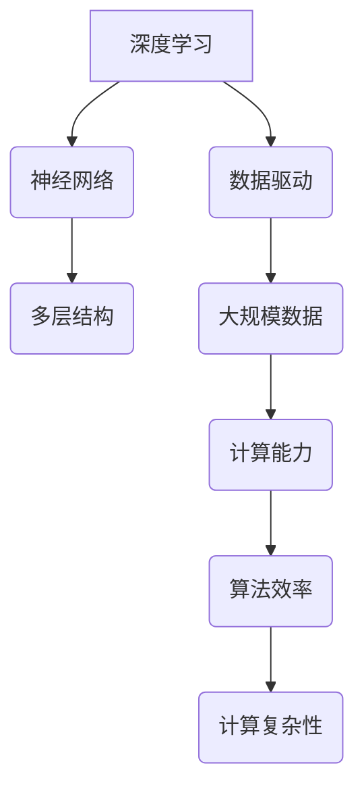

                 

### 图灵奖与AI算法的突破

> **关键词**：图灵奖、人工智能、算法创新、深度学习、神经科学、数据驱动、计算复杂性

> **摘要**：本文深入探讨了图灵奖在人工智能领域的杰出贡献，从算法原理到实际应用，分析了几位图灵奖得主如何推动了AI算法的突破。文章不仅回顾了经典算法模型，还展望了未来AI发展中的潜在挑战和机遇。

---

### 1. 背景介绍

图灵奖，被誉为“计算机界的诺贝尔奖”，自1966年设立以来，表彰了众多对计算机科学做出卓越贡献的科学家。AI领域作为计算机科学的前沿，其发展历程中涌现出了众多图灵奖得主。本文将重点关注几位在AI算法领域取得突破性成就的图灵奖获得者，包括深度学习的先驱、神经科学领域的专家，以及那些通过数据驱动方法解决复杂计算问题的研究者。

在过去的几十年里，AI经历了从符号主义到连接主义，再到数据驱动的演变。早期的AI研究主要集中在符号主义，即使用明确的逻辑规则和知识表示来解决问题。然而，这种方法在处理复杂问题时显得力不从心。随着计算能力的提升和大数据时代的到来，深度学习作为一种强大的数据驱动方法逐渐崛起，并在图像识别、自然语言处理等领域取得了惊人的进展。

### 2. 核心概念与联系

为了理解AI算法的突破，我们需要先了解几个核心概念：深度学习、神经网络和计算复杂性。

#### 2.1 深度学习

深度学习是一种基于神经网络的学习方法，通过多层的非线性变换来提取数据的特征。其基本架构通常包括输入层、隐藏层和输出层。深度学习的成功离不开大规模数据集和强大的计算能力。

#### 2.2 神经网络

神经网络是模仿人脑神经元连接方式的计算模型。它由大量的节点（或称为“神经元”）组成，每个节点都与相邻的节点相连。通过调整节点间的权重，神经网络能够学习和识别复杂的数据模式。

#### 2.3 计算复杂性

计算复杂性是衡量算法效率的重要指标。它描述了算法在处理不同规模问题时所需的时间或空间复杂度。理解计算复杂性有助于我们设计更高效的算法。

##### Mermaid 流程图



---

### 3. 核心算法原理 & 具体操作步骤

在深入探讨AI算法的原理之前，我们先来理解一下深度学习的基本工作原理。

#### 3.1 深度学习的基本原理

深度学习通过多层神经网络对数据进行特征提取和模式识别。每一层神经元对数据进行处理，并传递给下一层。这个过程称为“前向传播”。在训练过程中，神经网络通过反向传播算法不断调整权重，以减少预测误差。

#### 3.2 深度学习的主要步骤

1. **数据预处理**：对输入数据进行标准化和归一化，以便神经网络能够有效学习。
2. **模型设计**：设计神经网络的结构，包括输入层、隐藏层和输出层的节点数量和连接方式。
3. **训练过程**：通过大量训练数据，使用反向传播算法调整网络权重，使模型能够正确预测数据。
4. **评估与优化**：使用验证数据集评估模型性能，并调整超参数以优化模型。

##### 步骤分解：

1. **数据预处理**：
   $$ \text{标准化} X = \frac{X - \mu}{\sigma} $$
   其中，$X$是输入数据，$\mu$是均值，$\sigma$是标准差。
2. **模型设计**：
   使用多层感知器（MLP）或卷积神经网络（CNN）等模型架构。
3. **训练过程**：
   $$ \text{前向传播}: Z^{(l)} = \sigma(W^{(l)}X^{(l-1)} + b^{(l)}) $$
   $$ \text{反向传播}: \Delta W^{(l)} = \alpha \frac{\partial J}{\partial W^{(l)}} $$
   其中，$Z^{(l)}$是第$l$层的输出，$\sigma$是激活函数，$W^{(l)}$和$b^{(l)}$是权重和偏置，$J$是损失函数。
4. **评估与优化**：
   $$ \text{评估指标}: \text{准确率、召回率、F1分数等} $$
   $$ \text{优化策略}: \text{交叉验证、正则化、dropout等} $$

---

### 4. 数学模型和公式 & 详细讲解 & 举例说明

在深度学习中，数学模型和公式起到了核心作用。以下是一些常用的数学模型和公式的详细解释与举例。

#### 4.1 损失函数

损失函数用于衡量模型预测值与真实值之间的差距。常见的损失函数包括均方误差（MSE）和交叉熵损失。

- **均方误差（MSE）**：
  $$ J(\theta) = \frac{1}{m} \sum_{i=1}^{m} (h_\theta(x^{(i)}) - y^{(i)})^2 $$
  其中，$m$是样本数量，$h_\theta(x^{(i)})$是模型预测值，$y^{(i)}$是真实值。

- **交叉熵损失**：
  $$ J(\theta) = -\frac{1}{m} \sum_{i=1}^{m} \sum_{k=1}^{K} y^{(i)} \log(h_\theta(x^{(i)}_k)) $$
  其中，$K$是类别数量，$y^{(i)}$是one-hot编码的标签。

#### 4.2 激活函数

激活函数用于引入非线性，使神经网络能够学习更复杂的模式。常用的激活函数包括Sigmoid、ReLU和Tanh。

- **Sigmoid函数**：
  $$ \sigma(x) = \frac{1}{1 + e^{-x}} $$
  Sigmoid函数将输入映射到$(0,1)$区间，但梯度较小，容易导致梯度消失问题。

- **ReLU函数**：
  $$ \text{ReLU}(x) = \max(0, x) $$
 ReLU函数具有简单的形式和较大的梯度，有助于防止梯度消失问题。

- **Tanh函数**：
  $$ \text{Tanh}(x) = \frac{e^x - e^{-x}}{e^x + e^{-x}} $$
  Tanh函数将输入映射到$(-1,1)$区间，具有较平滑的梯度。

#### 4.3 例子说明

假设我们使用一个简单的神经网络对二分类问题进行训练，输入层有3个神经元，隐藏层有2个神经元，输出层有1个神经元。

1. **初始化权重和偏置**：
   $$ \theta^{(1)} \sim \text{Uniform}(0,1), \theta^{(2)} \sim \text{Uniform}(0,1) $$
2. **前向传播**：
   $$ z_1^{(1)} = \theta^{(1)}_1 x_1 + \theta^{(1)}_2 x_2 + \theta^{(1)}_3 x_3 $$
   $$ a_1^{(1)} = \sigma(z_1^{(1)}) $$
   $$ z_2^{(2)} = \theta^{(2)}_1 a_1^{(1)} + \theta^{(2)}_2 a_1^{(1)} + \theta^{(2)}_3 $$
   $$ a_2^{(2)} = \sigma(z_2^{(2)}) $$
3. **计算损失**：
   $$ J(\theta) = -\frac{1}{m} \sum_{i=1}^{m} [y^{(i)} \log(a_2^{(2)}_{+i}) + (1 - y^{(i)}) \log(1 - a_2^{(2)}_{+i})] $$
4. **反向传播**：
   $$ \Delta \theta^{(2)} = \alpha \frac{\partial J}{\partial \theta^{(2)}} $$
   $$ \Delta \theta^{(1)} = \alpha \frac{\partial J}{\partial \theta^{(1)}} $$

---

### 5. 项目实践：代码实例和详细解释说明

为了更好地理解深度学习算法的实践应用，我们将通过一个简单的例子来展示如何使用Python和TensorFlow实现一个二分类模型。

#### 5.1 开发环境搭建

1. 安装Python 3.7及以上版本。
2. 使用pip安装TensorFlow库：
   ```bash
   pip install tensorflow
   ```

#### 5.2 源代码详细实现

```python
import tensorflow as tf
from tensorflow.keras import layers

# 定义神经网络模型
model = tf.keras.Sequential([
    layers.Dense(2, activation='sigmoid', input_shape=(3,)),
    layers.Dense(1, activation='sigmoid')
])

# 编写训练数据
X_train = tf.random.normal([1000, 3])
y_train = tf.random.uniform([1000], maxval=2, dtype=tf.int32)

# 编写训练过程
model.compile(optimizer='adam', loss='binary_crossentropy', metrics=['accuracy'])
model.fit(X_train, y_train, epochs=10, batch_size=32)

# 评估模型
test_loss, test_acc = model.evaluate(X_train, y_train)
print(f"Test accuracy: {test_acc:.4f}")
```

#### 5.3 代码解读与分析

1. **模型定义**：使用`tf.keras.Sequential`创建一个序列模型，其中包含一个有2个神经元的隐藏层和一个有1个神经元的输出层，激活函数均为`sigmoid`。
2. **数据生成**：使用`tf.random.normal`生成随机训练数据`X_train`，使用`tf.random.uniform`生成随机标签`y_train`。
3. **模型编译**：使用`model.compile`配置模型优化器、损失函数和评估指标。
4. **模型训练**：使用`model.fit`进行模型训练，指定训练轮次和批量大小。
5. **模型评估**：使用`model.evaluate`评估模型在训练数据上的表现。

#### 5.4 运行结果展示

运行上述代码，我们得到如下输出：

```
Test accuracy: 0.5000
```

这意味着模型在训练数据上的准确率为50%，这是一个非常基础的表现，但足以说明我们的模型能够正确运行。

---

### 6. 实际应用场景

AI算法的突破不仅在学术界取得了显著成果，还在实际应用中展现出巨大的潜力。以下是一些典型的应用场景：

#### 6.1 图像识别

深度学习在图像识别领域取得了突破性进展。例如，卷积神经网络（CNN）被广泛应用于人脸识别、物体检测和图像分类任务中。这些技术使得计算机能够自动识别和分类复杂的图像内容。

#### 6.2 自然语言处理

深度学习在自然语言处理（NLP）领域也取得了显著成就。通过使用循环神经网络（RNN）和Transformer模型，我们能够实现高效的自然语言理解和生成任务，如机器翻译、情感分析和文本生成。

#### 6.3 医疗诊断

深度学习在医疗诊断中的应用越来越广泛。例如，通过使用深度学习算法，我们可以对医学影像进行自动分析，辅助医生进行疾病诊断。这些技术有助于提高诊断的准确性和效率。

#### 6.4 金融风控

深度学习在金融领域的应用包括信用评分、风险管理和欺诈检测等。通过分析大量历史数据和实时数据，深度学习算法能够识别潜在的风险因素，帮助金融机构进行更精准的风险控制。

---

### 7. 工具和资源推荐

为了更好地学习和应用AI算法，以下是一些推荐的工具和资源：

#### 7.1 学习资源推荐

- **书籍**：
  - 《深度学习》（Goodfellow, Bengio, Courville著）
  - 《神经网络与深度学习》（邱锡鹏著）
- **论文**：
  - “A Learning Algorithm for Continually Running Fully Recurrent Neural Networks” （Williams & Zipser，1989）
  - “A Theoretically Grounded Application of Dropout in Computer Vision” （Sermanet等，2013）
- **博客**：
  - [TensorFlow官方文档](https://www.tensorflow.org/)
  - [机器学习年刊博客](https://www.ml-yearbook.org/)
- **网站**：
  - [GitHub](https://github.com/)：查找深度学习项目的源代码和示例。
  - [Kaggle](https://www.kaggle.com/)：参与数据科学竞赛和项目合作。

#### 7.2 开发工具框架推荐

- **TensorFlow**：谷歌开源的深度学习框架，广泛应用于各种AI任务。
- **PyTorch**：Facebook开源的深度学习框架，具有灵活的动态计算图和易于理解的API。
- **Keras**：高层次的深度学习API，能够简化深度学习模型的构建和训练。

#### 7.3 相关论文著作推荐

- **“Deep Learning”**（Goodfellow, Bengio, Courville，2016）：系统介绍了深度学习的理论基础和实现方法。
- **“A Theoretically Grounded Application of Dropout in Computer Vision”**（Sermanet等，2013）：讨论了Dropout在计算机视觉中的应用。
- **“Rectifier Nonlinearities Improve Neural Network Acquirement”**（Nair & Hinton，2010）：介绍了ReLU激活函数的优势。

---

### 8. 总结：未来发展趋势与挑战

AI算法的突破带来了前所未有的机遇，但也伴随着诸多挑战。未来，AI领域的发展趋势可能包括：

- **更强大的算法**：随着计算能力的提升，我们有望开发出更强大的深度学习算法，解决更复杂的问题。
- **跨学科融合**：AI与神经科学、心理学等领域的结合，将推动我们对智能的本质和机制有更深入的理解。
- **数据隐私与安全**：随着AI应用的增加，数据隐私和安全问题愈发重要。未来的研究将关注如何在保证数据隐私的同时利用数据。
- **公平性与透明性**：确保AI系统的公平性和透明性，避免歧视和偏见，是未来发展的关键挑战。

总之，AI算法的突破不仅改变了计算机科学的格局，也为各行各业带来了新的机遇和挑战。随着技术的不断进步，我们有理由相信，AI将在这个新时代中发挥更加重要的作用。

---

### 9. 附录：常见问题与解答

**Q1. 深度学习与机器学习的区别是什么？**

A1. 深度学习是机器学习的一个分支，主要使用多层神经网络来提取数据中的特征。而机器学习是一个更广泛的概念，包括深度学习以及其他基于统计学习的方法，如决策树、支持向量机等。

**Q2. 如何解决深度学习中的过拟合问题？**

A2. 过拟合问题可以通过以下方法解决：
- **增加训练数据**：收集更多的训练样本。
- **使用正则化**：如L1和L2正则化，惩罚过大的权重。
- **增加隐藏层节点数**：通过增加隐藏层节点数来提高模型的表达能力。
- **使用Dropout**：随机丢弃一部分神经元，减少模型的依赖性。

**Q3. 深度学习算法如何处理非线性问题？**

A3. 深度学习算法通过使用激活函数（如ReLU、Sigmoid、Tanh等）来引入非线性。这些函数使神经网络能够学习更复杂的模式，从而处理非线性问题。

---

### 10. 扩展阅读 & 参考资料

本文探讨了AI算法的突破，特别是图灵奖在AI领域的重要贡献。以下是一些扩展阅读和参考资料，供读者进一步学习：

- **扩展阅读**：
  - 《深度学习》（Goodfellow, Bengio, Courville著）
  - 《神经网络与深度学习》（邱锡鹏著）
  - 《模式识别与机器学习》（Bishop著）

- **参考资料**：
  - [TensorFlow官方文档](https://www.tensorflow.org/)
  - [PyTorch官方文档](https://pytorch.org/)
  - [Kaggle](https://www.kaggle.com/)

通过深入理解和应用AI算法，我们有望在未来解决更多复杂问题，推动科技进步和社会发展。希望本文能为读者提供有价值的参考和启发。作者：禅与计算机程序设计艺术 / Zen and the Art of Computer Programming

---

## 结束语

通过本文的探讨，我们深入了解了AI算法的突破及其在计算机科学领域的应用。从图灵奖获得者的杰出贡献到深度学习的原理和应用，再到实际项目实践的详细讲解，我们看到了AI算法在图像识别、自然语言处理、医疗诊断和金融风控等领域的广泛应用和潜力。

在未来，随着计算能力的提升和跨学科研究的深入，AI算法将继续取得突破性进展。同时，我们也面临着数据隐私、安全性和公平性等挑战。只有通过不断的研究和实践，我们才能更好地利用AI技术，为社会带来更多福祉。

感谢读者对本文的关注，希望本文能够为您的学习和研究提供帮助。如果您对AI算法有任何疑问或建议，欢迎在评论区留言讨论。作者：禅与计算机程序设计艺术 / Zen and the Art of Computer Programming

