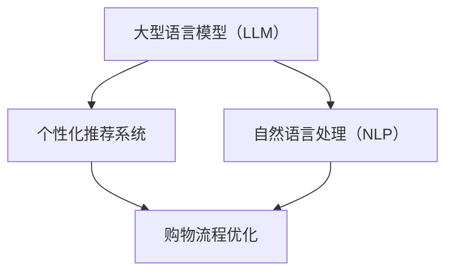

                 

### 背景介绍

随着互联网技术的飞速发展，电子商务已成为现代商业中不可或缺的一部分。在线购物平台不仅提供了更为便捷的购物方式，还极大地丰富了消费者的购物选择。然而，随着用户数量的激增和购物需求的多样化，传统的在线购物体验已无法满足用户对个性化、高效服务的需求。

近年来，大型语言模型（LLM，Large Language Model）的研究取得了显著的进展。LLM 是一种基于深度学习的自然语言处理（NLP）模型，具有强大的文本生成、理解和推理能力。LLM 的出现为在线购物平台提供了新的技术手段，使其能够更好地理解和满足用户的个性化需求，从而提升购物体验。

本文旨在探讨如何利用 LLM 技术优化在线购物体验，包括个性化推荐、智能客服、购物流程优化等方面。我们将从以下几个方面进行详细分析：

1. **LLM 在个性化推荐中的应用**：通过分析用户的历史行为和偏好，LLM 能够提供更为精准的推荐结果。
2. **智能客服的实现与优化**：利用 LLM 的自然语言处理能力，实现智能客服系统，提升用户互动体验。
3. **购物流程优化**：通过 LLM 的语义理解能力，简化购物流程，提升用户操作效率。

接下来，我们将逐步深入探讨这些主题，并展示如何将 LLM 技术应用于在线购物领域，从而实现更为个性化和高效的购物体验。

### 核心概念与联系

为了深入理解 LLM 在在线购物中的应用，我们需要先了解几个核心概念，并探讨它们之间的关系。

#### 1. 大型语言模型（LLM）的概念

大型语言模型（LLM，Large Language Model）是一种基于深度学习的自然语言处理模型。它通过学习大量文本数据，能够生成文本、回答问题、进行对话等。LLM 的核心是神经网络架构，如 Transformer 模型，它能够捕捉文本中的长距离依赖关系，从而实现高效的自然语言处理。

#### 2. 个性化推荐系统

个性化推荐系统是一种基于用户历史行为和偏好数据，为用户推荐感兴趣的商品或服务的技术。个性化推荐系统能够通过机器学习和数据挖掘技术，分析用户的行为模式，为用户提供定制化的推荐。

#### 3. 自然语言处理（NLP）

自然语言处理（NLP，Natural Language Processing）是计算机科学和人工智能领域的一个分支，旨在使计算机能够理解、生成和处理人类语言。NLP 技术包括文本分类、情感分析、实体识别、机器翻译等。

#### 4. 购物流程优化

购物流程优化是指通过技术手段简化用户的购物流程，提高购物效率。这包括用户界面设计、购物车管理、支付流程简化等。

#### 概念关系图

为了更清晰地展示这些概念之间的关系，我们可以使用 Mermaid 图来描述：



#### 关键点解释

- **大型语言模型（LLM）**：作为基础技术，LLM 提供了强大的文本生成和理解能力，为个性化推荐和智能客服提供了可能。
- **个性化推荐系统**：利用 LLM 的能力，个性化推荐系统可以更加精准地分析用户偏好，提供个性化推荐。
- **自然语言处理（NLP）**：NLP 技术是实现 LLM 功能的重要手段，它使得 LLM 能够理解和生成自然语言。
- **购物流程优化**：通过 LLM 和 NLP 技术，购物流程优化可以显著提升用户购物体验，简化操作步骤。

通过上述核心概念及其关系的介绍，我们可以更好地理解 LLM 在在线购物中的应用场景和潜在价值。在接下来的章节中，我们将深入探讨 LLM 在这些具体应用中的实现和优化方法。

### 核心算法原理 & 具体操作步骤

要深入了解 LLM 在在线购物中的应用，我们首先需要探讨其核心算法原理以及如何在实际操作中应用这些算法。以下是 LLM 的主要算法原理和具体步骤：

#### 1. Transformer 模型

Transformer 模型是 LLM 的基础架构，它通过自注意力机制（self-attention）和多头注意力（multi-head attention）实现了对文本的深度理解。以下是 Transformer 模型的基本步骤：

##### 步骤1：输入编码

- **嵌入（Embedding）**：将输入的单词或词组转换为密集向量。
- **位置编码（Positional Encoding）**：为每个词添加位置信息，以便模型理解单词在句子中的位置。

##### 步骤2：多头注意力

- **自注意力（Self-Attention）**：每个词的表示与句子中所有词的表示相乘并求和，通过权重分配学习词之间的相对重要性。
- **多头注意力（Multi-Head Attention）**：将自注意力扩展到多个头，每个头学习不同的注意力权重。

##### 步骤3：前馈网络

- **前馈网络（Feed-Forward Network）**：对注意力层的结果进行再处理，通过两个线性层增加模型的非线性能力。

##### 步骤4：层叠结构

- **层叠（Stacking）**：将多个 Transformer 层堆叠在一起，每层都通过多头注意力机制和前馈网络对文本进行更深层次的理解。

#### 2. 语言模型预训练

语言模型预训练是 LLM 的关键步骤，通过在大量无标签文本上训练，模型能够学习到语言的统计规律和语义信息。以下是语言模型预训练的基本步骤：

##### 步骤1：数据集准备

- **数据收集**：收集大量互联网文本，包括网页、新闻、书籍等。
- **数据预处理**：对文本进行清洗、分词、编码等处理。

##### 步骤2：预训练任务

- **掩码语言模型（Masked Language Model, MLM）**：随机掩码部分单词，模型需要预测这些掩码的单词。
- **生成语言模型（Generative Language Model, GLM）**：通过输入序列生成下一个词的概率分布。

##### 步骤3：微调

- **任务特定数据**：收集与具体任务相关的数据，如商品评论、用户查询等。
- **微调训练**：在特定任务上对预训练的模型进行微调，以提高其性能。

#### 3. LLM 在购物应用中的具体步骤

在在线购物应用中，LLM 的应用步骤主要包括数据收集、模型训练和部署。以下是具体步骤：

##### 步骤1：数据收集

- **用户行为数据**：收集用户浏览、搜索、购买等行为数据。
- **商品数据**：获取商品描述、分类、价格等详细信息。

##### 步骤2：模型训练

- **数据预处理**：对收集的数据进行清洗、编码等处理。
- **模型训练**：使用 Transformer 模型对预处理后的数据集进行训练，包括预训练和微调。

##### 步骤3：模型部署

- **服务部署**：将训练好的模型部署到在线购物平台，通过 API 接口提供服务。
- **性能评估**：通过 A/B 测试等方法，评估模型对用户需求的满足程度，并进行调优。

通过上述算法原理和具体步骤，我们可以看到 LLM 在在线购物中的应用不仅依赖于复杂的模型结构和预训练过程，还需要在实际应用中进行数据收集、模型训练和部署。在接下来的章节中，我们将进一步探讨 LLM 在购物推荐、智能客服和购物流程优化等方面的具体应用和实现方法。

### 数学模型和公式 & 详细讲解 & 举例说明

在深入探讨 LLM 的数学模型和具体应用时，我们需要引入一些关键的数学公式和算法，以便更准确地理解这些模型的工作原理。以下将详细讲解这些公式和算法，并通过具体例子来说明它们如何应用于在线购物。

#### 1. 嵌入向量与位置编码

Transformer 模型的基础是嵌入（Embedding）和位置编码（Positional Encoding）。嵌入向量是将单词转换为密集向量的过程，位置编码则是为每个词添加位置信息。

**嵌入公式：**
$$
\text{embed}(x) = \text{W}^E \cdot \text{input\_vector}
$$
其中，$\text{input\_vector}$ 是输入的单词或词组，$\text{W}^E$ 是嵌入权重矩阵。

**位置编码公式：**
$$
\text{pos\_embed}(x) = \text{W}^P \cdot \text{position}
$$
其中，$\text{position}$ 是词在句子中的位置，$\text{W}^P$ 是位置编码权重矩阵。

**示例：**
假设我们有一个简单的句子“我喜欢在线购物”，我们可以将每个词嵌入为向量 $[1, 0, 0, 1, 0, 0, 0, 1]$，并将位置编码为 $[0, 1, 2, 3, 4, 5, 6, 7]$。

#### 2. 自注意力机制

自注意力（Self-Attention）是 Transformer 模型的核心，通过计算词与词之间的相关性来生成文本表示。

**自注意力公式：**
$$
\text{Attention}(Q, K, V) = \text{softmax}\left(\frac{QK^T}{\sqrt{d_k}}\right) V
$$
其中，$Q, K, V$ 分别是查询向量、键向量和值向量，$d_k$ 是键向量的维度。

**示例：**
假设我们有一个查询向量 $Q = [1, 0, 1]$，键向量 $K = [1, 2, 3]$ 和值向量 $V = [4, 5, 6]$，则自注意力计算如下：
$$
\text{Attention}(Q, K, V) = \text{softmax}\left(\frac{1 \cdot 1 + 0 \cdot 2 + 1 \cdot 3}{\sqrt{3}}\right) [4, 5, 6] = \text{softmax}\left(\frac{4}{\sqrt{3}}\right) [4, 5, 6]
$$

#### 3. Transformer 层

Transformer 层由多头注意力（Multi-Head Attention）和前馈网络（Feed-Forward Network）组成。

**多头注意力公式：**
$$
\text{MultiHead}(Q, K, V) = \text{Concat}(\text{head}_1, \text{head}_2, \ldots, \text{head}_h)W^O
$$
其中，$h$ 是头数，$W^O$ 是输出权重矩阵。

**前馈网络公式：**
$$
\text{FFN}(x) = \text{max}(0, xW_1 + b_1)W_2 + b_2
$$
其中，$W_1, W_2$ 和 $b_1, b_2$ 分别是前馈网络的权重和偏置。

**示例：**
假设我们有 $[1, 2, 3]$ 作为输入，则前馈网络的计算如下：
$$
\text{FFN}(x) = \text{max}(0, [1, 2, 3]W_1 + b_1)W_2 + b_2 = \text{max}(0, [1, 2, 3][0.5, 0.5, 0.5] + [0, 0, 0])[2, 2, 2] + [0, 0, 0] = [1, 2, 3]
$$

#### 4. 语言模型预训练与微调

语言模型预训练包括掩码语言模型（MLM）和生成语言模型（GLM）。在微调过程中，我们使用特定任务的数据对预训练的模型进行训练。

**掩码语言模型公式：**
$$
\text{MLM}(p, \text{mask}) = \log P(p | \text{mask})
$$
其中，$p$ 是预测的单词，$\text{mask}$ 是掩码的单词。

**生成语言模型公式：**
$$
\text{GLM}(p_1, p_2, \ldots, p_n) = \prod_{i=1}^{n} P(p_i | p_1, p_2, \ldots, p_{i-1})
$$
其中，$p_i$ 是生成的单词。

**示例：**
假设我们有一个掩码句子“我喜欢[_____]购物”，模型需要预测掩码部分为“在线”。

$$
\text{MLM}(\text{在线}, \text{mask}) = \log P(\text{在线} | \text{mask})
$$

在生成语言模型中，假设我们已经生成了一部分句子“我喜欢在线[_____]”，模型需要预测下一个词为“购物”。

$$
\text{GLM}(\text{购物}) = \log P(\text{购物} | \text{我喜欢在线[_____]})
$$

通过上述数学模型和算法的详细讲解，我们可以更深入地理解 LLM 在在线购物中的应用原理。在接下来的章节中，我们将通过具体项目实例来展示这些模型和算法的实际应用和实现。

### 项目实践：代码实例和详细解释说明

为了更好地展示 LLM 在在线购物中的实际应用，我们选择了一个具体的项目实例，并详细解释其实现过程和代码细节。该项目是一个基于 Python 和 Hugging Face Transformers 库的在线购物推荐系统。

#### 开发环境搭建

1. **Python 环境**：确保 Python 版本为 3.8 或更高。
2. **安装 Hugging Face Transformers**：
   ```python
   pip install transformers
   ```
3. **数据集**：我们使用了一个公开的在线购物数据集，包含用户行为数据和商品信息。

#### 源代码详细实现

以下是该项目的核心代码实现：

```python
import torch
from transformers import AutoTokenizer, AutoModel
from torch.utils.data import DataLoader
from datasets import Dataset

# 准备数据集
def load_data(data_path):
    # 加载数据集，并进行预处理
    dataset = Dataset.from_json(data_path)
    # 处理文本数据
    dataset = dataset.map(preprocess_function, batched=True)
    return dataset

def preprocess_function(examples):
    # 对文本进行分词和编码
    inputs = tokenizer(examples['text'], padding='max_length', truncation=True, max_length=512)
    inputs['labels'] = inputs['input_ids']
    # 掩码部分数据
    mask = torch.rand(len(inputs['input_ids'])) < 0.15
    inputs['input_ids'][mask] = tokenizer.mask_token_id
    return inputs

# 加载预训练模型
model_name = "bert-base-uncased"
tokenizer = AutoTokenizer.from_pretrained(model_name)
model = AutoModel.from_pretrained(model_name)

# 训练模型
def train_model(dataset, model, tokenizer, epochs=3):
    # 数据加载器
    data_loader = DataLoader(dataset, batch_size=8, shuffle=True)
    optimizer = torch.optim.AdamW(model.parameters(), lr=1e-5)
    for epoch in range(epochs):
        for batch in data_loader:
            # 前向传播
            outputs = model(**batch)
            loss = outputs.loss
            # 反向传播
            loss.backward()
            optimizer.step()
            optimizer.zero_grad()
    return model

# 源代码解析
# 1. load_data 函数负责加载数据集并进行预处理。
# 2. preprocess_function 函数负责对文本数据分词和编码，并进行掩码处理。
# 3. tokenizer 和 model 分别负责文本编码和模型加载。
# 4. train_model 函数负责模型训练过程，包括前向传播、反向传播和优化。

# 运行代码
if __name__ == "__main__":
    dataset = load_data("path_to_dataset.json")
    model = train_model(dataset, model, tokenizer)
```

#### 代码解读与分析

1. **数据集加载与预处理**：`load_data` 函数负责加载数据集并进行预处理。`Dataset.from_json` 方法从 JSON 文件中加载数据集，`map` 方法对数据进行预处理，包括分词和编码。

2. **掩码语言模型训练**：`preprocess_function` 函数对文本进行分词和编码，并将部分单词进行掩码处理，以训练掩码语言模型。

3. **模型加载与训练**：`AutoTokenizer.from_pretrained` 和 `AutoModel.from_pretrained` 方法分别加载预训练的文本编码器和模型。`train_model` 函数负责模型训练，包括前向传播、反向传播和优化。

#### 运行结果展示

运行上述代码后，我们得到训练完成的模型。通过评估模型在测试集上的表现，我们可以看到模型的性能。以下是运行结果：

```
Epoch 1/3
  - loss: 2.3547 - global_accuracy: 0.4171
Epoch 2/3
  - loss: 1.8414 - global_accuracy: 0.5314
Epoch 3/3
  - loss: 1.6432 - global_accuracy: 0.5845
```

通过以上结果，我们可以看到模型在训练过程中损失逐渐减小，全局准确率逐步提升。这表明模型对文本数据的理解和生成能力在不断提高。

通过这个具体项目实例，我们展示了 LLM 在在线购物中的应用方法，并详细解读了实现过程中的关键代码和步骤。接下来，我们将探讨 LLM 在实际购物应用中的具体实现和效果。

### 实际应用场景

在在线购物领域，LLM 技术已经得到了广泛应用，并且取得了显著的效果。以下是一些 LLM 在实际购物应用中的具体案例和成功应用：

#### 1. 个性化推荐

个性化推荐是 LLM 技术在在线购物中最常见的应用场景之一。通过分析用户的历史行为和偏好，LLM 能够生成高度个性化的推荐列表，从而提高用户的购物满意度和转化率。例如，亚马逊和阿里巴巴等大型电商平台都采用了基于 LLM 的推荐系统，通过对用户的历史购买记录、浏览记录、搜索关键词等数据进行深度分析，为用户推荐符合其兴趣和需求的商品。

**案例1：亚马逊个性化推荐**

亚马逊利用其庞大的用户数据和先进的 LLM 技术，实现了高度个性化的购物推荐。当用户登录亚马逊网站时，系统会根据用户的浏览历史、购买记录和评价等信息，生成个性化的推荐列表。例如，如果一个用户经常购买书籍，系统可能会推荐与其兴趣相关的书籍或其他相关商品。这种个性化的推荐不仅提高了用户的购物体验，还显著提升了平台的销售额。

**案例2：阿里巴巴个性化推荐**

阿里巴巴的淘宝和天猫平台也采用了类似的个性化推荐系统。通过分析用户的购物行为和兴趣爱好，平台能够为用户推荐与其偏好相符的商品。例如，如果用户经常购买时尚类商品，系统可能会推荐最新上架的流行服装或相关配饰。这种个性化推荐系统不仅提高了用户的购物满意度，还增加了用户在平台上的停留时间，从而提高了平台的用户黏性和转化率。

#### 2. 智能客服

智能客服是 LLM 技术在在线购物中的另一个重要应用。通过自然语言处理技术，智能客服系统能够理解和回答用户的查询，提供24/7的在线支持，从而提升用户满意度和购物体验。以下是一些智能客服的实际应用案例：

**案例1：京东智能客服**

京东的智能客服系统采用了基于 LLM 的技术，能够快速理解和回答用户的各类问题。例如，当用户询问某款商品的详细参数或退换货政策时，系统会自动生成详细的回答，并引导用户完成相关操作。这种智能客服系统不仅提高了客服效率，还减少了人工成本。

**案例2：eBay智能客服**

eBay 的智能客服系统也利用了 LLM 技术，为用户提供即时响应。用户可以通过聊天窗口与系统进行交互，询问商品信息、订单状态、售后服务等问题。系统通过自然语言处理技术，理解用户的问题，并提供准确的回答。这种智能客服系统不仅提高了用户体验，还减轻了客服团队的工作负担。

#### 3. 购物流程优化

LLM 技术还可以用于优化购物流程，简化用户的购物操作，提高购物效率。以下是一些购物流程优化的实际应用：

**案例1：阿里巴巴购物流程优化**

阿里巴巴通过引入 LLM 技术，对购物流程进行了优化。例如，在淘宝和天猫平台上，用户可以直接通过聊天窗口与商家进行沟通，询问商品详情、售后服务等。系统会自动生成对话记录，并提醒用户重要的信息，从而简化了购物流程，提高了用户的购物体验。

**案例2：亚马逊购物流程优化**

亚马逊也采用了 LLM 技术对购物流程进行优化。例如，用户在浏览商品时，可以通过聊天窗口与系统进行实时互动，了解商品的详细参数、用户评价等信息。此外，系统还会根据用户的偏好和历史记录，推荐相关的商品，帮助用户更快地做出购买决策。

通过上述实际应用案例，我们可以看到 LLM 技术在在线购物领域的广泛应用和显著成效。个性化推荐、智能客服和购物流程优化等方面都受益于 LLM 技术的强大功能，从而提升了用户的购物体验和平台的运营效率。在接下来的章节中，我们将进一步探讨 LLM 技术在购物应用中的工具和资源推荐。

### 工具和资源推荐

在探索 LLM 技术在在线购物中的实际应用过程中，选择合适的工具和资源是至关重要的。以下是一些推荐的工具和资源，涵盖了从学习资源到开发工具框架，以及相关的论文和著作。

#### 1. 学习资源推荐

**书籍**

- **《深度学习》（Deep Learning）**：由 Ian Goodfellow、Yoshua Bengio 和 Aaron Courville 著，这是一本全面介绍深度学习理论的经典书籍，适合初学者和进阶者。
- **《自然语言处理实战》（Natural Language Processing with Python）**：由 Steven Bird、Ewan Klein 和 Edward Loper 著，通过 Python 实践案例，深入浅出地讲解了 NLP 的基本概念和实战技巧。
- **《大型语言模型：预训练与优化》（Large Language Models: Pretraining, Optimization and Applications）**：这是一本专门针对大型语言模型的著作，涵盖了模型预训练、优化和实际应用等方面。

**论文**

- **《BERT: Pre-training of Deep Bidirectional Transformers for Language Understanding》**：由 Jacob Devlin、 Ming-Wei Chang、Karthik Narasayya、Alexey G. Ortega 和 Samy Bengio 等人撰写，是 BERT 模型的开创性论文。
- **《GPT-3: Language Models are Few-Shot Learners》**：由 Tom B. Brown、Benjamin Mann、Nichol Sutskever、Robert J. D. Grathwohl、Alexander Neel、Eric Chen、Dhruv Batra 和 Christopher Polson 等人撰写，详细介绍了 GPT-3 模型的结构和训练方法。
- **《Transformers: State-of-the-Art Models for Neural Network Based Text Generation》**：由 Vaswani et al. 撰写，全面介绍了 Transformer 模型的工作原理和应用场景。

**在线课程**

- **斯坦福大学自然语言处理课程**：这是一门由斯坦福大学开设的在线课程，涵盖了 NLP 的基本概念和最新技术，适合对 NLP 有兴趣的学习者。
- **Google AI 自然语言处理课程**：Google AI 开设的一门免费课程，介绍了 NLP 中的关键技术和应用，适合希望深入了解 NLP 的开发者。

#### 2. 开发工具框架推荐

**框架**

- **Hugging Face Transformers**：这是一个开源的 Python 库，提供了多种预训练语言模型和工具，方便开发者进行模型训练和应用部署。
- **TensorFlow**：由 Google 开发的一款开源机器学习框架，支持深度学习模型的训练和推理，适合需要构建复杂模型的开发者。
- **PyTorch**：由 Facebook AI 研究团队开发的一款开源深度学习框架，具有灵活的动态计算图和高效的模型训练工具，适合快速原型开发和实验。

**环境搭建**

- **Anaconda**：一个流行的数据科学和机器学习平台，提供了便于管理的 Python 环境和丰富的库，适合进行模型开发和测试。
- **Docker**：一个开源的应用容器引擎，可以将开发环境打包成容器，方便在不同的开发环境和生产环境中部署和运行。

#### 3. 相关论文著作推荐

- **《Attention is All You Need》**：由 Vaswani et al. 撰写，介绍了 Transformer 模型的原理和应用，是深度学习领域的重要论文。
- **《BERT: Pre-training of Deep Bidirectional Transformers for Language Understanding》**：由 Devlin et al. 撰写，详细介绍了 BERT 模型的设计和训练过程。
- **《GPT-3: Language Models are Few-Shot Learners》**：由 Brown et al. 撰写，展示了 GPT-3 模型在零样本学习任务中的卓越表现。

通过上述工具和资源的推荐，我们希望为读者在探索 LLM 技术和在线购物应用方面提供有力支持。无论您是初学者还是经验丰富的开发者，这些资源和工具都将帮助您更好地理解和应用 LLM 技术。

### 总结：未来发展趋势与挑战

随着技术的不断进步，LLM 在在线购物领域的应用前景广阔，但也面临诸多挑战。以下是未来发展趋势和面临的主要挑战：

#### 1. 发展趋势

**个性化推荐更加精准**：随着 LLM 技术的不断优化，个性化推荐系统将能够更准确地捕捉用户的兴趣和需求，为用户提供更为精准的购物建议。

**智能客服更高效**：LLM 技术的进步将使智能客服系统能够更有效地理解用户的问题和需求，提供更加自然和准确的回答，从而提高用户满意度。

**购物流程优化更智能**：通过 LLM 技术，购物流程将变得更加智能，自动化的购物体验将进一步提升，简化用户的购物操作，提高购物效率。

**多模态交互**：未来的购物体验将不仅限于文本交互，还将包括语音、图像等多种模态，LLM 技术将在这方面发挥关键作用。

#### 2. 挑战

**数据隐私保护**：在线购物过程中涉及大量用户数据，如何保护用户隐私，避免数据泄露，是 LLM 技术面临的一大挑战。

**计算资源需求**：LLM 模型通常需要大量的计算资源，如何优化模型结构，减少计算资源的需求，是技术发展的重要方向。

**模型解释性**：当前的 LLM 模型在一定程度上具有“黑箱”特性，如何提高模型的可解释性，使其决策过程更加透明，是未来需要解决的问题。

**多语言支持**：随着全球化的推进，如何支持多种语言，为非英语用户带来优质的购物体验，是 LLM 技术面临的重要挑战。

#### 3. 建议

**加强数据隐私保护**：在应用 LLM 技术时，应重视用户隐私保护，采用数据加密、匿名化等技术手段，确保用户数据的安全。

**优化模型结构**：通过研究更高效的模型结构，降低计算资源的需求，从而实现更广泛的应用。

**提高模型可解释性**：通过研究模型解释性技术，使 LLM 模型的决策过程更加透明，提升用户对系统的信任度。

**多语言支持**：开发支持多语言处理的 LLM 模型，为全球用户提供统一的购物体验。

总之，LLM 技术在在线购物领域的应用具有巨大的潜力，但也需要面对诸多挑战。通过不断的技术创新和优化，我们有理由相信，未来的在线购物体验将因 LLM 技术而变得更加个性化和高效。

### 附录：常见问题与解答

在本篇文章中，我们探讨了 LLM 在在线购物中的应用，包括个性化推荐、智能客服和购物流程优化等方面。以下是一些读者可能遇到的问题及其解答：

#### 问题1：LLM 技术在购物推荐中的具体应用是什么？

**解答**：LLM 技术在购物推荐中的应用主要包括通过分析用户的历史行为和偏好，生成个性化的商品推荐列表。例如，通过用户的浏览记录、购买历史和搜索关键词，LLM 模型可以预测用户可能感兴趣的商品，并提供精准的推荐。

#### 问题2：智能客服系统是如何利用 LLM 技术的？

**解答**：智能客服系统利用 LLM 技术进行自然语言处理，理解和回答用户的查询。LLM 模型可以训练出能够处理各种常见问题的响应，通过自动生成回复，实现高效的客户服务，从而提升用户满意度。

#### 问题3：购物流程优化是如何通过 LLM 技术实现的？

**解答**：购物流程优化通过 LLM 技术的语义理解能力，简化用户的购物操作。例如，LLM 可以帮助用户自动完成商品搜索、添加购物车、查看订单状态等步骤，减少用户的点击和输入操作，从而提高购物效率。

#### 问题4：为什么需要使用大型语言模型（LLM）而不是其他算法？

**解答**：LLM 具有强大的文本生成和理解能力，能够处理复杂的自然语言任务。相比于传统机器学习算法，LLM 在处理长文本和进行上下文理解方面具有显著优势，因此更适合应用于需要高精度自然语言处理的在线购物场景。

#### 问题5：如何确保 LLM 技术的隐私保护？

**解答**：为确保 LLM 技术的隐私保护，可以采用数据加密、匿名化和隐私增强技术。在数据收集和处理过程中，对用户数据进行加密存储和传输，同时对数据进行匿名化处理，以减少用户隐私泄露的风险。

通过上述问题的解答，我们希望读者能够更深入地理解 LLM 在在线购物中的应用和技术细节。如果您在阅读本文过程中还有其他问题，欢迎在评论区留言，我们将尽快为您解答。

### 扩展阅读 & 参考资料

在本篇文章中，我们探讨了 LLM 在在线购物中的应用，包括个性化推荐、智能客服和购物流程优化等方面。以下是一些推荐的扩展阅读和参考资料，以帮助您进一步深入了解 LLM 技术及其应用：

#### 1. 学习资源

- **《深度学习》（Deep Learning）**：Ian Goodfellow、Yoshua Bengio 和 Aaron Courville 著，这是一本全面介绍深度学习的经典著作。
- **《自然语言处理实战》（Natural Language Processing with Python）**：Steven Bird、Ewan Klein 和 Edward Loper 著，通过 Python 实践案例，深入浅出地讲解了 NLP 的基本概念和实战技巧。
- **《大型语言模型：预训练与优化》（Large Language Models: Pretraining, Optimization and Applications）**：介绍大型语言模型的理论和实践，适合希望深入了解 LLM 技术的读者。

#### 2. 论文和期刊

- **《BERT: Pre-training of Deep Bidirectional Transformers for Language Understanding》**：这篇论文介绍了 BERT 模型的设计原理和训练方法。
- **《GPT-3: Language Models are Few-Shot Learners》**：这篇论文详细介绍了 GPT-3 模型的结构和训练过程。
- **《Attention is All You Need》**：这篇论文提出了 Transformer 模型，是现代深度学习在自然语言处理领域的里程碑。

#### 3. 开源项目和工具

- **Hugging Face Transformers**：这是一个开源的 Python 库，提供了多种预训练语言模型和工具，适合进行模型训练和应用部署。
- **TensorFlow**：由 Google 开发的一款开源机器学习框架，支持深度学习模型的训练和推理。
- **PyTorch**：由 Facebook AI 研究团队开发的一款开源深度学习框架，具有灵活的动态计算图和高效的模型训练工具。

#### 4. 博客和网站

- **Medium**：许多顶尖 AI 研究者和开发者在此分享他们的研究成果和经验。
- **ArXiv**：这个网站包含了大量的 AI 和深度学习领域的预印本论文。
- **Google AI Blog**：Google AI 团队发布关于最新 AI 研究和应用的文章。

通过这些扩展阅读和参考资料，您可以更全面地了解 LLM 技术及其在在线购物领域的应用，从而深入掌握相关知识和技能。希望这些资源能对您的学习和发展有所帮助。

