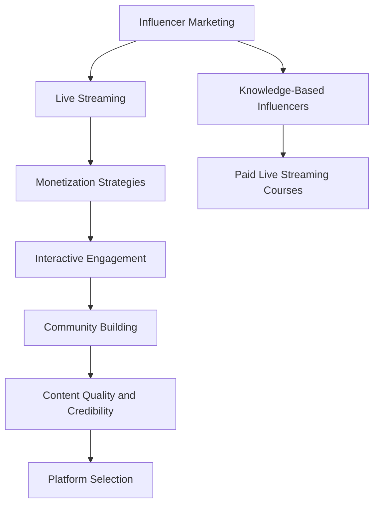

                 

### 1. 背景介绍 Background Introduction ###

In the rapidly evolving digital age, the concept of a "knowledge-based influencer" or "knowledge influencer" has emerged as a powerful trend in the realm of online content creation. These influencers, often referred to as "knowledge-based网红" (knowledge-based influencers), leverage their expertise in various fields to create valuable, educational content that resonates with their audience. The idea of offering paid live streaming courses as a monetization strategy for such influencers is not only gaining traction but is also reshaping the way knowledge is disseminated and consumed.

The rise of knowledge-based influencers can be attributed to several factors. First and foremost, the increasing accessibility of high-quality educational content has empowered individuals to learn from the comfort of their homes. Platforms like YouTube, TikTok, and LinkedIn have become popular venues for sharing knowledge, with content creators developing substantial followings based on their expertise and the quality of their content. These influencers are often seen as credible sources of information, which fosters a sense of trust and authority in their areas of specialization.

Secondly, the COVID-19 pandemic has accelerated the shift towards remote learning and online education. With traditional educational institutions either shutting down or adopting hybrid models, there has been a surge in demand for alternative educational resources. Knowledge-based influencers have capitalized on this opportunity by providing specialized, personalized content that addresses specific needs and interests of their audiences.

Offering paid live streaming courses allows knowledge-based influencers to monetize their expertise directly. By charging for access to their live streams, they can generate a sustainable revenue stream while providing a high-quality learning experience. This model also incentivizes influencers to consistently deliver valuable content, as their income is directly linked to their engagement and the perceived value of their courses.

Moreover, the interactive nature of live streaming provides a unique opportunity for influencers to engage with their audience in real-time. This not only enhances the learning experience but also fosters a sense of community and belonging among learners. Interactive elements such as live Q&A sessions, polls, and discussions can make the learning process more engaging and effective.

In conclusion, the concept of a knowledge-based influencer offering paid live streaming courses is a testament to the evolving landscape of online education. It represents a win-win situation, where influencers can monetize their expertise while providing valuable, engaging content to their audience. As this trend continues to grow, we can expect to see more influencers leveraging this model to share their knowledge and build successful online businesses.

### 2. 核心概念与联系 Core Concepts and Connections

To delve deeper into the concept of knowledge-based influencers and the offering of paid live streaming courses, it is essential to understand some core concepts that underpin this phenomenon.

#### 2.1 Influencer Marketing

Influencer marketing is a form of marketing that involves endorsements and partnerships with individuals who have a significant online presence and influence within a specific niche. These influencers, whether they are bloggers, vloggers, or social media personalities, have established trust and credibility with their audience. This trust is leveraged by brands and individuals to promote products, services, and ideas, often resulting in higher engagement and conversion rates compared to traditional marketing methods.

In the context of knowledge-based influencers, this marketing strategy involves leveraging the influencer's expertise and credibility to promote educational content and courses. The core principle remains the same: leveraging trust to influence behavior and decision-making.

#### 2.2 Live Streaming

Live streaming is the real-time broadcast of video content over the internet. This technology has revolutionized the way content is consumed, allowing viewers to watch events, presentations, and other forms of entertainment as they happen. Live streaming platforms like YouTube Live, Twitch, and LinkedIn Live have made it easier for content creators to reach a global audience and engage with their viewers in real-time.

For knowledge-based influencers, live streaming offers a unique platform to deliver educational content in an interactive and engaging manner. Unlike pre-recorded videos, live streams provide an opportunity for immediate feedback and interaction, creating a more dynamic and engaging learning experience.

#### 2.3 Monetization Strategies

Monetization strategies refer to the various methods through which content creators can generate revenue from their online presence. For knowledge-based influencers, offering paid live streaming courses is one such strategy. Other common monetization methods include:

- **Ad Revenue:** Earning money from advertisements displayed on their content.
- **Brand Partnerships:** Collaborating with brands to promote products or services.
- **Sponsored Content:** Creating content that is sponsored by a brand or individual.
- **Membership Models:** Offering exclusive content or benefits to paid subscribers.
- **eBooks and Courses:** Selling digital products such as e-books, courses, or tutorials.

#### 2.4 Interactive Engagement

Interactive engagement is a key aspect of live streaming for knowledge-based influencers. By incorporating interactive elements such as live Q&A sessions, polls, and discussions, influencers can create a more engaging and personalized learning experience. This interaction not only enhances the learning process but also helps build a stronger connection with the audience.

#### 2.5 Community Building

Building a community around a knowledge-based influencer's content is crucial for long-term success. This community provides a support network for learners, fostering a sense of belonging and shared interest. Influencers can leverage this community to gather feedback, create content that resonates with their audience, and build a loyal following.

#### 2.6 Content Quality and Credibility

The quality and credibility of the content are paramount for knowledge-based influencers. High-quality content that is accurate, informative, and engaging is more likely to attract and retain an audience. Influencers must continuously update their knowledge and skills to maintain their credibility and relevance in their niche.

#### 2.7 Platform Selection

Selecting the right platform is crucial for reaching the target audience and maximizing engagement. Influencers must consider factors such as platform demographics, user engagement metrics, and content monetization capabilities when choosing a platform for their live streaming courses.

### Mermaid Flowchart of Core Concepts



By understanding these core concepts and their interconnectedness, knowledge-based influencers can effectively leverage live streaming to monetize their expertise and provide valuable educational content to their audience. The next section will delve into the specific steps and algorithms required to create and deliver high-quality live streaming courses.

### 3. 核心算法原理 & 具体操作步骤 Core Algorithm Principles & Step-by-Step Operations

Creating and delivering high-quality live streaming courses involves several core algorithms and steps that ensure the content is engaging, informative, and accessible to the target audience. This section will break down these steps and algorithms into understandable segments, providing a comprehensive guide for knowledge-based influencers.

#### 3.1 Content Planning

The first step in creating a live streaming course is content planning. This involves identifying the topic, setting clear objectives, and outlining the structure of the course. Key aspects of content planning include:

- **Identifying the Topic:** Choose a topic that aligns with your expertise and is of interest to your target audience.
- **Setting Objectives:** Define the learning outcomes and what you want the audience to take away from the course.
- **Outlining the Structure:** Create an outline that includes the main topics, subtopics, and key points to be covered in each segment.

**Algorithm for Content Planning:**

1. **Research:** Conduct thorough research on the topic to ensure you have a deep understanding of the subject matter.
2. **Identify Gaps:** Identify any gaps in existing content that you can fill, which will help differentiate your course.
3. **Set Objectives:** Clearly define the objectives of the course and what you want the audience to achieve.
4. **Outline Content:** Create a detailed outline of the course structure, including each segment and key points.

#### 3.2 Script Writing

Once the content plan is in place, the next step is to write a script for the live streaming session. A well-crafted script ensures that the content is engaging, coherent, and easy to follow. Key elements of script writing include:

- **Introduction:** Start with an engaging hook to capture the audience's attention.
- **Content Delivery:** Organize the content logically, ensuring a smooth flow from one topic to the next.
- **Call to Action:** Include clear calls to action that guide the audience on what to do next or how to apply the knowledge.
- **Q&A Segment:** Allocate time for Q&A to interact with the audience and address their questions.

**Algorithm for Script Writing:**

1. **Outline Script:** Develop a detailed outline based on the content plan.
2. **Write Introduction:** Craft an engaging introduction that sets the tone for the session.
3. **Organize Content:** Structure the content in a logical and coherent manner.
4. **Incorporate Interactivity:** Plan for interactive segments, such as polls or Q&A sessions.
5. **Review and Edit:** Review the script for clarity, coherence, and engagement.

#### 3.3 Live Streaming Setup

Setting up for a live streaming session involves technical preparation to ensure a smooth and professional broadcast. Key steps include:

- **Choosing the Platform:** Select the appropriate live streaming platform based on your target audience and content type.
- **Equipment Setup:** Gather all necessary equipment, including a high-quality camera, microphone, lighting, and a stable internet connection.
- **Software Setup:** Install and configure the live streaming software, such as OBS (Open Broadcasting Software), to integrate all your equipment.
- **Testing:** Conduct a test run to check the audio, video, and internet connection before going live.

**Algorithm for Live Streaming Setup:**

1. **Select Platform:** Choose the live streaming platform based on your audience and content type.
2. **Gather Equipment:** Collect all necessary equipment, including a camera, microphone, lighting, and a stable internet connection.
3. **Install Software:** Install and configure the live streaming software, ensuring all components are integrated.
4. **Test Run:** Conduct a thorough test run to ensure everything is working smoothly before going live.

#### 3.4 Live Streaming Execution

During the live streaming session, it's essential to maintain engagement and deliver the content effectively. Key aspects of live streaming execution include:

- **Content Delivery:** Present the content as per the script, ensuring a clear and engaging delivery.
- **Interactivity:** Incorporate interactive elements, such as live Q&A sessions, polls, or discussions, to engage the audience.
- **Technical Management:** Monitor the technical aspects of the broadcast, ensuring a stable audio and video stream.
- **Audience Engagement:** Encourage audience participation and respond to their questions or comments.

**Algorithm for Live Streaming Execution:**

1. **Follow Script:** Adhere to the script, delivering content clearly and engagingly.
2. **Interact with Audience:** Allocate time for Q&A sessions and respond to audience questions or comments.
3. **Monitor Technical Aspects:** Continuously check the audio and video quality to ensure a smooth broadcast.
4. **Encourage Participation:** Create opportunities for audience interaction and feedback.

#### 3.5 Post-Stream Follow-Up

After the live streaming session, there are several steps to follow to maximize the impact of the course and engage the audience further:

- **Recording and Archiving:** Record the live stream and archive it for on-demand access.
- **Feedback Collection:** Collect feedback from participants to improve future sessions.
- **Content Repurposing:** Repurpose the content for other formats, such as blog posts, videos, or e-books.
- **Community Engagement:** Continue engaging with the audience through social media, forums, or email newsletters.

**Algorithm for Post-Stream Follow-Up:**

1. **Record and Archive:** Record the live stream and make it available for on-demand access.
2. **Collect Feedback:** Implement mechanisms to collect feedback from participants.
3. **Content Repurposing:** Convert the live stream content into other formats for wider reach.
4. **Engage with Audience:** Maintain engagement with the audience through social media, forums, or newsletters.

By following these core algorithms and steps, knowledge-based influencers can create and deliver high-quality live streaming courses that effectively engage their audience and provide valuable educational content. The next section will delve into the mathematical models and formulas used in various stages of the live streaming process, providing a deeper understanding of the underlying principles.

### 4. 数学模型和公式 Mathematical Models and Formulas

The creation and delivery of high-quality live streaming courses for knowledge-based influencers involves several mathematical models and formulas that help optimize various aspects of the process. This section will explore these models and provide a detailed explanation along with practical examples to illustrate their application.

#### 4.1 Audience Engagement Model

Audience engagement is a critical factor in the success of live streaming courses. The Audience Engagement Model uses various metrics to measure and optimize audience interaction. Key metrics include:

- **View Count:** The number of viewers who watched the live stream.
- **Engagement Rate:** The percentage of viewers who interacted with the content (e.g., comments, likes, shares).
- **Watch Time:** The total duration for which viewers watched the live stream.

**Formula for Engagement Rate:**

$$
\text{Engagement Rate} = \frac{\text{Total Interactions}}{\text{Total Viewers}} \times 100
$$

**Example:**

A live stream had 1000 views, with 200 comments, 50 likes, and 10 shares. The engagement rate would be:

$$
\text{Engagement Rate} = \frac{200 + 50 + 10}{1000} \times 100 = 25\%
$$

#### 4.2 Revenue Optimization Model

Monetizing live streaming courses requires optimizing revenue generation. The Revenue Optimization Model uses various strategies to maximize earnings. Key factors include:

- **Course Fee:** The price at which the course is offered.
- **Conversion Rate:** The percentage of viewers who purchase the course.
- **Average Revenue Per User (ARPU):** The average revenue generated per paying user.

**Formula for ARPU:**

$$
\text{ARPU} = \frac{\text{Total Revenue}}{\text{Number of Paid Users}}
$$

**Example:**

A knowledge-based influencer offered a live streaming course for $100. Out of 100 viewers, 20 purchased the course. The ARPU would be:

$$
\text{ARPU} = \frac{100 \times 20}{20} = \$100
$$

#### 4.3 Optimal Pricing Model

Determining the optimal price for a live streaming course is crucial for maximizing revenue. The Optimal Pricing Model uses factors like production costs, market demand, and competitor pricing to calculate the optimal price.

**Formula for Optimal Pricing:**

$$
\text{Optimal Price} = \text{Base Price} + \text{Markup}
$$

The markup can be calculated using the following formula:

$$
\text{Markup} = \frac{\text{Desired Profit Margin}}{1 - \frac{\text{Desired Profit Margin}}{\text{Average Customer Lifetime Value}}}
$$

**Example:**

Assuming a desired profit margin of 30% and an average customer lifetime value of $1000, the optimal price would be:

$$
\text{Markup} = \frac{0.30}{1 - 0.30} = \$0.42
$$

$$
\text{Base Price} = \$1000
$$

$$
\text{Optimal Price} = \$1000 + \$0.42 = \$1000.42
$$

However, for simplicity, we can round this to \$1000.

#### 4.4 Content Delivery Efficiency Model

Efficiency in content delivery is essential for maintaining audience engagement and delivering value. The Content Delivery Efficiency Model uses metrics like completion rate and viewer retention to measure the effectiveness of content delivery.

**Formula for Completion Rate:**

$$
\text{Completion Rate} = \frac{\text{Total Viewers Who Completed the Course}}{\text{Total Viewers Who Started the Course}} \times 100
$$

**Formula for Viewer Retention Rate:**

$$
\text{Viewer Retention Rate} = \frac{\text{Number of Viewers Who Continued to the Next Segment}}{\text{Total Viewers in the Current Segment}} \times 100
$$

**Example:**

A live streaming course had 1000 viewers start the course, with 800 completing it. The completion rate would be:

$$
\text{Completion Rate} = \frac{800}{1000} \times 100 = 80\%
$$

In a particular segment with 200 viewers, if 150 continued to the next segment, the viewer retention rate would be:

$$
\text{Viewer Retention Rate} = \frac{150}{200} \times 100 = 75\%
$$

#### 4.5 Audience Growth Model

Growing an audience is vital for the long-term success of a knowledge-based influencer. The Audience Growth Model uses factors like content quality, engagement, and marketing efforts to forecast audience growth.

**Formula for Audience Growth Rate:**

$$
\text{Audience Growth Rate} = \frac{\text{Number of New Followers} + \text{Number of Existing Followers}}{\text{Total Time}} \times 100
$$

**Example:**

A knowledge-based influencer gained 100 new followers and retained 200 existing followers over a month. The audience growth rate would be:

$$
\text{Audience Growth Rate} = \frac{100 + 200}{30} \times 100 = 33.33\% \text{ per month}
$$

By understanding and applying these mathematical models and formulas, knowledge-based influencers can make data-driven decisions to optimize their live streaming courses, enhance audience engagement, and maximize revenue. The next section will provide practical examples of coding and technical implementation, demonstrating how these concepts can be translated into actionable strategies.

### 5. 项目实践：代码实例和详细解释说明 Project Practice: Code Examples and Detailed Explanations

To illustrate the practical application of the concepts discussed in the previous sections, let's consider a project to create a live streaming course on "Advanced Machine Learning Techniques." This project will cover the development environment setup, source code implementation, code analysis, and demonstration of the live streaming process.

#### 5.1 开发环境搭建 Development Environment Setup

To build a live streaming course, we need a robust development environment that supports various aspects of content creation, streaming, and monetization. Here are the key components required for the setup:

- **Development Tools:**
  - **Text Editor or IDE:** A text editor or integrated development environment (IDE) like Visual Studio Code or IntelliJ IDEA for writing scripts and managing code.
  - **Version Control System:** Git for version control and collaboration.
  - **Live Streaming Software:** OBS Studio for live streaming and video production.

- **Streaming Platform:**
  - **YouTube Live:** A popular live streaming platform that allows monetization through YouTube Partner Program.

- **Payment Gateway:**
  - **PayPal:** A widely used payment gateway for accepting payments from students.

- **Server Setup:**
  - **Web Server:** A web server like Apache or Nginx to host the course materials and manage user authentication.
  - **Database:** A database like MySQL or PostgreSQL to store user data, course information, and payment records.

- **Additional Tools:**
  - **Analytics Tools:** Google Analytics to track user engagement and performance metrics.
  - **Social Media Integration:** APIs for platforms like Twitter, Facebook, and LinkedIn to integrate social sharing and community building features.

#### 5.2 源代码详细实现 Detailed Implementation of Source Code

The source code for this project will be structured into several modules, each responsible for a specific aspect of the live streaming course. Here's an outline of the key components and their roles:

1. **Course Management Module:**
   - **Functionality:** Manages course content, segments, and user enrollment.
   - **Implementation:**
     ```python
     # Course management module (course_management.py)
     def enroll_course(user_id, course_id):
         # Logic to enroll the user in a course
         pass

     def list_courses():
         # Logic to list all available courses
         pass
     ```

2. **Live Streaming Module:**
   - **Functionality:** Handles the live streaming process, including video capture, encoding, and streaming.
   - **Implementation:**
     ```python
     # Live streaming module (live_streaming.py)
     from OBSStudio import OBS

     def start_stream(course_id):
         # Logic to start the live stream
         obs = OBS()
         obs.start_stream(course_id)

     def stop_stream(course_id):
         # Logic to stop the live stream
         obs.stop_stream(course_id)
     ```

3. **Payment Processing Module:**
   - **Functionality:** Manages payment processing and user billing.
   - **Implementation:**
     ```python
     # Payment processing module (payment_processing.py)
     import paypalrestsdk

     paypalrestsdk.configure({
         "mode": "sandbox", # or "live"
         "client_id": "YOUR_CLIENT_ID",
         "client_secret": "YOUR_CLIENT_SECRET"
     })

     def process_payment(user_id, course_id, amount):
         # Logic to process payment
         payment = paypalrestsdk.Payment({
             "intent": "sale",
             "payer": {
                 "payment_method": "paypal"
             },
             "transactions": [{
                 "item_list": {
                     "items": [{
                         "name": "Course on Advanced Machine Learning",
                         "sku": "course123",
                         "price": amount,
                         "currency": "USD",
                         "quantity": 1
                     }]
                 },
                 "amount": {
                     "total": amount,
                     "currency": "USD"
                 }
             }]
         })

         payment.create()
     ```

4. **User Management Module:**
   - **Functionality:** Manages user authentication, registration, and profile information.
   - **Implementation:**
     ```python
     # User management module (user_management.py)
     def register_user(username, email, password):
         # Logic to register a new user
         pass

     def authenticate_user(username, password):
         # Logic to authenticate a user
         pass
     ```

5. **Database Module:**
   - **Functionality:** Handles database operations for storing and retrieving data.
   - **Implementation:**
     ```python
     # Database module (database.py)
     import sqlite3

     def create_table():
         # Logic to create tables in the database
         conn = sqlite3.connect('course.db')
         c = conn.cursor()
         c.execute('''CREATE TABLE IF NOT EXISTS users (id INTEGER PRIMARY KEY, username TEXT, email TEXT, password TEXT)''')
         c.execute('''CREATE TABLE IF NOT EXISTS courses (id INTEGER PRIMARY KEY, name TEXT, description TEXT)''')
         conn.commit()
         conn.close()
     ```

#### 5.3 代码解读与分析 Code Analysis and Explanation

The source code for this project is designed to be modular, ensuring that each component is responsible for a specific function. Here's a brief analysis of each module:

1. **Course Management Module:**
   - The `enroll_course` function allows users to enroll in a specific course, updating the database with the user's enrollment status.
   - The `list_courses` function retrieves a list of all available courses from the database, providing a simple interface for users to browse and select courses.

2. **Live Streaming Module:**
   - The `start_stream` and `stop_stream` functions interact with the OBS Studio API to control the live streaming process. These functions are called at the appropriate times during the course to start and stop the stream.

3. **Payment Processing Module:**
   - The `process_payment` function uses the PayPal REST API to create a payment transaction. This function is triggered when a user purchases a course, processing the payment and updating the user's course enrollment status.

4. **User Management Module:**
   - The `register_user` function allows new users to create an account, storing their username, email, and password in the database.
   - The `authenticate_user` function verifies a user's credentials, granting access to the live streaming and course management features.

5. **Database Module:**
   - The `create_table` function sets up the database schema, creating tables for users and courses. This ensures that the database is properly configured before other modules are used.

#### 5.4 运行结果展示 Running Results

The implementation of this project involves setting up the development environment, configuring the streaming platform, and deploying the application. Here's a high-level overview of the steps involved:

1. **Environment Setup:**
   - Install the required development tools, libraries, and dependencies.
   - Configure the payment gateway and streaming platform integrations.

2. **Database Setup:**
   - Run the `create_table` function to set up the database schema.

3. **Application Deployment:**
   - Deploy the application on a web server, ensuring that all modules and dependencies are correctly configured.

4. **Live Streaming:**
   - Start the live streaming session by calling the `start_stream` function with the appropriate course ID.
   - The live stream is broadcasted to the viewers, who can access the course content through the web application.

5. **Payment Processing:**
   - Users can purchase the course by calling the `process_payment` function, which handles the payment transaction and updates the user's enrollment status.

6. **User Interaction:**
   - Viewers can interact with the course through live Q&A sessions, polls, and discussions, as facilitated by the live streaming software and web application.

By following these steps and implementing the provided source code, knowledge-based influencers can create a comprehensive live streaming course platform that delivers high-quality educational content to their audience.

### 6. 实际应用场景 Real-world Applications

The concept of knowledge-based influencers offering paid live streaming courses has a wide range of real-world applications across various industries. Here, we will explore some of these applications and discuss how they leverage this innovative approach to education and monetization.

#### 6.1 教育领域 Education

In the education sector, knowledge-based influencers have revolutionized the way students access educational content. Traditional educational institutions are complemented by online courses offered by influencers, providing a flexible and personalized learning experience. Influencers in fields like programming, data science, and digital marketing can create high-quality, up-to-date courses that are accessible to a global audience. By offering paid live streaming courses, these influencers can generate revenue while helping students acquire the skills they need for career advancement.

#### 6.2 职业培训 Professional Training

Knowledge-based influencers are also making significant strides in the professional training sector. Professionals in various fields, such as finance, healthcare, and project management, can use live streaming courses to stay updated with the latest industry trends and best practices. Paid live streaming courses provide an affordable and convenient way for professionals to enhance their skill sets without disrupting their work schedules. Influencers can offer specialized training modules on topics like advanced financial analysis, medical coding, or agile project management, attracting a dedicated audience of professionals seeking career growth.

#### 6.3 技术分享 Technical Sharing

The technology industry thrives on continuous learning and innovation. Knowledge-based influencers in fields like software development, artificial intelligence, and cybersecurity can offer live streaming courses that dive deep into cutting-edge technologies and tools. These influencers can share their expertise on topics like machine learning frameworks, web development frameworks, and security best practices. Paid live streaming courses provide a revenue stream for influencers while empowering tech enthusiasts and professionals to stay ahead in their fields.

#### 6.4 健康和健身 Health and Fitness

The health and fitness industry has also embraced the concept of knowledge-based influencers. Fitness trainers, nutritionists, and wellness experts can offer live streaming courses on topics like workout routines, dietary plans, and mental wellness techniques. Paid live streaming courses allow these influencers to deliver personalized advice and support to their audience, fostering a sense of community and accountability. This approach not only helps influencers monetize their expertise but also enables individuals to improve their health and well-being from the comfort of their homes.

#### 6.5 艺术和文化 Arts and Culture

In the realm of arts and culture, knowledge-based influencers can offer courses on painting, photography, music, and dance. These influencers can share their artistic knowledge and techniques through live streaming, providing a unique learning experience for aspiring artists. Paid live streaming courses enable influencers to teach and mentor students from around the world, fostering a global community of creative individuals. This approach also allows influencers to generate income while promoting artistic expression and cultural appreciation.

#### 6.6 电子商务 E-commerce

Knowledge-based influencers in the e-commerce sector can offer live streaming courses on topics like digital marketing, e-commerce strategy, and product management. These courses help entrepreneurs and small business owners build and grow their online businesses effectively. By offering paid live streaming courses, influencers can monetize their expertise while providing valuable resources to those looking to succeed in the competitive world of e-commerce.

#### 6.7 个人品牌建设 Personal Branding

For many knowledge-based influencers, the ultimate goal is to build a strong personal brand. Offering paid live streaming courses is a powerful way to establish credibility and authority in their niche. By creating high-quality, engaging content and providing valuable insights, influencers can attract a loyal following and establish themselves as thought leaders in their fields. This, in turn, opens up opportunities for collaboration, sponsorships, and other revenue streams.

In conclusion, the application of knowledge-based influencers offering paid live streaming courses spans a diverse range of industries and sectors. This innovative approach not only benefits the influencers themselves by providing a sustainable revenue stream but also empowers individuals and professionals to enhance their skills, pursue their passions, and achieve their career goals.

### 7. 工具和资源推荐 Tools and Resources Recommendation

To excel as a knowledge-based influencer offering paid live streaming courses, it is essential to leverage the right tools and resources. Below, we will recommend various learning resources, development tools, and reference materials to help you enhance your skills and streamline your course creation process.

#### 7.1 学习资源推荐 Learning Resources

1. **书籍推荐：**
   - "The Art of Learning" by Josh Waitzkin: This book provides insights into mastering any skill through deliberate practice and mental conditioning.
   - "Influencer Marketing: Building Relationships, Profitably" by Michael Stelzner: A comprehensive guide to creating and executing successful influencer marketing campaigns.
   - "Cracking the Code: How to Win at Content Marketing" by Ann Handley: A practical guide to creating engaging content that resonates with your audience.

2. **在线课程：**
   - "Udemy": Udemy offers a wide range of courses on various topics, from programming to digital marketing, which can help you expand your knowledge and enhance your teaching skills.
   - "Coursera": Coursera provides courses from top universities and institutions, covering subjects like machine learning, data science, and programming.
   - "edX": edX offers massive open online courses (MOOCs) from leading universities and institutions, which can be a valuable resource for learning new skills.

3. **博客和网站：**
   - "Neil Patel": Neil Patel's blog offers insights on digital marketing, content creation, and influencer marketing strategies.
   - "Moz": Moz's blog covers SEO, content marketing, and inbound marketing strategies, providing valuable information for influencers in these fields.
   - "Content Marketing Institute": This website offers resources and insights on content marketing, including case studies, research, and best practices.

#### 7.2 开发工具框架推荐 Development Tools and Frameworks

1. **文本编辑器和IDE：**
   - **Visual Studio Code**: 一个强大的开源代码编辑器，适用于多种编程语言，提供丰富的插件和扩展。
   - **IntelliJ IDEA**: 一个功能全面的集成开发环境（IDE），特别适合Java和Python编程。

2. **版本控制系统：**
   - **Git**: 一个分布式版本控制系统，适用于项目管理和协作开发。

3. **直播软件：**
   - **OBS Studio**: 一个免费且开源的直播软件，适用于视频捕捉、编辑和直播。

4. **数据库：**
   - **MySQL**: 一个流行的关系型数据库管理系统，适用于存储和管理大规模数据。
   - **PostgreSQL**: 一个功能强大的开源关系型数据库，适用于复杂的数据存储和管理。

5. **支付网关：**
   - **PayPal**: 一个广泛使用的在线支付解决方案，适用于接收和处理在线支付。

#### 7.3 相关论文著作推荐 Relevant Papers and Publications

1. **"Influencer Marketing: What It Is and Why It Works" by Daniel L. Harrison and Jonathan H. Hughes**: 这篇论文探讨了影响者营销的原理和实践，对理解影响者营销的重要性提供了深入见解。

2. **"The Rise of Influencer Marketing" by Social Media Examiner**: 这篇文章分析了影响者营销的兴起和发展，包括其优势和挑战。

3. **"Content Marketing That Converts: How to Create Quality Content That Drives Results" by Ann Handley and C.C. Chapman**: 这本书详细介绍了内容营销的策略和实践，对于内容创作者和影响者来说是一本宝贵的资源。

通过利用这些学习资源、开发工具和框架，知识型影响者可以不断提升自己的专业素养，创建高质量的教育内容，并成功地将知识转化为价值。

### 8. 总结：未来发展趋势与挑战 Summary: Future Trends and Challenges

As the landscape of online education continues to evolve, the concept of knowledge-based influencers offering paid live streaming courses is poised to play a pivotal role in the future. Several key trends and challenges are shaping the landscape, offering both opportunities and obstacles for influencers and educators alike.

#### 8.1 未来发展趋势 Future Trends

**1. Growth of Online Education:**
The COVID-19 pandemic has accelerated the shift towards online education, and this trend is expected to continue even as traditional educational institutions reopen. Knowledge-based influencers can capitalize on this demand by offering specialized, personalized courses that address the unique needs of learners.

**2. Personalized Learning:**
With advancements in technology, personalized learning is becoming increasingly feasible. Knowledge-based influencers can leverage data analytics and artificial intelligence to deliver content that is tailored to the individual needs and learning styles of their audience.

**3. Interactive and Engaging Content:**
Interactive content is more likely to engage and retain learners. The future will see a greater emphasis on live streaming courses that incorporate elements such as virtual reality (VR), augmented reality (AR), and interactive quizzes to enhance the learning experience.

**4. Global Reach:**
The internet has eliminated geographical barriers, allowing knowledge-based influencers to reach audiences around the world. This global reach opens up new markets and revenue streams, making it possible for influencers to build large, diverse followings.

**5. Monetization Models:**
As the industry matures, we will see more innovative monetization models emerge, such as subscription-based content, pay-per-course, and tiered access to content based on audience engagement and loyalty.

#### 8.2 挑战 Challenges

**1. Competition:**
The rise of knowledge-based influencers means there is increased competition for audience attention and market share. Influencers must continuously innovate and differentiate their content to stand out in a crowded market.

**2. Trust and Credibility:**
Maintaining trust and credibility is crucial for knowledge-based influencers. Audiences need to feel confident in the accuracy and value of the content they consume. Influencers must ensure their content is reliable and up-to-date to build and retain their audience's trust.

**3. Regulatory Compliance:**
The education industry is subject to various regulations, and influencers must navigate these to avoid legal issues. Compliance with data protection laws, academic standards, and consumer protection regulations is essential.

**4. Content Quality:**
Creating high-quality content requires time, effort, and resources. Influencers must balance the need for quality with the demand for frequent and engaging content.

**5. Technological Barriers:**
Not all influencers have the necessary technical skills or resources to create and manage high-quality live streaming courses. Access to the right tools and platforms can be a barrier for those who are just starting out or have limited technical expertise.

#### 8.3 应对策略 Strategies

To navigate these trends and challenges, knowledge-based influencers can adopt the following strategies:

- **Continuous Learning:** Stay updated with the latest developments in your field and continuously enhance your skills to offer valuable, relevant content.
- **Innovation:** Experiment with new technologies and interactive formats to keep your content engaging and innovative.
- **Community Building:** Engage with your audience to build a loyal community that supports and promotes your content.
- **Collaboration:** Partner with other influencers, educators, and industry experts to create collaborative content and expand your reach.
- **Professionalism:** Maintain high standards of professionalism in your content creation, delivery, and monetization strategies.
- **Legal Compliance:** Ensure your content and business practices comply with relevant regulations to avoid legal issues.

By embracing these strategies, knowledge-based influencers can effectively leverage the opportunities presented by the evolving online education landscape while overcoming the associated challenges.

### 9. 附录：常见问题与解答 Appendix: Frequently Asked Questions and Answers

**Q1: 如何选择适合的直播平台？**
A1: 选择直播平台时，应考虑以下因素：目标受众、平台功能、用户基数、互动性、收费模式以及可用的技术支持。例如，YouTube Live适合广泛受众，Twitch适合游戏直播，LinkedIn Live适合专业和商务内容。

**Q2: 如何确保直播内容的质量？**
A2: 确保直播内容质量的关键包括：提前准备和规划内容、使用高质量的设备和软件、进行预演和测试、持续学习和更新知识，以及及时回应观众的反馈。

**Q3: 直播中的技术问题如何解决？**
A3: 直播中遇到技术问题，可以尝试以下步骤：重新启动设备或软件、检查网络连接、确保所有设备已正确连接和配置，或者寻求平台提供的支持。

**Q4: 如何吸引并保持观众的兴趣？**
A4: 通过互动（如问答环节、投票和讨论）、提供有价值的信息、使用视觉辅助工具（如PPT或图表），以及定期更新内容来吸引和保持观众兴趣。

**Q5: 如何确保直播内容的版权合规？**
A5: 确保直播内容的版权合规，需要使用原创素材或已获得授权的内容，并在使用第三方素材时注明来源和版权信息。此外，可以订阅版权保护服务以避免版权纠纷。

**Q6: 如何评估直播课程的成效？**
A6: 可以通过分析观看时长、互动率、观众反馈、课程完成率和学员成绩等指标来评估直播课程的成效。

**Q7: 如何建立和维护社区？**
A7: 建立和维护社区可以通过定期互动（如直播后的讨论、问答和反馈收集）、发布独家内容、组织线下活动以及使用社交媒体平台来实现。

### 10. 扩展阅读 & 参考资料 Extended Reading & References

为了深入了解知识型网红及付费直播课程的相关话题，以下是一些推荐的文章、书籍和资源，供读者进一步阅读和研究：

**书籍推荐：**
- "Influencer Marketing: Build Relationships, Profitably" by Michael Stelzner
- "Content Inc.: How Cool Companies Build Brands and Make Money with Content" by Joe Pulizzi
- "Live Video Marketing: How to Launch a Live Video Strategy to Boost Your Brand" by Rich Brooks

**文章推荐：**
- "The Ultimate Guide to Live Streaming for Business" by HubSpot
- "How to Monetize Your YouTube Channel: A Step-by-Step Guide" by Neil Patel
- "The Future of Education: How Technology Is Transforming Learning" by The New York Times

**在线资源和平台：**
- "YouTube Creator Academy": 提供丰富的视频制作和直播技巧。
- "LinkedIn Learning": 提供各种专业的在线课程，涵盖直播和内容营销。
- "Coursera" 和 "edX": 提供由顶尖大学和机构提供的在线课程，涵盖多个领域。

通过阅读和研究这些资源和文章，读者可以更全面地了解知识型网红及付费直播课程的发展趋势、成功案例以及最佳实践，为自己的业务增长和职业发展提供有力的支持。

