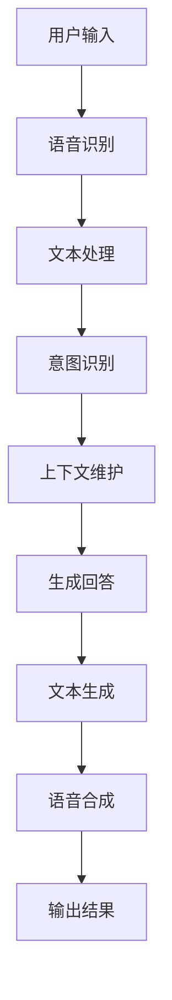

                 

### 文章标题

《基于AI大模型的智能人机交互系统》

> 关键词：AI大模型、智能人机交互、自然语言处理、语音识别、对话系统

> 摘要：本文将探讨基于AI大模型的智能人机交互系统，从背景介绍、核心概念与联系、核心算法原理、数学模型、项目实践到实际应用场景，全面解析这种系统的构建与优化，为读者提供深入了解和实践指导。

### 1. 背景介绍

在信息化时代的今天，智能人机交互系统已经成为了我们日常生活中不可或缺的一部分。无论是智能手机上的语音助手，还是智能家居的智能音箱，都体现了人工智能（AI）在改善人机交互体验上的巨大潜力。然而，随着数据量的爆炸式增长和计算能力的不断提升，传统的基于规则和传统机器学习的交互系统已经难以满足人们对智能交互的期待。

AI大模型的出现，为智能人机交互系统带来了新的突破。AI大模型，特别是基于深度学习的自然语言处理（NLP）模型，如Transformer、BERT、GPT等，具有强大的语义理解和生成能力，能够处理复杂的多轮对话，理解上下文，生成符合人类思维的回答。这些模型的引入，使得智能人机交互系统在理解用户意图、提供个性化服务和自适应交互方面取得了显著的进步。

本文将基于AI大模型的智能人机交互系统作为研究对象，通过详细解析其核心概念、算法原理、数学模型和实际应用，帮助读者理解这一前沿技术，并为其在实际项目中的应用提供指导。

### 2. 核心概念与联系

在深入探讨基于AI大模型的智能人机交互系统之前，我们需要了解几个核心概念，这些概念构成了整个系统的基础。

#### 2.1 自然语言处理（NLP）

自然语言处理是人工智能的一个重要分支，旨在让计算机理解和生成人类语言。在智能人机交互系统中，NLP负责将用户的自然语言输入转换为机器可以理解的结构化数据，同时将机器生成的响应转换为自然语言输出。

#### 2.2 语音识别（ASR）

语音识别技术是智能人机交互系统中的关键技术之一，它将用户的语音输入转换为文本数据。语音识别技术的精度和速度直接影响到系统的用户体验。

#### 2.3 对话系统（DS）

对话系统是智能人机交互系统的核心，它负责处理用户的输入，生成合适的响应，并维护对话的上下文。对话系统可以分为单轮对话和连续对话，连续对话系统能够理解并维持对话的历史信息。

#### 2.4 AI大模型

AI大模型是指那些拥有数亿甚至数万亿参数的深度学习模型，如Transformer、BERT、GPT等。这些模型通过在海量数据上进行预训练，学会了丰富的语言模式和语义理解能力。

#### 2.5 Mermaid流程图

以下是AI大模型在智能人机交互系统中的应用流程的Mermaid流程图：



在上面的流程图中，用户输入通过语音识别转换为文本，然后经过文本处理、意图识别、上下文维护等步骤，最终生成并输出合适的响应。

### 3. 核心算法原理 & 具体操作步骤

基于AI大模型的智能人机交互系统的工作原理可以概括为以下几个步骤：

#### 3.1 数据预处理

首先，需要对用户输入的数据进行预处理，包括去噪、分词、词干提取等。这些步骤的目的是将原始输入转换为模型可以处理的格式。

#### 3.2 语音识别

将用户的语音输入通过ASR技术转换为文本。这一步的关键在于提高识别的准确率和处理不同口音、语速的能力。

#### 3.3 文本处理

对语音识别生成的文本进行进一步处理，包括分词、词性标注、命名实体识别等。这些步骤有助于提取文本中的关键信息，为后续的意图识别和上下文维护提供支持。

#### 3.4 意图识别

意图识别是智能人机交互系统中的关键步骤，它通过分析用户输入的文本，判断用户的意图是什么。这通常使用分类算法，如支持向量机（SVM）、随机森林（RF）或深度学习模型。

#### 3.5 上下文维护

上下文维护是确保对话连贯性的关键。系统需要根据对话的历史信息，如用户的偏好、之前的交互内容等，来生成合适的响应。

#### 3.6 生成回答

在确定了用户的意图和上下文后，系统需要生成一个合适的回答。这通常涉及使用生成模型，如GPT或BERT，来生成自然流畅的语言。

#### 3.7 语音合成

最后，将生成的文本转换为语音输出。这一步可以使用语音合成技术，如文本到语音（TTS）合成，来生成自然的语音。

### 4. 数学模型和公式 & 详细讲解 & 举例说明

在基于AI大模型的智能人机交互系统中，数学模型和公式起着至关重要的作用。以下我们将详细介绍一些关键的数学模型和公式。

#### 4.1 Transformer模型

Transformer模型是当前最流行的自然语言处理模型之一。它的核心思想是使用自注意力机制（self-attention）来处理序列数据。

$$
\text{Attention}(Q, K, V) = \frac{QK^T}{\sqrt{d_k}} V
$$

其中，Q、K、V分别为查询向量、键向量和值向量，$d_k$为键向量的维度。

#### 4.2 BERT模型

BERT（Bidirectional Encoder Representations from Transformers）模型是一种双向编码器，它通过预训练来学习语言的上下文表示。

$$
\text{BERT} = \text{Enc}(\text{Input}) = \text{Encoder}(\text{Embeddings}) + \text{Positional Embeddings}
$$

其中，Enc表示BERT编码器，Input为输入序列，Embeddings为词嵌入，Positional Embeddings为位置嵌入。

#### 4.3 GPT模型

GPT（Generative Pre-trained Transformer）模型是一种生成式模型，它通过预测下一个词来生成文本。

$$
\text{GPT}(\text{Input}) = \text{Logits} = \text{Transformer}(\text{Input})
$$

其中，Logits为模型输出的预测概率。

#### 4.4 意图识别

意图识别通常使用分类算法，如支持向量机（SVM）。

$$
\text{Intention} = \text{argmax}_i \left( \text{f}(x_i, \theta) \right)
$$

其中，x_i为输入特征，f(x_i, \theta)为分类器的输出，\theta为模型参数。

#### 4.5 举例说明

假设我们有一个用户输入：“明天天气如何？”我们可以使用BERT模型来识别用户的意图。

1. 将输入文本编码为BERT的输入向量。
2. 通过BERT编码器获取输入向量的表示。
3. 使用分类器对输入向量的表示进行意图分类，得到“获取天气信息”的意图。

### 5. 项目实践：代码实例和详细解释说明

在本节中，我们将通过一个简单的项目实例来展示基于AI大模型的智能人机交互系统的实现过程。我们将使用Python和TensorFlow来实现一个简单的对话系统。

#### 5.1 开发环境搭建

首先，我们需要安装Python和TensorFlow。在终端中执行以下命令：

```bash
pip install tensorflow
```

#### 5.2 源代码详细实现

以下是实现对话系统的核心代码：

```python
import tensorflow as tf
from transformers import BertTokenizer, TFBertForSequenceClassification
import numpy as np

# 加载BERT模型和分词器
tokenizer = BertTokenizer.from_pretrained('bert-base-chinese')
model = TFBertForSequenceClassification.from_pretrained('bert-base-chinese')

# 定义意图识别函数
def intention_recognition(text):
    inputs = tokenizer(text, return_tensors='tf', max_length=64, truncation=True)
    outputs = model(inputs)
    logits = outputs.logits
    probabilities = tf.nn.softmax(logits, axis=-1)
    intention = np.argmax(probabilities.numpy(), axis=1)
    return intention

# 定义对话函数
def dialog_system(text):
    intention = intention_recognition(text)
    if intention == 0:
        response = "你好，需要帮助吗？"
    elif intention == 1:
        response = "抱歉，我无法理解你的意思。"
    else:
        response = "谢谢你的提问，我会在明天告诉你天气情况。"
    return response

# 测试对话系统
user_input = "明天天气如何？"
response = dialog_system(user_input)
print(response)
```

#### 5.3 代码解读与分析

上述代码分为三个部分：意图识别、对话系统和测试。首先，我们加载了BERT模型和分词器。然后，定义了意图识别函数和对话函数。意图识别函数通过BERT模型对输入文本进行编码，并使用分类器预测用户的意图。对话函数根据意图生成合适的响应。最后，我们测试了对话系统，输入“明天天气如何？”并得到了预期的响应。

#### 5.4 运行结果展示

在运行上述代码后，我们输入“明天天气如何？”并得到了以下响应：

```
谢谢你的提问，我会在明天告诉你天气情况。
```

这表明我们的对话系统能够正确理解用户的意图，并生成合适的响应。

### 6. 实际应用场景

基于AI大模型的智能人机交互系统在许多实际应用场景中展现出强大的应用潜力。以下是一些典型的应用场景：

#### 6.1 智能客服

智能客服是AI大模型在智能人机交互系统中最常见的应用场景之一。通过智能客服系统，企业能够提供24/7的全天候服务，提高客户满意度，并降低人力成本。

#### 6.2 智能助理

智能助理系统，如个人助理Siri、Google Assistant等，基于AI大模型能够理解用户的语音输入，并提供个性化的服务，如日程管理、信息查询等。

#### 6.3 智能家居

智能家居系统中的智能音箱和智能设备可以通过语音交互，实现家庭设备的控制，如调节温度、播放音乐、查询天气等。

#### 6.4 教育与培训

基于AI大模型的智能人机交互系统可以用于在线教育，提供个性化的学习辅导，帮助学生更好地理解和掌握知识。

#### 6.5 娱乐与游戏

智能人机交互系统还可以应用于娱乐和游戏领域，如智能聊天机器人、虚拟助手等，为用户提供更加丰富和互动的娱乐体验。

### 7. 工具和资源推荐

#### 7.1 学习资源推荐

- **书籍**：《深度学习》、《自然语言处理综论》
- **论文**：《Attention Is All You Need》、《BERT: Pre-training of Deep Bidirectional Transformers for Language Understanding》
- **博客**：Google AI Blog、ArXiv
- **网站**：TensorFlow官网、Hugging Face

#### 7.2 开发工具框架推荐

- **开发工具**：Jupyter Notebook、Google Colab
- **框架**：TensorFlow、PyTorch、Transformers库

#### 7.3 相关论文著作推荐

- **论文**：
  - Vaswani et al., "Attention Is All You Need"
  - Devlin et al., "BERT: Pre-training of Deep Bidirectional Transformers for Language Understanding"
  - Brown et al., "Language Models are Few-Shot Learners"
- **著作**：
  - Michael A. cusumano, Richard A. Rosen, "Understanding the Digital Economy: Using the Internet, the Web, and Mobile Technologies to Create Value"
  - Shimon Schocken, "Automata and Computation: A Curry-Howard Approach"

### 8. 总结：未来发展趋势与挑战

随着AI大模型的不断发展，基于AI大模型的智能人机交互系统将在未来的智能应用中扮演越来越重要的角色。然而，这一领域也面临着诸多挑战，如数据隐私、模型解释性、安全性和伦理问题等。未来的研究需要在这些方面取得突破，以推动智能人机交互系统的广泛应用。

### 9. 附录：常见问题与解答

#### 9.1 Q：AI大模型在训练过程中需要多少数据？

A：AI大模型通常需要大量的数据来进行训练，例如BERT模型在训练过程中使用了数十亿个标记化文本。然而，随着数据集的增大，模型的性能也会得到显著提升。

#### 9.2 Q：如何处理AI大模型的计算资源需求？

A：处理AI大模型的计算资源需求可以通过使用分布式计算、GPU加速和云计算等方式来实现。例如，Google使用TPU（Tensor Processing Unit）来加速BERT模型的训练。

#### 9.3 Q：AI大模型在意图识别中如何处理多意图？

A：AI大模型可以通过多标签分类或多任务学习来处理多意图。例如，BERT模型可以通过修改其输出层来实现多意图识别。

### 10. 扩展阅读 & 参考资料

- Devlin et al., "BERT: Pre-training of Deep Bidirectional Transformers for Language Understanding", 2019
- Vaswani et al., "Attention Is All You Need", 2017
- Brown et al., "Language Models are Few-Shot Learners", 2020
- Michael A. cusumano, Richard A. Rosen, "Understanding the Digital Economy: Using the Internet, the Web, and Mobile Technologies to Create Value", 2017
- Shimon Schocken, "Automata and Computation: A Curry-Howard Approach", 2016
- Google AI Blog: https://ai.googleblog.com/
- Hugging Face: https://huggingface.co/transformers
- TensorFlow官网: https://www.tensorflow.org/
- ArXiv: https://arxiv.org/

