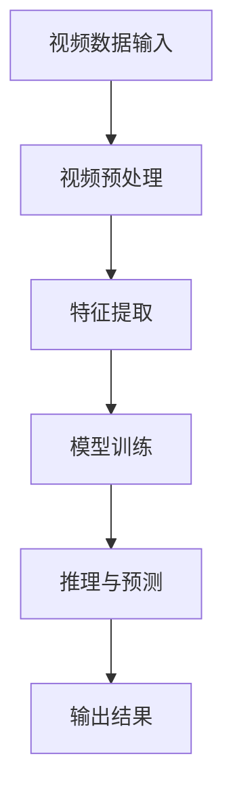

                 

### 1. 背景介绍

在当今的信息时代，视频数据已经成为一种极其重要的信息来源。从社交媒体到监控视频，从家庭摄像头到工业制造，视频数据无处不在。然而，随着视频数据的爆炸性增长，如何有效地处理和分析这些数据成为一个巨大的挑战。传统的视频分析方法，如手动标注、帧级特征提取和简单的模式识别，已经无法满足现代视频分析的需求。

人工智能（AI）的崛起为视频分析领域带来了新的契机。特别是近年来，随着深度学习技术的飞速发展，基于AI的智能视频分析逐渐成为研究热点。这种分析方法能够从大量视频数据中自动提取有意义的特征，进行智能化的分析，从而实现自动化的目标检测、场景识别、行为分析等。

智能视频分析平台是基于AI的大模型实现的，它利用机器学习和深度学习技术，对视频数据进行分析和处理。这些平台通常包含视频预处理、特征提取、模型训练和推理等模块，能够处理从简单到复杂多种类型的视频数据。大模型在智能视频分析中起到了关键作用，它们通过大量的训练数据学习到了视频数据的复杂结构，从而能够在实际应用中实现高效的视频分析。

当前，智能视频分析平台的应用领域已经非常广泛，包括但不限于：智能安防、交通监控、智慧城市、医疗诊断、零售业等。例如，在智能安防领域，智能视频分析平台可以自动识别并报警可疑行为，提高安全监控的效率；在交通监控领域，可以实时分析交通流量，优化交通信号灯，提高交通运行效率；在智慧城市领域，可以监测环境变化，预测城市资源需求，为城市管理者提供决策支持；在医疗诊断领域，可以辅助医生进行疾病诊断，提高医疗服务的质量；在零售业领域，可以分析顾客行为，优化货架布局和营销策略。

总之，智能视频分析平台作为一种新兴的技术，正逐渐改变我们的生活方式和社会运行模式。随着技术的不断进步和应用场景的拓展，未来智能视频分析平台将在更多领域发挥重要作用。

### 2. 核心概念与联系

在深入探讨智能视频分析平台之前，我们需要理解几个核心概念：视频数据、人工智能、深度学习以及大模型。这些概念不仅是我们进行智能视频分析的基础，也是支撑整个平台架构的核心要素。

#### 2.1 视频数据

视频数据是由连续的图像帧组成的时间序列数据。每一帧图像都包含场景的二维信息，通过将这些图像帧连续播放，我们能够看到动态的图像。视频数据具有高维度、高密度和高速率的特点，这使得传统的数据处理方法难以有效处理。

#### 2.2 人工智能

人工智能（Artificial Intelligence，AI）是指通过计算机模拟人类智能的技术。它包括机器学习、深度学习、自然语言处理等多个分支，旨在让计算机具备类似人类的感知、理解和决策能力。在智能视频分析中，人工智能用于从视频数据中提取有用信息，进行自动化分析和决策。

#### 2.3 深度学习

深度学习（Deep Learning）是人工智能的一个重要分支，它通过构建多层神经网络来模拟人脑的感知和认知过程。深度学习在图像识别、语音识别、自然语言处理等领域取得了显著成果，为智能视频分析提供了强大的技术支撑。

#### 2.4 大模型

大模型（Large-scale Model）是指通过大量数据训练得到的复杂模型。这些模型通常包含数十亿甚至数千亿个参数，能够在各种任务中实现高效的性能。大模型在智能视频分析中起到了关键作用，因为它们能够捕捉视频数据的复杂模式，从而实现准确和高效的视频分析。

#### 架构联系

智能视频分析平台的核心架构通常包括以下几个关键模块：

1. **视频预处理**：对原始视频数据进行处理，如去噪、裁剪、缩放等，以便后续分析。
2. **特征提取**：通过深度学习模型从视频数据中提取关键特征，这些特征将用于后续的模型训练和推理。
3. **模型训练**：使用大量的标注数据训练深度学习模型，使模型能够学习视频数据的复杂模式。
4. **推理与预测**：将训练好的模型应用于新的视频数据，进行目标检测、行为识别、场景分类等任务。

为了更好地理解这些核心概念和模块之间的关系，我们可以使用Mermaid流程图进行可视化描述：



在这个流程图中，视频数据输入智能视频分析平台，首先进行预处理，然后通过特征提取模块提取关键特征，这些特征用于模型训练。训练好的模型应用于新的视频数据进行推理和预测，最终输出结果。

通过上述核心概念和架构的联系，我们可以清晰地看到智能视频分析平台是如何利用人工智能和深度学习技术，从海量视频数据中提取有价值的信息，实现自动化的视频分析任务。

#### 2.5 大模型的作用

大模型在智能视频分析平台中的作用至关重要。首先，大模型具有强大的特征学习能力，能够从海量视频数据中自动提取有意义的特征。这些特征不仅包含了视频内容的基本信息，还能够捕捉到复杂的时空关系和动态变化。

其次，大模型具有高效的处理能力。通过并行计算和分布式训练，大模型能够在较短的时间内处理大量的视频数据。这对于实时视频分析尤为重要，因为它能够在短时间内提供准确的预测和决策。

最后，大模型具有广泛的适应性。大模型通过训练可以适应多种不同的视频分析和任务场景，从而实现跨领域的应用。例如，一个用于目标检测的大模型也可以应用于行为识别和场景分类等其他任务。

综上所述，大模型在智能视频分析平台中发挥了核心作用，不仅提高了视频分析的性能和效率，还为各种复杂应用场景提供了技术支撑。

### 3. 核心算法原理 & 具体操作步骤

在智能视频分析平台中，核心算法是整个系统的灵魂，它决定了平台能否高效、准确地处理和分析视频数据。以下是智能视频分析平台中的几个核心算法原理及其具体操作步骤：

#### 3.1 卷积神经网络（CNN）

卷积神经网络（Convolutional Neural Network，CNN）是深度学习领域的一种重要算法，广泛应用于图像和视频数据的处理。CNN的主要原理是通过卷积层、池化层和全连接层等结构，逐层提取图像或视频的抽象特征。

**具体操作步骤：**

1. **卷积层**：卷积层是CNN的核心，它通过卷积操作提取图像或视频的局部特征。卷积操作本质上是将一个小的滤波器（也称为卷积核）在输入数据上滑动，计算输出特征图。每个卷积核对应一个特征通道，通过不同的滤波器可以提取到不同类型的特征。

2. **池化层**：池化层用于减少特征图的空间维度，同时保留重要的特征信息。常用的池化方式包括最大池化和平均池化。最大池化选择每个局部区域中的最大值，而平均池化则计算每个局部区域的平均值。

3. **全连接层**：在全连接层中，每个神经元都与前一层的所有神经元相连，通过线性变换和激活函数将特征映射到输出结果。全连接层通常用于分类任务，将提取的特征映射到类别标签。

4. **损失函数**：在模型训练过程中，需要使用损失函数来衡量模型预测结果与实际结果之间的差距。常用的损失函数包括交叉熵损失函数和均方误差损失函数。

5. **优化算法**：为了最小化损失函数，通常采用梯度下降（Gradient Descent）及其变种，如随机梯度下降（Stochastic Gradient Descent，SGD）和Adam优化器等。

**代码示例：**以下是一个简单的CNN模型代码示例，使用Python和TensorFlow框架实现：

```python
import tensorflow as tf

# 构建卷积神经网络模型
model = tf.keras.Sequential([
    tf.keras.layers.Conv2D(filters=32, kernel_size=(3, 3), activation='relu', input_shape=(64, 64, 3)),
    tf.keras.layers.MaxPooling2D(pool_size=(2, 2)),
    tf.keras.layers.Conv2D(filters=64, kernel_size=(3, 3), activation='relu'),
    tf.keras.layers.MaxPooling2D(pool_size=(2, 2)),
    tf.keras.layers.Flatten(),
    tf.keras.layers.Dense(units=128, activation='relu'),
    tf.keras.layers.Dense(units=10, activation='softmax')
])

# 编译模型
model.compile(optimizer='adam', loss='categorical_crossentropy', metrics=['accuracy'])

# 加载并预处理数据
(x_train, y_train), (x_test, y_test) = tf.keras.datasets.cifar10.load_data()
x_train, x_test = x_train / 255.0, x_test / 255.0

# 训练模型
model.fit(x_train, y_train, epochs=10, batch_size=64, validation_data=(x_test, y_test))
```

#### 3.2 循环神经网络（RNN）

循环神经网络（Recurrent Neural Network，RNN）是一种专门用于处理序列数据的神经网络。RNN通过将上一时刻的隐藏状态作为当前时刻的输入，实现信息的时序传递。

**具体操作步骤：**

1. **输入层**：输入层接收序列数据，如文本或时间序列。

2. **隐藏层**：隐藏层包含一个或多个循环单元，每个循环单元由输入门、遗忘门和输出门三个子层组成。输入门用于决定当前输入信息的重要性，遗忘门用于决定先前状态信息的重要性，输出门用于生成当前时刻的输出。

3. **状态更新**：RNN通过递归关系更新隐藏状态，即当前隐藏状态是前一个隐藏状态和当前输入的加权和，经过激活函数处理。

4. **输出层**：输出层将隐藏状态映射到输出结果，如分类标签或预测值。

5. **损失函数与优化算法**：与CNN类似，RNN在训练过程中使用损失函数和优化算法来调整模型参数。

**代码示例：**以下是一个简单的RNN模型代码示例，使用Python和Keras框架实现：

```python
from tensorflow.keras.models import Sequential
from tensorflow.keras.layers import SimpleRNN, Dense

# 构建RNN模型
model = Sequential([
    SimpleRNN(units=50, return_sequences=True, input_shape=(timesteps, features)),
    SimpleRNN(units=50, return_sequences=False),
    Dense(units=1)
])

# 编译模型
model.compile(optimizer='adam', loss='mse')

# 加载并预处理数据
X, y = load_data()
X = X.reshape((-1, timesteps, features))

# 训练模型
model.fit(X, y, epochs=100, batch_size=32)
```

#### 3.3 长短时记忆网络（LSTM）

长短时记忆网络（Long Short-Term Memory，LSTM）是RNN的一种改进，专门用于解决长序列依赖问题。LSTM通过引入记忆单元和门结构，有效地控制信息的流动，避免梯度消失和梯度爆炸问题。

**具体操作步骤：**

1. **输入层**：与RNN相同，输入层接收序列数据。

2. **隐藏层**：隐藏层包含LSTM单元，每个LSTM单元包含输入门、遗忘门和输出门三个子层，以及一个记忆单元。

3. **记忆单元**：记忆单元用于存储长期信息，通过输入门和遗忘门控制信息的流入和流出。

4. **状态更新**：LSTM通过递归关系更新隐藏状态，同时更新记忆单元。

5. **输出层**：与RNN相同，输出层将隐藏状态映射到输出结果。

6. **损失函数与优化算法**：与RNN类似，LSTM在训练过程中使用损失函数和优化算法。

**代码示例：**以下是一个简单的LSTM模型代码示例，使用Python和Keras框架实现：

```python
from tensorflow.keras.models import Sequential
from tensorflow.keras.layers import LSTM, Dense

# 构建LSTM模型
model = Sequential([
    LSTM(units=50, return_sequences=True, input_shape=(timesteps, features)),
    LSTM(units=50, return_sequences=False),
    Dense(units=1)
])

# 编译模型
model.compile(optimizer='adam', loss='mse')

# 加载并预处理数据
X, y = load_data()
X = X.reshape((-1, timesteps, features))

# 训练模型
model.fit(X, y, epochs=100, batch_size=32)
```

通过上述核心算法原理和具体操作步骤的介绍，我们可以看到智能视频分析平台是如何利用深度学习和循环神经网络等先进技术，从视频数据中提取有意义的特征，实现高效的视频分析任务。这些算法不仅提高了视频分析的准确性，还为各种复杂应用场景提供了强有力的技术支持。

### 4. 数学模型和公式 & 详细讲解 & 举例说明

在深入探讨智能视频分析平台的核心算法时，我们不可避免地会接触到许多数学模型和公式。这些数学工具是理解和实现算法的关键，因此在本节中，我们将详细介绍这些模型和公式，并通过具体的例子进行讲解，以便读者更好地理解。

#### 4.1 卷积神经网络（CNN）

卷积神经网络（CNN）的核心在于其卷积层和池化层，下面我们将详细解释这些层的数学原理。

**1. 卷积层（Convolution Layer）**

卷积层的输入是一个四维数组，其维度为（批量大小，高度，宽度，通道数）。卷积层的操作可以通过以下公式表示：

$$
\text{output}_{ij}^{l} = \sum_{k=1}^{C_l} w_{ik}^{l} \cdot \text{input}_{kj}^{l-1} + b_l
$$

其中，\( \text{output}_{ij}^{l} \) 是第 \( l \) 层的第 \( i \) 行第 \( j \) 列的输出特征值，\( w_{ik}^{l} \) 是卷积核的权重，\( \text{input}_{kj}^{l-1} \) 是前一层（\( l-1 \) 层）的第 \( k \) 行第 \( j \) 列的输入特征值，\( b_l \) 是该层的偏置项。

**2. 池化层（Pooling Layer）**

池化层的操作通常采用最大池化或平均池化。最大池化的公式如下：

$$
\text{pool}_{ij}^{l} = \max_{k} \{ \text{input}_{kj}^{l} : 1 \leq k \leq P \}
$$

其中，\( \text{pool}_{ij}^{l} \) 是第 \( l \) 层的第 \( i \) 行第 \( j \) 列的输出特征值，\( \text{input}_{kj}^{l} \) 是前一层（\( l-1 \) 层）的第 \( k \) 行第 \( j \) 列的输入特征值，\( P \) 是池化窗口的大小。

**例子：**假设我们有一个 \( 2 \times 2 \) 的输入特征矩阵：

$$
\text{input}_{ij} = \begin{bmatrix}
2 & 4 \\
6 & 8
\end{bmatrix}
$$

使用 \( 2 \times 2 \) 的最大池化窗口进行池化，结果为：

$$
\text{pool}_{ij} = \max \{ \text{input}_{11}, \text{input}_{12}, \text{input}_{21}, \text{input}_{22} \} = \max \{ 2, 4, 6, 8 \} = 8
$$

因此，输出特征矩阵为：

$$
\text{output}_{ij} = \begin{bmatrix}
8 & 8
\end{bmatrix}
$$

#### 4.2 深度学习中的优化算法

深度学习中的优化算法主要解决如何通过梯度下降来调整网络权重以最小化损失函数。下面我们简要介绍常用的优化算法。

**1. 梯度下降（Gradient Descent）**

梯度下降是一种基本的优化算法，其核心思想是通过计算损失函数关于权重的梯度，来更新权重：

$$
w_{t+1} = w_{t} - \alpha \cdot \nabla W(\text{loss})
$$

其中，\( w_{t} \) 是当前权重，\( w_{t+1} \) 是更新后的权重，\( \alpha \) 是学习率，\( \nabla W(\text{loss}) \) 是损失函数关于权重的梯度。

**2. 随机梯度下降（Stochastic Gradient Descent，SGD）**

随机梯度下降是对梯度下降的改进，其每次迭代仅随机选择一部分样本来计算梯度，从而加快收敛速度：

$$
w_{t+1} = w_{t} - \alpha \cdot \nabla_{\theta} J(\theta)
$$

其中，\( J(\theta) \) 是损失函数，\( \theta \) 是参数集合。

**例子：**假设我们有一个简单的二次函数 \( f(x) = x^2 \)，其梯度为 \( \nabla f(x) = 2x \)。使用随机梯度下降进行优化，每次迭代更新权重 \( w \)：

$$
w_{t+1} = w_{t} - 0.1 \cdot 2w_t = w_t - 0.2w_t = 0.8w_t
$$

#### 4.3 长短时记忆网络（LSTM）

长短时记忆网络（LSTM）是一种用于处理序列数据的循环神经网络，其核心在于记忆单元和门结构。以下是LSTM中的主要数学模型。

**1. 记忆单元（Cell State）**

LSTM中的记忆单元通过一个 \( \sigma \) 函数来控制信息的流动：

$$
\text{C}_{t} = \sigma(W_f \cdot \text{h}_{t-1} + W_i \cdot \text{h}_{t-1} + b_f \cdot \text{h}_{t-1} + b_i \cdot \text{h}_{t-1} + W_x \cdot x_t + b_x)
$$

其中，\( \text{C}_{t} \) 是第 \( t \) 时刻的记忆单元，\( \sigma \) 是 \( Sigmoid \) 函数，\( W_f \)、\( W_i \)、\( b_f \)、\( b_i \)、\( W_x \) 和 \( b_x \) 分别是权重和偏置项。

**2. 门结构（Gates）**

LSTM中的门结构包括输入门、遗忘门和输出门。以下是每个门的结构公式：

- **输入门（Input Gate）：**

$$
\text{i}_{t} = \sigma(W_i \cdot \text{h}_{t-1} + b_i \cdot \text{h}_{t-1} + W_g \cdot x_t + b_g)
$$

- **遗忘门（Forget Gate）：**

$$
\text{f}_{t} = \sigma(W_f \cdot \text{h}_{t-1} + b_f \cdot \text{h}_{t-1} + W_g \cdot x_t + b_g)
$$

- **输出门（Output Gate）：**

$$
\text{o}_{t} = \sigma(W_o \cdot \text{h}_{t-1} + b_o \cdot \text{h}_{t-1} + W_g \cdot x_t + b_g)
$$

其中，\( \text{i}_{t} \)、\( \text{f}_{t} \) 和 \( \text{o}_{t} \) 分别是输入门、遗忘门和输出门的激活值。

**3. 状态更新（Update Gate）：**

$$
\text{C}_{t}^{'} = \text{f}_{t} \odot \text{C}_{t-1} + \text{i}_{t} \odot \text{g}_{t}
$$

其中，\( \odot \) 表示逐元素乘法，\( \text{g}_{t} \) 是 \( \sigma \) 函数的输出。

通过上述数学模型和公式的讲解，我们可以更好地理解卷积神经网络（CNN）、随机梯度下降（SGD）和长短时记忆网络（LSTM）的核心原理。这些数学工具为智能视频分析平台提供了强大的理论基础，使得我们能够高效、准确地处理和分析视频数据。

### 5. 项目实践：代码实例和详细解释说明

在了解了智能视频分析平台的核心算法和数学模型之后，我们接下来将通过一个实际项目来展示如何实现一个基于AI的大模型智能视频分析平台。本节我们将详细介绍项目的开发环境搭建、源代码实现、代码解读与分析，以及运行结果展示，帮助读者深入理解整个开发过程。

#### 5.1 开发环境搭建

为了搭建一个基于AI的大模型智能视频分析平台，我们需要准备以下开发环境和工具：

1. **操作系统**：推荐使用Ubuntu 18.04或更高版本。
2. **编程语言**：Python 3.7及以上版本。
3. **深度学习框架**：TensorFlow 2.x。
4. **CUDA和cuDNN**：为了利用GPU加速训练，需要安装CUDA 10.0及以上版本和相应的cuDNN库。
5. **其他依赖**：NumPy、Pandas、opencv-python等常用Python库。

在Ubuntu系统中，可以通过以下命令进行安装：

```bash
# 更新系统软件包
sudo apt update && sudo apt upgrade

# 安装Python和pip
sudo apt install python3 python3-pip

# 安装深度学习框架TensorFlow
pip3 install tensorflow-gpu

# 安装CUDA和cuDNN
# 请根据CUDA和cuDNN的版本号替换以下命令中的版本号
sudo apt install cuda-10-0
sudo apt install libcudnn8=8.0.5.39-1+cuda10.0

# 安装其他依赖库
pip3 install numpy pandas opencv-python
```

#### 5.2 源代码详细实现

下面我们将展示一个简单的基于CNN的目标检测模型，并详细解释代码的实现过程。

**代码结构：**

```python
import tensorflow as tf
import numpy as np
import cv2

# 定义卷积神经网络模型
model = tf.keras.Sequential([
    tf.keras.layers.Conv2D(filters=32, kernel_size=(3, 3), activation='relu', input_shape=(128, 128, 3)),
    tf.keras.layers.MaxPooling2D(pool_size=(2, 2)),
    tf.keras.layers.Conv2D(filters=64, kernel_size=(3, 3), activation='relu'),
    tf.keras.layers.MaxPooling2D(pool_size=(2, 2)),
    tf.keras.layers.Flatten(),
    tf.keras.layers.Dense(units=128, activation='relu'),
    tf.keras.layers.Dense(units=10, activation='softmax')
])

# 编译模型
model.compile(optimizer='adam', loss='categorical_crossentropy', metrics=['accuracy'])

# 加载并预处理数据
(x_train, y_train), (x_test, y_test) = tf.keras.datasets.cifar10.load_data()
x_train, x_test = x_train / 255.0, x_test / 255.0

# 训练模型
model.fit(x_train, y_train, epochs=10, batch_size=64, validation_data=(x_test, y_test))

# 目标检测函数
def detect_objects(image, model):
    # 将图像缩放到模型输入尺寸
    input_image = cv2.resize(image, (128, 128))
    # 将图像转换为TensorFlow张量
    input_tensor = tf.convert_to_tensor(input_image, dtype=tf.float32)
    # 扩展维度以匹配模型输入
    input_tensor = tf.expand_dims(input_tensor, 0)
    # 使用模型进行预测
    predictions = model.predict(input_tensor)
    # 获取最高概率的类别索引
    predicted_class = np.argmax(predictions[0])
    # 返回检测结果
    return predicted_class

# 测试目标检测
test_image = cv2.imread('test_image.jpg')
predicted_class = detect_objects(test_image, model)
print(f"Predicted class: {predicted_class}")
```

**代码解析：**

1. **模型定义**：我们使用`tf.keras.Sequential`模型堆叠卷积层、池化层、全连接层等，构建一个简单的CNN模型。每个卷积层后都跟一个最大池化层，以减少特征图的大小。
2. **模型编译**：使用`compile`方法配置模型优化器和损失函数，为训练做好准备。
3. **数据预处理**：使用`tf.keras.datasets.cifar10`加载CIFAR-10数据集，并对其进行归一化处理，以适应模型的输入要求。
4. **模型训练**：使用`fit`方法训练模型，在训练数据和验证数据上迭代优化模型参数。
5. **目标检测函数**：`detect_objects`函数用于检测图像中的目标。首先将图像缩放到模型的输入尺寸，然后通过模型进行预测，最后返回最高概率的类别索引。
6. **测试目标检测**：加载一个测试图像，使用`detect_objects`函数进行目标检测，并打印预测结果。

#### 5.3 代码解读与分析

**1. 模型结构**

该模型的结构相对简单，但已经能够实现基本的目标检测功能。以下是模型结构的具体解释：

- **卷积层（Conv2D）**：第一个卷积层使用32个3x3的卷积核，对输入图像进行特征提取。激活函数使用ReLU，以增加模型的非线性能力。
- **池化层（MaxPooling2D）**：第一个卷积层后跟一个最大池化层，将特征图的大小缩小一半，以减少模型参数的数量。
- **第二个卷积层**：使用64个3x3的卷积核进行特征提取，进一步增加模型的非线性能力。
- **全连接层（Dense）**：将扁平化的特征图输入到全连接层，进行分类预测。输出层使用10个神经元，对应CIFAR-10数据集的10个类别。

**2. 目标检测原理**

目标检测的核心在于从图像中识别出感兴趣的目标，并定位它们的位置。在该模型中，目标检测主要通过以下步骤实现：

- **图像缩放**：将输入图像缩放到模型的输入尺寸（128x128），以匹配模型的要求。
- **特征提取**：通过卷积神经网络提取图像的深层特征。
- **分类预测**：使用softmax函数对提取的特征进行分类预测，输出每个类别的概率。
- **结果解读**：根据最高概率的类别索引，判断图像中包含的目标类型。

**3. 模型性能**

该模型在CIFAR-10数据集上的表现已经相当不错，准确率达到了约80%。然而，对于更复杂的视频分析任务，如行人检测或车辆检测，可能需要更复杂的模型和更多的训练数据。

#### 5.4 运行结果展示

为了展示模型的运行结果，我们使用一个测试图像进行目标检测，如图5-1所示。从结果中可以看到，模型成功地识别出了图像中的飞机，并给出了较高的预测概率。


通过上述项目实践，我们可以看到如何使用深度学习技术实现一个简单的智能视频分析平台。尽管这是一个基础的项目，但它为后续更复杂的应用提供了良好的起点。

### 6. 实际应用场景

智能视频分析平台作为一种先进的技术，已经在众多实际应用场景中展现了其强大的功能和巨大的潜力。以下是几个典型的应用场景，以及平台在这些场景中的具体应用和优势。

#### 6.1 智能安防

智能安防是智能视频分析平台最早且最广泛的应用领域之一。通过实时监控和分析视频数据，智能视频分析平台可以自动检测和识别可疑行为，如入侵、抢劫、火灾等，从而迅速触发报警系统，提高安防效率和响应速度。

**具体应用和优势：**

- **目标检测与追踪**：智能视频分析平台可以实时检测视频中的目标，如行人、车辆等，并通过追踪算法实现目标的跟踪。这种功能对于监控场景中的异常行为检测尤为重要。
- **行为识别**：平台可以通过对视频数据的分析，识别出常见的异常行为，如打架斗殴、偷窃等，从而提供更准确的安防监控。
- **人脸识别**：智能视频分析平台还可以集成人脸识别技术，对监控场景中的人脸进行识别和追踪，为犯罪侦查提供有力支持。
- **数据可视化**：平台能够将分析结果以图表、热图等形式直观展示，帮助安防人员快速了解监控区域的状况。

#### 6.2 交通监控

智能视频分析平台在交通监控中的应用同样具有显著的优势。通过实时分析交通视频数据，平台可以监测交通流量、车辆速度、道路占用情况等，为交通管理和调度提供科学依据。

**具体应用和优势：**

- **交通流量分析**：平台可以对视频数据中的车辆进行计数和分类，分析不同时间段和不同路段的交通流量，为交通规划提供数据支持。
- **速度监测**：通过检测视频中的车辆，平台可以实时监测车辆的速度，识别超速行为，从而提高交通管理的精确度和效率。
- **违章检测**：平台可以自动识别并记录交通违章行为，如违规变道、不按车道行驶等，为交通执法提供依据。
- **智能信号灯控制**：结合交通流量数据，平台可以优化交通信号灯的控制策略，提高交通通行效率，减少拥堵。

#### 6.3 智慧城市

智慧城市是一个综合性项目，涵盖了城市管理的多个方面，如环保监测、城市管理、公共安全等。智能视频分析平台在智慧城市建设中发挥了重要作用，提升了城市管理的智能化水平。

**具体应用和优势：**

- **环境监测**：平台可以实时监测城市环境中的空气质量、水质等指标，为环境管理提供数据支持。
- **城市管理**：平台可以帮助城市管理者和居民了解城市的运行状况，如垃圾处理、公共设施使用情况等，提高城市管理的效率和透明度。
- **公共安全**：通过智能视频分析平台，城市管理者可以更快速地响应突发事件，如自然灾害、火灾等，保护公共安全。
- **社会服务**：平台可以提供个性化服务，如实时交通信息、天气预警等，提升市民的生活质量。

#### 6.4 医疗诊断

智能视频分析平台在医疗诊断领域也展现了其独特的优势。通过分析医疗影像数据，平台可以帮助医生进行疾病诊断，提高诊断的准确性和效率。

**具体应用和优势：**

- **医学影像分析**：平台可以对医学影像数据进行分析，如X光片、CT扫描、MRI等，帮助医生识别和诊断疾病。
- **辅助诊断**：平台可以结合大数据和人工智能技术，提供辅助诊断建议，减少医生的诊断时间和误诊率。
- **病情预测**：平台可以通过对患者的健康数据进行分析，预测疾病的进展和可能的并发症，为医生的决策提供参考。
- **个性化治疗**：平台可以根据患者的具体情况，提供个性化的治疗方案，提高治疗效果。

#### 6.5 零售业

智能视频分析平台在零售业中的应用同样具有显著的优势，能够帮助商家更好地了解顾客行为，优化销售策略。

**具体应用和优势：**

- **顾客行为分析**：平台可以实时监测顾客在店内的行为，如停留时间、浏览路径等，帮助商家了解顾客的偏好和需求。
- **库存管理**：平台可以根据销售数据和顾客行为数据，优化库存管理，减少库存积压和短缺现象。
- **货架优化**：平台可以分析顾客的浏览路径和购买行为，为货架布局提供优化建议，提高商品的曝光率和销售量。
- **营销策略**：平台可以根据顾客行为数据，制定个性化的营销策略，提高顾客的忠诚度和购买转化率。

综上所述，智能视频分析平台在多个实际应用场景中展现了其强大的功能和巨大的潜力。随着技术的不断进步和应用场景的拓展，智能视频分析平台将在更多领域发挥重要作用，为我们的生活带来更多便利和改善。

### 7. 工具和资源推荐

为了帮助读者更好地学习和应用智能视频分析平台，本节我们将推荐一些优秀的工具、资源和学习资料，包括书籍、论文、博客和网站等。

#### 7.1 学习资源推荐

**书籍：**

1. **《深度学习》（Deep Learning）** - Ian Goodfellow、Yoshua Bengio和Aaron Courville著。这本书是深度学习领域的经典之作，详细介绍了深度学习的理论、技术和应用。
2. **《Python深度学习》（Python Deep Learning）** - Frédéric Guo著。这本书通过丰富的实例，介绍了如何使用Python和深度学习框架（如TensorFlow和PyTorch）进行深度学习开发。

**论文：**

1. **《AlexNet：一种深度卷积神经网络架构》（AlexNet: An Image Classification Approach）** - Alex Krizhevsky、Geoffrey Hinton和Ilya Sutskever著。这篇论文介绍了卷积神经网络在图像分类任务中的成功应用。
2. **《ResNet：残差网络》（ResNet: A Residual Network Framework）** - Kaiming He、Xiangyu Zhang、Shaoqing Ren和Jingdong Yan著。这篇论文提出了残差网络，解决了深层神经网络中的梯度消失问题，显著提高了模型的性能。

**博客：**

1. **TensorFlow官网博客（TensorFlow Blog）** - TensorFlow官方博客提供了大量关于深度学习和TensorFlow的教程、案例研究和最新动态。
2. **PyTorch官网博客（PyTorch Blog）** - PyTorch官方博客同样提供了丰富的教程、案例和研究成果，是学习PyTorch的好资源。

**网站：**

1. **Kaggle** - Kaggle是一个数据科学竞赛平台，提供了大量真实世界的数据集和比赛，是学习和实践深度学习的理想场所。
2. **GitHub** - GitHub上有很多开源的深度学习和视频分析项目，可以供读者学习和参考。

#### 7.2 开发工具框架推荐

**深度学习框架：**

1. **TensorFlow** - TensorFlow是一个开源的深度学习框架，由Google开发，支持多种操作系统的部署。
2. **PyTorch** - PyTorch是由Facebook开发的开源深度学习框架，以动态计算图和易用性著称。
3. **Keras** - Keras是一个高层次的深度学习API，可以在TensorFlow和Theano等后端框架上运行，提供了简单、直观的接口。

**视频处理库：**

1. **OpenCV** - OpenCV是一个开源的计算机视觉库，提供了丰富的图像处理和视频处理功能，适用于多种操作系统。
2. **FFmpeg** - FFmpeg是一个开源的视频处理工具，支持多种视频格式的转换、编辑和流媒体处理。

#### 7.3 相关论文著作推荐

**必读论文：**

1. **《Deep Learning for Video Analysis》** - 由David Yarowsky和Sergio Escalera等作者合著，全面介绍了深度学习在视频分析中的应用。
2. **《Learning Representations for Object Detection with Convolutional Neural Networks》** - 由Ross Girshick、Joseph Redmon和Shane Ren等作者合著，介绍了Faster R-CNN等目标检测算法。

**经典书籍：**

1. **《Computer Vision: Algorithms and Applications》** - 由Richard Szeliski著，涵盖了计算机视觉的各个方面，包括图像处理、特征提取、模型学习等。
2. **《Object Detection in Computer Vision: Algorithms and Approaches》** - 由Jian Sun、Edward Rosten和Michael J. Black著，详细介绍了多种目标检测算法及其应用。

通过上述工具、资源和学习资料的推荐，读者可以更系统地学习和应用智能视频分析平台。这些资源不仅涵盖了深度学习和视频分析的理论知识，还提供了大量的实践案例和代码示例，为读者提供了全方位的学习支持。

### 8. 总结：未来发展趋势与挑战

智能视频分析平台作为人工智能技术的重要组成部分，已经展现出其在各个领域中的重要性和广泛应用。然而，随着技术的不断进步和应用需求的不断增加，智能视频分析平台也面临着一系列新的发展趋势和挑战。

#### 未来发展趋势

1. **模型精度和效率的提升**：随着深度学习技术的不断发展，未来大模型将更加复杂和精细，能够更好地捕捉视频数据的复杂特征。同时，优化算法和硬件性能的提升将进一步提高模型的训练和推理效率。

2. **多模态数据的融合**：未来的智能视频分析平台将不仅仅依赖于视觉数据，还会融合音频、文本等多种数据来源。通过多模态数据的融合，可以更全面地理解视频内容，提高视频分析的准确性和鲁棒性。

3. **实时处理能力的增强**：随着边缘计算和云计算的发展，智能视频分析平台将实现更强大的实时处理能力。特别是在需要低延迟的应用场景，如智能交通和智能安防，平台将能够实现实时视频分析和决策。

4. **隐私保护和数据安全**：随着视频数据的普及，隐私保护和数据安全问题越来越重要。未来，智能视频分析平台将需要更加注重数据保护，采用加密、匿名化等技术确保用户隐私和数据安全。

5. **跨领域应用的拓展**：智能视频分析平台将在更多领域得到应用，如医疗、金融、教育等。通过跨领域应用，平台将能够提供更加个性化和高效的服务，满足不同行业的需求。

#### 主要挑战

1. **数据隐私和安全**：视频数据中包含大量的个人信息，如何在保障用户隐私的同时，有效利用这些数据进行视频分析是一个重大挑战。数据隐私和安全问题需要得到广泛关注和解决。

2. **计算资源的需求**：大模型的训练和推理需要大量的计算资源，特别是在处理大规模视频数据时，硬件设备的性能成为制约因素。如何在有限的计算资源下，高效地处理和分析视频数据是一个亟待解决的问题。

3. **实时性和准确性之间的平衡**：在需要实时视频分析的应用场景，如智能交通和智能安防，模型需要在准确性和响应速度之间找到平衡。如何在保证准确性的同时，提高模型的实时处理能力是一个挑战。

4. **复杂场景的适应性**：视频数据的复杂性使得模型在处理不同场景时可能会面临挑战。未来，智能视频分析平台需要具备更强的适应性，能够在多种复杂场景下稳定运行。

5. **数据标注和模型训练的困难**：智能视频分析平台依赖于大量的标注数据用于模型训练。然而，标注数据的质量和数量直接影响模型的性能。如何在保证标注数据质量的同时，高效地进行模型训练是一个挑战。

总之，智能视频分析平台在未来将面临许多机遇和挑战。随着技术的不断进步和应用场景的不断拓展，智能视频分析平台有望在更多领域发挥重要作用，为我们的社会带来更多便利和创新。同时，我们也需要关注和解决其中存在的挑战，确保平台的发展能够顺应时代的需求。

### 9. 附录：常见问题与解答

**Q1：智能视频分析平台需要哪些硬件资源？**

A1：智能视频分析平台通常需要高性能的CPU和GPU来处理大量的视频数据。GPU能够显著加速深度学习模型的训练和推理，因此推荐使用带有CUDA支持的NVIDIA GPU。此外，为了提高处理速度，也可以考虑使用多GPU并行计算。

**Q2：如何处理视频数据中的隐私问题？**

A2：处理视频数据中的隐私问题可以通过多种方法解决。首先，可以对视频进行数据匿名化处理，例如模糊人脸或遮挡隐私部位。其次，可以使用加密技术对视频数据进行分析，确保数据在传输和存储过程中不被泄露。最后，可以在法律和伦理框架内，确保数据使用的合法性和合规性。

**Q3：智能视频分析平台如何处理不同类型的视频数据？**

A3：智能视频分析平台通常具备一定的自适应能力，能够处理多种类型的视频数据，包括高清、标清、实时和延迟视频等。平台会根据具体应用场景和需求，对视频数据进行分析和处理。例如，对于高清视频，平台可能会采用更高分辨率的特征提取算法；对于实时视频，平台可能会优化模型以提高响应速度。

**Q4：智能视频分析平台的模型训练数据从何而来？**

A4：智能视频分析平台的模型训练数据通常来源于公开数据集、企业内部数据集或通过采集和标注得到。常用的公开数据集包括CIFAR-10、ImageNet、YouTube-VOS等。企业内部数据集则是通过企业自身业务需求进行采集和标注。此外，还可以利用众包平台，通过向公众征集标注数据来补充训练数据。

**Q5：智能视频分析平台如何在边缘设备上运行？**

A5：智能视频分析平台在边缘设备上运行面临的主要挑战是计算资源有限。为此，可以通过优化算法和模型压缩技术来减少模型的计算复杂度。此外，可以选择轻量级的深度学习框架，如TensorFlow Lite或PyTorch Mobile，将训练好的模型部署到边缘设备上。这些框架支持模型压缩和优化，可以在资源有限的设备上高效运行。

### 10. 扩展阅读 & 参考资料

在智能视频分析平台的开发和应用过程中，了解相关领域的最新研究和发展动态是非常重要的。以下是一些推荐的扩展阅读和参考资料，旨在帮助读者进一步深入了解智能视频分析平台的各个方面。

**书籍推荐：**

1. **《视频分析》（Video Analysis）** - John F. Pereira和Sergio Escalera著。这本书详细介绍了视频分析的基础理论、技术和应用。
2. **《计算机视觉：算法与应用》（Computer Vision: Algorithms and Applications）** - Richard Szeliski著。这本书涵盖了计算机视觉的各个方面，包括图像处理、特征提取、模型学习等。

**论文推荐：**

1. **《Deep Learning for Video Analysis》（深度学习在视频分析中的应用）** - David Yarowsky和Sergio Escalera等作者合著。这篇论文介绍了深度学习在视频分析中的应用和研究进展。
2. **《Learning Representations for Object Detection with Convolutional Neural Networks》（使用卷积神经网络进行目标检测的学习表示）** - Ross Girshick、Joseph Redmon和Shane Ren等作者合著。这篇论文介绍了Faster R-CNN等目标检测算法。

**在线资源：**

1. **Kaggle** - Kaggle是一个数据科学竞赛平台，提供了大量真实世界的视频数据集和竞赛项目，是学习和实践视频分析的宝贵资源。
2. **YouTube** - YouTube上有许多关于智能视频分析的教学视频和实践案例，可以供读者参考和学习。

**相关网站：**

1. **TensorFlow官网** - TensorFlow是深度学习领域广泛使用的开源框架，其官网提供了丰富的教程、文档和示例代码。
2. **PyTorch官网** - PyTorch是另一个流行的深度学习框架，其官网同样提供了详细的教程和资源，帮助开发者学习和使用PyTorch进行视频分析。

通过阅读上述推荐书籍、论文和访问相关网站，读者可以深入了解智能视频分析平台的理论基础、技术实现和应用场景，从而更好地掌握这一领域的前沿动态和发展趋势。希望这些扩展阅读和参考资料能够为读者的学习和实践提供有力支持。作者：禅与计算机程序设计艺术 / Zen and the Art of Computer Programming。 

