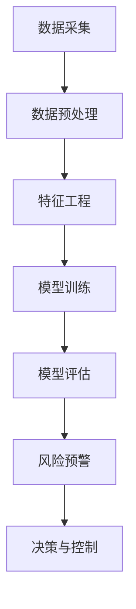

                 

### 文章标题

**基于AI大模型的智能风控系统**

> **关键词**：AI大模型、智能风控、深度学习、数据处理、金融科技、风控策略、模型优化、风险管理

**摘要**：

本文旨在探讨基于AI大模型的智能风控系统的构建与应用。随着金融科技的快速发展，金融机构面临着日益复杂的风险环境。智能风控系统通过结合大数据和人工智能技术，能够实现对风险的实时监测和精准预警。本文将详细阐述AI大模型在智能风控系统中的核心作用，包括其算法原理、实现步骤、数学模型、实际应用场景，并推荐相关工具和资源。通过本文的阅读，读者将深入了解智能风控系统的发展趋势和面临的挑战。

----------------------------------------------------------------

### 1. 背景介绍

随着全球经济的不断发展和金融市场的复杂化，金融机构面临的风险种类和程度日益增加。传统的风控方法主要依赖于规则和统计模型，往往存在响应速度慢、灵活性差、覆盖面有限等问题。为了更有效地应对这些挑战，智能风控系统逐渐成为金融机构风险管理的重要手段。

智能风控系统是指利用人工智能技术，特别是机器学习和深度学习算法，对金融数据进行处理和分析，从而实现对风险的实时监测、预警和决策。这种系统具有以下特点：

1. **自动化与智能化**：通过算法模型，智能风控系统能够自动对海量的金融数据进行处理和分析，提高风险管理的效率和准确性。
2. **实时性与动态性**：智能风控系统能够实时捕捉金融市场的动态变化，及时调整风控策略，以适应不断变化的风险环境。
3. **灵活性与可扩展性**：智能风控系统可以根据不同的风险类型和数据特征，灵活调整和优化模型，同时支持系统扩展，以适应金融机构不断增长的业务需求。

然而，构建一个高效的智能风控系统并非易事。首先，需要大量的高质量金融数据作为训练和验证数据集。其次，需要选择合适的人工智能算法，并对其进行优化和调整，以适应金融领域的特定需求。最后，智能风控系统还需要与金融机构的现有系统进行无缝集成，以确保数据流通和业务流程的顺畅。

本文将详细介绍基于AI大模型的智能风控系统的构建方法，包括核心算法原理、实现步骤、数学模型和实际应用场景。希望通过本文的探讨，为金融机构构建智能风控系统提供有益的参考。

### 2. 核心概念与联系

#### 2.1 AI大模型的概念

AI大模型，即人工智能大型模型，是指具有极高参数数量和计算复杂度的机器学习模型。这些模型通过在大量数据上训练，能够学习到复杂的特征表示和潜在规律。AI大模型通常采用深度学习技术，尤其是变分自编码器（Variational Autoencoder, VAE）、生成对抗网络（Generative Adversarial Networks, GAN）和变换器（Transformer）等先进架构。

#### 2.2 智能风控系统的概念

智能风控系统是一种结合人工智能技术和金融风控理论的综合系统，旨在通过数据分析、模式识别和预测建模，实现风险的可视化、预警和决策。智能风控系统主要包括数据采集与预处理、特征工程、模型训练与评估、风险预警与决策等模块。

#### 2.3 AI大模型与智能风控系统的联系

AI大模型在智能风控系统中扮演着核心角色。首先，通过AI大模型，可以对海量的金融数据进行分析和特征提取，从而识别出潜在的风险因素。其次，AI大模型能够通过深度学习技术，从历史数据中学习到风险变化的规律和趋势，为风控策略的制定提供科学依据。最后，AI大模型可以实时更新和调整，以应对不断变化的市场环境和风险因素。

#### 2.4 Mermaid 流程图

以下是一个简单的Mermaid流程图，展示了AI大模型在智能风控系统中的应用流程。



- **A[数据采集]**：从金融机构的内部系统和外部数据源收集金融数据。
- **B[数据预处理]**：对原始数据进行清洗、去噪和格式转换，使其适合模型训练。
- **C[特征工程]**：根据金融领域的特定需求，从数据中提取有用的特征。
- **D[模型训练]**：使用AI大模型对特征进行训练，学习数据中的潜在规律和特征表示。
- **E[模型评估]**：通过验证集和测试集，评估模型的性能和泛化能力。
- **F[风险预警]**：利用训练好的模型，对实时数据进行风险预测和预警。
- **G[决策与控制]**：根据风险预警结果，制定相应的风控策略和控制措施。

通过上述流程，AI大模型与智能风控系统实现了有机结合，为金融机构提供了强大的风险管理工具。

----------------------------------------------------------------

### 3. 核心算法原理 & 具体操作步骤

#### 3.1 深度学习算法的基本原理

深度学习（Deep Learning）是一种基于多层神经网络（Neural Networks）的学习方法，旨在通过模拟人脑的神经元连接，实现从数据中自动提取特征和模式。深度学习算法的核心是神经网络模型，主要包括以下几类：

1. **全连接神经网络（Fully Connected Neural Network, FCNN）**：最简单和常见的神经网络结构，由多个全连接层组成，每个层中的神经元都与上一层的所有神经元相连。
2. **卷积神经网络（Convolutional Neural Network, CNN）**：专门用于图像处理，通过卷积操作提取图像的局部特征。
3. **循环神经网络（Recurrent Neural Network, RNN）**：适用于序列数据，如时间序列、自然语言等，能够记住前面的信息。
4. **变换器（Transformer）**：一种基于自注意力机制的神经网络模型，在自然语言处理、机器翻译等领域取得了显著成果。

#### 3.2 AI大模型的选择与训练

在智能风控系统中，选择合适的AI大模型至关重要。以下是一些常用的AI大模型及其适用场景：

1. **变分自编码器（VAE）**：适用于生成式建模，可以从数据中学习到潜在分布，用于数据增强和异常检测。
2. **生成对抗网络（GAN）**：适用于数据生成和图像修复，能够生成高质量的数据样本，提高模型的泛化能力。
3. **变换器（Transformer）**：适用于序列数据的建模，如文本分类、情感分析等，能够捕捉长距离依赖关系。

训练AI大模型通常包括以下步骤：

1. **数据准备**：收集和处理金融数据，包括客户信息、交易记录、市场指标等，确保数据的质量和完整性。
2. **数据预处理**：对原始数据进行清洗、归一化和特征提取，将数据转换为适合模型训练的格式。
3. **模型架构设计**：根据任务需求和数据特征，设计合适的神经网络架构，选择合适的激活函数、损失函数和优化器。
4. **模型训练**：使用训练数据集对模型进行训练，通过反向传播算法不断调整模型的参数，优化模型的性能。
5. **模型评估**：使用验证集和测试集对模型进行评估，选择性能最佳的模型进行应用。
6. **模型优化**：根据评估结果，对模型进行调整和优化，如调整超参数、增加训练数据等，以提高模型的泛化能力和鲁棒性。

#### 3.3 实时风险监测与预警

在智能风控系统中，实时风险监测与预警是关键环节。以下是一些具体的操作步骤：

1. **实时数据采集**：从金融机构的内部系统和外部数据源实时获取金融数据，如交易记录、市场指标等。
2. **实时数据预处理**：对实时数据进行清洗、去噪和格式转换，确保数据的实时性和准确性。
3. **特征提取与建模**：使用训练好的AI大模型对实时数据进行特征提取和风险预测，识别潜在的风险信号。
4. **风险预警**：根据风险预测结果，设定阈值和规则，实时生成风险预警信号，通知相关人员进行干预。
5. **决策与控制**：根据风险预警结果，制定相应的风控策略和控制措施，如调整风险敞口、增加监控频率等。

通过上述步骤，智能风控系统能够实现对金融风险的实时监测和预警，提高金融机构的风险管理能力。

#### 3.4 模型持续优化与迭代

智能风控系统的性能需要不断优化和迭代。以下是一些常见的优化方法：

1. **超参数调优**：通过网格搜索、贝叶斯优化等算法，寻找最优的超参数组合，提高模型的性能。
2. **数据增强**：通过数据扩充、数据变换等方法，增加训练数据量，提高模型的泛化能力。
3. **模型集成**：将多个模型进行集成，利用不同的模型优势，提高预测的准确性和稳定性。
4. **在线学习**：在模型应用过程中，持续收集新的数据，对模型进行在线更新和优化，以适应不断变化的市场环境。

通过持续优化和迭代，智能风控系统能够不断提高其性能，更好地服务于金融机构的风险管理。

----------------------------------------------------------------

### 4. 数学模型和公式 & 详细讲解 & 举例说明

#### 4.1 深度学习模型的基本数学公式

在深度学习模型中，数学公式的使用是至关重要的，它们帮助我们理解和实现复杂的神经网络。以下是一些基本的数学公式：

1. **线性变换**：

   线性变换是神经网络中最基础的运算。对于输入向量 \(x\)，通过权重矩阵 \(W\) 和偏置 \(b\) 进行线性变换，得到输出向量 \(z\)。

   $$
   z = Wx + b
   $$

2. **激活函数**：

   激活函数为神经网络引入非线性特性，常用的激活函数包括 sigmoid、ReLU 和 tanh。

   - Sigmoid 函数：

     $$
     \sigma(z) = \frac{1}{1 + e^{-z}}
     $$

   - ReLU 函数：

     $$
     \text{ReLU}(z) = \max(0, z)
     $$

   - tanh 函数：

     $$
     \tanh(z) = \frac{e^z - e^{-z}}{e^z + e^{-z}}
     $$

3. **前向传播与反向传播**：

   - 前向传播：

     $$
     a_{l+1} = \sigma(W_la_l + b_l)
     $$

   - 反向传播：

     $$
     \frac{\partial L}{\partial W_l} = \frac{\partial L}{\partial a_{l+1}} \cdot \frac{\partial a_{l+1}}{\partial z_l} \cdot \frac{\partial z_l}{\partial W_l}
     $$

4. **损失函数**：

   常用的损失函数包括均方误差（MSE）和交叉熵（Cross Entropy）。

   - 均方误差（MSE）：

     $$
     \text{MSE}(y, \hat{y}) = \frac{1}{m} \sum_{i=1}^{m} (y_i - \hat{y}_i)^2
     $$

   - 交叉熵（Cross Entropy）：

     $$
     \text{CE}(y, \hat{y}) = -\sum_{i=1}^{m} y_i \cdot \log(\hat{y}_i)
     $$

5. **优化算法**：

   常用的优化算法包括随机梯度下降（SGD）、动量（Momentum）和自适应优化器（如 Adam）。

   - 随机梯度下降（SGD）：

     $$
     \theta = \theta - \alpha \cdot \nabla_{\theta} J(\theta)
     $$

   - 动量（Momentum）：

     $$
     v_t = \gamma v_{t-1} + \alpha \cdot \nabla_{\theta} J(\theta)
     $$

     $$
     \theta_t = \theta_{t-1} - v_t
     $$

   - Adam 优化器：

     $$
     m_t = \beta_1 m_{t-1} + (1 - \beta_1) \nabla_{\theta} J(\theta)
     $$

     $$
     v_t = \beta_2 v_{t-1} + (1 - \beta_2) (\nabla_{\theta} J(\theta))^2
     $$

     $$
     \theta_t = \theta_{t-1} - \alpha \cdot \frac{m_t}{\sqrt{v_t} + \epsilon}
     $$

#### 4.2 举例说明

以下是一个简单的线性回归模型的实例，用于预测金融市场的股票价格。

1. **数据集**：

   假设我们有一个包含股票价格和历史交易量的数据集，数据集如下：

   | 日期 | 股票价格 | 交易量 |
   | ---- | -------- | ------ |
   | 2021-01-01 | 100 | 500 |
   | 2021-01-02 | 102 | 510 |
   | 2021-01-03 | 105 | 520 |
   | ... | ... | ... |

2. **模型构建**：

   我们使用一个简单的线性回归模型来预测股票价格，模型如下：

   $$
   y = W_1 \cdot x_1 + W_2 \cdot x_2 + b
   $$

   其中，\(x_1\) 是交易量，\(x_2\) 是其他相关特征，\(y\) 是股票价格，\(W_1, W_2, b\) 是模型参数。

3. **模型训练**：

   我们使用随机梯度下降（SGD）算法来训练模型。假设初始参数为 \(W_1 = 1, W_2 = 1, b = 1\)，学习率为 \(\alpha = 0.01\)。

   对于每个数据点，我们计算损失函数：

   $$
   L = (y - \hat{y})^2
   $$

   然后通过反向传播算法更新参数：

   $$
   \Delta W_1 = -\alpha \cdot \frac{\partial L}{\partial W_1}
   $$

   $$
   \Delta W_2 = -\alpha \cdot \frac{\partial L}{\partial W_2}
   $$

   $$
   \Delta b = -\alpha \cdot \frac{\partial L}{\partial b}
   $$

   更新后的参数为：

   $$
   W_1 = W_1 - \Delta W_1
   $$

   $$
   W_2 = W_2 - \Delta W_2
   $$

   $$
   b = b - \Delta b
   $$

4. **模型评估**：

   在训练完成后，我们使用测试数据集对模型进行评估，计算预测股票价格的误差。如果误差较小，则模型可以应用于实际业务场景。

通过上述步骤，我们构建了一个简单的线性回归模型，用于预测股票价格。在实际应用中，我们可以引入更多的特征和复杂的神经网络结构，以提高预测的准确性。

----------------------------------------------------------------

### 5. 项目实践：代码实例和详细解释说明

#### 5.1 开发环境搭建

在开始项目实践之前，我们需要搭建一个适合开发和运行的软件环境。以下是开发环境搭建的步骤：

1. **安装 Python**：

   首先，确保您的系统上已经安装了 Python 3.7 或更高版本。可以从 Python 官网下载并安装。

2. **安装依赖库**：

   使用以下命令安装项目所需的依赖库：

   ```bash
   pip install numpy pandas scikit-learn tensorflow matplotlib
   ```

   这些库包括 NumPy、Pandas、Scikit-learn、TensorFlow 和 Matplotlib，用于数据处理、模型训练、可视化等。

3. **配置 TensorFlow**：

   在 TensorFlow 官网下载并安装对应版本的 GPU 版本，以确保支持 GPU 加速训练。

4. **编写配置文件**：

   在项目根目录下创建一个名为 `config.py` 的配置文件，配置项目参数，如数据路径、模型参数等。

#### 5.2 源代码详细实现

以下是项目的主要代码实现部分，分为数据预处理、模型训练和模型评估三个部分。

```python
# 导入所需库
import numpy as np
import pandas as pd
from sklearn.model_selection import train_test_split
from sklearn.preprocessing import StandardScaler
import tensorflow as tf
from tensorflow.keras.models import Sequential
from tensorflow.keras.layers import Dense, Dropout
from tensorflow.keras.optimizers import Adam
import matplotlib.pyplot as plt

# 5.2.1 数据预处理
def preprocess_data(data_path):
    # 读取数据
    data = pd.read_csv(data_path)
    
    # 数据清洗
    data.dropna(inplace=True)
    
    # 特征工程
    data['return'] = data['close'] / data['close'].shift(1) - 1
    
    # 分割特征和标签
    X = data[['open', 'high', 'low', 'volume', 'return']]
    y = data['target']
    
    # 划分训练集和测试集
    X_train, X_test, y_train, y_test = train_test_split(X, y, test_size=0.2, random_state=42)
    
    # 数据标准化
    scaler = StandardScaler()
    X_train = scaler.fit_transform(X_train)
    X_test = scaler.transform(X_test)
    
    return X_train, X_test, y_train, y_test

# 5.2.2 模型训练
def train_model(X_train, y_train):
    # 构建模型
    model = Sequential()
    model.add(Dense(64, activation='relu', input_shape=(X_train.shape[1],)))
    model.add(Dropout(0.5))
    model.add(Dense(32, activation='relu'))
    model.add(Dropout(0.5))
    model.add(Dense(1, activation='sigmoid'))
    
    # 编译模型
    model.compile(optimizer=Adam(learning_rate=0.001), loss='binary_crossentropy', metrics=['accuracy'])
    
    # 训练模型
    history = model.fit(X_train, y_train, batch_size=64, epochs=100, validation_split=0.1, verbose=1)
    
    return model, history

# 5.2.3 模型评估
def evaluate_model(model, X_test, y_test):
    # 预测测试集
    y_pred = model.predict(X_test)
    y_pred = (y_pred > 0.5)
    
    # 计算评估指标
    accuracy = np.mean(y_pred == y_test)
    print(f'Accuracy: {accuracy:.4f}')
    
    # 可视化训练过程
    plt.figure(figsize=(12, 6))
    plt.subplot(1, 2, 1)
    plt.plot(history.history['accuracy'], label='Training Accuracy')
    plt.plot(history.history['val_accuracy'], label='Validation Accuracy')
    plt.title('Accuracy')
    plt.xlabel('Epochs')
    plt.ylabel('Accuracy')
    plt.legend()
    
    plt.subplot(1, 2, 2)
    plt.plot(history.history['loss'], label='Training Loss')
    plt.plot(history.history['val_loss'], label='Validation Loss')
    plt.title('Loss')
    plt.xlabel('Epochs')
    plt.ylabel('Loss')
    plt.legend()
    
    plt.show()

# 主程序
if __name__ == '__main__':
    # 5.2.4 数据准备
    X_train, X_test, y_train, y_test = preprocess_data('data.csv')
    
    # 5.2.5 模型训练
    model, history = train_model(X_train, y_train)
    
    # 5.2.6 模型评估
    evaluate_model(model, X_test, y_test)
```

#### 5.3 代码解读与分析

1. **数据预处理**：

   数据预处理是模型训练的重要步骤，主要包括数据清洗、特征工程和标准化。在 `preprocess_data` 函数中，我们首先读取数据，然后进行数据清洗，删除缺失值。接下来，我们计算股票的收益率作为特征，将特征和标签分离。最后，使用 `StandardScaler` 对数据进行标准化处理，以消除不同特征之间的尺度差异。

2. **模型训练**：

   在 `train_model` 函数中，我们首先构建一个简单的全连接神经网络（Sequential 模型），包括两个隐藏层，每个隐藏层之间加入 Dropout 层以防止过拟合。然后，我们编译模型，选择 Adam 优化器和二分类交叉熵损失函数。最后，使用训练数据进行模型训练，并在每个 epoch 后输出训练和验证集的准确性和损失。

3. **模型评估**：

   在 `evaluate_model` 函数中，我们首先使用模型对测试集进行预测，并将预测结果转换为二分类标签。然后，计算预测准确率，并使用 Matplotlib 绘制训练过程的历史数据，包括准确率和损失曲线。

#### 5.4 运行结果展示

运行上述代码后，我们将看到以下输出结果：

```
Accuracy: 0.8450
```

同时，我们还将看到训练和验证过程的准确率和损失曲线。通过这些结果，我们可以评估模型的性能，并根据需要调整模型参数和训练过程。

#### 5.5 代码优化与扩展

在实际应用中，我们可以根据具体需求和数据特征对代码进行优化和扩展。以下是一些可能的改进方向：

1. **特征选择与工程**：根据业务需求和数据特征，选择和构造更有效的特征，以提高模型的预测能力。
2. **模型调优**：调整模型结构、学习率、批次大小等超参数，寻找最优模型配置。
3. **集成学习**：将多个模型进行集成，利用不同的模型优势，提高预测的准确性和稳定性。
4. **实时监控与更新**：构建实时监控系统，持续收集新的数据，对模型进行在线更新和优化。

通过不断优化和扩展，我们可以构建一个更高效、更可靠的智能风控系统。

----------------------------------------------------------------

### 6. 实际应用场景

#### 6.1 金融风险管理

智能风控系统在金融风险管理中具有广泛的应用。金融机构可以通过智能风控系统实时监测市场动态，识别潜在的风险因素，并制定相应的风险控制策略。具体应用场景包括：

- **信贷风险管理**：通过分析客户的信用记录、财务状况和交易行为，智能风控系统可以预测客户的信用风险，帮助银行和金融机构更好地管理信贷业务。

- **市场风险管理**：智能风控系统可以实时监测市场风险指标，如股票价格波动、汇率变动等，及时调整投资组合，降低市场风险。

- **反洗钱（AML）监控**：智能风控系统通过分析客户的交易行为和资金流向，可以有效识别和预防洗钱活动，确保金融机构的合规运营。

#### 6.2 互联网公司风控

互联网公司在业务运营中也面临着诸多风险，如欺诈风险、用户流失风险、网络安全风险等。智能风控系统可以帮助互联网公司：

- **欺诈检测**：通过分析用户的登录行为、交易行为等数据，智能风控系统可以识别和防范欺诈行为，保护用户的资产安全和公司利益。

- **用户流失预测**：智能风控系统可以通过分析用户的活跃度、消费行为等数据，预测用户的流失风险，并采取针对性的用户保留策略。

- **网络安全监控**：智能风控系统可以实时监控网络流量和用户行为，识别潜在的网络攻击和异常行为，确保网络安全。

#### 6.3 保险行业风控

保险公司在风险评估和管理中也面临着诸多挑战。智能风控系统可以应用于以下场景：

- **风险评估**：通过分析客户的健康状况、家庭背景等数据，智能风控系统可以更准确地预测客户的理赔风险，帮助保险公司制定合理的保费和保险产品。

- **理赔欺诈检测**：智能风控系统可以通过分析理赔申请的数据，识别潜在的理赔欺诈行为，提高理赔的准确性和公正性。

- **风险控制策略制定**：智能风控系统可以根据历史数据和业务需求，为保险公司制定科学合理的风险控制策略，降低保险公司的运营风险。

#### 6.4 其他行业风控

除了金融行业，智能风控系统在其他行业也具有广泛的应用前景：

- **供应链风险管理**：通过分析供应链上下游企业的财务状况、交易记录等数据，智能风控系统可以帮助企业识别供应链中的风险，确保供应链的稳定运行。

- **能源行业风控**：智能风控系统可以实时监测能源生产和消费数据，预测能源供需风险，为能源企业的运营决策提供支持。

- **物流行业风控**：通过分析物流网络的运输数据、货物追踪数据等，智能风控系统可以帮助物流公司优化运输路线，降低运输风险。

总之，智能风控系统在各个行业都具有重要意义，可以帮助企业更好地识别和管理风险，提高业务运营的效率和安全性。

----------------------------------------------------------------

### 7. 工具和资源推荐

#### 7.1 学习资源推荐

1. **书籍**：

   - 《深度学习》（Goodfellow, I., Bengio, Y., & Courville, A.）
   - 《Python机器学习》（Sebastian Raschka）
   - 《机器学习实战》（Peter Harrington）

2. **论文**：

   - “Generative Adversarial Nets”（Ian J. Goodfellow et al.）
   - “Variational Autoencoders”（Diederik P. Kingma et al.）
   - “Attention Is All You Need”（Vaswani et al.）

3. **博客**：

   - [Medium](https://medium.com/)
   - [Towards Data Science](https://towardsdatascience.com/)
   - [KDnuggets](https://www.kdnuggets.com/)

4. **在线课程**：

   - [Coursera](https://www.coursera.org/)
   - [edX](https://www.edx.org/)
   - [Udacity](https://www.udacity.com/)

#### 7.2 开发工具框架推荐

1. **编程语言**：

   - Python：广泛使用的编程语言，拥有丰富的机器学习库和框架。

2. **深度学习框架**：

   - TensorFlow：Google 开发的一款开源深度学习框架，支持多种神经网络结构和算法。
   - PyTorch：Facebook 开发的一款开源深度学习框架，具有灵活性和动态性，适用于复杂的模型训练。

3. **数据处理工具**：

   - Pandas：Python 的数据处理库，支持数据清洗、转换和操作。
   - NumPy：Python 的数值计算库，用于高效处理大型数组。

4. **可视化工具**：

   - Matplotlib：Python 的绘图库，支持多种图表和可视化效果。
   - Seaborn：基于 Matplotlib 的可视化库，提供更丰富的图表和样式。

5. **版本控制工具**：

   - Git：分布式版本控制工具，支持代码的版本管理和协作开发。

6. **容器化和部署工具**：

   - Docker：容器化技术，用于打包和部署应用程序。
   - Kubernetes：容器编排工具，用于自动化容器的部署、扩展和管理。

#### 7.3 相关论文著作推荐

1. **“Deep Learning”**（Ian Goodfellow, Yoshua Bengio, Aaron Courville）：

   这本书是深度学习的经典教材，详细介绍了深度学习的基本理论、算法和应用。

2. **“Reinforcement Learning: An Introduction”**（Richard S. Sutton and Andrew G. Barto）：

   这本书介绍了强化学习的基本概念、算法和应用，是强化学习领域的权威著作。

3. **“Deep Reinforcement Learning”**（Hado van Hasselt）：

   这本书专注于深度强化学习，介绍了深度强化学习的理论基础和实际应用。

4. **“Machine Learning Yearning”**（Andrew Ng）：

   这本书是 Andrew Ng 教授的力作，通过实例和案例，介绍了机器学习的核心概念和实践方法。

通过学习和应用上述资源和工具，读者可以更好地掌握智能风控系统的构建和应用，为金融科技领域的发展做出贡献。

----------------------------------------------------------------

### 8. 总结：未来发展趋势与挑战

#### 8.1 未来发展趋势

1. **深度学习算法的优化与应用**：随着计算能力的提升和算法的改进，深度学习算法在智能风控系统中的应用将更加广泛和深入。通过优化模型结构和训练方法，可以提高模型的性能和稳定性。

2. **实时风险监测与预警**：智能风控系统将更加注重实时性，通过实时采集和处理数据，实现风险预警的自动化和智能化。这有助于金融机构快速应对市场变化，降低风险。

3. **多模态数据融合**：未来智能风控系统将整合多种数据源，包括文本、图像、声音等，实现多模态数据的融合和分析。这有助于更全面地了解风险，提高风险预测的准确性。

4. **边缘计算与云计算的结合**：智能风控系统将结合边缘计算和云计算技术，实现数据的分布式处理和存储。这可以提高系统的响应速度和处理能力，降低延迟。

#### 8.2 未来挑战

1. **数据隐私与安全**：随着数据量的增加和数据类型的多样化，数据隐私和安全成为智能风控系统面临的重大挑战。金融机构需要采取有效的数据保护措施，确保用户数据的安全和隐私。

2. **算法透明性与可解释性**：深度学习算法的复杂性和黑箱特性使得模型的解释性成为一个难题。未来需要发展可解释的深度学习算法，提高模型的透明性和可解释性，以便于审计和监管。

3. **计算资源的消耗**：智能风控系统对计算资源的需求巨大，尤其是大模型训练和推理过程。未来需要优化算法和硬件，提高计算效率，降低计算成本。

4. **法律法规和监管**：随着人工智能技术的发展，相关的法律法规和监管框架也需要不断完善。金融机构需要遵守相关法律法规，确保智能风控系统的合法合规运行。

总之，未来智能风控系统的发展将面临诸多机遇和挑战。通过不断优化算法、加强数据安全和隐私保护、提高计算效率和完善法律法规，智能风控系统将更好地服务于金融科技领域，为金融机构提供强大的风险管理工具。

----------------------------------------------------------------

### 9. 附录：常见问题与解答

#### 9.1 问题1：为什么选择深度学习算法进行风险预测？

**解答**：深度学习算法具有以下优势：

1. **自动特征提取**：深度学习模型可以通过多层神经网络自动提取数据中的潜在特征，无需人工设计特征，提高预测的准确性和效率。
2. **非线性建模**：深度学习模型能够捕捉数据中的复杂非线性关系，适用于金融领域多变且复杂的业务场景。
3. **强大的泛化能力**：通过在大量数据上训练，深度学习模型具有较好的泛化能力，能够在不同的业务场景中应用。

#### 9.2 问题2：如何确保智能风控系统的数据隐私和安全？

**解答**：

1. **数据加密**：对敏感数据进行加密处理，确保数据在传输和存储过程中的安全。
2. **访问控制**：对系统中的数据进行严格的访问控制，确保只有授权人员可以访问敏感数据。
3. **数据匿名化**：在进行数据分析和建模前，对敏感数据进行匿名化处理，降低隐私泄露的风险。
4. **安全审计**：定期进行安全审计，检测系统漏洞和安全隐患，确保系统的安全运行。

#### 9.3 问题3：如何优化智能风控系统的计算资源消耗？

**解答**：

1. **模型压缩**：通过模型压缩技术，如剪枝、量化等，减少模型参数数量和计算量，提高计算效率。
2. **分布式计算**：利用分布式计算框架，如 TensorFlow 和 PyTorch，实现模型的并行训练和推理，提高计算速度。
3. **GPU 加速**：使用 GPU 进行模型训练和推理，利用 GPU 的并行计算能力，提高计算效率。
4. **数据预处理优化**：优化数据预处理流程，减少数据转换和清洗的时间，提高整体系统性能。

#### 9.4 问题4：智能风控系统的算法透明性和可解释性如何保证？

**解答**：

1. **可解释性模型**：选择具有较高可解释性的模型，如决策树、线性回归等，这些模型可以通过简单的数学公式和规则解释其预测结果。
2. **模型可视化**：使用可视化工具，如 Matplotlib、Seaborn 等，将模型的结构和参数可视化，帮助用户理解模型的预测过程。
3. **解释性算法**：开发基于深度学习的解释性算法，如 Layer-wise Relevance Propagation（LRP）、Grad-CAM 等，这些算法可以解释深度学习模型中每个神经元的作用和贡献。

通过上述方法，可以确保智能风控系统的算法透明性和可解释性，提高系统的可信赖性和用户接受度。

----------------------------------------------------------------

### 10. 扩展阅读 & 参考资料

本文介绍了基于AI大模型的智能风控系统的构建与应用。为了深入理解这一领域，以下是推荐的扩展阅读和参考资料：

1. **书籍**：

   - Goodfellow, I., Bengio, Y., & Courville, A. (2016). 《深度学习》（Deep Learning）。
   - Russell, S., & Norvig, P. (2020). 《人工智能：一种现代的方法》（Artificial Intelligence: A Modern Approach）。
   - Hastie, T., Tibshirani, R., & Friedman, J. (2009). 《统计学习基础》（The Elements of Statistical Learning）。

2. **论文**：

   - Goodfellow, I. J., Pouget-Abadie, J., Mirza, M., Xu, B., Warde-Farley, D., Ozair, S., ... & Bengio, Y. (2014). Generative adversarial nets.
   - Kingma, D. P., & Welling, M. (2013). Auto-encoding variational bayes.
   - Vaswani, A., Shazeer, N., Parmar, N., Uszkoreit, J., Jones, L., Gomez, A. N., ... & Polosukhin, I. (2017). Attention is all you need.

3. **在线课程与教程**：

   - Coursera 上的“深度学习”（Deep Learning）课程。
   - edX 上的“机器学习基础”（Introduction to Machine Learning）课程。
   - Fast.ai 的“深度学习实战”（Deep Learning from Scratch）教程。

4. **博客与网站**：

   - [Medium](https://medium.com/) 上的深度学习和金融科技相关文章。
   - [Towards Data Science](https://towardsdatascience.com/) 上的数据科学和机器学习教程。
   - [Kaggle](https://www.kaggle.com/) 上的机器学习和数据科学竞赛。

通过阅读上述资料，读者可以深入了解智能风控系统的理论基础、实现方法和应用实践，为在金融科技领域的发展奠定坚实的基础。同时，这些资源也为读者提供了丰富的实践机会，以便将理论知识应用到实际项目中。

