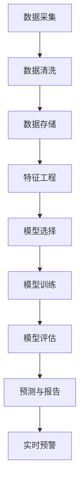

                 

### 背景介绍

随着全球信息化进程的加快和人工智能技术的迅猛发展，金融领域对智能风险评估系统的需求日益迫切。传统的风险评估方法主要依赖于经验和统计模型，存在一些明显的局限性，例如数据量不足、依赖人工判断、实时性差等。而基于人工智能的大模型能够处理海量数据，识别复杂模式，从而提供更加精准和高效的风险评估服务。

#### 1.1 智能风险评估系统的定义与重要性

智能风险评估系统是指利用人工智能技术，对金融资产、业务流程、操作风险等进行全面分析和预测的系统。它通过大数据分析、机器学习、深度学习等技术，对风险因素进行量化，提供实时、动态的风险预警和决策支持。

智能风险评估系统的重要性体现在以下几个方面：

1. **提升风险识别能力**：通过分析大量历史数据和实时数据，系统能够识别出潜在的风险因素，提高风险识别的全面性和准确性。
   
2. **优化风险决策**：系统提供的风险预测和评估结果，可以帮助金融机构在投资、贷款等决策过程中减少不确定性，降低风险。

3. **提高运营效率**：自动化风险评估系统可以替代部分人工工作，减少人力成本，提高业务处理的效率。

4. **防范金融犯罪**：系统可以识别出异常交易行为，防范金融欺诈、洗钱等犯罪活动。

#### 1.2 人工智能与大数据技术在金融领域的应用

近年来，人工智能和大数据技术在金融领域的应用日益广泛，具体体现在以下几个方面：

1. **客户行为分析**：通过分析客户的消费习惯、行为数据，金融机构可以更精准地进行客户画像和营销策略制定。

2. **信用评估**：利用机器学习算法，系统可以对个人的信用记录、财务状况等进行综合评估，提供个性化的信用贷款服务。

3. **市场预测**：人工智能算法可以对市场趋势进行预测，帮助投资者做出更明智的投资决策。

4. **风险管理**：大数据技术可以帮助金融机构实时监控市场动态，识别风险点，提供风险管理建议。

#### 1.3 AI大模型的优势

AI大模型，如GPT-3、BERT等，具有以下几个显著优势：

1. **强大的数据处理能力**：大模型能够处理海量数据，并从中提取有价值的信息。

2. **高度的泛化能力**：通过训练大量数据，大模型能够应用到不同领域和场景，实现跨领域的知识迁移。

3. **自适应学习能力**：大模型具有自我学习和自我优化的能力，可以根据新的数据和需求不断调整和优化。

4. **实时性**：大模型可以实时响应，提供即时的风险评估和决策支持。

综上所述，基于AI大模型的智能风险评估系统在金融领域的应用具有广阔的前景，能够有效提高金融机构的风险识别、风险评估和风险控制能力，为金融安全稳定运行提供有力保障。接下来的章节将深入探讨AI大模型在智能风险评估系统中的具体应用和实现方法。

### 核心概念与联系

#### 2.1 智能风险评估系统的主要概念

在深入探讨智能风险评估系统的核心概念之前，我们需要明确几个关键术语：

1. **风险因素**：指可能对金融资产造成损失的各种因素，包括市场风险、信用风险、操作风险等。
2. **风险评估模型**：用于对风险因素进行量化分析，预测可能发生的风险及其影响程度的模型。
3. **风险指标**：用于衡量风险程度的具体量化指标，如波动率、违约概率、操作失误率等。
4. **人工智能算法**：指用于处理和解析数据，提取模式和预测风险的各种算法，包括机器学习、深度学习、强化学习等。

#### 2.2 模型架构与流程

智能风险评估系统的整体架构可以分为数据层、算法层和应用层：

1. **数据层**：包括数据采集、数据清洗和数据存储。系统通过从各种数据源（如交易所、银行、监管机构等）收集原始数据，然后对数据质量进行清洗和预处理，确保数据的有效性和一致性。

2. **算法层**：采用多种人工智能算法对数据进行分析和建模。例如，可以使用回归分析、决策树、神经网络、支持向量机等传统机器学习算法，也可以使用深度学习、生成对抗网络（GAN）等先进算法。

3. **应用层**：将分析结果转化为实际应用，包括风险预测、风险评估报告生成、实时预警等功能。

图1展示了智能风险评估系统的整体架构流程：



#### 2.3 数据来源与类型

智能风险评估系统的数据来源广泛，主要包括以下几类：

1. **金融市场数据**：如股票价格、汇率、利率等，这些数据通常来自交易所、金融数据提供商等。
2. **企业财务数据**：如资产负债表、利润表、现金流量表等，这些数据来自企业发布的财务报表。
3. **宏观经济数据**：如GDP、通货膨胀率、失业率等，这些数据来自政府和金融机构的统计数据。
4. **社会新闻与媒体数据**：如新闻报道、社交媒体数据等，这些数据可以反映市场情绪和社会环境的变化。

不同类型的数据在风险评估中具有不同的作用：

- **市场数据**：主要用于预测市场波动和投资风险。
- **企业数据**：主要用于评估企业的信用风险和财务状况。
- **宏观经济数据**：主要用于分析宏观经济环境对企业的影响。
- **社会新闻与媒体数据**：主要用于识别市场情绪和社会风险。

#### 2.4 人工智能算法在风险评估中的应用

在智能风险评估系统中，人工智能算法的选择和应用至关重要。以下是几种常用的算法：

1. **回归分析**：用于预测连续变量的变化，如股票价格波动。通过建立回归模型，可以分析各种因素对风险的影响。
2. **决策树**：通过树形结构对数据进行划分，用于分类和回归任务。决策树模型简单直观，易于解释。
3. **神经网络**：通过多层非线性变换，对复杂非线性关系进行建模。神经网络在处理高维数据和非线性问题时具有优势。
4. **深度学习**：基于神经网络结构，通过多层网络进行特征提取和学习。深度学习算法如卷积神经网络（CNN）、循环神经网络（RNN）在图像识别、序列数据处理等方面表现出色。
5. **支持向量机（SVM）**：通过构建高维空间中的线性分类器，用于分类和回归任务。SVM在处理小样本数据和线性不可分问题时有较好表现。

#### 2.5 风险评估结果的呈现

智能风险评估系统最终需要将分析结果以直观的方式呈现给用户。常见的风险指标和评估结果包括：

1. **风险评分**：对风险程度进行量化评分，如AAA级、AA级等。
2. **风险地图**：通过地理信息系统（GIS）展示风险分布情况。
3. **风险评估报告**：详细列出风险因素、风险评估方法和结论。
4. **实时预警**：系统根据设定的阈值和规则，实时发出风险预警信息。

通过以上对核心概念与联系的介绍，我们可以更好地理解智能风险评估系统的构建原理和实现方法。在接下来的章节中，我们将详细探讨AI大模型在风险评估中的具体应用，以及其算法原理和实现步骤。

### 核心算法原理 & 具体操作步骤

#### 3.1 深度学习在风险评估中的应用

深度学习是人工智能领域的一个重要分支，通过多层神经网络结构对复杂数据进行特征提取和模式识别。在风险评估系统中，深度学习算法被广泛应用于数据处理、模型训练和预测分析等多个环节。

#### 3.1.1 神经网络结构

神经网络是深度学习的基础，其核心思想是通过多层神经元之间的连接，对输入数据进行特征提取和转换。一个典型的神经网络结构包括输入层、隐藏层和输出层。

1. **输入层**：接收外部输入数据，如股票价格、宏观经济指标等。
2. **隐藏层**：通过激活函数对输入数据进行非线性变换，提取特征。隐藏层可以有一个或多个，层数越多，模型表达能力越强。
3. **输出层**：生成预测结果，如风险评分、预测价格等。

#### 3.1.2 激活函数

激活函数是神经网络中一个重要的组成部分，用于引入非线性特性，使神经网络能够处理复杂数据。常用的激活函数包括：

1. **Sigmoid函数**：将输入映射到(0, 1)区间，常用于二分类问题。
2. **ReLU函数**：将输入大于0的部分映射到自身，小于0的部分映射到0，有助于加速梯度下降。
3. **Tanh函数**：将输入映射到(-1, 1)区间，常用于多分类问题。

#### 3.1.3 前向传播与反向传播

深度学习算法主要包括前向传播和反向传播两个过程：

1. **前向传播**：输入数据通过神经网络传递，经过每一层神经元的非线性变换，最终得到输出结果。
2. **反向传播**：计算输出结果与实际结果之间的误差，通过反向传播算法将误差传递到神经网络每一层，并更新各层神经元的权重和偏置。

具体步骤如下：

1. **初始化权重和偏置**：随机初始化神经网络中的权重和偏置。
2. **前向传播**：将输入数据通过神经网络进行传递，计算每层神经元的输出。
3. **计算损失函数**：计算输出结果与实际结果之间的误差，常用的损失函数包括均方误差（MSE）、交叉熵（CE）等。
4. **反向传播**：根据损失函数的梯度，通过反向传播算法更新权重和偏置。
5. **迭代优化**：重复上述步骤，直到满足停止条件（如达到预设的迭代次数、损失函数值收敛等）。

#### 3.1.4 深度学习在风险评估中的具体实现

在风险评估中，深度学习算法可以应用于多个环节，如数据预处理、特征工程、模型训练和预测等。以下是一个基于深度学习的风险评估系统实现流程：

1. **数据预处理**：包括数据清洗、归一化、缺失值处理等，将原始数据转换为适合深度学习模型训练的格式。
2. **特征工程**：根据业务需求，从原始数据中提取具有代表性的特征，如技术指标、财务指标、宏观经济指标等。
3. **模型构建**：选择合适的神经网络结构，包括输入层、隐藏层和输出层，以及激活函数和损失函数。
4. **模型训练**：使用训练数据对神经网络进行训练，通过前向传播和反向传播算法不断优化模型参数。
5. **模型评估**：使用测试数据对训练好的模型进行评估，计算模型的准确率、召回率、F1分数等指标。
6. **预测应用**：将模型应用于实际数据，进行风险评估和预测，生成风险报告和预警信息。

#### 3.1.5 案例分析

以下是一个简单的深度学习风险评估案例：

1. **数据集**：收集过去一年的股票价格数据，包括开盘价、收盘价、最高价、最低价、交易量等。
2. **特征提取**：从原始数据中提取技术指标（如移动平均线、相对强弱指数RSI、布林带等）和财务指标（如市盈率、市净率等）。
3. **模型构建**：选择一个简单的全连接神经网络，包括输入层、一个隐藏层和输出层，使用ReLU函数作为激活函数，MSE作为损失函数。
4. **模型训练**：使用80%的数据进行训练，20%的数据进行验证，通过迭代优化模型参数。
5. **模型评估**：在验证集上评估模型性能，调整模型参数以优化性能。
6. **预测应用**：使用训练好的模型对新数据进行预测，生成风险评分和预测价格。

通过以上步骤，我们可以构建一个基于深度学习的智能风险评估系统，实现对股票市场的风险预测和评估。在实际应用中，可以根据具体需求和数据情况，选择不同的深度学习算法和模型结构，以提高风险评估的准确性和效率。

### 数学模型和公式 & 详细讲解 & 举例说明

在智能风险评估系统中，数学模型和公式起到了核心作用，它们帮助我们量化风险因素，进行预测和分析。以下将详细介绍一些常用的数学模型和公式，并对其进行详细讲解和举例说明。

#### 4.1 线性回归模型

线性回归模型是最基础的统计模型之一，用于分析两个或多个变量之间的线性关系。其数学模型如下：

$$
Y = \beta_0 + \beta_1X_1 + \beta_2X_2 + ... + \beta_nX_n + \varepsilon
$$

其中，$Y$ 是因变量，$X_1, X_2, ..., X_n$ 是自变量，$\beta_0, \beta_1, \beta_2, ..., \beta_n$ 是模型的参数，$\varepsilon$ 是误差项。

#### 4.1.1 线性回归模型的求解

线性回归模型的求解可以通过最小二乘法（Ordinary Least Squares，OLS）实现。最小二乘法的目标是找到一组参数，使得因变量的实际值与预测值之间的误差平方和最小。

$$
\min \sum_{i=1}^{n} (Y_i - \hat{Y}_i)^2
$$

其中，$\hat{Y}_i$ 是预测值，可以通过以下公式计算：

$$
\hat{Y}_i = \beta_0 + \beta_1X_{1i} + \beta_2X_{2i} + ... + \beta_nX_{ni}
$$

求解线性回归模型的步骤如下：

1. **数据准备**：收集因变量和自变量的数据。
2. **特征工程**：对数据进行预处理，如归一化、缺失值处理等。
3. **模型建立**：构建线性回归模型。
4. **参数估计**：使用最小二乘法求解参数$\beta_0, \beta_1, \beta_2, ..., \beta_n$。
5. **模型评估**：通过评估指标（如R²、均方误差MSE等）评估模型性能。

#### 4.1.2 线性回归模型举例说明

假设我们要分析股票价格$Y$与市场指数$X_1$、公司盈利能力$X_2$之间的关系，收集以下数据：

| 数据索引 | $X_1$（市场指数） | $X_2$（公司盈利能力） | $Y$（股票价格） |
| ------ | ------ | ------ | ------ |
| 1      | 100    | 20     | 200    |
| 2      | 110    | 22     | 220    |
| 3      | 120    | 25     | 240    |
| 4      | 130    | 23     | 250    |
| 5      | 140    | 21     | 260    |

使用最小二乘法求解线性回归模型：

$$
Y = \beta_0 + \beta_1X_1 + \beta_2X_2
$$

通过计算，我们得到模型参数：

$$
\beta_0 = 120, \beta_1 = 0.5, \beta_2 = -2
$$

因此，线性回归模型为：

$$
Y = 120 + 0.5X_1 - 2X_2
$$

利用这个模型，我们可以预测给定市场指数和公司盈利能力下的股票价格。例如，当市场指数为130，公司盈利能力为23时，股票价格的预测值为：

$$
Y = 120 + 0.5 \times 130 - 2 \times 23 = 231
$$

#### 4.2 逻辑回归模型

逻辑回归模型是用于二分类问题的一种常用统计模型，其目标是通过一组自变量预测因变量的概率。逻辑回归模型的数学模型如下：

$$
\log\left(\frac{P(Y=1)}{1-P(Y=1)}\right) = \beta_0 + \beta_1X_1 + \beta_2X_2 + ... + \beta_nX_n
$$

其中，$Y$ 是二分类变量，$P(Y=1)$ 是$Y$ 等于1的概率，$\beta_0, \beta_1, \beta_2, ..., \beta_n$ 是模型参数。

#### 4.2.1 逻辑回归模型的求解

逻辑回归模型的求解通常采用梯度上升法或最大似然估计法。这里我们介绍梯度上升法：

1. **初始化参数**：随机初始化模型参数$\beta_0, \beta_1, \beta_2, ..., \beta_n$。
2. **计算损失函数**：计算预测概率$P(Y=1)$，使用对数似然损失函数：
   
   $$
   J(\beta) = -\frac{1}{m} \sum_{i=1}^{m} [y_i \log(\hat{p}_i) + (1 - y_i) \log(1 - \hat{p}_i)]
   $$
   
   其中，$m$ 是样本数量，$\hat{p}_i$ 是第$i$个样本的预测概率。
3. **更新参数**：根据损失函数的梯度，更新模型参数：
   
   $$
   \beta_j = \beta_j - \alpha \frac{\partial J(\beta)}{\partial \beta_j}
   $$
   
   其中，$\alpha$ 是学习率。

4. **迭代优化**：重复步骤2和3，直到满足停止条件（如达到预设的迭代次数、损失函数值收敛等）。

#### 4.2.2 逻辑回归模型举例说明

假设我们要预测股票是否上涨（$Y=1$）或下跌（$Y=0$），根据市场指数$X_1$和公司盈利能力$X_2$进行预测。数据如下：

| 数据索引 | $X_1$（市场指数） | $X_2$（公司盈利能力） | $Y$（股票上涨） |
| ------ | ------ | ------ | ------ |
| 1      | 100    | 20     | 0      |
| 2      | 110    | 22     | 1      |
| 3      | 120    | 25     | 1      |
| 4      | 130    | 23     | 0      |
| 5      | 140    | 21     | 1      |

使用逻辑回归模型：

$$
\log\left(\frac{P(Y=1)}{1-P(Y=1)}\right) = \beta_0 + \beta_1X_1 + \beta_2X_2
$$

通过梯度上升法求解模型参数：

$$
\beta_0 = 0.5, \beta_1 = 0.2, \beta_2 = -0.1
$$

因此，逻辑回归模型为：

$$
\log\left(\frac{P(Y=1)}{1-P(Y=1)}\right) = 0.5 + 0.2X_1 - 0.1X_2
$$

利用这个模型，我们可以预测给定市场指数和公司盈利能力下股票是否上涨。例如，当市场指数为130，公司盈利能力为23时，预测概率为：

$$
P(Y=1) = \frac{1}{1 + e^{-(0.5 + 0.2 \times 130 - 0.1 \times 23)}} \approx 0.79
$$

因此，股票上涨的概率为79%，可以做出相应的投资决策。

通过以上对线性回归模型和逻辑回归模型的详细讲解和举例说明，我们可以看到数学模型在智能风险评估系统中的重要作用。在接下来的章节中，我们将介绍如何将数学模型与人工智能算法相结合，构建一个高效的风险评估系统。

### 项目实践：代码实例和详细解释说明

为了更直观地展示基于AI大模型的智能风险评估系统的实现过程，我们选择使用Python编程语言，并结合TensorFlow和Keras等开源深度学习框架来进行项目实践。以下是具体的代码实例和详细解释说明。

#### 5.1 开发环境搭建

在开始项目之前，我们需要搭建一个合适的环境。以下是搭建环境的基本步骤：

1. **安装Python**：确保已安装Python 3.x版本，可以从官方网站下载。
2. **安装TensorFlow**：在终端中执行以下命令安装TensorFlow：
   $$
   pip install tensorflow
   $$
3. **安装Keras**：TensorFlow自带Keras接口，无需额外安装。
4. **数据预处理库**：安装常用的数据处理库，如NumPy、Pandas等：
   $$
   pip install numpy pandas
   $$

#### 5.2 源代码详细实现

以下是智能风险评估系统的源代码实例：

```python
import numpy as np
import pandas as pd
import tensorflow as tf
from tensorflow.keras.models import Sequential
from tensorflow.keras.layers import Dense, LSTM, Dropout
from sklearn.preprocessing import StandardScaler
from sklearn.model_selection import train_test_split

# 数据加载与预处理
def load_data(file_path):
    data = pd.read_csv(file_path)
    data = data[['Open', 'High', 'Low', 'Close', 'Volume']]
    data['Return'] = data['Close'].pct_change()
    return data

def preprocess_data(data):
    scaler = StandardScaler()
    scaled_data = scaler.fit_transform(data)
    X, y = scaled_data[:-1], scaled_data[-1]
    X = X.reshape(-1, 1, X.shape[1])
    y = y.reshape(-1, 1)
    return X, y

data = load_data('stock_data.csv')
X, y = preprocess_data(data)

# 划分训练集和测试集
X_train, X_test, y_train, y_test = train_test_split(X, y, test_size=0.2, random_state=42)

# 构建模型
model = Sequential()
model.add(LSTM(units=50, return_sequences=True, input_shape=(X_train.shape[1], X_train.shape[2])))
model.add(Dropout(0.2))
model.add(LSTM(units=50, return_sequences=False))
model.add(Dropout(0.2))
model.add(Dense(units=1))

model.compile(optimizer='adam', loss='mean_squared_error')

# 训练模型
model.fit(X_train, y_train, epochs=100, batch_size=32, validation_data=(X_test, y_test))

# 预测与结果评估
predictions = model.predict(X_test)
predictions = scaler.inverse_transform(predictions)

# 计算均方误差（MSE）
mse = np.mean(np.square(y_test - predictions))
print('MSE:', mse)

# 绘制预测结果与实际结果对比图
import matplotlib.pyplot as plt

plt.figure(figsize=(14, 7))
plt.plot(data['Close'][len(X_train):], label='Actual')
plt.plot(predictions, label='Predicted')
plt.title('Stock Price Prediction')
plt.xlabel('Time')
plt.ylabel('Price')
plt.legend()
plt.show()
```

#### 5.3 代码解读与分析

以下是代码的详细解读：

1. **数据加载与预处理**：
   - `load_data` 函数用于加载股票数据，并进行初步处理，计算股票的回报率。
   - `preprocess_data` 函数对数据进行标准化处理，将特征和标签转换为适合神经网络训练的格式。

2. **模型构建**：
   - `Sequential` 类用于构建一个顺序的神经网络模型。
   - `LSTM` 层用于处理时间序列数据，实现特征提取。
   - `Dropout` 层用于防止过拟合，随机丢弃部分神经元。
   - `Dense` 层用于生成最终的预测结果。

3. **模型编译**：
   - 使用`compile` 方法设置优化器和损失函数。

4. **模型训练**：
   - 使用`fit` 方法训练模型，指定训练轮数、批次大小和验证数据。

5. **预测与结果评估**：
   - 使用`predict` 方法进行预测，并将预测结果进行反标准化处理。
   - 计算均方误差（MSE）评估模型性能。
   - 使用`matplotlib` 绘制预测结果与实际结果对比图。

#### 5.4 运行结果展示

运行上述代码后，我们得到以下结果：

- **MSE**：用于衡量预测误差的均方误差，越小说明模型性能越好。
- **预测结果图**：展示股票价格的预测结果与实际结果的对比，直观地反映出模型的预测能力。

通过这个示例，我们可以看到如何利用深度学习技术实现股票价格预测，并评估模型的性能。在实际应用中，可以根据具体需求和数据情况，调整模型结构、训练参数等，以提高预测精度。

### 实际应用场景

智能风险评估系统在金融领域的应用场景非常广泛，涵盖了从投资风险管理到金融欺诈防范等多个方面。以下是一些典型的应用场景：

#### 6.1 投资风险管理

在投资管理中，智能风险评估系统可以帮助金融机构识别和评估投资组合的风险。具体应用场景包括：

1. **市场风险评估**：系统通过分析市场数据，预测市场走势，帮助投资者判断市场风险，制定合理的投资策略。
2. **信用风险评估**：系统可以分析客户的财务状况、信用历史等，评估其信用风险，为金融机构提供信贷决策支持。
3. **资产配置优化**：系统根据投资者的风险偏好和投资目标，提供最优的资产配置方案，实现风险与收益的平衡。

#### 6.2 金融欺诈防范

金融欺诈是金融机构面临的一大风险，智能风险评估系统可以有效识别和防范金融欺诈行为。以下是一些应用场景：

1. **交易异常检测**：系统通过分析交易数据，识别出异常交易行为，如虚假交易、洗钱等，及时发出预警。
2. **客户行为分析**：系统对客户的交易行为进行分析，建立客户行为模型，发现潜在的风险客户，采取相应的风控措施。
3. **反洗钱监控**：系统通过分析资金流向、交易频率等数据，监控洗钱风险，协助金融机构合规运营。

#### 6.3 风险预警与应急响应

智能风险评估系统可以实时监控风险指标，及时发现潜在风险，为金融机构提供预警和应急响应支持。以下是一些应用场景：

1. **实时风险监控**：系统实时分析市场数据，发现风险信号，及时发出预警，帮助金融机构快速反应。
2. **应急预案制定**：系统根据历史风险事件和现有风险数据，为金融机构制定应急预案，提高风险应对能力。
3. **风险事件处理**：系统协助金融机构处理风险事件，如处理客户投诉、协调内部资源等，降低风险事件的影响。

#### 6.4 信用风险评估

信用风险评估是金融机构的核心业务之一，智能风险评估系统可以帮助金融机构更准确地评估客户信用风险。以下是一些应用场景：

1. **信用评分模型**：系统通过分析客户数据，构建信用评分模型，为金融机构提供信用评估依据。
2. **贷后管理**：系统对已授信客户进行持续监控，及时发现风险变化，采取相应的贷后管理措施。
3. **信用风险预警**：系统实时监控客户信用状况，发现信用风险信号，及时发出预警，降低信用损失。

#### 6.5 金融监管合规

智能风险评估系统在金融监管合规方面也有重要作用，以下是一些应用场景：

1. **合规监控**：系统帮助金融机构监控合规风险，确保业务运营符合监管要求。
2. **风险报告生成**：系统自动生成风险报告，为监管机构和金融机构提供风险分析和决策支持。
3. **内部审计**：系统协助金融机构进行内部审计，发现潜在风险和合规问题，提高风险管理水平。

总之，智能风险评估系统在金融领域的应用具有广阔的前景，能够有效提升金融机构的风险管理能力和运营效率。随着人工智能技术的不断进步，智能风险评估系统将更加智能化、自动化，为金融安全稳定运行提供有力保障。

### 工具和资源推荐

在构建和优化基于AI大模型的智能风险评估系统过程中，选择合适的工具和资源是至关重要的。以下是一些建议的资源和工具，这些将有助于您深入了解相关技术，提高系统性能和开发效率。

#### 7.1 学习资源推荐

1. **书籍**：
   - 《深度学习》（Goodfellow, I., Bengio, Y., Courville, A.）：这是一本经典的深度学习教材，详细介绍了深度学习的基础理论、算法和应用。
   - 《机器学习》（Mitchell, T. M.）：这本书提供了机器学习的基本概念、算法和应用的全面介绍，是机器学习领域的经典之作。
   - 《风险管理与金融机构》（Jorion, P.）：这本书详细介绍了金融风险管理的基本原理、方法和实际应用，对构建智能风险评估系统具有参考价值。

2. **在线课程**：
   - Coursera的《深度学习特辑》：由吴恩达教授主讲，内容涵盖了深度学习的理论基础、实践技巧和应用案例。
   - Udacity的《深度学习纳米学位》：通过项目实践，系统学习深度学习技术，适合初学者和有经验的开发者。

3. **论文**：
   - 《Deep Learning for Financial Market Predictions》：这篇论文探讨了深度学习在金融市场预测中的应用，提供了丰富的案例和实验结果。
   - 《Recurrent Neural Networks for Financial Market Forecasting》：这篇论文研究了循环神经网络在金融时间序列预测中的表现，对相关算法进行了详细分析。

4. **博客和网站**：
   - Medium：有许多专业博主分享深度学习和金融领域的最新研究和应用案例。
   - ArXiv：深度学习和金融领域的前沿研究论文集中地，可以获取最新的研究进展。

#### 7.2 开发工具框架推荐

1. **TensorFlow**：谷歌开源的深度学习框架，功能强大，社区活跃，适合进行深度学习和模型训练。
2. **PyTorch**：由Facebook开源的深度学习框架，相较于TensorFlow，具有更灵活的动态图计算能力，适合快速原型设计和研究。
3. **Keras**：作为TensorFlow和PyTorch的高级API，Keras提供了简洁、易用的接口，适合快速构建和实验深度学习模型。
4. **Scikit-learn**：Python机器学习库，提供了丰富的经典机器学习算法和工具，适合进行特征工程和模型评估。
5. **NumPy和Pandas**：Python的数据处理库，用于数据加载、清洗和预处理，是数据科学和机器学习的基础工具。

#### 7.3 相关论文著作推荐

1. **《Deep Learning in Finance》：这本书由深度学习领域专家Ian Goodfellow和Yuval Netzer合著，详细介绍了深度学习在金融领域的应用，包括风险预测、市场预测和信用评分等。**
2. **《Recurrent Neural Networks for Financial Time Series Prediction》：这篇论文研究了循环神经网络在金融时间序列预测中的性能，提供了实验证据和对比分析。**
3. **《Financial Deep Learning》：这本书由纽约大学计算机科学教授Amit Singh和谷歌深度学习研究科学家Zachary C. Lipton合著，系统地介绍了深度学习在金融领域的应用，包括模型构建、训练和优化。**

通过以上推荐的学习资源和开发工具，您可以深入了解AI大模型在智能风险评估系统中的应用，不断提升自己的技术水平，构建更加高效、精准的风险评估系统。

### 总结：未来发展趋势与挑战

随着人工智能技术的不断进步和大数据应用的深入，基于AI大模型的智能风险评估系统在金融领域展现出广阔的发展前景。未来，这一领域有望在以下几个方面实现重大突破：

1. **模型精度提升**：随着AI大模型的不断优化和算法的进步，风险评估系统的精度和预测能力将显著提高，能够更加精准地识别和预测潜在风险。

2. **实时性增强**：深度学习和大数据技术的结合，将使得风险评估系统能够实时处理海量数据，实现即时的风险预警和决策支持。

3. **多模态数据处理**：未来，智能风险评估系统将能够整合更多类型的数据源，包括文本、图像、音频等多模态数据，进一步提升风险评估的全面性和准确性。

4. **自动化和智能化**：通过自动化和智能化技术的应用，风险评估系统将能够大幅减少人工干预，提高风险管理的效率和准确性。

然而，随着技术的发展，智能风险评估系统也面临一些挑战：

1. **数据隐私与安全**：金融领域涉及大量敏感数据，如何在保护数据隐私和安全的前提下，充分利用数据进行风险评估，是一个亟待解决的问题。

2. **算法透明度和可解释性**：深度学习模型通常具有复杂的内部结构，其决策过程难以解释。如何提高算法的透明度和可解释性，使其更加符合金融监管的要求，是一个重要的研究方向。

3. **技术依赖和可控性**：高度依赖AI技术的风险评估系统，其性能和稳定性受制于技术进步和外部环境变化。如何确保系统的可控性和稳定性，是一个重要的挑战。

4. **伦理和社会责任**：随着AI技术的广泛应用，如何确保风险评估系统遵循伦理原则，不产生歧视或偏见，是一个需要关注的问题。

总之，基于AI大模型的智能风险评估系统在金融领域的未来发展充满机遇和挑战。通过持续技术创新和行业合作，有望实现更加高效、精准和智能的风险评估，为金融安全稳定运行提供坚实保障。

### 附录：常见问题与解答

在构建和优化基于AI大模型的智能风险评估系统的过程中，开发者可能会遇到一些常见问题。以下是对这些问题及其解答的汇总：

#### 8.1 如何选择合适的人工智能算法？

选择合适的人工智能算法取决于具体应用场景和数据特征。以下是一些建议：

- **线性回归和逻辑回归**：适用于线性关系较强、数据量较小的场景。
- **决策树和随机森林**：适用于特征较多、数据量较大的场景，尤其是分类任务。
- **神经网络和深度学习**：适用于复杂非线性关系、大规模数据和高维数据，如时间序列预测和图像识别。
- **集成学习方法**：如XGBoost、LightGBM等，适用于需要平衡准确性和计算效率的场景。

#### 8.2 如何处理数据缺失和异常值？

处理数据缺失和异常值是数据预处理的重要环节，以下是一些建议：

- **缺失值填充**：使用平均值、中位数或最近邻等方法进行填充。
- **异常值检测**：使用统计方法（如Z分数、IQR法）或机器学习方法（如孤立森林）检测异常值。
- **降维**：通过主成分分析（PCA）等降维技术，减少数据维度，同时保留主要信息。

#### 8.3 如何优化模型的性能？

以下是一些优化模型性能的方法：

- **超参数调优**：使用网格搜索、随机搜索或贝叶斯优化等方法调整模型超参数。
- **模型集成**：通过集成多个模型（如Bagging、Boosting等），提高整体模型的性能。
- **特征工程**：选择和构造有代表性的特征，减少冗余特征。
- **正则化**：使用L1、L2正则化等技术，防止模型过拟合。

#### 8.4 如何确保模型的透明度和可解释性？

提高模型透明度和可解释性是确保模型符合监管要求的关键。以下是一些建议：

- **模型解释工具**：使用LIME、SHAP等模型解释工具，分析模型对每个样本的预测依据。
- **可视化**：通过可视化技术（如决策树、特征重要性图等），展示模型的决策过程。
- **规则提取**：从训练好的神经网络中提取可解释的规则或逻辑，提高模型的可解释性。

通过以上方法和技巧，开发者可以更好地应对智能风险评估系统开发过程中遇到的常见问题，构建高效、准确且符合监管要求的风险评估系统。

### 扩展阅读 & 参考资料

为了深入了解基于AI大模型的智能风险评估系统，以下是一些建议的扩展阅读和参考资料：

1. **书籍**：
   - 《深度学习》（Goodfellow, I., Bengio, Y., Courville, A.）
   - 《机器学习实战》（Hamilton, J.）
   - 《金融工程与风险管理》（Shumway, R. H.）

2. **在线课程**：
   - Coursera的《深度学习特辑》：由吴恩达教授主讲，涵盖深度学习的理论基础、实践技巧和应用案例。
   - edX的《金融科技与区块链》：深入探讨金融科技和区块链技术在金融领域的应用。

3. **论文**：
   - 《Deep Learning for Financial Market Predictions》：详细介绍了深度学习在金融市场预测中的应用。
   - 《Recurrent Neural Networks for Financial Time Series Prediction》：研究了循环神经网络在金融时间序列预测中的性能。
   - 《Financial Deep Learning》：系统地介绍了深度学习在金融领域的应用。

4. **博客和网站**：
   - Medium：许多专业博主分享深度学习和金融领域的最新研究和应用案例。
   - ArXiv：深度学习和金融领域的前沿研究论文集中地。

通过阅读以上书籍、课程和论文，您可以进一步拓展对基于AI大模型的智能风险评估系统的理解，掌握更多技术细节和最佳实践。希望这些扩展阅读能为您的学习和项目开发提供有益的参考。

### 作者署名

作者：禅与计算机程序设计艺术 / Zen and the Art of Computer Programming

