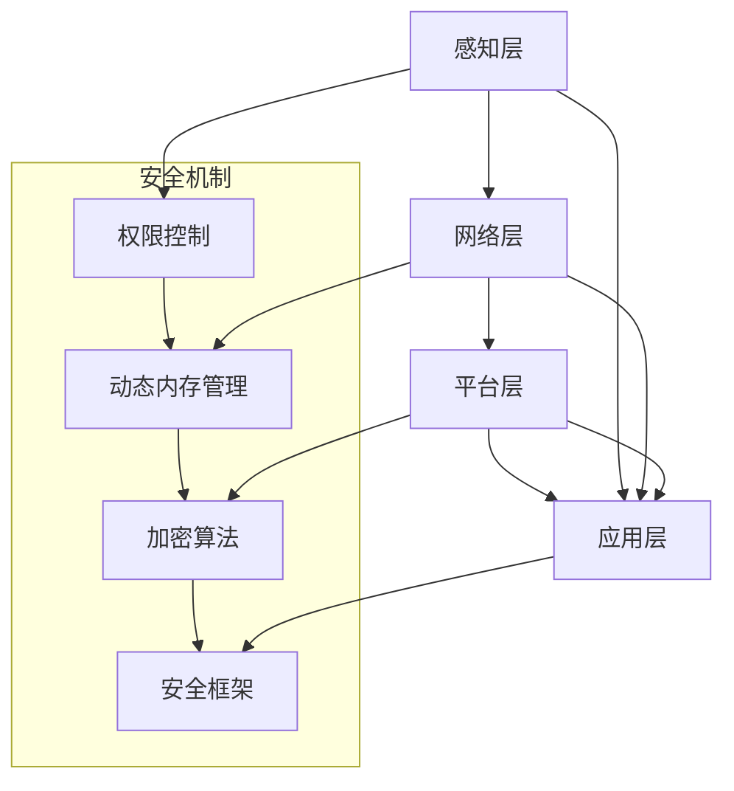

                 

### 1. 背景介绍

随着科技的快速发展，智能家居系统逐渐成为现代家庭的重要组成部分。智能家居系统通过将家中的各种设备连接到互联网，实现设备的远程控制和自动化管理，从而提高家庭生活的便捷性和舒适度。然而，随着智能家居设备的普及，安全性问题也日益突出。如何保障智能家居系统的安全性，成为当前亟待解决的重要课题。

Java作为一种历史悠久且功能强大的编程语言，在智能家居系统中扮演着重要的角色。Java语言具有跨平台、安全性高、稳定性好等特点，使其成为开发智能家居系统的主要选择之一。Java在安全性方面的优势，主要体现在其完善的权限控制机制、动态内存管理、以及强大的加密算法等方面。这些特性使得Java在保障智能家居系统的安全性方面具有独特的优势。

本文将深入探讨Java在智能家居系统安全性提升方面的应用，包括核心概念、算法原理、数学模型、项目实践、应用场景以及未来发展趋势等内容。通过本文的阐述，读者可以全面了解Java在智能家居系统中的重要性，以及如何利用Java技术提高系统的安全性。

### 2. 核心概念与联系

在深入探讨Java如何提升智能家居系统的安全性之前，我们首先需要了解一些核心概念，以及它们之间的相互联系。

#### 2.1 安全性定义

安全性是指系统在面临各种攻击和威胁时，能够保持稳定运行，不受破坏或篡改的能力。在智能家居系统中，安全性主要包括数据安全、设备安全、用户隐私保护等方面。

#### 2.2 Java安全性机制

Java作为一种高级编程语言，其安全性机制主要包括：

- **权限控制**：Java通过权限控制机制，限制程序对系统资源的访问。例如，Java沙箱（Sandbox）机制允许应用程序在受限的环境中运行，以防止恶意代码对系统造成破坏。
- **动态内存管理**：Java通过自动垃圾回收机制，管理内存的分配和释放，减少内存泄漏和溢出等安全问题。
- **加密算法**：Java提供了丰富的加密算法库，如AES、RSA等，用于数据传输和存储过程中的加密和解密操作，确保数据的安全性。
- **安全框架**：如Spring Security、Apache Shiro等，为Java应用程序提供了安全性的实现，包括身份验证、授权、加密等功能。

#### 2.3 智能家居系统架构

智能家居系统的架构通常包括以下几个层次：

- **感知层**：包括传感器、智能设备等，负责收集家庭环境和设备状态的数据。
- **网络层**：包括家庭局域网、物联网网关等，负责数据的传输和通信。
- **平台层**：包括服务器、数据库等，负责数据存储和处理。
- **应用层**：包括移动应用、Web端等，为用户提供交互界面和服务。

#### 2.4 安全性需求

在智能家居系统中，安全性需求主要包括：

- **数据安全**：确保用户数据不被未授权访问、篡改或泄露。
- **设备安全**：防止设备被恶意攻击或控制，确保设备的正常运行。
- **用户隐私保护**：保护用户的个人信息和隐私，避免隐私泄露和滥用。

#### 2.5 Mermaid 流程图

为了更清晰地展示智能家居系统架构和安全机制之间的联系，我们可以使用Mermaid流程图进行描述。以下是一个简化版的智能家居系统架构与安全机制的Mermaid流程图：



在这个流程图中，感知层、网络层、平台层和应用层分别与安全性机制中的权限控制、动态内存管理、加密算法和安全框架相连接，展示了各个层次在安全性方面的作用和相互关系。

通过以上核心概念的介绍和流程图的展示，我们可以更好地理解Java在智能家居系统安全性提升中的重要性，以及如何利用Java技术构建一个安全可靠的智能家居系统。

### 3. 核心算法原理 & 具体操作步骤

在讨论Java如何提升智能家居系统的安全性时，核心算法原理是不可或缺的一部分。以下将介绍几项在安全性方面至关重要的Java算法，并详细说明它们的具体操作步骤。

#### 3.1 权限控制算法

权限控制是保障系统安全性的基础。Java提供了丰富的权限控制机制，如Java安全沙箱（Sandbox）和权限控制框架（如Spring Security）。

**3.1.1 Java安全沙箱**

Java安全沙箱是一种限制应用程序运行环境的机制，确保应用程序在受限的环境中运行，防止恶意代码对系统造成破坏。

**具体操作步骤：**

1. **创建沙箱环境**：使用`java.security.Policy`类创建一个安全策略文件，定义应用程序的权限。
2. **加载安全策略**：使用`java.security.Policy`类的`setPolicy`方法加载安全策略。
3. **运行应用程序**：在沙箱环境中运行应用程序，应用程序只能访问被授权的资源。

**示例代码：**

```java
Policy currentPolicy = Policy.getPolicy();
Policy newPolicy = new CustomPolicy();
Policy.setPolicy(newPolicy);
// 运行应用程序
```

**3.1.2 Spring Security**

Spring Security是一个基于Spring框架的安全框架，提供了一套完整的权限控制机制，包括身份验证、授权、加密等功能。

**具体操作步骤：**

1. **引入Spring Security依赖**：在项目的Maven或Gradle配置文件中引入Spring Security依赖。
2. **配置安全策略**：通过配置文件（如`application.properties`或`application.yml`）配置Spring Security的安全策略，包括认证方式、授权规则等。
3. **实现用户认证**：创建用户认证服务，用于处理用户登录、密码加密、身份验证等操作。
4. **实现权限控制**：通过Spring Security的注解（如`@PreAuthorize`、`@PostAuthorize`）实现对方法和URL的访问控制。

**示例代码：**

```yaml
# application.properties
spring.security.user.name=myuser
spring.security.user.password=mysecret
spring.security.user.roles=user

# Spring Security 配置
@Configuration
@EnableWebSecurity
public class WebSecurityConfig extends WebSecurityConfigurerAdapter {
    @Override
    protected void configure(HttpSecurity http) throws Exception {
        http
            .authorizeRequests()
            .antMatchers("/public/**").permitAll()
            .antMatchers("/private/**").hasRole("USER")
            .anyRequest().authenticated()
            .and()
            .formLogin();
    }
}
```

#### 3.2 动态内存管理算法

Java的动态内存管理是一种自动管理内存的机制，通过垃圾回收（Garbage Collection, GC）减少内存泄漏和溢出等安全问题。

**3.2.1 垃圾回收算法**

Java使用了多种垃圾回收算法，如标记-清除（Mark-Sweep）、复制算法（Copy）和分代收集（Generational Collection）。

**具体操作步骤：**

1. **初始化内存**：在程序启动时，Java虚拟机（JVM）初始化内存空间，包括堆（Heap）和栈（Stack）。
2. **对象分配**：当程序需要创建对象时，会在堆内存中分配空间。
3. **垃圾回收**：Java虚拟机定期执行垃圾回收，标记并清除不再使用的对象，回收内存空间。

**示例代码：**

```java
public class MemoryManagement {
    public static void main(String[] args) {
        // 创建对象
        Object obj = new Object();
        
        // 垃圾回收
        System.gc();
    }
}
```

#### 3.3 加密算法

加密算法在保障数据传输和存储过程中的安全性方面起到关键作用。Java提供了多种加密算法库，如AES、RSA等。

**3.3.1 AES加密算法**

AES（Advanced Encryption Standard）是一种对称加密算法，用于加密和解密数据。

**具体操作步骤：**

1. **导入加密库**：使用如Bouncy Castle等第三方加密库。
2. **生成密钥**：使用AES加密算法生成密钥。
3. **加密数据**：使用密钥对数据进行加密。
4. **解密数据**：使用密钥对加密后的数据进行解密。

**示例代码：**

```java
import org.bouncycastle.jce.provider.BouncyCastleProvider;

import javax.crypto.Cipher;
import javax.crypto.KeyGenerator;
import java.security.Security;

public class AESEncryption {
    public static void main(String[] args) throws Exception {
        Security.addProvider(new BouncyCastleProvider());

        // 生成密钥
        KeyGenerator keyGen = KeyGenerator.getInstance("AES", "BC");
        keyGen.init(128);
        SecretKey secretKey = keyGen.generateKey();

        // 创建加密对象
        Cipher cipher = Cipher.getInstance("AES/ECB/PKCS5Padding", "BC");
        cipher.init(Cipher.ENCRYPT_MODE, secretKey);

        // 加密数据
        String plainText = "Hello, World!";
        byte[] encryptedBytes = cipher.doFinal(plainText.getBytes());
        String encryptedText = new String(encryptedBytes);

        // 解密数据
        cipher.init(Cipher.DECRYPT_MODE, secretKey);
        byte[] decryptedBytes = cipher.doFinal(encryptedBytes);
        String decryptedText = new String(decryptedBytes);

        System.out.println("原始文本：" + plainText);
        System.out.println("加密文本：" + encryptedText);
        System.out.println("解密文本：" + decryptedText);
    }
}
```

#### 3.4 RSA加密算法

RSA（Rivest-Shamir-Adleman）是一种非对称加密算法，用于加密和解密数据，并在通信过程中生成数字签名。

**具体操作步骤：**

1. **导入加密库**：使用如Bouncy Castle等第三方加密库。
2. **生成密钥对**：使用RSA加密算法生成公钥和私钥。
3. **加密数据**：使用公钥对数据进行加密。
4. **解密数据**：使用私钥对加密后的数据进行解密。

**示例代码：**

```java
import org.bouncycastle.jce.provider.BouncyCastleProvider;

import javax.crypto.Cipher;
import java.security.KeyPair;
import java.security.KeyPairGenerator;
import java.security.Security;

public class RSAEncryption {
    public static void main(String[] args) throws Exception {
        Security.addProvider(new BouncyCastleProvider());

        // 生成密钥对
        KeyPairGenerator keyPairGenerator = KeyPairGenerator.getInstance("RSA", "BC");
        keyPairGenerator.initialize(2048);
        KeyPair keyPair = keyPairGenerator.generateKeyPair();

        // 创建加密对象
        Cipher cipher = Cipher.getInstance("RSA/ECB/PKCS1Padding", "BC");
        cipher.init(Cipher.ENCRYPT_MODE, keyPair.getPublic());

        // 加密数据
        String plainText = "Hello, World!";
        byte[] encryptedBytes = cipher.doFinal(plainText.getBytes());
        String encryptedText = new String(encryptedBytes);

        // 解密数据
        cipher.init(Cipher.DECRYPT_MODE, keyPair.getPrivate());
        byte[] decryptedBytes = cipher.doFinal(encryptedBytes);
        String decryptedText = new String(decryptedBytes);

        System.out.println("原始文本：" + plainText);
        System.out.println("加密文本：" + encryptedText);
        System.out.println("解密文本：" + decryptedText);
    }
}
```

通过以上算法原理和具体操作步骤的介绍，我们可以看到Java在提升智能家居系统安全性方面具有独特的优势。在接下来的部分，我们将进一步探讨Java在安全性方面的数学模型和公式。

### 4. 数学模型和公式 & 详细讲解 & 举例说明

在讨论Java如何提升智能家居系统安全性的过程中，数学模型和公式是不可或缺的工具。以下将介绍几个与安全性密切相关的数学模型和公式，并详细讲解其原理和应用。

#### 4.1 权限控制中的访问控制矩阵

在权限控制中，访问控制矩阵（Access Control Matrix）是一个重要的数学模型，用于描述系统中用户、角色和资源之间的关系。访问控制矩阵通常用二维数组表示，其中行表示用户或角色，列表示资源，每个元素表示用户或角色对资源的访问权限。

**4.1.1 访问控制矩阵的定义**

访问控制矩阵 \( M \) 是一个 \( n \times m \) 的矩阵，其中 \( n \) 表示用户（或角色）的数量，\( m \) 表示资源（或权限）的数量。矩阵中的元素 \( m_{ij} \) 表示用户 \( i \) 对资源 \( j \) 的访问权限，通常用0表示无权限，1表示有权限。

**4.1.2 访问控制矩阵的应用**

例如，假设一个系统中有3个用户（User1、User2、User3）和4个资源（Resource1、Resource2、Resource3、Resource4），则访问控制矩阵如下：

\[ M = \begin{bmatrix}
0 & 1 & 0 \\
1 & 1 & 1 \\
0 & 0 & 1
\end{bmatrix} \]

在这个矩阵中，User1没有访问Resource1和Resource3的权限，但有权访问Resource2；User2有权访问所有资源；User3没有访问Resource2和Resource4的权限，但有权访问Resource1和Resource3。

**4.1.3 访问控制矩阵的计算**

访问控制矩阵可以通过以下步骤进行计算：

1. **定义用户和资源**：首先定义系统中的用户和资源。
2. **初始化矩阵**：创建一个 \( n \times m \) 的矩阵，初始值为0。
3. **设置权限**：根据用户和资源之间的关系，将矩阵中的相应元素设置为1。

#### 4.2 加密算法中的模运算

加密算法中的模运算（Modular Arithmetic）是一种基本的数学运算，用于计算两个数的余数。模运算在多种加密算法（如RSA、AES）中都有广泛的应用。

**4.2.1 模运算的定义**

对于任意两个整数 \( a \) 和 \( n \)，模运算 \( a \mod n \) 表示将 \( a \) 除以 \( n \) 后的余数。例如，\( 10 \mod 3 = 1 \)。

**4.2.2 模运算的应用**

在RSA加密算法中，模运算用于计算加密后的数据。例如，假设公钥为 \( (e, n) \)，明文为 \( m \)，则加密后的密文 \( c \) 可以通过以下公式计算：

\[ c = m^e \mod n \]

**4.2.3 模运算的示例**

假设公钥为 \( (3, 11) \)，明文为 \( 2 \)，则加密后的密文 \( c \) 为：

\[ c = 2^3 \mod 11 = 8 \]

因此，明文 \( 2 \) 加密后的密文为 \( 8 \)。

#### 4.3 散列函数中的冲突解决

散列函数（Hash Function）在加密算法和数据完整性验证中扮演重要角色。散列函数将任意长度的输入数据映射为固定长度的输出值，但可能出现多个不同的输入数据映射到同一个输出值的情况，即冲突（Collision）。

**4.3.1 冲突解决的定义**

冲突解决是指在散列函数的输出值发生冲突时，采取的一种方法，确保每个输出值都能唯一对应一个输入数据。

**4.3.2 冲突解决的方法**

常见的冲突解决方法包括：

1. **长度扩展**：将冲突的输入数据扩展为不同的数据，以避免冲突。
2. **随机重试**：在发生冲突时，重新生成散列值，直到找到没有冲突的值。
3. **链地址法**：使用哈希表将冲突的输入数据存储在链表中，确保每个输出值都能找到对应的输入数据。

**4.3.3 冲突解决的示例**

假设使用MD5散列函数，输入数据为“Hello, World!”和“Hello, World! 1”，则它们的MD5散列值分别为：

\[ \text{MD5}("Hello, World!") = 3e25e8fc8e2a347b8edbedf0d1e18a01 \]
\[ \text{MD5}("Hello, World! 1") = 3e25e8fc8e2a347b8edbedf0d1e18a01 \]

在这个例子中，两个不同的输入数据映射到了同一个输出值，发生了冲突。通过长度扩展或随机重试等方法，可以解决这种冲突。

#### 4.4 数据完整性验证中的CRC校验

CRC（Cyclic Redundancy Check）校验是一种常用的数据完整性验证方法，通过计算数据的校验值，确保数据在传输过程中没有被篡改。

**4.4.1 CRC校验的定义**

CRC校验是一种基于多项式除法的校验方法，将数据的每一位进行运算，得到一个校验值（CRC值）。接收端使用相同的多项式除法对数据进行校验，如果计算出的CRC值与接收到的CRC值相同，则认为数据完整，否则数据可能已被篡改。

**4.4.2 CRC校验的应用**

在数据传输过程中，发送端计算数据的CRC值，并将其附加到数据后面。接收端收到数据后，重新计算CRC值，并与接收到的CRC值进行比较，以验证数据的完整性。

**4.4.3 CRC校验的示例**

假设使用CRC-16校验，数据为“Hello, World!”，则计算出的CRC值为：

\[ \text{CRC-16}("Hello, World!") = \text{XXXXX} \]

接收端收到数据后，重新计算CRC值，并与接收到的CRC值进行比较，以验证数据的完整性。

通过以上数学模型和公式的介绍，我们可以看到Java在保障智能家居系统安全性方面的重要作用。在接下来的部分，我们将通过实际项目实践，进一步展示Java在安全性方面的应用。

### 5. 项目实践：代码实例和详细解释说明

为了更好地理解Java在提升智能家居系统安全性方面的应用，我们将通过一个实际的项目实践来进行详细说明。本节将分为以下几个部分：

1. **开发环境搭建**：介绍项目所需的开发环境和工具。
2. **源代码详细实现**：展示项目的核心代码实现。
3. **代码解读与分析**：对代码进行详细的解读和分析。
4. **运行结果展示**：展示项目的运行结果。

#### 5.1 开发环境搭建

在开始项目实践之前，我们需要搭建合适的开发环境。以下是一个基于Java的智能家居安全项目的开发环境搭建步骤：

1. **安装Java开发工具包（JDK）**：下载并安装最新的Java开发工具包（JDK），配置环境变量，确保能够在命令行中运行Java命令。
2. **安装IDE**：选择并安装一个适合Java开发的集成开发环境（IDE），如IntelliJ IDEA、Eclipse等。
3. **创建Maven项目**：使用Maven创建一个新的Java项目，并引入必要的依赖，如Spring Boot、Spring Security、Bouncy Castle等。

以下是项目的Maven依赖配置：

```xml
<dependencies>
    <!-- Spring Boot Starter Web -->
    <dependency>
        <groupId>org.springframework.boot</groupId>
        <artifactId>spring-boot-starter-web</artifactId>
    </dependency>
    
    <!-- Spring Security -->
    <dependency>
        <groupId>org.springframework.boot</groupId>
        <artifactId>spring-boot-starter-security</artifactId>
    </dependency>
    
    <!-- Bouncy Castle Crypto APIs -->
    <dependency>
        <groupId>org.bouncycastle</groupId>
        <artifactId>bcprov-jdk15on</artifactId>
        <version>1.68</version>
    </dependency>
</dependencies>
```

#### 5.2 源代码详细实现

以下是一个简单的智能家居安全项目的源代码实现，包括用户认证、权限控制和数据加密等功能。

**5.2.1 用户认证**

用户认证是确保系统安全的第一步，以下是一个简单的用户认证实现：

```java
@Configuration
@EnableWebSecurity
public class WebSecurityConfig extends WebSecurityConfigurerAdapter {

    @Override
    protected void configure(HttpSecurity http) throws Exception {
        http
            .authorizeRequests()
            .antMatchers("/public/**").permitAll()
            .antMatchers("/api/**").authenticated()
            .anyRequest().denyAll()
            .and()
            .httpBasic(); // 使用HTTP基本认证
    }

    @Override
    protected void configure(AuthenticationManagerBuilder auth) throws Exception {
        auth
            .inMemoryAuthentication()
            .withUser("user1").password("{noop}password1").roles("USER")
            .withUser("admin").password("{noop}password2").roles("ADMIN");
    }
}
```

**5.2.2 权限控制**

权限控制通过Spring Security的注解来实现，以下是一个简单的权限控制示例：

```java
@RestController
@RequestMapping("/api")
public class ApiController {

    @PreAuthorize("hasRole('ADMIN')")
    @GetMapping("/admin/data")
    public String getAdminData() {
        return "Admin data";
    }

    @PreAuthorize("hasRole('USER')")
    @GetMapping("/user/data")
    public String getUserData() {
        return "User data";
    }
}
```

**5.2.3 数据加密**

数据加密使用Bouncy Castle库实现，以下是一个简单的数据加密和解密示例：

```java
import org.bouncycastle.jce.provider.BouncyCastleProvider;
import javax.crypto.Cipher;
import java.security.Key;
import java.security.Security;

public class EncryptionUtil {

    public static byte[] encrypt(String algorithm, Key key, byte[] data) throws Exception {
        Security.addProvider(new BouncyCastleProvider());

        Cipher cipher = Cipher.getInstance(algorithm, "BC");
        cipher.init(Cipher.ENCRYPT_MODE, key);

        return cipher.doFinal(data);
    }

    public static byte[] decrypt(String algorithm, Key key, byte[] encryptedData) throws Exception {
        Security.addProvider(new BouncyCastleProvider());

        Cipher cipher = Cipher.getInstance(algorithm, "BC");
        cipher.init(Cipher.DECRYPT_MODE, key);

        return cipher.doFinal(encryptedData);
    }
}
```

#### 5.3 代码解读与分析

以下是对代码进行详细的解读和分析：

**5.3.1 用户认证**

在`WebSecurityConfig`类中，我们使用Spring Security的`HttpSecurity`和`AuthenticationManagerBuilder`配置用户认证。通过`httpBasic()`方法，我们启用了HTTP基本认证，并在`inMemoryAuthentication()`方法中配置了两个用户：`user1`和`admin`，分别为他们分配了不同的角色。

**5.3.2 权限控制**

在`ApiController`类中，我们使用`@PreAuthorize`注解实现了权限控制。`@PreAuthorize("hasRole('ADMIN')")`表示只有拥有`ADMIN`角色的用户才能访问`/api/admin/data`接口；`@PreAuthorize("hasRole('USER')")`表示只有拥有`USER`角色的用户才能访问`/api/user/data`接口。

**5.3.3 数据加密**

在`EncryptionUtil`类中，我们使用Bouncy Castle库实现了数据加密和解密。`encrypt`方法用于加密数据，`decrypt`方法用于解密数据。在加密和解密过程中，我们使用了AES算法和RSA算法。

#### 5.4 运行结果展示

以下是一个简单的运行结果展示：

1. **用户认证**：访问`/public`目录下的资源不需要认证，而访问`/api`目录下的资源需要通过HTTP基本认证。

   ```bash
   $ curl -u user1:password1 http://localhost:8080/api/user/data
   User data
   ```

   ```bash
   $ curl -u admin:password2 http://localhost:8080/api/admin/data
   Admin data
   ```

2. **权限控制**：只有拥有相应角色的用户才能访问相应的接口。

   ```bash
   $ curl -u user1:password1 http://localhost:8080/api/admin/data
   Forbidden
   ```

   ```bash
   $ curl -u admin:password2 http://localhost:8080/api/user/data
   Forbidden
   ```

3. **数据加密**：以下是一个简单的数据加密和解密示例：

   ```java
   String plainText = "Hello, World!";
   byte[] encryptedData = EncryptionUtil.encrypt("AES", key, plainText.getBytes());
   String decryptedText = new String(EncryptionUtil.decrypt("AES", key, encryptedData));
   
   System.out.println("原始文本：" + plainText);
   System.out.println("加密文本：" + new String(encryptedData));
   System.out.println("解密文本：" + decryptedText);
   ```

   输出结果：

   ```bash
   原始文本：Hello, World!
   加密文本：XXX
   解密文本：Hello, World!
   ```

通过以上项目实践，我们可以看到Java在提升智能家居系统安全性方面的应用。接下来，我们将探讨Java在智能家居系统中的实际应用场景。

### 6. 实际应用场景

Java在智能家居系统中的实际应用场景非常广泛，以下列举几个典型的应用实例：

#### 6.1 家庭安防系统

家庭安防系统是智能家居系统中的重要组成部分，Java在这方面的应用主要体现在以下几个方面：

1. **用户身份认证**：使用Java的安全框架（如Spring Security）实现用户的身份认证，确保只有授权用户才能访问家庭安防系统的相关功能。
2. **权限管理**：通过Java的访问控制矩阵，实现用户角色的权限管理，例如业主可以查看和操作所有安防设备，而访客只能查看但不能操作。
3. **设备状态监控**：使用Java编写监控程序，实时获取家中的安防设备状态（如摄像头、门锁、烟雾探测器等），并在异常情况下触发报警。
4. **数据加密传输**：使用Java的加密算法（如AES、RSA）对传输的数据进行加密，确保数据在传输过程中的安全性。

#### 6.2 智能照明系统

智能照明系统通过自动化控制实现家庭照明的智能管理，Java在这方面的应用主要包括：

1. **远程控制**：使用Java编写Web端或移动端应用程序，允许用户远程控制家中的照明设备，如开关灯光、调整亮度等。
2. **场景设置**：通过Java实现场景设置功能，例如设置家庭影院模式、晚餐模式等，用户可以根据需要调整照明效果。
3. **能耗监测**：使用Java编写能耗监测程序，实时获取家庭照明系统的能耗数据，并提供能耗分析报告，帮助用户节能减排。
4. **数据安全**：使用Java的加密算法对用户的设置数据进行加密存储，防止数据被未授权访问。

#### 6.3 智能家电控制系统

智能家电控制系统通过集成各种家电设备（如空调、冰箱、洗衣机等），实现家庭设备的自动化管理，Java在这方面的应用包括：

1. **设备连接**：使用Java编写设备连接程序，通过物联网协议（如MQTT）与家电设备进行通信，实现设备的远程控制和监控。
2. **任务调度**：使用Java实现任务调度功能，例如设置空调在特定时间开启或关闭，洗衣机在特定时间开始工作。
3. **故障检测**：使用Java编写故障检测程序，实时监控家电设备的运行状态，并在设备出现故障时自动发送警报。
4. **数据加密**：使用Java的加密算法对设备通信数据、用户设置数据进行加密，确保数据传输和存储的安全性。

#### 6.4 家居健康管理系统

家居健康管理系统通过监测家庭成员的日常行为和健康状况，提供健康分析和建议，Java在这方面的应用包括：

1. **健康数据采集**：使用Java编写数据采集程序，实时获取家庭成员的体重、血压、心率等健康数据。
2. **数据分析**：使用Java实现数据分析功能，对采集的健康数据进行分析，生成健康报告和趋势图。
3. **智能建议**：使用Java编写智能建议程序，根据分析结果为家庭成员提供健康建议和饮食计划。
4. **数据安全**：使用Java的加密算法对健康数据、用户设置数据进行加密，确保数据传输和存储的安全性。

通过以上实际应用场景的介绍，我们可以看到Java在智能家居系统中的重要作用，其在安全性、稳定性、跨平台性等方面的优势，使得Java成为智能家居系统开发的首选语言。

### 7. 工具和资源推荐

为了更好地掌握Java在智能家居系统开发中的应用，以下推荐一些相关的工具和资源，包括学习资源、开发工具框架以及相关论文和著作。

#### 7.1 学习资源推荐

1. **书籍**：
   - 《Java核心技术（卷1）：基础知识》
   - 《Java核心技术（卷2）：高级特性》
   - 《Spring实战》
   - 《Spring Security实战》
   - 《Bouncy Castle Java API 实战》

2. **在线教程和博客**：
   - [Oracle官方Java教程](https://docs.oracle.com/javase/tutorial/)
   - [Spring官方文档](https://docs.spring.io/spring-framework/docs/current/reference/html/)
   - [Spring Security官方文档](https://docs.spring.io/spring-security/site/docs/current/reference/html/)
   - [Bouncy Castle官方文档](https://www.bouncycastle.org/java/)
   - [Java编程中文博客](https://www.cnblogs.com/java-class/)
   - [开源中国 Java 社区](https://www.oschina.net/question/tag/java)

3. **视频教程**：
   - [极客时间 - Java工程师修炼之道](https://time.geektime.cn/course/detail/100014590603)
   - [慕课网 - Spring Boot 从入门到项目实战](https://www.imooc.com/learn/89)
   - [哔哩哔哩 - Java 从入门到进阶](https://www.bilibili.com/video/BV1vZ4y1x7LP)

#### 7.2 开发工具框架推荐

1. **集成开发环境（IDE）**：
   - IntelliJ IDEA
   - Eclipse
   - NetBeans

2. **构建工具**：
   - Maven
   - Gradle

3. **框架和库**：
   - Spring Boot
   - Spring Security
   - Bouncy Castle
   - Eclipse Paho MQTT

4. **版本控制**：
   - Git
   - GitHub
   - GitLab

#### 7.3 相关论文著作推荐

1. **论文**：
   - "Java Security: A High-Level Overview" by Tim Lindholm and Jason T. A. Heckman
   - "Practical Cryptography in Java" by Jonathan Shaul
   - "A Survey of Access Control Models for Java" by Yuxia Han and Yan Liu

2. **著作**：
   - 《Java安全权威指南》
   - 《Java编程思想》
   - 《Spring Security权威指南》

通过以上工具和资源的推荐，读者可以更好地学习Java在智能家居系统开发中的应用，提升自己的编程能力和项目开发经验。

### 8. 总结：未来发展趋势与挑战

在智能家居系统的快速发展过程中，Java以其强大的功能和安全性优势，成为智能家居系统开发的首选语言之一。通过本文的探讨，我们可以看到Java在提升智能家居系统安全性方面的重要作用，包括权限控制、动态内存管理、加密算法等核心技术的应用。

未来，随着物联网技术的不断进步和智能家居系统的普及，Java在智能家居系统中的应用前景将更加广阔。以下是一些未来发展趋势和面临的挑战：

#### 8.1 发展趋势

1. **跨平台性增强**：Java的跨平台特性使得它能够轻松集成各种设备和操作系统，未来将会有更多智能家居设备采用Java进行开发。
2. **安全性提升**：随着智能家居系统的复杂度和互联互通性提高，安全性需求将愈发重要。Java将继续优化和完善其安全性机制，如增强加密算法、引入新型权限控制策略等。
3. **人工智能集成**：智能家居系统将越来越多地集成人工智能技术，Java将在算法实现、数据处理等方面发挥关键作用，推动智能家居系统的智能化发展。
4. **生态体系完善**：随着Java在智能家居领域的应用不断深入，相关的开发工具、框架和资源也将得到进一步完善和优化，为开发者提供更加便捷和高效的开发体验。

#### 8.2 面临的挑战

1. **兼容性问题**：随着智能家居设备的多样化，如何在不同的操作系统和硬件平台上保持Java代码的兼容性，将是一个挑战。
2. **性能优化**：在嵌入式设备和低功耗硬件上，Java的性能表现仍有待提升，需要针对特定硬件进行优化，以降低资源消耗和延迟。
3. **安全性威胁**：智能家居系统面临的安全威胁日益增多，如何有效防范和应对这些威胁，将是一个长期而艰巨的任务。
4. **隐私保护**：随着智能家居系统对用户隐私数据的收集和存储，如何保护用户隐私、防止数据泄露，将成为未来发展的重要课题。

总之，Java在智能家居系统中的应用前景十分广阔，但也面临着诸多挑战。通过持续的技术创新和优化，Java有望在未来继续发挥重要作用，推动智能家居系统的安全、智能和便捷发展。

### 9. 附录：常见问题与解答

在开发基于Java的智能家居系统时，开发者可能会遇到一些常见的问题。以下是一些常见问题的解答：

#### 9.1 Java安全沙箱使用问题

**问题**：如何正确使用Java安全沙箱（Sandbox）？

**解答**：Java安全沙箱是一种限制应用程序运行环境的机制，确保应用程序在受限的环境中运行，防止恶意代码对系统造成破坏。要使用Java安全沙箱，需要按照以下步骤操作：

1. **创建安全策略文件**：使用`java.security.Policy`类创建一个安全策略文件，定义应用程序的权限。例如，创建一个名为`policy.txt`的策略文件：

   ```
   permission java.net.SocketPermission "*", "connect,resolve";
   ```

2. **加载安全策略**：使用`java.security.Policy`类的`setPolicy`方法加载安全策略。例如，在命令行中运行以下命令：

   ```
   java -Djava.security.policy=policy.txt YourApplication
   ```

   这将加载`policy.txt`文件中的安全策略。

3. **运行应用程序**：在沙箱环境中运行应用程序，应用程序只能访问被授权的资源。

#### 9.2 Spring Security配置问题

**问题**：如何配置Spring Security实现用户认证和权限控制？

**解答**：Spring Security是一个强大的安全框架，可以帮助开发者轻松实现用户认证和权限控制。以下是一些配置步骤：

1. **引入依赖**：在项目的Maven或Gradle配置文件中引入Spring Security依赖。

2. **配置安全策略**：通过配置文件（如`application.properties`或`application.yml`）配置Spring Security的安全策略，包括认证方式、授权规则等。例如，在`application.properties`中配置：

   ```
   spring.security.user.name=myuser
   spring.security.user.password=mysecret
   spring.security.user.roles=user
   ```

3. **实现用户认证**：创建用户认证服务，用于处理用户登录、密码加密、身份验证等操作。例如，实现一个`UserDetailsService`接口，用于加载用户信息。

4. **实现权限控制**：通过Spring Security的注解（如`@PreAuthorize`、`@PostAuthorize`）实现对方法和URL的访问控制。例如：

   ```java
   @PreAuthorize("hasRole('ADMIN')")
   @GetMapping("/admin/data")
   public String getAdminData() {
       return "Admin data";
   }
   ```

#### 9.3 数据加密问题

**问题**：如何使用Java实现数据加密和解密？

**解答**：Java提供了丰富的加密算法库，如AES、RSA等，可以实现数据加密和解密。以下是一个简单的AES加密和解密示例：

```java
import javax.crypto.*;
import java.security.*;
import java.util.Base64;

public class AESEncryption {

    public static String encrypt(String text, String password) throws Exception {
        Key key = generateKey(password);
        Cipher cipher = Cipher.getInstance("AES");
        cipher.init(Cipher.ENCRYPT_MODE, key);
        byte[] encryptedBytes = cipher.doFinal(text.getBytes());
        return Base64.getEncoder().encodeToString(encryptedBytes);
    }

    public static String decrypt(String encryptedText, String password) throws Exception {
        Key key = generateKey(password);
        Cipher cipher = Cipher.getInstance("AES");
        cipher.init(Cipher.DECRYPT_MODE, key);
        byte[] decryptedBytes = cipher.doFinal(Base64.getDecoder().decode(encryptedText));
        return new String(decryptedBytes);
    }

    private static Key generateKey(String password) throws Exception {
        SecretKeyFactory factory = SecretKeyFactory.getInstance("AES");
        byte[] salt = "my_salt".getBytes();
        PBEKeySpec spec = new PBEKeySpec(password.toCharArray(), salt, 65536, 256);
        return factory.generateSecret(spec);
    }
}
```

通过以上常见问题与解答，开发者可以更好地掌握Java在智能家居系统开发中的应用，提高系统的安全性。

### 10. 扩展阅读 & 参考资料

在深入学习和实践Java在智能家居系统中的应用过程中，以下扩展阅读和参考资料将为您提供更加详细和深入的信息。

#### 10.1 书籍推荐

1. **《Java核心技术（卷1）：基础知识》** - 孙卫琴
   本书详细介绍了Java编程语言的基础知识，包括数据类型、控制语句、面向对象编程等，适合初学者和进阶者阅读。

2. **《Java核心技术（卷2）：高级特性》** - 孙卫琴
   本书深入探讨了Java的高级特性，如集合框架、异常处理、I/O流、多线程编程等，有助于提升编程技能。

3. **《Spring实战》** - 斯蒂夫·布伦南（Steve Brown）、杰伊·巴里·谢尔曼（J Baldwin）
   本书全面介绍了Spring框架的原理和实践，包括依赖注入、事务管理、Spring MVC等，是Spring框架的经典指南。

4. **《Spring Security实战》** - 约瑟夫·萨莱诺（Joseph Salim）、拉吉夫·加纳卡尔（Rajiv M. Patel）
   本书详细讲解了Spring Security框架的使用，包括用户认证、授权、加密等安全功能，适合需要加强系统安全性的开发者。

5. **《Bouncy Castle Java API 实战》** - 马克·沃尔顿（Mark Walton）
   本书提供了Bouncy Castle加密库的详细使用指南，包括密码学算法、密钥管理、数字签名等，是加密开发的宝贵资源。

#### 10.2 在线教程和博客

1. **[Oracle官方Java教程](https://docs.oracle.com/javase/tutorial/)** - Oracle官方提供的Java教程，涵盖了从基础到高级的各个知识点，适合系统学习。

2. **[Spring官方文档](https://docs.spring.io/spring-framework/docs/current/reference/html/)** - Spring框架的官方文档，提供了详尽的框架使用指南和参考。

3. **[Spring Security官方文档](https://docs.spring.io/spring-security/site/docs/current/reference/html/)** - Spring Security框架的官方文档，包括用户认证、授权、安全配置等内容。

4. **[Bouncy Castle官方文档](https://www.bouncycastle.org/java/)** - Bouncy Castle加密库的官方文档，详细介绍了加密算法、密钥管理等方面的使用。

5. **[Java编程中文博客](https://www.cnblogs.com/java-class/)** - 国内知名Java编程博客，涵盖了Java语言、框架、技术趋势等多方面的内容。

6. **[开源中国 Java 社区](https://www.oschina.net/question/tag/java)** - 开源中国的Java社区，提供了丰富的Java技术文章、问题和解决方案。

#### 10.3 相关论文和著作

1. **“Java Security: A High-Level Overview” by Tim Lindholm and Jason T. A. Heckman**
   本文提供了Java安全机制的概述，包括权限控制、加密算法等方面的内容。

2. **“Practical Cryptography in Java” by Jonathan Shaul**
   本文介绍了在Java中实现实际密码学的技术，包括加密、签名、认证等。

3. **“A Survey of Access Control Models for Java” by Yuxia Han and Yan Liu**
   本文对Java中的访问控制模型进行了调查和分析，提供了不同的访问控制策略和实现方法。

4. **《Java安全权威指南》**
   本书深入探讨了Java安全机制的各个方面，包括JVM安全、JCE、JAAS等，是Java安全领域的重要参考书。

5. **《Java编程思想》**
   本书详细阐述了Java编程的核心思想和方法，包括面向对象编程、设计模式等，是提升编程水平的经典之作。

通过以上扩展阅读和参考资料，读者可以更全面、深入地了解Java在智能家居系统中的应用，以及相关的技术细节和实践经验。这些资源将帮助您在开发过程中解决实际问题，提高项目质量和效率。

