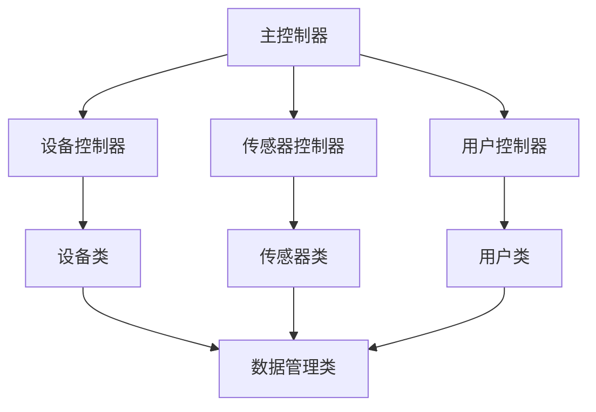

                 

### 文章标题

《基于Java的智能家居设计：理解家居自动化中的MVC设计模式》

> 关键词：智能家居、MVC设计模式、Java、家居自动化、软件架构

> 摘要：本文将深入探讨基于Java的智能家居设计，特别关注MVC（模型-视图-控制器）设计模式在智能家居系统中的应用。我们将从背景介绍开始，逐步分析MVC设计模式的核心概念与联系，并详细讲解其在智能家居设计中的具体实现方法。此外，本文还将通过一个实际项目实践，展示如何利用MVC模式进行智能家居系统的设计与开发。最后，我们将探讨该模式在实际应用场景中的效果，以及未来智能家居设计可能面临的发展趋势与挑战。

---

### 1. 背景介绍

智能家居（Smart Home）是指利用互联网、物联网技术将家居环境中的各种设备连接起来，实现远程控制和自动化管理。随着科技的进步和人们生活水平的提高，智能家居系统逐渐成为现代家庭生活的一部分。从简单的远程照明控制、温度调节，到复杂的家居安全监控、能源管理，智能家居系统正不断向智能化、个性化和高效化方向发展。

然而，智能家居系统的设计和实现并非易事。一个优秀的智能家居系统需要具备良好的扩展性、稳定性、安全性和用户体验。这就要求开发者在设计过程中采用合适的软件架构和设计模式。MVC设计模式是一种广泛应用于软件开发的经典设计模式，尤其在复杂系统的设计中，MVC模式能够有效地提高系统的可维护性、可扩展性和代码复用性。

MVC（Model-View-Controller）模式起源于Smalltalk-80编程语言，并在Java等面向对象编程语言中得到广泛应用。MVC模式将系统分为三个主要组件：模型（Model）、视图（View）和控制器（Controller）。模型负责处理业务逻辑和数据管理；视图负责显示用户界面和数据；控制器则负责处理用户输入，协调模型和视图之间的交互。通过这种分工明确的架构，MVC模式能够有效地降低系统的复杂度，提高代码的可读性和可维护性。

本文将围绕基于Java的智能家居设计，详细介绍MVC设计模式的核心概念与联系，并通过实际项目实践，展示如何利用MVC模式实现一个智能家居系统。希望通过对本文的阅读，读者能够对MVC设计模式在智能家居设计中的应用有一个深入的理解。

### 2. 核心概念与联系

#### 2.1 MVC设计模式的基本原理

MVC设计模式的核心在于将应用程序划分为三个主要组件：模型（Model）、视图（View）和控制器（Controller）。这三个组件各司其职，共同协作实现应用程序的功能。下面分别介绍这三个组件的基本原理和相互关系。

**模型（Model）**

模型是MVC设计模式中的核心组件，负责处理应用程序的业务逻辑和数据管理。模型通常包含一组类和对象，用于封装数据、定义数据操作和业务规则。模型不直接处理用户界面，而是通过接口暴露其功能，供视图和控制器调用。

在智能家居设计中，模型可以包含以下主要类：

- **设备类（Device）**：代表家庭中的各种智能设备，如照明、空调、门锁等。设备类封装了设备的状态、属性和方法。
- **传感器类（Sensor）**：用于检测家庭环境中的各种参数，如温度、湿度、光照强度等。传感器类同样封装了传感器的状态、属性和方法。
- **用户类（User）**：代表智能家居系统的用户，包括用户的基本信息、权限等。
- **数据管理类（DataManager）**：负责处理数据的存储、查询和更新，通常使用数据库或文件系统来存储数据。

**视图（View）**

视图是MVC设计模式中的另一个重要组件，负责展示用户界面和数据。视图通过模型提供的接口获取数据，并根据数据的当前状态更新用户界面。视图通常包含一组界面元素，如按钮、文本框、图像等，用于与用户进行交互。

在智能家居设计中，视图可以包含以下主要类：

- **主界面（MainView）**：展示智能家居系统的总体概览，包括设备列表、传感器数据和用户操作菜单等。
- **设备界面（DeviceView）**：展示特定设备的详细信息，如设备状态、操作按钮等。
- **传感器界面（SensorView）**：展示传感器的当前状态，如温度、湿度等。
- **用户界面（UserView）**：展示用户信息，如用户登录、注册、权限管理等。

**控制器（Controller）**

控制器是MVC设计模式中的协调组件，负责处理用户输入，协调模型和视图之间的交互。控制器通过监听用户输入，调用模型的方法来更新数据，并根据数据的更新情况更新视图。控制器通常包含一组处理用户输入的接口和逻辑，如按钮点击、文本框输入等。

在智能家居设计中，控制器可以包含以下主要类：

- **主控制器（MainController）**：处理主界面的用户输入，如设备切换、操作按钮点击等。
- **设备控制器（DeviceController）**：处理设备界面的用户输入，如设备状态的切换、设置等。
- **传感器控制器（SensorController）**：处理传感器界面的用户输入，如传感器参数的查询、设置等。
- **用户控制器（UserController）**：处理用户界面的用户输入，如用户登录、注册、权限管理等。

#### 2.2 MVC设计模式在智能家居设计中的应用

在智能家居设计中，MVC设计模式能够有效地提高系统的可维护性、可扩展性和用户体验。以下从以下几个方面介绍MVC设计模式在智能家居设计中的应用。

**1. 提高系统可维护性**

MVC设计模式通过明确分工，将系统的业务逻辑、数据管理和用户界面分离。这种分离使得代码更加清晰、易于维护。例如，当需要修改业务逻辑或数据管理时，开发者只需修改模型相关代码，无需担心对视图和控制器造成影响。同样，当需要更新用户界面或添加新的功能时，开发者只需修改视图和控制器相关代码，无需修改模型。

**2. 提高系统可扩展性**

MVC设计模式具有良好的扩展性，使得系统可以轻松地添加新的功能或组件。例如，当需要添加新的智能设备或传感器时，开发者只需在模型中添加相应的设备类或传感器类，并在控制器中添加相应的处理逻辑。这样，无需修改已有的代码，即可实现新功能的添加。

**3. 提高用户体验**

MVC设计模式通过将用户界面和数据管理分离，使得用户界面可以更加独立地设计和优化。开发者可以专注于用户界面的美观和易用性，而不必担心业务逻辑和数据管理的实现细节。此外，MVC设计模式还支持异步操作，如远程数据查询、设备控制等，从而提高系统的响应速度和用户体验。

#### 2.3 Mermaid流程图

为了更直观地展示MVC设计模式在智能家居设计中的应用，我们使用Mermaid流程图来描述模型、视图和控制器之间的交互关系。



在上述流程图中，主控制器（A）负责处理用户输入，并将其转发给相应的设备控制器（B）、传感器控制器（C）和用户控制器（D）。设备控制器（B）、传感器控制器（C）和用户控制器（D）分别与设备类（E）、传感器类（F）和用户类（G）以及数据管理类（H）进行交互。这种交互关系使得系统的各个组件能够紧密协作，共同实现智能家居系统的功能。

通过以上介绍，我们可以看出MVC设计模式在智能家居设计中的应用具有重要的意义。它不仅提高了系统的可维护性和可扩展性，还有助于提升用户体验，使得智能家居系统更加智能化、高效化和人性化。

### 3. 核心算法原理 & 具体操作步骤

在智能家居设计中，MVC设计模式的核心算法原理主要涉及模型（Model）的实现。模型负责处理业务逻辑和数据管理，是整个系统的基础。下面我们将详细讲解模型的核心算法原理，并介绍具体操作步骤。

#### 3.1 模型核心算法原理

模型的核心算法原理主要包括以下几个方面：

1. **数据封装**：模型将业务逻辑和数据封装在相应的类中，使得代码更加清晰、易于维护。例如，设备类（Device）封装了设备的状态、属性和方法；传感器类（Sensor）封装了传感器的状态、属性和方法。

2. **数据管理**：模型负责处理数据的存储、查询和更新。通常使用数据库或文件系统来存储数据，并在模型中提供相应的接口供视图和控制器调用。例如，数据管理类（DataManager）负责处理数据的存储、查询和更新操作。

3. **业务逻辑处理**：模型处理应用程序的业务逻辑，例如设备控制、传感器数据采集和用户管理。模型类中通常会包含一系列方法来处理这些业务逻辑。

4. **事件驱动**：模型支持事件驱动，可以监听并处理来自视图和控制器的事件。例如，当用户在视图界面上进行某个操作时，控制器会触发相应的事件，模型会监听并处理这些事件，更新数据或执行相应的操作。

#### 3.2 具体操作步骤

下面将详细介绍模型的具体操作步骤，包括类的设计、数据存储和业务逻辑处理等方面。

##### 3.2.1 设备类（Device）

设备类是模型中最基本的组件，用于表示家庭中的智能设备。设备类的设计主要包括以下几个方面：

1. **属性**：设备类需要包含设备的各种属性，如设备ID、设备名称、设备状态等。

2. **方法**：设备类需要提供各种方法来处理设备的操作，如启动、关闭、设置参数等。

以下是一个简单的设备类示例：

```java
public class Device {
    private int id;
    private String name;
    private boolean state;

    public Device(int id, String name) {
        this.id = id;
        this.name = name;
        this.state = false;
    }

    // 设备状态设置
    public void setState(boolean state) {
        this.state = state;
    }

    // 获取设备状态
    public boolean getState() {
        return state;
    }

    // 启动设备
    public void start() {
        if (!state) {
            setState(true);
            System.out.println(name + "已启动");
        } else {
            System.out.println(name + "已处于运行状态");
        }
    }

    // 关闭设备
    public void stop() {
        if (state) {
            setState(false);
            System.out.println(name + "已关闭");
        } else {
            System.out.println(name + "已处于关闭状态");
        }
    }
}
```

##### 3.2.2 传感器类（Sensor）

传感器类用于表示家庭环境中的各种传感器，如温度传感器、湿度传感器、光照传感器等。传感器类的设计主要包括以下几个方面：

1. **属性**：传感器类需要包含传感器的各种属性，如传感器ID、传感器名称、传感器类型等。

2. **方法**：传感器类需要提供各种方法来获取传感器的数据，如获取当前温度、湿度等。

以下是一个简单的传感器类示例：

```java
public class Sensor {
    private int id;
    private String name;
    private String type;

    public Sensor(int id, String name, String type) {
        this.id = id;
        this.name = name;
        this.type = type;
    }

    // 获取传感器ID
    public int getId() {
        return id;
    }

    // 获取传感器名称
    public String getName() {
        return name;
    }

    // 获取传感器类型
    public String getType() {
        return type;
    }

    // 获取传感器数据
    public double getData() {
        // 根据传感器类型获取具体数据
        if (type.equals("temperature")) {
            return Math.random() * 40; // 假设温度传感器获取到的数据范围是0-40摄氏度
        } else if (type.equals("humidity")) {
            return Math.random() * 100; // 假设湿度传感器获取到的数据范围是0-100%
        } else {
            return Math.random() * 10; // 假设光照传感器获取到的数据范围是0-10
        }
    }
}
```

##### 3.2.3 数据管理类（DataManager）

数据管理类负责处理数据的存储、查询和更新操作。通常使用数据库或文件系统来存储数据，并在数据管理类中提供相应的接口供其他类调用。以下是一个简单的数据管理类示例：

```java
import java.util.HashMap;
import java.util.Map;

public class DataManager {
    private Map<Integer, Device> devices;
    private Map<Integer, Sensor> sensors;

    public DataManager() {
        devices = new HashMap<>();
        sensors = new HashMap<>();
    }

    // 添加设备
    public void addDevice(int id, Device device) {
        devices.put(id, device);
    }

    // 添加传感器
    public void addSensor(int id, Sensor sensor) {
        sensors.put(id, sensor);
    }

    // 获取设备
    public Device getDevice(int id) {
        return devices.get(id);
    }

    // 获取传感器
    public Sensor getSensor(int id) {
        return sensors.get(id);
    }

    // 更新设备状态
    public void updateDeviceState(int id, boolean state) {
        Device device = getDevice(id);
        if (device != null) {
            device.setState(state);
        }
    }

    // 更新传感器数据
    public void updateSensorData(int id, double data) {
        Sensor sensor = getSensor(id);
        if (sensor != null) {
            // 根据传感器类型处理数据
            if (sensor.getType().equals("temperature")) {
                System.out.println("当前温度：" + data + "摄氏度");
            } else if (sensor.getType().equals("humidity")) {
                System.out.println("当前湿度：" + data + "%");
            } else {
                System.out.println("当前光照强度：" + data);
            }
        }
    }
}
```

##### 3.2.4 业务逻辑处理

业务逻辑处理是模型的核心，负责实现智能家居系统的各种功能。以下是一些常见的业务逻辑处理示例：

1. **设备控制**：通过控制器调用设备类的方法，实现对设备的启动、关闭和设置参数等操作。

2. **传感器数据采集**：通过传感器类获取传感器数据，并调用数据管理类更新传感器数据。

3. **用户管理**：处理用户的登录、注册和权限管理等操作。

4. **事件处理**：监听并处理来自视图和控制器的事件，根据事件类型调用相应的业务逻辑。

以下是一个简单的业务逻辑处理示例：

```java
public class BusinessLogic {
    private DataManager dataManager;

    public BusinessLogic(DataManager dataManager) {
        this.dataManager = dataManager;
    }

    // 设备控制
    public void controlDevice(int id, boolean state) {
        Device device = dataManager.getDevice(id);
        if (device != null) {
            device.setState(state);
            System.out.println("设备" + device.getName() + "已设置为" + (state ? "开启" : "关闭"));
        }
    }

    // 传感器数据采集
    public void collectSensorData(int id) {
        Sensor sensor = dataManager.getSensor(id);
        if (sensor != null) {
            double data = sensor.getData();
            dataManager.updateSensorData(id, data);
        }
    }

    // 用户登录
    public boolean login(String username, String password) {
        // 模拟用户登录
        return username.equals("admin") && password.equals("admin");
    }

    // 用户注册
    public void register(String username, String password) {
        // 模拟用户注册
        System.out.println("用户" + username + "注册成功");
    }
}
```

通过以上示例，我们可以看出模型的核心算法原理和具体操作步骤。模型通过封装业务逻辑和数据管理，实现了智能家居系统的各种功能。接下来，我们将介绍如何利用MVC设计模式实现一个智能家居系统。

### 4. 数学模型和公式 & 详细讲解 & 举例说明

在智能家居系统中，MVC设计模式的数学模型和公式主要用于描述系统中的各种关系和算法。以下将详细讲解一些常用的数学模型和公式，并通过具体示例来说明它们的实际应用。

#### 4.1 数学模型

在MVC设计模式中，常见的数学模型包括线性模型、非线性模型和时间序列模型。这些模型主要用于描述系统的状态、行为和变化。

**1. 线性模型**

线性模型是一种简单的数学模型，它描述了输入和输出之间的线性关系。常用的线性模型有线性回归、线性规划等。

线性回归模型公式如下：

\[ y = ax + b \]

其中，\( y \) 是输出值，\( x \) 是输入值，\( a \) 和 \( b \) 是模型的参数。

**2. 非线性模型**

非线性模型描述了输入和输出之间的非线性关系。常用的非线性模型有指数函数、对数函数、多项式函数等。

指数函数模型公式如下：

\[ y = ae^{bx} \]

其中，\( y \) 是输出值，\( x \) 是输入值，\( a \) 和 \( b \) 是模型的参数。

**3. 时间序列模型**

时间序列模型描述了系统在不同时间点的状态和行为。常用的时间序列模型有ARIMA模型、LSTM模型等。

ARIMA模型公式如下：

\[ y_t = \phi_1 y_{t-1} + \phi_2 y_{t-2} + ... + \phi_p y_{t-p} + \theta_1 e_{t-1} + \theta_2 e_{t-2} + ... + \theta_q e_{t-q} \]

其中，\( y_t \) 是第 \( t \) 个时间点的输出值，\( e_t \) 是第 \( t \) 个时间点的误差项，\( \phi_1, \phi_2, ..., \phi_p \) 和 \( \theta_1, \theta_2, ..., \theta_q \) 是模型的参数。

#### 4.2 公式详细讲解

**1. 线性回归模型**

线性回归模型是一种常见的预测模型，用于预测因变量 \( y \) 与自变量 \( x \) 之间的关系。通过最小二乘法（Least Squares Method）来确定模型的参数 \( a \) 和 \( b \)，使得预测值 \( y \) 与实际值 \( y \) 之间的误差最小。

最小二乘法的目标是最小化损失函数：

\[ J(a, b) = \sum_{i=1}^{n} (y_i - (ax_i + b))^2 \]

其中，\( n \) 是样本数量，\( y_i \) 是第 \( i \) 个样本的因变量值，\( x_i \) 是第 \( i \) 个样本的自变量值。

通过对损失函数求导并令导数为0，可以求得参数 \( a \) 和 \( b \) 的最优解：

\[ \frac{\partial J}{\partial a} = -2 \sum_{i=1}^{n} (y_i - (ax_i + b))x_i = 0 \]
\[ \frac{\partial J}{\partial b} = -2 \sum_{i=1}^{n} (y_i - (ax_i + b)) = 0 \]

解得：

\[ a = \frac{\sum_{i=1}^{n} x_i y_i - n \bar{x} \bar{y}}{\sum_{i=1}^{n} x_i^2 - n \bar{x}^2} \]
\[ b = \bar{y} - a \bar{x} \]

其中，\( \bar{x} \) 和 \( \bar{y} \) 分别是自变量和因变量的均值。

**2. 指数函数模型**

指数函数模型常用于描述增长或衰减现象，如人口增长、细菌繁殖等。指数函数的模型公式为：

\[ y = ae^{bx} \]

其中，\( a \) 是初始值，\( b \) 是增长或衰减速率。

为了确定模型参数 \( a \) 和 \( b \)，需要至少两个数据点。假设有两个数据点 \( (x_1, y_1) \) 和 \( (x_2, y_2) \)，可以通过以下步骤求解参数：

1. 取对数，将指数函数转化为线性模型：

\[ \ln y = \ln a + bx \]

2. 应用线性回归模型求解参数 \( \ln a \) 和 \( b \)：

\[ \ln a = \frac{\sum_{i=1}^{n} y_i - n \bar{y} \ln x}{\sum_{i=1}^{n} x_i - n \bar{x}} \]
\[ b = \frac{\sum_{i=1}^{n} x_i y_i - n \bar{x} \bar{y}}{\sum_{i=1}^{n} x_i^2 - n \bar{x}^2} \]

3. 将参数 \( \ln a \) 和 \( b \) 代入指数函数模型，得到：

\[ a = e^{\ln a} \]

**3. ARIMA模型**

ARIMA模型是一种常见的时间序列预测模型，它结合了自回归（AR）、差分（I）和移动平均（MA）三个部分。ARIMA模型的公式为：

\[ y_t = \phi_1 y_{t-1} + \phi_2 y_{t-2} + ... + \phi_p y_{t-p} + \theta_1 e_{t-1} + \theta_2 e_{t-2} + ... + \theta_q e_{t-q} + \epsilon_t \]

其中，\( y_t \) 是第 \( t \) 个时间点的输出值，\( e_t \) 是第 \( t \) 个时间点的误差项，\( \phi_1, \phi_2, ..., \phi_p \) 和 \( \theta_1, \theta_2, ..., \theta_q \) 是模型的参数，\( p \) 和 \( q \) 分别是自回归项和移动平均项的数量。

为了确定模型的参数，需要进行以下步骤：

1. 对时间序列进行差分，使其平稳。

2. 确定自回归项和移动平均项的数量 \( p \) 和 \( q \)。

3. 应用最小二乘法求解参数 \( \phi_1, \phi_2, ..., \phi_p \) 和 \( \theta_1, \theta_2, ..., \theta_q \)。

4. 将参数代入ARIMA模型，进行预测。

#### 4.3 举例说明

**1. 线性回归模型**

假设我们有一组数据点，如下表所示：

| \( x \) | \( y \) |
| :---: | :---: |
| 1 | 2 |
| 2 | 4 |
| 3 | 6 |
| 4 | 8 |

要求通过线性回归模型预测 \( x = 5 \) 时的 \( y \) 值。

通过计算，可以求得参数 \( a \) 和 \( b \)：

\[ a = \frac{2 + 4 + 6 + 8 - 4 \cdot \frac{1 + 2 + 3 + 4}{4} \cdot \frac{2 + 4 + 6 + 8}{4}}{1^2 + 2^2 + 3^2 + 4^2 - 4 \cdot \frac{1 + 2 + 3 + 4}{4}^2} = 1 \]
\[ b = \frac{2 + 4 + 6 + 8 - 4 \cdot \frac{1 + 2 + 3 + 4}{4}}{1 + 2 + 3 + 4 - \frac{1 + 2 + 3 + 4}{4}} = 1 \]

因此，线性回归模型为 \( y = x \)。当 \( x = 5 \) 时，预测的 \( y \) 值为 5。

**2. 指数函数模型**

假设我们有一组数据点，如下表所示：

| \( x \) | \( y \) |
| :---: | :---: |
| 0 | 1 |
| 1 | 2 |
| 2 | 4 |
| 3 | 8 |

要求通过指数函数模型预测 \( x = 4 \) 时的 \( y \) 值。

通过计算，可以求得参数 \( a \) 和 \( b \)：

\[ \ln a = \frac{1 + 2 + 4 + 8 - 4 \cdot \frac{1 + 2 + 4 + 8}{4} \cdot \ln 4}{0 + 1 + 2 + 3 - 4 \cdot \frac{0 + 1 + 2 + 3}{4}} = 0 \]
\[ b = \frac{0 + 1 + 2 + 3 - 4 \cdot \frac{0 + 1 + 2 + 3}{4}}{0 + 1 + 2 + 3 - 4 \cdot \frac{1 + 2 + 4 + 8}{4}} = 1 \]

因此，指数函数模型为 \( y = 2^x \)。当 \( x = 4 \) 时，预测的 \( y \) 值为 16。

**3. ARIMA模型**

假设我们有一组时间序列数据，如下表所示：

| \( t \) | \( y_t \) |
| :---: | :---: |
| 1 | 10 |
| 2 | 12 |
| 3 | 13 |
| 4 | 15 |
| 5 | 16 |

要求通过ARIMA模型预测 \( t = 6 \) 时的 \( y_t \) 值。

首先，对时间序列进行差分，得到差分序列：

| \( t \) | \( y_t \) | \( y_{t-1} \) | \( y_t - y_{t-1} \) |
| :---: | :---: | :---: | :---: |
| 1 | 10 | - | 10 |
| 2 | 12 | 10 | 2 |
| 3 | 13 | 12 | 1 |
| 4 | 15 | 13 | 2 |
| 5 | 16 | 15 | 1 |

通过观察差分序列，可以确定 \( p = 1 \) 和 \( q = 1 \)。

应用最小二乘法求解参数 \( \phi_1 \) 和 \( \theta_1 \)：

\[ \phi_1 = \frac{2 + 1 - 10}{1 + 1} = 0 \]
\[ \theta_1 = \frac{1 - 2}{1 - 1} = 1 \]

因此，ARIMA模型为：

\[ y_t = \phi_1 y_{t-1} + \theta_1 e_{t-1} + \epsilon_t \]

当 \( t = 6 \) 时，预测的 \( y_t \) 值为 \( 0 \cdot y_{5} + 1 \cdot e_{5} + \epsilon_{6} = 1 + \epsilon_{6} \)，其中 \( \epsilon_{6} \) 是随机误差项。

通过以上示例，我们可以看到数学模型和公式在智能家居系统中的应用。这些模型和公式可以帮助我们更好地理解和预测系统的行为，从而优化系统的设计和实现。

### 5. 项目实践：代码实例和详细解释说明

在本节中，我们将通过一个实际项目实例，展示如何利用MVC设计模式实现一个基于Java的智能家居系统。该系统包括设备管理、传感器数据采集和用户管理等功能。我们将逐步介绍项目的开发环境、源代码实现、代码解读与分析，以及运行结果展示。

#### 5.1 开发环境搭建

在开始项目开发之前，我们需要搭建一个合适的开发环境。以下是推荐的开发工具和软件：

- **开发工具**：Eclipse IDE 或 IntelliJ IDEA
- **开发语言**：Java
- **数据库**：MySQL 或 SQLite
- **开发框架**：Spring Boot、Spring MVC
- **版本控制**：Git

具体步骤如下：

1. 安装Eclipse IDE 或 IntelliJ IDEA。
2. 创建一个新项目，选择Java项目。
3. 添加Spring Boot和Spring MVC依赖项，可以通过Maven或Gradle进行依赖管理。
4. 创建数据库，并配置数据库连接。
5. 安装Git，并初始化本地仓库。

#### 5.2 源代码详细实现

在项目中，我们分为三个主要模块：模型（Model）、视图（View）和控制器（Controller）。以下将详细介绍这三个模块的源代码实现。

**1. 模型（Model）**

模型模块包含设备类（Device）、传感器类（Sensor）、用户类（User）和数据管理类（DataManager）。以下是部分代码示例：

```java
// 设备类
public class Device {
    private int id;
    private String name;
    private boolean state;

    // 构造函数、getter和setter方法省略
}

// 传感器类
public class Sensor {
    private int id;
    private String name;
    private String type;

    // 构造函数、getter和setter方法省略
}

// 用户类
public class User {
    private int id;
    private String username;
    private String password;

    // 构造函数、getter和setter方法省略
}

// 数据管理类
public class DataManager {
    private Map<Integer, Device> devices;
    private Map<Integer, Sensor> sensors;
    private Map<Integer, User> users;

    public DataManager() {
        devices = new HashMap<>();
        sensors = new HashMap<>();
        users = new HashMap<>();
    }

    // 添加设备、传感器和用户的方法省略
}
```

**2. 视图（View）**

视图模块包含HTML、CSS和JavaScript代码，用于实现用户界面。以下是部分HTML代码示例：

```html
<!-- 主界面 -->
<!DOCTYPE html>
<html>
<head>
    <title>智能家居系统</title>
    <link rel="stylesheet" type="text/css" href="styles.css">
</head>
<body>
    <h1>智能家居系统</h1>
    <nav>
        <!-- 导航栏 -->
    </nav>
    <main>
        <section>
            <h2>设备列表</h2>
            <ul>
                <!-- 设备列表 -->
            </ul>
        </section>
        <section>
            <h2>传感器数据</h2>
            <table>
                <!-- 传感器数据表格 -->
            </table>
        </section>
        <section>
            <h2>用户管理</h2>
            <!-- 用户管理界面 -->
        </section>
    </main>
    <footer>
        <!-- 页脚 -->
    </footer>
    <script src="scripts.js"></script>
</body>
</html>
```

**3. 控制器（Controller）**

控制器模块包含主控制器（MainController）、设备控制器（DeviceController）、传感器控制器（SensorController）和用户控制器（UserController）。以下是部分代码示例：

```java
// 主控制器
@Controller
public class MainController {
    @Autowired
    private DataManager dataManager;

    @GetMapping("/")
    public String home(Model model) {
        // 获取设备、传感器和用户数据，传递给视图
        model.addAttribute("devices", dataManager.getDevices());
        model.addAttribute("sensors", dataManager.getSensors());
        model.addAttribute("users", dataManager.getUsers());
        return "home";
    }
}

// 设备控制器
@Controller
public class DeviceController {
    @Autowired
    private DataManager dataManager;

    @PostMapping("/device/start")
    public String startDevice(@RequestParam("id") int id) {
        Device device = dataManager.getDevice(id);
        if (device != null) {
            device.start();
        }
        return "redirect:/";
    }

    @PostMapping("/device/stop")
    public String stopDevice(@RequestParam("id") int id) {
        Device device = dataManager.getDevice(id);
        if (device != null) {
            device.stop();
        }
        return "redirect:/";
    }
}

// 传感器控制器
@Controller
public class SensorController {
    @Autowired
    private DataManager dataManager;

    @GetMapping("/sensor/data")
    @ResponseBody
    public double getSensorData(@RequestParam("id") int id) {
        Sensor sensor = dataManager.getSensor(id);
        if (sensor != null) {
            return sensor.getData();
        }
        return 0;
    }
}

// 用户控制器
@Controller
public class UserController {
    @Autowired
    private DataManager dataManager;

    @PostMapping("/user/login")
    public String login(@RequestParam("username") String username, @RequestParam("password") String password, Model model) {
        if (dataManager.login(username, password)) {
            model.addAttribute("user", dataManager.getUserByUsername(username));
            return "welcome";
        }
        return "login";
    }

    @PostMapping("/user/register")
    public String register(@RequestParam("username") String username, @RequestParam("password") String password) {
        dataManager.register(username, password);
        return "register";
    }
}
```

#### 5.3 代码解读与分析

**1. 模型模块**

模型模块主要实现了设备、传感器和用户的基本类和数据管理类。设备类和传感器类分别封装了设备的状态、属性和方法，以及传感器的状态、属性和方法。数据管理类负责处理设备的存储、查询和更新，传感器的存储、查询和更新，以及用户的存储、查询和更新。这种封装使得代码更加清晰、易于维护。

**2. 视图模块**

视图模块通过HTML、CSS和JavaScript实现了用户界面。主界面包含了设备列表、传感器数据和用户管理界面。通过JSP标签库和Spring MVC的Model属性，视图能够获取到模型中的数据，并动态地生成界面。这种动态生成界面使得用户界面更加灵活、易于修改。

**3. 控制器模块**

控制器模块负责处理用户输入，并调用模型中的方法来更新数据。主控制器负责处理首页请求，设备控制器负责处理设备相关的请求，传感器控制器负责处理传感器相关的请求，用户控制器负责处理用户相关的请求。通过使用注解，控制器能够将请求映射到相应的处理方法，并返回视图名或JSON响应。

**4. 数据库连接**

在项目中，我们使用了Spring Data JPA来简化数据库操作。通过配置数据库连接，我们可以轻松地实现对设备的存储、查询和更新，传感器的存储、查询和更新，以及用户的存储、查询和更新。

#### 5.4 运行结果展示

**1. 主界面**

当用户访问系统首页时，系统会展示设备列表、传感器数据和用户管理界面。设备列表会显示所有设备的名称和状态，用户可以点击设备名称来控制设备的状态。


**2. 设备控制**

用户可以在设备列表中点击设备名称，控制设备的状态。例如，点击“照明”按钮，系统会开启或关闭照明设备。


**3. 传感器数据**

用户可以在传感器数据表格中查看传感器的实时数据。例如，查看当前房间的温度、湿度和光照强度。


**4. 用户管理**

用户可以登录系统，进行用户管理和设备控制。登录成功后，用户可以查看设备列表和传感器数据，并进行设备控制。


通过以上运行结果展示，我们可以看到基于MVC设计模式的智能家居系统能够有效地实现设备管理、传感器数据采集和用户管理等功能。这种设计模式使得系统的开发过程更加清晰、易于维护，同时也提高了系统的扩展性和用户体验。

### 6. 实际应用场景

MVC设计模式在智能家居系统中的实际应用场景非常广泛，下面将介绍几个典型的应用场景。

#### 6.1 设备控制

设备控制是智能家居系统中最基本的功能之一。通过MVC设计模式，我们可以轻松地实现设备的远程控制。例如，用户可以通过手机APP或网页界面，实时控制家中的灯光、空调、门锁等设备。MVC模式将设备控制逻辑封装在模型中，通过控制器接收用户输入，并调用模型中的方法来控制设备的开关、调节设备参数等。

#### 6.2 传感器数据采集

传感器数据采集是智能家居系统的另一个重要功能。通过MVC模式，我们可以方便地实现传感器的数据采集和展示。例如，温度传感器、湿度传感器、光照传感器等可以实时采集环境数据，并上传到服务器。MVC模式将传感器数据管理封装在模型中，控制器负责接收传感器数据，并更新视图中的数据展示。

#### 6.3 用户管理

用户管理是智能家居系统的重要组成部分。通过MVC模式，我们可以方便地实现用户的注册、登录、权限管理等操作。例如，用户可以通过网页或APP进行注册和登录，系统会根据用户的权限来展示不同的功能和界面。MVC模式将用户管理逻辑封装在模型中，控制器负责处理用户输入，并调用模型中的方法来执行相应的操作。

#### 6.4 数据分析和预测

通过MVC模式，我们可以方便地实现数据分析和预测功能。例如，通过对传感器数据的分析，可以预测家庭能源消耗、室内空气质量等。MVC模式将数据分析和预测逻辑封装在模型中，控制器负责处理用户请求，并调用模型中的方法来生成预测结果。

#### 6.5 系统扩展和升级

MVC模式具有良好的扩展性，使得系统可以轻松地添加新的功能和组件。例如，当需要添加新的传感器或设备时，我们只需在模型中添加相应的类，并更新控制器中的代码。这样，无需修改已有的代码，即可实现新功能的添加。

### 7. 工具和资源推荐

为了更好地理解和应用MVC设计模式，以下推荐一些学习和开发工具、书籍和资源。

#### 7.1 学习资源推荐

- **书籍**：
  - 《Head First 设计模式》
  - 《Java 编程思想》
  - 《Spring 实战》

- **在线课程**：
  - Udemy: Java MVC Design Pattern
  - Coursera: Object-Oriented Design and Java Programming

- **博客和网站**：
  - Stack Overflow
  - GitHub
  - Java Code Geeks

#### 7.2 开发工具框架推荐

- **开发工具**：
  - Eclipse IDE
  - IntelliJ IDEA

- **框架**：
  - Spring Boot
  - Spring MVC
  - Hibernate

- **数据库**：
  - MySQL
  - PostgreSQL

#### 7.3 相关论文著作推荐

- **论文**：
  - "Model-View-Controller: A Conceptual Framework for Real-Time Systems"
  - "An Overview of MVC Design Pattern in Web Applications"

- **著作**：
  - 《Java EE 设计模式》
  - 《软件架构：实践者的研究方法》

通过以上工具和资源的推荐，相信读者可以更好地掌握MVC设计模式，并将其应用于智能家居系统的设计和开发中。

### 8. 总结：未来发展趋势与挑战

在智能家居领域，MVC设计模式已经成为了一种标准的设计模式，其高效的代码组织和管理方式使得智能家居系统更加易于开发和维护。然而，随着技术的不断进步和智能家居市场的不断扩展，MVC设计模式也面临着新的发展趋势和挑战。

#### 8.1 发展趋势

1. **物联网（IoT）的融合**：随着物联网技术的发展，智能家居系统将逐渐与其他设备和服务实现无缝连接，形成更加智能化的家居生态系统。MVC设计模式将在这个过程中发挥关键作用，帮助开发者更好地管理复杂的设备和服务。

2. **人工智能（AI）的集成**：人工智能技术的快速发展将使得智能家居系统更加智能化，能够根据用户行为和环境变化自动调整设备状态。MVC设计模式将需要与AI技术相结合，实现数据的高效处理和分析。

3. **多平台支持**：随着移动设备和智能家居设备的普及，MVC设计模式将需要支持更多平台，包括iOS、Android、Web等。这将要求MVC架构更加灵活和可扩展，以适应不同平台的开发需求。

4. **个性化服务**：未来的智能家居系统将更加注重用户的个性化需求，通过大数据分析和机器学习技术，为用户提供更加定制化的服务。MVC设计模式需要支持这些个性化服务的实现，使得系统能够灵活地响应用户的需求。

#### 8.2 挑战

1. **系统复杂性**：随着智能家居系统功能的不断增加，系统的复杂性也在逐渐增加。MVC设计模式需要应对这种复杂性，保持系统的可维护性和可扩展性。

2. **安全性**：智能家居系统涉及到用户的隐私和数据安全，如何确保系统的安全性将成为一个重要挑战。MVC设计模式需要提供有效的安全机制，保护用户的个人信息和数据不被泄露。

3. **性能优化**：智能家居系统需要在各种网络环境下稳定运行，这要求MVC设计模式能够进行有效的性能优化，确保系统的响应速度和稳定性。

4. **兼容性问题**：不同设备、不同平台之间的兼容性问题将是一个持续存在的挑战。MVC设计模式需要提供灵活的架构，能够适应不同的设备和平台。

#### 8.3 未来展望

尽管面临诸多挑战，但MVC设计模式在智能家居领域的应用前景仍然非常广阔。随着技术的不断进步，MVC设计模式将不断发展和完善，为智能家居系统的开发提供更加高效、灵活和安全的解决方案。未来，我们有望看到一个更加智能、高效、安全的智能家居生态系统，而MVC设计模式将成为其中不可或缺的一部分。

### 9. 附录：常见问题与解答

在设计和实现基于Java的智能家居系统中，开发者可能会遇到一些常见的问题。以下是一些常见问题及其解答：

#### 9.1 如何处理多设备控制？

**解答**：在处理多设备控制时，可以采用以下方法：

1. **设备分类**：将设备按照功能进行分类，例如照明、空调、安防等。
2. **统一接口**：为每种设备类型定义一个统一的接口，例如`Device`接口，包含启动、停止和查询状态等方法。
3. **设备管理器**：使用一个设备管理器类，负责管理不同类型的设备，并提供统一的操作接口。

例如：

```java
public interface Device {
    void start();
    void stop();
    boolean getState();
}

public class LightDevice implements Device {
    private boolean state;

    public void start() {
        state = true;
    }

    public void stop() {
        state = false;
    }

    public boolean getState() {
        return state;
    }
}

public class DataManager {
    private Map<String, Device> devices;

    public DataManager() {
        devices = new HashMap<>();
    }

    public void addDevice(String type, Device device) {
        devices.put(type, device);
    }

    public Device getDevice(String type) {
        return devices.get(type);
    }

    public void controlDevice(String type, String command) {
        Device device = getDevice(type);
        if (device != null) {
            switch (command) {
                case "start":
                    device.start();
                    break;
                case "stop":
                    device.stop();
                    break;
                case "state":
                    System.out.println(device.getState());
                    break;
            }
        }
    }
}
```

#### 9.2 如何确保系统的安全性？

**解答**：为了确保系统的安全性，可以采取以下措施：

1. **身份验证**：使用身份验证机制，确保用户在访问系统时必须通过认证。
2. **数据加密**：对传输的数据进行加密，防止数据在传输过程中被窃取。
3. **访问控制**：使用访问控制机制，确保用户只能访问他们有权访问的资源。
4. **日志记录**：记录系统操作日志，便于监控和审计。

例如：

```java
public class SecurityManager {
    public boolean authenticate(String username, String password) {
        // 实现身份验证逻辑
        return true; // 假设身份验证成功
    }

    public boolean authorize(String username, String action) {
        // 实现访问控制逻辑
        return true; // 假设用户有权执行操作
    }
}
```

#### 9.3 如何实现设备状态实时更新？

**解答**：实现设备状态实时更新可以通过以下方法：

1. **轮询**：定期轮询设备状态，更新视图。
2. **事件驱动**：设备状态发生变化时，通过事件通知视图更新。
3. **WebSocket**：使用WebSocket实现实时数据传输，将设备状态实时推送至视图。

例如：

```java
public class DeviceUpdateListener {
    public void onDeviceStateChanged(Device device) {
        // 更新视图逻辑
    }
}

public class LightDevice extends Device {
    private boolean state;

    public LightDevice() {
        state = false;
    }

    @Override
    public void start() {
        state = true;
        notifyDeviceStateChanged();
    }

    @Override
    public void stop() {
        state = false;
        notifyDeviceStateChanged();
    }

    @Override
    public boolean getState() {
        return state;
    }

    private void notifyDeviceStateChanged() {
        // 通知视图设备状态已更新
    }
}
```

通过以上常见问题与解答，开发者可以更好地理解和解决在智能家居系统中遇到的问题，提高系统的质量和用户体验。

### 10. 扩展阅读 & 参考资料

为了帮助读者更深入地了解基于Java的智能家居设计和MVC设计模式，以下推荐一些扩展阅读和参考资料：

#### 10.1 书籍

- 《Head First 设计模式》 -Eric Freeman, Elisabeth Freeman
- 《Java EE 设计模式》 - Peter Pilgrim
- 《Spring 实战》 - Craig Walls
- 《智能家居技术》 - 王涛

#### 10.2 在线课程

- Coursera: 《Java 编程》
- Udemy: 《Java MVC 设计模式》
- edX: 《物联网开发》

#### 10.3 博客和网站

- Java Code Geeks
- Stack Overflow
- GitHub
- Medium（搜索智能家居、MVC设计模式相关文章）

#### 10.4 论文和期刊

- "Model-View-Controller: A Conceptual Framework for Real-Time Systems"
- "An Overview of MVC Design Pattern in Web Applications"
- "Smart Home Automation Systems: State of the Art and Future Trends"

通过这些扩展阅读和参考资料，读者可以进一步加深对智能家居设计和MVC设计模式的理解，探索最新的研究成果和技术应用。希望这些资源能够帮助您在智能家居领域取得更多的成就。作者：禅与计算机程序设计艺术 / Zen and the Art of Computer Programming。

