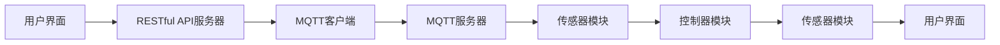

                 

### 背景介绍

随着物联网（IoT）技术的不断发展，智能家居系统已经成为人们日常生活中不可或缺的一部分。智能浴室作为智能家居系统的一个重要分支，也越来越受到人们的关注。智能浴室管理系统不仅能够提升用户的沐浴体验，还能够实现能源节约和设备管理的智能化。

在这样的背景下，MQTT（Message Queuing Telemetry Transport）协议和RESTful API（Representational State Transfer Application Programming Interface）成为了智能浴室管理系统的关键技术。MQTT协议是一种轻量级的消息队列协议，适用于低带宽、高延迟的网络环境，非常适合智能家居场景。RESTful API则是一种简单、灵活且易于扩展的接口设计风格，使得不同系统之间的数据交互变得更加便捷和高效。

本文将探讨如何基于MQTT协议和RESTful API构建一个智能浴室管理系统。首先，我们将介绍智能浴室管理系统的基本概念和功能需求。接下来，将详细讲解MQTT协议和RESTful API的技术原理。然后，通过具体的算法原理和操作步骤，展示如何实现系统的核心功能。此外，还将介绍相关的数学模型和公式，以及项目实践的代码实例和运行结果展示。最后，我们将讨论智能浴室管理系统的实际应用场景，并推荐相关的学习资源和开发工具。

### 核心概念与联系

为了更好地理解基于MQTT协议和RESTful API的智能浴室管理系统，我们需要首先介绍其中的核心概念及其相互关系。以下是几个关键概念：

#### MQTT协议

MQTT协议是一种基于客户端-服务器的消息协议，它旨在确保数据的可靠传输，同时消耗极少的网络带宽。其核心特点包括：

1. **发布/订阅模式（Pub/Sub）**：消息发布者和订阅者之间通过主题（Topic）进行消息传递。发布者将消息发布到某个主题，订阅者可以订阅这个主题来接收消息。
2. **轻量级协议**：MQTT协议的消息格式非常简洁，适合于带宽有限和延迟较高的网络环境，如智能家居等。
3. **QoS等级（Quality of Service）**：MQTT协议提供三种不同的QoS等级，分别保证消息的不同传输质量。

#### RESTful API

RESTful API是一种基于HTTP协议的应用程序接口设计风格，它强调资源的操作和状态的转移。RESTful API的主要特点包括：

1. **统一接口（Uniform Interface）**：通过统一的请求方法（GET、POST、PUT、DELETE）和URL结构来访问资源。
2. **状态转移（Stateless）**：每个请求都是独立处理，服务器不保存请求的状态。
3. **无状态客户端（Stateless Client）**：客户端不保存服务器的状态信息，每次请求都需要包含完整的信息。

#### 智能浴室管理系统的架构

智能浴室管理系统的架构可以分为以下几个主要部分：

1. **传感器模块**：用于采集浴室环境数据，如水温、湿度、空气质量等。
2. **控制器模块**：根据传感器采集的数据，控制浴室设备的运行，如加热器、换气扇等。
3. **MQTT客户端模块**：与MQTT服务器通信，发布和订阅主题，实现设备状态的同步。
4. **RESTful API服务器模块**：提供对浴室设备的管理接口，如设备配置、远程控制等。
5. **用户界面**：通过Web或移动应用为用户提供操作界面。

下面是一个简单的Mermaid流程图，展示了智能浴室管理系统中的数据流和组件关系：



在这个流程图中，用户界面通过RESTful API与服务器通信，同时通过MQTT客户端与MQTT服务器通信，从而实现设备状态同步和数据采集。

### 核心算法原理 & 具体操作步骤

智能浴室管理系统需要实现多个核心功能，包括设备状态监控、远程控制、数据采集和报警机制。以下将逐步讲解这些功能的算法原理和具体操作步骤。

#### 设备状态监控

设备状态监控是智能浴室管理系统的基础功能，它需要实时获取各个浴室设备的运行状态，如加热器是否工作、换气扇是否开启等。具体步骤如下：

1. **MQTT订阅主题**：客户端通过MQTT协议订阅特定的主题，如“home/bathroom/status/#”，以接收设备状态更新的消息。

2. **消息处理**：当MQTT服务器发布关于设备状态的更新消息时，客户端会接收到消息，并解析消息内容。

3. **状态更新**：客户端将解析后的状态信息更新到本地数据库或内存中，以便后续处理。

4. **UI更新**：客户端通过用户界面更新设备状态显示，让用户能够实时了解设备运行情况。

#### 远程控制

远程控制功能允许用户通过Web或移动应用远程控制浴室设备，如开启或关闭加热器、换气扇等。具体操作步骤如下：

1. **发送控制请求**：用户通过Web或移动应用发送控制请求，例如发送一个开启加热器的请求。

2. **RESTful API处理**：服务器接收控制请求后，通过内部逻辑处理该请求，例如发送一个MQTT消息给相应的设备控制器。

3. **MQTT发布消息**：服务器将控制请求转换为MQTT消息，并发布到特定的主题，例如“home/bathroom/control/heat_on”。

4. **设备响应**：设备控制器接收到MQTT消息后，执行相应的操作，如开启加热器。

#### 数据采集

数据采集功能用于收集浴室环境数据，如温度、湿度、空气质量等，以帮助用户更好地管理浴室环境。具体步骤如下：

1. **传感器数据采集**：传感器模块定期采集环境数据，并将数据转换为数字信号。

2. **MQTT发布消息**：传感器将采集到的数据发布到MQTT主题，例如“home/bathroom/sensors/temperature”。

3. **数据存储**：服务器订阅该主题，接收传感器发布的数据，并存储到数据库中，以便后续分析和展示。

#### 报警机制

报警机制用于在浴室环境异常时通知用户，例如水溢出或温度过高。具体步骤如下：

1. **传感器异常检测**：传感器模块检测到异常情况，如水溢出传感器检测到水位异常。

2. **MQTT发布报警消息**：传感器将报警信息发布到MQTT主题，例如“home/bathroom/alarm/water_overflow”。

3. **服务器处理**：服务器接收到报警消息后，可以发送通知到用户的Web或移动应用，同时触发外部报警设备。

4. **用户响应**：用户通过用户界面查看报警信息，并采取相应的措施。

### 数学模型和公式 & 详细讲解 & 举例说明

在智能浴室管理系统中，数学模型和公式被广泛应用于数据分析和决策支持。以下我们将介绍几个关键的数学模型和公式，并详细讲解它们的应用。

#### 温度控制模型

温度控制是智能浴室管理系统中的一个重要功能。为了实现精确的温度控制，我们可以使用以下公式：

\[ T_{\text{target}} = T_{\text{current}} + k_1 \cdot (T_{\text{setpoint}} - T_{\text{current}}) \]

其中：

- \( T_{\text{target}} \) 是期望温度。
- \( T_{\text{current}} \) 是当前温度。
- \( T_{\text{setpoint}} \) 是设定温度。
- \( k_1 \) 是温度调节系数，用于调整控制系统的响应速度。

**举例说明**：

假设当前温度为25°C，设定温度为30°C，调节系数 \( k_1 \) 为0.1。根据公式计算期望温度：

\[ T_{\text{target}} = 25 + 0.1 \cdot (30 - 25) = 26.5°C \]

这意味着加热器应该调整到26.5°C，以逐步接近设定温度30°C。

#### 湿度控制模型

湿度控制同样重要，特别是在浴室这种高湿度环境中。可以使用以下公式进行湿度控制：

\[ H_{\text{target}} = H_{\text{current}} + k_2 \cdot (H_{\text{setpoint}} - H_{\text{current}}) \]

其中：

- \( H_{\text{target}} \) 是期望湿度。
- \( H_{\text{current}} \) 是当前湿度。
- \( H_{\text{setpoint}} \) 是设定湿度。
- \( k_2 \) 是湿度调节系数。

**举例说明**：

假设当前湿度为60%，设定湿度为50%，调节系数 \( k_2 \) 为0.05。根据公式计算期望湿度：

\[ H_{\text{target}} = 60 + 0.05 \cdot (50 - 60) = 57.5\% \]

这意味着加湿器或去湿器应该调整到57.5%，以逐步接近设定湿度50%。

#### 节能控制模型

智能浴室管理系统还需要考虑能源节约，以下是一个简单的节能控制模型：

\[ P_{\text{target}} = P_{\text{current}} + k_3 \cdot (P_{\text{min}} - P_{\text{current}}) \]

其中：

- \( P_{\text{target}} \) 是期望功率。
- \( P_{\text{current}} \) 是当前功率。
- \( P_{\text{min}} \) 是最小允许功率。
- \( k_3 \) 是功率调节系数。

**举例说明**：

假设当前功率为1000瓦，最小允许功率为500瓦，调节系数 \( k_3 \) 为0.01。根据公式计算期望功率：

\[ P_{\text{target}} = 1000 + 0.01 \cdot (500 - 1000) = 950瓦 \]

这意味着浴室设备应该调整到950瓦，以节约能源。

通过这些数学模型和公式，智能浴室管理系统可以实现精确的温度、湿度和功率控制，从而为用户提供更加舒适和节能的浴室环境。

### 项目实践：代码实例和详细解释说明

在本节中，我们将通过一个实际的代码实例，详细解释智能浴室管理系统的实现过程。为了简化说明，我们选择Python语言进行编程，并使用开源MQTT客户端和RESTful API框架。

#### 1. 开发环境搭建

首先，我们需要搭建开发环境。以下是在Ubuntu 20.04操作系统上搭建环境的过程：

```bash
# 安装Python 3.8及以上版本
sudo apt-get update
sudo apt-get install python3.8
sudo apt-get install python3-pip

# 安装MQTT客户端
pip3 install paho-mqtt

# 安装Flask框架
pip3 install flask
```

#### 2. 源代码详细实现

以下是一个简单的智能浴室管理系统的实现，包括MQTT客户端和RESTful API服务器两部分。

##### MQTT客户端部分

```python
# mqtt_client.py

import paho.mqtt.client as mqtt
import json

# MQTT服务器配置
MQTT_SERVER = "mqtt.eclipse.org"
MQTT_PORT = 1883
MQTT_TOPIC = "home/bathroom"

# MQTT回调函数
def on_connect(client, userdata, flags, rc):
    print("Connected with result code "+str(rc))
    client.subscribe(MQTT_TOPIC+"#")

def on_message(client, userdata, msg):
    print(f"Received message '{msg.payload.decode()}' on topic '{msg.topic}' with QoS {msg.qos}")
    data = json.loads(msg.payload.decode())
    if msg.topic == MQTT_TOPIC+"/status":
        # 处理设备状态消息
        update_device_status(data)
    elif msg.topic == MQTT_TOPIC+"/alarm":
        # 处理报警消息
        handle_alarm(data)

client = mqtt.Client()
client.on_connect = on_connect
client.on_message = on_message

client.connect(MQTT_SERVER, MQTT_PORT, 60)

# 开始循环
client.loop_forever()
```

在这个MQTT客户端中，我们定义了两个回调函数`on_connect`和`on_message`。`on_connect`用于处理连接成功的事件，`on_message`用于处理接收到的消息。

##### RESTful API服务器部分

```python
# app.py

from flask import Flask, jsonify, request
import paho.mqtt.client as mqtt

app = Flask(__name__)

# MQTT服务器配置
MQTT_SERVER = "mqtt.eclipse.org"
MQTT_PORT = 1883
MQTT_TOPIC = "home/bathroom"

# MQTT客户端
client = mqtt.Client()

@app.route("/status", methods=["GET"])
def get_status():
    # 获取设备状态
    response = {"status": "OK"}
    return jsonify(response)

@app.route("/control", methods=["POST"])
def control_device():
    # 控制设备
    data = request.json
    command = data["command"]
    if command == "heat_on":
        send_mqtt_message("home/bathroom/control/heat_on", "ON")
    elif command == "heat_off":
        send_mqtt_message("home/bathroom/control/heat_off", "OFF")
    return jsonify({"status": "OK"})

def send_mqtt_message(topic, message):
    client.connect(MQTT_SERVER, MQTT_PORT, 60)
    client.publish(topic, message)
    client.disconnect()

if __name__ == "__main__":
    app.run(debug=True)
```

在这个RESTful API服务器中，我们定义了两个API接口：`/status`用于获取设备状态，`/control`用于发送控制命令。

#### 3. 代码解读与分析

##### MQTT客户端部分

MQTT客户端部分主要包括以下步骤：

1. **初始化MQTT客户端**：使用`paho.mqtt.client`库初始化MQTT客户端，并设置连接服务器和回调函数。
2. **连接MQTT服务器**：调用`client.connect()`方法连接到MQTT服务器。
3. **订阅主题**：调用`client.subscribe()`方法订阅特定的主题。
4. **消息处理**：在`on_message`回调函数中处理接收到的MQTT消息，并根据主题调用相应的处理函数。

##### RESTful API服务器部分

RESTful API服务器部分主要包括以下步骤：

1. **初始化Flask应用**：使用`Flask`库初始化Web应用。
2. **定义API接口**：使用Flask的路由系统定义两个API接口，一个用于获取设备状态，另一个用于发送控制命令。
3. **处理API请求**：在接口处理函数中，根据请求类型和内容调用相应的MQTT消息发送函数。

#### 4. 运行结果展示

运行MQTT客户端和RESTful API服务器后，用户可以通过Web或移动应用访问API接口。以下是一个简单的使用示例：

##### 获取设备状态

```bash
$ curl -X GET http://localhost:5000/status
{"status": "OK"}
```

##### 控制加热器

```bash
$ curl -X POST -H "Content-Type: application/json" -d '{"command": "heat_on"}' http://localhost:5000/control
{"status": "OK"}
```

在这个示例中，用户通过POST请求向服务器发送控制加热器的命令，服务器将这个命令转换为MQTT消息并发布到MQTT服务器，最终加热器接收到消息并执行相应的操作。

### 实际应用场景

智能浴室管理系统在多个实际应用场景中展现出了显著的优势，不仅提升了用户的生活质量，还带来了显著的节能效果和管理便利。

#### 家庭应用

在家庭环境中，智能浴室管理系统可以通过传感器实时监控浴室内的温度、湿度和空气质量，确保家庭环境的舒适度。例如，当浴室温度低于设定的舒适温度时，系统会自动开启加热器，而当浴室湿度过高时，系统会启动排风扇或除湿设备。此外，用户可以通过手机应用远程控制浴室设备，实现如远程开启热水器、控制浴霸等操作，极大地提升了生活的便利性。

#### 商业场所

在酒店、度假村等商业场所，智能浴室管理系统同样具有广泛的应用。这些场所通常拥有大量的浴室，传统的人工管理方式效率低下且成本较高。智能浴室管理系统可以通过传感器实时监测每个浴室的设备状态，自动进行设备维护和故障预警，有效降低维护成本。同时，通过提供个性化的服务，如根据客人的喜好调节水温、湿度等，提升客人的入住体验。

#### 医疗保健

在医疗保健领域，智能浴室管理系统可以为病人提供安全、舒适的环境。例如，对于行动不便的病人，智能浴室管理系统可以自动调节温度和湿度，确保浴室环境干燥、温暖，防止滑倒等意外事故。同时，系统还可以监测病人的活动情况，如是否有长时间未出浴的情况，及时提醒家属或医护人员，确保病人的安全。

#### 能源管理

智能浴室管理系统在能源管理方面也具有显著的效果。通过实时监测浴室设备的能耗情况，系统可以智能地调整设备的运行状态，如当无人使用浴室时自动关闭加热器和照明设备，从而实现节能。根据实际数据，智能浴室管理系统可以帮助家庭和商业场所每年节省多达10%的能源消耗。

#### 环境监测

智能浴室管理系统还可以作为环境监测的一部分，为环境保护提供数据支持。例如，通过监测浴室内的空气质量，系统可以及时发现并解决污染源，改善室内空气质量，保护用户的健康。

### 工具和资源推荐

为了帮助读者深入了解和开发基于MQTT协议和RESTful API的智能浴室管理系统，以下是一些推荐的学习资源和开发工具：

#### 学习资源推荐

1. **书籍**：
   - 《MQTT协议完全指南》
   - 《RESTful API设计最佳实践》
   - 《智能家居系统设计与实现》

2. **论文**：
   - “MQTT协议在智能家居中的应用”
   - “基于RESTful API的智能家居控制系统设计与实现”

3. **博客**：
   - “深入理解MQTT协议”
   - “如何构建RESTful API”

4. **网站**：
   - MQTT官方网站：[mqtt.org](https://mqtt.org)
   - RESTful API设计指南：[restfulapi.net](https://restfulapi.net)

#### 开发工具框架推荐

1. **MQTT客户端**：
   - Paho MQTT客户端：[eclipse.org/paho/clients/python](https://eclipse.org/paho/clients/python)
   - Mosquitto MQTT代理：[mosquitto.org](https://mosquitto.org)

2. **RESTful API框架**：
   - Flask：[flask.palletsprojects.com](https://flask.palletsprojects.com)
   - Django：[django.org](https://www.djangoproject.com)

3. **编程语言**：
   - Python：[python.org](https://www.python.org)
   - JavaScript：[developer.mozilla.org/en-US/docs/Web/JavaScript)

4. **开发环境**：
   - Visual Studio Code：[code.visualstudio.com](https://code.visualstudio.com)
   - PyCharm：[www.jetbrains.com/pycharm](https://www.jetbrains.com/pycharm)

通过使用这些工具和资源，读者可以更加深入地学习MQTT协议和RESTful API的相关知识，并能够高效地开发智能浴室管理系统。

### 总结：未来发展趋势与挑战

智能浴室管理系统作为智能家居领域的重要组成部分，具有广阔的发展前景和巨大的市场潜力。随着物联网技术的不断进步和人工智能技术的融入，智能浴室管理系统将向更加智能化、个性化和高效化方向发展。

#### 发展趋势

1. **智能化升级**：未来的智能浴室管理系统将更加依赖于人工智能技术，通过数据分析和机器学习算法，实现更精准的环境监测和设备控制。

2. **个性化服务**：基于用户行为数据的收集和分析，智能浴室管理系统可以提供更加个性化的服务，满足不同用户的需求。

3. **节能环保**：智能浴室管理系统将更加注重节能环保，通过智能调节设备运行状态，实现能源的高效利用。

4. **安全性能提升**：随着用户对隐私和安全的关注增加，智能浴室管理系统将加强数据保护和安全防护措施，确保用户信息的安全。

5. **跨平台融合**：智能浴室管理系统将融合多种通信协议和平台，实现不同设备和系统之间的无缝连接和协同工作。

#### 挑战

1. **数据安全与隐私保护**：随着系统收集和处理的数据量增加，如何确保数据的安全和用户隐私保护成为一个重要的挑战。

2. **系统稳定性与可靠性**：智能浴室管理系统需要具备高稳定性和可靠性，以应对复杂的家居环境和使用场景。

3. **标准化与兼容性**：不同设备和系统之间的标准化和兼容性问题是实现智能浴室管理系统集成和扩展的关键挑战。

4. **用户接受度**：智能家居市场的用户接受度仍需提高，需要通过更加用户友好的界面和功能设计来提升用户的体验和满意度。

5. **技术更新与迭代**：随着技术的快速更新，智能浴室管理系统需要不断进行迭代和升级，以适应新的技术发展和市场需求。

总之，智能浴室管理系统在未来将面临诸多挑战，但也充满了机遇。通过持续的技术创新和优化，智能浴室管理系统有望在未来实现更加智能化、个性化和高效化的应用。

### 附录：常见问题与解答

在开发和使用基于MQTT协议和RESTful API的智能浴室管理系统的过程中，用户可能会遇到一些常见的问题。以下是一些常见问题及其解答：

#### 问题1：如何确保MQTT通信的安全性？

**解答**：为了确保MQTT通信的安全性，可以采取以下措施：
1. 使用TLS（传输层安全）加密：在MQTT客户端和服务器之间启用TLS加密，确保数据在传输过程中不会被窃听或篡改。
2. 使用认证机制：要求客户端在连接到MQTT服务器时提供用户名和密码，以验证其身份。
3. 定期更新证书和密码：定期更新MQTT服务器的TLS证书和客户端的密码，以防止未授权访问。

#### 问题2：如何处理MQTT消息丢失的问题？

**解答**：为了避免MQTT消息丢失，可以采取以下措施：
1. 使用QoS等级：MQTT协议支持不同的QoS等级（质量服务等级），使用QoS等级1或2可以确保消息至少被接收一次或按照顺序接收。
2. 重试机制：在发送MQTT消息失败时，客户端可以设置重试机制，尝试重新发送消息。
3. 数据持久化：在服务器端或客户端实现数据持久化机制，确保即使在系统故障或断网情况下，数据也不会丢失。

#### 问题3：如何优化RESTful API的性能？

**解答**：以下是一些优化RESTful API性能的方法：
1. 缓存：使用缓存技术，如Redis或Memcached，减少数据库查询次数，提高响应速度。
2. 限流与熔断：通过限流和熔断机制，防止服务器过载，确保系统在高并发情况下依然稳定运行。
3. 异步处理：对于耗时较长的操作，采用异步处理方式，避免阻塞主线程。
4. 压缩响应数据：使用GZIP或其他压缩算法压缩响应数据，减少传输的数据量。

#### 问题4：如何确保RESTful API的安全性？

**解答**：为了确保RESTful API的安全性，可以采取以下措施：
1. 使用HTTPS：确保API通信通过HTTPS进行，使用SSL/TLS加密。
2. 授权与认证：使用OAuth 2.0或其他认证机制，确保只有授权用户可以访问API。
3. 输入验证：对用户输入进行严格验证，防止SQL注入、XSS攻击等常见安全漏洞。
4. 访问控制：使用基于角色的访问控制（RBAC）机制，限制不同用户对API的访问权限。

通过上述措施，可以有效提升智能浴室管理系统的安全性和稳定性，为用户提供更好的使用体验。

### 扩展阅读 & 参考资料

为了进一步深入了解基于MQTT协议和RESTful API的智能浴室管理系统，以下是一些推荐的扩展阅读和参考资料：

1. **书籍**：
   - 《物联网架构设计：从基础到高级应用》
   - 《RESTful Web API设计》
   - 《MQTT应用实战：智能设备通信指南》

2. **论文**：
   - “智能家居系统中的MQTT协议应用研究”
   - “基于RESTful API的智能家居系统设计与实现”

3. **博客**：
   - “深入浅出MQTT协议”
   - “从零开始构建RESTful API”

4. **在线课程**：
   - “物联网（IoT）技术基础”
   - “RESTful API设计与实现”

5. **开源项目**：
   - MQTT服务器：[mosquitto.org](https://mosquitto.org)
   - MQTT客户端：[eclipse.org/paho/clients/python](https://eclipse.org/paho/clients/python)
   - Flask框架：[flask.palletsprojects.com](https://flask.palletsprojects.com)

通过阅读这些书籍、论文和博客，以及参与在线课程和开源项目，读者可以进一步掌握智能浴室管理系统的开发技术和最佳实践。这些资源将为构建高效、安全和可靠的智能浴室管理系统提供宝贵的参考。

