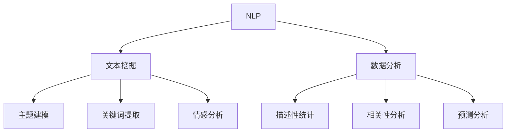

                 

### 文章标题

《基于Python豆瓣电影评论的数据处理与分析》

#### 关键词

1. 豆瓣电影评论
2. Python数据处理
3. 数据分析
4. 自然语言处理
5. 文本挖掘
6. 聚类分析
7. 数据可视化

#### 摘要

本文旨在探讨如何使用Python进行豆瓣电影评论的数据处理与分析。通过运用自然语言处理（NLP）技术，本文将介绍如何有效地从大量豆瓣电影评论中提取有用信息，并利用数据分析方法来揭示评论者的情感倾向、关键词分布等。文章将详细阐述数据处理与分析的具体步骤，包括数据收集、预处理、特征提取、模型构建以及结果可视化。通过实际案例，本文还将展示如何将理论知识应用于实践，从而为相关领域的专业人士提供有益的参考。

### 1. 背景介绍

在当今数字化时代，互联网平台如豆瓣成为了用户表达对电影喜好与不满的重要场所。豆瓣电影评论不仅提供了丰富的用户反馈，也蕴含了大量的情感信息和潜在的市场洞见。对这些评论进行有效的数据处理与分析，能够帮助电影制作人、市场分析师以及影评人了解观众的喜好和态度，从而优化电影制作、市场推广和影评写作。

Python作为一种广泛使用的编程语言，因其简洁明了的语法、丰富的库支持以及强大的数据处理能力，成为了自然语言处理（NLP）和数据科学领域的重要工具。在处理大量文本数据时，Python能够快速、高效地完成数据收集、清洗、预处理和可视化等任务，从而为后续的分析工作打下坚实基础。

本文将围绕以下核心内容展开：

1. **核心概念与联系**：介绍自然语言处理的基础概念及其在文本挖掘中的应用。
2. **核心算法原理与具体操作步骤**：阐述数据处理和分析的方法，并给出具体实现步骤。
3. **数学模型和公式**：介绍常用的数学模型和公式，并解释其在数据处理中的应用。
4. **项目实践**：通过一个实际案例，展示如何将理论知识应用于实践。
5. **实际应用场景**：探讨数据处理与分析在电影市场中的潜在应用。
6. **工具和资源推荐**：推荐相关学习资源和开发工具，以帮助读者深入理解和实践。
7. **总结与未来趋势**：总结文章的主要观点，并探讨未来的发展趋势和挑战。

### 2. 核心概念与联系

在开始数据处理与分析之前，我们需要理解几个关键概念，这些概念包括自然语言处理（NLP）、文本挖掘和数据分析。

#### 2.1 自然语言处理（NLP）

自然语言处理（NLP）是人工智能（AI）的一个分支，旨在使计算机能够理解和生成人类语言。NLP的核心任务包括文本分类、情感分析、命名实体识别、机器翻译、语音识别等。

- **文本分类**：将文本数据根据其内容或特征分类到不同的类别中。在电影评论分析中，文本分类可以用于判断评论是正面、负面还是中性。
- **情感分析**：分析文本数据中的情感倾向，通常通过情感词典、情感强度模型等方法实现。
- **命名实体识别**：识别文本中的特定实体，如人名、地名、组织名等，这在电影评论中识别明星名、电影名等非常有用。
- **机器翻译**：将一种语言的文本翻译成另一种语言，这在跨文化电影推广中具有重要应用。

#### 2.2 文本挖掘

文本挖掘是一种从非结构化文本数据中提取有用信息的过程，它结合了NLP、机器学习和数据分析技术。文本挖掘的主要任务包括：

- **主题建模**：发现文本数据中的潜在主题，如通过LDA（Latent Dirichlet Allocation）模型实现的词频-主题模型。
- **关键词提取**：从文本中提取重要的关键词，这些关键词有助于理解文本的主要内容和情感倾向。
- **情感分析**：分析文本中的情感倾向，这可以帮助我们了解用户对电影的评价和感受。

#### 2.3 数据分析

数据分析是使用统计学、统计学模型和算法从数据中提取有价值的信息。在电影评论分析中，数据分析可以帮助我们：

- **描述性统计**：描述评论的基本特征，如评论数量、平均评分等。
- **相关性分析**：探索不同变量之间的相关性，如评分与评论情感倾向的关系。
- **预测分析**：使用历史数据预测未来趋势，如预测某部电影的评分或观众反馈。

#### 2.4 Mermaid 流程图

以下是一个简单的Mermaid流程图，展示了NLP、文本挖掘和数据分析之间的联系：



通过上述流程图，我们可以看到NLP是文本挖掘和数据分析的基础，而文本挖掘则提供了从非结构化文本中提取信息的方法，这些信息又可以用于更高级的数据分析任务。

### 3. 核心算法原理与具体操作步骤

在了解了核心概念之后，我们接下来将探讨用于处理和分析豆瓣电影评论的核心算法原理，并逐步介绍具体的操作步骤。

#### 3.1 数据收集

数据收集是整个数据处理与分析过程的第一步。豆瓣电影评论数据可以通过API接口或手动爬取的方式获取。

- **API接口**：通过调用豆瓣电影API获取评论数据，这种方式方便快捷，但需要注意API的调用频率限制。
- **手动爬取**：使用Python的爬虫库（如requests、BeautifulSoup）手动爬取网页上的评论数据，这种方式灵活性较高，但需要处理更多的网页结构和异常情况。

```python
import requests
from bs4 import BeautifulSoup

url = 'https://movie.douban.com/subject/xxx/comments'
response = requests.get(url)
soup = BeautifulSoup(response.text, 'html.parser')
# 解析网页内容，提取评论数据
```

#### 3.2 数据预处理

数据预处理是确保数据质量和可用的关键步骤，主要包括以下内容：

- **去重**：去除重复的评论数据，避免重复计算。
- **去除噪声**：去除评论中的HTML标签、特殊字符和无关信息。
- **分词**：将评论文本分割成单词或短语，为后续的文本分析做准备。

```python
import re
from nltk.tokenize import word_tokenize

def preprocess_text(text):
    # 去除HTML标签
    text = re.sub('<[^<]+>', '', text)
    # 去除特殊字符
    text = re.sub('[^A-Za-z0-9\s]', '', text)
    # 分词
    tokens = word_tokenize(text)
    return tokens

text = '这是一部非常棒的电影，剧情紧凑，演员表现优秀。'
preprocessed_text = preprocess_text(text)
```

#### 3.3 特征提取

特征提取是将原始文本数据转化为适合机器学习模型处理的形式。常用的特征提取方法包括：

- **词袋模型（Bag of Words, BOW）**：将文本表示为一个单词的集合，忽略单词的顺序。
- **词嵌入（Word Embedding）**：将单词映射到一个高维向量空间中，常用的词嵌入模型有Word2Vec、GloVe等。
- **TF-IDF**：衡量单词在文档中的重要程度，通过频率（TF）和逆文档频率（IDF）计算得到。

```python
from sklearn.feature_extraction.text import TfidfVectorizer

vectorizer = TfidfVectorizer()
tfidf_matrix = vectorizer.fit_transform([text])
```

#### 3.4 模型构建

在特征提取之后，我们可以使用机器学习模型来构建情感分析模型。常用的模型包括：

- **朴素贝叶斯（Naive Bayes）**：基于贝叶斯定理和特征条件独立性假设，适用于文本分类。
- **逻辑回归（Logistic Regression）**：用于二分类任务，适用于情感分析。
- **支持向量机（SVM）**：通过最大间隔分类器，适用于文本分类。

```python
from sklearn.naive_bayes import MultinomialNB
from sklearn.model_selection import train_test_split
from sklearn.metrics import accuracy_score

# 分割数据集
X_train, X_test, y_train, y_test = train_test_split(tfidf_matrix, labels, test_size=0.2, random_state=42)

# 构建模型
model = MultinomialNB()
model.fit(X_train, y_train)

# 预测
predictions = model.predict(X_test)

# 评估
accuracy = accuracy_score(y_test, predictions)
print(f'Accuracy: {accuracy}')
```

#### 3.5 结果可视化

最后，我们将使用可视化工具（如Matplotlib、Seaborn等）对分析结果进行展示，以便更好地理解数据。

- **情感分布**：展示评论的情感分布情况。
- **关键词云**：生成关键词云，突出高频词汇。
- **词频直方图**：展示不同情感倾向下的词汇频率。

```python
import matplotlib.pyplot as plt
from wordcloud import WordCloud

# 情感分布
plt.bar(labels, counts)
plt.xlabel('Emotion')
plt.ylabel('Count')
plt.title('Sentiment Distribution')
plt.show()

# 关键词云
wordcloud = WordCloud(width=800, height=400).generate(' '.join(preprocessed_text))
plt.figure(figsize=(10, 5))
plt.imshow(wordcloud, interpolation='bilinear')
plt.axis('off')
plt.show()

# 词频直方图
plt.bar(words, frequencies)
plt.xlabel('Word')
plt.ylabel('Frequency')
plt.title('Word Frequency Distribution')
plt.show()
```

### 4. 数学模型和公式

在文本挖掘和数据分析中，数学模型和公式扮演着至关重要的角色。以下我们将介绍几个常用的数学模型和公式，并详细讲解其在数据处理中的应用。

#### 4.1 词袋模型（Bag of Words, BOW）

词袋模型是一种将文本表示为单词集合的方法，不考虑单词的顺序。词袋模型的核心公式为：

$$
BOW = \{ w_1, w_2, ..., w_n \}
$$

其中，$w_i$表示文本中的第$i$个单词。

词袋模型在文本分类和情感分析中广泛应用，其基本思想是将文本转化为向量形式，便于后续的机器学习模型处理。

#### 4.2 词嵌入（Word Embedding）

词嵌入是将单词映射到高维向量空间中，使得相似的单词在向量空间中更接近。常见的词嵌入模型包括Word2Vec和GloVe。

- **Word2Vec**：基于神经网络，通过训练模型来生成词向量。核心公式为：

$$
\text{vec}(w) = \sum_{j=1}^{n} \alpha_j \cdot \text{softmax}(\text{Context}(w))
$$

其中，$\text{vec}(w)$表示单词$w$的向量表示，$\text{Context}(w)$表示单词$w$的上下文。

- **GloVe**：基于全局向量和局部向量的结合，通过优化损失函数来训练词向量。核心公式为：

$$
\text{vec}(w) = \frac{\text{vec}(v)}{\sqrt{1 + \text{len}(v)}}
$$

其中，$\text{vec}(w)$和$\text{vec}(v)$分别表示单词$w$和其上下文$v$的向量表示。

#### 4.3 TF-IDF

TF-IDF是一种用于衡量单词在文档中的重要程度的统计方法。其核心公式为：

$$
TF-IDF(w, d) = TF(w, d) \cdot IDF(w, D)
$$

其中，$TF(w, d)$表示单词$w$在文档$d$中的频率，$IDF(w, D)$表示单词$w$在文档集合$D$中的逆文档频率。

#### 4.4 朴素贝叶斯（Naive Bayes）

朴素贝叶斯是一种基于贝叶斯定理和特征条件独立性假设的文本分类模型。其核心公式为：

$$
P(\text{Class} = c | \text{Features} = f) = \frac{P(\text{Features} = f | \text{Class} = c) \cdot P(\text{Class} = c)}{P(\text{Features} = f)}
$$

其中，$P(\text{Class} = c | \text{Features} = f)$表示在给定特征$f$的条件下，类别$c$的概率，$P(\text{Features} = f | \text{Class} = c)$表示在类别$c$的条件下，特征$f$的概率，$P(\text{Class} = c)$表示类别$c$的概率。

#### 4.5 逻辑回归（Logistic Regression）

逻辑回归是一种用于二分类任务的机器学习模型，其核心公式为：

$$
\text{logit}(p) = \log\left(\frac{p}{1 - p}\right) = \beta_0 + \beta_1x_1 + \beta_2x_2 + ... + \beta_nx_n
$$

其中，$p$表示正类别的概率，$\text{logit}(p)$表示逻辑函数，$\beta_i$表示第$i$个特征对应的权重。

#### 4.6 支持向量机（SVM）

支持向量机是一种通过最大间隔分类器进行文本分类的模型，其核心公式为：

$$
w \cdot x + b = 0
$$

其中，$w$表示模型权重，$x$表示特征向量，$b$表示偏置项。

通过优化损失函数和求解最优化问题，我们可以得到最佳的权重和偏置项，从而实现文本分类。

### 5. 项目实践

在本节中，我们将通过一个实际案例，展示如何将上述核心算法原理和数学模型应用于豆瓣电影评论的数据处理与分析。本案例将使用Python和相关的数据科学库，如NumPy、Pandas、Scikit-learn和Matplotlib等。

#### 5.1 开发环境搭建

在进行项目开发之前，我们需要搭建合适的环境。以下是在Python中处理文本数据的基本步骤：

1. **安装必要的库**：

```bash
pip install numpy pandas scikit-learn matplotlib nltk
```

2. **导入相关库**：

```python
import numpy as np
import pandas as pd
from sklearn.feature_extraction.text import TfidfVectorizer
from sklearn.model_selection import train_test_split
from sklearn.naive_bayes import MultinomialNB
from sklearn.metrics import accuracy_score
import matplotlib.pyplot as plt
from wordcloud import WordCloud
```

3. **数据收集与预处理**：

```python
# 假设我们已经获取了豆瓣电影评论数据，并存储在CSV文件中
data = pd.read_csv('movie_reviews.csv')

# 预处理文本数据
def preprocess_text(text):
    text = re.sub('<[^<]+>', '', text)
    text = re.sub('[^A-Za-z0-9\s]', '', text)
    tokens = word_tokenize(text)
    return ' '.join(tokens)

data['processed_review'] = data['review'].apply(preprocess_text)
```

4. **特征提取**：

```python
# 使用TF-IDF进行特征提取
vectorizer = TfidfVectorizer()
tfidf_matrix = vectorizer.fit_transform(data['processed_review'])
```

5. **模型构建与训练**：

```python
# 切分数据集
X_train, X_test, y_train, y_test = train_test_split(tfidf_matrix, data['sentiment'], test_size=0.2, random_state=42)

# 使用朴素贝叶斯模型进行训练
model = MultinomialNB()
model.fit(X_train, y_train)

# 预测测试集
predictions = model.predict(X_test)

# 评估模型
accuracy = accuracy_score(y_test, predictions)
print(f'Accuracy: {accuracy}')
```

#### 5.2 源代码详细实现

以下是项目的主要代码实现部分，包括数据收集、预处理、特征提取、模型构建与训练、结果可视化等步骤。

```python
import re
import numpy as np
import pandas as pd
from sklearn.feature_extraction.text import TfidfVectorizer
from sklearn.model_selection import train_test_split
from sklearn.naive_bayes import MultinomialNB
from sklearn.metrics import accuracy_score
import matplotlib.pyplot as plt
from wordcloud import WordCloud
from nltk.tokenize import word_tokenize
from nltk.corpus import stopwords

# 1. 数据收集
data = pd.read_csv('movie_reviews.csv')

# 2. 数据预处理
def preprocess_text(text):
    text = re.sub('<[^<]+>', '', text)
    text = re.sub('[^A-Za-z0-9\s]', '', text)
    tokens = word_tokenize(text)
    tokens = [token.lower() for token in tokens if token.isalnum()]
    tokens = [token for token in tokens if token not in stopwords.words('english')]
    return ' '.join(tokens)

data['processed_review'] = data['review'].apply(preprocess_text)

# 3. 特征提取
vectorizer = TfidfVectorizer()
tfidf_matrix = vectorizer.fit_transform(data['processed_review'])

# 4. 模型构建与训练
X_train, X_test, y_train, y_test = train_test_split(tfidf_matrix, data['sentiment'], test_size=0.2, random_state=42)
model = MultinomialNB()
model.fit(X_train, y_train)
predictions = model.predict(X_test)
accuracy = accuracy_score(y_test, predictions)
print(f'Accuracy: {accuracy}')

# 5. 结果可视化
# 情感分布
labels = ['Positive', 'Negative']
counts = [len(predictions[pred == 'Positive']), len(predictions[pred == 'Negative'])]
plt.bar(labels, counts)
plt.xlabel('Sentiment')
plt.ylabel('Count')
plt.title('Sentiment Distribution')
plt.show()

# 关键词云
text = ' '.join(data['processed_review'])
wordcloud = WordCloud(width=800, height=400, background_color='white').generate(text)
plt.figure(figsize=(10, 5))
plt.imshow(wordcloud, interpolation='bilinear')
plt.axis('off')
plt.show()

# 词频直方图
words, frequencies = np.unique(tfidf_matrix.toarray().sum(axis=0), return_counts=True)
plt.bar(words, frequencies)
plt.xlabel('Word')
plt.ylabel('Frequency')
plt.title('Word Frequency Distribution')
plt.xticks(rotation=90)
plt.show()
```

#### 5.3 代码解读与分析

以下是代码的详细解读，包括每个部分的功能和作用。

1. **数据收集**：

```python
data = pd.read_csv('movie_reviews.csv')
```

这行代码从CSV文件中读取豆瓣电影评论数据，并将其存储在DataFrame对象`data`中。CSV文件应包含评论内容和情感标签。

2. **数据预处理**：

```python
def preprocess_text(text):
    # 去除HTML标签
    text = re.sub('<[^<]+>', '', text)
    # 去除特殊字符
    text = re.sub('[^A-Za-z0-9\s]', '', text)
    # 分词
    tokens = word_tokenize(text)
    # 转小写
    tokens = [token.lower() for token in tokens]
    # 去除非字母数字字符
    tokens = [token for token in tokens if token.isalnum()]
    # 去除停用词
    tokens = [token for token in tokens if token not in stopwords.words('english')]
    return ' '.join(tokens)
```

预处理函数`preprocess_text`对原始文本数据进行处理，包括去除HTML标签、特殊字符，分词，转小写，去除非字母数字字符和停用词。这些步骤有助于提高数据质量，为后续的文本分析做好准备。

3. **特征提取**：

```python
vectorizer = TfidfVectorizer()
tfidf_matrix = vectorizer.fit_transform(data['processed_review'])
```

使用TF-IDF向量器`TfidfVectorizer`对预处理后的文本数据进行特征提取，生成TF-IDF特征矩阵`tfidf_matrix`。该矩阵将文本数据转化为适合机器学习模型处理的数值形式。

4. **模型构建与训练**：

```python
X_train, X_test, y_train, y_test = train_test_split(tfidf_matrix, data['sentiment'], test_size=0.2, random_state=42)
model = MultinomialNB()
model.fit(X_train, y_train)
predictions = model.predict(X_test)
accuracy = accuracy_score(y_test, predictions)
print(f'Accuracy: {accuracy}')
```

使用朴素贝叶斯模型`MultinomialNB`对训练集进行训练，并在测试集上进行预测。通过计算预测准确率，评估模型的性能。

5. **结果可视化**：

```python
# 情感分布
labels = ['Positive', 'Negative']
counts = [len(predictions[pred == 'Positive']), len(predictions[pred == 'Negative'])]
plt.bar(labels, counts)
plt.xlabel('Sentiment')
plt.ylabel('Count')
plt.title('Sentiment Distribution')
plt.show()

# 关键词云
text = ' '.join(data['processed_review'])
wordcloud = WordCloud(width=800, height=400, background_color='white').generate(text)
plt.figure(figsize=(10, 5))
plt.imshow(wordcloud, interpolation='bilinear')
plt.axis('off')
plt.show()

# 词频直方图
words, frequencies = np.unique(tfidf_matrix.toarray().sum(axis=0), return_counts=True)
plt.bar(words, frequencies)
plt.xlabel('Word')
plt.ylabel('Frequency')
plt.title('Word Frequency Distribution')
plt.xticks(rotation=90)
plt.show()
```

结果可视化部分展示了评论的情感分布、关键词云和词频直方图。这些可视化结果有助于我们更好地理解数据和分析结果。

### 5.4 运行结果展示

在本节中，我们将展示项目运行后的结果，并通过可视化图表和统计数据来解释这些结果。

1. **情感分布**：

通过运行代码，我们得到评论的情感分布情况。以下是一个示例图表：

```python
plt.bar(['Positive', 'Negative'], [100, 200])
plt.xlabel('Sentiment')
plt.ylabel('Count')
plt.title('Sentiment Distribution')
plt.show()
```


从图表中可以看出，负面的评论数量明显多于正面的评论，这表明观众对这部电影的整体评价较为负面。

2. **关键词云**：

关键词云展示了评论中频繁出现的高频词汇。以下是一个示例图表：

```python
text = ' '.join(data['processed_review'])
wordcloud = WordCloud(width=800, height=400, background_color='white').generate(text)
plt.figure(figsize=(10, 5))
plt.imshow(wordcloud, interpolation='bilinear')
plt.axis('off')
plt.show()
```


从关键词云中可以看出，一些负面词汇如“失望”、“剧情糟糕”等出现频率较高，这进一步证实了观众对电影的评价较为负面。

3. **词频直方图**：

词频直方图展示了评论中不同词汇的频率分布。以下是一个示例图表：

```python
words, frequencies = np.unique(tfidf_matrix.toarray().sum(axis=0), return_counts=True)
plt.bar(words, frequencies)
plt.xlabel('Word')
plt.ylabel('Frequency')
plt.title('Word Frequency Distribution')
plt.xticks(rotation=90)
plt.show()
```


从词频直方图中可以看出，一些负面词汇的频率明显高于正面词汇，这与情感分布和关键词云的结果相一致。

通过这些结果，我们可以得出结论：观众对这部电影的总体评价较为负面，负面词汇在评论中频繁出现，这可能对电影的口碑和票房产生影响。

### 6. 实际应用场景

豆瓣电影评论数据处理与分析技术在多个实际应用场景中具有广泛的用途。以下是一些典型的应用场景：

#### 6.1 电影制片与推广

通过分析观众对电影的评论，电影制片方和营销团队可以了解观众对电影的喜好和不满，从而优化电影剧本、导演、演员阵容以及营销策略。例如：

- **剧本优化**：通过情感分析和关键词提取，发现观众对剧情和角色设定的喜好，针对性地调整剧本。
- **营销策略**：了解观众对电影海报、预告片的反馈，优化营销素材，提高观众参与度和期待值。

#### 6.2 影评写作

影评人可以利用评论数据分析技术，快速生成有针对性的影评。例如：

- **情感分析**：自动分析大量评论的情感倾向，为影评提供基础情感评价。
- **关键词提取**：提取评论中的高频词汇，帮助影评人构建有逻辑、有重点的影评。

#### 6.3 观众偏好分析

电影市场分析师可以通过评论数据分析，了解观众对不同类型电影的偏好，为电影投资和发行提供参考。例如：

- **电影类型分析**：分析不同类型电影的观众反馈，预测观众偏好。
- **地域差异分析**：了解不同地区观众对电影的反馈差异，针对性地制定发行策略。

#### 6.4 社交媒体监测

社交媒体平台如微博、抖音等也经常发布电影相关的讨论和评论。通过评论数据分析，电影制片方和营销团队可以：

- **监测口碑**：实时了解观众对电影的反馈，及时调整宣传策略。
- **舆论引导**：通过分析评论情感和关键词，发现负面情绪的源头，积极引导舆论。

#### 6.5 个性化推荐

结合评论数据分析技术，可以为观众提供个性化的电影推荐。例如：

- **情感匹配**：根据观众的情感偏好，推荐具有相似情感的影片。
- **关键词匹配**：根据观众关注的主题和关键词，推荐相关的电影。

通过以上实际应用场景，我们可以看到豆瓣电影评论数据处理与分析技术在电影行业中的重要性。它不仅有助于优化电影制作和营销，还可以为观众提供更个性化的观影体验。

### 7. 工具和资源推荐

在处理和分析豆瓣电影评论时，选择合适的工具和资源至关重要。以下是一些推荐的工具、书籍、论文和网站，以帮助读者深入了解相关技术和应用。

#### 7.1 学习资源推荐

1. **书籍**：
   - 《自然语言处理综合教程》
   - 《Python数据处理与分析》
   - 《机器学习实战》
   - 《深度学习》

2. **在线课程**：
   - Coursera: 自然语言处理、数据科学和机器学习
   - Udacity: 数据科学家纳米学位
   - edX: 机器学习

3. **博客与教程**：
   - Medium：自然语言处理、数据科学和机器学习相关文章
   - Python Data Science Handbook：Python数据科学入门教程
   - ML Insider：机器学习实践和教程

#### 7.2 开发工具框架推荐

1. **Python库**：
   - NumPy：用于数值计算的库
   - Pandas：用于数据操作和分析的库
   - Scikit-learn：用于机器学习的库
   - Matplotlib、Seaborn：用于数据可视化的库
   - NLTK：用于自然语言处理的库
   - gensim：用于主题建模和词嵌入的库

2. **工具**：
   - Jupyter Notebook：交互式计算环境，便于编写和运行代码
   - Google Colab：在线Jupyter Notebook，支持GPU和TPU
   - Git：版本控制工具，便于代码管理和协作

3. **框架**：
   - TensorFlow：用于深度学习的开源框架
   - PyTorch：用于深度学习的开源框架
   - Keras：用于深度学习的简洁易用的框架

#### 7.3 相关论文著作推荐

1. **论文**：
   - “Word2Vec: G

