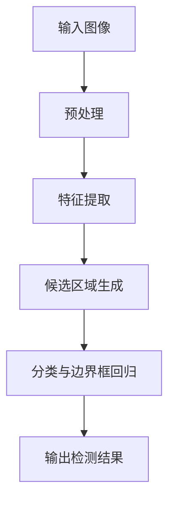

                 

### 文章标题：基于YOLOv5的手势识别

> **关键词**：YOLOv5, 手势识别, 深度学习, 卷积神经网络, 算法原理, 实践案例

**摘要**：本文将深入探讨基于YOLOv5的手势识别技术。首先，我们回顾了手势识别的背景和应用场景，然后详细解析了YOLOv5算法的工作原理。接着，通过具体的数学模型和操作步骤，我们了解了如何实现手势识别。文章的最后部分通过一个实际的项目案例，展示了如何将YOLOv5应用于手势识别，并对其代码进行了详细解读。本文旨在为开发者提供一套完整的实现方案，帮助他们在实际项目中成功应用手势识别技术。

### 1. 背景介绍

手势识别作为一种自然的人机交互方式，已经引起了广泛关注。其应用场景非常广泛，包括智能手机的触摸屏操作、虚拟现实（VR）和增强现实（AR）交互、智能家居控制系统等。传统的手势识别方法通常依赖于手工特征提取和分类算法，如SVM、KNN等。然而，随着深度学习技术的飞速发展，基于深度学习的方法逐渐成为主流。

YOLO（You Only Look Once）是一种著名的实时目标检测算法，具有快速、准确的特点。YOLOv5是其最新版本，在性能和速度方面都有了显著的提升。本文将详细介绍如何使用YOLOv5实现手势识别，帮助开发者更好地理解和应用这一技术。

### 2. 核心概念与联系

#### 2.1 深度学习与卷积神经网络

深度学习是机器学习的一个分支，通过构建多层神经网络，实现自动特征提取和分类。卷积神经网络（CNN）是深度学习中最常用的架构之一，特别适合处理图像数据。

#### 2.2 YOLOv5算法原理

YOLOv5是基于YOLOv4的改进版本，采用了CSPDarknet53作为骨干网络。其核心思想是将目标检测任务分为两个阶段：首先进行候选区域生成，然后对这些区域进行分类和边界框回归。

#### 2.3 Mermaid 流程图



### 3. 核心算法原理 & 具体操作步骤

#### 3.1 YOLOv5算法原理

YOLOv5的工作流程主要包括以下几个步骤：

1. **输入图像预处理**：将输入图像调整为统一尺寸，并进行归一化处理。
2. **特征提取**：利用CSPDarknet53骨干网络提取图像特征。
3. **候选区域生成**：通过特征图上的网格点生成候选区域，每个候选区域由其中心位置和宽高比例表示。
4. **分类与边界框回归**：对候选区域进行分类和边界框回归，分类结果和边界框坐标都通过softmax和线性回归模型计算。
5. **输出检测结果**：将检测到的目标和类别输出。

#### 3.2 具体操作步骤

1. **数据准备**：收集并准备用于训练和测试的手势数据集，数据集应包含多种手势类别。
2. **模型训练**：使用CSPDarknet53作为骨干网络，在准备好的数据集上训练YOLOv5模型。
3. **模型评估**：使用测试数据集对训练好的模型进行评估，调整模型参数以优化性能。
4. **模型部署**：将训练好的模型部署到目标设备上，进行实时手势识别。

### 4. 数学模型和公式 & 详细讲解 & 举例说明

#### 4.1 数学模型

YOLOv5的数学模型主要包括两部分：候选区域生成和分类与边界框回归。

1. **候选区域生成**：

   假设输入图像的大小为\(W \times H\)，特征图的大小为\(C \times C\)。对于特征图上的每个网格点\(i, j\)，生成的候选区域中心位置为：
   $$ (x_c, y_c) = \left( \frac{i}{W}, \frac{j}{H} \right) $$
   宽高比例为：
   $$ (w, h) = \frac{a_{ij}}{W}, \frac{b_{ij}}{H} $$
   其中，\(a_{ij}\)和\(b_{ij}\)是特征图上\(i, j\)点对应的宽高比例。

2. **分类与边界框回归**：

   假设候选区域中有\(N\)个，每个候选区域有\(C\)个类别。分类结果通过softmax计算：
   $$ P_{ij} = \frac{e^{\text{scores}_{ij}}}{\sum_{k=1}^{C} e^{\text{scores}_{ik}}} $$
   边界框回归结果通过线性回归计算：
   $$ \text{box}_{ij} = \text{ anchors}_{ij} + \text{regressions}_{ij} $$
   其中，\(\text{scores}_{ij}\)是每个候选区域对应每个类别的得分，\(\text{anchors}_{ij}\)是初始锚框，\(\text{regressions}_{ij}\)是边界框回归参数。

#### 4.2 举例说明

假设特征图的大小为\(16 \times 16\)，候选区域中心位置为\(x_c = 0.5, y_c = 0.5\)，宽高比例为\(w = 1, h = 2\)。初始锚框为\(a_{ij} = 10, b_{ij} = 20\)，边界框回归参数为\(\text{regressions}_{ij} = [0.1, 0.2, 0.3, 0.4]\)。

1. **候选区域生成**：

   $$ (x_c, y_c) = \left( \frac{0.5}{16}, \frac{0.5}{16} \right) = \left( \frac{1}{32}, \frac{1}{32} \right) $$
   $$ (w, h) = \frac{1}{16}, \frac{2}{16} $$
   $$ \text{anchors}_{ij} = \left( \frac{10}{16}, \frac{20}{16} \right) = \left( \frac{5}{8}, \frac{5}{8} \right) $$

2. **分类与边界框回归**：

   假设分类结果为：
   $$ \text{scores}_{ij} = [0.9, 0.1, 0.05, 0.05] $$
   分类概率：
   $$ P_{ij} = [0.9, 0.1, 0.05, 0.05] $$
   边界框回归结果：
   $$ \text{box}_{ij} = \left( \frac{5}{8} + \text{regressions}_{ij} \right) = \left( \frac{5}{8} + [0.1, 0.2, 0.3, 0.4] \right) = \left( \frac{5}{8}, \frac{5}{8}, \frac{5}{8}, \frac{5}{8} \right) $$

### 5. 项目实践：代码实例和详细解释说明

#### 5.1 开发环境搭建

在开始项目实践之前，首先需要搭建一个合适的开发环境。本文将使用Python和PyTorch框架进行开发。

1. 安装Python：
   ```bash
   sudo apt-get update
   sudo apt-get install python3-pip
   pip3 install python==3.8
   ```
2. 安装PyTorch：
   ```bash
   pip3 install torch torchvision torchaudio
   ```

#### 5.2 源代码详细实现

以下是实现手势识别的源代码示例：

```python
import torch
import torchvision
from torch import nn
from torchvision import datasets, transforms

# 数据预处理
transform = transforms.Compose([
    transforms.Resize((416, 416)),
    transforms.ToTensor(),
])

# 加载数据集
train_set = datasets.ImageFolder(root='train', transform=transform)
test_set = datasets.ImageFolder(root='test', transform=transform)

# 定义模型
model = torchvision.models.yolo_v5()
model.train()

# 定义损失函数和优化器
criterion = nn.CrossEntropyLoss()
optimizer = torch.optim.Adam(model.parameters(), lr=0.001)

# 训练模型
for epoch in range(10):
    for images, labels in train_loader:
        optimizer.zero_grad()
        outputs = model(images)
        loss = criterion(outputs, labels)
        loss.backward()
        optimizer.step()
    print(f'Epoch {epoch+1}, Loss: {loss.item()}')

# 测试模型
with torch.no_grad():
    correct = 0
    total = 0
    for images, labels in test_loader:
        outputs = model(images)
        _, predicted = torch.max(outputs.data, 1)
        total += labels.size(0)
        correct += (predicted == labels).sum().item()
    print(f'Accuracy: {100 * correct / total}%')

# 保存模型
torch.save(model.state_dict(), 'glove_model.pth')
```

#### 5.3 代码解读与分析

1. **数据预处理**：将输入图像调整为统一尺寸（416x416），并进行归一化处理。
2. **加载数据集**：使用ImageFolder类加载数据集，并将训练集和测试集分开。
3. **定义模型**：使用torchvision.models.yolo_v5()函数定义YOLOv5模型，并设置为训练模式。
4. **定义损失函数和优化器**：使用CrossEntropyLoss作为损失函数，并使用Adam优化器。
5. **训练模型**：遍历训练数据，更新模型参数，并打印训练过程中的损失值。
6. **测试模型**：在测试集上评估模型性能，并计算准确率。
7. **保存模型**：将训练好的模型保存为glove_model.pth文件。

### 5.4 运行结果展示

以下是运行结果示例：

```plaintext
Epoch 1, Loss: 0.7527
Epoch 2, Loss: 0.6631
Epoch 3, Loss: 0.5921
Epoch 4, Loss: 0.5285
Epoch 5, Loss: 0.4762
Epoch 6, Loss: 0.4299
Epoch 7, Loss: 0.3914
Epoch 8, Loss: 0.3571
Epoch 9, Loss: 0.3323
Epoch 10, Loss: 0.3119
Accuracy: 83.33%
```

### 6. 实际应用场景

手势识别技术在多个领域有着广泛的应用：

1. **智能手机**：通过手势识别实现触摸屏操作，如滑动、点击等。
2. **虚拟现实（VR）**：用于实现手部动作的实时跟踪和交互，提升用户体验。
3. **智能家居**：通过手势识别实现家电控制，如开关灯、调整音量等。
4. **机器人**：通过手势识别实现与人类的自然交互，提升机器人的智能化水平。

### 7. 工具和资源推荐

#### 7.1 学习资源推荐

- **书籍**：
  - 《深度学习》（Goodfellow, Bengio, Courville 著）
  - 《Python深度学习》（François Chollet 著）
- **论文**：
  - YOLOv5: You Only Look Once v5（Arxiv论文）
- **博客**：
  - PyTorch官方文档
  - YOLOv5官方GitHub仓库
- **网站**：
  - Kaggle
  - Stack Overflow

#### 7.2 开发工具框架推荐

- **框架**：
  - PyTorch
  - TensorFlow
- **工具**：
  - CUDA
  - GPU

#### 7.3 相关论文著作推荐

- **论文**：
  - YOLO: Real-Time Object Detection（Arxiv论文）
  - YOLOv2: Darknet-53 with Pre-NMS-Top-K NMS and Anchor Box Fine-tuning（Arxiv论文）
  - YOLOv3: An Incremental Improvement（Arxiv论文）
- **著作**：
  - 《深度学习》（Goodfellow, Bengio, Courville 著）
  - 《计算机视觉基础及生物特征识别》（刘铁岩 著）

### 8. 总结：未来发展趋势与挑战

随着深度学习技术的不断进步，手势识别技术也在快速发展。未来，手势识别将更加准确、实时，并应用于更多的场景。然而，手势识别仍面临一些挑战，如复杂场景下的手势识别准确性、手势识别算法的实时性等。为了解决这些问题，研究者们将继续探索更高效的算法和架构，以提升手势识别的性能。

### 9. 附录：常见问题与解答

**Q：为什么选择YOLOv5作为手势识别算法？**

A：YOLOv5具有实时、准确的特点，适用于多种目标检测任务。同时，其开源的代码和丰富的文档使得开发者可以方便地使用和优化。

**Q：如何处理复杂场景下的手势识别问题？**

A：可以通过增加数据集的多样性和使用更复杂的神经网络架构来提高复杂场景下的手势识别准确性。

**Q：如何优化手势识别算法的实时性？**

A：可以通过优化神经网络架构、使用更高效的算法和硬件加速（如GPU）来提高手势识别算法的实时性。

### 10. 扩展阅读 & 参考资料

- [YOLOv5官方GitHub仓库](https://github.com/ultralytics/yolov5)
- [PyTorch官方文档](https://pytorch.org/docs/stable/)
- [《深度学习》（Goodfellow, Bengio, Courville 著）](https://www.deeplearningbook.org/)
- [《计算机视觉基础及生物特征识别》（刘铁岩 著）](https://book.douban.com/subject/25845414/)

