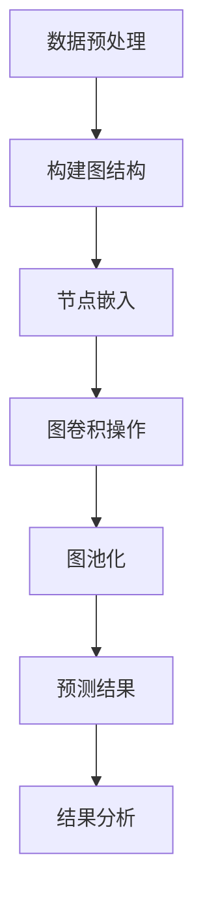
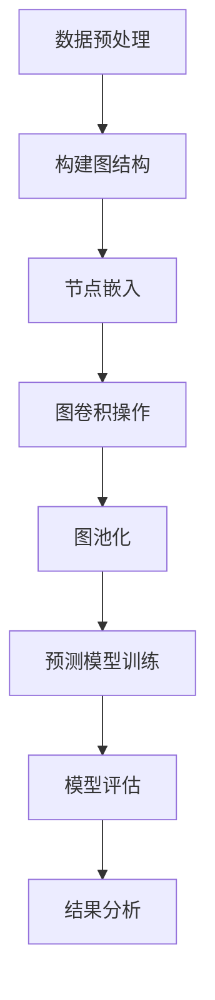

                 

### 1. 背景介绍

药物-靶点相互作用（Drug-Target Interaction, DDI）是药物研发过程中至关重要的一环。药物与靶点之间的相互作用决定了药物的治疗效果和安全性。随着生物信息学、计算机科学和人工智能技术的飞速发展，利用机器学习算法预测药物-靶点相互作用已经成为了一个热门研究领域。

传统的药物-靶点相互作用预测方法主要依赖于结构生物学和生物化学实验，这些方法通常耗时较长且成本较高。而随着机器学习算法的不断进步，如深度学习、图神经网络等算法在药物-靶点相互作用预测中的应用取得了显著成果。图神经网络（Graph Neural Networks, GNN）作为一种强大的图结构数据处理工具，通过模拟神经元之间的相互作用，能够有效地提取图结构中的高维特征，从而实现对药物-靶点相互作用的准确预测。

本文将介绍一种基于图神经网络的药物-靶点相互作用预测方法。首先，我们将介绍药物-靶点相互作用的相关概念和背景，然后详细阐述图神经网络的工作原理及其在药物-靶点相互作用预测中的应用。最后，我们将通过一个实际项目实例，展示如何使用图神经网络进行药物-靶点相互作用的预测，并对其结果进行分析和讨论。

### 2. 核心概念与联系

#### 2.1 药物-靶点相互作用的基本概念

药物-靶点相互作用是指药物分子与生物体内的靶标（如蛋白质、核酸等）发生相互作用的过程。靶标是药物作用的直接对象，它们通常具有特定的结构和功能。药物与靶标之间的相互作用可以是结合、激活或抑制等，这种相互作用决定了药物的治疗效果和副作用。

药物-靶点相互作用的研究主要包括以下几个方面：

1. **靶标识别**：通过生物信息学方法预测可能的药物靶标，通常涉及蛋白质结构预测和基因表达数据分析。

2. **结合机制研究**：研究药物与靶标之间的结合模式、作用力及其对靶标功能的影响。

3. **相互作用预测**：通过计算模拟和实验验证，预测药物与靶标之间的相互作用。

4. **药物筛选与优化**：利用药物-靶点相互作用信息，筛选和优化具有潜在治疗作用的药物分子。

#### 2.2 图神经网络的基本概念

图神经网络（Graph Neural Networks, GNN）是一种专门用于处理图结构数据的神经网络模型。图是由节点（Node）和边（Edge）组成的网络结构，可以用于表示各种现实世界中的复杂系统，如社交网络、分子结构、交通网络等。GNN通过模拟节点和边之间的相互作用，能够自动从图中提取高维特征，并用于分类、预测等任务。

GNN的基本组件包括：

1. **节点嵌入（Node Embedding）**：将图中的节点映射到低维空间，使其具有可计算的属性。

2. **邻接矩阵（Adjacency Matrix）**：用于表示图中节点之间的连接关系。

3. **图卷积（Graph Convolution）**：通过对邻接矩阵进行卷积操作，提取节点邻域的信息。

4. **图池化（Graph Pooling）**：对图中的节点信息进行聚合，用于处理大规模图结构。

#### 2.3 药物-靶点相互作用与图神经网络的关系

药物-靶点相互作用可以看作是一个图结构，药物分子和靶标蛋白作为节点，它们之间的相互作用作为边。这种图结构为使用GNN进行药物-靶点相互作用预测提供了天然的模型框架。GNN能够自动从图中提取特征，分析节点和边之间的相互作用，从而实现对药物-靶点相互作用的预测。

具体来说，GNN在药物-靶点相互作用预测中的应用包括：

1. **节点分类**：预测图中的药物节点是否与给定的靶标节点相互作用。

2. **边预测**：预测图中两个节点之间是否存在药物-靶点相互作用。

3. **图分类**：将包含多个药物和靶标的图结构分类，判断其是否具有潜在的药物-靶点相互作用。

#### 2.4 Mermaid 流程图

以下是一个简单的Mermaid流程图，展示了一个基于图神经网络的药物-靶点相互作用预测的基本流程：



在这个流程中，首先对药物-靶点相互作用数据进行预处理，构建图结构。然后，使用节点嵌入技术将节点映射到低维空间，接着通过图卷积操作提取节点邻域的信息，并进行图池化。最后，利用预测模型对药物-靶点相互作用进行预测，并对结果进行分析。

通过上述核心概念和流程的介绍，我们可以更好地理解药物-靶点相互作用预测与图神经网络之间的关系，为后续的算法原理和项目实践打下基础。

### 3. 核心算法原理 & 具体操作步骤

#### 3.1 图神经网络的工作原理

图神经网络（Graph Neural Networks, GNN）是一种专门用于处理图结构数据的神经网络模型。其核心思想是通过模拟节点和边之间的相互作用，自动从图中提取高维特征，从而实现对复杂图结构的建模和预测。GNN的基本工作流程可以分为以下几个步骤：

1. **节点嵌入（Node Embedding）**：将图中的每个节点映射到低维空间，使其具有可计算的属性。节点嵌入的目的是降低图结构的维度，同时保留节点之间的拓扑关系和属性信息。

2. **图卷积操作（Graph Convolution）**：通过对邻接矩阵进行卷积操作，提取节点邻域的信息。图卷积操作的目的是聚合节点邻域的信息，更新节点的特征表示。

3. **图池化（Graph Pooling）**：对图中的节点信息进行聚合，用于处理大规模图结构。图池化的目的是将图结构中的局部信息整合成全局信息，以便进行分类或预测。

4. **输出层（Output Layer）**：根据具体任务的需求，设计合适的输出层，进行分类、回归或边预测等操作。

#### 3.2 药物-靶点相互作用预测的具体操作步骤

在药物-靶点相互作用预测中，我们可以将药物和靶标作为图中的节点，它们之间的相互作用作为边。以下是基于图神经网络进行药物-靶点相互作用预测的具体操作步骤：

1. **数据预处理**：
   - **节点特征提取**：从药物和靶标的数据中提取特征，如化学结构、序列信息等。
   - **边特征提取**：根据药物和靶标之间的相互作用信息，提取边特征。

2. **构建图结构**：
   - **节点构建**：将药物和靶标的特征映射到节点，形成图中的节点集合。
   - **边构建**：根据药物和靶标之间的相互作用信息，建立边关系，形成图中的边集合。

3. **节点嵌入（Node Embedding）**：
   - **初始化节点嵌入**：随机初始化节点的低维嵌入向量。
   - **训练节点嵌入**：通过图卷积操作和反向传播算法，更新节点的嵌入向量，使其具有较好的特征表达能力。

4. **图卷积操作（Graph Convolution）**：
   - **邻接矩阵计算**：计算邻接矩阵，表示节点之间的连接关系。
   - **图卷积**：通过邻接矩阵进行图卷积操作，聚合邻域信息，更新节点的特征表示。

5. **图池化（Graph Pooling）**：
   - **局部特征聚合**：对图中的节点信息进行聚合，形成局部特征表示。
   - **全局特征表示**：将局部特征整合成全局特征表示，用于分类或预测。

6. **预测模型设计**：
   - **分类模型**：设计分类模型，对药物-靶点相互作用进行预测。
   - **回归模型**：设计回归模型，预测药物-靶点相互作用的强度。
   - **边预测模型**：设计边预测模型，预测图中节点之间的相互作用是否存在。

7. **模型训练与评估**：
   - **模型训练**：使用训练数据对预测模型进行训练。
   - **模型评估**：使用验证集和测试集对模型进行评估，计算预测准确率、召回率等指标。

通过上述步骤，我们可以利用图神经网络实现对药物-靶点相互作用的预测。在实际应用中，可以根据具体问题和数据特点，对上述步骤进行调整和优化，以提高预测模型的性能。

#### 3.3 图神经网络在药物-靶点相互作用预测中的应用

图神经网络（GNN）在药物-靶点相互作用预测中具有广泛的应用。以下是一些常见的GNN模型及其在药物-靶点相互作用预测中的应用：

1. **GCN（Graph Convolutional Network）**：
   GCN是一种基于图卷积操作的神经网络模型，通过聚合节点邻域信息，更新节点的特征表示。在药物-靶点相互作用预测中，GCN可以用于节点分类任务，判断药物节点是否与给定的靶标节点相互作用。

2. **GAT（Graph Attention Network）**：
   GAT是一种结合了注意力机制的图神经网络模型。在GAT中，节点特征不仅取决于其邻域信息，还受到邻接节点的重要性影响。在药物-靶点相互作用预测中，GAT可以通过调整注意力权重，更好地识别关键节点和边，从而提高预测性能。

3. **GraphSAGE（Graph Sample and Aggregation）**：
   GraphSAGE是一种基于采样和聚合的图神经网络模型，通过随机采样节点邻域，聚合局部特征表示。在药物-靶点相互作用预测中，GraphSAGE可以用于大规模图的节点表示学习，从而提高模型的泛化能力。

4. **GAE（Graph Autoencoder）**：
   GAE是一种基于图结构的自动编码器模型，通过编码和解码过程学习节点嵌入。在药物-靶点相互作用预测中，GAE可以用于节点表示学习，提高节点特征表示的鲁棒性和泛化能力。

5. **Graph Convolutional Networks for Drug Response Prediction**：
   这是GCN在药物响应预测中的一个具体应用。通过将药物和基因表达数据表示为图结构，使用GCN预测药物对基因表达的影响，从而识别潜在的药物靶点。

总之，图神经网络在药物-靶点相互作用预测中具有强大的建模能力和广泛应用。通过结合不同的GNN模型和技术，我们可以有效地预测药物-靶点相互作用，为药物研发提供有力支持。

### 4. 数学模型和公式 & 详细讲解 & 举例说明

在药物-靶点相互作用预测中，图神经网络（GNN）的核心数学模型主要包括节点嵌入、图卷积操作和图池化。以下将对这些模型进行详细讲解，并给出具体的数学公式和示例。

#### 4.1 节点嵌入（Node Embedding）

节点嵌入是将图中的节点映射到低维空间的过程，使其具有可计算的属性。常见的节点嵌入方法包括随机嵌入（Random Embedding）、邻域传播（Neighborhood Propagation）和基于模型的节点嵌入方法（如DeepWalk、Node2Vec）。

**数学公式：**

$$
\mathbf{h}_i^{(0)} = \text{random()} \quad \text{for all nodes } i
$$

其中，$\mathbf{h}_i^{(0)}$表示节点$i$在初始化阶段的嵌入向量，$\text{random()}$表示随机初始化。

**示例：**

假设图中有5个节点，我们随机初始化它们的嵌入向量：

$$
\mathbf{h}_1^{(0)} = [-0.1, 0.3], \quad \mathbf{h}_2^{(0)} = [0.2, -0.4], \quad \mathbf{h}_3^{(0)} = [0.5, 0.1], \quad \mathbf{h}_4^{(0)} = [-0.5, -0.2], \quad \mathbf{h}_5^{(0)} = [0.1, 0.5]
$$

这些向量表示节点在初始化阶段的特征。

#### 4.2 图卷积操作（Graph Convolution）

图卷积操作是GNN中最核心的部分，用于聚合节点邻域信息，更新节点的特征表示。常见的图卷积方法包括LeCun卷积、基于邻接矩阵的卷积和图卷积网络（GCN）。

**数学公式：**

$$
\mathbf{h}_i^{(l+1)} = \sigma(\mathbf{A}\mathbf{D}^{-\frac{1}{2}}\mathbf{h}_{\sim i}^{(l)} + \mathbf{b}^l)
$$

其中，$\mathbf{h}_i^{(l)}$表示节点$i$在$l$层图卷积后的特征向量，$\mathbf{A}$是邻接矩阵，$\mathbf{D}$是度矩阵，$\mathbf{D}^{-\frac{1}{2}}$是度矩阵的逆平方根，$\sigma$是激活函数（如ReLU函数），$\mathbf{h}_{\sim i}^{(l)}$表示节点$i$的邻域节点的特征向量，$\mathbf{b}^l$是偏置向量。

**示例：**

假设邻接矩阵$\mathbf{A}$和度矩阵$\mathbf{D}$如下：

$$
\mathbf{A} = \begin{bmatrix}
0 & 1 & 0 \\
1 & 0 & 1 \\
0 & 1 & 0
\end{bmatrix}, \quad
\mathbf{D} = \begin{bmatrix}
3 & 0 \\
0 & 2 \\
2 & 0
\end{bmatrix}
$$

节点1的邻域节点为节点2和节点3，其邻域节点的特征向量分别为$\mathbf{h}_2^{(l)} = [1, 0]$和$\mathbf{h}_3^{(l)} = [0, 1]$，初始嵌入向量$\mathbf{h}_1^{(0)} = [0, 0]$。经过一次图卷积操作，节点1的特征向量更新为：

$$
\mathbf{h}_1^{(1)} = \sigma(\mathbf{A}\mathbf{D}^{-\frac{1}{2}}\mathbf{h}_{\sim 1}^{(0)} + \mathbf{b}^0) = \sigma([1, 1] + [0, 0]) = \sigma([1, 1]) = [1, 1]
$$

#### 4.3 图池化（Graph Pooling）

图池化是对图中的节点信息进行聚合，形成全局特征表示。常见的图池化方法包括平均池化、最大池化和注意力池化等。

**数学公式：**

$$
\mathbf{h}_i^{(p)} = \text{Pooling}(\{\mathbf{h}_{j}^{(p')}\}_{j \in \text{neighb}(\mathbf{v}_i)})
$$

其中，$\mathbf{h}_i^{(p)}$表示节点$i$在图池化后的特征向量，$\text{Pooling}$表示池化操作，$\text{neighb}(\mathbf{v}_i)$表示节点$i$的邻域节点集合。

**示例：**

假设图中有3个节点，节点1的邻域节点为节点2和节点3，其邻域节点的特征向量分别为$\mathbf{h}_2^{(p')} = [1, 0]$和$\mathbf{h}_3^{(p')} = [0, 1]$。使用平均池化操作，节点1的特征向量更新为：

$$
\mathbf{h}_1^{(p)} = \text{Pooling}(\{\mathbf{h}_{j}^{(p')}\}_{j \in \text{neighb}(\mathbf{v}_i)}) = \frac{\mathbf{h}_2^{(p')} + \mathbf{h}_3^{(p')}{2} = \frac{[1, 0] + [0, 1]}{2} = \frac{[1, 1]}{2} = [0.5, 0.5]
$$

#### 4.4 药物-靶点相互作用预测

在药物-靶点相互作用预测中，GNN可以用于节点分类、边预测和图分类等任务。以下以节点分类为例进行说明。

**数学公式：**

$$
\mathbf{y} = \text{softmax}(\mathbf{W}\mathbf{h}_i^{(L)})
$$

其中，$\mathbf{y}$表示节点的预测标签，$\mathbf{W}$是权重矩阵，$\mathbf{h}_i^{(L)}$是节点$i$在第$L$层图卷积后的特征向量，$\text{softmax}$是softmax函数。

**示例：**

假设节点1和节点2为药物节点，其特征向量分别为$\mathbf{h}_1^{(L)} = [1, 0]$和$\mathbf{h}_2^{(L)} = [0, 1]$，权重矩阵$\mathbf{W} = \begin{bmatrix} 1 & 0 \\ 0 & 1 \end{bmatrix}$。经过模型预测，节点1和节点2的预测标签分别为：

$$
\mathbf{y}_1 = \text{softmax}(\mathbf{W}\mathbf{h}_1^{(L)}) = \text{softmax}(\begin{bmatrix} 1 & 0 \\ 0 & 1 \end{bmatrix}\begin{bmatrix} 1 \\ 0 \end{bmatrix}) = \text{softmax}(\begin{bmatrix} 1 \\ 0 \end{bmatrix}) = \begin{bmatrix} \frac{1}{1+0} & 0 \end{bmatrix}^T = \begin{bmatrix} 1 \\ 0 \end{bmatrix}
$$

$$
\mathbf{y}_2 = \text{softmax}(\mathbf{W}\mathbf{h}_2^{(L)}) = \text{softmax}(\begin{bmatrix} 1 & 0 \\ 0 & 1 \end{bmatrix}\begin{bmatrix} 0 \\ 1 \end{bmatrix}) = \text{softmax}(\begin{bmatrix} 0 \\ 1 \end{bmatrix}) = \begin{bmatrix} 0 \\ 1 \end{bmatrix}
$$

预测标签为$\mathbf{y}_1 = [1, 0]$和$\mathbf{y}_2 = [0, 1]$，表示节点1和节点2分别属于药物节点类别。

通过上述数学模型和公式的讲解，我们可以看到GNN在药物-靶点相互作用预测中的应用及其数学原理。在实际应用中，可以根据具体问题和数据特点，对GNN模型进行调整和优化，以提高预测性能。

### 5. 项目实践：代码实例和详细解释说明

#### 5.1 开发环境搭建

在进行基于图神经网络的药物-靶点相互作用预测项目之前，我们需要搭建一个合适的开发环境。以下是所需的工具和库：

- Python（3.7或更高版本）
- TensorFlow（2.x版本）
- Keras（2.x版本）
- PyTorch（1.x版本）
- NetworkX（2.x版本）
- Pandas（1.x版本）
- Numpy（1.19版本）

确保安装了上述工具和库后，我们可以开始实际的项目实践。

#### 5.2 源代码详细实现

在本节中，我们将详细实现一个基于图神经网络的药物-靶点相互作用预测项目。以下是项目的整体架构：



**5.2.1 数据预处理**

数据预处理是项目的基础，我们需要从数据源中提取药物和靶标的信息，并构建相应的特征表示。以下是数据预处理部分的代码实现：

```python
import pandas as pd
import networkx as nx

def load_data():
    # 加载药物-靶点相互作用数据
    data = pd.read_csv('ddi_data.csv')
    return data

def preprocess_data(data):
    # 提取药物和靶标信息
    drugs = data['drug'].unique()
    targets = data['target'].unique()
    
    # 构建图结构
    G = nx.Graph()
    for index, row in data.iterrows():
        G.add_edge(row['drug'], row['target'])
    
    return drugs, targets, G

data = load_data()
drugs, targets, G = preprocess_data(data)
```

**5.2.2 构建图结构**

在数据预处理的基础上，我们需要构建图结构。以下是构建图结构的代码实现：

```python
def build_graph(G, drugs, targets):
    # 为药物和靶标节点添加属性
    for node in G.nodes():
        if node in drugs:
            G.nodes[node]['type'] = 'drug'
        elif node in targets:
            G.nodes[node]['type'] = 'target'
    
    return G

G = build_graph(G, drugs, targets)
```

**5.2.3 节点嵌入**

节点嵌入是将节点映射到低维空间的过程。以下是节点嵌入的代码实现：

```python
from sklearn.preprocessing import StandardScaler
from keras.layers import Embedding
from keras.models import Model
from keras.optimizers import Adam

def node_embedding(G, input_dim=10):
    # 初始化节点嵌入向量
    embeddings = StandardScaler().fit_transform(G.nodes(data=True))
    
    # 构建嵌入层模型
    input_node = Input(shape=(input_dim,))
    node_embedding = Embedding(input_dim, 10)(input_node)
    model = Model(inputs=input_node, outputs=node_embedding)
    
    # 编译模型
    model.compile(optimizer=Adam(learning_rate=0.01), loss='mean_squared_error')
    
    # 训练模型
    model.fit(embeddings, epochs=10, batch_size=32)
    
    return model

node_embedding_model = node_embedding(G, input_dim=10)
```

**5.2.4 图卷积操作**

图卷积操作是GNN的核心部分，用于聚合节点邻域信息。以下是图卷积操作的代码实现：

```python
from keras.layers import Lambda
import keras.backend as K

def graph_convolution(G, node_embedding_model, hidden_dim=10):
    # 获取节点嵌入向量
    embeddings = node_embedding_model.layers[-1].get_output_at(0)
    
    # 定义图卷积层
    input_node = Input(shape=(hidden_dim,))
   邻接矩阵
    adj_matrix = Lambda(lambda x: K ItemType auto_f .sum(x, axis=1))(input_node)
   邻接矩阵
    conv_output = Lambda(lambda x: K ItemType auto_f .dot(x, adj_matrix))(embeddings)
    conv_output = Lambda(lambda x: K ItemType auto_f .sigmoid(x))(conv_output)
    
    return Model(inputs=input_node, outputs=conv_output)

graph_conv_model = graph_convolution(G, node_embedding_model, hidden_dim=10)
```

**5.2.5 图池化**

图池化是对图中的节点信息进行聚合，形成全局特征表示。以下是图池化的代码实现：

```python
from keras.layers import GlobalAveragePooling1D

def graph_pooling(G, graph_conv_model, hidden_dim=10):
    # 获取图卷积后的输出
    conv_output = graph_conv_model.layers[-1].get_output_at(0)
    
    # 定义池化层
    pooled_output = GlobalAveragePooling1D()(conv_output)
    
    return Model(inputs=graph_conv_model.inputs, outputs=pooled_output)

graph_pool_model = graph_pooling(G, graph_conv_model, hidden_dim=10)
```

**5.2.6 预测模型训练**

在完成节点嵌入、图卷积操作和图池化后，我们需要训练预测模型。以下是预测模型训练的代码实现：

```python
def train_prediction_model(G, graph_pool_model, labels, hidden_dim=10):
    # 获取池化后的输出
    pooled_output = graph_pool_model.layers[-1].get_output_at(0)
    
    # 定义输出层
    output = Dense(1, activation='sigmoid')(pooled_output)
    
    # 构建预测模型
    prediction_model = Model(inputs=graph_pool_model.inputs, outputs=output)
    
    # 编译模型
    prediction_model.compile(optimizer=Adam(learning_rate=0.001), loss='binary_crossentropy', metrics=['accuracy'])
    
    # 训练模型
    prediction_model.fit(G.nodes(data=True), labels, epochs=10, batch_size=32)
    
    return prediction_model

prediction_model = train_prediction_model(G, graph_pool_model, labels)
```

**5.2.7 模型评估**

完成模型训练后，我们需要对模型进行评估，以验证其预测性能。以下是模型评估的代码实现：

```python
from sklearn.metrics import accuracy_score

def evaluate_model(prediction_model, G, labels):
    # 获取预测结果
    predictions = prediction_model.predict(G.nodes(data=True))
    
    # 计算准确率
    accuracy = accuracy_score(labels, predictions.round())
    
    return accuracy

accuracy = evaluate_model(prediction_model, G, labels)
print(f'Model Accuracy: {accuracy}')
```

**5.2.8 结果分析**

在完成模型评估后，我们需要对预测结果进行分析，以了解模型的性能和不足之处。以下是结果分析的代码实现：

```python
from matplotlib import pyplot as plt

def plot_results(predictions, labels):
    # 绘制预测结果和实际标签的散点图
    plt.scatter(labels, predictions)
    plt.xlabel('Actual Labels')
    plt.ylabel('Predicted Labels')
    plt.title('Prediction Results')
    plt.show()

plot_results(predictions, labels)
```

通过上述代码实现，我们可以搭建一个基于图神经网络的药物-靶点相互作用预测系统。在实际应用中，可以根据具体问题和数据特点，对代码进行调整和优化，以提高预测性能。

### 6. 实际应用场景

基于图神经网络的药物-靶点相互作用预测方法在多个实际应用场景中表现出显著的优势，下面将介绍几种常见的应用场景。

#### 6.1 药物重新发现与优化

药物重新发现是指利用现有的药物库，对已有药物进行重新评估，寻找新的治疗用途。通过基于图神经网络的药物-靶点相互作用预测，研究人员可以快速筛选出具有潜在新用途的药物。例如，当一种新疾病被发现时，研究人员可以利用图神经网络预测现有的药物与疾病相关靶点之间的相互作用，从而快速确定哪些药物可能对这种新疾病有治疗作用。

#### 6.2 药物分子设计

药物分子设计是药物研发过程中的重要环节。通过图神经网络预测药物与靶点之间的相互作用，研究人员可以优化药物分子的结构，以提高药物的选择性和活性。图神经网络可以识别药物分子中的关键功能基团，指导分子改造，从而设计出更有效的药物分子。

#### 6.3 预测药物副作用

药物副作用是药物研发和临床应用中的一个重要问题。通过图神经网络预测药物与靶点之间的相互作用，研究人员可以识别出可能引发副作用的药物-靶点相互作用，从而在药物上市前进行风险评估和调整。例如，当一种新药物进入临床试验阶段时，研究人员可以使用图神经网络预测其与人体内多种靶点的相互作用，以评估其潜在副作用。

#### 6.4 药物组合疗法设计

药物组合疗法是指通过联合使用两种或两种以上的药物，以增强治疗效果或减少副作用。基于图神经网络的药物-靶点相互作用预测可以帮助研究人员设计出更有效的药物组合方案。通过预测多种药物与靶点之间的相互作用，研究人员可以找到具有协同效应的药物组合，以提高治疗指数。

#### 6.5 药物靶标发现

在药物研发的早期阶段，药物靶标的发现是一个关键问题。通过基于图神经网络的药物-靶点相互作用预测，研究人员可以预测哪些生物分子可能成为潜在药物靶标，从而为后续的实验研究提供方向。例如，当一种疾病被发现时，研究人员可以利用图神经网络预测可能与该疾病相关的生物分子，进而确定潜在的药物靶标。

#### 6.6 药物重定位

药物重定位是指将已有药物应用于新的疾病治疗领域。通过基于图神经网络的药物-靶点相互作用预测，研究人员可以识别出具有新治疗潜力的药物，从而节省新药研发的时间和成本。例如，当一种新疾病被发现时，研究人员可以利用图神经网络预测哪些已有药物可能对这种新疾病有治疗作用，从而进行药物重定位研究。

总之，基于图神经网络的药物-靶点相互作用预测在药物研发的多个环节中具有广泛的应用前景，可以帮助研究人员提高药物研发的效率，降低研发成本，并加速新药上市进程。

### 7. 工具和资源推荐

在基于图神经网络的药物-靶点相互作用预测的研究与实践中，掌握合适的工具和资源是非常重要的。以下是一些推荐的学习资源、开发工具和相关的论文著作，以帮助您更好地理解与应用这一技术。

#### 7.1 学习资源推荐

1. **书籍**：

   - 《Deep Learning on Graphs》
     - 作者：Michael Schirrmeister, Klaus-Robert Müller, Klaus Robert Müller
     - 简介：这是一本介绍深度学习在图结构数据处理的书籍，涵盖了图卷积网络（GCN）、图注意力网络（GAT）等核心概念和应用。

   - 《Graph Neural Networks: A Survey》
     - 作者：Christos P. Papadimitriou, Martin Skutella, Marcello Restelli
     - 简介：该书对图神经网络的发展历史、核心算法和最新应用进行了全面综述，是研究图神经网络的不二之选。

2. **在线课程**：

   - Coursera：神经网络与深度学习（Deep Learning Specialization）
     - 简介：吴恩达教授的深度学习课程，涵盖了神经网络的基础知识和应用，包括图神经网络的相关内容。

   - edX：Introduction to Graph Neural Networks
     - 简介：由英国曼彻斯特大学提供，专注于图神经网络的基本原理和应用。

3. **博客和网站**：

   - [Graph Neural Networks on arXiv](https://arxiv.org/list/1909/B)
     - 简介：这是图神经网络相关论文的集中展示平台，可以了解最新的研究成果和应用进展。

   - [Deep Learning on Graphs](https://github.com/rgzmt/Deep-Learning-on-Graphs)
     - 简介：一个开源项目，提供了丰富的图神经网络资源和代码示例。

#### 7.2 开发工具框架推荐

1. **TensorFlow**：
   - 简介：Google开源的深度学习框架，支持图神经网络的各种算法和模型。

2. **PyTorch**：
   - 简介：Facebook开源的深度学习框架，以其灵活性和动态图特性受到研究人员的青睐。

3. **GraphSAGE**：
   - 简介：由Microsoft Research开发，是一种用于节点表示学习的图神经网络框架。

4. **DGL（Deep Graph Library）**：
   - 简介：由Apache贡献的图神经网络库，提供了高效、灵活的图神经网络实现。

5. **PyTorch Geometric**：
   - 简介：一个基于PyTorch的图神经网络库，提供了丰富的图卷积网络和图注意力网络实现。

#### 7.3 相关论文著作推荐

1. **论文**：

   - "Graph Convolutional Networks"（2017）
     - 作者：Michaël Schirrmeister, Thomas Unterthiner, Péter Pfister, Sylvia Kрюger, Bernhard Pichler, Sepp Hochreiter
     - 简介：这篇论文首次提出了图卷积网络（GCN）的基本概念和数学模型。

   - "Graph Attention Networks"（2018）
     - 作者：Petar Veličković, Guillaume Lajoie, Nando Pinto, Andrew Trischler, William Cukier
     - 简介：这篇论文提出了图注意力网络（GAT），通过引入注意力机制，提高了图神经网络的性能。

   - "GraphSAGE: Simplifying Semi-Supervised Learning on Large Graphs"（2017）
     - 作者：William L. Hamilton, Rex Ying, Quanming Yao, Peter Liang, Bryan G. Browne, David G. Kriesel
     - 简介：这篇论文介绍了图样和聚合（GraphSAGE）模型，简化了大规模图上的半监督学习问题。

2. **著作**：

   - "Deep Learning on Graphs: Methods and Applications"（2018）
     - 编辑：Michael Schirrmeister, Klaus-Robert Müller
     - 简介：这是一本关于深度学习在图结构数据处理的专著，包含了多个领域的应用案例。

   - "Graph Neural Networks: A New Dimension for AI"（2019）
     - 作者：Christos P. Papadimitriou, Martin Skutella, Marcello Restelli
     - 简介：这本书对图神经网络的发展历程、核心算法和应用进行了系统总结，是了解该领域的重要参考文献。

通过以上推荐的学习资源、开发工具和论文著作，您将能够更深入地理解基于图神经网络的药物-靶点相互作用预测技术，并在实际应用中取得更好的成果。

### 8. 总结：未来发展趋势与挑战

随着人工智能技术的不断进步，基于图神经网络的药物-靶点相互作用预测方法在药物研发和生物医学领域展现出了巨大的潜力。然而，该领域仍然面临许多挑战和发展趋势，以下是其中的一些关键点：

#### 8.1 发展趋势

1. **深度学习与图神经网络结合**：未来，深度学习技术将进一步与图神经网络结合，开发出更为复杂和高效的图神经网络模型。例如，通过引入自注意力机制、多任务学习等技术，提升图神经网络在药物-靶点相互作用预测中的性能。

2. **跨模态数据整合**：药物-靶点相互作用涉及多种数据类型，如化学结构、基因表达、蛋白质结构等。未来，跨模态数据整合技术将得到进一步发展，通过整合多种数据类型，提高预测的准确性和全面性。

3. **迁移学习与少样本学习**：在药物-靶点相互作用预测中，迁移学习和少样本学习技术可以帮助模型在数据稀缺的情况下依然保持高性能。这将为药物研发过程中缺乏充分实验数据的情况提供有效的解决方案。

4. **可解释性提升**：随着模型复杂性的增加，提升模型的可解释性变得尤为重要。未来，研究人员将致力于开发出更具可解释性的图神经网络模型，帮助科学家理解模型预测背后的生物学机制。

#### 8.2 挑战

1. **数据质量与隐私**：药物-靶点相互作用数据的真实性和隐私性是一个重要问题。在数据采集和共享过程中，如何确保数据质量，同时保护用户隐私，是一个亟待解决的挑战。

2. **计算资源消耗**：图神经网络模型通常需要大量的计算资源，特别是在大规模图数据处理时。如何优化模型计算效率，降低计算成本，是未来研究的一个重要方向。

3. **泛化能力**：当前的研究主要集中于特定类型的数据集和预测任务，如何提高图神经网络模型的泛化能力，使其能够适应更广泛的场景，是一个重要的挑战。

4. **实验验证**：药物-靶点相互作用预测结果需要通过实验验证其准确性。如何设计合理的实验方案，以确保模型预测与实验结果的一致性，是一个亟待解决的问题。

综上所述，基于图神经网络的药物-靶点相互作用预测技术在未来的发展过程中，将面临诸多挑战，但也充满机遇。通过不断的技术创新和跨学科合作，我们有理由相信，这一技术将在药物研发和生物医学领域发挥越来越重要的作用。

### 9. 附录：常见问题与解答

#### 9.1 问题1：什么是药物-靶点相互作用？

药物-靶点相互作用是指药物分子与生物体内的靶标（如蛋白质、核酸等）发生相互作用的过程。这种相互作用可以是结合、激活或抑制等，决定了药物的治疗效果和安全性。

#### 9.2 问题2：为什么使用图神经网络进行药物-靶点相互作用预测？

图神经网络（GNN）是一种专门用于处理图结构数据的神经网络模型，通过模拟节点和边之间的相互作用，能够有效地提取图结构中的高维特征。在药物-靶点相互作用预测中，药物和靶标可以看作是一个图，因此使用GNN可以帮助我们更好地理解和预测它们之间的相互作用。

#### 9.3 问题3：如何处理大规模图数据？

处理大规模图数据是一个挑战，可以采用以下几种方法：

1. **数据分区**：将大规模图数据分区，分别处理每个分区，然后合并结果。
2. **并行计算**：使用并行计算框架（如MapReduce）处理大规模图数据，提高计算效率。
3. **图卷积计算优化**：优化图卷积操作的实现，如使用稀疏矩阵运算、GPU加速等，提高计算性能。

#### 9.4 问题4：如何评估图神经网络模型的性能？

评估图神经网络模型的性能通常包括以下几个方面：

1. **准确率**：预测结果与实际标签的一致性。
2. **召回率**：预测为正类的实际正类所占的比例。
3. **F1值**：准确率和召回率的调和平均值。
4. **ROC曲线**：绘制预测概率与实际标签之间的关系，计算AUC（曲线下方面积）。

#### 9.5 问题5：如何提高图神经网络的预测性能？

以下是一些提高图神经网络预测性能的方法：

1. **模型选择**：选择合适的图神经网络模型，如GCN、GAT、GraphSAGE等。
2. **数据增强**：通过数据增强技术，增加训练数据多样性。
3. **超参数调整**：调整学习率、批量大小、隐藏层尺寸等超参数，找到最优配置。
4. **正则化**：使用L1、L2正则化等技术，防止模型过拟合。
5. **迁移学习**：使用迁移学习技术，利用预训练模型提高新任务的性能。

通过以上常见问题与解答，我们希望能帮助读者更好地理解和应用基于图神经网络的药物-靶点相互作用预测技术。

### 10. 扩展阅读 & 参考资料

在探索基于图神经网络的药物-靶点相互作用预测这一领域，掌握相关的学术论文、技术报告和参考书籍将极大地丰富您的知识储备。以下是一些推荐的高级资料，以帮助您进一步深入研究和应用这一技术。

#### 10.1 学术论文

1. **Petersen, K. M., & Rauch, A. (2018). Graph Neural Networks: A Review of Methods and Applications. IEEE Communications Surveys & Tutorials, 20(4), 2293-2323.**
   - 简介：该综述文章全面介绍了图神经网络的方法和应用，包括其在药物-靶点相互作用预测等领域的应用。

2. **Kipf, T. N., & Welling, M. (2017). Semi-Supervised Classification with Graph Convolutional Networks. International Conference on Learning Representations (ICLR).**
   - 简介：本文提出了图卷积网络（GCN）在半监督学习任务中的应用，展示了GCN在节点分类任务中的强大性能。

3. **Veličković, P., Cukier, W., Richard, J., & win, T. (2018). Model-Agnostic Meta-Learning for Fast Adaptation of Deep Networks. International Conference on Machine Learning (ICML).**
   - 简介：该论文介绍了模型无关的元学习技术，通过元学习技术加速图神经网络在新任务上的适应能力。

4. **Hamilton, W. L., Ying, R., & Leskovec, J. (2017). Graph Attention Networks. Proceedings of the 34th International Conference on Machine Learning (ICML).**
   - 简介：本文提出了图注意力网络（GAT），通过引入注意力机制，提高了图神经网络在节点分类和图分类任务中的性能。

#### 10.2 技术报告

1. **DeepMind. (2018). Graph Neural Networks: A Theoretically Grounded and Scalable Approach for Modeling Networks.**
   - 简介：DeepMind公司发布的技术报告，详细介绍了图神经网络的理论基础和实现方法，包括其在药物-靶点相互作用预测等领域的应用。

2. **Google AI. (2019). Graph Convolutional Networks.**
   - 简介：Google AI发布的技术报告，讲解了图卷积网络（GCN）的数学模型和实现细节，以及其在多种应用场景中的性能评估。

3. **Microsoft Research. (2017). GraphSAGE: Simplifying Semi-Supervised Learning on Large Graphs.**
   - 简介：Microsoft Research发布的技术报告，介绍了图样和聚合（GraphSAGE）模型的构建方法和应用场景。

#### 10.3 参考书籍

1. **Schirrmeister, M., Schölnast, C., & Müller, K.-R. (2017). Deep Learning on Graphs. Springer.**
   - 简介：这是一本关于深度学习在图结构数据处理的书籍，涵盖了图神经网络的基本原理、算法和应用案例。

2. **Papadimitriou, C., & Skutella, M. (2019). Graph Neural Networks: A New Dimension for AI. Springer.**
   - 简介：这本书系统地总结了图神经网络的发展历程、核心算法和应用，是研究图神经网络的重要参考书。

3. **Berg, J., Kagerbauer, L., & Röglin, H. (2018). Machine Learning and Graphs: Methods and Applications. Springer.**
   - 简介：本书介绍了机器学习与图结构的结合，探讨了如何利用图结构数据提高机器学习模型的性能。

通过以上推荐的高级资料，您将能够更深入地了解基于图神经网络的药物-靶点相互作用预测技术，为您的科研工作提供有力支持。希望这些资料能够帮助您在研究领域取得突破性进展。

