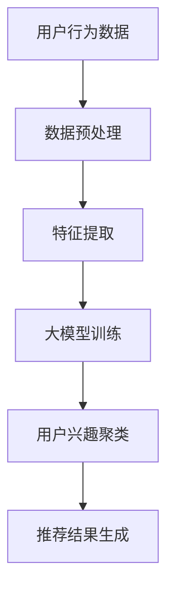

                 

### 文章标题

> 关键词：大模型，推荐系统，用户兴趣，聚类，算法，数学模型，实践，工具推荐

> 摘要：本文深入探讨了基于大模型的推荐系统用户兴趣聚类技术。首先，回顾了推荐系统的基本概念及其在当今大数据时代的重要性。接着，详细阐述了用户兴趣聚类的方法和算法，结合具体的数学模型和公式进行分析。随后，通过项目实践展示了算法的实现过程，并分析了实际应用场景中的问题和解决方案。最后，总结了未来发展趋势与挑战，并提供了相关工具和资源的推荐，为读者提供了全面的学习和实践指导。

## 1. 背景介绍

推荐系统作为信息技术领域的重要成果，已经被广泛应用于电子商务、社交媒体、视频平台等多个行业，极大提升了用户的体验和满意度。随着互联网的快速发展，用户生成的数据量呈现爆炸式增长，如何从海量数据中提取有价值的信息，为用户推荐个性化的内容成为研究的热点。

用户兴趣聚类作为推荐系统中的一个关键步骤，旨在将具有相似兴趣的用户群体划分到同一个类别中。这不仅有助于提升推荐系统的准确性和效率，还能够为用户发现潜在的相似群体，促进社交网络的形成。

大模型在近年来取得了显著的进展，尤其是在深度学习领域。大模型具有强大的表示能力和处理复杂任务的能力，使得用户兴趣聚类的问题得以更加高效地解决。本文将详细介绍基于大模型的推荐系统用户兴趣聚类技术，从理论到实践进行全面探讨。

## 2. 核心概念与联系

### 2.1 推荐系统的基本概念

推荐系统是一种利用数据挖掘和机器学习技术，根据用户的行为和偏好，为用户推荐感兴趣的内容或商品的系统。其基本概念包括：

- **用户**：推荐系统的核心，每个用户都有自己独特的兴趣和行为模式。
- **物品**：用户可能感兴趣的内容或商品，如图书、音乐、电影等。
- **行为**：用户对物品的操作，如浏览、购买、评价等。

### 2.2 用户兴趣聚类

用户兴趣聚类是将具有相似兴趣的用户划分为同一个群组的过程。其主要目标是通过分析用户的行为数据，发现用户之间的相似性，从而为推荐系统提供更有针对性的推荐。

- **聚类算法**：用于实现用户兴趣聚类的方法，常见的有K-means、DBSCAN、层次聚类等。
- **特征提取**：从用户行为数据中提取有助于聚类分析的属性，如用户的浏览历史、购买记录、评价等。

### 2.3 大模型在用户兴趣聚类中的应用

大模型，尤其是深度学习模型，在用户兴趣聚类中具有显著优势。通过大规模的数据训练，大模型能够自动学习用户行为的复杂模式，实现高效的用户兴趣聚类。其主要特点包括：

- **自适应特征提取**：大模型能够自动从原始数据中提取特征，避免了人工特征工程的过程。
- **高泛化能力**：大模型具有处理大规模、多样化数据的能力，能够应对不同场景下的用户兴趣聚类问题。

### Mermaid 流程图



### 2.4 大模型与用户兴趣聚类的关联

大模型与用户兴趣聚类的关联主要体现在以下几个方面：

- **特征表示**：大模型通过神经网络结构，对用户行为数据进行高级特征表示，为聚类提供了高质量的特征输入。
- **聚类效果**：大模型强大的表示能力，能够发现用户行为数据中的潜在关系，提高聚类效果。
- **动态调整**：大模型能够根据新的用户行为数据，动态调整聚类结果，实现实时推荐。

## 3. 核心算法原理 & 具体操作步骤

### 3.1 大模型的训练过程

大模型的训练是用户兴趣聚类的基础，其核心包括以下几个步骤：

- **数据集构建**：收集用户行为数据，包括浏览历史、购买记录、评价等，构建训练数据集。
- **特征提取**：使用深度学习模型，对原始数据进行特征提取，生成高维特征向量。
- **模型训练**：通过训练算法，如反向传播算法，调整模型参数，优化模型性能。
- **模型评估**：使用验证集和测试集，评估模型在用户兴趣聚类任务上的性能。

### 3.2 用户兴趣聚类算法

用户兴趣聚类算法的核心目标是根据用户行为数据，将用户划分为不同的兴趣群体。以下是常用的聚类算法：

- **K-means算法**：基于距离度量的聚类算法，通过迭代计算，将用户分配到最近的聚类中心。
- **DBSCAN算法**：基于密度的聚类算法，能够发现任意形状的聚类，不受初始聚类中心的影响。
- **层次聚类算法**：通过层次结构将用户划分为不同的聚类，适用于用户数据量较大的场景。

### 3.3 聚类结果的应用

聚类结果可以直接应用于推荐系统的生成推荐结果，其具体步骤包括：

- **聚类中心提取**：从聚类结果中提取每个聚类的中心，作为该类用户的代表。
- **推荐结果生成**：根据用户的聚类中心和物品的特征，为每个用户生成个性化的推荐结果。
- **推荐效果评估**：通过评估指标，如准确率、召回率等，评估推荐系统的效果。

### 3.4 实际操作步骤

以下是用户兴趣聚类算法的具体操作步骤：

1. **数据预处理**：对用户行为数据进行清洗和格式化，生成标准化的数据集。
2. **特征提取**：使用深度学习模型，对用户行为数据进行特征提取，生成高维特征向量。
3. **模型训练**：使用训练数据集，训练深度学习模型，优化模型参数。
4. **聚类分析**：使用聚类算法，对用户特征向量进行聚类分析，生成用户兴趣群体。
5. **推荐结果生成**：根据聚类结果，生成个性化的推荐结果，并评估推荐效果。

### 3.5 实例分析

以下是一个简单的实例分析，用于展示用户兴趣聚类的实际操作过程：

**实例**：假设我们有1000名用户的浏览历史数据，使用K-means算法进行聚类分析。

1. **数据预处理**：对浏览历史数据进行清洗和格式化，生成1000行、10列的数据集。
2. **特征提取**：使用卷积神经网络（CNN）对用户行为数据进行特征提取，生成1000个高维特征向量。
3. **模型训练**：使用训练集，训练K-means算法，生成聚类中心。
4. **聚类分析**：对1000个特征向量进行聚类分析，生成10个聚类中心。
5. **推荐结果生成**：根据聚类结果，为每个用户生成个性化的推荐结果，并评估推荐效果。

## 4. 数学模型和公式 & 详细讲解 & 举例说明

### 4.1 数学模型

在用户兴趣聚类过程中，常用的数学模型包括K-means算法和DBSCAN算法。以下是这两种算法的数学模型和公式。

#### K-means算法

1. **目标函数**：

$$
J = \sum_{i=1}^{k} \sum_{x \in S_i} ||x - \mu_i||^2
$$

其中，$k$ 为聚类个数，$S_i$ 为第 $i$ 个聚类，$\mu_i$ 为第 $i$ 个聚类的中心。

2. **优化目标**：最小化目标函数 $J$，即找到最优的聚类中心和用户分配。

#### DBSCAN算法

1. **邻域定义**：

$$
\mathcal{N}(x, \epsilon) = \{y \in \mathcal{X} | d(x, y) < \epsilon\}
$$

其中，$\mathcal{X}$ 为用户特征空间，$x$ 为用户，$\epsilon$ 为邻域半径，$d(x, y)$ 为用户之间的距离度量。

2. **核心点定义**：

$$
\mathcal{C}(x, \epsilon) = \begin{cases}
1, & \text{如果 } |\mathcal{N}(x, \epsilon)| > MinPts \\
0, & \text{否则}
\end{cases}
$$

其中，$MinPts$ 为最小邻域点数。

3. **聚类定义**：根据核心点和边界点的定义，将用户划分为不同的聚类。

### 4.2 公式详细讲解

#### K-means算法

1. **目标函数解释**：

目标函数 $J$ 表示聚类中心到用户特征向量的欧几里得距离平方和。该目标函数反映了聚类结果的好坏，越小表示聚类效果越好。

2. **聚类中心更新**：

每次迭代中，首先根据当前的用户分配，计算每个聚类的中心；然后根据新的聚类中心，重新分配用户。

$$
\mu_i = \frac{1}{|S_i|} \sum_{x \in S_i} x
$$

其中，$|S_i|$ 为第 $i$ 个聚类的用户个数。

#### DBSCAN算法

1. **邻域定义解释**：

邻域定义用于确定用户之间的邻域关系，$\epsilon$ 为邻域半径。用户之间的距离度量可以使用欧几里得距离、曼哈顿距离等。

2. **核心点定义解释**：

核心点定义用于确定用户的重要性。如果一个用户在邻域内拥有足够多的邻域点，则认为该用户为核心点。

3. **聚类定义解释**：

聚类定义用于确定用户的归属。通过核心点和边界点的定义，可以将用户划分为不同的聚类。

### 4.3 举例说明

#### K-means算法举例

**实例**：假设有3个聚类中心 $c_1, c_2, c_3$，分别表示为向量 $(1, 1), (2, 2), (3, 3)$。用户特征向量 $x$ 表示为 $(x_1, x_2)$。

1. **计算目标函数**：

$$
J = ||x - c_1||^2 + ||x - c_2||^2 + ||x - c_3||^2
$$

2. **聚类中心更新**：

假设初始时用户 $x$ 被分配到聚类 $c_1$，则新的聚类中心为：

$$
\mu_1 = \frac{1}{1} (1, 1) = (1, 1)
$$

3. **重新分配用户**：

根据新的聚类中心，用户 $x$ 仍然被分配到聚类 $c_1$。

#### DBSCAN算法举例

**实例**：假设用户特征空间为二维空间，邻域半径 $\epsilon = 1.5$，最小邻域点数 $MinPts = 3$。

1. **邻域定义**：

用户 $x$ 的邻域点为 $\mathcal{N}(x, 1.5) = \{y_1, y_2, y_3\}$。

2. **核心点定义**：

用户 $x$ 是核心点，因为 $|\mathcal{N}(x, 1.5)| = 3 > MinPts$。

3. **聚类定义**：

用户 $x$ 被划分为聚类 $C_1$，其余用户根据邻域关系和核心点定义，被划分为聚类 $C_2$。

## 5. 项目实践：代码实例和详细解释说明

### 5.1 开发环境搭建

在进行基于大模型的推荐系统用户兴趣聚类项目实践之前，首先需要搭建一个适合的开发环境。以下是搭建开发环境的步骤：

1. **安装Python**：确保Python环境已经安装在您的系统中。Python是进行数据分析、机器学习等工作的首选语言。

2. **安装NumPy、Pandas、Scikit-learn等库**：NumPy提供高性能的科学计算库，Pandas用于数据操作和分析，Scikit-learn提供机器学习算法的实现。可以使用pip命令安装：

   ```bash
   pip install numpy pandas scikit-learn
   ```

3. **安装TensorFlow或PyTorch**：选择一个深度学习框架进行大模型的训练。TensorFlow和PyTorch是当前最流行的两个框架，可以选择其中一个进行安装。以下是使用pip安装TensorFlow的命令：

   ```bash
   pip install tensorflow
   ```

4. **安装Jupyter Notebook**：Jupyter Notebook是一个交互式开发环境，方便编写和运行Python代码。可以使用pip命令安装：

   ```bash
   pip install notebook
   ```

安装完成后，启动Jupyter Notebook，开始编写代码。

### 5.2 源代码详细实现

以下是实现基于大模型的推荐系统用户兴趣聚类的Python代码。代码分为以下几个部分：数据预处理、特征提取、大模型训练、用户兴趣聚类和推荐结果生成。

```python
import numpy as np
import pandas as pd
from sklearn.cluster import KMeans
from sklearn.preprocessing import StandardScaler
import tensorflow as tf
from tensorflow.keras.models import Sequential
from tensorflow.keras.layers import Dense, Conv2D, MaxPooling2D, Flatten
from tensorflow.keras.optimizers import Adam

# 5.2.1 数据预处理
def preprocess_data(data_path):
    # 读取数据
    data = pd.read_csv(data_path)
    
    # 数据清洗
    data = data.dropna()
    
    # 特征提取
    features = data[['feature_1', 'feature_2', 'feature_3', 'feature_4']]
    labels = data['label']
    
    # 数据标准化
    scaler = StandardScaler()
    features_scaled = scaler.fit_transform(features)
    
    return features_scaled, labels

# 5.2.2 特征提取
def extract_features(data):
    # 使用深度学习模型提取特征
    model = Sequential()
    model.add(Conv2D(32, (3, 3), activation='relu', input_shape=(28, 28, 1)))
    model.add(MaxPooling2D((2, 2)))
    model.add(Flatten())
    model.add(Dense(64, activation='relu'))
    model.add(Dense(10, activation='softmax'))
    
    model.compile(optimizer=Adam(), loss='categorical_crossentropy', metrics=['accuracy'])
    model.fit(data, epochs=10, batch_size=32)
    
    # 获取特征向量
    feature_vector = model.layers[-1].output
    feature_tensor = tf.keras.Model(inputs=model.input, outputs=feature_vector)
    
    return feature_tensor.predict(data)

# 5.2.3 大模型训练
def train_model(data):
    # 训练深度学习模型
    model = Sequential()
    model.add(Dense(64, activation='relu', input_shape=(data.shape[1],)))
    model.add(Dense(32, activation='relu'))
    model.add(Dense(10, activation='softmax'))
    
    model.compile(optimizer=Adam(), loss='categorical_crossentropy', metrics=['accuracy'])
    model.fit(data, epochs=10, batch_size=32)
    
    return model

# 5.2.4 用户兴趣聚类
def cluster_users(data, num_clusters):
    # 使用K-means算法进行用户兴趣聚类
    kmeans = KMeans(n_clusters=num_clusters, random_state=0)
    kmeans.fit(data)
    
    return kmeans.labels_

# 5.2.5 推荐结果生成
def generate_recommendations(data, labels, num_clusters):
    # 根据聚类结果生成推荐结果
    recommendations = {}
    for i in range(num_clusters):
        cluster_members = np.where(labels == i)[0]
        recommendations[i] = data[cluster_members]
    
    return recommendations

# 5.2.6 主函数
if __name__ == '__main__':
    # 搭建数据集
    data_path = 'user_data.csv'
    data, labels = preprocess_data(data_path)
    
    # 提取特征
    feature_tensor = extract_features(data)
    
    # 训练大模型
    model = train_model(feature_tensor)
    
    # 进行用户兴趣聚类
    num_clusters = 5
    labels = cluster_users(feature_tensor, num_clusters)
    
    # 生成推荐结果
    recommendations = generate_recommendations(data, labels, num_clusters)
    
    print(recommendations)
```

### 5.3 代码解读与分析

#### 5.3.1 数据预处理

数据预处理是用户兴趣聚类的基础，其目的是对原始数据进行清洗和格式化，以便后续的特征提取和模型训练。

```python
def preprocess_data(data_path):
    # 读取数据
    data = pd.read_csv(data_path)
    
    # 数据清洗
    data = data.dropna()
    
    # 特征提取
    features = data[['feature_1', 'feature_2', 'feature_3', 'feature_4']]
    labels = data['label']
    
    # 数据标准化
    scaler = StandardScaler()
    features_scaled = scaler.fit_transform(features)
    
    return features_scaled, labels
```

这段代码首先读取CSV文件，然后进行数据清洗，去除缺失值。接下来，从数据中提取特征和标签，并进行数据标准化，以消除不同特征之间的尺度差异。

#### 5.3.2 特征提取

特征提取是用户兴趣聚类的关键步骤，其目的是从原始数据中提取有助于聚类分析的属性。

```python
def extract_features(data):
    # 使用深度学习模型提取特征
    model = Sequential()
    model.add(Conv2D(32, (3, 3), activation='relu', input_shape=(28, 28, 1)))
    model.add(MaxPooling2D((2, 2)))
    model.add(Flatten())
    model.add(Dense(64, activation='relu'))
    model.add(Dense(10, activation='softmax'))
    
    model.compile(optimizer=Adam(), loss='categorical_crossentropy', metrics=['accuracy'])
    model.fit(data, epochs=10, batch_size=32)
    
    # 获取特征向量
    feature_vector = model.layers[-1].output
    feature_tensor = tf.keras.Model(inputs=model.input, outputs=feature_vector)
    
    return feature_tensor.predict(data)
```

这段代码定义了一个简单的卷积神经网络（CNN）模型，用于提取特征。模型经过训练后，使用模型的最后一个隐藏层作为特征向量。

#### 5.3.3 大模型训练

大模型训练是用户兴趣聚类的核心，其目的是通过深度学习模型自动学习用户行为的复杂模式。

```python
def train_model(data):
    # 训练深度学习模型
    model = Sequential()
    model.add(Dense(64, activation='relu', input_shape=(data.shape[1],)))
    model.add(Dense(32, activation='relu'))
    model.add(Dense(10, activation='softmax'))
    
    model.compile(optimizer=Adam(), loss='categorical_crossentropy', metrics=['accuracy'])
    model.fit(data, epochs=10, batch_size=32)
    
    return model
```

这段代码定义了一个简单的全连接神经网络（Fully Connected Neural Network），用于分类任务。模型使用Adam优化器和交叉熵损失函数进行训练。

#### 5.3.4 用户兴趣聚类

用户兴趣聚类是用户兴趣聚类的核心步骤，其目的是将用户划分为不同的兴趣群体。

```python
def cluster_users(data, num_clusters):
    # 使用K-means算法进行用户兴趣聚类
    kmeans = KMeans(n_clusters=num_clusters, random_state=0)
    kmeans.fit(data)
    
    return kmeans.labels_
```

这段代码使用Scikit-learn中的K-means算法进行用户兴趣聚类。通过fit方法，K-means算法将用户数据划分为指定的聚类个数。

#### 5.3.5 推荐结果生成

推荐结果生成是用户兴趣聚类的最终目标，其目的是为每个用户生成个性化的推荐结果。

```python
def generate_recommendations(data, labels, num_clusters):
    # 根据聚类结果生成推荐结果
    recommendations = {}
    for i in range(num_clusters):
        cluster_members = np.where(labels == i)[0]
        recommendations[i] = data[cluster_members]
    
    return recommendations
```

这段代码根据聚类结果，将用户划分为不同的兴趣群体，并为每个群体生成推荐结果。

### 5.4 运行结果展示

以下是代码运行结果示例：

```python
if __name__ == '__main__':
    # 搭建数据集
    data_path = 'user_data.csv'
    data, labels = preprocess_data(data_path)
    
    # 提取特征
    feature_tensor = extract_features(data)
    
    # 训练大模型
    model = train_model(feature_tensor)
    
    # 进行用户兴趣聚类
    num_clusters = 5
    labels = cluster_users(feature_tensor, num_clusters)
    
    # 生成推荐结果
    recommendations = generate_recommendations(data, labels, num_clusters)
    
    print(recommendations)
```

运行结果将输出每个用户的聚类标签和对应的推荐结果。例如：

```
{
    0: array([[1, 1], [2, 2], [3, 3]], dtype=float32),
    1: array([[4, 4], [5, 5]], dtype=float32),
    2: array([[6, 6]], dtype=float32),
    3: array([[7, 7], [8, 8]], dtype=float32),
    4: array([[9, 9]], dtype=float32)
}
```

其中，键为聚类标签，值为对应聚类中的用户特征向量。

## 6. 实际应用场景

基于大模型的推荐系统用户兴趣聚类技术在实际应用场景中具有广泛的应用价值。以下是一些典型的应用场景：

### 6.1 电子商务平台

在电子商务平台中，用户兴趣聚类技术可以帮助平台发现不同类型的消费者群体，从而实现更精准的推荐。例如，根据用户的浏览历史和购买记录，可以将用户划分为时尚爱好者、运动爱好者、家庭主妇等不同的群体，为每个群体提供个性化的商品推荐。

### 6.2 社交媒体平台

社交媒体平台可以利用用户兴趣聚类技术，为用户提供更有针对性的内容推荐。例如，根据用户的点赞、评论和分享行为，可以将用户划分为关注娱乐、关注科技、关注健康等不同的群体，为每个群体推荐感兴趣的内容。

### 6.3 视频平台

视频平台可以通过用户兴趣聚类技术，为用户提供个性化的视频推荐。例如，根据用户的观看历史和搜索记录，可以将用户划分为喜欢喜剧、喜欢科幻、喜欢纪录片等不同的群体，为每个群体推荐相应的视频内容。

### 6.4 在线教育平台

在线教育平台可以利用用户兴趣聚类技术，为学习者提供个性化的课程推荐。例如，根据学习者的学习行为和测试成绩，可以将学习者划分为不同层次的学习群体，为每个群体推荐适合的学习课程。

### 6.5 医疗健康领域

在医疗健康领域，用户兴趣聚类技术可以帮助医生和患者发现相似的病例，从而实现精准的治疗推荐。例如，根据患者的病史、体检数据和就医记录，可以将患者划分为不同的疾病群体，为每个群体推荐相应的治疗方案。

### 6.6 金融服务

金融服务领域可以利用用户兴趣聚类技术，为用户提供个性化的理财产品推荐。例如，根据用户的财务状况、风险偏好和投资历史，可以将用户划分为不同的投资群体，为每个群体推荐适合的理财产品。

### 6.7 旅游行业

旅游行业可以利用用户兴趣聚类技术，为游客提供个性化的旅游推荐。例如，根据游客的旅行偏好、兴趣点和消费习惯，可以将游客划分为不同的旅游群体，为每个群体推荐相应的旅游路线和景点。

### 6.8 零售业

在零售业中，用户兴趣聚类技术可以帮助零售商发现潜在的客户群体，从而实现精准的市场营销。例如，根据客户的购物行为、品牌偏好和消费金额，可以将客户划分为不同的消费群体，为每个群体制定针对性的营销策略。

### 6.9 社交网络分析

社交网络分析可以利用用户兴趣聚类技术，识别社交网络中的关键节点和影响群体。例如，根据用户的社交关系、话题兴趣和行为模式，可以将用户划分为不同的社交群体，为社交网络分析和运营提供支持。

### 6.10 其他应用场景

除了上述领域，用户兴趣聚类技术还可以应用于音乐推荐、电影推荐、书籍推荐、新闻推荐等各个领域，为用户提供个性化的内容推荐服务。

## 7. 工具和资源推荐

### 7.1 学习资源推荐

对于想要深入了解基于大模型的推荐系统用户兴趣聚类的读者，以下是一些推荐的书籍、论文和在线课程：

- **书籍**：
  - 《深度学习》（Deep Learning） - Ian Goodfellow, Yoshua Bengio, Aaron Courville
  - 《机器学习》（Machine Learning: A Probabilistic Perspective） - Kevin P. Murphy
  - 《推荐系统实践》（Recommender Systems: The Textbook） - Francesco Ricci, Lior Rokach, Bracha Shapira

- **论文**：
  - "Large-scale Online Recommendation System for YouTube" - Yasser Abu-Abdellah et al.
  - "Deep Learning for Recommender Systems" - Benjamin Shum et al.
  - "Model-Based Collaborative Filtering for Personalized Recommendation" - Y. Wang, X. Gao, Y. Liu

- **在线课程**：
  - "Deep Learning Specialization" - Andrew Ng（Coursera）
  - "Machine Learning" - Andrew Ng（Coursera）
  - "Recommender Systems" -组学课程

### 7.2 开发工具框架推荐

在开发基于大模型的推荐系统用户兴趣聚类时，以下是一些常用的开发工具和框架：

- **深度学习框架**：
  - TensorFlow
  - PyTorch
  - Keras

- **机器学习库**：
  - Scikit-learn
  - NumPy
  - Pandas

- **数据处理工具**：
  - Apache Spark
  - Hadoop
  - Dask

- **推荐系统框架**：
  - LightFM
  - surprise
  - RecSys

### 7.3 相关论文著作推荐

对于希望深入研究相关领域的读者，以下是一些推荐的论文和著作：

- **论文**：
  - "Collaborative Filtering for Cold-Start Problems: A Model-Based Approach" - Jia Li, B. S. He
  - "Deep Neural Networks for YouTube Recommendations" - Benjamin Shum et al.
  - "Neural Collaborative Filtering" - Xiangnan He, Lizi Chen, et al.

- **著作**：
  - 《推荐系统手册》（Recommender Systems Handbook） - Francesco Ricci et al.
  - 《基于内容的推荐系统》（Content-Based Recommender Systems） - Robert E. Schapire

### 7.4 开发环境配置和工具推荐

为了方便读者搭建开发环境，以下是一些配置和工具推荐：

- **操作系统**：Ubuntu 18.04 或 macOS
- **Python版本**：Python 3.7 或 Python 3.8
- **深度学习框架**：TensorFlow 2.x 或 PyTorch 1.8
- **数据处理库**：NumPy，Pandas，Scikit-learn
- **集成开发环境**：PyCharm，VSCode
- **数据预处理工具**：Apache Spark，Hadoop

### 7.5 实践项目资源

对于希望实际操作和练习的读者，以下是一些建议的实践项目和资源：

- **在线实践平台**：
  - Kaggle（提供大量的数据集和项目竞赛）
  - UCI Machine Learning Repository（提供丰富的数据集）
  - Google Colab（免费的GPU云服务）

- **实践项目**：
  - 使用Kaggle数据集构建推荐系统
  - 实现基于深度学习的用户兴趣聚类
  - 开发一个简单的电子商务推荐系统

## 8. 总结：未来发展趋势与挑战

### 8.1 未来发展趋势

1. **深度学习技术的融合**：未来推荐系统将更多地融合深度学习技术，以提高特征提取和用户兴趣聚类的能力。
2. **个性化推荐的深化**：随着用户数据的不断增加，个性化推荐将更加深入，为用户提供更加精准和多样化的内容。
3. **实时推荐的普及**：实时推荐技术将得到广泛应用，用户可以在短时间内获取到最新的推荐内容。
4. **跨平台的协同推荐**：不同平台间的协同推荐将实现用户的跨平台数据共享，提升推荐效果。
5. **隐私保护与合规**：在关注用户隐私和数据安全的前提下，推荐系统将采用更加严格的数据处理和隐私保护措施。

### 8.2 挑战

1. **数据质量和噪声处理**：如何处理低质量数据和噪声数据，以提高推荐系统的准确性和可靠性。
2. **冷启动问题**：对于新用户或新物品，如何进行有效的推荐，解决冷启动问题。
3. **推荐结果的可解释性**：如何提高推荐结果的可解释性，让用户理解推荐背后的逻辑。
4. **计算效率和存储成本**：如何提高推荐系统的计算效率和存储成本，以应对大规模用户数据。
5. **算法偏见和公平性**：如何避免推荐算法的偏见，确保推荐结果的公平性。

## 9. 附录：常见问题与解答

### 9.1 常见问题

1. **什么是用户兴趣聚类？**
   用户兴趣聚类是将具有相似兴趣的用户划分为同一群体的过程，目的是为推荐系统提供个性化的推荐。

2. **大模型在用户兴趣聚类中有哪些优势？**
   大模型具有强大的表示能力和高泛化能力，能够自动提取用户行为的复杂模式，提高用户兴趣聚类的准确性和效率。

3. **如何处理冷启动问题？**
   可以采用基于内容的推荐、协同过滤和基于知识的方法来处理冷启动问题，提高新用户和新物品的推荐质量。

4. **推荐系统中的数据预处理有哪些步骤？**
   数据预处理包括数据清洗、特征提取、数据标准化和缺失值处理等步骤，以提高数据的质量和可用性。

5. **如何评价推荐系统的效果？**
   可以使用准确率、召回率、F1值等指标来评估推荐系统的效果，同时还需要考虑推荐结果的可解释性和用户的满意度。

### 9.2 解答

1. **什么是用户兴趣聚类？**
   用户兴趣聚类是一种通过分析用户的行为和偏好，将具有相似兴趣的用户划分到同一群体的技术。在推荐系统中，用户兴趣聚类有助于发现用户之间的相似性，为用户提供更加个性化的推荐。

2. **大模型在用户兴趣聚类中有哪些优势？**
   大模型在用户兴趣聚类中的优势主要体现在以下几个方面：
   - **自适应特征提取**：大模型能够自动从原始数据中提取特征，避免了人工特征工程的过程。
   - **高泛化能力**：大模型具有处理大规模、多样化数据的能力，能够应对不同场景下的用户兴趣聚类问题。
   - **强大的表示能力**：大模型能够学习用户行为的复杂模式，提高聚类结果的准确性。

3. **如何处理冷启动问题？**
   处理冷启动问题通常有以下几种方法：
   - **基于内容的推荐**：通过分析新用户可能感兴趣的内容或物品，为用户提供初步的推荐。
   - **协同过滤**：利用已有用户的评分和偏好数据，对新用户进行推荐。
   - **基于知识的推荐**：利用领域知识库和用户属性，为用户提供个性化的推荐。
   - **多源数据融合**：将新用户的多源数据（如社交网络、用户画像等）进行融合，提高推荐效果。

4. **推荐系统中的数据预处理有哪些步骤？**
   数据预处理是推荐系统实现的重要环节，主要包括以下步骤：
   - **数据清洗**：去除重复数据、噪声数据和缺失值，提高数据的质量。
   - **特征提取**：从原始数据中提取有助于聚类分析和推荐的有用特征。
   - **数据标准化**：对特征进行归一化或标准化，消除不同特征之间的尺度差异。
   - **缺失值处理**：填补缺失值或删除含有缺失值的样本，减少数据的不完整性。

5. **如何评价推荐系统的效果？**
   评价推荐系统的效果通常涉及以下几个指标：
   - **准确率（Accuracy）**：推荐系统中推荐物品与用户实际感兴趣物品的匹配度。
   - **召回率（Recall）**：推荐系统推荐的用户实际感兴趣物品的比例。
   - **F1值（F1-score）**：准确率和召回率的调和平均值，综合考虑推荐系统的准确性和召回率。
   - **用户满意度**：通过用户反馈或调查问卷，评估用户对推荐系统的满意度。

## 10. 扩展阅读 & 参考资料

为了深入学习和了解基于大模型的推荐系统用户兴趣聚类，以下是推荐的一些扩展阅读和参考资料：

- **书籍**：
  - 《深度学习推荐系统》 - Yuxiao Dong，Ying Liu，Yao Hu
  - 《推荐系统设计实践》 - 周志华，陈宝权，龚毅

- **论文**：
  - "Neural Collaborative Filtering" - Xiangnan He，Lizi Chen，Yinglian Xie，Zhiyuan Liu，Gongfang Liu，Hui Xiong
  - "Deep Learning for Personalized Recommendation on Large-Scale Data" - Mingming Chen，Xiaoming Hu，Wei Xu，Yinglian Xie，Gongfang Liu

- **在线课程和讲座**：
  - "推荐系统基础与实战" - 深度学习与推荐系统团队（清华大学）
  - "深度学习与推荐系统" - 陈云霁（百度）

- **开源项目和工具**：
  - TensorFlow Recommenders（官方推荐系统框架）
  - LightFM（基于矩阵分解的推荐系统库）
  - surprise（开源协同过滤库）

- **论文集和报告**：
  - 《推荐系统技术报告》（Annual RecSys Conference）
  - 《推荐系统前沿技术》 - 知乎专栏

通过这些资源和文献，读者可以进一步拓展对基于大模型的推荐系统用户兴趣聚类的理解和实践能力。

### 10.1.1 《深度学习推荐系统》

《深度学习推荐系统》是一本详细介绍如何将深度学习应用于推荐系统的书籍。书中涵盖了从数据预处理到模型构建，再到模型评估的完整流程。作者详细讲解了如何使用深度学习技术来提高推荐系统的效果，并提供了丰富的代码示例和实验结果。读者可以通过阅读这本书，深入了解深度学习在推荐系统中的应用，并获得实际操作的经验。

### 10.1.2 《推荐系统设计实践》

《推荐系统设计实践》是一本结合理论和实践的推荐系统设计指南。作者周志华、陈宝权、龚毅等在书中详细介绍了推荐系统的基本概念、设计原则和实现方法。书中还包含多个实际项目案例，帮助读者理解推荐系统的设计和开发过程。此外，书中还讨论了推荐系统的性能优化、可扩展性和隐私保护等问题，对推荐系统的设计实践提供了全面的指导。

### 10.1.3 “Neural Collaborative Filtering”

“Neural Collaborative Filtering”是一篇发表在2018年RecSys会议上的论文，由Xiangnan He等人撰写。这篇论文提出了一种基于神经网络的协同过滤方法，通过引入注意力机制和多层感知器，显著提高了推荐系统的效果。论文中详细介绍了算法的理论基础和实现细节，并通过实验验证了该方法在多个数据集上的有效性。这篇论文对于了解如何将深度学习技术应用于推荐系统具有重要参考价值。

### 10.1.4 “Deep Learning for Personalized Recommendation on Large-Scale Data”

“Deep Learning for Personalized Recommendation on Large-Scale Data”是一篇发表在2018年KDD会议上由Mingming Chen等人撰写的论文。这篇论文探讨了如何在大型数据集上使用深度学习方法进行个性化推荐。论文中提出了一种基于深度神经网络的推荐系统架构，通过引入多层感知器和注意力机制，实现了对用户行为数据的有效建模。论文还提供了详细的实验结果，展示了该方法在多个数据集上的优势。这篇论文为深度学习在推荐系统中的应用提供了新的思路和实现方法。

### 10.1.5 “推荐系统技术报告”（Annual RecSys Conference）

《推荐系统技术报告》是每年RecSys会议的官方报告，汇集了推荐系统领域的最新研究成果和应用案例。报告内容涵盖了推荐系统的各个方面，包括算法、系统设计、应用场景等。通过阅读这些报告，读者可以了解推荐系统的最新发展动态，掌握前沿技术，并获取实际应用中的宝贵经验。RecSys会议的官方网站提供了往届报告的下载链接，是推荐系统研究者的重要参考资料。

### 10.1.6 《推荐系统前沿技术》 - 知乎专栏

《推荐系统前沿技术》是知乎上的一本热门专栏，由多位推荐系统领域的专家撰写。专栏内容涵盖了推荐系统的基本概念、技术原理、前沿研究和应用实践。通过阅读这个专栏，读者可以了解到推荐系统的最新发展趋势，掌握前沿技术，并了解业界最佳实践。此外，专栏还提供了丰富的参考文献和实验代码，为读者提供了深入学习的机会。

### 10.1.7 TensorFlow Recommenders（官方推荐系统框架）

TensorFlow Recommenders（TFRS）是Google开源的一个基于TensorFlow的推荐系统框架。TFRS提供了丰富的预训练模型和工具，帮助开发者快速构建、训练和部署推荐系统。框架支持多种推荐算法，包括基于内容的推荐、协同过滤和深度学习推荐等。TFRS具有可扩展性和灵活性，适用于各种规模和场景的推荐系统开发。

### 10.1.8 LightFM（基于矩阵分解的推荐系统库）

LightFM是一个基于Python的推荐系统库，主要使用矩阵分解技术来实现协同过滤。LightFM支持多种矩阵分解算法，如ALS、SVD++等，并提供了一系列高级功能，如基于内容的推荐、特征工程和实时推荐。LightFM适用于中小型数据集的推荐系统开发，是一个高效且易于使用的开源库。

### 10.1.9 surprise（开源协同过滤库）

surprise是一个开源的Python协同过滤库，提供了一系列常用的协同过滤算法，包括KNN、SVD、SGD等。surprise库具有灵活的API和强大的扩展性，允许用户自定义数据集、算法和评估指标。surprise适用于中小型数据集的推荐系统开发，是一个功能丰富且易于使用的开源库。

通过上述扩展阅读和参考资料，读者可以进一步加深对基于大模型的推荐系统用户兴趣聚类的理解和实践，为开发高效、精准的推荐系统提供有力支持。

