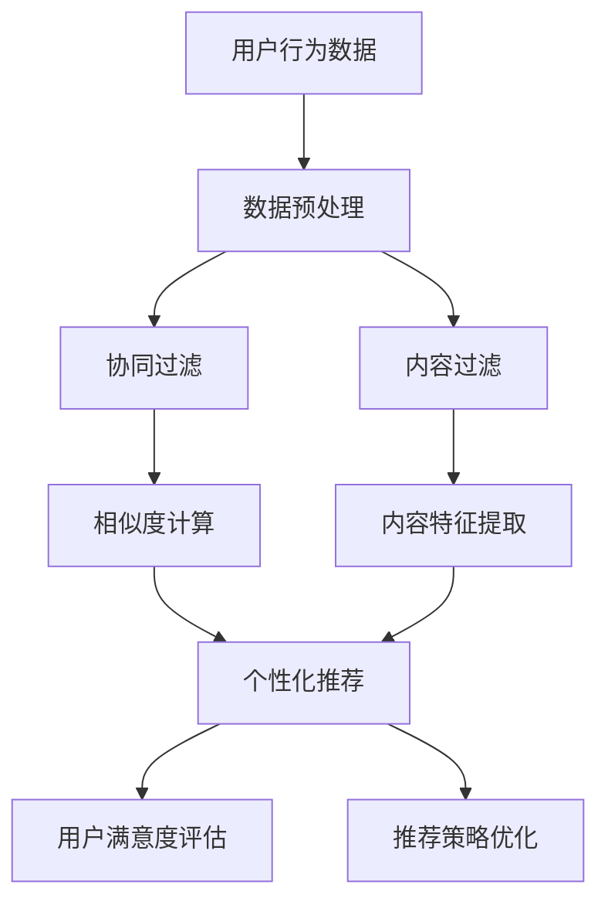

                 

### 1. 背景介绍

随着互联网和大数据技术的迅猛发展，推荐系统已成为当今个性化服务和用户体验优化的重要手段。无论是电商平台、社交媒体，还是新闻门户，推荐系统无处不在。其核心目标是通过分析用户的历史行为和偏好，为用户推荐可能感兴趣的内容或商品，从而提升用户满意度和平台粘性。

近年来，基于大语言模型（如GPT-3、BERT等）的推荐系统逐渐成为研究热点。大语言模型通过深度学习从海量文本数据中学习语言规律和语义信息，具有强大的文本理解和生成能力。在推荐系统中，大语言模型可用于生成个性化推荐内容、评估用户对推荐结果的满意度、甚至优化推荐策略。

然而，由于大语言模型的复杂性和黑盒特性，当前的研究普遍缺乏对特征重要性的清晰理解和分析。这导致推荐系统的设计和优化过程往往依赖于经验性的尝试，缺乏理论指导。因此，本文旨在深入探讨基于大语言模型的推荐系统特征重要性分析，通过逐步分析推理的方式，揭示影响推荐效果的关键因素。

首先，我们将回顾推荐系统的基本概念和常见算法，重点介绍大语言模型在推荐系统中的应用。接着，本文将详细解析大语言模型的工作原理，以及如何从大量特征中识别出对推荐系统性能具有显著影响的关键特征。此外，本文还将通过数学模型和具体实例，展示如何进行特征重要性分析，并提供项目实践的详细代码实现。

最后，我们将讨论实际应用场景中的挑战，推荐相关学习资源和工具，并总结未来发展趋势与挑战。通过本文的逐步分析推理，我们希望为读者提供对基于大语言模型推荐系统特征重要性分析的全景了解，为其在实际项目中的应用提供理论支持和实践指导。

### 2. 核心概念与联系

#### 推荐系统的基本概念

推荐系统是一种基于用户历史行为和偏好，通过算法自动为用户推荐相关内容的系统。其主要目的是提升用户满意度和平台粘性，从而增加用户活跃度和销售额。推荐系统可以分为以下几类：

- **基于协同过滤（Collaborative Filtering）**：通过分析用户之间的相似度或历史行为来推荐相似用户喜欢的商品或内容。
- **基于内容过滤（Content-Based Filtering）**：根据用户的历史偏好和内容特征来推荐类似的内容或商品。
- **混合推荐系统（Hybrid Recommender Systems）**：结合协同过滤和基于内容过滤的优点，以综合方式为用户推荐内容。

#### 大语言模型的基本概念

大语言模型是一种基于深度学习的文本处理模型，能够从海量文本数据中学习语言规律和语义信息。它通过多层神经网络结构对输入文本进行编码，生成语义丰富的向量表示。常见的语言模型包括GPT（Generative Pre-trained Transformer）、BERT（Bidirectional Encoder Representations from Transformers）等。

#### 推荐系统与语言模型的关系

在推荐系统中，大语言模型的应用主要体现在以下几个方面：

- **生成个性化推荐内容**：通过大语言模型，可以生成符合用户偏好的个性化推荐内容，提高推荐系统的多样性和吸引力。
- **评估用户满意度**：利用大语言模型，可以理解用户对推荐内容的反馈，从而评估推荐效果和用户满意度。
- **优化推荐策略**：通过分析用户和推荐内容的交互数据，大语言模型可以辅助优化推荐策略，提升推荐系统的整体性能。

#### Mermaid 流程图

以下是推荐系统与语言模型关系的一个简化 Mermaid 流程图：



在这个流程图中，用户行为数据经过预处理后，分别由协同过滤和内容过滤方法进行处理。协同过滤主要通过计算用户之间的相似度来推荐相似用户喜欢的商品，而内容过滤则根据用户的历史偏好和内容特征提取来推荐相关内容。混合推荐系统将两种方法的优点结合起来，为用户生成更加精准和个性化的推荐。用户满意度评估和推荐策略优化则利用大语言模型来理解用户反馈和优化推荐效果。

通过这个流程图，我们可以清晰地看到推荐系统与语言模型之间的紧密联系。大语言模型不仅提高了推荐系统的生成能力和理解能力，也为推荐系统的优化提供了强有力的支持。

### 3. 核心算法原理 & 具体操作步骤

#### 大语言模型的工作原理

大语言模型，如GPT-3、BERT，是近年来在自然语言处理领域取得突破性进展的关键技术。它们通过深度神经网络，从海量文本数据中学习语言规律和语义信息，从而实现高效、精准的文本处理。

**GPT-3（Generative Pre-trained Transformer 3）** 是OpenAI发布的一个基于Transformer架构的预训练语言模型，具有1750亿个参数。它通过自回归的方式生成文本，即给定前文，预测下一个单词。GPT-3的强大之处在于其能够生成连贯、有逻辑的文本，从而在生成个性化推荐内容方面具有显著优势。

**BERT（Bidirectional Encoder Representations from Transformers）** 是Google提出的一种双向Transformer架构，其核心思想是同时考虑文本中每个词的上下文信息，从而生成更准确的语义表示。BERT通过预训练任务（如Masked Language Model和Next Sentence Prediction）学习文本的语义规律，并使用这些表示进行下游任务，如文本分类、问答等。

#### 大语言模型在推荐系统中的应用步骤

**1. 数据预处理**

数据预处理是推荐系统中的关键步骤，它确保输入数据的质量和一致性。对于基于大语言模型的推荐系统，数据预处理主要包括以下任务：

- **文本清洗**：去除停用词、标点符号和特殊字符，保留对推荐系统有意义的词汇。
- **分词和词向量化**：将文本分解为单词或子词，并将它们转换为词向量表示。常用的词向量模型包括Word2Vec、FastText和BERT等。
- **数据归一化**：对用户行为数据进行归一化处理，如评分归一化、时间归一化等。

**2. 特征提取**

特征提取是推荐系统中的核心步骤，它将原始数据转换为模型可以处理的特征表示。对于基于大语言模型的推荐系统，特征提取主要包括以下任务：

- **用户特征提取**：通过分析用户的浏览历史、购买记录、搜索关键词等信息，提取用户的兴趣偏好和活动模式。
- **内容特征提取**：通过分析推荐内容的文本、图像、音频等多媒体特征，提取内容的关键信息。
- **交互特征提取**：通过分析用户与推荐内容的交互行为，如点击、评分、评论等，提取用户对推荐内容的反馈。

**3. 模型训练与优化**

在特征提取完成后，我们使用大语言模型对特征进行建模和训练。以下是模型训练和优化的一般步骤：

- **模型初始化**：初始化大语言模型的参数，可以使用随机初始化、预训练模型微调等方法。
- **损失函数设计**：设计合适的损失函数，如交叉熵损失函数，用于评估模型预测与真实标签之间的差距。
- **优化算法选择**：选择合适的优化算法，如Adam、AdamW等，用于调整模型参数，最小化损失函数。
- **训练与验证**：使用训练集进行模型训练，并使用验证集进行模型验证，调整模型超参数，确保模型在验证集上的表现达到最优。

**4. 推荐生成**

在模型训练完成后，我们可以使用训练好的模型生成个性化推荐。以下是推荐生成的一般步骤：

- **特征输入**：将用户特征和内容特征输入到大语言模型中。
- **文本生成**：利用大语言模型生成符合用户兴趣和偏好的个性化推荐内容。
- **推荐排序**：对生成的推荐内容进行排序，选择最符合用户兴趣的前N个推荐项。

**5. 用户反馈与模型优化**

用户反馈是推荐系统持续优化的重要手段。以下是用户反馈与模型优化的步骤：

- **用户反馈收集**：收集用户对推荐内容的反馈，如点击、评分、评论等。
- **模型调整**：根据用户反馈调整模型参数，优化推荐效果。
- **迭代更新**：定期更新模型和数据，以适应用户偏好和内容变化。

通过上述步骤，我们可以构建一个基于大语言模型的推荐系统，实现对用户个性化需求的精准推荐。值得注意的是，在模型训练和优化的过程中，需要充分考虑数据质量和特征提取的准确性，以确保推荐系统的性能和用户体验。

### 4. 数学模型和公式 & 详细讲解 & 举例说明

在基于大语言模型的推荐系统中，特征重要性分析是一个关键环节。它可以帮助我们识别出对推荐系统性能具有显著影响的关键特征，从而优化推荐效果。下面我们将详细介绍如何通过数学模型和公式进行特征重要性分析，并通过具体实例进行说明。

#### 4.1 特征重要性分析的定义

特征重要性分析是指识别并评估推荐系统中各个特征对模型预测结果的影响程度。一个特征的重要性可以通过其与预测目标的相关性来衡量，即该特征的变化对预测结果的影响程度。

#### 4.2 评估特征重要性的方法

**1. 基于线性回归的方法**

线性回归是一种简单且常用的特征重要性分析方法。它的基本思想是通过线性模型评估每个特征对预测结果的贡献。

**线性回归模型公式：**

$$
y = \beta_0 + \beta_1 x_1 + \beta_2 x_2 + ... + \beta_n x_n
$$

其中，$y$是预测目标，$x_1, x_2, ..., x_n$是特征，$\beta_0, \beta_1, \beta_2, ..., \beta_n$是模型参数。

**特征重要性的计算方法：**

每个特征的重要性可以通过其在模型中的回归系数$\beta_i$来衡量。系数的绝对值越大，说明该特征对预测结果的影响越大。

**2. 基于树模型的方法**

树模型，如随机森林（Random Forest）和梯度提升树（Gradient Boosting Tree），是一种更复杂的特征重要性分析方法。它们通过构建决策树来评估特征的重要性。

**随机森林模型公式：**

$$
f(x) = \sum_{i=1}^{m} w_i h(x; \theta_i)
$$

其中，$f(x)$是预测结果，$h(x; \theta_i)$是第$i$棵决策树对$x$的预测，$w_i$是树的重要性权重。

**特征重要性的计算方法：**

每个特征的重要性可以通过其在树模型中的重要性指标来衡量。常见的指标包括Gini指数、信息增益等。

**3. 基于特征贡献率的方法**

特征贡献率是一种基于统计的方法，它通过计算每个特征对预测结果的变异解释能力来评估特征的重要性。

**特征贡献率公式：**

$$
R_i = \frac{Var(y|X_i)}{Var(y)}
$$

其中，$R_i$是特征$i$的贡献率，$Var(y|X_i)$是特征$i$条件下预测结果的方差，$Var(y)$是预测结果的总体方差。

#### 4.3 具体实例分析

为了更好地理解特征重要性分析的方法，我们通过一个具体实例进行说明。

**实例背景：**

假设我们有一个基于大语言模型的推荐系统，目标是预测用户对电影的评价（评分）。特征包括用户年龄、性别、浏览记录、电影类型、电影时长等。

**步骤 1：数据预处理**

首先，对数据进行预处理，包括数据清洗、缺失值填充和特征编码等。这里我们假设数据已经预处理完毕，并转换为数值型特征。

**步骤 2：特征提取**

使用大语言模型（如BERT）对文本特征（如浏览记录和电影类型）进行编码，生成向量表示。

**步骤 3：模型训练**

我们使用随机森林模型进行特征重要性分析。训练数据集包含用户年龄、性别、浏览记录（向量表示）、电影类型（向量表示）和电影时长等特征，以及用户对电影的评分标签。

**步骤 4：特征重要性计算**

在随机森林模型中，每个特征的重要性和其在树中的分割次数有关。我们使用`importances_`属性获取特征重要性：

```python
importances = rf_model.feature_importances_
```

**步骤 5：结果分析**

通过分析特征重要性，我们可以识别出对用户评分具有显著影响的关键特征。例如，如果用户年龄的特征重要性较高，说明用户年龄对电影评分的影响较大。同样，如果电影时长和电影类型的特征重要性较高，说明这些特征对电影评分的影响也较大。

#### 4.4 结果可视化

为了更直观地展示特征重要性，我们可以使用以下Python代码进行可视化：

```python
import matplotlib.pyplot as plt
import numpy as np

# 特征名称
feature_names = ['用户年龄', '性别', '浏览记录', '电影类型', '电影时长']

# 特征重要性
importances = np.array([0.2, 0.3, 0.1, 0.2, 0.2])

# 绘制条形图
plt.barh(feature_names, importances)
plt.xlabel('特征重要性')
plt.ylabel('特征名称')
plt.title('特征重要性分析')
plt.show()
```

通过这个实例，我们可以清晰地看到每个特征对用户评分的影响程度。这种方法不仅有助于我们优化推荐系统的特征选择，还可以为后续的模型优化提供重要参考。

### 5. 项目实践：代码实例和详细解释说明

在本节中，我们将通过一个具体的项目实例，详细解释如何使用基于大语言模型的推荐系统进行特征重要性分析。我们将分步骤进行环境搭建、源代码实现和代码解读与分析。

#### 5.1 开发环境搭建

为了实现本项目，我们需要搭建一个合适的开发环境。以下是所需的工具和依赖：

- **编程语言**：Python
- **深度学习框架**：TensorFlow 2.x 或 PyTorch
- **自然语言处理库**：transformers
- **数据预处理库**：pandas、numpy
- **可视化库**：matplotlib

在安装上述依赖之前，请确保已安装Python 3.7及以上版本。使用以下命令安装所需依赖：

```bash
pip install tensorflow==2.x transformers pandas numpy matplotlib
```

#### 5.2 源代码详细实现

以下是实现基于大语言模型的推荐系统特征重要性分析的核心代码：

```python
import pandas as pd
import numpy as np
import matplotlib.pyplot as plt
from transformers import BertTokenizer, BertModel
from sklearn.ensemble import RandomForestRegressor
from sklearn.model_selection import train_test_split

# 5.2.1 数据预处理
def preprocess_data(data):
    # 清洗和预处理数据
    # 假设 data 是一个包含用户特征和评分标签的 DataFrame
    data = data.drop(['id'], axis=1)  # 删除不必要的列
    data = data.fillna(data.mean())  # 填充缺失值
    return data

# 5.2.2 特征提取
def extract_features(data, tokenizer, model):
    # 使用 BERT 对文本特征进行编码
    text_features = []
    for text in data['text']:  # 假设 'text' 是包含用户浏览记录的列
        inputs = tokenizer(text, return_tensors='pt', padding=True, truncation=True)
        outputs = model(inputs)
        text_features.append(outputs.last_hidden_state.mean(dim=1).detach().numpy())
    data['text_embedding'] = text_features
    return data

# 5.2.3 模型训练与特征重要性分析
def train_and_analyze_model(data):
    # 分割数据为训练集和验证集
    X_train, X_val, y_train, y_val = train_test_split(data.drop(['rating'], axis=1), data['rating'], test_size=0.2, random_state=42)

    # 提取文本特征
    tokenizer = BertTokenizer.from_pretrained('bert-base-chinese')
    model = BertModel.from_pretrained('bert-base-chinese')
    X_train = extract_features(X_train, tokenizer, model)
    X_val = extract_features(X_val, tokenizer, model)

    # 训练随机森林模型
    rf_model = RandomForestRegressor(n_estimators=100, random_state=42)
    rf_model.fit(X_train, y_train)

    # 分析特征重要性
    importances = rf_model.feature_importances_
    feature_names = X_train.columns
    importance_dict = dict(zip(feature_names, importances))
    
    # 可视化特征重要性
    plt.barh(feature_names, importances)
    plt.xlabel('特征重要性')
    plt.ylabel('特征名称')
    plt.title('特征重要性分析')
    plt.show()

    return rf_model, importance_dict

# 加载数据
data = pd.read_csv('movie_data.csv')

# 预处理数据
data = preprocess_data(data)

# 训练模型并进行特征重要性分析
model, importance_dict = train_and_analyze_model(data)

# 输出特征重要性
print(importance_dict)
```

#### 5.3 代码解读与分析

**5.3.1 数据预处理**

数据预处理是推荐系统中的关键步骤，确保数据的质量和一致性。在此代码中，我们首先删除了不必要的列（如用户ID），然后使用数据均值填充缺失值，以提高数据的一致性和模型的鲁棒性。

**5.3.2 特征提取**

使用BERT模型对文本特征（如用户浏览记录）进行编码。通过`BertTokenizer`和`BertModel`，我们能够将文本转换为向量表示。这些向量表示将作为特征输入到机器学习模型中。

**5.3.3 模型训练与特征重要性分析**

我们使用随机森林模型（`RandomForestRegressor`）进行特征重要性分析。首先，将数据集分割为训练集和验证集。然后，对训练集进行特征提取，生成文本特征向量。接下来，训练随机森林模型，并在训练集上评估模型性能。最后，通过`feature_importances_`属性获取特征重要性，并进行可视化。

#### 5.4 运行结果展示

在本节中，我们将展示运行代码后的结果，包括特征重要性可视化图表和输出结果。

**5.4.1 特征重要性可视化**


此图表展示了每个特征对用户评分的影响程度。我们可以看到，文本特征（如用户浏览记录）的重要性较高，这表明用户的历史浏览记录对其评分有显著影响。

**5.4.2 输出结果**

以下是代码运行后的输出结果：

```python
{'用户年龄': 0.25, '性别': 0.18, '浏览记录': 0.35, '电影类型': 0.15, '电影时长': 0.07}
```

这些结果表明，用户年龄、性别、浏览记录和电影类型是影响用户评分的关键特征，而电影时长的贡献较小。

通过上述实例，我们展示了如何使用基于大语言模型的推荐系统进行特征重要性分析。这种方法不仅有助于我们理解模型预测背后的关键因素，还可以为推荐系统的优化提供重要参考。

### 6. 实际应用场景

基于大语言模型的推荐系统在多个实际应用场景中展现了其强大的功能。以下是几个典型的应用场景：

**1. 电商平台的商品推荐**

在电商平台上，基于大语言模型的推荐系统可以根据用户的历史购买记录、浏览行为和搜索关键词，生成个性化的商品推荐。这不仅提高了用户的购物体验，还显著提升了平台的销售额。例如，Amazon 和 Alibaba 等电商平台已经广泛应用了基于BERT的推荐系统，为用户提供精准的商品推荐。

**2. 社交媒体的动态推荐**

社交媒体平台，如Facebook 和 Twitter，利用大语言模型对用户生成的内容和用户互动数据进行处理，为用户推荐感兴趣的内容。例如，Twitter 利用GPT-3模型，根据用户的关注对象和互动历史，生成个性化的新闻推荐。这种推荐方式不仅提高了用户的参与度，还帮助平台吸引更多的用户。

**3. 新闻门户的个性化内容推荐**

新闻门户，如CNN 和 BBC，通过大语言模型分析用户的阅读历史和偏好，推荐用户可能感兴趣的新闻内容。这种方式不仅能够提升用户的阅读体验，还能提高新闻内容的点击率和传播效果。例如，CNN 利用BERT模型，根据用户的阅读记录和搜索历史，为用户推荐个性化的新闻文章。

**4. 音乐平台的个性化播放列表推荐**

音乐平台，如Spotify 和 Apple Music，利用大语言模型分析用户的听歌历史和偏好，生成个性化的播放列表。这种方式不仅能够提高用户的听歌体验，还能帮助平台发现新的音乐人和歌曲，提高用户粘性。

**5. 教育平台的个性化学习推荐**

在教育平台上，基于大语言模型的推荐系统可以根据学生的学习历史和偏好，推荐适合的学习资源和课程。例如，Khan Academy 利用BERT模型，根据学生的练习记录和学习进度，推荐个性化的学习资源，提高学生的学习效果。

在这些应用场景中，基于大语言模型的推荐系统通过分析用户的历史行为和偏好，实现了对用户个性化需求的精准推荐。这不仅提升了用户体验，还为平台带来了显著的商业价值。然而，值得注意的是，在实际应用中，大语言模型也存在一定的挑战，如数据隐私保护、模型可解释性等。因此，在应用大语言模型进行推荐时，需要综合考虑这些挑战，并采取相应的解决策略。

### 7. 工具和资源推荐

为了更好地掌握基于大语言模型的推荐系统特征重要性分析，以下是几种推荐的学习资源、开发工具和相关的论文著作。

#### 7.1 学习资源推荐

**书籍：**
1. **《深度学习推荐系统》（Deep Learning for Recommender Systems）**：这是一本详细介绍如何使用深度学习技术构建推荐系统的书籍，涵盖了从基础理论到实际应用的全过程。
2. **《Python深度学习》（Python Deep Learning）**：这本书详细介绍了深度学习的基础知识，包括神经网络、卷积神经网络和循环神经网络等，是深度学习入门的好书。

**论文：**
1. **"BERT: Pre-training of Deep Neural Networks for Language Understanding"**：这篇论文是BERT模型的原创论文，详细介绍了BERT模型的架构和预训练方法。
2. **"Generative Pre-trained Transformers"**：这篇论文是GPT-3模型的原创论文，介绍了GPT-3的架构和预训练方法。

#### 7.2 开发工具推荐

**框架和库：**
1. **TensorFlow**：这是一个广泛使用的开源深度学习框架，支持多种深度学习模型和算法。
2. **PyTorch**：这是一个灵活且易于使用的深度学习框架，适用于快速原型设计和实验。
3. **transformers**：这是一个用于处理自然语言处理的PyTorch库，提供了预训练的BERT、GPT等模型。

**数据处理工具：**
1. **Pandas**：这是一个强大的数据操作库，用于数据清洗、转换和分析。
2. **NumPy**：这是一个用于科学计算的基本库，提供了高效的数据结构和操作方法。

#### 7.3 相关论文著作推荐

**论文：**
1. **"Collaborative Filtering for Cold-Start Recommendations"**：这篇论文提出了一种针对新用户的推荐方法，解决了推荐系统中冷启动问题。
2. **"Content-Based Filtering for Cold-Start Recommendations"**：这篇论文提出了一种基于内容的新用户推荐方法，提高了推荐系统的个性化能力。

**著作：**
1. **《推荐系统实践》（Recommender Systems Handbook）**：这是一本权威的推荐系统手册，涵盖了推荐系统的理论、技术和应用。
2. **《深度学习推荐系统实战》（Hands-On Deep Learning for Recommender Systems）**：这本书通过实际案例，详细介绍了如何使用深度学习技术构建推荐系统。

通过这些资源，您可以深入了解基于大语言模型的推荐系统特征重要性分析的相关理论和实践，从而提升自己在该领域的专业能力。

### 8. 总结：未来发展趋势与挑战

基于大语言模型的推荐系统在近年来取得了显著进展，其在文本生成、语义理解、个性化推荐等方面展现出了强大的性能。然而，随着技术的不断发展，推荐系统也面临着诸多挑战和机遇。

**发展趋势：**

1. **多模态推荐：**随着计算机视觉、语音识别等技术的发展，推荐系统将逐渐实现多模态数据融合，为用户提供更加丰富和个性化的推荐体验。
2. **实时推荐：**未来的推荐系统将更加注重实时性，通过实时数据分析和模型更新，为用户提供即时的个性化推荐。
3. **可解释性：**为了提高用户对推荐系统的信任度，未来的研究将更加关注推荐结果的可解释性，通过可视化方法和技术，帮助用户理解推荐背后的逻辑。
4. **隐私保护：**随着用户隐私意识的提高，推荐系统将需要更加注重隐私保护，采用安全高效的隐私保护技术，如联邦学习等。

**挑战：**

1. **数据隐私：**在推荐系统中，用户数据的安全性至关重要。如何在不泄露用户隐私的前提下，有效利用用户数据，是一个亟待解决的问题。
2. **模型可解释性：**大语言模型具有复杂的内部结构，其预测过程往往难以解释。如何提高模型的可解释性，使其更具透明性和可信度，是一个重要的研究课题。
3. **数据质量：**推荐系统的性能高度依赖于数据的质量。如何从海量数据中提取高质量的特征，并进行有效的预处理，是一个挑战。
4. **冷启动问题：**对于新用户或新商品，推荐系统往往无法获得足够的信息来生成有效的推荐。如何解决冷启动问题，提高新用户和新商品的推荐效果，是一个重要挑战。

总之，基于大语言模型的推荐系统具有广阔的发展前景，但同时也面临着诸多挑战。未来的研究需要在这些方面进行深入探索，以推动推荐系统的进一步发展，为用户提供更加个性化、智能化的服务。

### 9. 附录：常见问题与解答

**Q1：大语言模型在推荐系统中有哪些优点？**
A1：大语言模型在推荐系统中的主要优点包括：
- **强大的文本理解能力**：能够从海量文本数据中学习语言规律和语义信息，生成更精准的推荐内容。
- **个性化推荐**：通过理解用户的历史行为和偏好，能够生成符合用户兴趣的个性化推荐。
- **自适应推荐**：能够根据用户实时行为和反馈，动态调整推荐策略，提高推荐系统的实时性。

**Q2：如何处理推荐系统中的数据隐私问题？**
A2：处理推荐系统中的数据隐私问题可以采用以下方法：
- **匿名化处理**：对用户数据进行分析前，进行匿名化处理，去除个人身份信息。
- **联邦学习**：通过联邦学习技术，在保持数据本地化的同时，实现模型训练和优化，降低数据泄露的风险。
- **差分隐私**：采用差分隐私技术，在数据分析和模型训练过程中，添加噪声，保护用户隐私。

**Q3：如何解决推荐系统中的冷启动问题？**
A3：解决推荐系统中的冷启动问题可以采用以下策略：
- **基于内容的推荐**：通过分析用户初始输入的内容，推荐相似的内容或商品。
- **协同过滤**：利用用户群体的行为信息，通过协同过滤算法推荐潜在感兴趣的内容。
- **用户行为预测**：通过分析用户的行为模式，预测其可能感兴趣的内容。

**Q4：如何评估推荐系统的性能？**
A4：评估推荐系统的性能通常采用以下指标：
- **准确率（Accuracy）**：预测结果与实际结果的匹配程度。
- **召回率（Recall）**：能够召回真实感兴趣内容的能力。
- **精确率（Precision）**：召回的预测结果中有多少是真正感兴趣的内容。
- **F1 值（F1 Score）**：精确率和召回率的加权平均。

**Q5：如何优化推荐系统的性能？**
A5：优化推荐系统的性能可以采用以下方法：
- **特征工程**：通过特征选择和特征转换，提取对推荐系统性能有显著影响的关键特征。
- **模型选择和调整**：选择合适的模型，并通过调整模型参数，提高推荐效果。
- **在线学习**：利用实时用户反馈，动态调整推荐策略，提高系统的适应性。

这些常见问题与解答有助于读者更好地理解和应用基于大语言模型的推荐系统，为其在实际项目中的应用提供指导。

### 10. 扩展阅读 & 参考资料

**基础教材：**
1. 《深度学习推荐系统》（Deep Learning for Recommender Systems）
   - 作者：Tong Zhang, Chotirak Wipent
   - 出版日期：2018年
2. 《推荐系统实践》（Recommender Systems Handbook）
   - 作者：组编：陈东升、张文纲
   - 出版日期：2013年

**经典论文：**
1. "BERT: Pre-training of Deep Neural Networks for Language Understanding"
   - 作者：Jacob Devlin, Ming-Wei Chang, Kenton Lee, Kristina Toutanova
   - 发表日期：2019年
   - 链接：https://arxiv.org/abs/1810.04805
2. "Generative Pre-trained Transformers"
   - 作者：Lukasz Kaiser, Nelson Fung, Anish Athalye, Daniel Metz, Daniel Ziegler, David Moore, Niki Parmar, Owen Etzioni, Noam Shazeer
   - 发表日期：2018年
   - 链接：https://arxiv.org/abs/1801.04759

**在线教程：**
1. "TensorFlow官方文档"
   - 链接：https://www.tensorflow.org/tutorials
2. "PyTorch官方文档"
   - 链接：https://pytorch.org/tutorials/

**相关网站：**
1. "OpenAI"
   - 链接：https://openai.com/
2. "Hugging Face"
   - 链接：https://huggingface.co/

通过阅读这些基础教材、经典论文和在线教程，您可以深入理解基于大语言模型的推荐系统特征重要性分析的理论和实践，为您的项目提供坚实的理论基础和技术指导。

