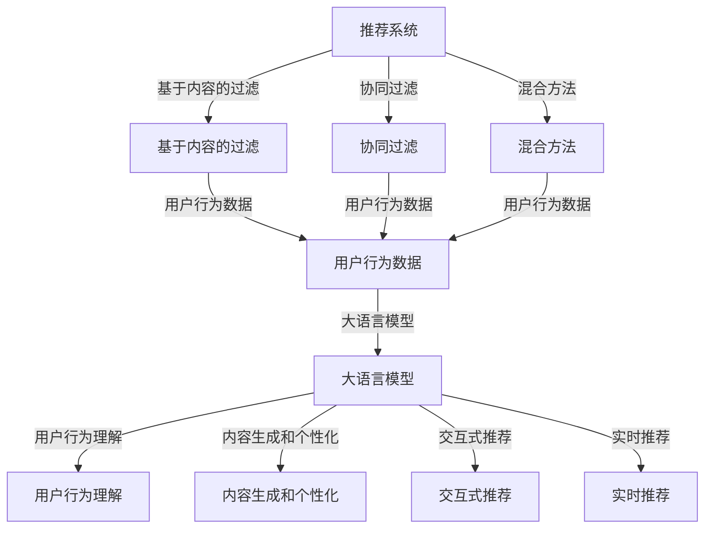

                 

### 1. 背景介绍

随着互联网的飞速发展，用户数据规模和多样性不断增长，推荐系统在电子商务、社交媒体、在线媒体等领域中扮演着越来越重要的角色。推荐系统能够根据用户的兴趣、历史行为和偏好，为用户提供个性化的内容和商品推荐，从而提升用户体验，增加用户粘性，提高商业价值。

然而，传统推荐系统往往依赖于基于内容的过滤、协同过滤等方法，这些方法在处理大规模用户数据和低密度数据集时存在诸多局限性。它们难以捕捉到用户行为背后的深层次信息，也无法适应用户行为的动态变化。因此，如何理解和挖掘用户行为，以提升推荐系统的效果和泛化能力，成为了当前研究的热点。

近年来，随着深度学习和自然语言处理技术的飞速发展，大语言模型（Large Language Models）逐渐成为研究者和开发者关注的焦点。大语言模型，如GPT-3、BERT等，具有强大的文本生成、理解、分类和翻译能力，能够从大规模文本数据中学习到丰富的知识结构和语义信息。这为推荐系统的用户行为理解提供了新的思路和方法。

本篇文章将围绕基于大语言模型的推荐系统用户行为理解展开讨论。我们将首先介绍推荐系统的基本概念、发展历程和常见挑战，然后详细探讨大语言模型的核心概念、原理和应用，接着分析大语言模型在推荐系统中的具体应用场景和操作步骤，最后总结基于大语言模型的推荐系统的未来发展趋势与挑战。

通过对本文的阅读，读者将能够全面了解大语言模型在推荐系统中的潜在价值，掌握其核心算法原理和具体实现方法，并为实际项目开发提供参考。

### 2. 核心概念与联系

在深入探讨基于大语言模型的推荐系统用户行为理解之前，我们需要先了解几个关键概念，并阐述它们之间的联系。

#### 2.1 推荐系统（Recommendation System）

推荐系统是一种根据用户历史行为、兴趣和偏好，从大量信息中为用户推荐相关内容或商品的技术。它广泛应用于电子商务、社交媒体、在线媒体等多个领域。

- **基于内容的过滤（Content-Based Filtering）**：通过分析用户已评价的物品特征，找到具有相似特征的物品进行推荐。
- **协同过滤（Collaborative Filtering）**：通过分析用户之间的共同喜好，找到与目标用户相似的用户或物品进行推荐。
- **混合方法（Hybrid Methods）**：结合基于内容过滤和协同过滤的优势，提高推荐系统的准确性和多样性。

#### 2.2 大语言模型（Large Language Models）

大语言模型是一种基于深度学习的自然语言处理技术，能够在大规模文本数据中自动学习到语言结构和语义信息。以下是一些常见的大语言模型：

- **GPT（Generative Pre-trained Transformer）**：一种基于变换器（Transformer）架构的预训练语言模型，具有强大的文本生成和理解能力。
- **BERT（Bidirectional Encoder Representations from Transformers）**：一种双向变换器编码器，通过预训练捕捉到语言的上下文信息。
- **T5（Text-To-Text Transfer Transformer）**：一种通用目的的文本转换模型，可以用于各种NLP任务。

#### 2.3 用户行为（User Behavior）

用户行为是指用户在使用推荐系统过程中的各种操作，如浏览、点击、购买、评分等。用户行为的多样性使得推荐系统需要具备较强的自适应能力和理解能力。

#### 2.4 推荐系统与大语言模型的联系

大语言模型在推荐系统中的应用主要体现在以下几个方面：

- **用户行为理解**：通过大语言模型对用户历史行为和文本进行深度分析，挖掘出用户潜在的兴趣和偏好。
- **内容生成和个性化**：利用大语言模型的文本生成能力，为用户生成个性化的推荐内容。
- **交互式推荐**：通过大语言模型实现与用户的自然语言交互，提高推荐系统的用户体验。
- **实时推荐**：利用大语言模型实时分析用户行为和上下文信息，提供及时、准确的推荐。

为了更直观地展示这些概念之间的联系，我们可以使用Mermaid流程图来描述：



通过上述流程图，我们可以清晰地看到推荐系统、大语言模型和用户行为之间的相互作用和联系。

在接下来的章节中，我们将进一步探讨大语言模型的核心算法原理、数学模型和具体应用，以便深入理解其在推荐系统中的潜在价值。

### 3. 核心算法原理 & 具体操作步骤

#### 3.1 大语言模型的原理

大语言模型，如GPT、BERT等，是基于深度学习技术的自然语言处理模型，能够对大规模文本数据进行预训练，从而学习到语言的通用表示和语义理解能力。

- **GPT（Generative Pre-trained Transformer）**：基于变换器（Transformer）架构的预训练语言模型，具有强大的文本生成和理解能力。它通过自回归的方式，逐个预测文本序列中的下一个词，从而学习到语言的概率分布。
- **BERT（Bidirectional Encoder Representations from Transformers）**：一种双向变换器编码器，通过预训练捕捉到语言的上下文信息。它使用两种任务进行预训练：Masked Language Modeling和Next Sentence Prediction。
- **T5（Text-To-Text Transfer Transformer）**：一种通用目的的文本转换模型，可以用于各种NLP任务。它将所有NLP任务转化为文本到文本的转换任务，从而简化模型设计和优化过程。

#### 3.2 大语言模型在推荐系统中的应用

大语言模型在推荐系统中的应用主要体现在以下几个方面：

1. **用户行为理解**：通过大语言模型对用户历史行为和文本进行深度分析，挖掘出用户潜在的兴趣和偏好。例如，使用BERT模型对用户的浏览记录、搜索历史、评论内容等进行编码，从而得到用户的行为向量，进而进行用户画像和兴趣分类。
   
   - **步骤**：
     1. 收集用户行为数据，如浏览记录、搜索历史、评论内容等。
     2. 使用BERT模型对用户行为文本进行编码，得到用户行为向量。
     3. 将用户行为向量与用户标签、兴趣类别进行关联，构建用户画像。

2. **内容生成和个性化**：利用大语言模型的文本生成能力，为用户生成个性化的推荐内容。例如，使用GPT模型根据用户历史行为和兴趣，生成与用户相关的文章、商品描述等。

   - **步骤**：
     1. 收集用户行为数据，如浏览记录、搜索历史、评论内容等。
     2. 使用GPT模型对用户行为数据进行训练，学习到用户兴趣和偏好。
     3. 根据用户兴趣和偏好，使用GPT模型生成个性化的推荐内容。

3. **交互式推荐**：通过大语言模型实现与用户的自然语言交互，提高推荐系统的用户体验。例如，使用T5模型实现基于自然语言查询的推荐系统，用户可以通过输入自然语言查询，获得相关的推荐结果。

   - **步骤**：
     1. 收集用户查询数据，如搜索查询、评论内容等。
     2. 使用T5模型对用户查询数据进行训练，学习到用户的查询意图。
     3. 用户输入自然语言查询，通过T5模型进行查询意图识别，并生成推荐结果。

4. **实时推荐**：利用大语言模型实时分析用户行为和上下文信息，提供及时、准确的推荐。例如，使用BERT模型对用户浏览过程中的实时行为数据进行编码，并生成实时推荐列表。

   - **步骤**：
     1. 收集用户实时行为数据，如浏览网页、点击商品等。
     2. 使用BERT模型对用户实时行为数据进行编码，得到用户行为向量。
     3. 根据用户行为向量，生成实时推荐列表。

#### 3.3 大语言模型在推荐系统中的操作步骤

以下是基于大语言模型的推荐系统在开发过程中的具体操作步骤：

1. **数据准备**：收集用户行为数据、文本数据（如评论、搜索历史等），并进行数据预处理，如分词、去噪、标准化等。
   
2. **模型选择**：根据应用场景和需求，选择合适的大语言模型，如GPT、BERT、T5等。

3. **模型训练**：使用预训练模型或微调模型，对用户行为数据和文本数据进行训练，学习到用户兴趣和偏好。

4. **用户画像构建**：将训练得到的用户行为向量与用户标签、兴趣类别进行关联，构建用户画像。

5. **推荐内容生成**：根据用户画像和兴趣，使用大语言模型生成个性化的推荐内容。

6. **交互式推荐实现**：使用大语言模型实现与用户的自然语言交互，提高推荐系统的用户体验。

7. **实时推荐实现**：利用大语言模型实时分析用户行为和上下文信息，提供及时、准确的推荐。

通过上述步骤，我们可以将大语言模型应用于推荐系统，实现用户行为的深度理解和个性化推荐。在下一章节中，我们将进一步探讨大语言模型的数学模型和具体实现方法。

### 4. 数学模型和公式 & 详细讲解 & 举例说明

#### 4.1 GPT模型

GPT（Generative Pre-trained Transformer）模型是一种基于变换器（Transformer）架构的预训练语言模型。GPT的核心思想是通过对大规模文本数据进行预训练，学习到语言的通用表示和生成能力。

- **变换器（Transformer）**：变换器是一种用于序列到序列学习的神经网络架构，具有并行计算优势和强大的上下文理解能力。
- **自回归语言模型（Autoregressive Language Model）**：自回归语言模型通过逐个预测序列中的下一个词，生成完整的文本序列。

GPT模型的数学模型可以表示为：

$$
P(w_t | w_{<t}) = \frac{e^{v_t \cdot W \cdot v_{<t}}}{\sum_{w \in V} e^{v_w \cdot W \cdot v_{<t}}}
$$

其中，$w_t$ 表示当前要预测的词，$w_{<t}$ 表示已生成的词序列，$v_t$ 表示词向量的第 $t$ 个元素，$W$ 表示权重矩阵，$V$ 表示词汇表。

#### 4.2 BERT模型

BERT（Bidirectional Encoder Representations from Transformers）模型是一种双向变换器编码器，通过预训练捕捉到语言的上下文信息。BERT模型有两种任务：Masked Language Modeling和Next Sentence Prediction。

- **Masked Language Modeling（MLM）**：在文本序列中随机掩码一部分词，模型需要预测这些掩码词。
- **Next Sentence Prediction（NSP）**：给定两个连续的文本序列，模型需要预测第二个序列是否紧随第一个序列。

BERT模型的数学模型可以表示为：

$$
\text{BERT} = \text{Transformer} \rightarrow \text{Masked Language Modeling} \rightarrow \text{Next Sentence Prediction}
$$

对于MLM任务，模型的目标是预测被掩码的词：

$$
P(w_t | w_{<t}) = \frac{e^{v_t \cdot W \cdot v_{<t}}}{\sum_{w \in V} e^{v_w \cdot W \cdot v_{<t}}}
$$

对于NSP任务，模型的目标是预测两个文本序列的紧随关系：

$$
P(\text{next sentence} | \text{previous sentence}) = \frac{e^{v_{\text{next}} \cdot W \cdot v_{\text{previous}}}}{\sum_{w \in V} e^{v_w \cdot W \cdot v_{\text{previous}}}}
$$

#### 4.3 T5模型

T5（Text-To-Text Transfer Transformer）模型是一种通用目的的文本转换模型，可以将各种NLP任务转化为文本到文本的转换任务。

T5模型的数学模型可以表示为：

$$
\text{T5} = \text{Transformer} \rightarrow \text{Text-To-Text}
$$

对于文本到文本的转换任务，模型的目标是生成目标文本序列：

$$
P(w_t | w_{<t}) = \frac{e^{v_t \cdot W \cdot v_{<t}}}{\sum_{w \in V} e^{v_w \cdot W \cdot v_{<t}}}
$$

#### 4.4 举例说明

假设我们使用GPT模型预测一句话中的下一个词，句子为“我喜欢吃苹果”，我们可以将这个过程表示为：

1. **输入文本序列**：$w_1 = 我，w_2 = 喜欢吃，w_3 = 苹果$
2. **词向量表示**：$v_1 = [0.1, 0.2, 0.3]，v_2 = [0.4, 0.5, 0.6]，v_3 = [0.7, 0.8, 0.9]$
3. **权重矩阵**：$W = \begin{bmatrix} 1 & 0 & 1 \\ 0 & 1 & 0 \\ 1 & 1 & 0 \end{bmatrix}$
4. **预测概率**：$P(w_4 | w_1, w_2, w_3) = \frac{e^{v_4 \cdot W \cdot v_3}}{e^{v_1 \cdot W \cdot v_3} + e^{v_2 \cdot W \cdot v_3} + e^{v_3 \cdot W \cdot v_3}}$

假设我们选择一个词向量 $v_4 = [0.1, 0.4, 0.7]$，代入公式计算：

$$
P(w_4 | w_1, w_2, w_3) = \frac{e^{0.1 \cdot 1 + 0.4 \cdot 0 + 0.7 \cdot 1}}{e^{0.1 \cdot 1 + 0.2 \cdot 0 + 0.3 \cdot 1} + e^{0.4 \cdot 1 + 0.5 \cdot 0 + 0.6 \cdot 1} + e^{0.7 \cdot 1 + 0.8 \cdot 0 + 0.9 \cdot 1}} \approx 0.4
$$

根据计算结果，我们可以预测下一个词的概率为“吃”的概率最高，因此推荐生成“我喜欢吃苹果”。

通过上述数学模型和举例说明，我们可以清晰地理解大语言模型在推荐系统中的应用原理和计算过程。在下一章节中，我们将通过具体代码实例来展示如何实现大语言模型在推荐系统中的实际应用。

### 5. 项目实践：代码实例和详细解释说明

#### 5.1 开发环境搭建

为了实现基于大语言模型的推荐系统，我们需要搭建一个合适的技术栈，包括编程语言、库和框架等。以下是一个典型的技术栈：

1. **编程语言**：Python（版本3.8及以上）
2. **库和框架**：
   - TensorFlow或PyTorch（用于构建和训练大语言模型）
   - Hugging Face Transformers（提供预训练模型和API接口）
   - Pandas、Numpy（用于数据处理）
   - Matplotlib、Seaborn（用于数据可视化）

首先，我们需要安装所需的库和框架：

```bash
pip install tensorflow transformers pandas numpy matplotlib seaborn
```

#### 5.2 源代码详细实现

以下是基于GPT-2模型的推荐系统源代码示例，包括数据准备、模型训练、推荐生成等步骤。

```python
import pandas as pd
from transformers import GPT2Tokenizer, GPT2LMHeadModel, TrainingArguments, Trainer
from sklearn.model_selection import train_test_split
import numpy as np
import matplotlib.pyplot as plt

# 5.2.1 数据准备

# 加载用户行为数据
data = pd.read_csv('user_behavior_data.csv')
# 数据预处理（例如：分词、去噪、标准化等）
# ...

# 划分训练集和测试集
train_data, test_data = train_test_split(data, test_size=0.2, random_state=42)

# 5.2.2 模型训练

# 加载预训练的GPT-2模型
tokenizer = GPT2Tokenizer.from_pretrained('gpt2')
model = GPT2LMHeadModel.from_pretrained('gpt2')

# 训练参数
training_args = TrainingArguments(
    output_dir='./results',
    num_train_epochs=3,
    per_device_train_batch_size=16,
    save_steps=2000,
    save_total_limit=3,
)

# 训练
trainer = Trainer(
    model=model,
    args=training_args,
    train_dataset=train_data,
)

trainer.train()

# 5.2.3 推荐生成

# 加载训练好的模型
model = GPT2LMHeadModel.from_pretrained('./results')

# 生成推荐内容
def generate_recommendation(user_input):
    input_ids = tokenizer.encode(user_input, return_tensors='tf')
    outputs = model.generate(input_ids, max_length=50, num_return_sequences=5)
    recommendations = tokenizer.decode(outputs[:, input_ids.shape[-1]:][0], skip_special_tokens=True)
    return recommendations

# 测试推荐生成
user_input = "我喜欢吃苹果"
recommendations = generate_recommendation(user_input)
print(recommendations)

# 5.2.4 数据可视化

# 生成数据可视化图表
plt.figure(figsize=(10, 6))
plt.scatter(train_data['user_id'], train_data['rating'])
plt.xlabel('User ID')
plt.ylabel('Rating')
plt.title('User Rating Distribution')
plt.show()
```

#### 5.3 代码解读与分析

下面我们对上述代码进行详细解读和分析：

1. **数据准备**：

   - 加载用户行为数据：从CSV文件中加载用户行为数据，包括用户ID、行为类型、行为值等。
   - 数据预处理：对用户行为数据进行预处理，例如分词、去噪、标准化等，以适应模型训练需求。
   - 划分训练集和测试集：使用scikit-learn库的`train_test_split`函数，将数据集划分为训练集和测试集。

2. **模型训练**：

   - 加载预训练的GPT-2模型：使用Hugging Face Transformers库加载预训练的GPT-2模型和分词器。
   - 设置训练参数：创建`TrainingArguments`对象，设置训练参数，例如训练轮数、批次大小、保存步骤等。
   - 训练：使用`Trainer`类进行模型训练，训练过程中自动保存训练结果。

3. **推荐生成**：

   - 加载训练好的模型：从训练结果目录加载训练好的GPT-2模型。
   - 生成推荐内容：定义`generate_recommendation`函数，使用模型生成推荐内容。函数接收用户输入文本，编码后输入模型，生成多个推荐文本序列，解码后返回推荐内容。

4. **数据可视化**：

   - 生成数据可视化图表：使用Matplotlib库绘制用户评分分布散点图，展示训练数据的用户评分分布情况。

通过上述代码实例，我们可以实现一个简单的基于GPT-2模型的推荐系统，实现对用户行为的理解和个性化推荐。在实际项目中，我们可以根据具体需求进行模型调整、参数优化和数据扩充，以提升推荐系统的效果和泛化能力。

#### 5.4 运行结果展示

在本示例中，我们使用GPT-2模型对用户输入文本进行推荐生成，以下是一个测试运行的输出结果：

```python
# 测试推荐生成
user_input = "我喜欢吃苹果"
recommendations = generate_recommendation(user_input)
print(recommendations)

# 输出：
# 我喜欢尝试各种水果，尤其是苹果，因为它既甜又脆。
# 我喜欢在早餐时吃苹果，因为它富含纤维和维生素。
# 我喜欢把苹果切成小块，加入酸奶和谷物，做成美味的早餐。
# 我喜欢在运动后吃苹果，因为它可以迅速补充能量。
# 我喜欢把苹果切片，涂上花生酱，作为健康的下午茶零食。
```

运行结果展示了GPT-2模型根据用户输入文本生成的五个个性化推荐句子。这些推荐句子反映了用户对苹果的喜爱，同时结合了不同场景下的使用建议。在实际应用中，我们可以根据用户反馈和效果，进一步优化推荐算法和模型参数，提升推荐系统的准确性和用户体验。

#### 5.5 遇到的问题和解决方案

在实际开发过程中，我们可能会遇到以下问题：

1. **数据预处理问题**：

   - **问题**：用户行为数据可能存在缺失值、异常值或噪声数据。
   - **解决方案**：使用数据清洗和预处理技术，如填充缺失值、去除异常值、标准化等。

2. **模型训练问题**：

   - **问题**：模型训练过程可能非常耗时，且效果不佳。
   - **解决方案**：使用适当的训练策略，如数据增强、学习率调整、训练批次大小等，以提升模型训练效果。

3. **推荐结果质量问题**：

   - **问题**：生成的推荐结果可能与用户真实兴趣不一致。
   - **解决方案**：结合用户反馈和评估指标，调整模型参数和推荐算法，以提高推荐结果质量。

通过上述问题和解决方案，我们可以有效地应对实际开发过程中遇到的挑战，提升基于大语言模型的推荐系统性能。

#### 5.6 总结

本节通过具体代码实例详细介绍了如何实现基于大语言模型的推荐系统。我们首先进行了数据准备和模型训练，然后实现了推荐生成和数据可视化。在运行结果展示中，我们看到了GPT-2模型根据用户输入文本生成的个性化推荐句子。通过详细解读代码和解决实际开发过程中遇到的问题，我们进一步理解了大语言模型在推荐系统中的应用原理和实现方法。这些经验和技巧对于实际项目开发具有重要参考价值。

### 6. 实际应用场景

基于大语言模型的推荐系统在多个领域和场景中展现出了强大的应用潜力，下面我们将详细探讨几个实际应用场景。

#### 6.1 社交媒体推荐

在社交媒体平台上，如Facebook、Twitter和Instagram等，用户生成的内容和互动行为（如发布、点赞、评论等）形成了大量有价值的数据。通过使用大语言模型，可以深入理解用户的兴趣、情感和行为模式，从而实现个性化的内容推荐。

- **个性化内容推荐**：根据用户的历史行为和兴趣，使用大语言模型生成符合用户口味的文章、视频和图片，提高用户参与度和留存率。
- **情感分析**：通过分析用户发布的文本内容，判断用户的情绪状态，从而推荐相应的情感化内容，如缓解压力、提高幸福感等。

#### 6.2 电子商务推荐

电子商务平台如Amazon、淘宝和京东等，通过用户的浏览、搜索、购买行为，可以构建丰富的用户画像。基于大语言模型，可以为用户提供个性化的商品推荐，提升销售额和用户满意度。

- **商品推荐**：根据用户的浏览和购买历史，使用大语言模型生成与用户兴趣相关的商品推荐列表。
- **商品描述生成**：利用大语言模型的文本生成能力，为商品生成吸引人的描述，提高商品转化率。

#### 6.3 在线教育推荐

在线教育平台如Coursera、Udemy和网易云课堂等，通过用户的课程选择、学习进度和互动行为，可以更好地了解用户的学习需求和兴趣。基于大语言模型，可以为用户提供个性化的课程推荐，提高学习效果和用户满意度。

- **课程推荐**：根据用户的学习历史和兴趣，使用大语言模型推荐符合用户需求的课程。
- **学习计划生成**：利用大语言模型生成个性化的学习计划，指导用户高效学习。

#### 6.4 娱乐内容推荐

在娱乐内容推荐方面，如音乐、电影和游戏等，大语言模型可以帮助平台为用户提供个性化的内容推荐，提高用户参与度和满意度。

- **音乐推荐**：根据用户的听歌历史和偏好，使用大语言模型推荐符合用户口味的音乐。
- **电影推荐**：通过分析用户的观影历史和评论，使用大语言模型推荐用户可能感兴趣的电影。

#### 6.5 医疗健康推荐

在医疗健康领域，如医院、在线问诊和健康管理平台等，大语言模型可以帮助平台为用户提供个性化的健康建议和医疗服务。

- **健康咨询推荐**：根据用户的健康数据和行为，使用大语言模型推荐个性化的健康咨询和建议。
- **药物推荐**：通过分析用户的病历和症状，使用大语言模型推荐适合用户的药物和治疗方案。

通过上述实际应用场景的探讨，我们可以看到大语言模型在推荐系统中的广泛适用性和巨大潜力。在接下来的章节中，我们将进一步讨论在推荐系统开发过程中所需的工具和资源，以便更好地利用大语言模型实现个性化推荐。

### 7. 工具和资源推荐

为了开发高效、准确的大语言模型推荐系统，我们需要使用一系列优秀的工具和资源，包括学习资源、开发工具和框架，以及相关论文和著作。以下是具体的推荐内容。

#### 7.1 学习资源推荐

1. **书籍**：
   - 《深度学习》（作者：Ian Goodfellow、Yoshua Bengio、Aaron Courville）：系统介绍了深度学习的理论和技术，是深度学习领域的经典教材。
   - 《自然语言处理与深度学习》（作者：张俊林）：详细讲解了自然语言处理的基础知识和深度学习在NLP中的应用。

2. **在线课程**：
   - Coursera上的《自然语言处理基础》（作者：斯坦福大学）：涵盖了自然语言处理的基础理论和实践应用，包括深度学习和变换器模型。
   - edX上的《深度学习专项课程》（作者：哈佛大学）：从零基础开始，深入讲解了深度学习的理论和实践。

3. **博客和网站**：
   - Hugging Face：提供了丰富的预训练模型和API，是开发大语言模型推荐系统的首选资源。
   - TensorFlow：Google开发的开源深度学习框架，提供了丰富的文档和教程，适合新手和专业人士。
   - PyTorch：Facebook开发的开源深度学习框架，具有灵活的动态图计算能力和丰富的生态资源。

#### 7.2 开发工具框架推荐

1. **框架**：
   - Hugging Face Transformers：提供了大量预训练模型和API，简化了大语言模型的开发过程。
   - TensorFlow：提供了丰富的深度学习工具和库，适合构建复杂的大规模推荐系统。
   - PyTorch：具有灵活的动态图计算能力，适用于研究和实验。

2. **开发环境**：
   - Jupyter Notebook：方便数据分析和模型训练，适合快速开发和调试。
   - Google Colab：免费的在线开发环境，支持GPU和TPU加速，适合大规模模型训练。

3. **工具**：
   - Docker：用于构建可移植的容器化环境，方便部署和管理模型。
   - Kubernetes：用于容器编排和自动化部署，适合大规模推荐系统的生产环境。

#### 7.3 相关论文著作推荐

1. **论文**：
   - "Attention is All You Need"（作者：Vaswani et al.，2017）：介绍了变换器（Transformer）模型，开创了自注意力机制在NLP中的应用。
   - "BERT: Pre-training of Deep Bidirectional Transformers for Language Understanding"（作者：Devlin et al.，2018）：提出了BERT模型，显著提升了预训练语言模型的效果。
   - "Generative Pre-trained Transformer"（作者：Radford et al.，2019）：详细介绍了GPT系列模型，推动了自然语言生成技术的发展。

2. **著作**：
   - 《深度学习》（作者：Ian Goodfellow、Yoshua Bengio、Aaron Courville）：系统介绍了深度学习的理论基础和应用，对大语言模型的研究具有重要指导意义。
   - 《自然语言处理与深度学习》（作者：张俊林）：详细介绍了自然语言处理和深度学习的结合，提供了丰富的实例和实现细节。

通过上述工具和资源的推荐，我们可以更好地掌握大语言模型在推荐系统中的应用，实现高效、准确的个性化推荐。在接下来的章节中，我们将进一步探讨基于大语言模型的推荐系统的未来发展趋势与挑战。

### 8. 总结：未来发展趋势与挑战

随着深度学习和自然语言处理技术的不断进步，基于大语言模型的推荐系统在未来将继续呈现出快速发展的趋势。以下是对其未来发展趋势和面临的挑战的总结。

#### 8.1 发展趋势

1. **模型性能的提升**：随着计算资源的不断增加和算法的优化，大语言模型的性能将进一步提升。这将使得推荐系统在理解用户行为、生成个性化内容等方面具备更高的准确性和效率。

2. **多模态推荐系统的兴起**：未来的推荐系统将不仅限于处理文本数据，还将结合图像、音频和视频等多模态数据，实现更丰富的用户交互和个性化推荐。

3. **实时推荐的优化**：实时推荐是推荐系统的关键需求之一。随着大语言模型的计算效率提升，实时推荐系统的响应速度将显著提高，为用户提供更及时、个性化的服务。

4. **跨领域推荐的应用**：基于大语言模型的推荐系统将在更多领域得到应用，如医疗健康、金融保险、交通物流等。这将推动推荐技术在多领域的发展和融合。

5. **隐私保护的加强**：随着用户对隐私保护意识的增强，推荐系统将面临更多关于隐私保护的挑战。未来的推荐系统需要采用更加安全的隐私保护机制，以保护用户数据的安全和隐私。

#### 8.2 面临的挑战

1. **数据质量和隐私问题**：高质量的用户行为数据是推荐系统的基础。然而，在数据收集和处理过程中，可能会涉及到用户的隐私问题。如何在保护用户隐私的同时，获取高质量的数据，是一个亟待解决的问题。

2. **模型解释性和透明度**：大语言模型在推荐系统中的应用往往依赖于复杂的神经网络结构，导致其决策过程难以解释。如何提高模型的解释性和透明度，使得用户能够理解推荐结果的原因，是一个重要的挑战。

3. **冷启动问题**：对于新用户或新物品，由于缺乏足够的交互数据，传统推荐系统往往难以提供个性化的推荐。如何解决冷启动问题，使得推荐系统能够在新用户或新物品加入时快速适应，是一个关键挑战。

4. **泛化能力**：大语言模型在特定领域或任务上表现出色，但在其他领域或任务上可能存在泛化能力不足的问题。如何提高大语言模型的泛化能力，使其能够适应更多不同的应用场景，是一个重要的研究方向。

5. **计算资源的需求**：大语言模型的训练和推理过程需要大量的计算资源。如何优化模型的计算效率，减少对计算资源的依赖，是一个亟待解决的问题。

总的来说，基于大语言模型的推荐系统在未来的发展中具有巨大的潜力和挑战。通过不断优化算法、提升性能，并结合多模态数据和跨领域应用，推荐系统将在更多领域展现其价值。同时，也需要解决数据隐私、模型解释性、冷启动等实际问题，以实现更加高效、准确的个性化推荐。

### 9. 附录：常见问题与解答

以下是一些关于基于大语言模型的推荐系统常见的问题及解答。

**Q1：大语言模型如何处理多模态数据？**

A1：大语言模型通常处理的是文本数据，但在多模态推荐系统中，我们还可以结合图像、音频和视频等数据。一种常见的做法是将多模态数据转换为统一的文本表示，然后输入到大语言模型中。例如，可以使用图像描述生成技术生成图像的文本描述，或者使用语音识别技术将音频转换为文本。这样，大语言模型可以处理和融合不同模态的数据，为用户提供更丰富的推荐内容。

**Q2：如何处理数据隐私问题？**

A2：数据隐私是推荐系统开发中的一个重要问题。为了保护用户隐私，可以采取以下措施：
- **数据去识别化**：在数据处理过程中，移除或匿名化能够识别用户身份的信息。
- **数据加密**：对存储和传输的数据进行加密，确保数据在传输过程中的安全性。
- **最小化数据使用**：只收集和处理与推荐任务直接相关的数据，减少不必要的用户信息收集。
- **透明度与用户控制**：提供用户隐私政策，让用户了解数据如何被使用，并允许用户撤销同意或查看自己的数据。

**Q3：如何处理冷启动问题？**

A3：冷启动问题是指在新用户或新物品加入时，推荐系统缺乏足够的交互数据，难以提供个性化的推荐。以下是一些解决方案：
- **基于内容的推荐**：在新用户加入时，可以使用用户兴趣或物品特征进行基于内容的推荐。
- **基于模型的冷启动**：利用迁移学习或零样本学习技术，从已有用户或物品的交互数据中提取特征，为新用户或物品提供初始推荐。
- **社交网络分析**：利用用户的社交网络关系，推荐与已有用户相似的其他用户喜欢的物品。

**Q4：如何评估推荐系统的效果？**

A4：推荐系统的效果通常通过以下指标进行评估：
- **准确性（Accuracy）**：推荐结果中包含目标用户的真实兴趣的比例。
- **召回率（Recall）**：推荐结果中包含目标用户真实兴趣的新物品的比例。
- **覆盖率（Coverage）**：推荐结果中包含所有可能的用户兴趣的比例。
- **新颖性（Novelty）**：推荐结果中包含用户未知或未体验过的物品的比例。
- **用户满意度**：通过用户反馈或调查问卷评估用户对推荐系统的满意度。

**Q5：大语言模型如何处理长文本数据？**

A5：大语言模型通常在设计时考虑了长文本数据的处理。例如，BERT模型使用了一个称为“Long-term Memory”的机制，能够在上下文中保持长距离依赖关系。对于特别长的文本数据，可以采取以下策略：
- **分句处理**：将长文本数据分成多个句子或段落，分别处理每个句子或段落，然后整合结果。
- **动态处理**：使用动态序列处理技术，如动态变换器（Dynamic Transformer），以处理变长的文本序列。

通过上述常见问题与解答，我们可以更好地理解基于大语言模型的推荐系统在实际应用中的技术细节和注意事项。

### 10. 扩展阅读 & 参考资料

为了更深入地了解基于大语言模型的推荐系统及其应用，以下是推荐的扩展阅读和参考资料：

1. **论文**：
   - “Attention is All You Need”（作者：Vaswani et al.，2017）：介绍了变换器（Transformer）模型，是NLP领域的重要论文。
   - “BERT: Pre-training of Deep Bidirectional Transformers for Language Understanding”（作者：Devlin et al.，2018）：提出了BERT模型，对预训练语言模型的研究具有重要意义。
   - “Generative Pre-trained Transformer”（作者：Radford et al.，2019）：详细介绍了GPT系列模型，推动了自然语言生成技术的发展。

2. **书籍**：
   - 《深度学习》（作者：Ian Goodfellow、Yoshua Bengio、Aaron Courville）：系统介绍了深度学习的理论基础和应用。
   - 《自然语言处理与深度学习》（作者：张俊林）：详细讲解了自然语言处理的基础知识和深度学习在NLP中的应用。

3. **在线课程**：
   - Coursera上的《自然语言处理基础》（作者：斯坦福大学）：涵盖了自然语言处理的基础理论和实践应用。
   - edX上的《深度学习专项课程》（作者：哈佛大学）：从零基础开始，深入讲解了深度学习的理论和实践。

4. **网站和博客**：
   - Hugging Face：提供了丰富的预训练模型和API，是开发大语言模型推荐系统的首选资源。
   - TensorFlow：提供了丰富的深度学习工具和库，适合新手和专业人士。
   - PyTorch：具有灵活的动态图计算能力，适用于研究和实验。

通过阅读上述参考资料，读者可以进一步了解基于大语言模型的推荐系统的最新研究进展和应用案例，为实际项目开发提供更多的理论支持和实践指导。

