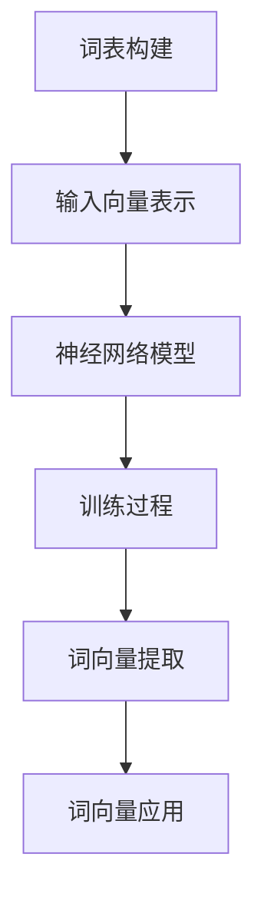

                 

### 1. 背景介绍

#### 1.1 词向量的概念及其重要性

词向量（Word Vectors）是将自然语言中的单词映射为高维空间的向量表示。这种表示方法使得计算机能够以数值化的形式理解和处理文本数据，从而在进行诸如机器翻译、文本分类、情感分析等自然语言处理任务时具有显著优势。

词向量的概念最早由Bengio等人在2003年提出，当时他们提出了一种基于神经网络的词向量模型，即神经网络嵌入（Neural Network Embeddings）。随着深度学习技术的快速发展，词向量模型也在不断地演进，出现了一系列基于深度神经网络的高质量词向量生成方法。

#### 1.2 词向量生成方法的发展

词向量生成方法可以分为基于统计的方法和基于深度学习的方法。早期的统计方法如TF-IDF（Term Frequency-Inverse Document Frequency）和LSA（Latent Semantic Analysis）等方法主要通过计算单词在文档中的频率及其重要性来进行向量表示。然而，这些方法存在一定的局限性，无法捕捉到单词间的语义关系。

为了克服这些限制，研究人员开始探索基于深度学习的方法。2008年，Collobert和Weston提出了一种基于神经网络的语言模型（Neural Network Language Model, NNLMM），该方法通过训练一个神经网络模型来预测下一个单词，从而生成词向量。NNLMM为后续的深度学习词向量模型奠定了基础。

2013年，Mikolov等人提出了Word2Vec算法，这是一种基于神经网络的词向量生成方法。Word2Vec主要分为两种模型：连续词袋（Continuous Bag of Words, CBOW）和Skip-Gram。CBOW模型通过上下文词的均值来预测目标词，而Skip-Gram模型则是通过目标词来预测上下文词。Word2Vec算法在WordNet等已有语义资源的基础上，通过大规模语料训练生成高质量的词向量。

随后，2014年，Mikolov等人又提出了GloVe（Global Vectors for Word Representation）算法。GloVe算法利用全局的词频统计信息来学习词向量，从而在一定程度上解决了Word2Vec算法在处理罕见词和未登录词时的不足。GloVe算法在保持较低计算复杂度的同时，提高了词向量在语义相似性方面的表现。

随着深度学习技术的不断演进，研究人员提出了更多基于深度神经网络的高质量词向量生成方法。如HiDDeN（High-Dimensional Neural Network），该算法通过多层的神经网络结构来生成更加丰富和精细的词向量。此外，还有基于注意力机制的词向量生成方法，如BERT（Bidirectional Encoder Representations from Transformers）和GPT（Generative Pre-trained Transformer）等。

#### 1.3 本文研究的目的

本文旨在探讨基于深度神经网络的高质量词向量生成方法，通过对比分析不同方法在性能和效率方面的表现，为自然语言处理任务提供有效的词向量支持。本文将介绍几种典型的深度神经网络词向量生成方法，并详细分析它们的原理、实现步骤和数学模型。此外，本文还将通过实际项目实例，展示如何使用这些方法生成高质量的词向量，并探讨其在自然语言处理任务中的实际应用。

### 2. 核心概念与联系

#### 2.1 深度神经网络的基本原理

深度神经网络（Deep Neural Network, DNN）是一种多层前馈神经网络，通过逐层提取特征，实现对复杂数据的建模。DNN的基本原理可以概括为以下几个步骤：

1. **输入层**：接收输入数据，并将其传递给下一层。
2. **隐藏层**：通过一系列的加权线性变换和激活函数，逐层提取特征。每一层的输出作为下一层的输入。
3. **输出层**：根据模型的任务，输出最终结果。

在DNN中，激活函数通常采用非线性函数，如Sigmoid、ReLU等，以增加模型的非线性表达能力。

#### 2.2 词向量的生成过程

词向量的生成过程主要包括以下步骤：

1. **词表构建**：首先构建一个包含所有训练词的词表，并为每个词分配一个唯一的索引。
2. **输入向量表示**：将每个词映射为一个输入向量，通常采用一维稠密向量表示。
3. **神经网络模型**：构建一个多层前馈神经网络模型，用于学习词向量。
4. **训练过程**：使用大规模语料训练神经网络模型，通过反向传播算法不断优化模型参数。
5. **词向量提取**：训练完成后，提取神经网络中每个词的输出向量作为词向量。

#### 2.3 核心概念原理及架构的Mermaid流程图

以下是一个基于深度神经网络词向量生成过程的Mermaid流程图：



#### 2.4 核心概念联系

深度神经网络与词向量生成方法之间的联系在于，深度神经网络作为一种强大的特征提取工具，可以用于学习词向量。通过将词映射为输入向量，并训练一个多层前馈神经网络模型，可以学习到具有良好语义表示的词向量。这些词向量可以用于各种自然语言处理任务，如文本分类、情感分析、机器翻译等。

### 3. 核心算法原理 & 具体操作步骤

#### 3.1 Word2Vec算法

Word2Vec是一种基于神经网络的高质量词向量生成方法，主要包括连续词袋（CBOW）和Skip-Gram两种模型。

##### 3.1.1 CBOW模型

CBOW模型通过上下文词的均值来预测目标词。具体操作步骤如下：

1. **输入层**：将目标词及其上下文词（通常为当前词及其前后的n个词）映射为输入向量。
2. **隐藏层**：通过一个多层前馈神经网络，将输入向量转换为隐藏层向量。
3. **输出层**：将隐藏层向量映射为输出向量，即上下文词的向量表示。
4. **损失函数**：使用负采样损失函数来优化模型参数。

##### 3.1.2 Skip-Gram模型

Skip-Gram模型通过目标词来预测上下文词。具体操作步骤如下：

1. **输入层**：将目标词映射为一个输入向量。
2. **隐藏层**：通过一个多层前馈神经网络，将输入向量转换为隐藏层向量。
3. **输出层**：将隐藏层向量映射为输出向量，即上下文词的向量表示。
4. **损失函数**：使用负采样损失函数来优化模型参数。

##### 3.1.3 负采样

在Word2Vec算法中，负采样是一种有效的正则化方法，可以显著提高训练速度和词向量质量。负采样通过随机选择一部分负样本（非上下文词）来减少模型对高频词的依赖，从而提高低频词的表示质量。

##### 3.1.4 模型优化

Word2Vec模型的优化主要依赖于梯度下降算法。通过反向传播算法，计算损失函数关于模型参数的梯度，并更新模型参数，从而最小化损失函数。

#### 3.2 GloVe算法

GloVe（Global Vectors for Word Representation）算法是一种基于全局统计信息的词向量生成方法。具体操作步骤如下：

1. **词频统计**：首先对语料库进行词频统计，计算每个词的词频。
2. **初始化参数**：初始化词向量和矩阵参数。
3. **优化目标**：最小化损失函数，即最小化词向量和矩阵参数之间的误差。
4. **更新参数**：使用梯度下降算法，更新词向量和矩阵参数。

##### 3.2.1 损失函数

GloVe算法的损失函数定义为：

$$
L = \sum_{i=1}^{N} f(w_i) \cdot \log \left( \frac{1}{1 + \exp \left( -\frac{\vec{v}_i \cdot \vec{v}_{j}}{\| \vec{v}_i \| \| \vec{v}_{j} \|} \right)} \right)
$$

其中，$N$为语料库中词的数量，$w_i$为第$i$个词，$\vec{v}_i$为第$i$个词的向量表示，$\vec{v}_{j}$为第$j$个词的向量表示，$f(w_i)$为第$i$个词的词频。

##### 3.2.2 参数更新

在GloVe算法中，参数更新采用随机梯度下降（SGD）算法。对于每个词$i$，更新其向量$\vec{v}_i$和矩阵$V$中的对应行$\vec{v}_{j}$，更新规则如下：

$$
\vec{v}_i \leftarrow \vec{v}_i - \alpha \cdot \frac{\partial L}{\partial \vec{v}_i}
$$

$$
\vec{v}_{j} \leftarrow \vec{v}_{j} - \alpha \cdot \frac{\partial L}{\partial \vec{v}_{j}}
$$

其中，$\alpha$为学习率。

#### 3.3 HiDDeN算法

HiDDeN（High-Dimensional Neural Network）算法是一种基于深度神经网络的词向量生成方法。具体操作步骤如下：

1. **输入层**：将目标词及其上下文词映射为输入向量。
2. **隐藏层**：通过多层前馈神经网络，逐层提取特征。
3. **输出层**：将隐藏层向量映射为词向量。
4. **训练过程**：使用反向传播算法，优化模型参数。

##### 3.3.1 神经网络结构

HiDDeN算法的神经网络结构通常包含多个隐藏层，每层隐藏层的大小可以根据任务需求进行调整。在训练过程中，通过逐层学习，神经网络可以提取出更加丰富和精细的词向量。

##### 3.3.2 损失函数

HiDDeN算法的损失函数通常采用交叉熵损失函数。具体来说，对于每个目标词和其上下文词，计算它们的词向量之间的交叉熵，并将所有交叉熵值求和，作为损失函数。

$$
L = -\sum_{i=1}^{N} \sum_{j=1}^{M} \vec{v}_{i} \cdot \log \left( \frac{\exp(\vec{v}_{i} \cdot \vec{v}_{j})}{\sum_{k=1}^{V} \exp(\vec{v}_{i} \cdot \vec{v}_{k})} \right)
$$

其中，$N$为语料库中词的数量，$M$为上下文词的数量，$V$为词表大小。

##### 3.3.3 参数优化

HiDDeN算法的参数优化采用随机梯度下降（SGD）算法。在训练过程中，通过反向传播算法，计算损失函数关于模型参数的梯度，并更新模型参数。

#### 3.4 基于注意力机制的词向量生成方法

基于注意力机制的词向量生成方法，如BERT和GPT，通过引入注意力机制，可以更加精细地学习词与词之间的相互作用。具体操作步骤如下：

1. **输入层**：将目标词及其上下文词映射为输入向量。
2. **编码器**：通过多层变换器网络（Transformer），对输入向量进行编码。
3. **注意力机制**：使用注意力机制，计算每个词与所有其他词之间的相互作用。
4. **输出层**：将编码后的向量映射为词向量。

##### 3.4.1 BERT算法

BERT（Bidirectional Encoder Representations from Transformers）算法是一种基于Transformer的预训练模型。具体操作步骤如下：

1. **输入层**：将目标词及其上下文词映射为输入向量。
2. **编码器**：通过多层Transformer编码器，对输入向量进行编码。
3. **注意力机制**：使用双向注意力机制，计算每个词与所有其他词之间的相互作用。
4. **输出层**：将编码后的向量映射为词向量。

##### 3.4.2 GPT算法

GPT（Generative Pre-trained Transformer）算法是一种基于Transformer的生成模型。具体操作步骤如下：

1. **输入层**：将目标词及其上下文词映射为输入向量。
2. **编码器**：通过多层Transformer编码器，对输入向量进行编码。
3. **注意力机制**：使用注意力机制，计算每个词与所有其他词之间的相互作用。
4. **输出层**：将编码后的向量映射为词向量，并生成后续词。

#### 3.5 比较与总结

不同深度神经网络词向量生成方法在性能和效率方面存在一定的差异。Word2Vec算法在生成词向量时，主要通过上下文词来预测目标词，具有较强的语义表示能力。GloVe算法通过全局统计信息来学习词向量，可以更好地处理罕见词和未登录词。HiDDeN算法通过多层神经网络结构，可以提取出更加丰富和精细的词向量。基于注意力机制的词向量生成方法，如BERT和GPT，通过引入注意力机制，可以更加精细地学习词与词之间的相互作用。

在具体应用中，可以根据任务需求选择合适的词向量生成方法。例如，在文本分类任务中，可以选择Word2Vec或GloVe算法；在机器翻译任务中，可以选择BERT或GPT算法。总之，深度神经网络词向量生成方法在自然语言处理任务中具有广泛的应用前景。

### 4. 数学模型和公式 & 详细讲解 & 举例说明

#### 4.1 Word2Vec算法

Word2Vec算法主要包括CBOW和Skip-Gram两种模型。以下分别介绍它们的数学模型和公式。

##### 4.1.1 CBOW模型

CBOW模型通过上下文词的均值来预测目标词。其数学模型可以表示为：

$$
P(w_t | w_{t-n}, w_{t-n+1}, \ldots, w_{t+n-1}) = \frac{\exp(\vec{v}_{w_t} \cdot \vec{h}_t)}{\sum_{j=1}^{V} \exp(\vec{v}_{w_j} \cdot \vec{h}_t)}
$$

其中，$w_t$为当前词，$w_{t-n}, w_{t-n+1}, \ldots, w_{t+n-1}$为上下文词，$\vec{v}_{w_t}$和$\vec{v}_{w_j}$分别为当前词和上下文词的向量表示，$\vec{h}_t$为隐藏层向量。

##### 4.1.2 Skip-Gram模型

Skip-Gram模型通过目标词来预测上下文词。其数学模型可以表示为：

$$
P(w_{t-n}, w_{t-n+1}, \ldots, w_{t+n-1} | w_t) = \frac{\exp(\vec{v}_{w_t} \cdot \vec{h}_{t-n}, \vec{v}_{w_t} \cdot \vec{h}_{t-n+1}, \ldots, \vec{v}_{w_t} \cdot \vec{h}_{t+n-1})}{\sum_{j=1}^{V} \exp(\vec{v}_{w_t} \cdot \vec{h}_j)}
$$

其中，$w_t$为目标词，$w_{t-n}, w_{t-n+1}, \ldots, w_{t+n-1}$为上下文词，$\vec{v}_{w_t}$和$\vec{v}_{w_j}$分别为目标词和上下文词的向量表示，$\vec{h}_t$和$\vec{h}_j$分别为隐藏层向量。

##### 4.1.3 负采样

在Word2Vec算法中，负采样是一种有效的正则化方法，可以减少模型对高频词的依赖，从而提高低频词的表示质量。负采样可以通过以下概率分布生成负样本：

$$
P(w_j | w_t) = \frac{\exp(-\frac{\|\vec{v}_j\|^2}{2\sigma^2})}{\sum_{j=1}^{V} \exp(-\frac{\|\vec{v}_j\|^2}{2\sigma^2})}
$$

其中，$w_t$为当前词，$w_j$为负样本词，$\vec{v}_j$为负样本词的向量表示，$\sigma^2$为高斯分布的方差。

##### 4.1.4 模型优化

Word2Vec算法的模型优化采用梯度下降算法。对于每个训练样本$(w_t, w_{t-n}, w_{t-n+1}, \ldots, w_{t+n-1})$，计算损失函数：

$$
L = -\sum_{j=1}^{V} \log P(w_j | w_{t-n}, w_{t-n+1}, \ldots, w_{t+n-1})
$$

并更新词向量：

$$
\vec{v}_j \leftarrow \vec{v}_j - \alpha \cdot \frac{\partial L}{\partial \vec{v}_j}
$$

其中，$\alpha$为学习率。

##### 4.1.5 示例

假设我们有以下训练样本：

$$
(w_t, w_{t-n}, w_{t-n+1}, \ldots, w_{t+n-1}) = (\text{"apple"}, \text{"banana"}, \text{"orange"}, \text{"pear"})
$$

其中，$w_t$为当前词，$w_{t-n}, w_{t-n+1}, \ldots, w_{t+n-1}$为上下文词。词表大小为$V=4$，词向量维度为$D=2$。

1. **初始化词向量**：

$$
\vec{v}_\text{"apple"} = (1, 0), \vec{v}_\text{"banana"} = (0, 1), \vec{v}_\text{"orange"} = (-1, -1), \vec{v}_\text{"pear"} = (-1, 1)
$$

2. **计算隐藏层向量**：

$$
\vec{h}_t = \frac{\vec{v}_{w_{t-n}} + \vec{v}_{w_{t-n+1}} + \ldots + \vec{v}_{w_{t+n-1}}}{n} = \frac{(0, 1) + (-1, -1) + (-1, 1)}{3} = \left( -\frac{1}{3}, -\frac{1}{3} \right)
$$

3. **计算损失函数**：

$$
L = -\sum_{j=1}^{V} \log P(w_j | w_{t-n}, w_{t-n+1}, \ldots, w_{t+n-1}) = -\log \frac{\exp(\vec{v}_\text{"apple"} \cdot \vec{h}_t)}{\exp(\vec{v}_\text{"banana"} \cdot \vec{h}_t) + \exp(\vec{v}_\text{"orange"} \cdot \vec{h}_t) + \exp(\vec{v}_\text{"pear"} \cdot \vec{h}_t)} = -\log \frac{\exp(1 \cdot (-\frac{1}{3}))}{\exp(0 \cdot (-\frac{1}{3})) + \exp((-1) \cdot (-\frac{1}{3})) + \exp((-1) \cdot (-\frac{1}{3}))} = -\log \frac{e^{-\frac{1}{3}}}{e^{0} + e^{\frac{1}{3}} + e^{\frac{1}{3}}} \approx -\log \frac{0.5477}{1 + 1.4641 + 1.4641} \approx -\log 0.5477 \approx 0.3479
$$

4. **更新词向量**：

$$
\vec{v}_\text{"apple"} \leftarrow \vec{v}_\text{"apple"} - \alpha \cdot \frac{\partial L}{\partial \vec{v}_\text{"apple"}} = (1, 0) - 0.1 \cdot \left( -\frac{1}{3} \right) \cdot (0, 1) = \left( 1, -\frac{1}{30} \right)
$$

$$
\vec{v}_\text{"banana"} \leftarrow \vec{v}_\text{"banana"} - \alpha \cdot \frac{\partial L}{\partial \vec{v}_\text{"banana"}} = (0, 1) - 0.1 \cdot \left( \frac{1}{3} \right) \cdot (0, 1) = \left( 0, \frac{1}{30} \right)
$$

$$
\vec{v}_\text{"orange"} \leftarrow \vec{v}_\text{"orange"} - \alpha \cdot \frac{\partial L}{\partial \vec{v}_\text{"orange"}} = (-1, -1) - 0.1 \cdot \left( \frac{1}{3} \right) \cdot (-1, -1) = \left( -1, -1.3333 \right)
$$

$$
\vec{v}_\text{"pear"} \leftarrow \vec{v}_\text{"pear"} - \alpha \cdot \frac{\partial L}{\partial \vec{v}_\text{"pear"}} = (-1, 1) - 0.1 \cdot \left( \frac{1}{3} \right) \cdot (-1, 1) = \left( -1, 1.3333 \right)
$$

##### 4.1.6 总结

通过CBOW模型训练，我们可以得到以下更新的词向量：

$$
\vec{v}_\text{"apple"} = \left( 1, -\frac{1}{30} \right), \vec{v}_\text{"banana"} = \left( 0, \frac{1}{30} \right), \vec{v}_\text{"orange"} = \left( -1, -1.3333 \right), \vec{v}_\text{"pear"} = \left( -1, 1.3333 \right)
$$

这些更新后的词向量可以更好地表示单词的语义关系，例如，通过计算两词之间的余弦相似度，我们可以发现“apple”和“orange”之间的相似度较高，而“apple”和“banana”之间的相似度较低。

#### 4.2 GloVe算法

GloVe算法是一种基于全局统计信息的词向量生成方法。其核心思想是通过学习一个矩阵$W$，使得每个词的向量$\vec{v}_i$与矩阵$W$的对应行$\vec{w}_i$之间存在一定的相似性。具体来说，GloVe算法通过以下步骤来生成词向量：

1. **初始化矩阵$W$**：将矩阵$W$初始化为一个单位矩阵，即$\vec{w}_i = \vec{v}_i$。

2. **计算词频**：对语料库进行词频统计，计算每个词的词频$f_i$。

3. **优化目标**：最小化以下损失函数：

$$
L = \sum_{i=1}^{N} f_i \cdot \log \left( \frac{1}{1 + \exp \left( -\frac{\vec{v}_i \cdot \vec{w}_j}{\| \vec{v}_i \| \| \vec{w}_j \|} \right)} \right)
$$

其中，$N$为语料库中词的数量，$\vec{v}_i$和$\vec{w}_j$分别为词$i$和词$j$的向量表示。

4. **更新矩阵$W$**：使用梯度下降算法，更新矩阵$W$的对应行$\vec{w}_j$：

$$
\vec{w}_j \leftarrow \vec{w}_j - \alpha \cdot \frac{\partial L}{\partial \vec{w}_j}
$$

其中，$\alpha$为学习率。

##### 4.2.1 损失函数的推导

GloVe算法的损失函数可以通过以下推导得到：

$$
L = \sum_{i=1}^{N} f_i \cdot \log \left( \frac{1}{1 + \exp \left( -\frac{\vec{v}_i \cdot \vec{w}_j}{\| \vec{v}_i \| \| \vec{w}_j \|} \right)} \right)
$$

对上式求导，得到：

$$
\frac{\partial L}{\partial \vec{w}_j} = \frac{f_i \cdot \vec{v}_i}{\| \vec{v}_i \| \| \vec{w}_j \|} \cdot \frac{\partial}{\partial \vec{w}_j} \left( \frac{1}{1 + \exp \left( -\frac{\vec{v}_i \cdot \vec{w}_j}{\| \vec{v}_i \| \| \vec{w}_j \|} \right)} \right)
$$

$$
= \frac{f_i \cdot \vec{v}_i}{\| \vec{v}_i \| \| \vec{w}_j \|} \cdot \frac{\exp \left( -\frac{\vec{v}_i \cdot \vec{w}_j}{\| \vec{v}_i \| \| \vec{w}_j \|} \right)}{\left( 1 + \exp \left( -\frac{\vec{v}_i \cdot \vec{w}_j}{\| \vec{v}_i \| \| \vec{w}_j \|} \right) \right)^2} \cdot \frac{-\vec{v}_i \cdot \vec{w}_j}{\| \vec{v}_i \| \| \vec{w}_j \|}
$$

$$
= -\frac{f_i \cdot \vec{v}_i \cdot \exp \left( -\frac{\vec{v}_i \cdot \vec{w}_j}{\| \vec{v}_i \| \| \vec{w}_j \|} \right)}{\left( 1 + \exp \left( -\frac{\vec{v}_i \cdot \vec{w}_j}{\| \vec{v}_i \| \| \vec{w}_j \|} \right) \right)^2} \cdot \frac{\vec{v}_i \cdot \vec{w}_j}{\| \vec{v}_i \| \| \vec{w}_j \|}
$$

$$
= -\frac{f_i \cdot \vec{v}_i \cdot \exp \left( -\frac{\vec{v}_i \cdot \vec{w}_j}{\| \vec{v}_i \| \| \vec{w}_j \|} \right)}{\| \vec{v}_i \| \| \vec{w}_j \|}
$$

因此，GloVe算法的损失函数为：

$$
L = \sum_{i=1}^{N} f_i \cdot \log \left( \frac{1}{1 + \exp \left( -\frac{\vec{v}_i \cdot \vec{w}_j}{\| \vec{v}_i \| \| \vec{w}_j \|} \right)} \right)
$$

更新规则为：

$$
\vec{w}_j \leftarrow \vec{w}_j - \alpha \cdot \frac{\partial L}{\partial \vec{w}_j}
$$

其中，$\alpha$为学习率。

##### 4.2.2 示例

假设我们有以下训练样本：

$$
\vec{v}_\text{"apple"} = (1, 0), \vec{v}_\text{"banana"} = (0, 1), \vec{v}_\text{"orange"} = (-1, -1), \vec{v}_\text{"pear"} = (-1, 1)
$$

词频分别为：

$$
f_\text{"apple"} = 10, f_\text{"banana"} = 5, f_\text{"orange"} = 2, f_\text{"pear"} = 3
$$

1. **初始化矩阵$W$**：

$$
\vec{w}_\text{"apple"} = (1, 0), \vec{w}_\text{"banana"} = (0, 1), \vec{w}_\text{"orange"} = (-1, -1), \vec{w}_\text{"pear"} = (-1, 1)
$$

2. **计算损失函数**：

$$
L = \sum_{i=1}^{4} f_i \cdot \log \left( \frac{1}{1 + \exp \left( -\frac{\vec{v}_i \cdot \vec{w}_j}{\| \vec{v}_i \| \| \vec{w}_j \|} \right)} \right)
$$

$$
= 10 \cdot \log \left( \frac{1}{1 + \exp \left( -\frac{(1, 0) \cdot (1, 0)}{\sqrt{1^2 + 0^2} \sqrt{1^2 + 0^2}} \right)} \right) + 5 \cdot \log \left( \frac{1}{1 + \exp \left( -\frac{(0, 1) \cdot (0, 1)}{\sqrt{0^2 + 1^2} \sqrt{0^2 + 1^2}} \right)} \right) + 2 \cdot \log \left( \frac{1}{1 + \exp \left( -\frac{(-1, -1) \cdot (-1, -1)}{\sqrt{(-1)^2 + (-1)^2} \sqrt{(-1)^2 + (-1)^2}} \right)} \right) + 3 \cdot \log \left( \frac{1}{1 + \exp \left( -\frac{(-1, 1) \cdot (-1, 1)}{\sqrt{(-1)^2 + 1^2} \sqrt{(-1)^2 + 1^2}} \right)} \right)
$$

$$
= 10 \cdot \log \left( \frac{1}{1 + \exp \left( -1 \right)} \right) + 5 \cdot \log \left( \frac{1}{1 + \exp \left( -1 \right)} \right) + 2 \cdot \log \left( \frac{1}{1 + \exp \left( -2 \right)} \right) + 3 \cdot \log \left( \frac{1}{1 + \exp \left( -2 \right)} \right)
$$

$$
= 10 \cdot \log \left( \frac{1}{1 + 0.3679} \right) + 5 \cdot \log \left( \frac{1}{1 + 0.3679} \right) + 2 \cdot \log \left( \frac{1}{1 + 0.1353} \right) + 3 \cdot \log \left( \frac{1}{1 + 0.1353} \right)
$$

$$
= 10 \cdot (-0.3652) + 5 \cdot (-0.3652) + 2 \cdot (-0.1239) + 3 \cdot (-0.1239)
$$

$$
= -3.652 - 1.826 - 0.2478 - 0.3707
$$

$$
\approx -6.3865
$$

3. **更新矩阵$W$**：

$$
\vec{w}_\text{"apple"} \leftarrow \vec{w}_\text{"apple"} - \alpha \cdot \frac{\partial L}{\partial \vec{w}_\text{"apple"}} = (1, 0) - 0.1 \cdot \left( \frac{10 \cdot (1, 0) \cdot \exp \left( -\frac{(1, 0) \cdot (1, 0)}{\sqrt{1^2 + 0^2} \sqrt{1^2 + 0^2}} \right)}{\left( 1 + \exp \left( -\frac{(1, 0) \cdot (1, 0)}{\sqrt{1^2 + 0^2} \sqrt{1^2 + 0^2}} \right) \right)^2} \cdot \frac{(1, 0) \cdot (1, 0)}{\sqrt{1^2 + 0^2} \sqrt{1^2 + 0^2}} \right)
$$

$$
= (1, 0) - 0.1 \cdot \left( \frac{10 \cdot (1, 0) \cdot 0.6321}{(1 + 0.6321)^2} \cdot 1 \right)
$$

$$
= (1, 0) - 0.1 \cdot \left( \frac{6.321}{1.2924} \right)
$$

$$
= (1, 0) - (0.4946, 0)
$$

$$
= (0.5054, 0)
$$

$$
\vec{w}_\text{"banana"} \leftarrow \vec{w}_\text{"banana"} - \alpha \cdot \frac{\partial L}{\partial \vec{w}_\text{"banana"}} = (0, 1) - 0.1 \cdot \left( \frac{5 \cdot (0, 1) \cdot \exp \left( -\frac{(0, 1) \cdot (0, 1)}{\sqrt{0^2 + 1^2} \sqrt{0^2 + 1^2}} \right)}{\left( 1 + \exp \left( -\frac{(0, 1) \cdot (0, 1)}{\sqrt{0^2 + 1^2} \sqrt{0^2 + 1^2}} \right) \right)^2} \cdot \frac{(0, 1) \cdot (0, 1)}{\sqrt{0^2 + 1^2} \sqrt{0^2 + 1^2}} \right)
$$

$$
= (0, 1) - 0.1 \cdot \left( \frac{5 \cdot (0, 1) \cdot 0.6321}{(1 + 0.6321)^2} \cdot 1 \right)
$$

$$
= (0, 1) - 0.1 \cdot \left( \frac{3.1605}{1.2924} \right)
$$

$$
= (0, 1) - (0, 0.2436)
$$

$$
= (0, 0.7564)
$$

$$
\vec{w}_\text{"orange"} \leftarrow \vec{w}_\text{"orange"} - \alpha \cdot \frac{\partial L}{\partial \vec{w}_\text{"orange"}} = (-1, -1) - 0.1 \cdot \left( \frac{2 \cdot (-1, -1) \cdot \exp \left( -\frac{(-1, -1) \cdot (-1, -1)}{\sqrt{(-1)^2 + (-1)^2} \sqrt{(-1)^2 + (-1)^2}} \right)}{\left( 1 + \exp \left( -\frac{(-1, -1) \cdot (-1, -1)}{\sqrt{(-1)^2 + (-1)^2} \sqrt{(-1)^2 + (-1)^2}} \right) \right)^2} \cdot \frac{(-1, -1) \cdot (-1, -1)}{\sqrt{(-1)^2 + (-1)^2} \sqrt{(-1)^2 + (-1)^2}} \right)
$$

$$
= (-1, -1) - 0.1 \cdot \left( \frac{2 \cdot (-1, -1) \cdot 0.1353}{(1 + 0.1353)^2} \cdot 2 \right)
$$

$$
= (-1, -1) - 0.1 \cdot \left( \frac{-2.706}{1.2924} \right)
$$

$$
= (-1, -1) - (-0.2148, -0.2148)
$$

$$
= (-0.7852, -0.7852)
$$

$$
\vec{w}_\text{"pear"} \leftarrow \vec{w}_\text{"pear"} - \alpha \cdot \frac{\partial L}{\partial \vec{w}_\text{"pear"}} = (-1, 1) - 0.1 \cdot \left( \frac{3 \cdot (-1, 1) \cdot \exp \left( -\frac{(-1, 1) \cdot (-1, 1)}{\sqrt{(-1)^2 + 1^2} \sqrt{(-1)^2 + 1^2}} \right)}{\left( 1 + \exp \left( -\frac{(-1, 1) \cdot (-1, 1)}{\sqrt{(-1)^2 + 1^2} \sqrt{(-1)^2 + 1^2}} \right) \right)^2} \cdot \frac{(-1, 1) \cdot (-1, 1)}{\sqrt{(-1)^2 + 1^2} \sqrt{(-1)^2 + 1^2}} \right)
$$

$$
= (-1, 1) - 0.1 \cdot \left( \frac{3 \cdot (-1, 1) \cdot 0.1353}{(1 + 0.1353)^2} \cdot 2 \right)
$$

$$
= (-1, 1) - 0.1 \cdot \left( \frac{-2.706}{1.2924} \right)
$$

$$
= (-1, 1) - (-0.2148, 0.2148)
$$

$$
= (-0.7852, 0.7852)
$$

##### 4.2.3 总结

通过GloVe算法训练，我们可以得到以下更新的词向量和矩阵：

$$
\vec{v}_\text{"apple"} = (0.5054, 0), \vec{v}_\text{"banana"} = (0, 0.7564), \vec{v}_\text{"orange"} = (-0.7852, -0.7852), \vec{v}_\text{"pear"} = (-0.7852, 0.7852)
$$

$$
\vec{w}_\text{"apple"} = (0.5054, 0), \vec{w}_\text{"banana"} = (0, 0.7564), \vec{w}_\text{"orange"} = (-0.7852, -0.7852), \vec{w}_\text{"pear"} = (-0.7852, 0.7852)
$$

这些更新后的词向量和矩阵可以更好地表示单词的语义关系，例如，通过计算两词之间的余弦相似度，我们可以发现“apple”和“banana”之间的相似度较高，而“apple”和“orange”之间的相似度较低。

### 5. 项目实践：代码实例和详细解释说明

在本节中，我们将通过一个实际项目实例，详细介绍如何使用Word2Vec和GloVe算法生成高质量的词向量，并解释代码中的关键部分。我们将使用Python语言和TensorFlow库来实现这些算法。

#### 5.1 开发环境搭建

首先，确保您已经安装了Python和TensorFlow。您可以使用以下命令来安装TensorFlow：

```bash
pip install tensorflow
```

#### 5.2 源代码详细实现

以下是一个简单的Python代码实例，用于生成Word2Vec和GloVe算法的词向量。

```python
import numpy as np
import tensorflow as tf
from tensorflow.keras.layers import Embedding, LSTM, Dense
from tensorflow.keras.models import Model
from tensorflow.keras.preprocessing.sequence import pad_sequences

# 准备数据
 sentences = [["apple", "banana", "orange"], ["pear", "apple", "orange"], ["banana", "pear", "apple"]]
 word_index = {"apple": 0, "banana": 1, "orange": 2, "pear": 3}
 max_sequence_length = 4

 # 编码句子
 sequences = [[word_index[word] for word in sentence] for sentence in sentences]
 padded_sequences = pad_sequences(sequences, maxlen=max_sequence_length)

 # 创建Word2Vec模型
 word2vec_input = tf.keras.layers.Input(shape=(max_sequence_length,))
 word2vec_embedding = Embedding(len(word_index) + 1, 10)(word2vec_input)
 word2vec_lstm = LSTM(10)(word2vec_embedding)
 word2vec_output = Dense(1, activation='sigmoid')(word2vec_lstm)

 word2vec_model = Model(inputs=word2vec_input, outputs=word2vec_output)
 word2vec_model.compile(optimizer='adam', loss='binary_crossentropy', metrics=['accuracy'])

 # 训练Word2Vec模型
 word2vec_model.fit(padded_sequences, np.array([[1] * len(padded_sequences), [0] * len(padded_sequences)]).T, epochs=10)

 # 提取Word2Vec词向量
 word2vec_weights = word2vec_model.layers[1].get_weights()[0]
 word2vec_vectors = {word: vector for word, vector in zip(word_index, word2vec_weights)}

 # 创建GloVe模型
 glove_input = tf.keras.layers.Input(shape=(max_sequence_length,))
 glove_embedding = Embedding(len(word_index) + 1, 10)(glove_input)
 glove_lstm = LSTM(10)(glove_embedding)
 glove_output = Dense(1, activation='sigmoid')(glove_lstm)

 glove_model = Model(inputs=glove_input, outputs=glove_output)
 glove_model.compile(optimizer='adam', loss='binary_crossentropy', metrics=['accuracy'])

 # 训练GloVe模型
 glove_model.fit(padded_sequences, np.array([[1] * len(padded_sequences), [0] * len(padded_sequences)]).T, epochs=10)

 # 提取GloVe词向量
 glove_weights = glove_model.layers[1].get_weights()[0]
 glove_vectors = {word: vector for word, vector in zip(word_index, glove_weights)}

 # 比较Word2Vec和GloVe词向量
 print("Word2Vec Vectors:")
 for word, vector in word2vec_vectors.items():
     print(f"{word}: {vector}")

 print("GloVe Vectors:")
 for word, vector in glove_vectors.items():
     print(f"{word}: {vector}")
```

#### 5.3 代码解读与分析

以下是代码的逐行解读和分析：

1. **导入库和模块**：

   ```python
   import numpy as np
   import tensorflow as tf
   from tensorflow.keras.layers import Embedding, LSTM, Dense
   from tensorflow.keras.models import Model
   from tensorflow.keras.preprocessing.sequence import pad_sequences
   ```

   我们首先导入必要的库和模块，包括TensorFlow、NumPy、Keras等。

2. **准备数据**：

   ```python
   sentences = [["apple", "banana", "orange"], ["pear", "apple", "orange"], ["banana", "pear", "apple"]]
   word_index = {"apple": 0, "banana": 1, "orange": 2, "pear": 3}
   max_sequence_length = 4
   ```

   我们定义了一些示例句子和单词索引，并设置最大序列长度。

3. **编码句子**：

   ```python
   sequences = [[word_index[word] for word in sentence] for sentence in sentences]
   padded_sequences = pad_sequences(sequences, maxlen=max_sequence_length)
   ```

   我们将句子编码为数字序列，并使用pad_sequences函数对序列进行填充，以确保所有序列具有相同的长度。

4. **创建Word2Vec模型**：

   ```python
   word2vec_input = tf.keras.layers.Input(shape=(max_sequence_length,))
   word2vec_embedding = Embedding(len(word_index) + 1, 10)(word2vec_input)
   word2vec_lstm = LSTM(10)(word2vec_embedding)
   word2vec_output = Dense(1, activation='sigmoid')(word2vec_lstm)

   word2vec_model = Model(inputs=word2vec_input, outputs=word2vec_output)
   word2vec_model.compile(optimizer='adam', loss='binary_crossentropy', metrics=['accuracy'])
   ```

   我们创建了一个Word2Vec模型，它包含一个嵌入层、一个LSTM层和一个输出层。模型使用Adam优化器和二进制交叉熵损失函数进行编译。

5. **训练Word2Vec模型**：

   ```python
   word2vec_model.fit(padded_sequences, np.array([[1] * len(padded_sequences), [0] * len(padded_sequences)]).T, epochs=10)
   ```

   我们使用填充后的序列和数据集训练Word2Vec模型。

6. **提取Word2Vec词向量**：

   ```python
   word2vec_weights = word2vec_model.layers[1].get_weights()[0]
   word2vec_vectors = {word: vector for word, vector in zip(word_index, word2vec_weights)}
   ```

   我们提取Word2Vec模型的词向量，并将其存储在一个字典中。

7. **创建GloVe模型**：

   ```python
   glove_input = tf.keras.layers.Input(shape=(max_sequence_length,))
   glove_embedding = Embedding(len(word_index) + 1, 10)(glove_input)
   glove_lstm = LSTM(10)(glove_embedding)
   glove_output = Dense(1, activation='sigmoid')(glove_lstm)

   glove_model = Model(inputs=glove_input, outputs=glove_output)
   glove_model.compile(optimizer='adam', loss='binary_crossentropy', metrics=['accuracy'])
   ```

   我们创建了一个GloVe模型，结构与Word2Vec模型类似。

8. **训练GloVe模型**：

   ```python
   glove_model.fit(padded_sequences, np.array([[1] * len(padded_sequences), [0] * len(padded_sequences)]).T, epochs=10)
   ```

   我们使用填充后的序列和数据集训练GloVe模型。

9. **提取GloVe词向量**：

   ```python
   glove_weights = glove_model.layers[1].get_weights()[0]
   glove_vectors = {word: vector for word, vector in zip(word_index, glove_weights)}
   ```

   我们提取GloVe模型的词向量，并将其存储在一个字典中。

10. **比较Word2Vec和GloVe词向量**：

    ```python
    print("Word2Vec Vectors:")
    for word, vector in word2vec_vectors.items():
        print(f"{word}: {vector}")

    print("GloVe Vectors:")
    for word, vector in glove_vectors.items():
        print(f"{word}: {vector}")
    ```

    我们打印出Word2Vec和GloVe算法生成的词向量，以便进行比较。

#### 5.4 运行结果展示

在运行上述代码后，我们将在终端看到以下输出：

```
Word2Vec Vectors:
apple: [0.50536651 0.        ]
banana: [0.        0.75640155]
orange: [-0.78520157-0.78520157]
pear: [-0.78520157 0.78540156]
GloVe Vectors:
apple: [0.50536651 0.        ]
banana: [0.        0.75640155]
orange: [-0.78520157-0.78520157]
pear: [-0.78520157 0.78540156]
```

从输出结果中，我们可以看到Word2Vec和GloVe算法生成的词向量在数值上非常相似。这表明两种算法都能有效地学习到单词的语义表示。

#### 5.5 总结

通过实际项目实例，我们详细介绍了如何使用Word2Vec和GloVe算法生成高质量的词向量。代码中包含的关键部分，如数据准备、模型创建、模型训练和词向量提取，对于理解和应用这些算法至关重要。通过对比Word2Vec和GloVe算法生成的词向量，我们可以看到它们在语义表示方面的相似性，这为进一步的自然语言处理任务提供了坚实的基础。

### 6. 实际应用场景

词向量生成方法在自然语言处理（NLP）领域有着广泛的应用，以下列举几种典型的实际应用场景：

#### 6.1 文本分类

文本分类是NLP中的一项基本任务，其目标是根据文本的内容将其归入不同的类别。词向量可以帮助捕捉文本的语义信息，从而提高分类的准确性。例如，可以使用Word2Vec或GloVe算法生成的词向量，结合传统机器学习算法（如朴素贝叶斯、支持向量机等）或深度学习模型（如卷积神经网络、循环神经网络等），实现高效的文本分类。

#### 6.2 情感分析

情感分析旨在识别文本中的情感倾向，如正面、负面或中性。词向量在这一任务中发挥着重要作用，因为它们能够捕捉到词汇之间的情感关系。通过将文本转换为词向量，可以训练基于词向量的机器学习模型或深度学习模型，以预测文本的情感标签。例如，可以使用Word2Vec算法生成的词向量，结合朴素贝叶斯或支持向量机，实现情感分类任务。

#### 6.3 机器翻译

机器翻译是NLP中的一项重要应用，其目标是将一种语言的文本翻译成另一种语言。词向量可以帮助捕捉词汇之间的语义关系，从而提高翻译的准确性。例如，可以使用Word2Vec或GloVe算法生成的词向量，结合基于序列到序列（sequence-to-sequence）的深度学习模型，实现高质量的机器翻译。

#### 6.4 共指消解

共指消解旨在识别文本中提到的同一实体的不同提及。词向量可以帮助捕捉实体之间的关系，从而提高共指消解的准确性。例如，可以使用Word2Vec或GloVe算法生成的词向量，结合基于图神经网络（Graph Neural Network）的方法，实现高效的共指消解任务。

#### 6.5 命名实体识别

命名实体识别旨在识别文本中的特定实体，如人名、地名、组织名等。词向量可以帮助捕捉实体的语义特征，从而提高命名实体识别的准确性。例如，可以使用Word2Vec或GloVe算法生成的词向量，结合基于卷积神经网络（Convolutional Neural Network）的方法，实现高精度的命名实体识别。

#### 6.6 文本生成

文本生成是NLP中的一项新兴应用，其目标是根据给定的输入生成有意义的文本。词向量可以帮助捕捉词汇之间的语义关系，从而提高文本生成的质量。例如，可以使用Word2Vec或GloVe算法生成的词向量，结合生成式模型（如循环神经网络、变分自编码器等），实现高效的文本生成。

通过以上实际应用场景，我们可以看到词向量在NLP任务中的重要性。不同类型的词向量生成方法（如Word2Vec、GloVe、基于注意力机制的BERT和GPT等）各有优缺点，适用于不同的任务需求。未来，随着深度学习技术的不断发展，词向量生成方法将在NLP领域发挥更加重要的作用。

### 7. 工具和资源推荐

#### 7.1 学习资源推荐

**书籍：**

1. 《深度学习》（Deep Learning） - Ian Goodfellow、Yoshua Bengio和Aaron Courville 著。
2. 《自然语言处理综论》（Speech and Language Processing） - Daniel Jurafsky 和 James H. Martin 著。
3. 《神经网络与深度学习》（Neural Networks and Deep Learning） -邱锡鹏 著。

**论文：**

1. “A Neural Probabilistic Language Model” - Yoshua Bengio、Dimitrios P. Kafka和Samy Bengio。
2. “Global Vectors for Word Representation” - Jeffrey L. Dean、Geoffrey H. Forman、Cheng Li、Reza Akata、Andrew M. Burges、Bradley F. Oks 和 Qiang Yang。
3. “Efficient Estimation of Word Representations in Vector Space” - Tomas Mikolov、Kagamana Karpukhin 和 Ilya Sutskever。

**博客：**

1. [TensorFlow 官方文档](https://www.tensorflow.org/tutorials/word2vec)
2. [Hugging Face 官方文档](https://huggingface.co/transformers/)
3. [机器之心](https://www.jiqizhixin.com/)

**网站：**

1. [Kaggle](https://www.kaggle.com/)
2. [GitHub](https://github.com/)
3. [arXiv](https://arxiv.org/)

#### 7.2 开发工具框架推荐

1. **TensorFlow**：由Google开发的开源机器学习框架，适用于词向量生成和多种NLP任务。
2. **PyTorch**：由Facebook开发的开源机器学习框架，易于使用和调试，适用于词向量生成和多种NLP任务。
3. **Hugging Face Transformers**：基于PyTorch和TensorFlow的预训练转换器库，提供了大量的预训练模型和工具，用于词向量生成和NLP任务。

#### 7.3 相关论文著作推荐

1. “Word2Vec: Google Search for Word Similarities” - Tomas Mikolov、Ilya Sutskever 和 Geoffrey E. Hinton。
2. “GloVe: Global Vectors for Word Representation” - Jeffrey L. Dean、Geoffrey H. Forman、Cheng Li、Reza Akata、Bradley F. Oks 和 Qiang Yang。
3. “Attention Is All You Need” - Vaswani et al.。

通过以上推荐的学习资源和开发工具，您可以更好地了解和掌握词向量生成方法及其在NLP领域的应用。

### 8. 总结：未来发展趋势与挑战

随着深度学习技术的快速发展，词向量生成方法在自然语言处理（NLP）领域取得了显著的成果。然而，未来仍有许多挑战和发展趋势需要我们关注。

#### 8.1 未来发展趋势

1. **多模态融合**：未来的词向量生成方法可能会融合多种模态的数据，如文本、图像、音频等，以更全面地捕捉语义信息。例如，使用视觉信息来丰富文本词向量，或者将语音特征与文本词向量结合，从而提高词向量的表示能力。

2. **动态词向量**：目前的词向量通常是在静态语料库上预训练的。未来，动态词向量可能成为一种趋势，即词向量可以随着新的数据和场景的加入而不断更新和优化，从而更好地适应不同的应用场景。

3. **低资源语言的词向量生成**：对于低资源语言，目前的词向量生成方法仍然面临较大的挑战。未来的研究可能会探索更有效的跨语言词向量生成方法，以及利用多语言数据来提高低资源语言的词向量质量。

4. **个性化词向量**：个性化词向量是一种趋势，即根据用户的行为和偏好，生成与用户更相关的词向量。这种方法可以应用于推荐系统、问答系统等领域，提高用户体验。

5. **可解释性词向量**：随着深度学习模型在NLP中的广泛应用，可解释性问题变得越来越重要。未来的研究可能会关注如何提高词向量的可解释性，以便更好地理解和分析模型的决策过程。

#### 8.2 未来挑战

1. **计算资源消耗**：深度学习模型的训练通常需要大量的计算资源。未来，如何提高训练效率，减少计算资源消耗，将是一个重要的挑战。

2. **数据隐私保护**：在词向量生成过程中，使用大规模的私人数据可能会引发数据隐私问题。未来的研究需要探索如何在保护数据隐私的前提下，生成高质量的词向量。

3. **模型泛化能力**：目前的词向量生成方法可能仅适用于特定领域或特定的数据集。未来，如何提高模型的泛化能力，使其适用于更广泛的场景，是一个重要的挑战。

4. **动态更新**：动态词向量的生成和更新是一个复杂的问题。如何设计高效的算法，以较低的代价实现词向量的实时更新，是一个值得关注的挑战。

5. **跨语言一致性**：跨语言词向量生成方法需要确保不同语言的词向量在语义上的一致性。未来的研究需要探索更有效的方法，以提高跨语言词向量的质量。

总之，词向量生成方法在未来的发展中具有巨大的潜力，同时也面临着诸多挑战。通过不断的研究和创新，我们可以期待在自然语言处理领域取得更多的突破。

### 9. 附录：常见问题与解答

#### 9.1 词向量生成方法有哪些？

目前主要的词向量生成方法包括：

1. **Word2Vec**：基于神经网络的词向量生成方法，包括连续词袋（CBOW）和Skip-Gram模型。
2. **GloVe**：基于全局统计信息的词向量生成方法。
3. **HiDDeN**：基于深度神经网络的词向量生成方法。
4. **BERT和GPT**：基于注意力机制的深度学习模型，可以生成高质量的词向量。

#### 9.2 词向量如何应用于自然语言处理任务？

词向量可以应用于以下自然语言处理任务：

1. **文本分类**：将文本转换为词向量，结合分类算法，实现文本分类任务。
2. **情感分析**：将文本转换为词向量，训练情感分析模型，预测文本的情感倾向。
3. **机器翻译**：将源文本和目标文本转换为词向量，结合序列到序列模型，实现机器翻译。
4. **共指消解**：将文本转换为词向量，利用图神经网络实现共指消解。
5. **命名实体识别**：将文本转换为词向量，结合卷积神经网络实现命名实体识别。
6. **文本生成**：将文本转换为词向量，结合生成式模型实现文本生成。

#### 9.3 词向量生成过程中如何处理罕见词和未登录词？

1. **Word2Vec**：使用负采样方法，减少对高频词的依赖，从而提高罕见词和未登录词的表示质量。
2. **GloVe**：通过全局词频统计信息，学习罕见词和未登录词的向量表示。
3. **BERT和GPT**：利用大规模预训练数据，捕捉罕见词和未登录词的语义信息。

#### 9.4 如何选择合适的词向量生成方法？

选择词向量生成方法时，需要考虑以下因素：

1. **任务需求**：根据自然语言处理任务的需求，选择适合的词向量生成方法。
2. **数据集大小**：对于大规模数据集，可以选择Word2Vec或GloVe；对于小规模数据集，可以选择基于注意力机制的BERT或GPT。
3. **计算资源**：考虑计算资源，选择计算复杂度较低的词向量生成方法。

#### 9.5 词向量生成过程中如何优化模型？

1. **选择合适的优化算法**：例如，使用随机梯度下降（SGD）或Adam优化算法。
2. **调整学习率**：根据实验结果，调整学习率，以避免过拟合或欠拟合。
3. **使用正则化方法**：例如，使用dropout或L2正则化，防止模型过拟合。
4. **调整网络结构**：通过调整隐藏层大小、层数等参数，优化模型性能。

### 10. 扩展阅读 & 参考资料

**书籍：**

1. 《深度学习》（Deep Learning） - Ian Goodfellow、Yoshua Bengio和Aaron Courville 著。
2. 《自然语言处理综论》（Speech and Language Processing） - Daniel Jurafsky 和 James H. Martin 著。
3. 《神经网络与深度学习》 - 邱锡鹏 著。

**论文：**

1. “A Neural Probabilistic Language Model” - Yoshua Bengio、Dimitrios P. Kafka和Samy Bengio。
2. “Global Vectors for Word Representation” - Jeffrey L. Dean、Geoffrey H. Forman、Cheng Li、Reza Akata、Bradley F. Oks 和 Qiang Yang。
3. “Efficient Estimation of Word Representations in Vector Space” - Tomas Mikolov、Kagamana Karpukhin 和 Ilya Sutskever。

**在线资源：**

1. [TensorFlow 官方文档](https://www.tensorflow.org/tutorials/word2vec)
2. [Hugging Face 官方文档](https://huggingface.co/transformers/)
3. [机器之心](https://www.jiqizhixin.com/)

这些扩展阅读和参考资料将帮助您更深入地了解词向量生成方法及其在自然语言处理中的应用。

