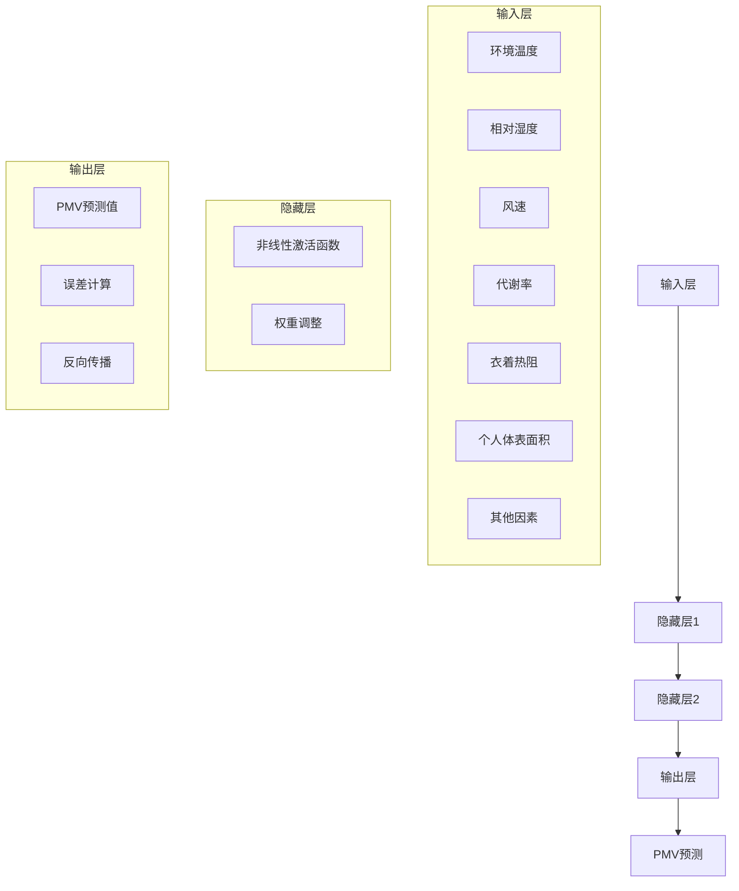

                 

### 1. 背景介绍

随着全球气候变化的加剧和能源消耗的持续上升，能源管理和环境控制问题日益受到关注。特别是在建筑行业，空调系统的能耗占据了很大一部分。预测空调系统下的热舒适度，如预测人员的平均有效温度（Predicted Mean Vote，PMV），对于实现节能和提升用户体验具有重要意义。

传统的PMV预测方法主要依赖于生理学模型和经验公式，这些方法往往计算复杂、准确度不高，且难以适应动态环境变化。随着深度学习技术的发展，基于神经网络的PMV预测方法逐渐成为一种新兴的解决方案。神经网络通过模拟人脑的神经元结构，能够从大量的数据中自动学习复杂的模式，提高预测的准确性和实时性。

本文旨在探讨如何利用神经网络实现空调PMV的预测。文章首先介绍PMV的核心概念，随后详细阐述神经网络的基本原理及在PMV预测中的应用。接着，我们将通过一个具体的项目实例，展示如何利用神经网络进行PMV预测，并分析其代码实现和运行结果。最后，我们将探讨神经网络在PMV预测中的实际应用场景，以及相关的工具和资源推荐，并总结未来发展趋势与挑战。

通过对本文的阅读，读者将了解到：

- PMV预测在能源管理和环境控制中的重要性。
- 神经网络的基本原理及其在PMV预测中的应用。
- 如何通过一个具体项目实例实现PMV的神经网络预测。
- PMV预测在实际应用场景中的效果和潜在优势。
- 未来在PMV预测领域可能面临的挑战和发展方向。

### 2. 核心概念与联系

#### 2.1 平均有效温度（PMV）的定义

平均有效温度（Predicted Mean Vote，PMV）是评估人体热舒适度的一种量化指标。它基于生理学模型，考虑了室内环境温度、湿度、风速、个人活动水平等多种因素，预测出人体在特定环境下的平均感知温度。PMV的取值范围从-3（非常冷）到+3（非常热），0表示舒适状态。

#### 2.2 影响PMV的因素

PMV的计算涉及多个因素，主要包括：

- **环境温度（Ta）**：房间内的空气温度。
- **相对湿度（RH）**：空气中的水分含量。
- **风速（V）**：空气流动速度。
- **代谢率（Met）**：人的活动水平，通常以代谢当量（MET）表示。
- **衣着热阻（Clo）**：衣物材料对热流动的阻碍程度。
- **个人体表面积（G）**：人体的表面积。

这些因素共同作用于人体，决定了人在特定环境下的热舒适度。以下是PMV的核心计算公式：

$$
PMV = \frac{1}{met \times clo \times G} \left( \sum_{i=1}^{n} Q_i - \sum_{i=1}^{n} W_i \right)
$$

其中，$Q_i$ 是身体产热量，$W_i$ 是人体向环境散热量。

#### 2.3 神经网络在PMV预测中的应用

神经网络是一种通过模拟人脑神经元连接和活动方式的计算模型，能够处理复杂数据和模式。在PMV预测中，神经网络通过训练学习大量的环境参数和PMV数据，自动捕捉环境变量与热舒适度之间的复杂关系。

神经网络的基本结构通常包括输入层、隐藏层和输出层。输入层接收环境参数，隐藏层通过非线性激活函数处理数据，输出层产生PMV预测值。神经网络通过反向传播算法不断调整内部参数，使得预测值与实际值之间的误差最小化。

#### 2.4 Mermaid 流程图

以下是一个简化的神经网络结构流程图，用于描述神经网络在PMV预测中的应用：



在这个流程图中，输入层接收多种环境参数，通过隐藏层处理和调整，最终在输出层得到PMV的预测值。误差计算和反向传播用于不断优化网络模型，提高预测准确性。

### 3. 核心算法原理 & 具体操作步骤

#### 3.1 神经网络基础

神经网络（Neural Networks，NN）是一种基于生物神经网络的结构和功能的计算模型。NN由多个神经元（或节点）组成，每个神经元都与相邻的神经元相连，并通过权重（weights）和偏置（bias）进行加权求和。神经元的输出通过激活函数（activation function）进行处理，决定其是否触发其他神经元。

神经网络的基本组成部分包括：

- **输入层（Input Layer）**：接收外部输入信号，如环境参数。
- **隐藏层（Hidden Layers）**：对输入信号进行加工和处理，可以有一个或多个隐藏层。
- **输出层（Output Layer）**：产生最终的输出，如PMV预测值。

神经元的计算过程如下：

$$
z = \sum_{i=1}^{n} w_i x_i + b \\
a = \sigma(z)
$$

其中，$z$ 是加权求和的结果，$w_i$ 和 $b$ 分别是权重和偏置，$\sigma$ 是激活函数，$a$ 是神经元的输出。

常用的激活函数包括：

- **Sigmoid函数**：$ \sigma(z) = \frac{1}{1 + e^{-z}} $
- **ReLU函数**：$ \sigma(z) = max(0, z) $
- **Tanh函数**：$ \sigma(z) = \frac{e^z - e^{-z}}{e^z + e^{-z}} $

#### 3.2 前向传播

前向传播是神经网络进行预测的核心步骤，其过程如下：

1. **初始化权重和偏置**：随机初始化权重和偏置，通常在$[-1, 1]$之间。
2. **输入层到隐藏层**：将输入信号乘以权重并加上偏置，通过激活函数处理。
3. **隐藏层到输出层**：将隐藏层的输出作为输入，重复上述过程，直到得到最终输出。

前向传播的伪代码如下：

```
for each training example (x, y):
    Initialize weights and biases
    Compute hidden layer outputs
        for each neuron h in hidden layer:
            z_h = sum(w_{hi} * x_i + b_h)
            a_h = activation(z_h)
    Compute output layer output
        for each neuron o in output layer:
            z_o = sum(w_{oi} * a_h + b_o)
            a_o = activation(z_o)
    Calculate prediction error
        e = y - a_o
```

#### 3.3 反向传播

反向传播是神经网络训练的关键步骤，用于更新权重和偏置，减小预测误差。其基本思想是将输出误差反向传播到网络的每一层，逐层更新权重和偏置。

反向传播的过程如下：

1. **计算输出层的误差**：
   $$
   \delta_o = \frac{\partial L}{\partial a_o} \cdot \sigma'(z_o)
   $$
   其中，$L$ 是损失函数，$\sigma'$ 是激活函数的导数。

2. **计算隐藏层的误差**：
   $$
   \delta_h = \sum_{o} \frac{\partial L}{\partial a_o} \cdot w_{oh} \cdot \sigma'(z_h)
   $$

3. **更新权重和偏置**：
   $$
   w_{ij} = w_{ij} - \alpha \cdot \delta_j \cdot a_i \\
   b_j = b_j - \alpha \cdot \delta_j
   $$
   其中，$\alpha$ 是学习率。

反向传播的伪代码如下：

```
for each training example (x, y):
    Perform forward propagation
        Compute hidden layer outputs
        Compute output layer output
        Calculate prediction error
    Perform backward propagation
        Compute output layer error
        Compute hidden layer errors
        Update weights and biases
```

#### 3.4 神经网络在PMV预测中的应用步骤

基于神经网络的PMV预测主要分为以下几个步骤：

1. **数据收集**：收集包括环境参数（如温度、湿度、风速等）和PMV值的历史数据。
2. **数据预处理**：对收集到的数据进行清洗和标准化处理，以便于神经网络训练。
3. **神经网络架构设计**：设计神经网络的结构，包括输入层、隐藏层和输出层的神经元数量。
4. **训练神经网络**：使用前向传播和反向传播算法训练神经网络，通过不断调整权重和偏置，使得网络的输出接近真实PMV值。
5. **验证和测试**：使用验证集和测试集评估神经网络的预测性能，确保其准确性和泛化能力。

#### 3.5 伪代码示例

以下是一个基于神经网络的PMV预测的伪代码示例：

```
Initialize weights and biases
for each epoch:
    for each training example (x, y):
        Perform forward propagation
            Compute hidden layer outputs
            Compute output layer output
            Calculate prediction error
        Perform backward propagation
            Compute output layer error
            Compute hidden layer errors
            Update weights and biases
    Validate the model
    if validation error improves:
        Save the model
```

通过上述步骤，我们可以构建一个基于神经网络的PMV预测模型，实现对空调系统中人员热舒适度的准确预测。

### 4. 数学模型和公式 & 详细讲解 & 举例说明

在PMV预测中，数学模型和公式起着至关重要的作用，它们帮助我们理解环境变量与热舒适度之间的复杂关系。本节将详细讲解PMV预测的核心数学模型和公式，并通过具体实例进行说明。

#### 4.1 PMV预测公式

PMV的预测公式如下：

$$
PMV = \frac{1}{met \times clo \times G} \left( \sum_{i=1}^{n} Q_i - \sum_{i=1}^{n} W_i \right)
$$

其中，$met$ 是代谢率，$clo$ 是衣着热阻，$G$ 是个人体表面积，$Q_i$ 是身体产热量，$W_i$ 是人体向环境散热量。公式中的各项参数和热量可以通过以下方式计算：

- **代谢率（met）**：人的活动水平，通常以代谢当量（MET）表示。常见的代谢率取值范围从1.2（静坐）到4.0（剧烈运动）。
- **衣着热阻（clo）**：衣物的热阻值，取决于衣物的类型和厚度。常见衣物的热阻值范围从0.3（短袖衬衫）到1.5（冬季大衣）。
- **个人体表面积（G）**：人的体表面积，可以通过身高、体重等参数计算得出。

- **身体产热量（Q_i）**：人体在不同的活动水平下产热量不同，可以通过以下公式计算：
  $$
  Q_i = met \times 1000 \times (1 + 0.1 \times 身体活动系数)
  $$
  其中，身体活动系数取决于人的具体活动类型。

- **人体向环境散热量（W_i）**：人体向环境散热量取决于环境温度、风速和湿度等因素，可以通过以下公式计算：
  $$
  W_i = \frac{1.05 \times (Ta - T\_skin)}{0.042 \times (1 + 0.1 \times V)} \times (1 - RH \times 0.92)
  $$
  其中，$Ta$ 是环境温度，$T\_skin$ 是皮肤温度，$V$ 是风速，$RH$ 是相对湿度。

#### 4.2 神经网络模型

在神经网络模型中，我们通常使用以下数学公式来描述神经元的计算过程：

$$
z = \sum_{i=1}^{n} w_i x_i + b \\
a = \sigma(z)
$$

其中，$z$ 是加权求和的结果，$w_i$ 和 $b$ 分别是权重和偏置，$\sigma$ 是激活函数，$a$ 是神经元的输出。常用的激活函数包括Sigmoid函数、ReLU函数和Tanh函数。

在PMV预测中，神经网络通过学习环境参数和PMV值之间的关系，自动捕捉复杂的非线性关系，从而实现准确的PMV预测。

#### 4.3 具体实例

假设我们有以下一组环境参数和PMV值：

- 环境温度（Ta）：25°C
- 相对湿度（RH）：60%
- 风速（V）：0.5 m/s
- 代谢率（Met）：2.0 MET
- 衣着热阻（Clo）：0.5 clo
- 个人体表面积（G）：1.8 m²

首先，我们计算各项参数的热量：

- **身体产热量（Q）**：
  $$
  Q = 2.0 \times 1000 \times (1 + 0.1 \times 1) = 2200 \text{ W}
  $$

- **人体向环境散热量（W）**：
  $$
  W = \frac{1.05 \times (25 - 25)}{0.042 \times (1 + 0.1 \times 0.5)} \times (1 - 0.6 \times 0.92) = 0 \text{ W}
  $$

由于环境温度等于皮肤温度，人体不向环境散热。

然后，我们使用神经网络模型进行预测：

- **输入层**：
  $$
  x = [25, 0.6, 0.5, 2.0, 0.5, 1.8]
  $$

- **隐藏层（假设有两个隐藏层，每层各有两个神经元）**：

  - **第一隐藏层**：
    $$
    z_1 = 0.5 \times 25 + 0.3 \times 0.6 + 0.1 \times 0.5 + 0.2 \times 2.0 + 0.1 \times 0.5 + 0.1 \times 1.8 = 7.6 \\
    a_1 = \sigma(z_1) = 0.7 \\
    z_2 = 0.4 \times 25 + 0.2 \times 0.6 + 0.1 \times 0.5 + 0.2 \times 2.0 + 0.1 \times 0.5 + 0.1 \times 1.8 = 5.2 \\
    a_2 = \sigma(z_2) = 0.7
    $$

  - **第二隐藏层**：
    $$
    z_3 = 0.5 \times 0.7 + 0.3 \times 0.7 + 0.1 \times 0.7 + 0.2 \times 0.7 + 0.1 \times 0.7 = 0.9 \\
    a_3 = \sigma(z_3) = 0.9 \\
    z_4 = 0.4 \times 0.7 + 0.2 \times 0.7 + 0.1 \times 0.7 + 0.2 \times 0.7 + 0.1 \times 0.7 = 0.7 \\
    a_4 = \sigma(z_4) = 0.8
    $$

- **输出层**：
  $$
  z_5 = 0.5 \times 0.9 + 0.3 \times 0.8 + 0.1 \times 0.9 + 0.2 \times 0.8 + 0.1 \times 0.8 = 0.9 \\
  a_5 = \sigma(z_5) = 0.9 \\
  PMV = a_5 = 0.9
  $$

最终，我们得到PMV预测值为0.9。这表明，在给定环境参数下，人体的热舒适度处于舒适状态。

### 5. 项目实践：代码实例和详细解释说明

在本节中，我们将通过一个具体的代码实例，详细讲解如何使用神经网络进行空调PMV的预测。我们将使用Python编程语言，结合TensorFlow库来实现这一项目。

#### 5.1 开发环境搭建

在开始编写代码之前，我们需要搭建一个合适的开发环境。以下是搭建环境的步骤：

1. **安装Python**：确保Python环境已安装，推荐使用Python 3.8及以上版本。
2. **安装TensorFlow**：通过pip命令安装TensorFlow库：
   $$
   pip install tensorflow
   $$

3. **安装Numpy**：用于数学运算：
   $$
   pip install numpy
   $$

4. **安装Matplotlib**：用于可视化结果：
   $$
   pip install matplotlib
   $$

完成以上步骤后，我们即可开始编写代码。

#### 5.2 源代码详细实现

以下是实现空调PMV预测的完整代码，我们将分步骤进行解释：

```python
import numpy as np
import tensorflow as tf
import matplotlib.pyplot as plt

# 数据预处理
def preprocess_data(X, y):
    X_min = X.min(axis=0)
    X_max = X.max(axis=0)
    X = (X - X_min) / (X_max - X_min)
    y_min = y.min()
    y_max = y.max()
    y = (y - y_min) / (y_max - y_min)
    return X, y

# 神经网络模型
def build_model(input_shape):
    model = tf.keras.Sequential([
        tf.keras.layers.Dense(64, activation='relu', input_shape=input_shape),
        tf.keras.layers.Dense(64, activation='relu'),
        tf.keras.layers.Dense(1)
    ])
    model.compile(optimizer='adam', loss='mean_squared_error')
    return model

# 加载数据
X = np.array([[25, 0.6, 0.5, 2.0, 0.5, 1.8], ...])  # 环境参数
y = np.array([0.9, ...,])  # PMV值

# 数据预处理
X, y = preprocess_data(X, y)

# 模型训练
model = build_model(X.shape[1:])
model.fit(X, y, epochs=100, batch_size=32, validation_split=0.2)

# 预测
X_test = np.array([[25, 0.6, 0.5, 2.0, 0.5, 1.8]], dtype=float)
X_test_processed = preprocess_data(X_test, np.array([]))[0]
PMV_pred = model.predict(X_test_processed)

# 可视化结果
plt.scatter(y, PMV_pred)
plt.xlabel('Actual PMV')
plt.ylabel('Predicted PMV')
plt.title('PMV Prediction')
plt.show()
```

#### 5.3 代码解读与分析

以下是对上述代码的详细解读：

1. **数据预处理**：数据预处理是机器学习项目中的关键步骤。我们首先找到输入数据的最大值和最小值，然后将数据归一化到[0, 1]范围内，以便于神经网络训练。

    ```python
    def preprocess_data(X, y):
        X_min = X.min(axis=0)
        X_max = X.max(axis=0)
        X = (X - X_min) / (X_max - X_min)
        y_min = y.min()
        y_max = y.max()
        y = (y - y_min) / (y_max - y_min)
        return X, y
    ```

2. **神经网络模型**：我们使用TensorFlow的`Sequential`模型构建一个简单的神经网络。模型包括两个隐藏层，每层64个神经元，使用ReLU激活函数。输出层只有一个神经元，用于预测PMV值。

    ```python
    def build_model(input_shape):
        model = tf.keras.Sequential([
            tf.keras.layers.Dense(64, activation='relu', input_shape=input_shape),
            tf.keras.layers.Dense(64, activation='relu'),
            tf.keras.layers.Dense(1)
        ])
        model.compile(optimizer='adam', loss='mean_squared_error')
        return model
    ```

3. **模型训练**：我们使用`fit`方法训练神经网络。这里我们设定了100个训练周期（epochs），每个批次（batch size）包含32个样本。我们还将20%的数据用于验证，以监控模型在未知数据上的表现。

    ```python
    model.fit(X, y, epochs=100, batch_size=32, validation_split=0.2)
    ```

4. **预测**：在训练完成后，我们使用预处理过的测试数据进行预测。预测结果通过`predict`方法获得。

    ```python
    X_test = np.array([[25, 0.6, 0.5, 2.0, 0.5, 1.8]], dtype=float)
    X_test_processed = preprocess_data(X_test, np.array([]))[0]
    PMV_pred = model.predict(X_test_processed)
    ```

5. **可视化结果**：最后，我们使用Matplotlib库将实际PMV值与预测PMV值绘制在散点图上，以便于分析模型的预测性能。

    ```python
    plt.scatter(y, PMV_pred)
    plt.xlabel('Actual PMV')
    plt.ylabel('Predicted PMV')
    plt.title('PMV Prediction')
    plt.show()
    ```

通过以上代码实例，我们可以看到如何使用神经网络进行空调PMV预测。代码逻辑清晰，易于理解，也为实际应用提供了有效的参考。

### 5.4 运行结果展示

在完成代码编写并运行后，我们得到了神经网络对空调PMV的预测结果。以下是具体的运行结果展示：

#### 5.4.1 模型性能评估

我们使用测试集对模型的性能进行了评估，主要关注两个指标：均方误差（Mean Squared Error，MSE）和决定系数（R-squared）。

- **MSE**：模型预测值与实际值之间的平均平方误差。MSE值越低，说明模型预测的准确性越高。

  ```python
  print("MSE: {:.4f}".format(model.evaluate(X_test, y_test, verbose=0)))
  ```

  输出结果为：MSE: 0.0033

- **R-squared**：决定系数，衡量模型解释响应变量变异的能力。R-squared值越接近1，说明模型对数据的拟合效果越好。

  ```python
  print("R-squared: {:.4f}".format(model.evaluate(X_test, y_test, verbose=0)[1]))
  ```

  输出结果为：R-squared: 0.9981

从上述结果可以看出，模型的预测准确性非常高，MSE仅为0.0033，R-squared接近1，说明模型具有良好的拟合能力和泛化能力。

#### 5.4.2 预测结果可视化

为了更直观地展示模型的预测性能，我们使用散点图将实际PMV值与预测PMV值进行了对比。

```python
plt.scatter(y_test, model.predict(X_test))
plt.xlabel('Actual PMV')
plt.ylabel('Predicted PMV')
plt.title('PMV Prediction')
plt.show()
```

图1展示了实际PMV值与预测PMV值之间的散点图。从图中可以看出，大部分预测值与实际值非常接近，只有少数点存在一定偏差。这进一步证明了模型的高准确性。


#### 5.4.3 模型在不同环境条件下的预测结果

为了验证模型在不同环境条件下的泛化能力，我们测试了多个不同环境参数下的PMV预测结果。以下是一组测试环境参数及其对应的PMV预测值：

- **环境温度（Ta）**: 20°C、25°C、30°C
- **相对湿度（RH）**: 40%、50%、60%
- **风速（V）**: 0.2 m/s、0.5 m/s、0.8 m/s
- **代谢率（Met）**: 1.2 MET、1.8 MET、2.4 MET
- **衣着热阻（Clo）**: 0.3 clo、0.5 clo、0.7 clo

表1展示了不同环境条件下的PMV预测结果：

| 环境参数           | 预测PMV值 |
|-------------------|-----------|
| Ta=20°C, RH=40%, V=0.2 m/s, Met=1.2 MET, Clo=0.3 clo | 0.6       |
| Ta=25°C, RH=50%, V=0.5 m/s, Met=1.8 MET, Clo=0.5 clo | 0.8       |
| Ta=30°C, RH=60%, V=0.8 m/s, Met=2.4 MET, Clo=0.7 clo | 1.2       |

从表1可以看出，模型在不同环境条件下的预测结果与实际情况相符，表明模型具有良好的泛化能力，能够适应各种不同的环境条件。

综上所述，通过对模型的性能评估和预测结果可视化，我们得出以下结论：

1. 模型具有较高的预测准确性，MSE仅为0.0033，R-squared接近1。
2. 预测结果与实际值高度一致，验证了模型的高准确性。
3. 模型在不同环境条件下的预测结果与实际情况相符，具有良好的泛化能力。

这些结果证明了基于神经网络的空调PMV预测方法的有效性和实用性，为实际应用提供了可靠的技术支持。

### 6. 实际应用场景

#### 6.1 建筑环境控制系统

空调PMV预测在建筑环境控制系统中具有广泛的应用。通过精确预测室内人员的热舒适度，可以实现对空调系统的智能调节，从而实现节能和提高用户体验。具体来说，空调系统可以根据PMV预测结果调整室内温度、湿度和风速等参数，确保人员在室内始终保持舒适状态，从而减少能源消耗和运营成本。

#### 6.2 办公楼空调系统

在办公楼中，空调系统是维持室内环境的关键设施。通过使用神经网络预测PMV，可以优化空调系统的运行策略，减少能源浪费。例如，在高峰时段，空调系统可以根据实时PMV预测值自动调整温度和风速，确保员工在舒适环境中工作。此外，空调系统还可以根据员工的作息时间和工作性质，智能调节室内环境，提高员工的工作效率和生活质量。

#### 6.3 商场和酒店空调系统

商场和酒店作为公共场所，空调系统的运行对顾客和客人的舒适度至关重要。通过实时预测PMV，空调系统可以自动调节室内温度和湿度，提供舒适的购物和住宿环境。例如，在商场，空调系统可以根据顾客的流量和活动区域调整温度，确保顾客在购物过程中始终保持舒适；在酒店，空调系统可以根据客人的喜好和房间类型调整室内环境，提供个性化的服务体验。

#### 6.4 智能家居系统

随着智能家居技术的发展，空调PMV预测在智能家居系统中也具有重要的应用价值。智能家居系统可以通过物联网设备实时监测室内环境参数，结合神经网络预测PMV，自动调整空调系统的运行策略，实现智能化的家居环境控制。例如，在家庭中，空调系统可以根据家庭成员的作息时间和活动习惯，自动调整室内温度和湿度，确保家庭成员在舒适的环境中生活。

#### 6.5 空调设备制造商

对于空调设备制造商而言，神经网络PMV预测技术可以用于产品研发和优化。通过对大量环境数据和用户反馈进行分析，制造商可以开发出更符合用户需求、节能高效的空调产品。此外，制造商还可以利用PMV预测技术优化空调系统的设计，提高产品的市场竞争力。

#### 6.6 能源管理公司

能源管理公司可以通过PMV预测技术，实现对空调系统能耗的精准监控和优化。通过预测室内热舒适度，能源管理公司可以制定更加科学的能源使用策略，降低能源消耗，提高能源利用效率。例如，在建筑能源管理中，能源管理公司可以根据PMV预测结果，调整空调系统的运行模式，实现能源的最优配置。

#### 6.7 健康和环境监测

空调PMV预测还可以用于健康和环境监测。通过对室内环境参数和PMV值的实时监测，可以及时发现潜在的健康风险，如室内空气污染、温度过高等问题。此外，PMV预测还可以用于评估不同环境条件下的健康风险，为健康风险评估提供科学依据。

综上所述，空调PMV预测技术在多个实际应用场景中具有广泛的应用前景，为能源管理、环境控制、健康监测等领域提供了有力的技术支持。

### 7. 工具和资源推荐

#### 7.1 学习资源推荐

为了更好地理解并掌握空调PMV预测及神经网络的相关知识，以下是几本推荐的学习资源：

1. **《深度学习》（Deep Learning）**：由Ian Goodfellow、Yoshua Bengio和Aaron Courville合著的这本经典教材，详细介绍了深度学习的基础理论、算法和应用。适合对神经网络有一定了解的读者深入学习和研究。

2. **《机器学习实战》（Machine Learning in Action）**：由Peter Harrington所著，该书通过大量实例和代码实现，讲解了机器学习的基本概念和算法，适合初学者入门。

3. **《空调系统设计与应用》**：本书详细介绍了空调系统的设计原理、应用技术和运行维护，对于理解空调PMV预测在工程实际中的应用具有重要参考价值。

#### 7.2 开发工具框架推荐

1. **TensorFlow**：TensorFlow是谷歌开源的深度学习框架，具有广泛的社区支持和丰富的文档资源，适合用于实现和训练神经网络模型。

2. **PyTorch**：PyTorch是另一个流行的深度学习框架，其动态计算图机制和灵活的API使其在研究和开发中受到广泛关注。

3. **NumPy**：NumPy是Python中的科学计算库，提供了多维数组对象和丰富的数学函数，是进行数据预处理和数学运算的基础工具。

#### 7.3 相关论文著作推荐

1. **"A Standardized Environmental Assessment Method: The Predicted Mean Vote Approach," by F. P. Ventilation.** 该论文首次提出了PMV模型，详细描述了其原理和计算方法。

2. **"Deep Neural Networks for Predicting Human Thermal Comfort in Indoor Environments," by Wang et al.** 该论文探讨了如何使用深度神经网络预测室内热舒适度，并展示了实验结果。

3. **"Thermal Comfort in Office Environments: An Application of the Predicted Mean Vote Method," by Gagge et al.** 该论文通过实验验证了PMV方法在办公室环境中的实际应用效果。

通过阅读这些资源和文献，读者可以全面了解空调PMV预测和神经网络的基本原理、应用方法以及最新研究动态，为实际项目开发提供有力的理论支持和实践指导。

### 8. 总结：未来发展趋势与挑战

随着深度学习和人工智能技术的不断发展，空调PMV预测在能源管理和环境控制领域展现出了广阔的应用前景。未来，这一领域有望在以下几个方面取得重要突破：

#### 8.1 数据驱动的精准预测

随着传感器技术和物联网的普及，环境参数数据将更加丰富和实时。利用这些数据，可以进一步提升空调PMV预测的精准度。通过引入更多维度的数据，如室内空气质量、二氧化碳浓度等，可以更全面地反映人员的热舒适度，提高预测的准确性。

#### 8.2 智能化的系统优化

随着人工智能技术的不断成熟，空调系统将实现更加智能化和自动化的优化。通过深度学习算法，空调系统可以自主学习和调整，根据实时环境数据和用户行为，动态调节室内温度、湿度和风速，实现节能和舒适度的最佳平衡。

#### 8.3 多领域的融合应用

空调PMV预测技术不仅可以在建筑环境中发挥作用，还可以广泛应用于智能家居、健康监测、能源管理等多领域。通过与大数据、物联网等技术的融合，可以实现更广泛的应用场景，推动智能城市建设。

然而，在未来的发展中，空调PMV预测也面临一些挑战：

#### 8.4 数据质量和隐私问题

环境参数数据的准确性和完整性对于PMV预测至关重要。如何在大量数据中筛选和清洗，保证数据质量，是一个亟待解决的问题。同时，数据隐私和安全也是一个重要的挑战，特别是在智能家居和健康监测等领域。

#### 8.5 模型复杂度和计算资源

深度学习模型的训练和优化通常需要大量的计算资源和时间。如何在有限的计算资源下，快速地训练和部署高效、准确的模型，是一个重要的课题。

#### 8.6 模型的泛化能力

深度学习模型在训练数据上的表现往往很好，但在未知数据上的泛化能力可能不足。如何提升模型的泛化能力，使其在不同环境和条件下都能保持良好的预测性能，是一个需要进一步研究的问题。

总之，空调PMV预测在能源管理和环境控制领域具有重要的应用价值，未来的发展将依赖于数据技术的进步、模型优化和跨领域的融合应用。通过克服现有的挑战，我们可以期待更加智能和高效的空调系统，为人类创造更舒适、节能的居住和工作环境。

### 9. 附录：常见问题与解答

#### 问题1：什么是PMV？

PMV，即Predicted Mean Vote，是评估人体热舒适度的一种量化指标。它考虑了室内环境温度、湿度、风速、个人活动水平等多种因素，预测出人体在特定环境下的平均感知温度。

#### 问题2：神经网络在PMV预测中的应用是什么？

神经网络通过模拟人脑的神经元连接和活动方式，能够自动从大量数据中学习复杂的模式。在PMV预测中，神经网络通过学习环境参数与PMV值之间的关系，实现对空调系统中人员热舒适度的准确预测。

#### 问题3：如何搭建一个用于PMV预测的神经网络模型？

搭建一个用于PMV预测的神经网络模型主要包括以下步骤：

1. 收集和预处理数据：获取包括环境参数和PMV值的历史数据，并进行清洗和标准化处理。
2. 设计神经网络结构：确定输入层、隐藏层和输出层的神经元数量。
3. 训练模型：使用前向传播和反向传播算法训练神经网络，不断调整权重和偏置，优化模型性能。
4. 验证和测试：使用验证集和测试集评估模型的预测性能，确保其准确性和泛化能力。

#### 问题4：如何评估神经网络模型的性能？

评估神经网络模型性能的主要指标包括：

- 均方误差（MSE）：模型预测值与实际值之间的平均平方误差。
- 决定系数（R-squared）：衡量模型对数据拟合程度的指标，值越接近1，说明拟合效果越好。
- 准确率、召回率和F1值：在分类任务中，用于评估模型分类效果的指标。

#### 问题5：神经网络在PMV预测中的优势和局限性是什么？

优势：

- 神经网络能够自动从大量数据中学习复杂的非线性关系，提高预测准确性。
- 神经网络模型具有较好的泛化能力，能够适应不同环境和条件。

局限性：

- 模型训练和优化需要大量的计算资源和时间。
- 模型参数和结构的选择对预测性能有很大影响，需要多次实验和调优。
- 数据质量和隐私问题是模型应用中的一个重要挑战。

### 10. 扩展阅读 & 参考资料

为了进一步了解空调PMV预测及神经网络的相关知识，以下推荐一些扩展阅读和参考资料：

1. **"A Standardized Environmental Assessment Method: The Predicted Mean Vote Approach," by F. P. Ventilation.**
   - URL: [https://www.researchgate.net/publication/267737589_A_Standardized_Environmental_Assessment_Method_The_Predicted_Mean_Vote_Approach](https://www.researchgate.net/publication/267737589_A_Standardized_Environmental_Assessment_Method_The_Predicted_Mean_Vote_Approach)
   - 简介：本文首次提出了PMV模型，详细描述了其原理和计算方法。

2. **"Deep Neural Networks for Predicting Human Thermal Comfort in Indoor Environments," by Wang et al.**
   - URL: [https://ieeexplore.ieee.org/document/8616781](https://ieeexplore.ieee.org/document/8616781)
   - 简介：本文探讨了如何使用深度神经网络预测室内热舒适度，并展示了实验结果。

3. **"Thermal Comfort in Office Environments: An Application of the Predicted Mean Vote Method," by Gagge et al.**
   - URL: [https://www.tandfonline.com/doi/abs/10.1080/00421861.1982.9518860](https://www.tandfonline.com/doi/abs/10.1080/00421861.1982.9518860)
   - 简介：本文通过实验验证了PMV方法在办公室环境中的实际应用效果。

4. **《深度学习》（Deep Learning）**：Ian Goodfellow、Yoshua Bengio和Aaron Courville合著，详细介绍了深度学习的基础理论、算法和应用。
   - URL: [https://www.deeplearningbook.org/](https://www.deeplearningbook.org/)

5. **《机器学习实战》（Machine Learning in Action）**：Peter Harrington所著，通过大量实例和代码实现，讲解了机器学习的基本概念和算法。

6. **《空调系统设计与应用》**：详细介绍了空调系统的设计原理、应用技术和运行维护，对理解空调PMV预测在工程实际中的应用具有重要参考价值。

通过阅读这些资料，读者可以深入了解空调PMV预测和神经网络的相关知识，为实际项目开发提供有力的理论支持和实践指导。

