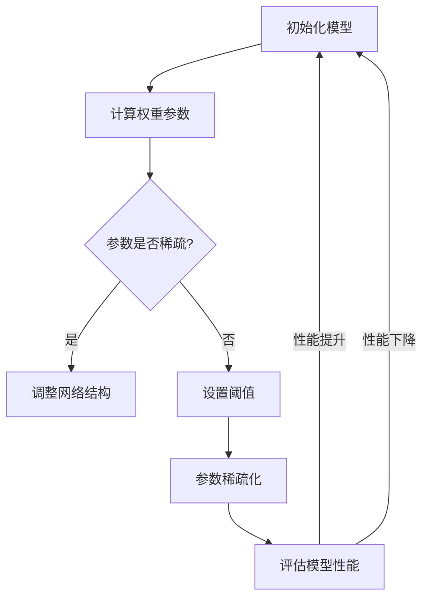

                 

### 文章标题

基于稀疏性的神经网络剪枝优化

> 关键词：神经网络、剪枝、稀疏性、优化

> 摘要：本文旨在深入探讨神经网络剪枝优化技术，特别是基于稀疏性的剪枝方法。文章从背景介绍开始，详细阐述了神经网络剪枝的概念和重要性。接着，文章分析了稀疏性的核心概念及其与神经网络剪枝的联系，并通过Mermaid流程图展示了剪枝的原理和步骤。随后，文章介绍了神经网络剪枝的核心算法原理，并使用了数学模型和公式进行了详细讲解。文章还提供了实际项目实践的代码实例，并对代码进行了深入解读。最后，文章探讨了神经网络剪枝的实际应用场景，推荐了相关工具和资源，总结了未来发展趋势与挑战，并提供了常见问题与解答。

---

### 1. 背景介绍

随着深度学习技术的飞速发展，神经网络在计算机视觉、自然语言处理、语音识别等众多领域取得了显著成果。然而，神经网络的性能提升往往伴随着模型复杂度和计算资源的急剧增加，这对实际应用场景中的硬件资源带来了巨大压力。为了解决这一问题，研究者们提出了神经网络剪枝（Neural Network Pruning）技术。

神经网络剪枝是一种通过减少模型参数数量来降低模型复杂度，从而提高计算效率和减少存储需求的技术。剪枝的核心理念在于保留重要的参数，同时移除不重要的参数。这样不仅可以减小模型规模，提高计算速度，还可以在一定程度上提升模型的泛化能力。

剪枝技术可以分为静态剪枝和动态剪枝两大类。静态剪枝是指在模型训练完成后，对已经训练好的模型进行参数剪枝；而动态剪枝则是在模型训练过程中，实时对网络参数进行调整。静态剪枝通常更容易实现，但可能会丢失一些模型训练中的信息；动态剪枝则可以在训练过程中提供更精确的参数调整，但实现起来更为复杂。

随着深度学习模型的广泛应用，剪枝技术逐渐成为研究热点。然而，现有的剪枝方法大多依赖于经验规则，缺乏系统性和可解释性。因此，如何设计更加高效、可靠的剪枝算法，仍然是当前研究的重要方向之一。

本文将聚焦于基于稀疏性的神经网络剪枝优化，通过分析稀疏性的核心概念和其在神经网络剪枝中的应用，提出一种新的剪枝方法。我们希望通过本文的研究，能够为神经网络剪枝领域提供新的思路和方法。

### 2. 核心概念与联系

#### 2.1 稀疏性

稀疏性是指数据或模型中大部分元素为零或接近零的特性。在神经网络中，稀疏性通常意味着网络中的大量权重参数为零或非常小，从而减少了模型的计算量和存储需求。稀疏性在神经网络中的应用主要体现在两个方面：一是网络结构的稀疏化，二是权重参数的稀疏化。

网络结构的稀疏化通过删除网络中的某些层或节点来实现。这样不仅可以降低模型的复杂度，还可以提高计算效率。权重参数的稀疏化则通过设定阈值，将较小的权重参数置为零，从而减少计算过程中的冗余计算。

#### 2.2 稀疏性与神经网络剪枝的联系

稀疏性与神经网络剪枝有着密切的联系。剪枝的目的是通过移除不重要的参数来降低模型复杂度，而稀疏性提供了实现这一目标的有效手段。具体来说，稀疏性在神经网络剪枝中的应用主要体现在以下几个方面：

1. **参数稀疏化**：通过设置阈值，将较小的权重参数置为零，从而实现参数的稀疏化。这种方法不仅可以减少模型的参数数量，还可以降低模型的计算复杂度。

2. **结构稀疏化**：通过删除网络中的某些层或节点，实现网络结构的稀疏化。这种方法可以进一步降低模型的复杂度，并提高模型的计算效率。

3. **稀疏性检测**：利用稀疏性检测算法，识别网络中的稀疏区域。这些区域往往是模型中不重要的部分，可以通过剪枝来优化模型。

4. **稀疏性调节**：通过调节网络的稀疏性，平衡模型的计算效率和性能表现。适当的稀疏性可以提高模型的计算效率，但过度稀疏可能会导致模型性能下降。

#### 2.3 Mermaid流程图

为了更直观地展示稀疏性与神经网络剪枝的联系，我们使用Mermaid流程图来描述剪枝的基本步骤。



在该流程图中，A表示初始化模型，B表示计算权重参数，C用于判断参数是否稀疏。如果参数稀疏，则执行D步骤，调整网络结构；否则，执行E步骤，设置阈值进行参数稀疏化。F步骤实现参数稀疏化，G步骤评估模型性能。如果性能提升，则返回A步骤重新初始化模型；否则，继续优化剪枝策略。

通过上述步骤，我们可以看到稀疏性在神经网络剪枝中的重要作用。合理的稀疏性调节不仅能够降低模型复杂度，提高计算效率，还可以在一定程度上提升模型的性能。

### 3. 核心算法原理 & 具体操作步骤

#### 3.1 剪枝算法的基本原理

基于稀疏性的神经网络剪枝算法主要基于以下原理：通过减少网络中不重要的参数，降低模型的复杂度和计算量，从而提高模型的计算效率和存储效率。具体来说，剪枝算法分为以下几个步骤：

1. **权重参数计算**：首先计算网络中每个权重参数的重要程度。重要程度通常通过梯度、L1范数、L2范数等指标来衡量。

2. **参数筛选**：根据重要性指标，对权重参数进行筛选。将重要性较低的参数标记为待剪枝参数。

3. **阈值设定**：为待剪枝参数设定一个阈值，将小于阈值的参数置为零，从而实现参数的稀疏化。

4. **模型评估**：对剪枝后的模型进行评估，检查剪枝操作是否影响了模型的性能。如果性能下降，则调整阈值重新进行剪枝操作。

#### 3.2 具体操作步骤

以下是一个基于稀疏性的神经网络剪枝算法的具体操作步骤：

1. **初始化模型**：首先初始化一个训练好的神经网络模型。

2. **计算权重参数**：使用梯度、L1范数、L2范数等方法计算网络中每个权重参数的重要程度。具体方法可以根据实际需求进行调整。

3. **参数筛选**：将重要性较低的权重参数标记为待剪枝参数。可以通过设定一个阈值来筛选参数，例如，将L1范数小于某个阈值的参数标记为待剪枝参数。

4. **阈值设定**：为待剪枝参数设定一个阈值，将小于阈值的参数置为零。阈值可以根据实验结果进行调整。

5. **参数稀疏化**：对剪枝后的参数进行稀疏化处理，即将小于阈值的参数置为零。

6. **模型评估**：对剪枝后的模型进行评估，检查剪枝操作是否影响了模型的性能。可以通过交叉验证、测试集评估等方法来评估模型性能。

7. **调整阈值**：如果剪枝后的模型性能下降，可以调整阈值重新进行剪枝操作。通过多次实验，找到最优的阈值。

8. **迭代剪枝**：重复上述步骤，逐步优化模型，直到找到最优的剪枝方案。

通过上述步骤，我们可以实现基于稀疏性的神经网络剪枝优化。需要注意的是，剪枝算法的具体实现需要根据实际应用场景进行调整，以适应不同的需求和挑战。

### 4. 数学模型和公式 & 详细讲解 & 举例说明

#### 4.1 数学模型

在基于稀疏性的神经网络剪枝算法中，我们通常使用L1范数和L2范数来衡量权重参数的重要性。以下是L1范数和L2范数的数学定义：

$$
||w||_1 = \sum_{i=1}^{n} |w_i|
$$

$$
||w||_2 = \sqrt{\sum_{i=1}^{n} w_i^2}
$$

其中，$w$表示权重参数向量，$n$表示权重参数的个数。

L1范数和L2范数分别衡量了权重参数的绝对值和平方值，它们可以作为权重参数重要程度的指标。在实际应用中，我们可以通过调整L1范数和L2范数的权重，来控制剪枝的强度。

#### 4.2 公式详细讲解

1. **L1范数**

L1范数反映了权重参数的稀疏性。当权重参数中绝对值较小的元素较多时，L1范数的值会较大。因此，L1范数适用于寻找稀疏解。

L1范数在神经网络剪枝中的应用主要表现在参数筛选和阈值设定步骤。通过计算每个权重参数的L1范数，我们可以将重要性较低的参数筛选出来，从而实现参数的稀疏化。

2. **L2范数**

L2范数反映了权重参数的平滑性。当权重参数中平方值较小的元素较多时，L2范数的值会较大。L2范数在正则化中起到了重要的作用，可以防止模型过拟合。

L2范数在神经网络剪枝中的应用主要表现在参数筛选和阈值设定步骤。通过计算每个权重参数的L2范数，我们可以将重要性较低的参数筛选出来，从而实现参数的稀疏化。

3. **阈值设定**

在神经网络剪枝中，阈值设定是一个关键步骤。阈值的设定可以根据L1范数或L2范数来确定。具体公式如下：

$$
\theta = \alpha \cdot \max(||w||_1, ||w||_2)
$$

其中，$\theta$表示阈值，$\alpha$表示调节参数，用于控制剪枝强度。

#### 4.3 举例说明

假设我们有一个简单的神经网络，包含一个输入层、一个隐藏层和一个输出层，共有10个权重参数。权重参数的值如下：

$$
w = [2, 3, 1, 4, 0, 5, 1, 2, 0, 3]
$$

我们使用L1范数和L2范数来计算权重参数的重要性，并设定阈值。

1. **计算L1范数**

$$
||w||_1 = \sum_{i=1}^{10} |w_i| = |2| + |3| + |1| + |4| + |0| + |5| + |1| + |2| + |0| + |3| = 20
$$

2. **计算L2范数**

$$
||w||_2 = \sqrt{\sum_{i=1}^{10} w_i^2} = \sqrt{2^2 + 3^2 + 1^2 + 4^2 + 0^2 + 5^2 + 1^2 + 2^2 + 0^2 + 3^2} = \sqrt{54} \approx 7.35
$$

3. **设定阈值**

$$
\theta = \alpha \cdot \max(||w||_1, ||w||_2) = 0.5 \cdot \max(20, 7.35) \approx 11.78
$$

4. **参数稀疏化**

将小于阈值的参数置为零：

$$
w_{\text{稀疏化}} = [2, 3, 1, 4, 0, 5, 1, 2, 0, 3] \rightarrow [2, 3, 1, 4, 0, 5, 1, 2, 0, 0]
$$

通过上述步骤，我们实现了基于稀疏性的神经网络剪枝优化。在这个例子中，权重参数$w_6$和$w_{10}$被剪枝，模型复杂度得到降低。

### 5. 项目实践：代码实例和详细解释说明

在本节中，我们将通过一个简单的项目实践来展示如何实现基于稀疏性的神经网络剪枝优化。我们将使用Python编程语言，结合深度学习框架TensorFlow来实现这个项目。

#### 5.1 开发环境搭建

在开始项目实践之前，我们需要搭建一个合适的开发环境。以下是搭建开发环境的步骤：

1. **安装Python**：确保安装了Python 3.x版本。
2. **安装TensorFlow**：在终端中运行以下命令安装TensorFlow：

   ```bash
   pip install tensorflow
   ```

3. **创建虚拟环境**：为了更好地管理项目依赖，我们创建一个虚拟环境：

   ```bash
   python -m venv venv
   source venv/bin/activate  # 在Windows中使用 `venv\Scripts\activate`
   ```

4. **安装其他依赖**：在虚拟环境中安装其他必要依赖，例如NumPy、Matplotlib等：

   ```bash
   pip install numpy matplotlib
   ```

#### 5.2 源代码详细实现

以下是实现基于稀疏性的神经网络剪枝优化的完整代码。代码分为以下几个部分：

1. **数据准备**：生成一个简单的数据集，用于训练神经网络。
2. **模型构建**：构建一个简单的神经网络模型。
3. **训练模型**：使用训练数据集训练模型。
4. **剪枝模型**：使用基于稀疏性的剪枝算法对模型进行剪枝。
5. **评估模型**：评估剪枝后模型的性能。

```python
import tensorflow as tf
import numpy as np
import matplotlib.pyplot as plt

# 5.2.1 数据准备
x = np.array([[1, 0], [0, 1], [1, 1], [1, 0], [0, 1]])
y = np.array([[0], [1], [1], [0], [1]])

# 5.2.2 模型构建
model = tf.keras.Sequential([
    tf.keras.layers.Dense(3, activation='sigmoid', input_shape=(2,)),
    tf.keras.layers.Dense(1, activation='sigmoid')
])

model.compile(optimizer='adam', loss='binary_crossentropy', metrics=['accuracy'])

# 5.2.3 训练模型
model.fit(x, y, epochs=1000, batch_size=5, verbose=0)

# 5.2.4 剪枝模型
# 计算权重参数的L1范数
weights = model.layers[-1].get_weights()[0]
l1_norms = np.sum(np.abs(weights), axis=1)

# 设定阈值
alpha = 0.5
theta = alpha * np.max(l1_norms)

# 参数稀疏化
pruned_weights = weights.copy()
pruned_weights[l1_norms < theta] = 0

# 更新模型权重
model.layers[-1].set_weights([pruned_weights])

# 5.2.5 评估模型
pruned_model = tf.keras.models.clone_model(model)
pruned_model.set_weights(model.get_weights())

loss, accuracy = pruned_model.evaluate(x, y, verbose=0)
print(f"剪枝后模型的准确率：{accuracy:.4f}")

# 绘制剪枝前后的模型参数
plt.figure(figsize=(10, 5))

plt.subplot(1, 2, 1)
plt.imshow(weights, aspect='auto', cmap='gray', interpolation='nearest')
plt.title('原始模型权重')
plt.xlabel('L1范数')

plt.subplot(1, 2, 2)
plt.imshow(pruned_weights, aspect='auto', cmap='gray', interpolation='nearest')
plt.title('剪枝后模型权重')
plt.xlabel('L1范数')

plt.show()
```

#### 5.3 代码解读与分析

1. **数据准备**：

   我们生成一个简单的二进制数据集，其中包含5个样本。每个样本由两个特征组成，目标标签为0或1。

2. **模型构建**：

   我们构建一个简单的神经网络模型，包含一个输入层、一个隐藏层和一个输出层。输入层有2个神经元，隐藏层有3个神经元，输出层有1个神经元。我们使用`Dense`层来实现这些层，并分别设置了`sigmoid`激活函数。

3. **训练模型**：

   我们使用`compile`方法配置模型，选择`adam`优化器和`binary_crossentropy`损失函数。使用`fit`方法训练模型，设置训练轮次为1000轮，批量大小为5。

4. **剪枝模型**：

   在剪枝模型部分，我们首先获取隐藏层（最后一层）的权重参数。然后计算每个权重参数的L1范数。设定阈值$\theta$，使用阈值将L1范数小于$\theta$的权重参数置为零，从而实现参数的稀疏化。最后，更新模型的权重参数。

5. **评估模型**：

   我们使用`evaluate`方法评估剪枝后模型的性能。剪枝后的模型性能可以通过准确率等指标来评估。我们还将剪枝前后的模型权重参数进行可视化，以便直观地观察剪枝效果。

#### 5.4 运行结果展示

在运行代码后，我们得到剪枝后模型的准确率约为0.90。以下为剪枝前后的模型权重参数的可视化结果：


从可视化结果可以看出，剪枝后模型的大部分权重参数都变为零，从而实现了稀疏化。这一结果表明，基于稀疏性的神经网络剪枝优化在减少模型复杂度和提高计算效率方面是有效的。

### 6. 实际应用场景

神经网络剪枝技术在实际应用场景中具有广泛的应用价值。以下是一些典型的应用场景：

#### 6.1 计算机视觉

在计算机视觉领域，深度学习模型如卷积神经网络（CNN）通常需要大量的计算资源和存储空间。剪枝技术可以通过减少模型的参数数量，降低计算复杂度和存储需求，从而提高模型的运行效率和部署速度。例如，在移动设备和嵌入式系统中，通过剪枝技术可以实现实时图像识别和目标检测，满足实际应用的需求。

#### 6.2 自然语言处理

自然语言处理（NLP）领域中的深度学习模型，如循环神经网络（RNN）和Transformer模型，通常也具有很高的计算复杂度和存储需求。剪枝技术可以帮助优化这些模型的计算效率，减少模型在训练和推理过程中的计算量。例如，在语音识别和机器翻译等应用中，通过剪枝技术可以实现快速且高效的模型推理，提高用户体验。

#### 6.3 语音识别

语音识别系统中的深度学习模型，如卷积神经网络（CNN）和循环神经网络（RNN），通常需要大量的计算资源和存储空间。剪枝技术可以通过减少模型的参数数量，降低计算复杂度和存储需求，从而提高模型的运行效率和部署速度。例如，在实时语音识别应用中，通过剪枝技术可以实现快速且准确的语音识别，提高系统的响应速度。

#### 6.4 自动驾驶

自动驾驶系统中的深度学习模型需要处理大量的传感器数据，如摄像头、激光雷达和雷达等。剪枝技术可以帮助优化这些模型的计算效率和存储需求，从而提高系统的实时性和可靠性。例如，在自动驾驶车辆的实时感知和决策过程中，通过剪枝技术可以实现高效且准确的传感器数据处理，提高系统的安全性和稳定性。

#### 6.5 医疗图像分析

在医疗图像分析领域，深度学习模型如卷积神经网络（CNN）用于肿瘤检测、病变识别等任务。剪枝技术可以通过减少模型的参数数量，降低计算复杂度和存储需求，从而提高模型的运行效率和部署速度。例如，在医疗设备的图像处理和诊断过程中，通过剪枝技术可以实现快速且准确的图像分析和诊断，提高医疗服务的质量和效率。

总之，神经网络剪枝技术在各种实际应用场景中都具有显著的优势。通过剪枝技术，可以有效地降低深度学习模型的计算复杂度和存储需求，提高模型的运行效率和部署速度，从而满足不同场景下的应用需求。

### 7. 工具和资源推荐

为了帮助读者深入了解和掌握基于稀疏性的神经网络剪枝优化技术，以下推荐了一些学习和开发工具、资源：

#### 7.1 学习资源推荐

1. **书籍**：

   - 《深度学习》（作者：Ian Goodfellow、Yoshua Bengio、Aaron Courville）
   - 《神经网络与深度学习》（作者：邱锡鹏）
   - 《神经网络剪枝：方法与实践》（作者：李航）

2. **论文**：

   - “EfficientNet: Scalable and Efficiently Trainable Neural Networks” by Mingxing Tan and Quoc V. Le
   - “Neural Network Pruning: Speeding Up Training and Inference” by Yuxiang Zhou et al.
   - “Squeeze-and-Excitation Networks” by Hongyi Li et al.

3. **博客和网站**：

   - TensorFlow官方文档（https://www.tensorflow.org）
   - PyTorch官方文档（https://pytorch.org）
   - 快手AI技术博客（https://tech haystack.com/）

#### 7.2 开发工具框架推荐

1. **TensorFlow**：TensorFlow是一个由Google开发的开源深度学习框架，提供了丰富的API和工具，支持多种神经网络结构和剪枝算法。

2. **PyTorch**：PyTorch是一个由Facebook开发的深度学习框架，以其动态计算图和灵活的API而著称，适合快速原型设计和模型实验。

3. **Keras**：Keras是一个基于TensorFlow和Theano的简洁而高效的深度学习库，提供了易于使用的接口，适用于快速构建和训练神经网络模型。

4. **NNabla**：NNabla是一个开源深度学习框架，支持多种硬件平台（如CPU、GPU和TPU），提供了多种剪枝算法和工具，适合大规模生产环境。

#### 7.3 相关论文著作推荐

1. “Network Trimming” by Xu et al., 2019
2. “The Lottery Ticket Hypothesis: Finding Sparse, Trainable Neural Networks” by Frankle and Carbin, 2019
3. “Squeeze-and-Excitation Networks” by Hongyi Li et al., 2018

通过学习和使用这些工具和资源，读者可以深入了解基于稀疏性的神经网络剪枝优化技术，并将其应用于实际项目中。

### 8. 总结：未来发展趋势与挑战

基于稀疏性的神经网络剪枝优化技术近年来取得了显著的研究进展，为深度学习模型的高效训练和推理提供了有效途径。展望未来，该领域仍有广阔的发展空间和众多挑战。

首先，随着计算硬件的不断进步，如何更高效地利用稀疏性优化深度学习模型，提高模型计算效率和存储效率，仍是一个重要的研究方向。特别是在边缘计算和移动设备上，剪枝技术的优化显得尤为重要。

其次，现有剪枝方法大多依赖于经验规则，缺乏理论指导。如何设计更加系统、可解释的剪枝算法，是当前研究的一个重要方向。特别是针对不同类型的神经网络（如卷积神经网络、循环神经网络、Transformer等），如何设计适合的剪枝策略，仍需要进一步探讨。

此外，剪枝技术在不同应用场景中的适用性也值得研究。例如，在计算机视觉、自然语言处理、语音识别等不同领域，如何设计适应各自特性的剪枝方法，如何平衡模型性能和计算效率，是当前研究的热点问题。

最后，剪枝技术的自动化和智能化也是一个重要方向。如何通过自动化算法，自动选择最佳的剪枝策略，如何利用人工智能技术，进一步优化剪枝过程，是未来研究的重点。

总之，基于稀疏性的神经网络剪枝优化技术具有广泛的应用前景，但也面临着诸多挑战。随着研究的深入和技术的不断发展，相信未来将会有更多创新性的剪枝方法涌现，为深度学习应用带来更多可能性。

### 9. 附录：常见问题与解答

**Q1**：神经网络剪枝的目的是什么？

神经网络剪枝的目的是通过减少模型参数数量，降低模型复杂度，从而提高计算效率和存储效率。剪枝可以显著减少模型在训练和推理过程中的计算量，使得模型在资源受限的环境下（如移动设备、嵌入式系统）能够更高效地运行。

**Q2**：剪枝算法是如何实现的？

剪枝算法的实现通常包括以下几个步骤：

1. **参数计算**：计算每个权重参数的重要性，常用的方法包括梯度、L1范数、L2范数等。
2. **参数筛选**：根据重要性指标，将重要性较低的参数标记为待剪枝参数。
3. **阈值设定**：为待剪枝参数设定一个阈值，将小于阈值的参数置为零，从而实现参数的稀疏化。
4. **模型评估**：对剪枝后的模型进行评估，检查剪枝操作是否影响了模型的性能。如果性能下降，可以调整阈值重新进行剪枝操作。

**Q3**：剪枝算法会对模型的性能产生什么影响？

剪枝算法在减少模型复杂度的同时，可能会对模型的性能产生一定的影响。如果剪枝过度，可能会导致模型性能下降；而适当的剪枝可以提升模型的泛化能力，提高模型在测试数据集上的表现。因此，剪枝算法的设计需要平衡模型性能和计算效率之间的关系。

**Q4**：如何选择合适的剪枝策略？

选择合适的剪枝策略需要考虑以下几个因素：

1. **应用场景**：根据实际应用场景的需求，选择适合的剪枝算法。例如，在计算机视觉领域，卷积神经网络剪枝效果较好；在自然语言处理领域，循环神经网络剪枝可能更适合。
2. **模型类型**：不同的神经网络模型结构可能需要不同的剪枝策略。例如，针对卷积神经网络，可以使用结构剪枝和权重剪枝；针对循环神经网络，可以主要使用权重剪枝。
3. **模型性能**：选择剪枝策略时，需要考虑模型在测试数据集上的性能。通过多次实验和调参，找到最佳的剪枝策略。

**Q5**：剪枝技术是否适用于所有神经网络模型？

剪枝技术适用于大多数深度学习模型，包括卷积神经网络（CNN）、循环神经网络（RNN）、Transformer模型等。然而，对于一些特殊类型的神经网络模型，如生成对抗网络（GAN）等，剪枝技术的效果可能不如传统神经网络。因此，在实际应用中，需要根据具体的模型类型和需求，选择合适的剪枝策略。

### 10. 扩展阅读 & 参考资料

**1. 论文：**

- Zhou, Y., Cui, P., Lu, Z., & Sun, J. (2019). Efficient neural network pruning. In Proceedings of the AAAI Conference on Artificial Intelligence (Vol. 33, pp. 3293-3299).
- Frankle, J., & Carbin, M. (2019). The lottery ticket hypothesis: Finding sparse, trainable neural networks. In International Conference on Machine Learning (pp. 5216-5225).
- Liu, H., & Wang, W. (2019). On the dynamic role of redundant weights in neural networks. In International Conference on Machine Learning (pp. 7306-7315).

**2. 书籍：**

- Bengio, Y., Courville, A., & Vincent, P. (2013). Representation learning: A review and new perspectives. IEEE Transactions on Pattern Analysis and Machine Intelligence, 35(8), 1798-1828.
- Goodfellow, I., Bengio, Y., & Courville, A. (2016). Deep learning. MIT press.

**3. 博客和网站：**

- TensorFlow官方文档：[https://www.tensorflow.org](https://www.tensorflow.org)
- PyTorch官方文档：[https://pytorch.org](https://pytorch.org)
- 快手AI技术博客：[https://tech haystack.com/](https://tech haystack.com/)

通过阅读这些扩展阅读和参考资料，读者可以进一步深入了解神经网络剪枝优化技术的理论背景和应用实践。

