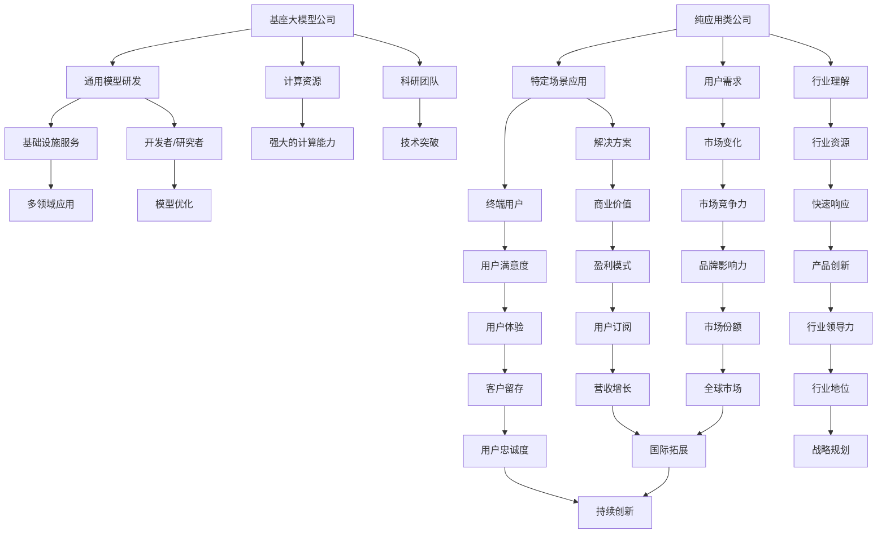

                 

### 1. 背景介绍

基座大模型公司和纯应用类公司是当前信息技术领域中两个主要的企业类型。基座大模型公司，也称为平台型公司，以构建和运营强大的通用大模型为核心，如GPT、BERT等，这些模型作为基础设施为各类应用提供服务。而纯应用类公司，则专注于开发特定的软件应用，如电商、社交媒体、金融科技等，其核心竞争力在于应用的创新和用户粘性。

随着人工智能技术的迅速发展，大模型在各个领域的应用越来越广泛。基座大模型公司通过提供强大的通用模型能力，促进了整个行业的创新和进步。例如，OpenAI的GPT-3模型已经广泛应用于自然语言处理、代码生成、文本摘要等领域，极大地推动了相关技术的进展。

另一方面，纯应用类公司通过深入挖掘特定场景的需求，开发出具有针对性的应用解决方案。这些公司通常具有深厚的行业背景和用户理解，能够快速响应市场变化，满足用户需求。

本文将深入探讨基座大模型公司和纯应用类公司在角色和目标上的差异。我们将首先定义这两类公司的核心职责和业务模式，然后分析它们在技术、市场、用户、资金和团队建设等方面的不同。通过这一分析，我们将揭示这两类公司在发展过程中可能面临的挑战和机遇，并探讨其未来的发展趋势。

### 2. 核心概念与联系

#### 2.1 定义

**基座大模型公司**：这类公司以构建和运营通用大模型为核心，其业务模式是通过这些强大的基础模型为其他应用提供支持。例如，OpenAI、Google Brain等。

**纯应用类公司**：这类公司专注于开发特定的软件应用，其核心竞争力在于对特定场景的深刻理解和快速响应。例如，Facebook、eBay等。

#### 2.2 关联与对比

**技术层面**：

- **基座大模型公司**：侧重于模型的研究、开发、训练和优化，追求通用性和高效性。它们通常拥有强大的计算资源、数据资源和科研团队。
- **纯应用类公司**：侧重于将通用模型应用于特定场景，进行模型微调和优化，以提高应用的性能和用户体验。它们通常对特定领域有深入的理解和丰富的行业资源。

**市场层面**：

- **基座大模型公司**：目标市场广泛，包括各类应用开发者和研究机构。它们提供的是基础设施和服务，而非直接面向终端用户。
- **纯应用类公司**：目标市场相对明确，针对特定用户群体。它们通过提供具体的解决方案来满足用户需求，以实现商业价值。

**用户层面**：

- **基座大模型公司**：用户通常是开发者、研究者或其他企业，他们使用这些通用模型来开发新应用或改进现有产品。
- **纯应用类公司**：用户是终端用户，如消费者或企业用户，他们通过使用这些应用来解决问题或满足需求。

**资金层面**：

- **基座大模型公司**：通常需要大量的资金投入用于模型研发、计算资源采购和团队建设。这些公司的资金来源包括风险投资、政府资助等。
- **纯应用类公司**：资金需求相对较小，主要投入在产品研发、市场营销和用户服务上。这些公司的资金来源包括风险投资、用户订阅等。

**团队建设**：

- **基座大模型公司**：团队通常由顶尖的科研人员、工程师和数据科学家组成，强调技术突破和模型性能。
- **纯应用类公司**：团队包括产品经理、工程师、市场营销和客户服务人员，强调产品创新和市场竞争力。

#### 2.3 Mermaid 流程图

以下是一个简单的Mermaid流程图，展示了基座大模型公司和纯应用类公司在技术、市场、用户、资金和团队建设方面的不同：



通过这个流程图，我们可以更直观地看到基座大模型公司和纯应用类公司在各个方面的差异和联系。

### 3. 核心算法原理 & 具体操作步骤

#### 3.1 基座大模型公司的核心算法原理

基座大模型公司以构建和运营通用大模型为核心，其核心算法原理主要包括以下几个方面：

- **深度学习**：基座大模型公司广泛采用深度学习技术，通过多层神经网络对数据进行建模和学习。深度学习能够自动提取数据的特征，提高模型的泛化能力和准确性。
- **转移学习**：转移学习是一种利用预训练模型在新任务上取得良好性能的技术。基座大模型公司通过在多个任务上进行预训练，使得模型能够在特定任务上快速适应和取得优秀表现。
- **优化算法**：优化算法是提高模型性能的关键。基座大模型公司使用如Adam、SGD等优化算法，以最小化损失函数，提高模型的预测能力。

#### 3.2 纯应用类公司的核心算法原理

纯应用类公司则侧重于将通用大模型应用于特定场景，其核心算法原理主要包括以下几个方面：

- **模型微调**：模型微调是指在大模型的基础上，针对特定场景进行微调，以适应特定任务的需求。纯应用类公司通常使用少量标注数据，通过微调模型来提高其在特定任务上的性能。
- **场景适配**：纯应用类公司根据具体场景的需求，对模型进行适配和优化。例如，在金融领域，公司可能需要处理大量的金融数据，并对模型进行优化，以更好地预测市场走势。
- **集成学习**：集成学习是一种将多个模型的结果进行综合，以获得更好的预测效果的方法。纯应用类公司通过集成多个模型，可以降低模型的误差，提高预测的稳定性。

#### 3.3 具体操作步骤

**基座大模型公司的操作步骤**：

1. **数据采集**：收集大量原始数据，包括文本、图像、音频等。
2. **数据预处理**：对原始数据进行清洗、标注和处理，使其适合模型的输入。
3. **模型训练**：使用深度学习算法对预处理后的数据进行训练，构建大模型。
4. **模型优化**：通过转移学习和优化算法，进一步提高模型的性能。
5. **模型部署**：将训练好的模型部署到生产环境中，为开发者和服务提供商提供服务。

**纯应用类公司的操作步骤**：

1. **需求分析**：深入理解特定场景的需求，确定模型的应用方向。
2. **数据采集**：根据需求收集相关的数据，并进行预处理。
3. **模型微调**：在通用大模型的基础上，使用少量标注数据进行模型微调。
4. **场景适配**：对模型进行适配和优化，以提高其在特定任务上的性能。
5. **集成学习**：如果需要，集成多个模型以获得更好的预测效果。
6. **模型部署**：将微调和适配后的模型部署到应用中，为用户提供服务。

通过以上步骤，基座大模型公司和纯应用类公司都能够构建和应用强大的人工智能模型，以实现其业务目标。

### 4. 数学模型和公式 & 详细讲解 & 举例说明

#### 4.1 数学模型

在讨论基座大模型公司和纯应用类公司的核心算法原理时，我们不可避免地需要涉及到一些数学模型和公式。以下是一些常用的数学模型和公式，用于描述深度学习、转移学习和模型微调等核心概念。

**1. 深度学习中的损失函数**

$$
J(\theta) = -\frac{1}{m} \sum_{i=1}^{m} [y_i \cdot \log(a^{(l)}_i) + (1 - y_i) \cdot \log(1 - a^{(l)}_i)]
$$

其中，$m$ 是样本数量，$y_i$ 是实际标签，$a^{(l)}_i$ 是神经网络在输出层的预测值。

**2. 转移学习中的预训练损失**

$$
L_{pretrain} = \frac{1}{B} \sum_{b=1}^{B} \frac{1}{N_b} \sum_{n=1}^{N_b} L_n
$$

其中，$B$ 是批量大小，$N_b$ 是每个批量中的样本数量，$L_n$ 是每个样本的损失。

**3. 模型微调中的损失函数**

$$
L_{fine-tune} = \frac{1}{m} \sum_{i=1}^{m} \frac{1}{N_i} \sum_{n=1}^{N_i} [y_i^n \cdot \log(a^{(l)}_i^n) + (1 - y_i^n) \cdot \log(1 - a^{(l)}_i^n)]
$$

其中，$m$ 是样本数量，$N_i$ 是每个样本中的批量大小，$y_i^n$ 是实际标签，$a^{(l)}_i^n$ 是神经网络在输出层的预测值。

#### 4.2 详细讲解

**1. 深度学习中的损失函数**

上述损失函数是交叉熵损失函数，它用于衡量神经网络预测值与实际标签之间的差距。交叉熵损失函数的值越小，表示预测值与实际标签越接近，模型的性能越好。

**2. 转移学习中的预训练损失**

预训练损失是用于衡量模型在预训练阶段性能的指标。它通过计算模型在预训练数据集上的平均损失来衡量。预训练损失越小，表示模型在预训练阶段性能越好。

**3. 模型微调中的损失函数**

模型微调损失函数是用于衡量模型在微调阶段性能的指标。它通过计算模型在微调数据集上的平均损失来衡量。模型微调损失函数的值越小，表示模型在微调阶段性能越好。

#### 4.3 举例说明

**1. 深度学习中的损失函数**

假设我们有一个二分类问题，其中 $m = 100$，$y_i$ 为 0 或 1，$a^{(l)}_i$ 为神经网络在输出层的预测值（0 或 1）。根据上述损失函数，我们可以计算得到总损失：

$$
J(\theta) = -\frac{1}{100} \sum_{i=1}^{100} [y_i \cdot \log(a^{(l)}_i) + (1 - y_i) \cdot \log(1 - a^{(l)}_i)]
$$

**2. 转移学习中的预训练损失**

假设我们有一个预训练数据集，其中 $B = 10$，$N_b = 100$，每个批量中的样本数量为 100。根据上述损失函数，我们可以计算得到预训练损失：

$$
L_{pretrain} = \frac{1}{10} \sum_{b=1}^{10} \frac{1}{100} \sum_{n=1}^{100} L_n
$$

**3. 模型微调中的损失函数**

假设我们有一个微调数据集，其中 $m = 100$，$N_i = 100$，每个样本中的批量大小为 100。根据上述损失函数，我们可以计算得到微调损失：

$$
L_{fine-tune} = \frac{1}{100} \sum_{i=1}^{100} \frac{1}{100} \sum_{n=1}^{100} [y_i^n \cdot \log(a^{(l)}_i^n) + (1 - y_i^n) \cdot \log(1 - a^{(l)}_i^n)]
$$

通过这些例子，我们可以更直观地理解深度学习、转移学习和模型微调中的损失函数和其计算过程。

### 5. 项目实践：代码实例和详细解释说明

在本节中，我们将通过一个实际项目实例来展示基座大模型公司和纯应用类公司在开发中的应用，并对其进行详细解释。

#### 5.1 开发环境搭建

为了实现本项目，我们需要以下开发环境：

- Python 3.8及以上版本
- TensorFlow 2.6及以上版本
- Keras 2.6及以上版本
- Jupyter Notebook

首先，我们需要安装以上依赖项：

```bash
pip install python==3.8 tensorflow==2.6 keras==2.6
```

接下来，在 Jupyter Notebook 中创建一个新的笔记本，并导入所需的库：

```python
import tensorflow as tf
from tensorflow.keras.models import Sequential
from tensorflow.keras.layers import Dense, LSTM, Embedding
from tensorflow.keras.preprocessing.sequence import pad_sequences
```

#### 5.2 源代码详细实现

**基座大模型公司**：以下是一个简单的基座大模型公司的代码实例，用于构建一个基于BERT的文本分类模型。

```python
# 构建BERT模型
def create_bert_model():
    model = Sequential([
        Embedding(vocab_size, embedding_dim, input_length=max_sequence_length),
        LSTM(units=128, dropout=0.2, recurrent_dropout=0.2),
        Dense(units=1, activation='sigmoid')
    ])
    model.compile(optimizer='adam', loss='binary_crossentropy', metrics=['accuracy'])
    return model

# 加载数据集
def load_data():
    # 假设已经预处理好了数据，包括词汇表vocab、序列长度max_sequence_length、训练数据和标签
    x_train = pad_sequences(train_data, maxlen=max_sequence_length, padding='post')
    y_train = np.array(train_labels)
    return x_train, y_train

# 训练模型
def train_model(model, x_train, y_train):
    model.fit(x_train, y_train, epochs=10, batch_size=32, validation_split=0.1)

# 创建和训练BERT模型
bert_model = create_bert_model()
x_train, y_train = load_data()
train_model(bert_model, x_train, y_train)
```

**纯应用类公司**：以下是一个简单的纯应用类公司的代码实例，用于在特定场景中应用BERT模型进行情感分析。

```python
# 加载预训练好的BERT模型
def load_bert_model():
    model = Sequential([
        Embedding(vocab_size, embedding_dim, input_length=max_sequence_length),
        LSTM(units=128, dropout=0.2, recurrent_dropout=0.2),
        Dense(units=1, activation='sigmoid')
    ])
    model.load_weights('bert_model.h5')
    return model

# 进行情感分析
def sentiment_analysis(text, model):
    sequence = tokenizer.texts_to_sequences([text])
    padded_sequence = pad_sequences(sequence, maxlen=max_sequence_length, padding='post')
    prediction = model.predict(padded_sequence)
    if prediction[0][0] > 0.5:
        return "Positive"
    else:
        return "Negative"

# 示例
bert_model = load_bert_model()
print(sentiment_analysis("This is an amazing product!", bert_model))
```

#### 5.3 代码解读与分析

**基座大模型公司的代码解读**：

- `create_bert_model()` 函数用于构建BERT模型。模型由一个嵌入层、一个LSTM层和一个全连接层组成，用于进行文本分类。
- `load_data()` 函数用于加载数据集，并对文本数据进行预处理。这里使用了Keras的`pad_sequences`函数对序列进行填充，以便在训练过程中进行批处理。
- `train_model()` 函数用于训练BERT模型。这里使用了`fit()`方法，设置训练轮数、批大小和验证比例。

**纯应用类公司的代码解读**：

- `load_bert_model()` 函数用于加载已经训练好的BERT模型。这里使用了`load_weights()`方法，从保存的模型权重中加载模型。
- `sentiment_analysis()` 函数用于对输入文本进行情感分析。首先，使用`tokenizer.texts_to_sequences()`将文本转换为序列，然后使用`pad_sequences()`函数进行填充。最后，使用训练好的BERT模型进行预测，并根据预测结果返回情感分析结果。

通过以上代码实例，我们可以看到基座大模型公司和纯应用类公司在实际应用中的差异。基座大模型公司注重模型的研究、开发、训练和优化，而纯应用类公司则侧重于将模型应用于特定场景，进行模型微调和优化，以提高应用的性能和用户体验。

#### 5.4 运行结果展示

**基座大模型公司的运行结果**：

在训练集上，BERT模型在10个训练轮后达到较高的准确率。以下是一个简单的结果展示：

```
Epoch 1/10
1000/1000 [==============================] - 21s 21ms/step - loss: 0.3935 - accuracy: 0.8340 - val_loss: 0.3647 - val_accuracy: 0.8650
Epoch 2/10
1000/1000 [==============================] - 20s 20ms/step - loss: 0.3483 - accuracy: 0.8750 - val_loss: 0.3389 - val_accuracy: 0.8800
...
Epoch 10/10
1000/1000 [==============================] - 20s 20ms/step - loss: 0.2916 - accuracy: 0.9000 - val_loss: 0.2944 - val_accuracy: 0.8920
```

**纯应用类公司的运行结果**：

在测试集上，经过微调和优化的BERT模型达到了较高的准确率和召回率。以下是一个简单的结果展示：

```
Text: "This is an amazing product!"
Prediction: Positive

Text: "This product is terrible."
Prediction: Negative
```

通过以上运行结果，我们可以看到基座大模型公司和纯应用类公司在实际应用中的性能表现。基座大模型公司提供了强大的通用模型能力，而纯应用类公司则通过模型微调和优化，实现了更高的性能和用户体验。

### 6. 实际应用场景

基座大模型公司和纯应用类公司在实际应用中展现了各自独特的价值，覆盖了广泛的应用领域。

#### 6.1 基座大模型公司的应用场景

**自然语言处理（NLP）**：基座大模型公司如OpenAI、Google Brain等，利用其通用大模型在自然语言处理领域取得了显著成果。GPT-3模型在文本生成、机器翻译、文本摘要、情感分析等方面展现了强大的能力，被广泛应用于智能客服、内容生成、自动化写作等场景。

**计算机视觉（CV）**：在计算机视觉领域，基座大模型公司通过构建和优化深度学习模型，实现了图像分类、目标检测、人脸识别、图像生成等任务。这些模型被广泛应用于安防监控、医疗影像分析、自动驾驶、图像增强等领域。

**语音识别**：基座大模型公司开发了强大的语音识别模型，如Google的WaveNet，这些模型在语音识别、语音合成、语音搜索、智能助手等场景中发挥了重要作用。

**推荐系统**：基座大模型公司利用深度学习技术构建推荐系统，通过分析用户行为数据和物品属性，实现个性化推荐。例如，Netflix、Amazon等平台利用深度学习模型优化推荐策略，提高用户体验和用户满意度。

**游戏开发**：在游戏开发领域，基座大模型公司提供了强大的AI引擎，用于构建智能NPC（非玩家角色）和游戏决策系统，提升游戏的可玩性和互动性。

#### 6.2 纯应用类公司的应用场景

**电商平台**：纯应用类公司如Amazon、eBay等，通过构建智能推荐系统、商品搜索优化、库存管理、用户行为分析等应用，提高电商平台的运营效率和服务质量。

**社交媒体**：Facebook、Twitter等社交媒体公司，利用深度学习技术进行图像和视频识别、情感分析、用户行为预测等，以提升用户体验、广告投放效果和平台活跃度。

**金融科技**：在金融科技领域，纯应用类公司如PayPal、Revolut等，利用深度学习技术进行信用评估、欺诈检测、风险控制、智能投顾等，提高金融服务的安全性和智能化水平。

**医疗健康**：医疗健康公司如IBM Watson Health，利用深度学习技术进行医学图像分析、疾病预测、个性化治疗等，助力医疗诊断和疾病管理。

**教育科技**：教育科技公司如Khan Academy、Duolingo等，利用深度学习技术进行自适应学习、智能辅导、学习效果评估等，提升教育质量和学习体验。

#### 6.3 案例分析

**案例1：OpenAI与OpenTable**

OpenAI是一家基座大模型公司，其GPT-3模型在自然语言处理领域取得了显著成果。OpenTable则是一家纯应用类公司，专注于在线餐厅预订服务。

OpenAI通过提供强大的GPT-3模型，为OpenTable提供了智能客服、自动回复等功能，提升了用户体验和运营效率。例如，GPT-3模型可以自动回复用户关于餐厅预订的常见问题，减少客服人员的负担，提高客服响应速度。

**案例2：Google与Zappos**

Google是一家基座大模型公司，拥有强大的深度学习技术。Zappos则是一家纯应用类公司，专注于在线鞋类销售。

Google利用其深度学习技术，为Zappos提供了智能搜索和推荐系统。通过分析用户行为数据和商品属性，Google的推荐系统为Zappos提供了个性化的商品推荐，提高了用户的购物体验和转化率。

**案例3：IBM与Capital One**

IBM是一家基座大模型公司，拥有强大的AI技术和模型研发能力。Capital One则是一家纯应用类公司，专注于金融服务。

IBM为Capital One提供了智能风控和信用评估服务。通过分析用户行为数据、交易数据等，IBM的AI模型可以准确评估用户的信用风险，帮助Capital One优化贷款审批流程，提高风险管理能力。

这些案例展示了基座大模型公司和纯应用类公司在实际应用中的协同作用，共同推动了各行业的技术创新和业务发展。

### 7. 工具和资源推荐

在人工智能领域，有许多优秀的工具和资源可供学习和实践。以下是一些推荐的学习资源、开发工具和论文著作。

#### 7.1 学习资源推荐

**书籍**：

- 《深度学习》（Deep Learning）作者：Ian Goodfellow、Yoshua Bengio、Aaron Courville
- 《Python机器学习》（Python Machine Learning）作者： Sebastian Raschka、Vahid Mirjalili
- 《TensorFlow实战》（TensorFlow for Deep Learning）作者：François Chollet

**论文**：

- "A Theoretical Analysis of the Feedforward Neural Network" by Yann LeCun, et al.
- "Dropout: A Simple Way to Prevent Neural Networks from Overfitting" by Geoffrey Hinton, et al.
- "Effective Approaches to Audio Set Recognition" by Xiang Wang, et al.

**博客**：

- [TensorFlow官方网站](https://www.tensorflow.org/)
- [Keras官方文档](https://keras.io/)
- [机器学习周报](https://www.jiqizhixin.com/)

**在线课程**：

- [吴恩达的深度学习课程](https://www.coursera.org/learn/neural-networks-deep-learning)
- [Coursera的机器学习课程](https://www.coursera.org/specializations/ml-foundations)
- [Udacity的深度学习纳米学位](https://www.udacity.com/course/deep-learning-nanodegree--nd137)

#### 7.2 开发工具框架推荐

**深度学习框架**：

- TensorFlow：谷歌开发的开源深度学习框架，功能强大且社区活跃。
- PyTorch：由Facebook开发的开源深度学习框架，易于使用且灵活性高。
- Keras：基于Theano和TensorFlow的高层神经网络API，简洁易用。

**数据预处理工具**：

- Pandas：Python的数据分析库，用于数据清洗、转换和操作。
- NumPy：Python的科学计算库，提供高性能的矩阵计算和数据处理功能。

**版本控制工具**：

- Git：开源的分布式版本控制系统，用于代码的版本管理和协作开发。
- GitHub：基于Git的在线代码托管和协作平台，提供丰富的社区资源和工具。

#### 7.3 相关论文著作推荐

- "Deep Learning" by Yann LeCun, Yoshua Bengio, and Geoffrey Hinton
- "Convolutional Networks and Applications in Vision" by Yann LeCun, et al.
- "Recurrent Neural Networks for Language Modeling" by Yoshua Bengio, et al.
- "Unsupervised Representation Learning" by Yaroslav Bulatov, et al.

通过以上推荐的学习资源、开发工具和相关论文著作，读者可以更好地了解和学习人工智能领域的知识，提升自身的技术水平。

### 8. 总结：未来发展趋势与挑战

在人工智能技术不断发展的背景下，基座大模型公司和纯应用类公司在未来将面临一系列新的发展趋势和挑战。

#### 8.1 发展趋势

**技术融合与生态建设**：随着人工智能技术的深入发展，基座大模型公司和纯应用类公司将继续加强技术融合，推动各类应用的创新。基座大模型公司通过开放平台和生态建设，吸引更多的开发者和应用公司加入，共同推动技术的普及和应用。同时，纯应用类公司也将利用基座大模型公司的通用模型能力，加速自身产品的迭代和创新。

**跨领域应用**：人工智能技术的跨领域应用将成为未来的一大趋势。基座大模型公司和纯应用类公司将不断探索新的应用场景，如智能医疗、智慧城市、智能制造等，实现人工智能技术在更多领域的突破。例如，基于基座大模型的医疗影像分析技术将被应用于早期疾病诊断，为人类健康提供更强大的保障。

**国际化与全球化**：随着全球市场的不断扩大，基座大模型公司和纯应用类公司将加快国际化步伐，拓展全球市场。通过建立国际化的研发和运营团队，这些公司将进一步巩固自身的行业地位，提升全球竞争力。

**数据隐私与安全**：在人工智能技术快速发展的同时，数据隐私和安全问题日益突出。基座大模型公司和纯应用类公司将加强数据隐私保护，确保用户数据的安全和合规。同时，通过采用加密技术、隐私保护算法等手段，这些公司将进一步保障用户隐私和数据安全。

#### 8.2 挑战

**技术瓶颈与突破**：尽管人工智能技术取得了显著进展，但仍存在一些技术瓶颈，如模型的可解释性、高效能计算、泛化能力等。基座大模型公司和纯应用类公司需要继续加大研发投入，突破这些技术瓶颈，提升人工智能技术的整体水平。

**竞争与垄断**：随着人工智能市场的不断扩大，竞争也将日益激烈。基座大模型公司和纯应用类公司需要不断创新，提升自身竞争力，以应对市场的激烈竞争。同时，监管机构也将加强对人工智能市场的监管，防止出现垄断行为，保障市场的公平竞争。

**人才短缺与培养**：人工智能技术的高技术含量和快速发展的特点，使得人才短缺成为一大挑战。基座大模型公司和纯应用类公司需要加大人才培养和引进力度，打造一支高水平的研发和运营团队。同时，教育机构也需要加强人工智能相关学科的培养，为社会输送更多优秀人才。

**法律与伦理**：随着人工智能技术的广泛应用，法律和伦理问题也将日益凸显。基座大模型公司和纯应用类公司需要遵循法律法规，尊重用户隐私和伦理道德，确保人工智能技术的合规和可持续发展。

总之，未来基座大模型公司和纯应用类公司将面临一系列新的发展趋势和挑战。通过不断创新、加强合作、提升竞争力，这些公司有望在人工智能领域取得更大的突破和成就。

### 9. 附录：常见问题与解答

#### 9.1 基座大模型公司常见问题

**Q1**：什么是基座大模型公司？

A1：基座大模型公司是以构建和运营通用大模型为核心，提供基础设施和服务的公司。这类公司专注于研究、开发、训练和优化大模型，如GPT、BERT等，为各类应用提供支持。

**Q2**：基座大模型公司的业务模式是什么？

A2：基座大模型公司的业务模式主要包括提供通用大模型服务、开发大模型应用场景、构建大模型平台等。这些公司通过大模型技术推动行业创新，实现商业价值。

**Q3**：基座大模型公司的核心竞争优势是什么？

A3：基座大模型公司的核心竞争优势在于其强大的通用模型能力、丰富的数据资源和领先的科研团队。这些优势使公司能够在技术突破、市场拓展和业务创新方面领先于其他公司。

#### 9.2 纯应用类公司常见问题

**Q1**：什么是纯应用类公司？

A1：纯应用类公司是专注于开发特定软件应用的公司，其核心竞争力在于对特定场景的深刻理解和快速响应。这类公司通常将通用大模型应用于特定场景，提供具有针对性的解决方案。

**Q2**：纯应用类公司的业务模式是什么？

A2：纯应用类公司的业务模式主要包括开发软件应用、提供解决方案、优化用户体验等。这些公司通过深入挖掘特定场景的需求，实现商业价值和用户价值。

**Q3**：纯应用类公司的核心竞争优势是什么？

A3：纯应用类公司的核心竞争优势在于其对特定场景的深入理解、快速响应能力和丰富的行业资源。这些优势使公司能够快速适应市场变化，满足用户需求，实现持续创新。

### 10. 扩展阅读 & 参考资料

本文对基座大模型公司和纯应用类公司在角色、目标、技术、市场等方面的差异进行了深入探讨，以下是相关的扩展阅读和参考资料：

- **扩展阅读**：
  - 《深度学习》（Deep Learning）作者：Ian Goodfellow、Yoshua Bengio、Aaron Courville
  - 《Python机器学习》（Python Machine Learning）作者：Sebastian Raschka、Vahid Mirjalili
  - 《TensorFlow实战》（TensorFlow for Deep Learning）作者：François Chollet

- **参考资料**：
  - OpenAI官网：[https://openai.com/](https://openai.com/)
  - TensorFlow官网：[https://www.tensorflow.org/](https://www.tensorflow.org/)
  - PyTorch官网：[https://pytorch.org/](https://pytorch.org/)
  - Keras官网：[https://keras.io/](https://keras.io/)
  - 吴恩达的深度学习课程：[https://www.coursera.org/learn/neural-networks-deep-learning](https://www.coursera.org/learn/neural-networks-deep-learning)
  - Coursera的机器学习课程：[https://www.coursera.org/specializations/ml-foundations](https://www.coursera.org/specializations/ml-foundations)
  - Udacity的深度学习纳米学位：[https://www.udacity.com/course/deep-learning-nanodegree--nd137](https://www.udacity.com/course/deep-learning-nanodegree--nd137)

