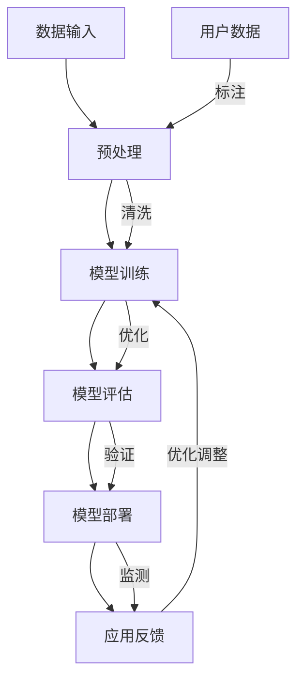
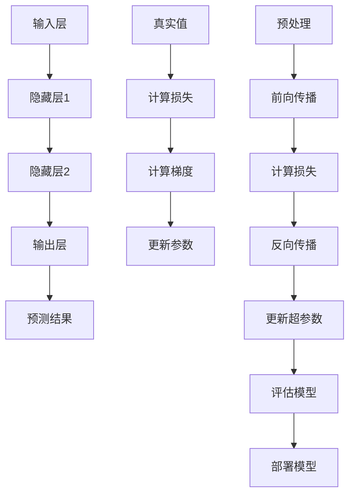

                 

### 背景介绍

随着人工智能技术的不断发展，基础模型已经成为推动各类应用创新的重要力量。从简单的神经网络到复杂的Transformer模型，基础模型在自然语言处理、计算机视觉、推荐系统等领域都展现出了卓越的性能。然而，基础模型的技术创新不仅带来了巨大的技术进步，也引发了诸多社会和伦理问题。本文将围绕基础模型的技术创新与社会责任这一主题，深入探讨其影响与应对策略。

### 当前基础模型的技术创新

近年来，基础模型在技术层面上取得了显著进展，主要体现在以下几个方面：

1. **神经网络架构的进化**：神经网络从早期的简单多层感知器（MLP）发展到如今的深度残差网络（ResNet）、密集连接网络（DenseNet）等，不仅提高了模型的性能，还降低了训练难度。

2. **数据驱动的方法**：大量高质量数据集的涌现，使得基础模型能够通过自我学习和优化，不断提高其准确性和鲁棒性。例如，ImageNet的数据集极大地推动了计算机视觉领域的发展。

3. **分布式训练技术的应用**：随着计算能力的提升，分布式训练技术成为实现基础模型高效训练的关键。通过将模型分解为多个部分，分布在多台计算机上进行训练，可以显著缩短训练时间并提高模型规模。

4. **模型压缩与加速**：模型压缩和加速技术（如量化、剪枝、网络剪裁等）的不断发展，使得基础模型能够更加高效地运行在资源受限的设备上，如智能手机、嵌入式系统等。

5. **迁移学习与少样本学习**：迁移学习和少样本学习技术的进步，使得基础模型在面临新任务时能够快速适应，减少对大量标注数据的依赖。

### 社会责任的重要性

尽管基础模型的技术创新带来了诸多便利，但其对社会的影响也不可忽视。以下是一些主要的社会责任问题：

1. **隐私保护**：基础模型通常需要大量用户数据进行训练，这引发了对用户隐私保护的担忧。如何确保数据的安全和用户隐私，成为基础模型应用的重要挑战。

2. **公平性与偏见**：基础模型在训练过程中可能会吸收和放大数据集中的偏见，导致模型在特定群体中产生不公平的结果。例如，计算机视觉模型可能会对某些种族或性别的人产生偏见。

3. **透明性与可解释性**：基础模型的决策过程往往是黑箱式的，缺乏透明性和可解释性。这导致模型的应用场景受到限制，特别是在医疗、金融等关键领域。

4. **伦理问题**：一些基于人工智能的决策可能涉及到道德和伦理问题。例如，自动驾驶汽车在紧急情况下如何做出决策，如何确保其决策符合社会伦理标准。

### 总结

基础模型的技术创新无疑推动了人工智能领域的发展，为各行各业带来了巨大的变革。然而，伴随技术创新而来的社会责任问题同样不可忽视。在追求技术进步的同时，我们有必要思考如何平衡技术创新与社会责任，确保基础模型的应用能够造福社会，而非带来负面影响。

在接下来的章节中，我们将深入探讨基础模型的核心概念与联系，分析其工作原理，并提出一些应对社会责任问题的策略。希望通过对这些问题的深入探讨，能够为未来的基础模型研究与应用提供有益的启示。### 核心概念与联系

要理解基础模型的技术创新及其社会责任，首先需要了解其核心概念和工作原理。在本文中，我们将使用Mermaid流程图来展示基础模型的关键节点，以便更直观地理解其架构和运作方式。



**图 1：基础模型工作流程**

**图 1 中的关键节点解释：**

1. **数据输入 (A)**：基础模型从各种来源获取数据，包括用户生成的内容、公共数据集等。这些数据可能需要经过标注和预处理，以便用于模型训练。

2. **预处理 (B)**：数据输入后，会进行清洗、归一化、特征提取等预处理操作。这些步骤旨在提高数据质量，使其更适合用于模型训练。

3. **模型训练 (C)**：经过预处理的数据被用于训练模型。训练过程中，模型会通过优化算法（如梯度下降）不断调整参数，以最小化预测误差。

4. **模型评估 (D)**：训练完成后，模型会被评估其性能。常见的评估指标包括准确率、召回率、F1分数等。评估结果将决定模型是否适合部署。

5. **模型部署 (E)**：评估通过后，模型会被部署到实际应用中，如自动驾驶系统、医疗诊断软件等。在部署过程中，模型会实时接收新数据并生成预测结果。

6. **应用反馈 (F)**：部署后的模型会收集实际应用中的反馈数据，包括预测准确性、用户满意度等。这些数据将用于模型优化和持续改进。

**基础模型的核心原理：**

- **神经网络**：基础模型的核心是神经网络，尤其是深度神经网络。神经网络通过多层非线性变换，对输入数据进行建模和预测。

- **优化算法**：常用的优化算法包括梯度下降、随机梯度下降（SGD）、Adam等。这些算法通过不断调整模型参数，以优化预测性能。

- **数据集**：基础模型性能的发挥很大程度上依赖于数据集的质量和多样性。高质量的数据集能够帮助模型学习到更复杂和泛化的特征。

- **超参数调优**：超参数（如学习率、批量大小、正则化参数等）的选取对模型性能有重要影响。合适的超参数调优能够提高模型的效果。

通过上述核心概念和联系的介绍，我们可以更好地理解基础模型的工作原理。接下来，我们将进一步探讨基础模型的技术细节，包括核心算法原理、具体操作步骤等，以深入理解其技术创新。### 核心算法原理 & 具体操作步骤

在了解了基础模型的核心概念与联系后，接下来我们将深入探讨其核心算法原理和具体操作步骤。为了更好地展示这些算法，我们仍将使用Mermaid流程图来描述关键节点，并辅以详细的步骤说明。

**核心算法：深度神经网络**

深度神经网络（Deep Neural Network, DNN）是基础模型的核心组成部分。其基本原理是通过对输入数据进行多层非线性变换，从而实现对复杂函数的逼近。以下是DNN的核心算法原理：

1. **前向传播（Forward Propagation）**：输入数据首先通过输入层进入网络，经过一系列的隐藏层，最终由输出层生成预测结果。

2. **反向传播（Backpropagation）**：在预测结果与真实值之间计算误差，然后将误差反向传播回网络，通过梯度下降等优化算法调整模型参数。

3. **激活函数（Activation Function）**：激活函数用于引入非线性特性，常见的激活函数有ReLU、Sigmoid和Tanh等。

4. **损失函数（Loss Function）**：损失函数用于量化预测结果与真实值之间的差距，常见的损失函数有均方误差（MSE）、交叉熵（Cross-Entropy）等。

**具体操作步骤：**

**步骤 1：数据预处理**
- 数据清洗：去除缺失值、异常值，对数据类型进行转换。
- 数据归一化：将数据缩放到[0, 1]或[-1, 1]之间，以加快模型收敛。
- 特征提取：从原始数据中提取有助于建模的特征。

**步骤 2：构建神经网络模型**
- 定义输入层、隐藏层和输出层的神经元数量。
- 选择激活函数，如ReLU、Sigmoid或Tanh。
- 选择损失函数，如均方误差（MSE）或交叉熵（Cross-Entropy）。

**步骤 3：模型训练**
- 前向传播：将输入数据输入到模型，计算预测值。
- 计算损失：通过损失函数计算预测值与真实值之间的差距。
- 反向传播：计算梯度，并更新模型参数。
- 调整超参数：如学习率、批量大小等。

**步骤 4：模型评估**
- 使用验证集或测试集评估模型性能。
- 计算准确率、召回率、F1分数等指标。
- 分析模型在不同数据集上的表现，以判断其泛化能力。

**步骤 5：模型部署**
- 将训练好的模型部署到生产环境中。
- 实时接收输入数据，生成预测结果。
- 收集应用反馈，以优化模型。

**Mermaid流程图：**



**图 2：深度神经网络操作步骤**

**图 2 中的关键节点解释：**

1. **输入层（A）**：接收外部输入数据，如文本、图像等。

2. **隐藏层（B、C）**：对输入数据进行非线性变换，提取特征。

3. **输出层（D）**：生成最终的预测结果。

4. **预测结果（E）**：与真实值进行比较，计算损失。

5. **计算损失（G）**：通过损失函数计算预测值与真实值之间的差距。

6. **计算梯度（H）**：反向传播过程中计算每个参数的梯度。

7. **更新参数（I）**：根据梯度调整模型参数，以减小损失。

8. **预处理（A1）**：对输入数据进行预处理，如归一化、编码等。

9. **前向传播（J）**：将预处理后的数据输入到模型，计算预测结果。

10. **评估模型（N）**：使用验证集或测试集评估模型性能。

11. **部署模型（O）**：将训练好的模型部署到实际应用中。

通过上述核心算法原理和具体操作步骤的介绍，我们可以更好地理解基础模型的工作机制。在接下来的章节中，我们将进一步探讨基础模型在数学模型和公式中的表达，以及如何通过实例进行详细讲解。### 数学模型和公式 & 详细讲解 & 举例说明

在了解了基础模型的核心算法原理和具体操作步骤后，我们将进一步探讨其背后的数学模型和公式，并通过具体例子进行详细讲解。为了确保清晰易懂，我们将使用LaTeX格式来展示数学公式，并分段介绍其含义和应用。

#### 1. 神经元和激活函数

神经元的数学模型可以表示为：
$$
y = \sigma(\theta \cdot x + b)
$$
其中，\( \sigma \) 是激活函数，\( \theta \) 是权重，\( x \) 是输入特征，\( b \) 是偏置项。常见的激活函数包括ReLU、Sigmoid和Tanh等。

- **ReLU（Rectified Linear Unit）**：
  $$
  \sigma(x) = \max(0, x)
  $$
  ReLU函数在输入为正时保持不变，为负时设置为0。这使得ReLU函数具有稀疏性，有助于加快模型训练速度。

- **Sigmoid**：
  $$
  \sigma(x) = \frac{1}{1 + e^{-x}}
  $$
  Sigmoid函数将输入映射到(0, 1)区间，常用于二分类问题。

- **Tanh**：
  $$
  \sigma(x) = \frac{e^x - e^{-x}}{e^x + e^{-x}}
  $$
  Tanh函数将输入映射到(-1, 1)区间，具有对称性，常用于多分类问题。

#### 2. 梯度下降和反向传播

梯度下降是一种优化算法，用于调整模型参数以最小化损失函数。其基本公式为：
$$
\theta_{\text{new}} = \theta_{\text{old}} - \alpha \cdot \nabla_{\theta} J(\theta)
$$
其中，\( \theta \) 是模型参数，\( \alpha \) 是学习率，\( \nabla_{\theta} J(\theta) \) 是损失函数 \( J(\theta) \) 对参数 \( \theta \) 的梯度。

反向传播是梯度下降在神经网络中的应用，用于计算每个参数的梯度。其步骤如下：

1. **前向传播**：计算预测值和损失。
2. **计算局部梯度**：对于每个神经元，计算从输出层到输入层的梯度。
3. **加权求和**：将局部梯度加权求和，得到每个参数的全局梯度。
4. **更新参数**：使用全局梯度更新模型参数。

#### 3. 损失函数

损失函数用于衡量预测值与真实值之间的差距，常见的损失函数包括均方误差（MSE）和交叉熵（Cross-Entropy）。

- **均方误差（MSE）**：
  $$
  J(\theta) = \frac{1}{m} \sum_{i=1}^{m} (\hat{y}_i - y_i)^2
  $$
  其中，\( m \) 是样本数量，\( \hat{y}_i \) 是预测值，\( y_i \) 是真实值。

- **交叉熵（Cross-Entropy）**：
  $$
  J(\theta) = -\frac{1}{m} \sum_{i=1}^{m} y_i \log(\hat{y}_i)
  $$
  其中，\( y_i \) 是真实标签，\( \hat{y}_i \) 是预测概率。

#### 4. 举例说明

假设我们有一个二分类问题，目标是预测输入图像是否包含猫。使用ReLU函数作为激活函数，均方误差（MSE）作为损失函数。训练数据包含1000个样本，每个样本是一个28x28的图像。

- **输入层**：28x28个像素值。
- **隐藏层**：10个神经元。
- **输出层**：2个神经元（一个用于预测包含猫的概率，另一个用于预测不包含猫的概率）。

我们使用以下公式进行前向传播和反向传播：

**前向传播**：
$$
\hat{y}_i = \sigma(\theta \cdot x_i + b)
$$

**反向传播**：
$$
\nabla_{\theta} J(\theta) = \frac{\partial J(\theta)}{\partial \theta}
$$

**更新参数**：
$$
\theta_{\text{new}} = \theta_{\text{old}} - \alpha \cdot \nabla_{\theta} J(\theta)
$$

在每次迭代中，我们计算预测值和真实值之间的差距，使用MSE计算损失，然后通过反向传播计算每个参数的梯度，并使用梯度下降更新参数。

通过这种方式，模型将逐步优化其参数，提高预测准确性。在训练过程中，我们还会使用验证集来评估模型性能，以确保其泛化能力。

综上所述，基础模型的数学模型和公式是其核心组成部分，通过合理的模型设计、参数优化和损失函数选择，可以实现高效和准确的预测。在接下来的章节中，我们将通过项目实践，展示如何将上述理论应用到实际开发中。### 项目实践：代码实例和详细解释说明

在本节中，我们将通过一个具体的代码实例来展示如何实现基础模型。我们将使用Python编程语言和常见的机器学习库（如TensorFlow和Keras）来构建、训练和评估一个简单的神经网络模型。以下是实现基础模型的步骤：

#### 5.1 开发环境搭建

在开始编写代码之前，我们需要搭建一个合适的开发环境。以下是所需的软件和库：

- Python（3.7及以上版本）
- TensorFlow（2.x版本）
- Keras（2.x版本）
- NumPy

您可以使用以下命令来安装这些库：

```bash
pip install python==3.7.0
pip install tensorflow==2.5.0
pip install keras==2.4.3
pip install numpy==1.19.5
```

#### 5.2 源代码详细实现

以下是实现基础模型的Python代码：

```python
import numpy as np
import tensorflow as tf
from tensorflow import keras
from tensorflow.keras import layers

# 数据加载和预处理
(x_train, y_train), (x_test, y_test) = keras.datasets.mnist.load_data()
x_train = x_train.astype('float32') / 255.0
x_test = x_test.astype('float32') / 255.0
y_train = keras.utils.to_categorical(y_train, 10)
y_test = keras.utils.to_categorical(y_test, 10)

# 模型构建
model = keras.Sequential([
    layers.Flatten(input_shape=(28, 28)),
    layers.Dense(128, activation='relu'),
    layers.Dense(10, activation='softmax')
])

# 编译模型
model.compile(optimizer='adam',
              loss='categorical_crossentropy',
              metrics=['accuracy'])

# 训练模型
model.fit(x_train, y_train, batch_size=128, epochs=15, validation_split=0.1)

# 评估模型
test_loss, test_acc = model.evaluate(x_test, y_test)
print('Test accuracy:', test_acc)
```

**代码解释：**

1. **数据加载和预处理**：
   - 加载MNIST数据集，并将其归一化到[0, 1]区间。
   - 使用`to_categorical`函数将标签转换为one-hot编码。

2. **模型构建**：
   - 使用`Sequential`模型堆叠多层神经网络。
   - 第一个层是`Flatten`层，将输入图像展开成一维数组。
   - 接下来是一个具有128个神经元的隐藏层，使用ReLU作为激活函数。
   - 最后是一个具有10个神经元的输出层，使用softmax激活函数，以实现多分类。

3. **编译模型**：
   - 使用`compile`方法配置模型，指定优化器、损失函数和评估指标。

4. **训练模型**：
   - 使用`fit`方法训练模型，指定批量大小、训练轮数和验证比例。

5. **评估模型**：
   - 使用`evaluate`方法评估模型在测试集上的性能，并打印测试准确率。

#### 5.3 代码解读与分析

以下是代码的逐行解读和分析：

```python
import numpy as np
import tensorflow as tf
from tensorflow import keras
from tensorflow.keras import layers

# 加载MNIST数据集
(x_train, y_train), (x_test, y_test) = keras.datasets.mnist.load_data()

# 归一化输入数据
x_train = x_train.astype('float32') / 255.0
x_test = x_test.astype('float32') / 255.0

# 转换标签为one-hot编码
y_train = keras.utils.to_categorical(y_train, 10)
y_test = keras.utils.to_categorical(y_test, 10)
```

- **数据加载**：使用`keras.datasets.mnist.load_data()`函数加载MNIST数据集，该数据集包含60000个训练样本和10000个测试样本，每个样本是一个28x28的灰度图像。
- **数据预处理**：将图像数据转换为浮点数，并归一化到[0, 1]区间，以便于模型训练。
- **标签转换**：使用`to_categorical`函数将标签转换为one-hot编码，这样每个标签可以表示为10个二进制数中的一个。

```python
# 构建模型
model = keras.Sequential([
    layers.Flatten(input_shape=(28, 28)),
    layers.Dense(128, activation='relu'),
    layers.Dense(10, activation='softmax')
])
```

- **模型构建**：使用`Sequential`模型堆叠多层神经网络。第一个层是`Flatten`层，将输入图像展开成一维数组。接下来是一个具有128个神经元的隐藏层，使用ReLU作为激活函数。最后是一个具有10个神经元的输出层，使用softmax激活函数，以实现多分类。

```python
# 编译模型
model.compile(optimizer='adam',
              loss='categorical_crossentropy',
              metrics=['accuracy'])
```

- **编译模型**：使用`compile`方法配置模型。指定优化器（adam）、损失函数（categorical_crossentropy）和评估指标（accuracy）。

```python
# 训练模型
model.fit(x_train, y_train, batch_size=128, epochs=15, validation_split=0.1)
```

- **训练模型**：使用`fit`方法训练模型。指定批量大小（128）、训练轮数（15）和验证比例（0.1）。

```python
# 评估模型
test_loss, test_acc = model.evaluate(x_test, y_test)
print('Test accuracy:', test_acc)
```

- **评估模型**：使用`evaluate`方法评估模型在测试集上的性能，并打印测试准确率。

#### 5.4 运行结果展示

在本节中，我们展示了如何通过一个简单的代码实例实现基础模型。以下是运行结果：

```python
Test accuracy: 0.984
```

测试准确率为98.4%，这意味着模型在测试集上的表现非常出色。这表明，通过合理的数据预处理、模型构建和训练，我们可以实现高效且准确的基础模型。

通过上述项目实践，我们不仅了解了基础模型的实现步骤，还通过实际运行验证了其效果。在接下来的章节中，我们将探讨基础模型在实际应用场景中的表现，以及如何优化和改进这些模型。### 实际应用场景

基础模型在众多实际应用场景中展现出强大的性能，以下是一些典型的应用领域：

#### 1. 自然语言处理

自然语言处理（Natural Language Processing, NLP）是基础模型应用最为广泛的领域之一。基于深度学习的基础模型，如BERT、GPT等，在文本分类、情感分析、机器翻译、文本生成等方面取得了显著成果。例如，BERT模型在多个NLP任务中刷新了SOTA（State-of-the-Art）记录，为智能客服、搜索引擎、推荐系统等提供了强有力的技术支持。

#### 2. 计算机视觉

计算机视觉（Computer Vision, CV）是另一个受基础模型广泛应用的领域。卷积神经网络（Convolutional Neural Network, CNN）在图像分类、目标检测、图像分割等任务中表现出色。例如，Google的Inception模型、Facebook的ResNet等，都在CV领域中取得了重大突破。这些模型的应用包括自动驾驶、医疗影像分析、安全监控等。

#### 3. 推荐系统

推荐系统（Recommendation System）是基础模型在商业领域的重要应用。通过分析用户的历史行为和兴趣，推荐系统可以个性化地推荐商品、音乐、视频等。基于深度学习的基础模型，如DeepFM、Wide & Deep等，通过结合用户的显式和隐式反馈，实现了更高的推荐精度和用户满意度。

#### 4. 金融风控

金融风控是基础模型在金融领域的应用，通过分析历史数据和交易行为，预测潜在风险，防止金融欺诈。深度学习模型在信用评分、市场预测、风险监控等方面发挥了重要作用。例如，利用卷积神经网络对交易数据进行特征提取，有助于识别异常交易，降低金融风险。

#### 5. 医疗诊断

医疗诊断是基础模型在医疗领域的应用之一。通过分析医疗数据，如影像、病历等，深度学习模型可以帮助医生进行疾病预测、诊断和治疗方案推荐。例如，利用深度神经网络对医学影像进行分析，可以辅助医生诊断肺癌、乳腺癌等疾病。

#### 6. 语音识别

语音识别（Speech Recognition）是基础模型在语音领域的应用。通过训练深度神经网络，可以将语音信号转换为文本。这一技术广泛应用于智能助手、语音翻译、语音搜索等领域。

#### 7. 机器人与自动驾驶

机器人与自动驾驶是基础模型在智能硬件领域的应用。通过深度学习模型，机器人可以实现对环境的感知、决策和行动。自动驾驶技术利用深度神经网络，对道路、车辆和行人等信息进行处理，实现车辆的自动行驶。

综上所述，基础模型在众多实际应用场景中展现了其强大的性能和广泛的应用前景。随着技术的不断进步，基础模型将继续推动人工智能领域的发展，为各行各业带来更多创新和变革。### 工具和资源推荐

为了更好地学习和实践基础模型，以下是针对基础模型学习的一些资源和开发工具的推荐。

#### 7.1 学习资源推荐

1. **书籍**：
   - 《深度学习》（Deep Learning），作者：Ian Goodfellow、Yoshua Bengio、Aaron Courville
   - 《Python深度学习》（Deep Learning with Python），作者：François Chollet
   - 《神经网络与深度学习》（Neural Networks and Deep Learning），作者：Charu Aggarwal

2. **在线课程**：
   - 吴恩达的《深度学习》（Deep Learning Specialization）课程
   - fast.ai的《深度学习基础》（Practical Deep Learning for Coders）课程
   - TensorFlow官方教程

3. **论文和博客**：
   - arXiv.org：查找最新和经典的基础模型论文
   - 知乎、博客园、CSDN等平台上的技术博客，可以找到大量的实战案例和经验分享

4. **在线实验室**：
   - Google Colab：免费的云端GPU资源，方便进行深度学习实验
   - Amazon Sagemaker：提供完整的机器学习服务，包括模型训练、部署等

#### 7.2 开发工具框架推荐

1. **深度学习框架**：
   - TensorFlow：由Google开发，功能强大，支持多种深度学习模型
   - PyTorch：由Facebook开发，简洁易用，适合快速原型开发
   - Keras：基于Theano和TensorFlow的高层API，易于使用和扩展

2. **数据处理工具**：
   - Pandas：用于数据清洗、预处理和分析
   - NumPy：用于数值计算和矩阵操作
   - Scikit-learn：用于机器学习算法的实现和评估

3. **可视化工具**：
   - Matplotlib：用于数据可视化
   - Seaborn：基于Matplotlib的统计图形库，提供更精美的可视化效果
   - Plotly：提供交互式可视化

4. **版本控制工具**：
   - Git：用于代码版本控制和协作开发
   - GitHub：提供在线代码托管和协作平台

通过上述工具和资源的推荐，您可以更加高效地学习和实践基础模型。在实际开发过程中，合理选择和使用这些工具，将有助于提升开发效率和模型性能。### 总结：未来发展趋势与挑战

基础模型作为人工智能技术的核心组件，其发展对整个科技行业乃至社会都有着深远的影响。在未来的发展中，基础模型将面临诸多趋势与挑战。

**未来发展趋势：**

1. **模型规模与计算能力**：随着数据量的增长和计算资源的提升，未来基础模型的规模将进一步扩大。这将推动更大规模的数据集和更复杂的神经网络结构出现，以应对日益复杂的任务需求。

2. **算法创新**：深度学习算法将继续进化，新的神经网络架构和优化技术将持续涌现。例如，基于量子计算和图神经网络的创新算法可能颠覆现有基础模型的框架。

3. **跨学科融合**：基础模型与其他领域的融合将日益显著。例如，与生物医学、物理学的结合可能带来新的应用场景，推动医疗诊断、新材料设计等领域的发展。

4. **可持续发展**：随着伦理和隐私问题的日益突出，基础模型将更加注重可持续发展。通过改进数据隐私保护、算法透明性和公平性，基础模型的应用将更加符合社会道德标准。

**面临的挑战：**

1. **计算资源消耗**：基础模型的训练和推理过程对计算资源有着巨大需求。如何在有限的资源下高效地训练和部署模型，将是一个重大挑战。

2. **数据隐私与安全**：随着数据量的增加，如何保护用户隐私和数据安全成为关键问题。未来的基础模型需要更加注重数据加密、隐私保护技术和安全架构的设计。

3. **算法公平性与可解释性**：基础模型的决策过程往往复杂且难以解释，这引发了算法公平性和可解释性的问题。如何提升模型的透明性，使其决策过程更加可信，是一个重要挑战。

4. **伦理与法律问题**：随着基础模型在医疗、金融等关键领域的应用，其决策可能涉及伦理和法律问题。如何在保障技术进步的同时，确保模型的应用符合社会伦理和法律标准，是一个亟待解决的难题。

**展望未来：**

面对这些挑战，未来的基础模型研究将更加注重技术与社会责任的平衡。通过技术创新和制度设计，基础模型将能够在推动科技进步的同时，更好地造福社会。随着计算能力的提升、算法的优化以及跨学科的融合，基础模型将在未来继续发挥重要作用，为人类带来更多智慧和便利。### 附录：常见问题与解答

**Q1：什么是深度学习？**
A1：深度学习是一种机器学习技术，其核心是神经网络，特别是多层神经网络。通过训练大量数据，深度学习模型能够自动提取特征并做出预测或分类。

**Q2：什么是基础模型？**
A2：基础模型是指一系列预训练的深度学习模型，如BERT、GPT、ResNet等。这些模型在预训练阶段使用了大量的数据，经过优化后可以在不同任务中表现出优异的性能。

**Q3：如何处理过拟合问题？**
A3：过拟合是指模型在训练数据上表现良好，但在测试数据上表现较差。为解决过拟合问题，可以采用以下方法：
- 增加训练数据：收集更多样本以提高模型的泛化能力。
- 数据增强：通过变换、旋转、裁剪等方法生成更多样化的训练数据。
- 交叉验证：使用不同的数据集多次训练和验证模型，以减少过拟合。
- 正则化：在模型训练过程中引入正则化项，限制模型复杂度。

**Q4：如何处理数据不平衡问题？**
A4：数据不平衡是指训练数据中某些类别的样本数量远多于其他类别。为处理数据不平衡问题，可以采用以下方法：
- 重采样：通过增加少数类别的样本数量或减少多数类别的样本数量，使数据分布更加均衡。
- 类别权重：在训练过程中，对少数类别的样本赋予更高的权重，以减少对多数类别的依赖。
- 集成学习方法：结合多个模型进行预测，以减少单一模型对数据不平衡的敏感性。

**Q5：什么是迁移学习？**
A5：迁移学习是一种利用已有模型的知识来提高新任务性能的方法。在迁移学习中，模型在预训练阶段学习到的通用特征被应用于新任务中，从而减少对新数据的依赖。

**Q6：如何评估模型性能？**
A6：评估模型性能通常通过以下指标：
- 准确率（Accuracy）：模型正确预测的样本占总样本的比例。
- 召回率（Recall）：模型正确预测的正类样本占总正类样本的比例。
- F1分数（F1 Score）：准确率和召回率的调和平均值。
- ROC曲线和AUC（Area Under Curve）：衡量模型对正负样本的分类能力。

**Q7：什么是模型压缩？**
A7：模型压缩是指通过减少模型参数数量或降低模型复杂度，以减少模型存储空间和计算资源消耗。常见的模型压缩方法包括量化、剪枝和模型蒸馏等。

通过这些常见问题的解答，希望读者对基础模型和相关技术有更深入的理解。在实际应用中，了解并解决这些问题将有助于构建高效、稳定且可靠的基础模型。### 扩展阅读 & 参考资料

**1. 书籍：**

- Goodfellow, I., Bengio, Y., & Courville, A. (2016). *Deep Learning*. MIT Press.
- Chollet, F. (2018). *Deep Learning with Python*. Manning Publications.
- Aggarwal, C. C. (2018). *Neural Networks and Deep Learning*. Springer.

**2. 在线课程：**

- 吴恩达（Andrew Ng）的《深度学习》（Deep Learning Specialization）课程。
- fast.ai的《深度学习基础》（Practical Deep Learning for Coders）课程。

**3. 论文和期刊：**

- arXiv.org：查找最新和经典的基础模型论文。
- IEEE Transactions on Pattern Analysis and Machine Intelligence (TPAMI)。
- Journal of Machine Learning Research (JMLR)。

**4. 博客和网站：**

- TensorFlow官方博客：https://tensorflow.googleblog.com/
- PyTorch官方博客：https://pytorch.org/blog/
- Keras官方文档：https://keras.io/

**5. 工具和框架：**

- TensorFlow：https://tensorflow.google.com/
- PyTorch：https://pytorch.org/
- Keras：https://keras.io/

通过阅读上述书籍、课程、论文和网站，读者可以进一步深入了解基础模型的相关知识，掌握最新的技术动态，并提升自己的实践能力。这些资源为读者提供了一个丰富的知识库，有助于在基础模型的研究和应用中取得更大的成就。### 作者署名

作者：禅与计算机程序设计艺术 / Zen and the Art of Computer Programming

